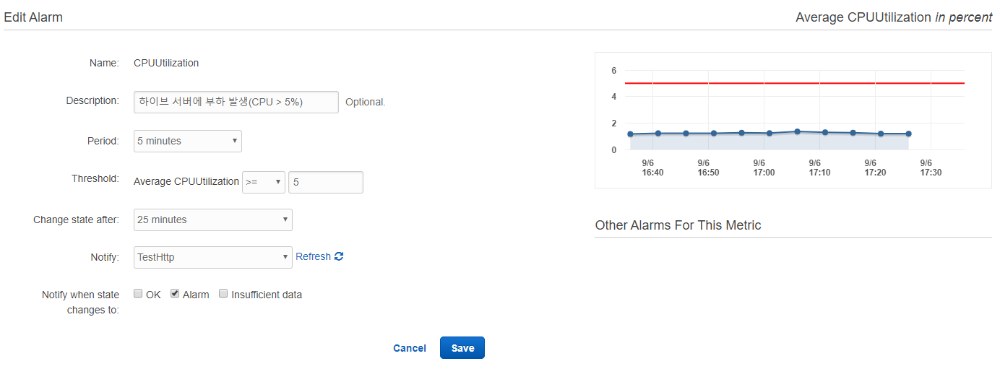
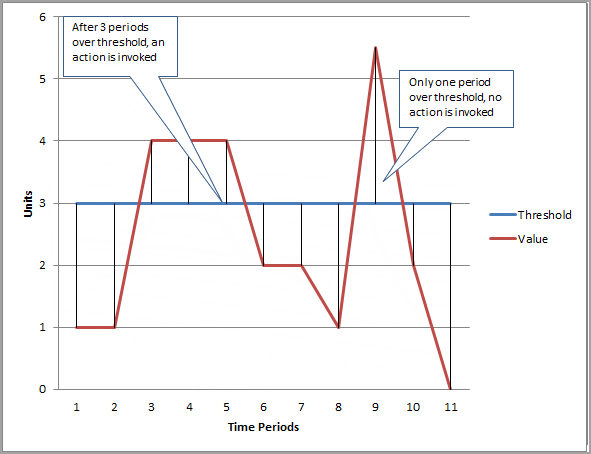
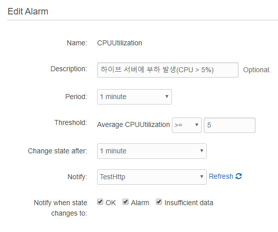
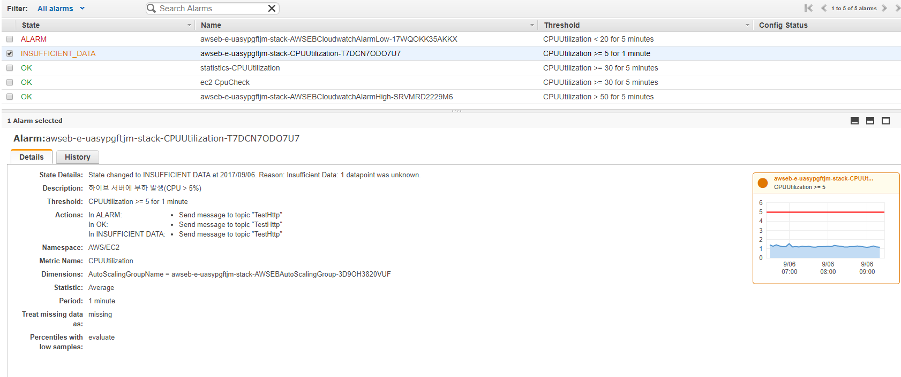
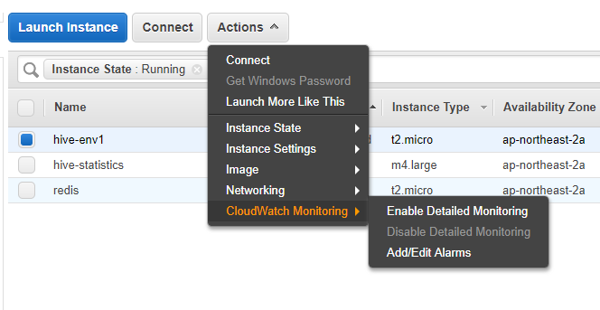

# Elastic Beanstalk Alarms

## Alarm 구성



* Name : 알람 이름
* Description : 이 알람에 대한 간단한 설명
* Period : 측정 간격
  * CloudWatch는 Threshold에 지정한 메트릭 수치가 되었다고 해서 바로 알람을 전달하지는 않고 Period에 지정한 기간 만큼 상태가 유지될 경우에 트리거 된다.
* Threshold : 알람을 트리거 하기 위한 조건
  * 위 조건에서는 해당 머신의 CPU가 5분간 평균 5%이상이 될 경우 트리거
* Change state after : 알람 상태 변경을 트리거 하는 임계 값을 초과 한 후의 시간
  * 이 시간 값이 잘 이해 안됨. 상세한 내용 필요
* Notify : 알람이 변경될 때 알람을 받는 Amazon SNS 항목
* Notify when state changes to : 상태가 다음으로 변경될 때 Amazon SNS를 통해 알림
  * OK : 메트릭이 정의 된 임계 값 내에 있게 된 경우 알림
  * Alarm : 메트릭이 정의 된 임계 값을 초과한 경우 알림
  * Insufficient data : 알람이 방금 시작되었거나 메트릭을 사용할 수 없거나 메트릭이 알람 상태를 결정하는데 사용할 수 있는 데이터가 충분하지 않은 경우 알림


## Alarm 예시

* 알람 설정
  * Period : 2
  * Threshold : 3




* 위 차트를 보면 Time Periods의 3~5 구간동안 Threshold로 지정한 3을 초과하고 있으므로 Period에 지정한 2 값에 충족하기 때문에 ALARM 상태가 된다.
* Time Periods의 9 구간에서는 Threshold를 훨씬 초과하여 5.5 정도의 수치가 되었지만 Period 2가 되기 전에 상태가 회복되었으므로 트리거 되지 않는다. 
  * 결과적으로 경보 상태는 OK로 남음.


## 실제 적용



위와 같이 Period를 1분으로 지정하고 Change state after 또한 1분으로 지정했더니 계속해서 INSUFFICIENT_DATA 알람이 전송되었다. 





INSUFFICIENT_DATA 알람은 트리거를 발동하기 위한 데이터가 부족해서 ALARM에서 OK가 된 것인지 OK에서 ALRAM이 된것인지 판정이 불가능 할 때 발생하게 되는데 1분 설정시에 왜 데이터가 부족한지는 알 수가 없었다. 전달된 메시지를 살펴보니 아래와 같았다.

```json
{
  "AlarmName": "awseb-e-uasypgftjm-stack-CPUUtilization-T7DCN7ODO7U7",
  "AlarmDescription": "하이브 서버에 부하 발생(CPU > 5%)",
  "AWSAccountId": "138011803946",
  "NewStateValue": "INSUFFICIENT_DATA",
  "NewStateReason": "Insufficient Data: 1 datapoint was unknown.",
  "StateChangeTime": "2017-09-06T09:09:10.157+0000",
  "Region": "Asia Pacific (Seoul)",
  "OldStateValue": "OK",
  "Trigger": {
    "MetricName": "CPUUtilization",
    "Namespace": "AWS/EC2",
    "StatisticType": "Statistic",
    "Statistic": "AVERAGE",
    "Unit": null,
    "Dimensions": [
      {
        "name": "AutoScalingGroupName",
        "value": "awseb-e-uasypgftjm-stack-AWSEBAutoScalingGroup-3D9OH3820VUF"
      }
    ],
    "Period": 60,
    "EvaluationPeriods": 1,
    "ComparisonOperator": "GreaterThanOrEqualToThreshold",
    "Threshold": 5.0,
    "TreatMissingData": "",
    "EvaluateLowSampleCountPercentile": ""
  }
}
```

검색을 통해 알아보니 **일반 모니터링의 경우 리포팅 데이터가 5분 간격으로 제공되는 반면 상세 모니터링의 경우 이 간격이 1분**이기 때문에 1분안에 필요한 데이터를 공급받지 못해서 발생하는 것이었다. Period 값을 1분으로 설정하고 싶다면 상세 모니터링 기능을 활성화 시켜야 한다.

- Amazon EC2 인스턴스에 대한 **기본 모니터링**: 사전 선택한 지표 7개를 5분 간격으로, 그리고 상태 확인 지표 3개를 1분 간격으로 모니터링.
  -  추가 비용은 없음
- Amazon EC2 인스턴스에 대한 **세부 모니터링**: 기본 모니터링에서 사용 가능한 모든 지표를 1분 간격으로 확인
  - 추가 비용이 발생 ($2.10 1분 간격일 경우 월별 인스턴스당 최저 0.14 USD)
    - 세부 모니터링은 EC2 인스턴스당 사용자 지정 지표 7개 기준으로 시간에 비례하여 요금이 부과되며, 인스턴스가 CloudWatch로 지표를 전송할 때만 측정
  - 인스턴스에 대한 세부 모니터링을 활성화하면 Amazon EC2 AMI ID 및 인스턴스 유형별로 데이터를 집계할 수 있음


세부 모니터링을 활성화 하기 위해서는 EC2 Instance 페이지로 이동한 후 Action > CloudWatch Monitoring >  Enable Detailed Monitoring을 선택해야 한다.




## 참고

* [Amazon CloudWatch 경보 만들기](http://docs.aws.amazon.com/ko_kr/AmazonCloudWatch/latest/monitoring/AlarmThatSendsEmail.html)
* [인스턴스에 대한 세부 모니터링 활성화 또는 비활성화](http://docs.aws.amazon.com/ko_kr/AWSEC2/latest/UserGuide/using-cloudwatch-new.html)
* [Amazon EC2 모니터링](https://aws.amazon.com/ko/cloudwatch/details/#amazon-ec2-monitoring)
* [CloudWatch 성능 모니터링과 신속한 대응을 위한 노하우](https://www.slideshare.net/awskorea/cloudwatch-aws-cloud-track-3-gaming)


