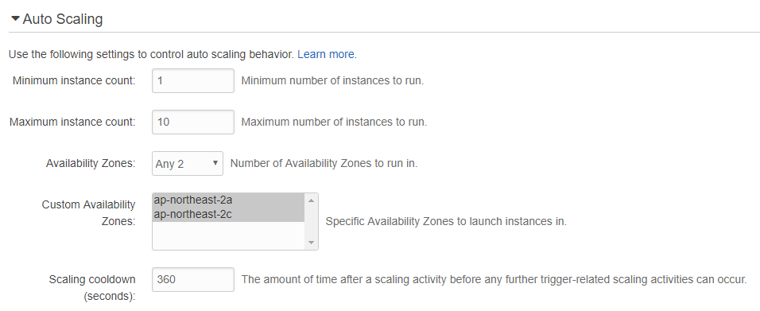

# Elastic Beanstalk Scaling

* Elastic Beanstalk는 로드밸런싱과 자동 확장 환경을 위해 Auto Scaling을 지원
  * 대역폭 사용량이나 CPU 사용량과 같은 메트릭에 따라 자동확장 그룹을 설정(Scaling Trigger)
  * 특정 시간에 스케일 인/아웃이 일어나도록 작업을 예약(Time-based Scaling) 
* Auto Scaling은 Amazon CloudWatch와 함께 작동하여 애플리케이션을 실행하는 EC2 인스턴스의 메트릭을 검색한다.  
* EC2 인스턴스 상태를 모니터링하고 있으며 인스턴스가 예기치 않게 종료되면 Auto Scaling은 종료를 감지하고 대체 인스턴스를 시작하게 된다.
* Auto Scaling 설정은 롤링 업데이트에 영향을 줄 수 있다. 
  * 롤링 업데이트 서비스의 최소 인스턴스 수가 자동확장 그룹의 최대 크기보다 큰 경우 롤링 업데이트를 수행할 수 없다. 

## Scaling 매개변수 설정

### Auto Scaling

* Mininum/Maximum Instance count 설정으로 오토 스케일링 그룹의 최대/최소 크기를 지정할 수 있다.
  * 고정된 수의 EC2 인스턴스를 유지하려면 Minimum과 Maximum을 동일한 값으로 설정
* Availability Zones : 가용 영역 수 지정
  * Elastic Beanstalk를 통해 인스턴스가 구동될 때의 가용영역 수에 따라 해당 가용영역에 포함된다.
  * 여러개의 가용영역이 지정된 경우 하나의 영역을 사용할 수 없게 되더라도 다른 가용영역을 이용할 수 있으므로 여러 가용 영역을 선택하는 것이 좋다.
* Custom Availability Zones : 사용자 지정 가용 영역. 
  * Elastic Beanstalk를 사용하는 리전에서 사용가능한 가용 영역을 지정할 수 있다.
  * 사용자가 지정하지 않는 경우 Elastic Beanstalk가 가용영역을 지정하게 된다.
  * 사용자 지정 가용 영역은 최소한 Avaliability Zones에서 선택한 항목의 수만큼 지정을 해야 한다.
    * 예를 들어 Any 2를 선택한 경우 최소 두개의 사용자 정의 가용 영역을 선택해야 한다.
  * 예약 인스턴스를 구입한 경우 예약 인스턴스 구입 시 지정한 가용영역과 동일하게 지정해야 한다.
  * default VPC 또는 non-VPC 환경에서만 사용자 지정 가용 영역을 만들 수 있다.
* Scaling cooldown(seconds) : 스케일링 재사용 대기시간
  * 오토 스케일링으로 인해 새로운 인스턴스가 생성되면 인스턴스가 구동되는 시간 동안 트래픽을 처리하지 못하기 때문에 준비되는 동안에는 트래픽에 대한 해소가 이루어지지 않을 것이다. 그러면 오토 스케일링 정책에 의해 무한정 EC2 인스턴스가 증가될 수 있으므로, 새로 생성된 EC2 인스턴스가 트래픽을 처리하기 위해 준비를 할 수 있는 시간을 주고 이 시간동안은 스케일 조정 활동을 멈추고 대기하도록 하기 위한 시간을 지정한다.

### Scaling Trigger

오토 스케일링 트리거는 Amazon CloudWatch를 통해 수집된 인스턴스에 대한 메트릭에 따라 작동한다. 

* Trigger measurement : 트리거에 사용될 메트릭 타입
  * CPU 사용률
  * 네트워크 트래픽
  * 디스크 IO
  * 레이턴시
  * 요청 카운트
  * 인스턴스 상태
* Trigger statistic : 트리거 통계. 해당 통계 값을 기반으로 트리거 발생
  * Minimum : 최소
  * Maximum : 최대
  * Sum : 합계
  * Average : 평균
* Unit of measurement : 트리거 측정 단위. 하위 항목들에서 지정하게 될 값의 단위
  * Percent, Count, Byte 등
  * Trigger measurement를 CPU 사용률로 선택했다면 Percent로 지정하고, 요청 카운트인 경우 Count로 지정하는 등 유연한 설정이 가능하다.
* Measurement period : 측정 기간. 위에서 설정한 값들이 여기에 설정된 기간(분)만큼 유지된다면 트리거가 발동한다.
* Breach duration : 위반 지속 시간
  * 위반의 존재 여부를 결정하는데 소요되는 시간
  * 현재 시간과 지정된 시간(분) 사이의 데이터를 보고 위반이 발생했는지 확인
  * 트리거가 실행되기 전에 측정 항목이 정의된 한도(Upper threshold와 Lower threshold 값)를 초과하여 확장 될 수 있는 시간의 양

## 참고

* [Configuring Auto Scaling with Elastic Beanstalk](http://docs.aws.amazon.com/ko_kr/elasticbeanstalk/latest/dg/using-features.managing.as.html)
* ​