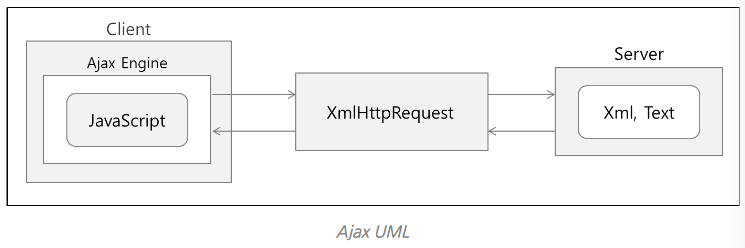

# Ajax

* Ajax는 Asynchronous JavaScript and XML의 약자
* Web에서 화면을 갱신하지 않고 Server로부터 Data를 가져오는 방법.


## 동작원리

* Browser에서 서버로 보낼 Data를 Ajax Engine을 통해 Server로 전송.
* 이 때 Ajax Engine에서는 JavaScript를 통해 DOM을 사용하여 XMLHttpRequest 객체로 Data를 전달.
  * 이 XHR을 이용해서 Server에서 비동기 방식으로 자료를 조회해올 수 있다.
* Server에서 Data를 전달 할 때 화면 전체의 HTML을 전달하지 않고 Text 또는 Xml 형식으로 Browser에 전달한다.




## 왜 Ajax 인가?

* Ajax 이용의 단점
  * Ajax는 Browser의 Version이 낮거나 Ajax를 지원하지 않는 Browser에서는 Ajax 통신을 할 수 없다.
  * 화면의 이동 없이 Data를 송수신하기 때문에 보안상에도 치명적인 문제를 일으킬 수 있다.
  * Script 기반이기 때문에 개발할 때 Debugging이 불편해서 어려움이 발생할 수 있다.
* 이러한 단점에도 불구 하고 Ajax를 사용하면서 얻는 이득과 편리함이 훨씬 많기 때문에 많이 사용한다.
* Ajax를 사용하지 않은 Web Page에서는 Server로 Data를 전송할 때마다 화면 전체를 Refresh 하는 방법을 사용한다.
  * 사용자가 화면내에서 어떠한 작업을 진행하고 있는 경우에도 초기화 될 뿐만 아니라 화면 전체 조회에 의해 Server에 부담을 주며 속도까지 느려지는 현상이 나타난다.
* Ajax를 사용해서 Server와 Data를 주고 받게되면 Server에 보낼 핵심 Data만 전송하기 때문에 화면 깜빡임도 없으며, Server에 부담이 덜하고 속도 문제도 해결할 수 있다.


## Ajax 사용방법

* Ajax의 기본 Method를 이용해서 Server와 통신을 하면 상당히 복잡하다.

  * XMLHttpRequest를 직접 사용하기 때문.
  * jQuery를 이용하면 100줄 정도의 Source를 몇 줄 만으로 간단하게 Server와 Data를 주고 받을 수 있다.

  ```javascript
  $.ajax({
    // URL은 필수 요소
    url : '요청 URL 주소 입력',
    // 다양한 속성들 중에서 필요한 Option을 선택해서 구현
    [, Options]
  });
  ```

* 대표적인 Property들

  | key        | 설명                                |
  | ---------- | --------------------------------- |
  | url        | 요청이 전송되는 URL이 포함된 문자열             |
  | type       | Http 요청 방식 (Get/Post)             |
  | timeout    | Http 요청에 대한 제한 시간 지정(ms)          |
  | success    | Http 요청 성공 시 이벤트 핸들러              |
  | error      | Http 요청 실패 시 이벤트 핸들러              |
  | complete   | Http 요청 완료 시 이벤트 핸들러              |
  | data       | Http 요청 후 return 하는 값             |
  | dataType   | Http 요청 후 return 하는 데이터의 Type     |
  | async      | 요청 시 동기 유무 선택(True/False)         |
  | cache      | 브라우저에 의해 요청되는 페이지를 캐시(True/False) |
  | beforeSend | Http 요청 전에 발생하는 이벤트 핸들러           |
  | global     | 전역함수 활성 여부 설정(True/False)         |


## Ajax를 실제로 사용하며

* 예제 : 회원 가입 시 중복 체크 기능

  * 회원가입 화면에서 기본키로 사용하는 값(회원 아이디, 이메일, 연락처 등)을 입력하는 경우 중복 Check를 통해 사용자에게 사용가능 여부를 입력시 실시간으로 표현.
  * Ajax를 이용하지 않는 다면 중복 Check 시 Page를 Reload해서 정보를 다시 작성해야 한다.
  * Ajax를 통해 Check 대상 값을 Server로 전달하면 화면에 결과를 표시해주는 부분을 독립적으로 표현할 수 있게 된다.

  ```javascript
  function idDuplicationCheck(id) {
    $.ajax({
      type : 'GET',
      url : '서버로 보낼 주소',
      data : {"id", id},
      success : function(data) {
        if(data) {
          alert("사용할 수 없는 아이디 입니다.");
        } else {
          alert("사용 가능한 아이디 입니다.");
        }
      }
      ...
    });
  }
  ```

* 예제2 : 한 화면에 두 종류의 List를 보여주되 List끼리 서로 독립되어 한쪽 List에서 Check하면 화면 갱신 없이 그대로 DB에 저장하고 다른 List에 해당 항목 표시

  ```javascript
  function userList(index) {
    $.ajax({
      url : "서버로 보낼 주소 입력",
      success : function(data) {
        if($("#notifyCheck_" + index).attr("name") == "true") {
          $(("#notifyCheck_" + index).attr("src", "check_off.png"));
        } else {
          $(("#notifyCheck_" + index).attr("src", "check_on.png"));
        }
      }
    });
  }
  ```

  ​

