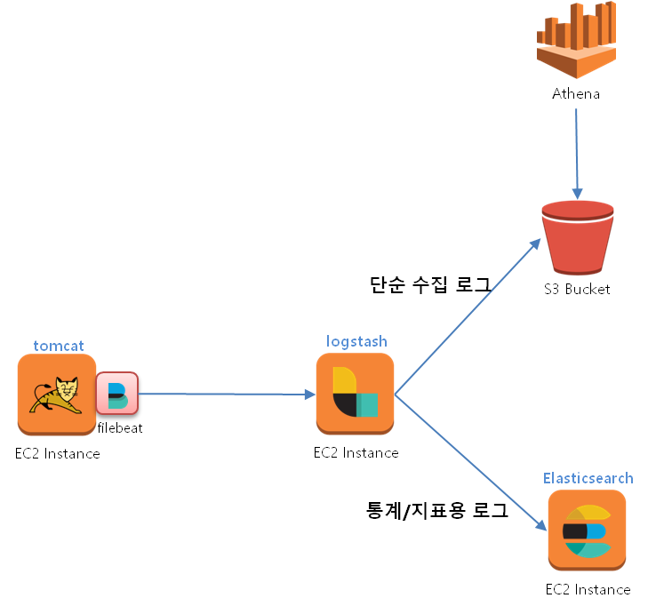
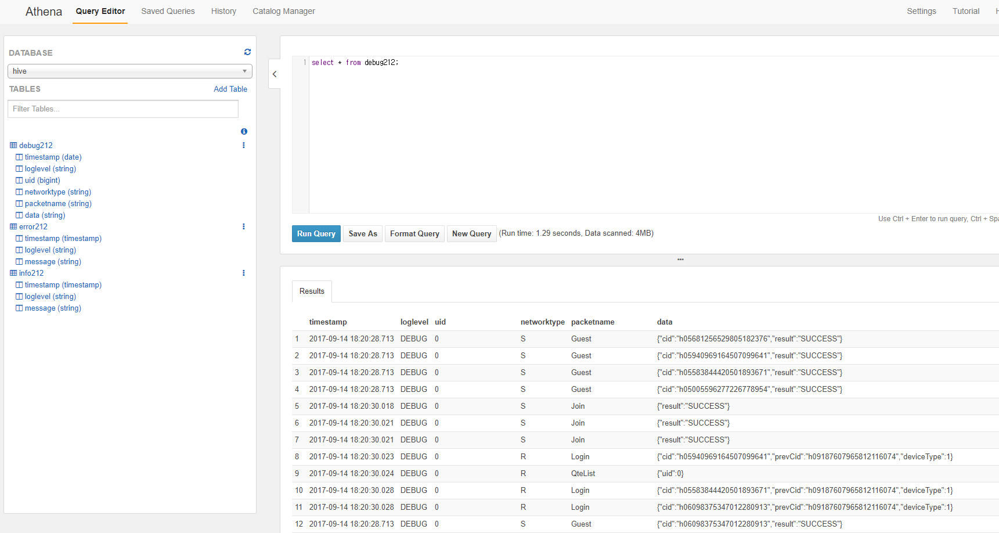

# Amazon Athena

* timestamp 형식에 ISO8601은 지원하지 않음

  * Athena는 Apache Hive를 사용하고 있기 때문에 Hive의 타입 형식을 따른다.
  * [하이브 Timestamp 형식](https://cwiki.apache.org/confluence/display/Hive/LanguageManual+Types#LanguageManualTypes-timestamp)
  * 위 링크에 나와있는 것처럼 date 형식은 일자까지만을 제공하고 timestamp로 해야 ms 단위까지 기록이 가능

  ​

## 아키텍처




## 스키마

* debug 로그

  ```sql
  CREATE EXTERNAL TABLE IF NOT EXISTS hive.debug212 (
    `timestamp` timestamp,
    `logLevel` string,
    `uid` string,
    `networkType` string,
    `packetName` string,
    `data` string 
  )
  ROW FORMAT SERDE 'org.apache.hadoop.hive.serde2.lazy.LazySimpleSerDe'
  WITH SERDEPROPERTIES (
    'serialization.format' = '@',
    'field.delim' = '@',
    'collection.delim' = 'undefined',
    'mapkey.delim' = 'undefined'
  ) LOCATION 's3://hive-server-log2/212/debug/'
  TBLPROPERTIES ('has_encrypted_data'='false');
  ```

* info 로그

  ```sql
  CREATE EXTERNAL TABLE IF NOT EXISTS hive.info212 (
    `timestamp` timestamp,
    `logLevel` string,
    `message` string
  )
  ROW FORMAT SERDE 'org.apache.hadoop.hive.serde2.lazy.LazySimpleSerDe'
  WITH SERDEPROPERTIES (
    'serialization.format' = '@',
    'field.delim' = '@',
    'collection.delim' = 'undefined',
    'mapkey.delim' = 'undefined'
  ) LOCATION 's3://hive-server-log2/212/info/'
  TBLPROPERTIES ('has_encrypted_data'='false');
  ```

* error 로그

  ```sql
  CREATE EXTERNAL TABLE IF NOT EXISTS hive.error212 (
    `timestamp` timestamp,
    `logLevel` string,
    `uid` string,
    `type` string,
    `message` string
  )
  ROW FORMAT SERDE 'org.apache.hadoop.hive.serde2.lazy.LazySimpleSerDe'
  WITH SERDEPROPERTIES (
    'serialization.format' = '@',
    'field.delim' = '@',
    'collection.delim' = 'undefined',
    'mapkey.delim' = 'undefined'
  ) LOCATION 's3://hive-server-log2/212/error/'
  TBLPROPERTIES ('has_encrypted_data'='false');
  ```


## logback 설정

- logback에서 날짜 저장시 debug 레벨과 trace 레벨의 date 형식을 다르게 남겨서 사용
  - trace는 elasticsearch에 저장이 되는데 elasticsearch는 ISO8601과 호환됨


```xml
... 생략 ...
<appender name="DEBUG" class="ch.qos.logback.core.rolling.RollingFileAppender">
    <filter class="ch.qos.logback.classic.filter.LevelFilter">
        <level>DEBUG</level>
        <onMatch>ACCEPT</onMatch>
        <onMismatch>DENY</onMismatch>
    </filter>

    <file>Log/debug.log</file>
    <rollingPolicy class="ch.qos.logback.core.rolling.SizeAndTimeBasedRollingPolicy">
        <!-- %d{dateformat} 형식에서 dateformat에 따라 로그 남기는 주기가 설정됨. yyyy-MM-dd 인 경우 일자별로 로그 파일 생성 -->
        <fileNamePattern>Log/debug-%d{yyyy-MM-dd}.%i.txt</fileNamePattern>

        <!--하나의 로그 파일 용량이 100MB를 초과하면 위 fileNamePattern에서 %i 부분이 카운팅되면서 파일이 생성됨-->
        <maxFileSize>100MB</maxFileSize>

        <!--로그 파일을 유지하는 기간. (일 단위)-->
        <maxHistory>60</maxHistory>

        <!--totalSizeCap에 지정된 용량보다 로그 해당 loglevel의 전체 파일 사이즈가 커지는 경우 이전 파일 제거. 제거는 logback 마음대로 (비동기적, 적절히)-->
        <totalSizeCap>10GB</totalSizeCap>
    </rollingPolicy>

    <encoder>
        <pattern>%d{yyyy-MM-dd HH:mm:ss.SSS}@%level@%msg%n</pattern>
    </encoder>
</appender>

<appender name="TRACE" class="ch.qos.logback.core.rolling.RollingFileAppender">
    <filter class="ch.qos.logback.classic.filter.LevelFilter">
        <level>TRACE</level>
        <onMatch>ACCEPT</onMatch>
        <onMismatch>DENY</onMismatch>
    </filter>
    <file>Log/trace.log</file>
    <rollingPolicy class="ch.qos.logback.core.rolling.SizeAndTimeBasedRollingPolicy">
        <fileNamePattern>Log/trace-%d{yyyy-MM-dd}.%i.txt</fileNamePattern>
        <maxFileSize>100MB</maxFileSize>
        <maxHistory>60</maxHistory>
        <totalSizeCap>10GB</totalSizeCap>
    </rollingPolicy>
    <encoder>
        <pattern>%d{ISO8601}@%level@%msg%n</pattern>
    </encoder>
</appender>

... 생략 ...
    
```


## logstash 설정

* 작업 하면서 한가지 혼동되었던 부분이 있었는데 logstash filter의 date를 통해 날짜 형식으로 변환을 하면 문자열로 logstash에 들어온 데이터가 지정한 날짜 format과 일치하면 해당 일자 정보를 date 형식으로 변환한다. 내가 혼동했던 부분은 지정된 포맷의 형식으로 날짜 타입이 들어간다고 생각했는데 date로 컨버팅된 형식은 YYY-MM-dd'T'HH:mm:ss.SSSZ 형식이 되는 것이었다. 

* date로 변환된 값을 파일에 기록하면 YYY-MM-dd'T'HH:mm:ss.SSSZ형식으로 날짜 값이 남게 되는데 이는 아테나의 timestamp 타입과 호환이 되지 않는다. 즉. ISO8601 타입은 Athena(Apache Hive)에서 지원하지 않는 포맷이다. 

* 웹 서버에서 로그를 남길 때 Athena에서 지원하는 포맷으로 남기고 이 날짜 타입을 Elasticsearch로 전달해야 하는 경우에는 logstash의 date plugin을 사용하여 elasticsearch에서 인식할 수 있는 format으로 변환해서 보내고 S3에 기록할 떄는 서버에서 보낸 문자열 그대로 남기도록 하여 이를 해결하였다.

  * date 플러그인에서 target을 지정하면 변환된 date 타입의 데이터가 target에 지정한 변수에 대입이 된다. 

  * date 타입으로 변환해야 하는 경우 timestamp 값에 변환된 타입으로 다시 대입해서 elasticsearch로 전송

    ```ruby
    date {
      match => [ "timestamp", "yyyy-MM-dd HH:mm:ss.SSS" ]
      target => "timestamp"
    }
    ```

* 로그가 출력되는 형식을 보면 앞서 timestamp를 grok pattern을 사용하여 파싱을 하는 부분에 의해 2017에 20이 짤려나가고 17만 남는 형태로 컨버팅된다.

  ```ruby
  {
      "log_level" => "DEBUG",
        "message" => "2017-09-15 06:46:18.643@DEBUG@4969669887435593900@S@ShopLimitCount@{\"expireSec\":62021,\"limitCounts\":[],\"result\":\"SUCCESS\"}",
           "host" => "yongho-PC",
         "detail" => "4969669887435593900@S@ShopLimitCount@{\"expireSec\":62021,\"limitCounts\":[],\"result\":\"SUCCESS\"}",
      "timestamp" => "17-09-15 06:46:18.643"
  }
  ```

  * 그래서 DATESTAMP 패턴을 사용하지 않고 GREEDYDATA로 문자열형식 그대로 받은 후 date 플러그인의 패턴을 적용하여 date 타입으로 변환한다.
  * 그리고 S3로 기록하는 경우 서버로부터 받은 message 그대로를 기록한다.

* logstash.conf 설정

  ```ruby
  input {
    beats {
      port => 5000
    }
  }
  filter {
    grok {
      match => { "message" => "%{DATESTAMP:timestamp}@%{WORD:log_level}@%{GREEDYDATA:detail}" }
    }

    if [log_level] == "TRACE" {
      date {
        match => [ "timestamp", "yyyy-MM-dd HH:mm:ss.SSS" ]
        target => "timestamp"
      }
      json {
        source => "detail"
      }

      mutate {
        convert => { "uid" => "string" }
      }
    } else {
      date {
        match => [ "timestamp", "yyyy-MM-dd HH:mm:ss.SSS" ]
        target => "hive_timestamp"
      }
      mutate {
        remove_field => [ "@timestamp", "@version" ]
      }
    }

    mutate {
      remove_field => [ "offset", "input_type", "source", "type", "tags", "beat" ]
    }
  }
  output {
    if [log_level] == "TRACE" {
      elasticsearch {
        hosts => "192.168.10.217:9200"
        index => hive_user
        document_type => "%{uid}"
      }
    } else if [log_level] == "DEBUG" {
      s3 {
        access_key_id => "access_key"
        secret_access_key => "secret_access_key"
        region => "ap-northeast-1"
        bucket => "hive-server-log2"
        prefix => "212/debug"
        rotation_strategy => "size_and_time"
        size_file => 5242880
        time_file => 1
        codec => line  {
            format =>  "%{timestamp}@%{log_level}@%{detail}"
        }
      }
    } else if [log_level] == "INFO" {
      s3 {
        access_key_id => "access_key"
        secret_access_key => "secret_access_key"
        region => "ap-northeast-1"
        bucket => "hive-server-log2"
        prefix => "212/info"
        rotation_strategy => "size_and_time"
        size_file => 5242880
        time_file => 1
        codec => line  {
            format =>  "%{timestamp}@%{log_level}@%{detail}"
        }
      }
    } else if [log_level] == "ERROR" {
      s3 {
        access_key_id => "access_key"
        secret_access_key => "secret_access_key"
        region => "ap-northeast-1"
        bucket => "hive-server-log2"
        prefix => "212/error"
        rotation_strategy => "size_and_time"
        size_file => 5242880
        time_file => 1
        codec => line  {
            format =>  "%{timestamp}@%{log_level}@%{detail}"
        }
      }
    }
    stdout{
      codec => rubydebug
    }
  }
  ```

  ​





## 참고

* [logstash 날짜 필터 플러그인](https://www.elastic.co/guide/en/logstash/current/plugins-filters-date.html)
* [grok 패턴](https://github.com/elastic/logstash/blob/v1.4.2/patterns/grok-patterns#L72)
* ​