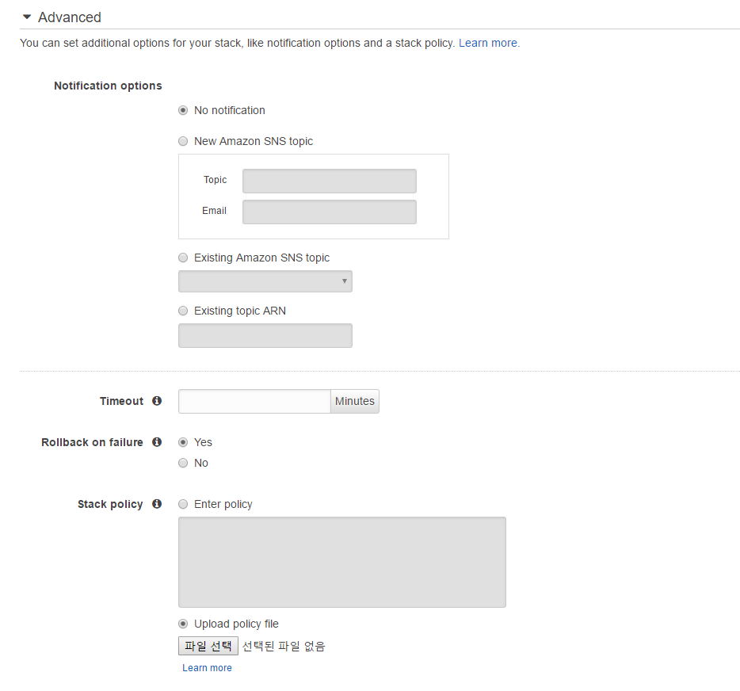

# AWS CloudFormation

* Stack이라는 이름으로 AWS 리소스를 관리
* 간단한 템플릿 파일을 통해 순서대로 자원을 생성하고 이를 연결하는 작업을 자동으로 수행
* 템플릿 파일은 Json 또는 Yaml 형식의 텍스트 파일
  * AWS 리소스의 이름, 속성, 관계 및 프로그램 설치에 대한 정보를 기술 가능
* 연결 정보를 명확히 보여주는 용도로 Designer 사용
  * 드래그앤 드롭 방식
  * CF 템플릿을 만들고 편집 가능
  * AWS 리소스를 쉽게 추가/삭제/수정 가능


* 예제 : testkey라는 이름의 키 쌍을 사용하고, EBS 볼륨이 있는 t1.micro 유형 인스턴스를 프로비저닝.

  * json

    ```json
    {
      "AWSTemplateFormatVersion" : "2010-09-09",
      "Description" : "A sample template",
      "Resources" : {
        "MyEC2Instance" : {
          "Type" : "AWS::EC2::Instance",
          "Properties" : {
            "ImageId" : "ami-2f726546",
            "InstanceType" : "t1.micro",
            "KeyName" : "testkey",
            "BlockDeviceMappings" : [
              {
                "DeviceName" : "/dev/sdm",
                "Ebs" : {
                  "VolumeType" : "io1",
                  "Iops" : "200",
                  "DeleteOnTermination" : "false",
                  "VolumeSize" : "20"
                }
              }
            ]
          }
        }
      }
    }
    ```

  * yaml

    ```yaml
    AWSTemplateFormatVersion: "2010-09-09"
    Description: A sample template
    Resources:
      MyEC2Instance:
        Type: "AWS::EC2::Instance"
        Properties: 
          ImageId: "ami-2f726546"
          InstanceType: t1.micro
          KeyName: testkey
          BlockDeviceMappings:
            -
              DeviceName: /dev/sdm
              Ebs:
                VolumeType: io1
                Iops: 200
                DeleteOnTermination: false
                VolumeSize: 20
    ```

    * AMI (Amazon Machine Image) : 클라우드의 가상 서버인 인스턴스를 시작하는데 필요한 정보 제공.
      * AMI를 통해 EC2 인스턴스 생성.
      * 위의 yaml에서 지정한 ami-2f726546은 해당 AMI의 고유 id로, 이 AMI 이미지를 통해 EC2 인스턴스가 생성됨.
      * 리전에 따라 AMI id가 다르므로 확인 후 사용

아래 부터는 yaml로만 명시


* 위 예제에 Elastic IP를 포함하도록 수정

  ```yaml
  AWSTemplateFormatVersion: "2010-09-09"
  Description: A sample template
  Resources:
    MyEC2Instance:
      Type: "AWS::EC2::Instance"
      Properties: 
        ImageId: "ami-2f726546"
        InstanceType: t1.micro
        KeyName: testkey
        BlockDeviceMappings:
          -
            DeviceName: /dev/sdm
            Ebs:
              VolumeType: io1
              Iops: 200
              DeleteOnTermination: false
              VolumeSize: 20
    MyEIP:
      Type: AWS::EC2::EIP
      Properties:
        InstanceId: !Ref MyEC2Instance
  ```


* AWS CloudForamation을 사용하면 관련 리소스를 스택이라는 단일 단위로 관리
  * 스택 생성/업데이트/삭제를 통해 리소스 모음을 관리
  * **업데이트 시 기존 리소스가 제거되고 만들어지기 때문에 데이터 유실에 주의!**


## 가격

* AWS CloudFormation은 무료 서비스.
  * 스택에 포함된 AWS 리소스에 대해서만 요금 청구


## IAM으로 액세스 제어

* IAM을 사용하면 사용자를 생성하여 AWS 계정의 리소스에 액세스할 수 있는 사용자를 제어할 수 있음.

* 예제1 : 스택에 보기 권한 부여

  ```json
  {
      "Version":"2012-10-17",
      "Statement":[{
          "Effect":"Allow",
          "Action":[
              "cloudformation:DescribeStacks",
              "cloudformation:DescribeStackEvents",
              "cloudformation:DescribeStackResource",
              "cloudformation:DescribeStackResources"
          ],
          "Resource":"*"
      }]
  }
  ```

* 위 예제에 더해 스택 생성 권한과 Amazon SQS 작업 권한 부여

  ```json
  {
      "Version":"2012-10-17",
      "Statement":[{
          "Effect":"Allow",
          "Action":[
              "sqs:*",
              "cloudformation:CreateStack",
              "cloudformation:DescribeStacks",
              "cloudformation:DescribeStackEvents",
              "cloudformation:DescribeStackResources",
              "cloudformation:GetTemplate",
              "cloudformation:ValidateTemplate"  
          ],
          "Resource":"*"
      }]
  }
  ```

* 예제2 : 스택 삭제 및 업데이트 작업 거부 권한 부여

  ```json
  {
      "Version":"2012-10-17",
      "Statement":[{
          "Effect":"Deny",
          "Action":[
              "cloudformation:DeleteStack",
              "cloudformation:UpdateStack"
          ],
          "Resource":"arn:aws:cloudformation:us-east-1:123456789012:stack/MyProductionStack/*"
      }]
  }
  ```

  ​


## 연습해보기

* 워드프레스 구성 예제
* 예제를 완료하면 리소스에 대해 최소한의 비용이 발생함.


### EC2 인스턴스 구성


* 리소스 설정

  ```yaml
  Resources: 
    ...    
    WebServer:
      Type: AWS::EC2::Instance
      Properties:
        ImageId: !FindInMap [AWSRegionArch2AMI, !Ref 'AWS::Region', !FindInMap [AWSInstanceType2Arch, !Ref InstanceType, Arch]]      
        InstanceType:
          Ref: InstanceType
        KeyName:
          Ref: KeyName
        SecurityGroups:
        - Ref: WebServerSecurityGroup
        UserData:
          Fn::Base64: !Sub |
             #!/bin/bash -xe
             yum update -y aws-cfn-bootstrap
             /opt/aws/bin/cfn-init -v --stack ${AWS::StackId} --resource WebServer --configsets wordpress_install --region ${AWS::Region}
             /opt/aws/bin/cfn-signal -e $? --stack ${AWS::StackId} --resource WebServer --region ${AWS::Region}
      ...
    ...
    
    WebServerSecurityGroup:
      Type: AWS::EC2::SecurityGroup
      Properties:
        GroupDescription: "Enable HTTP access via port 80 locked down to the load balancer + SSH access"
        SecurityGroupIngress:
        - CidrIp: 0.0.0.0/0
          FromPort: '80'
          IpProtocol: tcp
          ToPort: '80'
        - CidrIp: !Ref SSHLocation
          FromPort: '22'
          IpProtocol: tcp
          ToPort: '22'

    ...    
  ```

* EC2 인스턴스 속성

  ```yaml
  Parameters:
    ...      
    KeyName:
      ConstraintDescription: must be the name of an existing EC2 KeyPair.
      Description: Name of an existing EC2 KeyPair to enable SSH access to the instances
      Type: AWS::EC2::KeyPair::KeyName
    InstanceType:
      AllowedValues:
      - t1.micro
      - t2.nano
      - t2.micro
      - t2.small
      - t2.medium
      - t2.large
      - m1.small
      - m1.medium
      - m1.large
      - m1.xlarge
      - m2.xlarge
      - m2.2xlarge
      - m2.4xlarge
      - m3.medium
      - m3.large
      - m3.xlarge
      - m3.2xlarge
      - m4.large
      - m4.xlarge
      - m4.2xlarge
      - m4.4xlarge
      - m4.10xlarge
      - c1.medium
      - c1.xlarge
      - c3.large
      - c3.xlarge
      - c3.2xlarge
      - c3.4xlarge
      - c3.8xlarge
      - c4.large
      - c4.xlarge
      - c4.2xlarge
      - c4.4xlarge
      - c4.8xlarge
      - g2.2xlarge
      - g2.8xlarge
      - r3.large
      - r3.xlarge
      - r3.2xlarge
      - r3.4xlarge
      - r3.8xlarge
      - i2.xlarge
      - i2.2xlarge
      - i2.4xlarge
      - i2.8xlarge
      - d2.xlarge
      - d2.2xlarge
      - d2.4xlarge
      - d2.8xlarge
      - hi1.4xlarge
      - hs1.8xlarge
      - cr1.8xlarge
      - cc2.8xlarge
      - cg1.4xlarge
      ConstraintDescription: must be a valid EC2 instance type.
      Default: t2.small
      Description: WebServer EC2 instance type
      Type: String
  ...
  ```


위 예제는 구조를 설명하기 위한 내용이었고 실제 템플릿을 사용하여 stack을 생성할 때는 아래 URL만 입력해주면 된다.

```
https://s3-ap-northeast-1.amazonaws.com/cloudformation-templates-ap-northeast-1/WordPress_Single_Instance.template
```

* **s3 버킷의 region이 현재 사용 중인 region과 동일해야함.**




* Advanced : 추가 옵션
  * Notification options : CloudFormation 스택 이벤트가 발생하면 SNS로 알림 전송
  * Timeout : 스택 생성을 시작하고 설정된 시간 이상 지나면 스택 생성에 실패한것으로 간주하고 모든 AWS 리소스와 설정을 되돌린다.
    * 설정되어 있지 않은 경우 스택 생성이 성공할 때까지 대기
  * Rollback on failure : 스택을 생성하다가 중간에 실패하면 AWS 리소스와 설정을 되돌린다.
  * Stack policy : 스택 업데이트 정책
    * 실수로 생성된 스택의 설정을 변경하지 않도록 설정할 수 있다.


## 템플릿 기본 구조

```json
{
  "Description" : "A text description for the template usage",
  "Parameters" : {
    // A set of inputs used to customize the template per deployment
  },
  "Resources" : {
    // The set of AWS resources and relationships between them
  },
  "Outputs" : {
    // A set of values to be made visible to the stack creator
  },
  "AWSTemplateFormatVersion" : "2010-09-09"
}
```


* Description : 템플릿의 설명
* Parameters : 템플릿으로 스택을 생성할 때 사용자가 입력할 매개변수 목록.
  * 숫자와 문자열 형식 사용 가능
* Resources : AWS 리소스 종류와 옵션.
  * AWS 리소스간의 관계 정의
* Outputs : 스택을 생성한 뒤 출력할 값.
* AWSTemplateFormatVersion : 현재 템플릿 구조의 버전.
  * 이 버전이 맞지 않으면 템플릿으로 스택을 만들 수 없음.


## 내장 함수

* 내장함수는 Fn으로 시작하며 `::` 구분자를 사용한다.

* json 형식에서는 함수명을 key로 인자를 value로 지정하여 사용.

  ```json
  { "Fn::Base64" : valueToEncode }
  ```

* yaml 형식에서는 `!`를 사용하여 표현

  ```yaml
  !Base64 valueToEncode
  ```

  ​

### Fn::FindInMap

Fn::FindInMap을 사용하면 인자로 ["맵 이름",  "최상위 키", "두번째 수준의 키" ] 를 전달하여 해당 맵에서 값을 얻어올 수 있다. 

```json
...
  "Mappings" : {
    "RegionMap" : {
      "us-east-1" : { "32" : "ami-6411e20d", "64" : "ami-7a11e213" },
      "us-west-1" : { "32" : "ami-c9c7978c", "64" : "ami-cfc7978a" },
      "eu-west-1" : { "32" : "ami-37c2f643", "64" : "ami-31c2f645" },
      "ap-southeast-1" : { "32" : "ami-66f28c34", "64" : "ami-60f28c32" },
      "ap-northeast-1" : { "32" : "ami-9c03a89d", "64" : "ami-a003a8a1" }
    }
  },
  "Resources" : {
    ...
        "Properties" : {
           "ImageId" : { "Fn::FindInMap" : [ "RegionMap", { "Ref" : "AWS::Region" }, "32"]},
           ...
        }
     ...
   }
...
```

여기서는 RegionMap이라는 맵에서 AWS::Region을 참조하므로 현재 리전에 해당하는 ap-northeast-1이 전달될 것이고 두번쨰 수준의 키로는 32를 넘겨서 결과적으로는 ami-9c03a89d 를 얻어온다.


### Fn::Base64

* 입력 문자열의 Base64 표현을 반환.

* 대게 인코딩 된 데이터를 UserData 속성을 통해 Amazon EC2 인스턴스에 전달하는데 사용.

  ```json
  ...
  "Resources" : {
    "Ec2Instance" : {
      ...
      "UserData" : {
        "Fn::Base64" : {
          "Fn::Join" : [ "",
            ["#!/bin/bash\n",
             "/opt/aws/bin/cfn-init --region ", {"Ref" : "AWS::Region"},
             " -s ", {"Ref" : "AWS::StackName"},
             " -r Ec2Instance\n"
            ]
          ]
        }
      }
      ...
    }
  }
  ```

  * UserData는 EC2 인스턴스가 생성된 직후 실행할 스크립트
  * `/opt/aws/bin/cfn-init`은 CloudFormation에서 기본적으로 제공하는 Bootstrap 스크립트
  * 여기서 cfn-init을 실행해야 AWS::CloudFormation::Init 설정을 통해 packages에서 정의한 패키지를 설치할 수 있고, services에서 정의한 패키지를 실행할 수 있다.
  * cfn-init의 -r 옵션에는 생성될 EC2 인스턴스의 리소스 ID를 지정해야 한다.


### Fn::Join

* 지정된 값을 하나의 값에 추가하고 지정된 구분 기호로 구분

* 구분 기호가 빈 문자열인 경우 값 집합은 구분기호 없이 연결됨.

* 예제 : `a:b:c`를 리턴

  * json

    ```json
    "Fn::Join" : [ ":", [ "a", "b", "c" ] ]
    ```

  * yaml

    ```yaml
    !Join [ ":", [ a, b, c ] ]
    ```

    ​


## 주의

* CloudFormation 템플릿 파일에는 한글 사용 불가능

* 템플릿 파일은 UTF-8 인코딩으로 저장해야 하며 BOM(Byte Order Mark)이 없어야 함.

  * Vim에서 BOM 제거

    ```
    :set nobomb
    :wq
    ```


## 참고

* [AWS CloudFormation](http://docs.aws.amazon.com/AWSCloudFormation/latest/UserGuide/Welcome.html)
* [Wordpress CloudFormation Template](https://s3-ap-northeast-1.amazonaws.com/cloudformation-templates-ap-northeast-1/WordPress_Single_Instance.template)
* [AWS Resource Types](http://docs.aws.amazon.com/AWSCloudFormation/latest/UserGuide/aws-template-resource-type-ref.html)
* [내장 함수](http://docs.aws.amazon.com/AWSCloudFormation/latest/UserGuide/intrinsic-function-reference.html)

