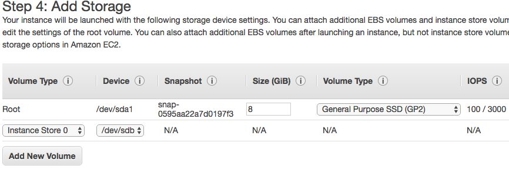
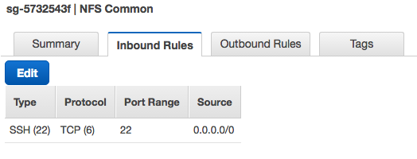
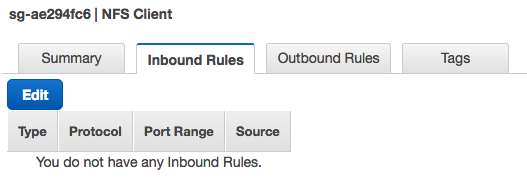

# EC2 인스턴스로 NFS 서버 역할

* 여러 EC2 인스턴스 사이에 블록 레벨 스토리지를 동시에 공유
* 네트워크 파일 시스템(Network File System) 프로토콜을 활용
* EC2 인스턴스 한 대가 NFS 역할을 하며 NFS를 통해 자원을 공유
* 다른 EC2 인스턴스(NFS 클라이언트)는 네트워크 연결을 통해 NFS 서버에서 NFS 공유를 마운트
* 대기 시간을 줄이기 위해 NFS 서버에는 인스턴스 스토어를 사용
  * 인스턴스 스토어는 내구성이 아주 높지는 않기 때문에 사용자가 신경써야함
* EBS 볼륨은 NFS 서버에 연결되고 일정한 간격으로 데이터를 동기화
  * 최악의 상황은 마지막 동기화가 유실된 이후 모든 데이터가 변경된 경우
* 만약 NFS 서버 역할을 하는 EC2 인스턴스에 장애가 생기면 어떤 NFS 클라이언트도 공유 파일에 접근할 수 없다.
  * SPOF (Single Point Of Failure) - 단일 장애 지점
  * EFS나 GlusterFS 설치를 고려
  * EFS는 한국 리전을 사용할 수 없고 비용도 EBS보다 세배가량 비쌈
  * GlusterFS는 외부 툴이라 사용법을 학습하는 시간이 필요
* 구성 절차
  1. 보안 그룹을 추가하여 안전한 NFS를 만든다.
  2. NFS 서버용 EC2 인스턴스와 EBS 볼륨을 추가
  3. NFS 서버용 설치 및 구성 스크립트 생성
  4. NFS 클라이언트용 EC2 인스턴스를 추가

## 인스턴스 스토어

* 일반 하드 디스크와 같은 블록 레벨 스토리지
* 인스턴스 스토어는 EC2 인스턴스의 일부고, 인스턴스가 실행 중일 때만 사용할 수 있다.
* 인스턴스를 중지하거나 종료하면 데이터도 사라진다.
* 비용은 따로 지불하지 않고 EC2 인스턴스 가격에 포함
* 가상 서버에 네트워크로 연결되는 EBS 볼륨과 달리 인스턴스 스토어는 가상 서버의 일부이므로 가상 서버 없이는 존재할 수 없다.
* 손실되면 안되는 데이터는 인스턴스 스토어에 보관하면 안됨.
* 여러 서버에 데이터를 복제하는 애플리케이션에 사용한다.
* EC2 인스턴스 유형에 따라 인스턴스 스토어 사용 유무가 결정된다.
  * 가장 저렴했던 유형은 r3.large (시간당 $0.2)
* Add Storage 단계에서 추가 할 수 있다.
  

## NFS용 보안 그룹

* NFS 서버는 NFS에 필요한 포트 (TCP와 UDP : 111, 2049)로 접근할 수 있어야 한다.
  * NFS 클라이언트만이 해당 포트로 접근 가능하도록 해야 함NFS 클라이언트만이 해당 포트로 접근 가능하도록 해야 함
* NFS Common의 보안 그룹
  
  * NFS 서버와 클라이언트에 적용하여 SSH를 어디서든 접속할 수 있게 함.
  * 테스트를 편하게 하기 위해 허용한 것이므로 실 서비스에서는 보안 규칙을 강화해야함.
* NFS 클라이언트의 보안 그룹
  
* NFS 서버의 보안 그룹
  
  * Source를 NFS 클라이언트의 보안그룹으로 지정하여 NFS 클라이언트 보안 그룹이 적용된 EC2 인스턴스에서만 접근 가능하도록 함

## NFS 서버와 볼륨

* NFS 서버용 인스턴스는 인스턴스 스토어를 제공하는 유형이어야 한다.
* NFS 서버는 부팅 시 NFS를 설치하고 구성해야 한다.
  * 배시 스크립트 사용
* 데이터 손실을 방지하기 위해 인스턴스 스토어에 대한 백업 용도로 EBS 볼륨을 생성
* NFS 서버 구동 시 UserData
  ```shell
  #!/bin/bash -ex
  apt-get update
  apt-get install nfs-kernel-server
  mkdir /var/nfs/general -p
  chown nobody:nogroup /var/nfs/general
  chmod 777 /var/nfs/general
  echo "/var/nfs/general *(rw,sync,no_subtree_check)" >> /etc/exports
  systemctl restart nfs-kernel-server
  ```
* NFS 클라이언트 구동 시 UserData
  ```shell
  #!/bin/bash -ex
  apt-get install -y nfs-common
  mkdir -p /nfs/general
  mount <NFS 서버 IP>:/var/nfs/general /nfs/general
  ```


## 참고

* [NFS 서버/클라 설치](https://www.digitalocean.com/community/tutorials/how-to-set-up-an-nfs-mount-on-ubuntu-16-04)
* [docker volume 생성 및 마운트](https://github.com/moby/moby/issues/25202)