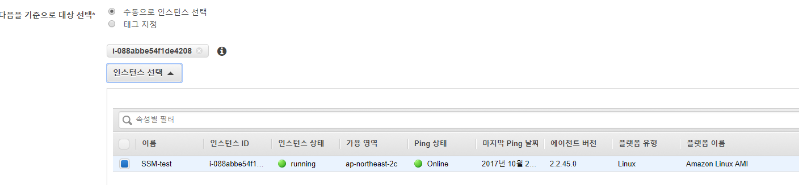

# EC2 Instance 명령 실행

원격지에서 특정 EC2 인스턴스로 명령을 실행하기 위해서는 Run Command 기능을 활용하면 된다.  Run Command 명령은 EC2 인스턴스 페이지 > SYSTEMS MANAGER 서비스 > 명령 실행을 통해 수행되는데 이를 위해서는 EC2 인스턴스에 SSM 에이전트가 설치되어 있어야 한다. 


## SSM 에이전트 설치

SSM 에이전트 설치를 위해 EC2 인스턴스 구동 시 UserData 에 아래 스크립트를 입력한다. Amazon Linux 64비트 머신이 아닌 경우 [설치가이드](https://docs.aws.amazon.com/ko_kr/systems-manager/latest/userguide/sysman-install-ssm-agent.html) 참고

```shell
#!/bin/bash
cd /tmp
sudo yum install -y https://s3.amazonaws.com/ec2-downloads-windows/SSMAgent/latest/linux_amd64/amazon-ssm-agent.rpm
sudo start amazon-ssm-agent
```

설치 후 정상 동작을 확인하기 위해서 상태확인 후 Stopped 상태라면 서비스를 시작한다.

```shell
$ sudo status amazon-ssm-agent
$ sudo start amazon-ssm-agent
```

* 로그 파일
  * /var/log/amazon/ssm/amazon-ssm-agent.log
  * /var/log/amazon/ssm/errors.log


## IAM Role 설정

System Manager를 사용하기 위해서는 사용자 계정과 SSM Agent가 설치될 EC2 인스턴스에 System Manager 접근이 가능하도록 역할이 지정되어야 한다.  Role 지정이 제대로 되지 않으면 SSM agent 로그에서 권한 관련 에러가 발생한다. 

```
2017-10-21 08:24:20 ERROR [ProcessAssociation @ processor.go.159] [instanceID=i-088abbe54f1de4208] [MessagingDeliveryService] [Association] Unable to load instance associations, unable to retrieve associations unable to retrieve associations NoCredentialProviders: no valid providers in chain. Deprecated.
        For verbose messaging see aws.Config.CredentialsChainVerboseErrors
```

역할을 생성하기 위해 IAM Role 생성 창으로 들어가면 System Manager의 권한을 허용하기 위한 Role 템플릿이 존재하므로 간편하게 생성할 수 있다.


Role 생성 후 로그를 확인하면 아래와 같이 Health Check에 성공했다는 메시지를 확인할 수 있다.

```
2017-10-21 08:32:11 INFO [instanceID=i-088abbe54f1de4208] [HealthCheck] HealthCheck reporting agent health.
```


## 명령 실행

Health Check 성공 후 명령 실행 창으로 들어가보면 Shell Script 실행을 선택하면 SSM 사용이 가능한 인스턴스 리스트에서 위에 Role을 설정한 EC2 인스턴스가 선택가능해진다. 



이제 shell script를 정의하여 실행하면 해당 EC2 인스턴스로 명령이 수행된다.