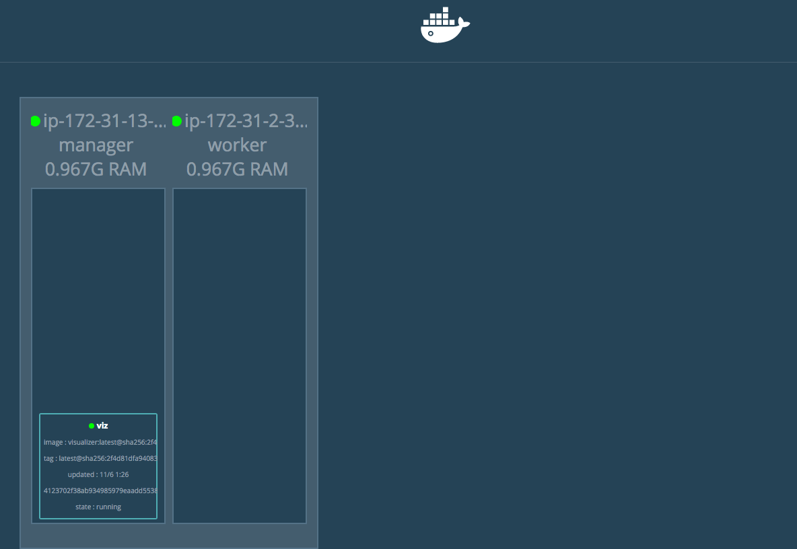
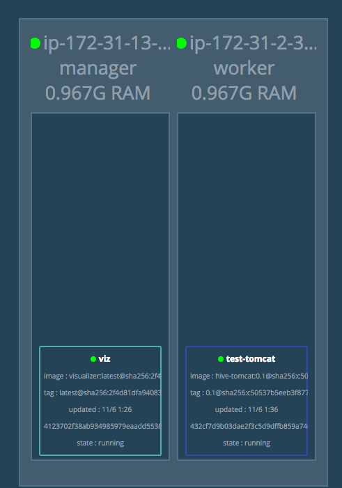
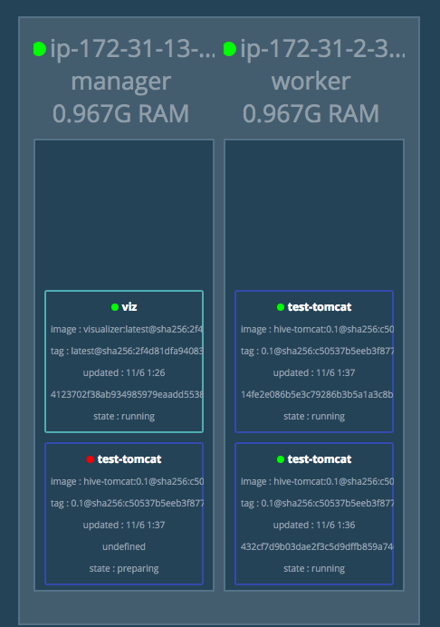
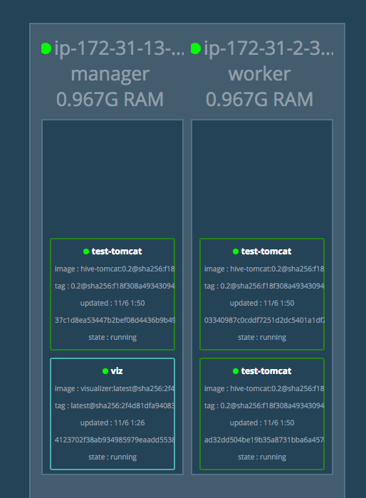

이전 포스팅을 통해서 docker swarm manager와 worker 노드의 구성이 완료 되었다면 이제 실제로 서비스를 생성하여 각 노드들에 어떻게 컨테이너들이 구동되는지 살펴볼 차례이다. 


## visualizer

`docker node ls`명령과 `docker service ls` 명령을 통해서 각 노드들과 서비스의 상태를 파악할 수 있지만 콘솔창에 출력되는 텍스트만으로는 보기가 불편하기 때문에 **visualizer를 통해 이를 시각화**하여 볼 수 있도록 한다.

*  visualizer 구동

  ```shell
  $ docker service create --name=viz --publish=5000:8080/tcp --constraint=node.role==manager --mount=type=bind,src=/var/run/docker.sock,dst=/var/run/docker.sock dockersamples/visualizer
  ```

visualizer는 2016년의 DockerCon US에서 시연용으로 제작된 것이었지만 편리함 때문에 계속해서 업데이트가 되고 있다. 위 명령을 살펴보면 manager 노드에만 생성되도록 하였고 5000번 포트를 통해 포워딩하고 있다. `http://<서버주소>:5000` 포트로 접속을 해보면 아래와 같은 페이지가 출력된다.



이제 이 visualizer를 통해 docker swarm에 service를 하나씩 띄워보면서 생성되는 현황을 살펴보도록 한다. 


## service 생성

먼저 테스트용으로 구성한 이미지를 ECR의 리파지토리를 통해 가져와서 서비스를 생성한다. 

* 테스트용 tomcat 서비스 생성

  ```shell
  $ docker service create --name test-tomcat --publish 8080:8080 --mount type=bind,src=/home/ubuntu/logs,dst=/usr/local/tomcat/logs --with-registry-auth 138011803946.dkr.ecr.ap-northeast-1.amazonaws.com/test-tomcat:0.1
  ```

몇가지 커스텀 액션이 들어간 부분이 있는데 `--mount`옵션을 통해 **로그파일이 저장될 디렉토리를 지정**하였다. 이유는 swarm을 통해 생성된 서비스들은 각각 컨테이너 안에서 로그를 관리하는 것보다 각 노드 단위로 로그를 관리하는 것이 편했기 때문이었다. 

그리고 한가지 눈여겨 볼 부분은 `--with-registry-auth` 옵션인데 이 옵션을 지정하지 않으면 ECR을 통해 이미지를 내려받는 것이 실패하게 된다. 이 옵션을 사용하면 **registry에 대한 인증 정보를 에이전트들에게 전달**하게 되고 이미지 pull에 성공한다.

만약 서비스 생성시에 컨테이너를 여러개 띄우고 싶은 경우에는 `--replicas` 옵션을 사용하여 원하는 수를 지정하면 그 수만큼 컨테이너가 생성된다.

위 명령을 수행하면 visualizer를 통해 한개의 톰캣 서비스가 아래와 같이 생성된 것을 확인할 수 있다.




## 로그를 남기기 위한 고려사항

위에서 언급했듯이 각 컨테이너에 로그를 남기면 관리가 어려워서 **로그를 남기기 위한 정책이 필요**하다. 나의 경우에는 3가지를 고려하게 되었다.

첫번째로는 **EFS를 사용하여 EC2 인스턴스 간 공유 디렉토리를 사용하는 방법**이 있었는데, EFS는 서울 리전에 서비스 되지 않았고 다음으로 가까운 도쿄 리전에도 서비스가 제공되지 않았다. 가장 가까운 리전이 싱가포르였는데 레이턴시 문제와 EBS보다 가격이 세배 가량 비싸다는 이유 때문에 고려사항에서 제외시켰다.

두번째로 **EC2 인스턴스 간 NFS를 통해 파일을 공유하는 방법**을 생각해봤다. 이를 이용하면 모든 로그 파일을 관리하게 될 EC2 인스턴스만 따로 두면 되므로 서울 리전에서 사용 가능하여 레이턴시 문제가 해결되고, 가격 또한 EC2 인스턴스와 EBS를 사용하기 때문에 문제될 것은 없었다. 하지만 NFS 서버 역할을 하는 EC2 인스턴스에 장애가 생기면 모든 로그가 유실될 수 있고 모든 서버에 영향이 가기 때문에 위험성이 너무 크다고 판단하여 고려사향에서 제외시켰다.

마지막으로는 **각 EC2 인스턴스에서 볼륨을 지정하여 구동되고 있는 각 컨테이너에 대한 로그를 한곳에 집중 시키는 방법**을 생각하게 되었다. `--mount` 옵션을 사용해서 호스트에 지정된 디렉토리로 각 컨테이너의  로그 디렉토리를 마운트하고 호스트에서는 filebeat를 사용하여(내부에서 로그에 대한 수집 및 집계는 ELK로 하고 있음) 한 디렉토리에 남게된 로그들을 logstash 서버로 전송하게끔 하였다. tomcat 서버에서 남긴 로그를 filebeat를 통해 logstash로 전달하는 과정은 이 포스팅을 참고

결국 세가지 고려사항 중에서는 마지막 방법을 사용했지만 단순히 tomat 컨테이너의 로그 디렉토리를 마운트하는 것만으로는 호스트에 쌓이는 **로그 파일명이 컨테이너마다 동일하기 때문에 덮어 씌워지는 문제가 발생**한다.


## 각 컨테이너별 로그 설정

위에서 얘기했던 것처럼 동일한 로그 파일명으로 인해 덮어씌워지는 문제를 해결하기 위해 **각 컨테이너별로 hostname의 디렉토리를 생성하여 해당 디렉토리에 로그를 남기도록 설정**하였다. 

### tomcat 로그 파일이 생성될 디렉토리 변경

tomcat의 conf 디렉토리에 있는 logging.properties 파일을 열어보면 아래와 같이 각 로그들이 작성될 규칙들이 명시되어있다. 

* conf/logging.properties 파일에서 로그 기록 규칙

```shell
... 생략 ...
1catalina.org.apache.juli.AsyncFileHandler.level = FINE
1catalina.org.apache.juli.AsyncFileHandler.directory = ${catalina.base}/logs
1catalina.org.apache.juli.AsyncFileHandler.prefix = catalina.
... 생략 ...
```

여기서 directory 부분에 해당 컨테이너의 호스트 이름을 추가해주면 되는데 여기서는 hostname을 얻어올 방법이 없다. 그래서 톰캣을 구동 시키는 **bin/catalina.sh 쉘 스크립트에 hostname을 인자로 전달**하는 부분을 추가해주었다.

* catalina.sh 파일에서 JAVA_OPTS 설정에 인자를 추가하여 hostname 전달

  ```shell
  -Dcustom.hostname=$HOSTNAME
  ```

  * 여기서 custom.hostname은 변수명과 같은 것이므로 다른 변수들과 겹치지만 않는다면 자유롭게 지정해도 된다.

이제 conf/logging.properties 파일에서 hostname 값을 가져와서 사용할 수가 있다. 아래와 같이 설정한다.

* conf/logging.properties 파일을 수정하여 로그파일이 생성될 경로에 hostname을 포함

  ```shell
  ... 생략 ...
  1catalina.org.apache.juli.AsyncFileHandler.level = FINE
  1catalina.org.apache.juli.AsyncFileHandler.directory = ${catalina.base}/logs/${custom.hostname}
  1catalina.org.apache.juli.AsyncFileHandler.prefix = catalina.
  ... 생략 ...
  ```

  * catalina 로그 외에 다른 로그들도 하위에 명시가 되어 있으므로 전부 변경해준다.

한가지 더 수정해주어야 하는 부분이 있는데 **tomcat 액세스 로그에 대한 설정은 logging.properties가 아닌 conf/server.xml에서 설정**을 해야 한다. 

* conf/server.xml 파일에도 로그 파일이 생성될 경로에 hostname 추가

  ```xml
  ... 생략 ...
  <Valve className="org.apache.catalina.valves.AccessLogValve" directory="logs/${custom.hostname}"
     prefix="localhost_access_log" suffix=".txt"
     pattern="%h %l %u %t &quot;%r&quot; %s %b" />
  ... 생략 ...
  ```

  * directory 속성에 인자로 전달한 `${custom.hostname}` 추가

이렇게 하면 톰캣에서 남기는 로그에 대한 경로 지정은 마무리 된다. 하지만 현재 사내에서 tomcat을 통해 구동시키는 웹서버는 서블릿 기반으로 되어 있고 logback을 사용하여 로그를 남기고 있기 때문에 코드 상에서도 동일한 경로에 로그가 남도록 설정을 해주어야 한다. 


## logback 로그 파일이 생성될 디렉토리 변경

logback에 대한 로그를 남기는 설정은 logback.xml 파일에 정의하게 된다. 여기서도 마찬가지로 hostname을 얻어올 방법이 없다. 그래서 톰캣에서 인자로 hostname을 전달한 것과 비슷하게 logback.xml에서 사용할 수 있도록 hostname을 전달해주어야 한다. 

이를 위해 **Servlet을 초기화하는 자바코드에서 호스트명을 저장**하도록 구현한다. System Property에 값을 저장하면 logback.xml에서 사용할 수가 있다.

*  Servlet 초기화 코드에서 hostname을 System Property에 저장

  ```java
  ... 생략 ...
  try {
      System.setProperty("hostName", InetAddress.getLocalHost().getHostName());
  } catch (UnknownHostException e) {
      System.out.println("Error Message : " + e.getMessage());
      e.printStackTrace();
  }
  ... 생략 ...
  ```

하지만 EC2 인스턴스에서 InetAddress를 사용하여 hostName을 얻어오면 null값이 반환되는 문제가 발생했다. 찾아보니 InetAddress는 해당 OS에 설정된  DNS를 통해 hostname을 가져온다고 한다. tomcat docker 컨테이너에서는 호스트명이 무조건 컨테이너 ID로 지정되기 때문에 굳이 InetAddress  사용하지 않아도 될 것이라 판단하고 `System.getenv("HOSTNAME")`를 통해서 hostname을 얻어왔다.

* Servlet 초기화 코드에서 System.getenv를 통해 hostname을 System Property에 저장

  ```java
  ... 생략 ...
  String hostName = System.getenv("HOSTNAME");

  if(StringUtils.isEmpty(hostName)) {
      try {
          hostName = Inet4Address.getLocalHost().getHostName();
      } catch (UnknownHostException e) {
          e.printStackTrace();
          System.out.println(e.getMessage());
      }
  }
  System.setProperty("hostName", hostName);
  ... 생략 ...
  ```

  * 혹시나 하는 마음에 System.getenv로 hostname을 가져오지 못할 경우 Inet4Address를 통해 가져오도록 하였다.

이제 System Property에 hostname이 담겼으니 logback.xml에서 사용할 차례이다. System Property에 저장한 키 값을 참조하여 경로를 수정한다.

* logback.xml 파일의 디렉토리 경로 수정

  ```shell
  ... 생략 ...
  <appender name="DEBUG" class="ch.qos.logback.core.rolling.RollingFileAppender">
      ...
      <file>/usr/local/tomcat/logs/${hostName}/debug.log</file>
      <rollingPolicy class="ch.qos.logback.core.rolling.SizeAndTimeBasedRollingPolicy">
          <!-- rollover daily -->
          <fileNamePattern>/usr/local/tomcat/logs/${hostName}/debug-%d{yyyy-MM-dd_HH-mm-ss}.%i.txt</fileNamePattern>
          ...
      </rollingPolicy>
      ...
  </appender>
  ... 생략 ...
  ```

  * DEBUG 레벨 외에 다른 레벨의 로그 파일 설정에서도 동일하게 디렉토리 경로를 설정한다.


## service scale

서비스 생성 명령을 통해 각 노드에 서비스들이 분산되어 구동이 되었고, 서비스를 이용하는 이용자가 많아지게 되면 확장이 필요해지는 시기가 오게된다. 이 때 swarm 환경에서는 `docker service scale` 명령을 통해 간단히 컨테이너를 확장 또는 축소를 할 수가 있다.

swarm manager에는 헬스 체크와 스케쥴링 기능이 포함되어 있으므로 **각 노드들의 헬스 체크를 통해 리소스를 비교적 덜 사용하는 노드에 서비스를 배포**하게 되는데 scale 명령을 통해 서비스를 확장하게 되면 각 노드의 리소스 사용율에 따라 서비스가 추가된다. 이제 scale 명령을 수행해서 서비스를 확장해본다.

* scale 명령

  ```shell
  $ docker service scale test-tomcat=3
  ```

  * test-tomcat은 서비스명에 해당된다. 

위 명령은 앞서 생성한 test-tomcat이라는 서비스의 총 개수를 3개로 하겠다는 의미로 기존에 1개의 서비스가 구동 중이었다면 3개로 확장된다. **총 개수 지정이기 때문에 축소를 원할 경우에는 현재 수보다 적은 수를 지정하면 된다**.

scale 명령을 수행하면 visualizer에서 swarm에 속한 manager와 worker 노드들에 골고루 분산되어 컨테이너가 실행된 것을 확인할 수 있다. 



여기서 manager 노드에 생성된 test-tomcat 컨테이너의 불이 빨간색인 이유는 아직 구동 중이기 때문이다. worker 노드는 이미 이미지를 받아서 test-tomcat 컨테이너를 구동 시켰었기 때문에 다음 컨테이너 구동시에는 이미지를 받는 과정이 생략된 반면 manager 노드에서는 test-tomcat 컨테이너가 처음 구동되는 것이기 때문에 이미지를 받는 과정 때문에 시간이 더 소요된다.


## service update

개발환경에서든 라이브환경에서든 사용 중인 서비스에 대한 변경사항이 생기는 것은 불가피하다. 그 때마다 현재 구동되어 있는 서비스를 하나씩 종료하고 갱신하고 구동시키는 과정을 반복한다면 여간 귀찮은 일이 아닐 수 없다. docker swarm에서는 이러한 귀찮고 리스크가 큰 작업을 update 명령 한방으로 해결해준다. 

기본적으로 update 명령을 수행하면 **rolling update를 통해 서비스가 하나씩 갱신**이 된다. 이 때 옵션을 통해 각 서비스간 업데이트 유휴 시간, 즉 하나의 컨테이너를 갱신하고 다음 컨테이너를 갱신하기까지의 대기시간을 설정한다던지, 한번 업데이트 할 때 지정된 수만큼의 컨테이너를 갱신할지 등에 대한 설정을 할 수가 있다. 여기서는 기본 rolling update를 수행한다. 업데이트는 이미지 기반으로 수행되기 때문에 갱신된 이미지가 리파지토리에 push 되어 있어야 한다.

*  update 명령을 통해 v0.1에서 v0.2로 업데이트

  ```shell
  $ docker service update --image 138011803946.dkr.ecr.ap-northeast-1.amazonaws.com/test-tomcat:0.2 test-tomcat
  ```

  * 업데이트할 대상 이미지를 `--image` 옵션을 통해 지정하고 마지막 인자로 서비스의 이름을 전달한다.

명령이 수행되면 컨테이너들이 하나씩 갱신을 하게 되고 visualizer를 통해서 확인해보면 각 컨테이너의 이미지가 0.2로 업데이트 된 것을 확인할 수 있다. 




## EC2 인스턴스를 Auto Scaling Group에 추가

Amazon의 Auto Scaling Group 설정은 [아마존 Auto Scaling 사용 설명서](http://docs.aws.amazon.com/ko_kr/autoscaling/latest/userguide/WhatIsAutoScaling.html)에 잘 작성이 되어 있으므로 여기서는 생략한다. 내가 고심을 많이 했던 부분은 EC2 인스턴스의 Auto Scaling은 아마존에서 잘 수행해줄 것이므로 문제가 없다고 생각을 하는데, 이 **Auto Scaling은 머신에 대한 확장이지 docker service에 대한 확장이 아니라는 것이 문제**였다. 이 때문에 **자동으로 머신은 증가되어도 docker service를 확장하려면 scale 명령을 직접 실행 시켜야 한다는 것 때문에 완벽한 자동화가 되질 못했다**. 

그래서 생각해낸 것은 docker service 생성 시 사용할 수 있는 옵션 중에 `--reserved-cpu`를 사용하여 한 노드에서 구동시킬 수 있는 서비스의 수를 제한하고 scale 명령을 미리 넉넉하게 해두는 방법이었다. 예를 들어 모든 머신의 cpu 개수가 1개라고 가정하고, 현재 노드가 3개라면 `--reserved-cpu 1`로 지정했을 경우 각 노드에는 하나의 서비스만 구동시킬 수 있다. 이 때 서비스의 수를 4개로 확장하려 하면 3개에서 더이상 확장되지 않는다. 하지만 docker swarm에서는 아직 확장되지 않은 하나의 컨테이너를 구동시키기 위해 계속 체킹을 하게 되고 다른 노드가 join을 하게 되면 사용할 수 있는 cpu가 증가되었으므로 해당 노드에 서비스를 구동시키게된다. 

이 방법을 사용하면 Amazon Auto Scaling Group을 통해 확장된 머신에 따로 scale 명령을 내리지 않아도 자동으로 서비스를 추가시킬 수가 있다. 

* `--reserved-cpu`옵션을 추가하여 서비스 생성

  ```shell
  $ docker service create --name hive-server --publish 8080:8080 --mount type=bind,src=/home/ubuntu/logs,dst=/usr/local/tomcat/logs --reserve-cpu 1 --with-registry-auth 138011803946.dkr.ecr.ap-northeast-1.amazonaws.com/hive-tomcat:latest
  ```

여기까지 왔을 때 갑자기 이런 생각이 들었다. **원래 swarm을 사용하려 했던 목적이 각 노드들에 리소스 사용량에 따라 유연하게 서비스들을 확장하고 줄일 수 있는 구조를 만들기 위한 것이었는데, 이렇게 각 노드마다 구동시킬 수 있는 서비스를 제한해버리면 AMI를 사용한 Auto Scaling과 무슨 차이가 있는거지?** 결국 시스템만 복잡해지고 AMI를 사용했을 때와 비교해서 크게 나아진점이 없었다. 


## 결론

결국에는 우리 시스템에서 웹서버를 구동시키기 위해 docker swarm을 사용하는 것은 적합하지 않다고 판단을 하였다. 불편하지만 AMI로 가야하나를 고민하고 있을 때 끝판왕 [Amazon Elastic Beanstalk](http://docs.aws.amazon.com/ko_kr/elasticbeanstalk/latest/dg/Welcome.html)을 만나게 되었다. 다음 포스팅에서 Amazon Elastic Beanstalk를 통해 웹 서버를 구축하는 과정을 살펴보도록 한다.