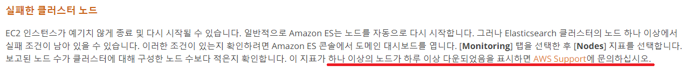
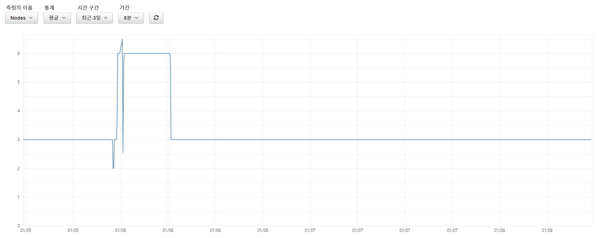
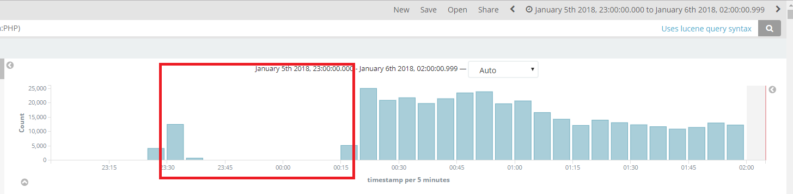
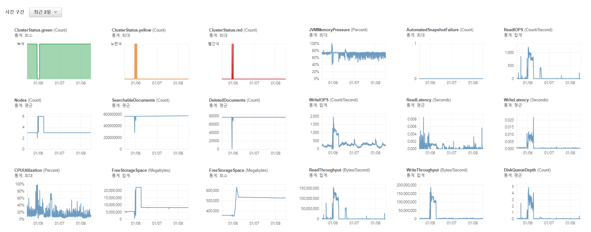

사용자들의 행동 패턴을 분석하기 위해 각 행위들에 대한 통계 데이터가 필요했다. 그래서 aggregation을 통해  10000명의 사용자에 대해 aggregation 쿼리를 날렸다.  날짜 범위를 따로 지정하지 않고 전체 데이터를 가지고 했더니 결국 아래와 같은 Timeout Exception이 발생하고 말았다.

```shell
Exception in thread "main" com.amazonaws.SdkClientException: Unable to execute HTTP request: Read timed out
        at com.amazonaws.http.AmazonHttpClient$RequestExecutor.handleRetryableException(AmazonHttpClient.java:1114)
        at com.amazonaws.http.AmazonHttpClient$RequestExecutor.executeHelper(AmazonHttpClient.java:1064)
        at com.amazonaws.http.AmazonHttpClient$RequestExecutor.doExecute(AmazonHttpClient.java:743)
        at com.amazonaws.http.AmazonHttpClient$RequestExecutor.executeWithTimer(AmazonHttpClient.java:717)
        at com.amazonaws.http.AmazonHttpClient$RequestExecutor.execute(AmazonHttpClient.java:699)
        at com.amazonaws.http.AmazonHttpClient$RequestExecutor.access$500(AmazonHttpClient.java:667)
        at com.amazonaws.http.AmazonHttpClient$RequestExecutionBuilderImpl.execute(AmazonHttpClient.java:649)
        at com.amazonaws.http.AmazonHttpClient.execute(AmazonHttpClient.java:513)
        at com.vinus.elasticsearch.aws.RestClient.getDocument(RestClient.java:122)
        at com.vinus.ml.PredictPurchase.userActionCollect(PredictPurchase.java:80)
        at com.vinus.ml.PredictPurchase.run(PredictPurchase.java:35)
        at Main.main(Main.java:51)
Caused by: java.net.SocketTimeoutException: Read timed out
        at java.net.SocketInputStream.socketRead0(Native Method)
        at java.net.SocketInputStream.socketRead(SocketInputStream.java:116)
        at java.net.SocketInputStream.read(SocketInputStream.java:171)
        at java.net.SocketInputStream.read(SocketInputStream.java:141)
        at sun.security.ssl.InputRecord.readFully(InputRecord.java:465)
        at sun.security.ssl.InputRecord.read(InputRecord.java:503)
        at sun.security.ssl.SSLSocketImpl.readRecord(SSLSocketImpl.java:983)
        at sun.security.ssl.SSLSocketImpl.readDataRecord(SSLSocketImpl.java:940)
        at sun.security.ssl.AppInputStream.read(AppInputStream.java:105)
        at org.apache.http.impl.conn.LoggingInputStream.read(LoggingInputStream.java:87)
        at org.apache.http.impl.io.SessionInputBufferImpl.streamRead(SessionInputBufferImpl.java:137)
        at org.apache.http.impl.io.SessionInputBufferImpl.fillBuffer(SessionInputBufferImpl.java:153)
        at org.apache.http.impl.io.SessionInputBufferImpl.readLine(SessionInputBufferImpl.java:282)
        at org.apache.http.impl.conn.DefaultHttpResponseParser.parseHead(DefaultHttpResponseParser.java:140)
        at org.apache.http.impl.conn.DefaultHttpResponseParser.parseHead(DefaultHttpResponseParser.java:57)
        at org.apache.http.impl.io.AbstractMessageParser.parse(AbstractMessageParser.java:259)
        at org.apache.http.impl.DefaultBHttpClientConnection.receiveResponseHeader(DefaultBHttpClientConnection.java:163)
        at org.apache.http.impl.conn.CPoolProxy.receiveResponseHeader(CPoolProxy.java:167)
        at org.apache.http.protocol.HttpRequestExecutor.doReceiveResponse(HttpRequestExecutor.java:273)
        at com.amazonaws.http.protocol.SdkHttpRequestExecutor.doReceiveResponse(SdkHttpRequestExecutor.java:82)
        at org.apache.http.protocol.HttpRequestExecutor.execute(HttpRequestExecutor.java:125)
        at org.apache.http.impl.execchain.MainClientExec.execute(MainClientExec.java:271)
        at org.apache.http.impl.execchain.ProtocolExec.execute(ProtocolExec.java:184)
        at org.apache.http.impl.client.InternalHttpClient.doExecute(InternalHttpClient.java:184)
        at org.apache.http.impl.client.CloseableHttpClient.execute(CloseableHttpClient.java:82)
        at org.apache.http.impl.client.CloseableHttpClient.execute(CloseableHttpClient.java:55)
        at com.amazonaws.http.apache.client.impl.SdkHttpClient.execute(SdkHttpClient.java:72)
        at com.amazonaws.http.AmazonHttpClient$RequestExecutor.executeOneRequest(AmazonHttpClient.java:1236)
        at com.amazonaws.http.AmazonHttpClient$RequestExecutor.executeHelper(AmazonHttpClient.java:1056)
        ... 10 more
```

여기서 Elasticsearch 노드들에 대한 모니터링을 해봤어야 했는데, 아무 생각없이 로컬의 프로세스가 죽었기 때문에 Elasticsearch 클러스터도 해당 작업을 종료시켰다고 판단해버리고, 다시 size를 줄여 5000 정도의 사용자로 aggregation 쿼리를 날려버렸다. aggregation을 끝내려고 열심히 과도하게 노동을 하고 있던 Elasticsearch에게 또 다시 넘치는 일을 줘버렸기 때문에 Elasticsearch가 감당하지 못하고 결국 과로사해버렸다.

로그 데이터를 쌓을 저장소가 죽어버렸기 때문에 얼른 다시 구동을 시켜야 했지만 AWS의 서비스를 사용했기 때문에 기능이 제공되지 않으면 내가 어떻게 해볼 도리가 없었다. (Elasticsearch 노드들에 대한 재시작 버튼이 따로 없어서 뭔가 조치를 취할 방법이 없었다는 의미)

혹시나 AWSCLI로 재시작 할 수 있지 않을까 싶어서 백서를 뒤져봤지만 아래와 같이 서포트팀에 문의하라는 글만... 



수집되는 데이터는 이중으로 백업되고 있기 때문에 데이터가 유실 되지는 않지만 시간에 지남에 따라 복구해야될 데이터들이 점점 늘어나고, 그럴수록 Elasticsearch에 색인하는 작업이 길어지기 때문에 이러다가 복구 되지 않고 하루 이상 지속되지 않을까 하는 걱정이 생겼다. 그래서 재시작 할 수 있는 방법을 생각해보다가 재시작 될 수 밖에 없는 상황을 만들자는 꼼수를 생각나서 Elasticsearch 노드의 디스크 사이즈를 살짝 증가시켜서 적용하였다. AWS에서도 재시작 버튼을 만들지 않은 이유가 있을 것이고, 현재 비정상적인 노드가 구동되어 있는 상태에서 강제로 노드를 재시작 하게 되면 예상치 못한 문제가 생길지도 모른다는 걱정은 했지만 백업 할 수 있는 데이터가 있기 때문에 강행해보기로 결정을 했다. 

결과는 다행히 30~40분 정도 후에 노드가 다시 살아났다. 그 과정에서 원래 인스턴스 수가 3개 였는데 6개로 증가되기도 하고 아래와 같이 노드가 들쭉 날쭉하는 현상이 발생해서 두근두근 하긴 했지만 큰 문제는 없는 듯 보였다. 



현재 게임 서버에서 Kinesis로 스트림 데이터를 전달하고 Lambda를 통해 데이터 전처리를 수행한 후 Elasticsearch로 색인하고 있는데 Lambda에서 실패가 나면 Kinesis에서 실패한 데이터들을 Elasticsearch가 정상 상태가 되면 다시 전달할 것으로 생각하고 데이터가 유실되지 않을 줄 알았는데 아래와 같이 노드가 죽어있던 기간 동안 데이터 유실이 발생했다. 



이번에 서비스를 진행하면서 백업 데이터 덕분에 기사회생한 경우가 한 두번이 아니었다. 데이터 수집에 있어서 백업은 필수로 해야겠다고 또 한번 생각하게 되었다. 

문제가 생겼던 시기의 차트를 살펴보면 CPU, Memory, Disk IO 모두 정점을 찍었다. aggregation에 대해 잘 알고 써야지 이번 경우처럼 무작정 사용했다가는 서비스에 장애가 생기기 쉬울 것 같았다. 백업 데이터가 있고, 검색 서비스를 제공하는 것이 아니었기 때문에 별거 아닌 장애로 끝나긴 했지만 검색이 메인인 서비스였다면 대형 장애가 되었을 것이다. 



서비스에 트래픽이 많이 줄어들어서 꽤 많은 비용이 들어가는 Amazon Elasticsearch Service를 내리고 Elastic Stack을 사용할 예정인데, 현재는  테스트 단계라서 EC2 인스턴스 위에 Elastic Stack을 구성한 후 Amazon Elasticsearch Service와 병행해서 데이터를 병행 수집하고 있다. 이번 장애를 겪고, 얼른 교체해야겠다는 생각이 들었다.  