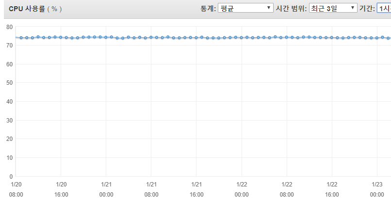

snapshot을 복원하던 중 너무 많은 인덱스들을 하나의 머신에 복원했더니 계속해서 GC가 발생하는 문제가 생겼다. 이로 인해 CPU가 70% 아래로 떨어지지 않고 며칠이고 계속 유지 되었다.



현재 색인이 발생하거나 검색을 수행하는 작업을 하고 있지 않기 때문에 처음에는 왜 CPU 사용률이 떨어지질 않는지 이해가 되지 않았는데 메모리 부족으로 인해 GC가 발생하면서 CPU 자원을 많이 소모시켰기 때문에 발생한 문제였다. 이를 해결하기 위한 방법으로는 머신을 추가하여 노드를 더 구동시켜서 클러스터링 하면 되겠지만 근본적으로 메모리 소비량을 줄이고 싶었다. 특히나 우리 서비스는 검색이 많지 않고 색인에 대한 비율이 높기 때문에 검색 성능을 향상시키기 위한 쿼리 캐시나 샤드 캐시와 같은 기능을 사용하지 않아도 되었다. 그래서 먼저 캐시기능을 비활성화 시키는 것으로 메모리 사용량을 줄여보았다.


아래 명령을 통해 캐시 사용량을 볼 수 있다.

```
GET /_stats/request_cache?human
GET /_nodes/stats/indices/request_cache?human
```


필터 캐시를 비활성화 하기 위해서는 각 인덱스마다 인덱스 설정을 변경해야 하는데 현재 구동 중인 상태에서는 변경이 불가능했다. 이를 위해서는 아래와 같이 설정 전 후에 `_close`와 `_open`을 사용하여 인덱스 사용을 중단시키는 절차가 필요하다. 

```json
POST /my_index/_close

PUT /my_index
{
  "settings": {
    "index.requests.cache.enable": false
  }
}

POST /my_index/_open
```


비활성화를 하게 되면 캐시 기능을 아예 사용하지 못하기 때문에, 약간의 캐시는 사용하고 싶다면 `config/elasticsearch.yml`파일을 수정하여 아래와 같이 캐시 사이즈를 조절할 수도 있다.

```
indices.requests.cache.size: 2%
```


## 참고

* https://blog.codecentric.de/en/2014/05/elasticsearch-indexing-performance-cheatsheet/
* ​