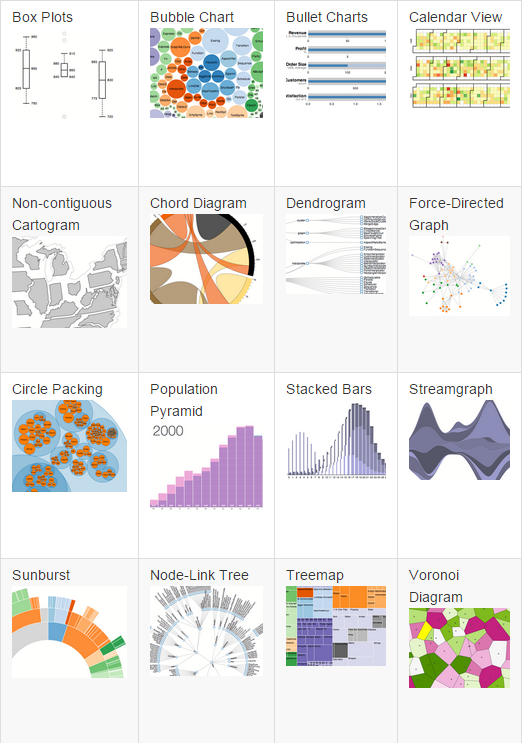
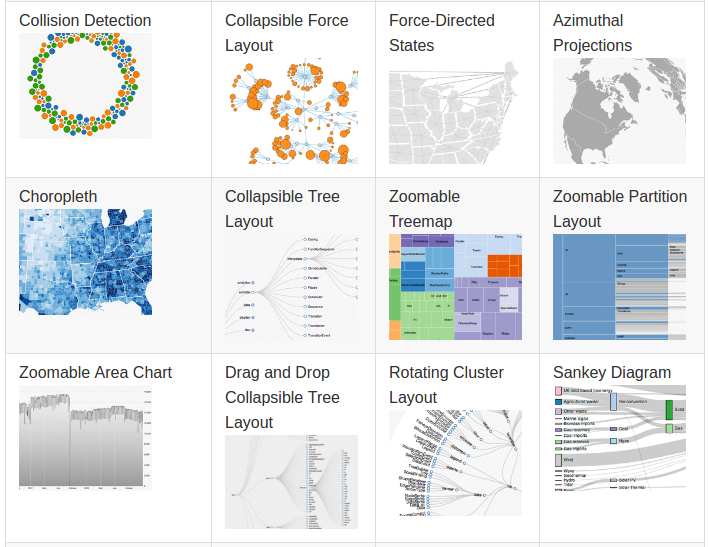
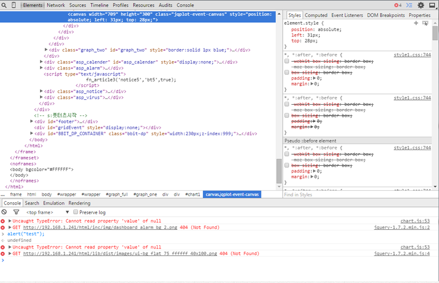

# D3.js란 무엇인가?
[TOC]

## D3.js란 무엇인가?

* D3.js는 주어진 데이터를 시각적으로 표현하는 자바스크립트 라이브러리
	* 
* 아이디어에 따라 다양한 그래프를 그릴수 있다.
* 특정 종류의 그래프를 기능이 없다.
	* 데이터를 처리하여 어디에 그릴 것인가를 좌표나 넓이 등으로 반환
	* 페이지에 표시된 요소(HTML DOM요소, SVG 요소, Canvas 요소)에 대해 속성이나 좌표를 지정하여 그래프 표시
* 데이터를 시각화하여 표시하기 위해서는 몇 단계의 과정을 거칠 필요가 있다.
	* 단순한 그래프 표시하고 싶을때는 jqPlot이나 Chatjs 등의 라이브러리를 사용하는 편이 시간이나 비용 면에서 편리하다
	* 데이터를 역동적이나, 다양하게 표현하고 싶을 때는 D3.js를 사용하는 것이 좋다.
	* 예를들어, 실시간 온도 변화나 지도와 연동하여 접속율 확인 등을 시각적으로 표현할 수 있다.
* 브라우저의 지원 여부에 따라 그리기 처리는 달라진다.
	* 예를 들어 IE9 에서는 그래프를 표시해주는 Canvas요소를 지원하지 않는다
	* 라이브러리의 버전 업을 기다리지 않아도 브라우저의 최신 그리기 기능을 이용할 수 있다.

## D3.js로 만들 수 있는 그래프

* D3.js는 그래프를 그리는 데 필요한 계산을 수행하는 기능 존재
	* 
* 또한, D3.js는 데이터와 지도 연동이 가능하다.
	* GeoJSON, topoJSON(지도 데이터 형식)을 이용하면 다양한 지도를 간단하게 데이터와 연동하여 다룰 수 잇다.
	* 또한, 평면 지도일 때는 D3.js의 Geo Paths, 지도의처럼 표시패주고 싶을 때는 Geo Projections을 사용하면 된다.
* 더 많은 지도를 다루고 싶다면 플러그인 이용

## 이책에서 사용하는 자바스크립트

* D3.js는 자바스크립트로 작성된 라이브러리
	* 프로그래밍할 때의 기술 방법이나 문법은 자바스크립트를 따른다.

* 주석
	* 코드가 무엇을 나타내는지를 적음
	* ```javascript
	//이 부분은 주석입니다.
	```

* 숫자와 문자
	* 숫자는 123이나 56.23 등 일상적으로 사용되는 표기 방식, 문자만 "abc" 큰따옴표로 감싼다.

* 게산
	* 계산에서는 각각 +(더하기), -(빼기), *(곱하기), /(나누기) 기호가 있고, 계산 순서를 바꾸고자 할 때는 괄호를 사용한다.

* 변수 입력
	* var 뒤에 계속해서 변수 이름에 값이나 내용을 입력한다.
	* = 의 의미는 왼쪽에 있는 변수에 변수에 입력한다는 프로그래밍에서의 의미이다.
	* ```javascrip
	var 변수 이름 = 값이나 내용
	```

* 변수에 배열입력
	* 매열을 사용하면 여러 개의 데이터를 하나의 변수로 다룰 수 있다.
	* [ 와 ] 사이에 쓰인 내용이 변수에 입력된다.
	* 변수가 여러 개일 때는 반점(,)을 이용하여 값을 구분하여 사용
	* ```javascript
	var 변수 이름 = [데이터1, ... , 데이터N]
	```

* 배열 내용 참조
	* 참조 번호로 지정한 순번에 있는 데이터 참조
	* ```javascript
	변수 이름[참조 번호]
	```

* 배열 내용에 데이터 추가
	* 배열 마지막에 데이터 추가
	* ```javascript
	변수 이름.push(데이터)
	```

* 반복
	* 정해진 횟수 반복
	* ```javascript
	for(var 변수이름 = 초깃값; 변수이름 < 종료값; 변수 이름 ++) { 반복할 내용 }
	```

* 조건 판단
	* 조건식이 성립하면 지정된 처리를 수행
	* ```javascript
	if (조건식) {
    	조건이 성립할 때의 처리
    }
	```

* 함수의 정의와 호출
	* 일련의 처리를 함수로 정의
	* 정의한 함수를 실행하려면 '함수이름()'과 같이 함수 이름 뒤에 ()를 붙여준다.
	* ```javascript
	function 함수 이름( 파라미터 ) {
    	실행할 내용
	```

* 객체의 메서드 호출
	* 객체 이름 뒤에 온점(.)으로 구분하여 메서드 이름을 쓰면 객체가 가진 기능을 호출하여 실행
	* ```javascript
	객체 이름.메서드 이름(파라미터)
	```

* D3.js는 브라우저에서 실행되므로 자바스크립트뿐 아니라 HTML 파일로부터도 영향을 받는다.
	* 이책에서는 HTML5를 기본으로 한다.
	* HTML4에서도 데이터를 처리하고 표시할수 있다.
* 그래프를 그릴 때는 주로 SVG(Scalavle Vector Graphics)를 사용한다.

## D3.js의 기능(객체)

* D3.js에는 d3라는 객체가 있다.
* D3.js의 모든 기능은 이 d3 객체에 들어 있다.
	* 상세 기능은 API 레퍼런스 페이지를 통해 확인 (https://github.com/d3/d3/wiki/API-Reference)
	* 각 기능은 메서드로 제공
	* select(), data(), append() ...

## 메서드 체인이란?

* 자바스크립트에서는 객체에 대해 메서드를 호출할 때 연속된 지시를 전달(실행)할 수 있는 메서드 체인이라는 기능이 있다.
* D3.js는 이 메서드 체인이 끊기지 않게 되어있다.
* 메서드 체인은 온점(.)으로 구분하여 계속해서 기술할 수 있다.
	* ```javascript
	객체 이름.메서드 이름().메서드 이름().메서드 이름()
	```
* 메서드 체인이 연속되면 여러 줄에 걸쳐 기술할 수 있다.
	* ```javascript
	객체이름
    	.메서드이름()
        .메서드이름()
        .메서드이름()
	```
* 마지막 메서드 뒤에 세미콜론을 붙이는 것이 좋지만,
	* 이 책에서는 재이용하는 코드가 많다고 생각하여 체인 부분 마지막에는 세미콜론을 붙이지 않음

## 개발에 필요한 도구

* D3.js로 그래프 표시할 때는 자바스크립트를 사용하여 코드를 작성한다.
	* 코드를 작성 하도보면 예기치 못한 작동을 할때가 있다.
	* 이럴때 개발도구를 사용한다.
	* 개발도구를 사용하는 방법은 개발도구에 따라 다르다.

**구글 크롬 개발자 도구 사용방법**

* [메뉴] -> [개발자 도구]

* [Console]
	* 자바스크립트 콘솔
	* 코드의 실행 결과나 출력된 결과가 표시된다.
	* 에러가 있을때도 콘솔에 표시된다.
* [Elements] ... [Properties]
	* 요소에 대한 정보를 표시한다.
	* 요소의 속성 내용을 확인하려면 확인할 요소를 선택한 다음, 오른쪽 영역에 [Properties] 탭을 클릭합니다.
* [Elements] ... [Styles]
	* 요소의 겉모습에 관련된 스타일을 표시
	* 설정한 스타일이 올바르게 반영되었는지 알아보려면 요소를 선택한 다음 [Styles] 탭을 클릭하면 확인할 수 있다.
* 
