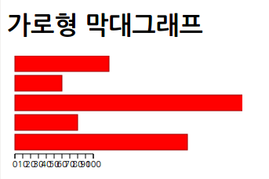

# D3.js의 기본: D3.js로 그래프 그리기
[TOC]

## D3.js의 기본적인 흐름

1. 데이터 읽어들이기
	* CSV(반점으로 구분된 텍스트), TSV(탭으로 구분된 텍스트), XML 형식 등 주요 데이터 형식을 읽어 들일 수 있다.
	* 또한, 프로그램 안에서는 배열이나 JSON 데이터도 이용할 수 있다.
1. 표시할 그래프 지정
	* 전달받은 데이터로 부터 그래프에 표시해야할 좌표를 계산하여 반환
	* 이 계산을 수행하고자 D3.js의 레이아웃 객체를 지정합니다.
	* 직접 데이터를 해석하여 프로그램을 작성하여 처리할 수도 있지만, 원이나 트리맵등은 D3.js에 있는 객체를 이용하여 계산하는 것이 훨씬 편리하다.
1. SVG 도형 준비와 생성
	* DOM 요소나 Canvas 요소도 생성할 수 있지만,
	* D3.js에서는 데이터 수에 따라 자동으로 요소의 수를 변경하여 애니메이션을 적용할 수 있는데, 이럴때는 SVG를 이용하는것이 효과적이다.
1. 도형의 속성값 변경
	* 그래프를 어떻게 표시할 것인가를 결정
	* 속성값을 변경하는 attr()메서드와 스타일을 변경하는 style() 메서드의 두 가지만 기억하면 충분하다.
1. 애니매이션 처리
	* transition() 메서드 뒤에 변경하고자 하는 속성값을 지정하면 간단하게 애니매이션 적용 가능하다.
1. 이벤트 처리
	* on() 메서드를 이용하여 마우스 클릭 등의 이벤트 처리

## D3.js를 사용하여 가로형 막대 그래프를 표시

* 이 절에서 만들 가로형 막대 그래프
	* 

** 1. HTML 준비 **

* 그래프를 표시하기 위한 HTML 파일 준비
* D3.js 라이브러리 추가
    * ```xml
    <script src="http://d3js.org/d3.v3.min.js" charset="utf-8"></script>
    ```
* 그래프를 표시하기 위한 영역 준비
    * ```xml
    <svg id="myGraph"></svg>
    ```
* 그래프를 표시할 프로그램 작성
    * ```xml
    <script src="js/sample.js"></script>
    ```

** 2. 그래프 데이터 준비 **

* 데이터셋 : 그래프 데이터가 여러 개 모인 것
* 자바스크립트 배열을 이용하여 데이터셋 준비
    * ```javascript
    var dataSet = [300, 130, 5, 60, 240];
    ```
* 막대그래프의 크기로 사용

** 3. HTML 파일 안에서 SVG로 사각형 그리기 **

* svg : 2차원 벡터 그래픽을 표현하기 위한 XML기반의 파일 형식, HTML 안의 svg 요소 안에 기술
	* 벡터 그래픽 : 실제로 이미지에 표현되는 점에대한 정보를 저장하고 있으며 해상도를 변경하면 이미지를 다시 구성한다.
* rect 요소를 사용하여 사각형을 그림
    * ```xml
    <rect x="X좌표" y="Y좌표" width="넓이" height="높이"/>
    ```
* x, y, width, height 속성값을 모두 설정하지 않으면 사각형이 표시되지 않음
* SVG의 좌표계는 왼쪽위가 원점이 되며 오른쪽 아래로 갈수록 죄표값이 커지게 된다.
* 실제로 rect 요소를 기술한 HTML 파일은 다음과 같이 된다.
    * ```xml
    <!DOCTYPE html>
    <html>
        <head>
            <meta charset="utf-8">
            <title>SVG Sample</title>
        </head>
        <body>
            <svg>
                <rect x="10" y="30" width="100" height="80" />
            </svg>
        </body>
    </html>
    ```
* 

** D3.js로 사각형(rect 요소) 생성 **

* D3.js에서 사각형(rect 요소)을 생성하려면 append() 메서드를 사용
* svg 요소를 지정하고 그곳에 append("rect")라고 써넣어야 한다.
* 특정 요소를 지정하려면 d3.select()를 사용한다.
* ```javascript
d3.select("#myGraph")
    .append("rect")
```
* 

** 사각형(rect 요소)의 속성을 지정 **

* 도형의 속성을 지정하려면 attr() 메서드를 사용해야한다.
	* attr()의 첫 번째 파라미터는 속성 이름이며 두 번재 파라미터에는 설정하고자 하는 값이나 내용이다.
	* ```javascript
	d3.select("#myGraph")	// SVG 요소를 지정
    	.attr("height", "20px")	//height를 20px로 설정
	```

* ```xml
<!DOCTYPE html>
<html>
	<head>
		<meta charset="utf-8">
		<title>가로형 막대그래프</title>
		<script src="http://d3js.org/d3.v3.min.js" charset="utf-8"></script>
	</head>
	<body>
		<h1>가로형 막대그래프</h1>
		<svg id="myGraph"></svg>
		<script src="js/sample.js"></script>
	</body>
</html>
```
* ```javascript
 var dataSet = [300, 130, 5, 60, 240];   // 막대그래프 데이터(데이터 세트)

 d3.select("#myGraph")	// SVG 요소를 지정
    .append("rect")	// SVG 사각형 생성
    .attr("x", 0)	// 가로형 막대그래프이므로 X 좌표를 0으로 설정
    .attr("y", 0)	// Y 좌표를 0으로 설정
    .attr("width", dataSet[0])	// 최초 데이터를 기반으로 넓이 설정
    .attr("height", "20px")	// 막대그래프의 높이는 20px로 지정
```

* width 속성을 설정할 때 dataSet[0]을 지정했다.
	* dataSet은 배열이므로 dataSet[0]이라 하면 맨 처음 요소인 300이 입력된다.

* 검은 사각형(가로 막대)이 1개 표시됨
	* 

** 여러 개의 그래프 표시 **

* 표시할 개수 만큼 append("rect")와 attr()을 사용하여 사각형을 생성
* ```javascript
 var dataSet = [300, 130, 5, 60, 240];	// 막대그래프 데이터(데이터 세트)

 d3.select("#myGraph")
	.append("rect")
	.attr("x", 0)
	.attr("y", 25)
	.attr("width", dataSet[0])
	.attr("height", "20px");
 d3.select("#myGraph")
	.append("rect")
	.attr("x", 0)
	.attr("y", 50)	//y좌표이동
	.attr("width", dataSet[1])	//첫 번째 데이터
	.attr("height", "20px");
 d3.select("#myGraph")
	.append("rect")
	.attr("x", 0)
	.attr("y", 75)
	.attr("width", dataSet[2])
	.attr("height", "20px");
 d3.select("#myGraph")
	.append("rect")
	.attr("x", 0)
	.attr("y", 100)
	.attr("width", dataSet[3])
	.attr("height", "20px");
 d3.select("#myGraph")
	.append("rect")
	.attr("x", 0)
	.attr("y", 125)
	.attr("width", dataSet[4])
	.attr("height", "20px");
```
* 지금은 데이터가 5개지만, 데이터가 100개로 늘어난다면 코드가 길어지고 같은 작업을 반복하게 된다.
* D3.js에서는 데이터셋에 따라 자동으로 요소를 추가하고 처리해주는 메서드를 제공한다.
    * selectAll(), data(), enter()등의 메서드를 사용하면 공통된 속성을 한꺼번에 지정함과 동시에 데이터 수에 따라 여러 대의 rect 요소를 유연하게 생성할수있다.

1. 교체하거나 추가할 대상이 될 요소를 selectAll() 메서드로 선택
	* 이 시점에서는 아직 rect 요소가 없다. 즉 나중에 동적으로 추가되는 rect 요소를 선택하는 것이 된다.
2. data() 메서드로 준비한 데이터를 데이터셋으로 내부에 저장한다.
3. 새롭게 추가되는 데이터에 관해서는 enter() 메서드 이후의 처리가 적용된다.
	* enter()를 사용하면 데이터 수만큼 자동으로 요소 추가
	* 일반적으로는 append() 메서드로 추가할 요소와 데이터를 연결한다.
	* 이때 rect 요소와 데이터가 대응하게된다.
	* ```javascript
	d3.select("#myGraph")
        .selectAll("rect")
        .data(dataSet)
        .enter()
        .append("rect")
	```
4. 이후 attr() 메서드를 사용하여 필요한 속성값을 설정
	* 두 번째 파라미터에 함수가 지정되었을 때 함수에 데이터셋의 데이터가 하나씩 전달된다.
	* 즉, 함수에 전달된 데이터를 처리하여 반환함으로써 데이터에 따라 그래프를 그릴 수 있다.
	* 데이터셋이 var dataSet = [300, 130, 5, 60, 240]; 일때 function (d, i) 의 d(데이터)와 i(순서)의 값은
        |   i   |   0   |   1   |   2   |   3   |   4   |
        |-------|-------|-------|-------|-------|-------|
        |   d   |  300  |  130  |   5   |   60  |  240  |
	* ```javascript
	.attr("width", function(d, i){
    	return d + "px";
    })
	```
    * 막대그래프가 여러 개이므로 Y좌표를 바꿔가며 그려야한다.
    * ```javascript
	.attr("y", function(d, i){
    	return i * 25;
    })
    ```
5. 데이터셋에 따른 가로형 막대그래프 표시
	* ```xml
	<!DOCTYPE html>
    <html>
        <head>
            <meta charset="utf-8">
            <title>가로형 막대그래프</title>
            <script src="http://d3js.org/d3.v3.min.js" charset="utf-8"></script>
        </head>
        <body>
            <h1>가로형 막대그래프</h1>
            <svg id="myGraph"></svg>
            <script src="js/sample.js"></script>
        </body>
    </html>
	```
    * ```javascript
    // 막대그래프 데이터(데이터 세트)
    var dataSet = [300, 130, 5, 60, 240];
    // 데이터를 기반으로 그리기
    d3.select("#myGraph")				// SVG 요소 지정
        .selectAll("rect")					// SVG로 사각형을 표시할 요소를 지정
        .data(dataSet)						// 데이터 설정
        .enter()									// 데이터 수에 따라 rect 요소 생성
        .append("rect")						// SVG 사각형 생성
        .attr("x", 0)							// 가로형 막대그래프이므로 X좌표를 0으로 함
        .attr("y", function(d,i){			// Y 좌표를 배열의 순서에 따라 계산
            return i * 25;					// 막대그래프의 높이를 25px 단위로 계산
        })
        .attr("width", function(d, i){	// 넓이를 배열의 내용에 따라 계산
            return d +"px";					// 데이터의 값을 그대로 넓이로 함
        })
        .attr("height", "20px")			// 막대그래프의 높이를 20px로 지정
    ```
* 

** 막대그래프의 스타일 지정 **

* svg 요소 안에 있는 rect 요소에는 css를 이용하여 스타일을 지정할 수있다.
	* 이때 rect 요소에 지정한 스타일 속성은 svg용이여야 한다.
* |속성|설명|
  |--------|--------|
  | fill | 도형을 채울 색을 지정. red나 rgb(0,255,0)들을 지정할 수 있음|
  | stroke | 도형의 선 색을 지정. red나 rgb(0,255,0)들을 지정할 수 있음|
  | stroke-width | 도형의 선 넓이를 지정 |
* ```xml
<style>
    svg { width: 320px; height: 240px; border: 1px solid black; }
    #myGraph rect {
        stroke : rgb( 160, 0, 0 );
        stroke-width : 1px;
        fill : rgb( 255, 0, 0 );
    }
</style>
```
* 

## 데이터 변경하기

* 버튼을 클릭하면 동적으로 데이터가 변경됨과 동시에 그래프가 변경되는 처리

1. 버튼 요소 준비
	* ```xml
	<button id="updateButton">  데이터 업데이트  </button>
	```
2. 대상이 되는 요소에 대해 on() 메서드 사용하여 이벤트 설정
	* ```javascript
	on(이벤트 이름, 이벤트 발생 시 호출할 함수)
	```
    * 이벤트 이름 :  "click", "mouseover", "submit" 등
    * 호출할 함수가 많을 경우 무명함수를 사용한다.
3. 이벤트가 발생하면 바뀔 새 데이터 준비
	* ```xml
	 <button id="updateButton">  데이터 업데이트  </button>
     ```
	* 데이터가 준비되면 data() 메서드를 이용하여 새로운 데이터를 설정
		* `dataSet = [20, 230, 150, 10, 20];`
	* 이때, append()나 enter() 메서드는 필요 없다
		* 데이터셋의 전체 개수가 같기 때문이다.
		* 데이터 개수가 늘어났음에도 append() 메서드와 enter() 메서드를 사용하지 않으면 늘어난 데이터 만큼 표시되지 않는다.
4. 실제 코드
	* ```javascript
    var dataSet = [300, 130, 5, 60, 240];  // 막대 그래프 데이터(데이터셋)
    // 데이터를 기반으로 그리기
    d3.select("#myGraph")				// SVG 요소 지정
        .selectAll("rect")					// SVG로 사각형을 표시할 요소를 지정
        .data(dataSet)						// 데이터 설정
        .enter()									// 데이터 수에 따라 rect 요소 생성
        .append("rect")						// SVG 사각형 생성
        .attr("x", 0)							// 가로형 막대그래프이므로 X좌표를 0으로 함
        .attr("y", function(d,i){			// Y 좌표를 배열의 순서에 따라 계산
            return i * 25;					// 막대그래프의 높이를 25px 단위로 계산
        })
        .attr("width", function(d, i){	// 넓이를 배열의 내용에 따라 계산
            return d +"px";					// 데이터의 값을 그대로 넓이로 함
        })
        .attr("height", "20px")			// 막대그래프의 높이를 20px로 지정

    // 버튼 클릭 시의 처리
    d3.select("#updateButton")
        .on("click", function(){
            dataSet = [20, 230, 150, 10, 20];		// 새로운 데이터로 변경
            d3.select("#myGraph")						// SVG 요소 지정
                .selectAll("rect")							// SVG로 사각형을 표시할 요소를 지정
                .data(dataSet)								// 데이터 설정
                .attr("width", function(d, i){			// 넓이를 배열의 내용에 따라 계산
                    return d +"px";							// 데이터의 값을 그대로 넓이로 함
                })
    })
	```
	*  ---> 

**이름이 있는 함수와 무명 함수**

* `function 함수 이름() { 함수 내용 }`
	* 이때 함수는 호출하지 않는 한 실행되지 않음
	* 스크립트를 읽어들였을때 우선하여 정의
* `function() { 함수 내용 }`
	* 함수 이름을 생략하면 함수 정의가 아니라 함수식으로 처리된다.
	* 함수식 : 이름이 없는 몸체, 숫자나 문자같은 데이터의 일종
	* 그러나 이대로 기술하면 에러가 발생하므로 다음과 같이 변수에 대입하겨나 전체를 ()로 감싸준다.
	* `var f = function() {return "OK";}`

## 그래프 애니메이션

* 버튼을 클릭하면 애니메이션 효과와 함께 막대 그래프를 수정 처리하는 것은 매우 간단하다.
	* attr() 메소드로 속성값으로 변경하기 전에 transition() 메서드를 기술하기만 하면 되기 때문
	* transition() 메서드는 이후 메서드 체인에 지정된 속성값에 따라 시간이 흐를수록 변화하는 처리를 수행
	* 애니매이션은 속성값의 초깃값과 최종값만 설정하면 그 사이의 애니메이션 처리는 자동으로 보기 좋게 수행
* ```javascript
    var dataSet = [300, 130, 5, 60, 240];	// 막대 그래프 데이터(데이터셋)
    // 데이터를 기반으로 그리기
    d3.select("#myGraph")				// SVG 요소 지정
        .selectAll("rect")					// SVG로 사각형을 표시할 요소를 지정
        .data(dataSet)						// 데이터 설정
        .enter()									// 데이터 수에 따라 rect 요소 생성
        .append("rect")						// SVG 사각형 생성
        .attr("x", 0)							// 가로형 막대그래프이므로 X좌표를 0으로 함
        .attr("y", function(d,i){			// Y 좌표를 배열의 순서에 따라 계산
            return i * 25;					// 막대그래프의 높이를 25px 단위로 계산
        })
        .attr("width", function(d, i){	// 넓이를 배열의 내용에 따라 계산
            return d +"px";					// 데이터의 값을 그대로 넓이로 함
        })
        .attr("height", "20px")			// 막대그래프의 높이를 20px로 지정

    // 버튼 클릭 시의 처리
    d3.select("#updateButton").on("click", function(){
        for(var i=0; i<dataSet.length; i++){
            dataSet[i] = Math.floor(Math.random() * 320);	// 0〜320 미만의 값을 생성
        }
        d3.select("#myGraph")		// SVG 요소 지정
            .selectAll("rect")			// SVG로 사각형을 표시할 요소를 지정
            .data(dataSet)				// 데이터 설정
            .transition()					// 변환 표시
            .attr("width", function(d, i){	// 넓이를 배열의 내용에 따라 계산
                return d +"px";					// 데이터의 값을 그대로 넓이로 함
            })
    })
```
* 
	* 버튼을 클릭할 때마다 그래프가 애니매이션 효과와 함께 변화

** 처음 표시될 그래프에도 애니메이션 효과 적용 **

* 그래프의 표시 순서에 따라 애니메이션 시작 시각을 늦추는 처리

* 애니메이션 시작까지의 대기 시간을 지정
	* 대기 시간을 지정하는 것이 delay() 메서드
	* delay() 메서드도 파라미터에 함수를 지정하면 데이터셋의 데이터나 표시 순서를 전달
	* ```javascript
	.delay(function(d, i){
    	return i * 500;
    })
	```

** 애니메이션 시작에서 종료까지의 시간을 지정 **

* 좀 더 천천히 표시되도록 하고 싶을 때는 애니메이션 시작에서 종료까지의 시간을 지정하는 duration() 메서드를 사용한다.
	* 파라미터에는 밀리 초 단위로 시간을 지정
* ```javascript
    var dataSet = [300, 130, 5, 60, 240]; // 막대 그래프 데이터(데이터셋)
    // 데이터를 기반으로 그리기
    d3.select("#myGraph")				// SVG 요소 지정
        .selectAll("rect")					// SVG로 사각형을 표시할 요소를 지정
        .data(dataSet)						// 데이터 설정
        .enter()									// 데이터 수에 따라 rect 요소 생성
        .append("rect")						// SVG 사각형 생성
        .attr("x", 0)							// 가로형 막대그래프이므로 X좌표를 0으로 함
        .attr("y", function(d,i){			// Y 좌표를 배열의 순서에 따라 계산
            return i * 25;					// 막대그래프의 높이를 25px 단위로 계산
        })
        .attr("height", "20px")			// 막대그래프의 높이를 20px로 지정
        .attr("width", "0px")				// 최초 막대그래프의 넓이를 0px로 지정
        .transition()							// 그래프 출력 시 애니메이션 효과 적용
        .delay(function(d, i){
            return i * 500;					// 0.5초마다 그리도록 대기 시간을 설정
        })
        .duration(2500)					// 2.5초에 걸쳐 애니메이션화 함
        .attr("width", function(d, i){	// 넓이를 배열 내용에 따라 계산
            return d +"px";					// 데이터의 수를 그대로 넓이로 함
        })

    // 버튼 클릭 시의 처리
    d3.select("#updateButton").on("click", function(){
        for(var i=0; i<dataSet.length; i++){
            dataSet[i] = Math.floor(Math.random() * 320);	// 0〜320 미만의 값을 생성
        }
        d3.select("#myGraph")		// SVG 요소 지정
            .selectAll("rect")			// SVG로 사각형을 표시할 요소를 지정
            .data(dataSet)				// 데이터 설정
            .transition()					// 변환 표시
            .attr("width", function(d, i){	// 넓이를 배열의 내용에 따라 계산
                return d +"px";					// 데이터의 값을 그대로 넓이로 함
            })
    })
```
*  --->  ---> 

## 마우스 이벤트로 그래프 색 바꾸기

* svg 요소 이벤트 처리
	* svg 요소에 이벤트 처리 할 때도 on() 메서드 사용

* d3.select(this)라고 하면 클릭한 요소 그 자체를 지정할 수 있다.
	* 요소 지정 스타일 변경
* 스타일 지정은 attr() 메서드를 사용할 수도 있지만, D3.js에서는 스타일을 개별적으로 설정할 수 있는 style() 메서드를 제공한다.
	* style() 메서드의 첫 번째 파라미터에는 스타일 속성 이름을, 두 번째 파라미터에는 설정할 값을 지정
	* ```javascript
	.on("click", function(){
		d3.select(this)					// 클릭한 요소를 지정
			.style("fill", "cyan")		// 채우기 스타일을 하늘색으로 함
	})
	```

* 적용한 실제 코드
	* ```javascript
    var dataSet = [300, 130, 5, 60, 240];	// 막대 그래프 데이터(데이터셋)
    // 데이터를 기반으로 그리기
    d3.select("#myGraph")				// SVG 요소 지정
        .selectAll("rect")					// SVG로 사각형을 표시할 요소를 지정
        .data(dataSet)						// 데이터 설정
        .enter()									// 데이터 수에 따라 rect 요소 생성
        .append("rect")						// SVG 사각형 생성
        .attr("x", 0)							// 가로형 막대그래프이므로 X좌표를 0으로 함
        .attr("y", function(d,i){			// Y 좌표를 배열의 순서에 따라 계산
            return i * 25;					// 막대그래프의 높이를 25px 단위로 계산
        })
        .attr("height", "20px")			// 막대그래프의 높이를 20px로 지정
        .attr("y", function(d,i){			// Y 좌표를 배열의 순서에 따라 계산
            return i * 25;					// 막대그래프의 Y 좌표를 25px 단위로 계산
        })
        .attr("height", "20px")			// 막대그래프의 높이를 20px로 지정
        .attr("width", function(d, i){	// 막대그래프의 넓이를 배열의 내용에 따라 계산
            return d +"px";					// 데이터의 값을 그대로 넓이로 함
        })
        .on("click", function(){
            d3.select(this)					// 클릭한 요소를 지정
                .style("fill", "cyan")		// 채우기 스타일을 하늘색으로 함
        })
	```
*  ---> 

## 외부 데이터 불러오기

* 실제로 D3.js를 사용할 때는 코드 안에 미리 데이터를 준비해두는 경우는 거의 없다.
	* 대부분은 데이터가 별도의 파일로 저장되어 있을 것이다
	* D3.js는 XML, JSON, TSV, CSV 등 다양한 데이터 형식을 지원한다.

* 엑셀로 작성한 CSV 파일의 데이터를 불러와 막대 그래프로 표시
* CSV 파일의 내용
	* item1, item2, item3라 적힌 첫 번째 줄은 헤더이다.
	* D3.js로 CSV 데이터를 다룰 때 이 헤더 항목 이름을 속성 이름으로 사용하여 접근한다.
	* 
* csv에서 파일을 불러오려면 d3.csv()메서드를 사용한다.
	* 첫 번째 파라미터에는 불러올 파일의 경로를 지정한다.
	* 특히, 서버 등에서 별도로 설정하지 않으면 파일이 같은 도메인이 아닐 때는 불러올 수 없다.
	* 두 번째 파라미터에는 csv 파일 불러오기가 끝났을 때 호출 할 함수를 지정
	* 이 함수의 첫 번째 파라미터에는 에러 정보가, 두 번째 파라미터에는 불러온 데이터(객체)가 전달된다.
* csv 파일을 불러와 데이터셋으로 저장
	* ```javascript
	d3.csv("mydata.csv", function(error, data){
        var dataSet = [ ];						// 데이터를 저장할 배열을 준비
        for(var i=0; i<data.length; i++){	// 데이터의 줄 수만큼 반복
            dataSet.push(data[i].item1);	// item1 레이블의 데이터만 추출
	}
	```
    * data : cvs 파일 내용, 헤더를 제외한 줄 수 만큼 데이터 저장
    * data.length : 데이터 줄 수 (크기)
    * dataSet.puth() : 배열에 데이터를 넣는 메서드

* 실제 적용 코드
	* ```java
	d3.csv("mydata.csv", function(error, data){
        var dataSet = [ ];						// 데이터를 저장할 배열을 준비
        for(var i=0; i<data.length; i++){	// 데이터의 줄 수만큼 반복
            dataSet.push(data[i].item1);	// item1 레이블의 데이터만 추출
        }
        // 데이터를 기준으로 그리기
        d3.select("#myGraph")		// SVG 요소 지정
            .selectAll("rect")			// SVG로 사각형을 표시할 요소를 지정
            .data(dataSet)				// 데이터 설정
            .enter()							// 데이터의 개수에 따라 rect 요소를 생성
            .append("rect")				// SVG 사각형 생성
            .attr("x", 0)					// 가로형 막대그래프이므로 X 좌표를 0으로 함
            .attr("y", function(d,i){	// Y 좌표를 배열의 순서에 따라 계산
                return i * 25;			// 막대그래프의 Y 좌표를 25px 단위로 계산
            })
            .attr("height", "20px")			// 막대그래프의 높이를 20px로 지정
            .attr("width", function(d, i){	// 막대그래프의 넓이를 배열의 내용에 따라 계산
                return d +"px";					// 데이터의 값을 그대로 넓이로 함
            })
    });
	```
* 

## 눈금 표시

** 눈금 스타일 설정 **

* 우선 눈금의 수치나 레이블, 선 스타일을 설정
* 설정할 스타일은 axis 클래스가 눈금과 관련된 것이므로,
	* 이 클래스 안에 있는 text가 눈금의 수치, path와 line이 눈금의 선이 된다.
	* ```xml
	.axis text {
				font-family: sans-serif;
				font-size: 11px;
			}
    .axis path,
    .axis line {
        fill: none;
        stroke: black;
    }
	```

* D3.js에서는 나중에 그린 도형이 가장 앞에 표시되기 때문에 주의해야한다.

** 눈금의 종류와 스케일 설정 **

* 우선 사용할 눈금의 종류를 정해야한다.
    * 직선이나 로그 등이 있으나 여기서는 간단한 직선 눈금을 사용한다.
    * 선형 스케일(일정 간격의 직선 눈금)이므로 D3.js에서는 d3.scale.linear()를 이용하여 생성할 수 있다.
* 다음으로 설정해야 하는 것은 스케일/척도이다.
	* 데이터셋에 있는 데이터의 수치 범위와 실제로 표시 범위를 조정하는 것이다.
	* 데이터 범위는 domain() 메서드로, 표시할 범위는 range() 메서드로 지정한다.
	* 두 메서드 모두 파라미터로는 [시작값, 종료값]과 같은 형식의 배열을 지정한다.
	* ```java
	var xScale = d3.scale.linear()  // 선형 스케일 설정
			.domain([0, 300])   // 원래 데이터 범위
			.range([0, 300])  // 실제 출력 크기
	```
**domain()과 range()**

* 앞의 코드처럼 원래 데이터 범위가 실제 표시 벙위가 1:1이라면, domina([0, 100]), range([0, 100]) 해도
	* 눈금이 range()로 지정한 100까지의 범위만 표시된다.
	* 
* .domain([0, 100]) .range([0, 300]) 라고 하면 막대그래프의 초댓값은 300이지만 눈금을 100까지만 표시된다.
	* 
* .domain([0, 300]) .range([0, 100]) 라고 하면 막대그래프의 100위치에 최댓값 300이 표시된다.
	* 
* D3.js로 눈금을 표시하려면 이 domain()과 range()를 적절하게 잘 설정해야 한다.

** 눈금 표시 **

* 실제로 화면에 표시하는 코드 작성
* 눈금을 표시하려면 SVG 요소를 그룹화하는 기능을 사용하여 눈금의 선, 숫자와 그래프를 하나의 세트로 처리한다.
	* 그룹화하면 눈금을 한 번에 이동하는 등을 간단하게 처리할 수 있게 된다.
* 그룹화 하려면 SVG의 g 요소를 사용한다.
	* g 요소를 사용하면 g 요소 안에 포함된 여러 개의 요소를 하나의 그룹으로 다룰 수 있게 된다.
* D3.js로 SVG의 g 요소를 추가하려면 append("g")라고 하면 된다.
* g 요소에 미리 정의한 스타일 추가
	* attr("class", "axis")를 사용하여 클래스 속성 추가
* 눈금을 표시하려면 call() 메소드를 사용한다.
	* call() 메서드는 파라미터에 설정한 함수를 호출하는 메서드
	* ```java
    .call(d3.svg.axis()	// call()로 눈금을 표시할 함수를 호출
        .scale(xScale)  // 스케일을 적용
        .orient("bottom")   // 눈금의 표시 위치를 아래쪽으로 지정
    )
    ```
* d3.svg.axis()가 눈금을 처리하는 메서드이다.
* 다음에 오는 scale() 메서드의 파라미터에 앞서 설정한 선형 스케일(d3.scale.linear())의 객체를 지정한다.
	* 이것만으로도 눈금을 표시할 수 있다.
* 추가로 orient() 메서드를 이용하여 눈금의 표시 위치 지정
* 눈금은 x, y 속성을 설정해도 원하는 위치로 이동하지는 않는다.
* 눈금의 위치를 이동하려면 transform 속성에 이동할 거리를 지정한다.
	* 예를 들어 X 방향으로 10 픽셀, Y 방향으로 20픽셀 이동하려면 .attr("transform", "translate(10, 20)")과 같이 지장하면 된다.
	* transform()은 파라미터에 지정한 만큼 XY 좌표를 이동시킨다
	* 첫 번째 값이 X 좌표, 두 번째 값이 Y 좌표의 이동 거리이다.
	* 확대 비율을 지정하는 scale(), 회전 각도를 지정하는 rotate(), 기울기는 지정하는 skewX(), skewY() 등이 있다.
	* ```javascript
	.attr("transform", "translate(10, "+((1+dataSet.length) * 20+5)+")")
	```
* 실제 적용 코드
	* ```javascript
    d3.csv("mydata.csv", function(error, data){
        var dataSet = [ ];	// 데이터를 저장할 배열 준비
        for(var i=0; i<data.length; i++){	// 데이터 줄 수만큼 반복
            dataSet.push(data[i].item1);	// item1 레이블의 데이터만 추출
        }
        // 데이터를 이용하여 그래프 그리기
        d3.select("#myGraph")	// SVG 요소 지정
            .selectAll("rect")	// SVG에서 사각형을 나타낼 요소를 지정
            .data(dataSet)	// 데이터 설정
            .enter()	// 데이터 개수에 떄라 Rect 요소 생성
            .append("rect")	// SVG 사각형 생성
            .attr("x", 10)	// 가로형 막대그래프이므로 X 좌표를 10으로 조정
            .attr("y", function(d,i){	// Y 좌표를 배열 순서에 따라 계산
                return i * 25;	// 막대그래프의 Y 좌표를 25px 단위로 계산
            })
            .attr("height", "20px")	// 막대그래프의 높이를 20px로 지정
            .attr("width", function(d, i){	// 막대그래프의 넓이를 배열의 내용에 따라 계산
                return d +"px";	// 데이터의 값을 그대로 넓이로 함
            })
            // 눈금을 표시하고자 선형 스케일을 설정
            var xScale = d3.scale.linear()  // 선형 스케일 설정
                .domain([0, 300])   // 원래 데이터 범위
                .range([0, 300])  // 실제 출력 크기
            // 눈금을 설정하고 표시
            d3.select("#myGraph")
                .append("g")	// 그룹화함
                .attr("class", "axis")	// 스타일시트 클래스 설정
                .attr("transform", "translate(10, "+((1+dataSet.length) * 20+5)+")")	// 표시 위치 조정
                .call(d3.svg.axis()	// call()로 눈금을 표시할 함수를 호출
                    .scale(xScale)  // 스케일을 적용
                    .orient("bottom")   // 눈금의 표시 위치를 아래쪽으로 지정
                )
    });
	```

## 모든 기능 정리

* csv 파일로부터 그래프 데이터를 불러오면 애니메이션을 적용하면서 그래프를 표시할 수 있다.
	* 데이터 업데이트 버튼을 클릭하면 데이터가 변경되며 이와 함께 그래프도 애니메이션이 적용되면 변화

* 이번장의 모든 기능을 적용한 가로형 막대 그래프
	* ```xml
	<!DOCTYPE html>
    <html>
        <head>
            <meta charset="utf-8">
            <title>가로형 막대그래프</title>
            <style>
                #myGraph rect {
                    stroke : rgb( 160, 0, 0 );
                    stroke-width : 1px;
                    fill : rgb( 255, 0, 0 );
                }
                .axis text {
                    font-family: sans-serif;
                    font-size: 11px;
                }
                .axis path,
                .axis line {
                    fill: none;
                    stroke: black;
                }
            </style>
            <script src="http://d3js.org/d3.v3.min.js" charset="utf-8"></script>
        </head>
        <body>
            <h1>가로형 막대그래프</h1>
            <button id="updateButton">데이터 업데이트</button>
            <svg id="myGraph"></svg>
            <script src="js/sample.js"></script>
        </body>
    </html>
	```
	* ```javascript
        var dataSet = [ ];		// 데이터를 저장할 배열 준비
        // CSV 파일을 불러와 그래프 그리기
        d3.csv("mydata.csv", function(error, data){
            for(var i=0; i<data.length; i++){	// 데이터 줄 수만큼 반복
                dataSet.push(data[i].item1);	// item1 레이블의 데이터만 추출
            }
            // 데이터를 이용하여 그래프 그리기
            d3.select("#myGraph")	// SVG 요소 지정
                .selectAll("rect")	// SVG에서 사각형을 나타낼 요소를 지정
                .data(dataSet)	// 데이터 설정
                .enter()	// 데이터 개수에 따라 Rect 요소 생성
                .append("rect")	// SVG 사각형 생성
                .attr("x", 10)	// 가로형 막대그래프이므로 X 좌표를 10으로 조정
                .attr("y", function(d,i){	// Y 좌표를 배열 순서에 따라 계산
                    return i * 25;	// 막대그래프의 Y 좌표를 25px 단위로 계산
                })
                .on("click", function(){
                    d3.select(this)	// 클릭한 요소를 지정
                        .style("fill", "cyan")	// 채우기 스타일을 하늘색으로 지정
                })
                .attr("height", "20px")	// 막대그래프의 높이를 20px로 지정
                .attr("width", "0px")	// 처음에는 막대그래프의 넓이를 0px로 지정
                .transition()	// 그래프에 애니메이션 적용
                .delay(function(d, i){
                    return i * 500;	// 0.5초마다 그리도록 대기 시간을 설정
                })
                .duration(2500)	// 2.5초 동안 애니메이션이 진행되도록 함
                .attr("width", function(d, i){	// 넓이를 배열의 내용에 따라 계산
                    return d +"px";	// 데이터의 값을 그대로 넓이로 함
                })
            // 눈금을 표시하기 위한 선형 스케일 설정
            var xScale = d3.scale.linear()  // 선형 스케일 설정
                .domain([0, 300])   // 원래 데이터 범위
                .range([0, 300]);  // 실제 출력 크기
            // 눈금을 설정하고 표시함
            d3.select("#myGraph")
                .append("g")	// 그룹화함
                .attr("class", "axis")	// 스타일시트 클래스를 설정
                .attr("transform", "translate(10, "+((1+dataSet.length) * 20+5)+")")	// 표시 위치 조정
                .call(d3.svg.axis()	// call()로 눈금을 표시할 함수를 호출
                    .scale(xScale)  // 스케일을 적용
                    .orient("bottom")   // 눈금의 표시 위치를 아래쪽으로 지정
                )
        });
        // 버튼을 클릭했을 때의 처리
        d3.select("#updateButton").on("click", function(){
            for(var i=0; i<dataSet.length; i++){
                dataSet[i] = Math.floor(Math.random() * 320);	// 0〜320미만의 값을 생성
            }
            d3.select("#myGraph")	// SVG 요소 지정
                .selectAll("rect")	// SVG에서 사각형을 나타낼 요소를 지정
                .data(dataSet)	// 데이터 설정
                .transition()	// 변환 표시
                .attr("width", function(d, i){	// 넓이를 배열의 내용에 따라 계산
                    return d +"px";	// 데이터의 값을 그대로 넓이로 함
                })
        })
	```

** D3.js의 메서드와 그 이용 흐름을 드라마 제작을 예로 설명**

* 드라마를 제작한다로 가정
* 드라마를 방송하려면 방송국이 필요
* 이를 결정하는 것이 select()
	* ```javascript
	d3.select("프리렉TV");
	```
* 다음으로, selectAll()메서드로 등장인물을 연기할 배우의 목록을 작성
	* 이미 배우가 결정되어있다면 그대로 출연
	* 그렇지 않을 때는 나중에 배우를 찾아 추가
	* ```javascript
		selectAll();
	```
    * 실제로 배우가 있는것이 아니라 목록만 작성된 단계
* 등장인물의 이름이나 대사 등의 정보가 '각본'애 쓰여있음
	* D3.js에서는 이것이 '데이터셋'이 된다.
	* ```javascript
	data("각본")
	```
* 등장인물에는 이름,성별 등 다양한 정보가 있다.
	* 한사람의 정보가 '데이터'가 된다.
	* 등장인물의 다양한 정보 중 무엇을 사용할 것인가는 제작자가 결정할 수 있다.
	* data() 메서드를 사용하여 등장인물과 매우의 관계를 자동으로 관련시킬 수 있다.
* 등장인물들과 배우의 수가 일치한다면 괜찮으나 그렇지 않을 때는 배우를 추가 해야한다.
	* 추가하고자 하는 배우 전원의 수와 정보를 파악하는 것이 D3.js에서는 enter() 메서드가 된다.
	* ```javascript
	enter()	//추가하고자 하는 배우 전원의 수와 정보
	```
* 실제로 배우를 모아서 그 장면에 출연시켜야한다.
	* 이 처리를 수행하는 것이 D3.js에서는 append() 메서드에 해당한다.
	* ```javascript
	append("등장인물을 연기할 배우")
	```
* 어떤 등장인물인지를 배우에게 지정해주어야한다.
	* 등장인물의 성별이나 나이 등의 정보는 attr() 메서드로,
	* 겉모습(의산, 스타일)은 style() 메서드로 지정한다.
	* ```javascript
	attr("나이", 29)
    style("의상", "턱시도")
	```
* 보조 출연자 등과 같이 같은 의상을 사요할 때는 attr() 스타일시트 클래스를 지정한다.
	* ```javascript
	attr("class", "군복")
	```
* 드라마에서는 등장인물이 대사를 말할 때도 있다.
	* D3.js에서는 text() 메서드를 사용한다.
	* ```javascript
	text("안녕하세요")
	```
* 제 1화 찰영이 끝나고 제2화를 잘영할 때는 제 2화 각본을 data() 메서드에 설정
	* ```javascript
	data("제2화 각본")
    ```
* 제 2화에 등장하는 배우를 추가할 때는 enter() 메서드를 사용
	* 출연하지 않는 배우가 누구인가라는 정보를 가진 것이 exit() 메서드이다.
	* 뱌우의 수에 변화가 없을 때는 업데이트만 수행한다.
	* ```javascript
	exit() //출연하지 않는 배우 전원의 수와 정보
	```
* 드라마에서는 배우(데이터)를 어느 장면에 출연시킬 것인가에 따라 배우의 이미지가 바뀌게 된다.
	* d3.js에서는 그래프의 종류를 나타내는 d3.layout() 메서드가 이를 담당
* 드라마에서는 배우가 움직이며 상황에 따라 장면이 바뀌게 된다.
	* 장면전환 애니메이션을 수행하는 것이 transition() 메서드 이다.
	* 배우에세 세세한 움직임을 지시할 때는 ease() 메서드를 사용한다.
* 애드립으로 연기는 on() 메서드를 사용하여 대응한다.
* 또한, 실사 드라마가 아니라 전부 3D CG로 만들어진 인물이 있을지도 모른다.
	* D3.js는 표시와 데이터가 서로 분리되므로 원하는 표현 방법을 선택할 수 있다.
	* 3D CG로 표현하고 싶다면 WebGL을 이용할수 있다.
	* D3.js에 대해 더 자세히 알고 싶다면 웹 사이트를 참고 (http://d3js.org/)