# SVG의 기본

[TOC]

## SVG란 무엇인가?

* SVG(scalable Vector Graphics) : 벡터를 기반으로 한 그래픽을 그리는 데 사용하는 마크업 언어
* 장점
    * 벡터를 기반 그래프를 그리기 때문에 작은 데이터로도 도형을 그릴 수 있다
    * 해상도가 바뀌거나 도형을 확대하더라도 선이 깨끗하게 표시된다.
* 단점
	* 복잡한 도형이라면 좌표가 많아져 표시하는 데 시간이 오래 걸리게 된다.

* SVG로 사각형과 원 그리기
	* ```xml
	<!DOCTYPE html>
    <html>
        <head>
            <meta charset="utf-8">
            <title>SVG</title>
            <style>
                svg {
                    width : 320px;
                    height : 240px;
                    border : 1px solid black;
                }
                rect {
                    stroke-width : 4px;
                    stroke : black;
                    fill : orange;
                }
                circle {
                    opacity : 0.75;
                    fill : blue;
                }
            </style>
        </head>
        <body>
            <h1>SVG로 도형 그리기</h1>
            <svg>
                <rect x="10" y="20" width="180" height="160" />
                <circle cx="190" cy="140" r="80" />
            </svg>
        </body>
    </html>
	```
    * 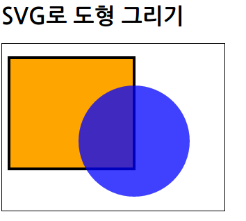

* 코드로 svg 요소 생성
	* ```javascript
	d3.select("#graphArea")		// svg 요소를 생성하는 div 요소를 지정
        .append("svg")					// svg 요소를 추가
        .attr("width", "320px")		// svg 요소의 가로 넓이를 설정
        .attr("height", "240px")	// svg요소 세로 높이를 설정
	```

## 기본 도형 그리기(사각형과 원)

* D3.js에서 실제로 사용하는 SVG 도형 요소
    * | 요소 | 성명 |
      |--------|--------|
      | rect | 사각형/둥근 모서리 사각형 |
      | circle | 원 |
      | path | 패스(복잡한 도형을 그림) |
      | text | 문자 |

**rect 요소를 이용한 사각형과 둥근 모서리 사각형 그리기**

* rect 요소로 지정할 수 있는 속성
	* | 요소 | 설명 |
      |--------|--------|
      | x | X 좌표, default O |
      | y | y 좌표, default 0 |
      | width | 넓이 |
      | height | 높이 |
      | rx | 좌우 방향의 둥근 모서리 반지름 |
      | ry | 위아해 방향의 둥근 모서리 반지름 |

* rect 요소로 사각형 그리기
    *  ```xml
    <h1>사각형</h1>
    <svg>
        <rect x="30" y="20" width="200" height="100" />
    </svg>
    ```
    * 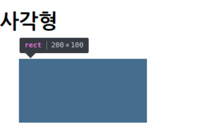

* rect 요소로 둥근 모서리 사각형 그리기
	* ```xml
    <h1>둥근 모서리 사각형</h1>
    <svg>
        <rect x="30" y="20" width="200" height="100" rx="20" ry="20" />
    </svg>
	```
    * 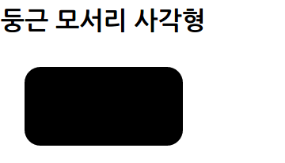

**circle 요소를 이용한 원 그리기**

* circle 요소에 지정할 수 있는 속성
	* | 요소 | 설명 |
      |--------|--------|
      | cx | 원의 중심 X 좌표, default 0 |
      | cy | 원의 중심 Y 좌표, default 0 |
      | r | 원의 반지름 |

* circle 요소로 원 그리기
	* ```xml
	<h1>원</h1>
    <svg>
        <circle cx="160" cy="120" r="100" />
    </svg>
	```
    * 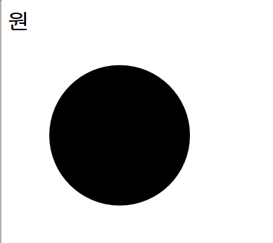

## 패스 그리기

* path 요소를 사용하면 모든 도형을 그릴 수 있다.

* path 요소로 지정할 수 있는 속성
	* | 요소 | 설명 |
      |--------|--------|
      | d | 패스 데이터 |

* d 속성으로 지정할 수 있는 명령과 좌표값
	* | 명령 | 좌표값 |
	  |--------|--------|
      |이동과 관련된 명령||
      |M|절대 X 좌표, 절대 Y 좌표|
      |m|상대 X 좌표, 상대 Y 좌표|
      |패스 제어와 관련돤 명령||
      |Z 혹은 z|패스를 닫음|
      |직선 그리기와 관련된 명령어||
      |L|절대 X 좌표, 절대 Y 좌표|
      |I|상대 X 좌표, 상대 Y 좌표|
      |곡선 그리기와 관련된 명령(3차 베지어 곡선)||
      |C|절대 X 좌표1, 절대 Y 좌표1 절대 X 좌표2, 절대 Y 좌표2 절대 X 좌표3, 절대 Y 좌표3...|
      |c|상대 X 좌표1, 상대 Y 좌표1 상대 X 좌표2, 상대 Y 좌표2 상대 X 좌표3, 상대 Y 좌표3...|
      |타원이나 호와 관련된 명령||
      |A|가로 반지름, 세로 반지름, 회전 각도, 긴 호 그래프1, 짧은 호 그래프, 절대 X 좌표, 절대 Y 좌표|
      |a|가로 반지름, 세로 반지름, 회전 각도, 긴 호 그래프1, 짧은 호 그래프, 상대 X 좌표, 상대 Y 좌표|

* path 요소로 삼각형 그리기
	* ```xml
    <h1>패스(직선)</h1>
    <svg>
        <path d="M80,50 L220,90 L280,200"/>
    </svg>
	```
    * 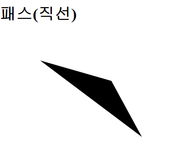

* path 요소 상대좌표 예시
	* 상대 좌표 : 앞에 지정한 좌표를 기준으로 이동
	* ```xml
    <h1>패스(상대 좌표 직선)</h1>
    <svg height="700px">
        <path d="M80,50 L220,90 L280,200"/>
        <path d="M80,50 L220,90 l80,130" fill="red" opacity="0.5"/>
    </svg>
	```
    * 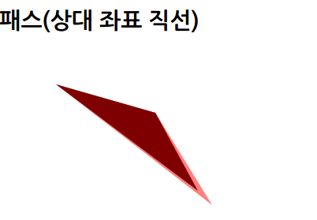

* path 요소로 3차워 베지어 곡선 그리기
	* ```xml
	<h1>패스(곡선)</h1>
    <svg>
        <path d="M10,110 C80,-100 150,80 300,110"/>
    </svg>
	```
    * 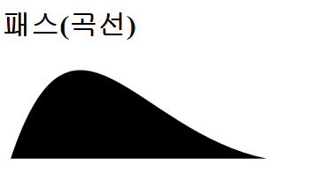

## 도형에 스타일 지정

* 자주 사용하는 SVG 도형 스타일 속성
	* | column | column |
      |--------|--------|
      | fill | 칠하기 색, 지정할 수 있는 값은 CSS와 마찬가지. (예: red, #ed7, rgb(60, 200, 49)) |
      | stroke | 선의 색, 지정할 수 있는 값은 CSS와 마찬가지 |
      | opacity | 불투명도, 지정할 수 있는 값은 CSS와 마찬가지 |
      | stroke-width | 선의 굵기 |
* width, height 속성 등 도형 그리기와 관련된 속성은 스타일시트에서에서 설정할 수 없다.

**style 속성으로 스타을 지정**

* SVG 도현 요소의 style 속성에 스타일 지정
	* ```xml
	<h1>스타일을 SVG에서 지정</h1>
    <svg>
        <rect x="30" y="20" width="200" height="100" style="fill:red;stroke:blue;stroke-width:10px" />
    </svg>
	```

**CSS로 스타일을 지정**

* CSS로 SVG 도형 요소에 스타일을 지정
	* ```xml
    <!DOCTYPE html>
    <html>
        <head>
            <meta charset="utf-8">
            <title>SVG로 그리기</title>
            <style>
                rect {
                    fill:red;
                    stroke:blue;
                    stroke-width:10px;
                }
            </style>
        </head>
        <body>
            <h1>스타일을 CSS로 지정</h1>
            <svg>
                <rect x="30" y="20" width="200" height="100" />
            </svg>
        </body>
    </html>
	```
    * 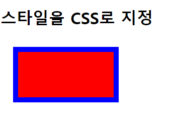

* ID를 사용하여 특정 SVG 도형에 스타일 설정
	* ```xml
    <!DOCTYPE html>
    <html>
        <head>
            <meta charset="utf-8">
            <title>SVG로 그리기</title>
            <style>
                rect {
                    fill:red;
                }
                #box {
                    stroke:blue;
                    stroke-width:10px;
                }
            </style>
        </head>
        <body>
            <h1>ID 이름을 사용하여 지정</h1>
            <svg>
                <rect x="30" y="20" width="200" height="100" />
                <rect x="80" y="70" width="200" height="100" id="box" />
            </svg>
        </body>
    </html>
	```
    * 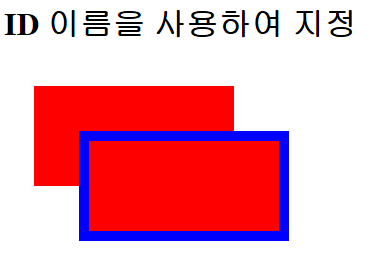


* 클래스를 사용하여 여러 개의 SVG 요소에 스타일 지정
	* ```xml
    <!DOCTYPE html>
    <html>
        <head>
            <meta charset="utf-8">
            <title>SVG로 그리기</title>
            <style>
                rect {
                    fill:red;
                }
                .box {
                    stroke:blue;
                    stroke-width:10px;
                }
            </style>
        </head>
        <body>
            <h1>CSS 클래스로 지정</h1>
            <svg>
                <rect x="30" y="20" width="200" height="100" />
                <rect x="80" y="70" width="200" height="100" class="box" />
                <rect x="130" y="120" width="200" height="100" class="box" />
            </svg>
        </body>
    </html>
	```
    * 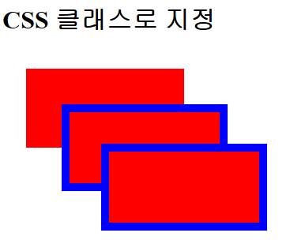

## 문자 그리기

* text 요소로 문자를 표시
	* ```xml
    <h1>문자 표시</h1>
    <svg>
        <text x="25" y="80" style="fill:black">SVG 텍스트 예제</text>
    </svg>
	```
	* 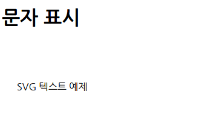

**글꼴이나 크기, 문자의 두께를 지정**

* | 속성 | 설명 |
|--------|--------|
| font-family | 글꼴 지정 |
| font-size | 문자 크기 지정 |
| font-weight | 문자 굵기 지정(100~900, normal, bold, bolder, lighter) |

* text 요소로 문자의 굵기와 문자의 크기를 지정하여 표시
	* ```xml
	<h1>문자 크기 지정</h1>
    <svg>
        <text x="25" y="80" font-size="24px" font-weight="bold" style="fill:black">SVG 텍스트 예제</text>
    </svg>
	```
	* 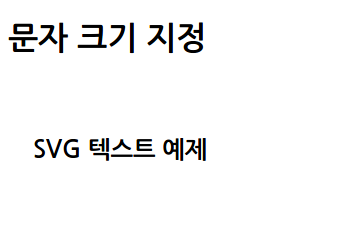


* text 요소로 글꼴을 지정하여 문자를 표시
	* ```xml
	<h1>문자의 글꼴 지정</h1>
    <svg>
        <text x="25" y="40" font-size="24px" style="fill:black">SVG 텍스트 예제</text>
        <text x="25" y="80" font-size="24px" font-family="바탕" style="fill:black">SVG 텍스트 예제</text>
        <text x="25" y="120" font-size="24px" font-family="궁서" style="fill:black">SVG 텍스트 예제</text>
    </svg>
	```
    * 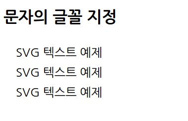

**문자의 표시 기준 위치 설정**

* text-anchor에 지정할 수 있는 값
	* | column | column |
      |--------|--------|
      | start | 왼쪽 맞춤 |
      | middle | 가운데 맞춤 |
      | end | 오른쪽 맞춤 |

* text 요소로 문자 표시 기준 위치 변경
    * ```xml
    <h1>문자의 위치 설정</h1>
    <svg width=400>
        <rect x="200" y="0" width="1" height="160" style="fill:red" />
        <text x="200" y="40" text-anchor="start" style="fill:black">SVG 텍스트 예제</text>
        <text x="200" y="80" text-anchor="middle" style="fill:black">SVG 텍스트 예제</text>
        <text x="200" y="120" text-anchor="end" style="fill:black">SVG 텍스트 예제</text>
    </svg>
    ```
    * 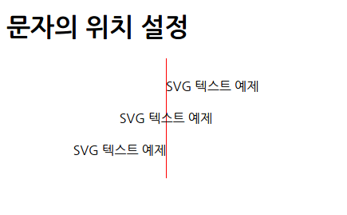

## 그룹과 도형의 이동

**한꺼번에 스타일 지정**

* SVG 요소를 그룹화하여 한꺼번에 스타일 지정
	* ```xml
	<h1>도형 그룹화</h1>
    <svg>
        <g style="opacity:0.25">
            <rect x="200" y="50" width="100" height="80" />
            <text x="200" y="40" text-anchor="start" style="fill:black">Sample Text</text>
        </g>
    </svg>
	```
    * 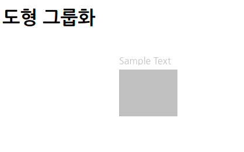

**한꺼번에 위치 지정**

* 한꺼번에 위치 지정
	* | column | column |
      |--------|--------|
      | translate(tx, ty) | 상대적 위치로 이동(예: 오른쪽으로 10px, 위로 20px이동 -> translate(10, -20)) |
      | scale(s) 또는 scale(sx, sy) | 확대/축소(예: 가로로 31ㅐ, 세로로 4배 확대 -> scale(3, 4)) |
      | rorate(d) 또는 rorate(d, cx, cy) | 회전(예: 반시계방향으로 45도 회전 -> rorate(-45)) |

* SVG 요호를 그룹화하여 한꺼번에 위치를 조정
	* ```xml
	<h1>도형 이동</h1>
    <svg>
        <g transform="translate(-200, 40)">
            <rect x="200" y="50" width="100" height="80" />
            <text x="200" y="40" text-anchor="start" style="fill:black">Sample Text</text>
        </g>
    </svg>
	```
    * 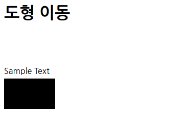

**한꺼번에 도형 회전**

* SVG 요소를 그룹화하여 한꺼번에 회전
	* ```xml
	<h1>도형 회전</h1>
    <svg>
        <g transform="rotate(45, 200, 100)">
            <rect x="200" y="50" width="100" height="80" />
            <text x="200" y="40" text-anchor="start" style="fill:black">Sample Text</text>
        </g>
    </svg>
	```
    * 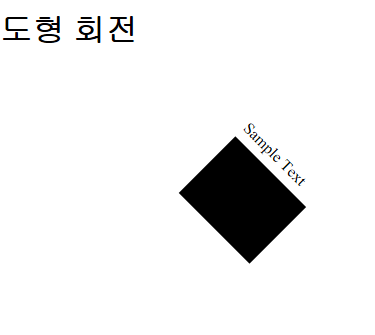

**한꺼번에 확대/축소**

* SVG 요소를 그룹화하여 한꺼번에 확대
	* ```xml
	<h1>도형 확대</h1>
    <svg>
        <g transform="scale(2.0)">
            <rect x="20" y="50" width="100" height="80" />
            <text x="20" y="40" text-anchor="start" style="fill:black">Sample Text</text>
        </g>
    </svg>
	```
    * 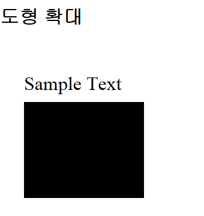