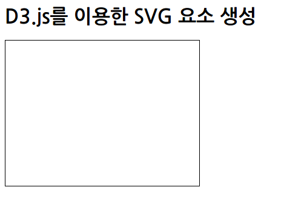

# D3.js로 SVG 다루기

[TOC]

## D3.js로 SVG 도형 생성

**svg 요소 혹은 rect 요소 생성**

**svg 요소 생성**

* svg 요소를 생성할 대상이 되는 요소를 ID 이름으로 지정
	* ```javascript
	d3.select("#myGraph")
	```
    * select() 메서드 : 셀렉터와 일치하는 첫 번째 요소만을 대상으로함 ( document.querySeletor(), $())
* D3.js로 svg 요소 생성
	* ```xml
	<!DOCTYPE html>
    <html>
        <head>
            <meta charset="utf-8">
            <title>SVG</title>
            <script src="http://d3js.org/d3.v3.min.js" charset="utf-8"></script>
            <style>
                svg { width: 320px; height: 240px; border: 1px solid black; }
                rect { fill : orange; }
            </style>
        </head>
        <body>
            <h1>D3.js를 이용한 SVG 요소 생성</h1>
            <div id="myGraph"></div>
            <script src="js/sample.js"></script>
        </body>
    </html>
	```
    * ```javascript
    d3.select("#myGraph")	// ID 이름 myGraph를 지정
		.append("svg")	// svg 요소 추가
    ```
	* 

**rect 요소 생성**

* D3.js으로 svg 요소를 생성하고 그 안에 rect 요소를 생성
    * ```javascript
    d3.select("#myGraph")	// ID 이름 myGraph를 지정
        .append("svg")	// svg 요소 추가
        .append("rect")	// rect 요소 추가
    ```
	* 

**여러 개의 rect 요소 생성**

* D3.js으로 svg 요소를 생성하고 그 안에 여러 개의 rect 요소를 생성
	* ```xml
	<h1>D3.js를 이용한 SVG 요소 생성</h1>
    <div id="myGraph"></div>
	```
    * ```javascript
    var svg1 = d3.select("#myGraph")	// ID 이름 myGraph를 지정
        .append("svg")	// svg 요소 추가
    svg1.append("rect")	// rect 요소를 svg 요소에 추가
    svg1.append("rect")	// rect 요소를 svg 요소에 추가
    ```
	* 


## 도형의 위치나 크기 지정

* D3.js로 rect 요소의 위치나 크기를 지정
	* ```javascript
	d3.select("#myGraph")	// ID 이름 myGraph를 지정
        .append("svg")	// svg 요소 추가
        .append("rect")	// rect 요소를 svg 요소에 추가
        .attr("x", "10px")	// X 좌표를 10px로 설정
        .attr("y", "50px")	// Y 좌표를 50px로 설정
        .attr("width", "200px")	// 넓이를 200px로 설정
        .attr("height", "30px")	// 높이를 30px로 설정
	```
	* 

**특정 도형 다루기**

* ID 이름을 사용하여 rect 요소 다루기
	* ```xml
	<h1>D3.js로 SVG 속성 다루기</h1>
    <svg>
        <rect id="myBar" x="0" y="50" width="100" height="25" />
    </svg>
	```
    * ```javascript
    d3.select("#myBar")	// ID 이름을 myBar로 지정
        .attr("x", "10px")	// X 좌표를 10px로 설정
        .attr("y", "50px")	// Y 좌표를 50px로 설정
        .attr("width", "200px")	// 넓이를 200px로 설정
        .attr("height", "30px")	// 높이를 30px로 설정
    ```

* 스타일이나 속성을 한 번에 지정 (객체 리터럴 형식)
	* ```javascript
	d3.select("#myBar")		// ID 이름에 myBar를 지정
    	.attr({
        x : "10px",			// X 좌표를 10px로 설정
        y : "50px",			// Y 좌표를 50px로 설정
        width : "200px",	// 넓이를 200px로 설정
        height : "30px"		// 높이를 30px로 설정
        })
	```

* attr() 메서드의 기타 사용법
	* 애니매이션의 시작값과 끝값을 attr() 메서드로 지정
	* ```javascript
	d3.select("#myBar")
    	.attr("x", "10px")
        .attr("y", "50px")
        .attr("width", "200px")
        .attr("height", "30px")
        .transition()
        .duration(3000)
        .attr("width", "50px")
	```

## 도형 스타일 지정

* D3.js로 rect 요소의 칠하기나 선의 색을 지정
	* ```xml
	<h1>D3.js로 스타일 다루기</h1>
    <svg>
        <rect id="myBar" x="0" y="50" width="100" height="25" />
    </svg>
	```
    * ```javascript
    d3.select("#myBar")	// ID 이름을 myBar로 지정
        .attr("x", "10px")	// X 좌표를 10px로 설정
        .attr("y", "50px")	// Y 좌표를 50px로 설정
        .attr("width", "200px")	// 넓이를 200px로 설정
        .attr("height", "30px")	// 높이를 30px로 설정
        .style("fill", "red")	// 스타일의 fill 속성을 red로 설정
        .style("stroke", "black")	// 선의 색을 검정으로 설정
    ```

**CSS 클래스 이름으로 요소를 지정할 때의 주의점**

* CSS 클래스 이름을 사용하여 요소를 다룸(d3.select() 일 때)
	* ```xml
	<!DOCTYPE html>
    <html>
        <head>
            <meta charset="utf-8">
            <title>SVG</title>
            <script src="http://d3js.org/d3.v3.min.js" charset="utf-8"></script>
            <style>
                svg { width: 320px; height: 240px; border: 1px solid black; }
                .bar { fill : orange; }
            </style>
        </head>
        <body>
            <h1>D3.js로 스타일 다루기</h1>
            <svg>
                <rect class="bar" x="0" y="10" width="60" height="25" />
                <rect class="bar" x="0" y="50" width="100" height="25" />
                <rect class="bar" x="0" y="90" width="160" height="25" />
                <rect class="bar" x="0" y="130" width="220" height="25" />
            </svg>
            <script src="js/sample.js"></script>
        </body>
    </html>
	```
    * ```javascript
    d3.select(".bar")	// CSS 클래스 이름을  bar로 지정
        .style("fill", "red")	// 스타일 fill 속성에 red를 지정
        .style("stroke", "black")	// 선의 색을 검정으로 설정
    ```
    * 

**스타일 설정을 CSS 쪽에서 수행하려면**

* 요소의 스타일 설정을 CSS 쪽에서 수행
	* ```xml
    <!DOCTYPE html>
    <html>
        <head>
            <meta charset="utf-8">
            <title>SVG</title>
            <script src="http://d3js.org/d3.v3.min.js" charset="utf-8"></script>
            <style>
                svg { width: 320px; height: 240px; border: 1px solid black; }
                .bar { fill : orange; }
                .bar_note { fill : red; }
            </style>
        </head>
        <body>
            <h1>D3.js로 스타일 다루기</h1>
            <svg>
                <rect class="bar" x="0" y="10" width="60" height="25" />
                <rect class="bar" x="0" y="50" width="100" height="25" />
                <rect class="bar" x="0" y="90" width="160" height="25" />
                <rect class="bar" x="0" y="130" width="220" height="25" />
            </svg>
            <script src="js/sample.js"></script>
        </body>
    </html>
	```
    * ```javascript
    d3.select(".bar")	// CSS 클래스 이름에 bar를 지정
        .attr("class", "bar_note")	//  요소의 class 속성에 bar_note를 지정
    ```

**attr() 메서드로 스타일을 한꺼번에 지정**

* attr() 메서드 요소의 스타일을 한꺼번에 지정
	* ```xml
    <!DOCTYPE html>
    <html>
        <head>
            <meta charset="utf-8">
            <title>SVG</title>
            <script src="http://d3js.org/d3.v3.min.js" charset="utf-8"></script>
            <style>
                svg { width: 320px; height: 240px; border: 1px solid black; }
                .bar { fill : orange; }
            </style>
        </head>
        <body>
            <h1>attr() 메서드로 한꺼번에 지정</h1>
            <svg>
                <rect class="bar" x="0" y="10" width="60" height="25" />
                <rect class="bar" x="0" y="50" width="100" height="25" />
                <rect class="bar" x="0" y="90" width="160" height="25" />
                <rect class="bar" x="0" y="130" width="220" height="25" />
            </svg>
            <script src="js/sample.js"></script>
        </body>
    </html>
	```
    * ```javascript
    d3.select(".bar")	// CSS 클래스 이름에 bar를 지정
		.attr("style", "fill:red;stroke:black")	// 스타일 일괄 지정
    ```
    * 

## 여러 개의 도형 다루기

* D3.js 여러 개의 rect 요소에 한꺼번에 스타일을 지정 - 1
	* ```xml
    <!DOCTYPE html>
    <html>
        <head>
            <meta charset="utf-8">
            <title>SVG</title>
            <script src="http://d3js.org/d3.v3.min.js" charset="utf-8"></script>
            <style>
                svg { width: 320px; height: 240px; border: 1px solid black; }
                .bar { fill : orange; }
                .bar_note { fill : red; }
            </style>
        </head>
        <body>
            <h1> 요소를 한꺼번에 지정</h1>
            <svg>
                <rect class="bar" x="0" y="10" width="60" height="25" />
                <rect class="bar" x="0" y="50" width="100" height="25" />
                <rect class="bar" x="0" y="90" width="160" height="25" />
                <rect class="bar" x="0" y="130" width="220" height="25" />
            </svg>
            <script src="js/sample.js"></script>
        </body>
    </html>
	```
    * ```javascript
    d3.selectAll(".bar")	// CSS 클래스 이름에 bar를 지정
		.attr("class", "bar_note")	//  요소의 class 속성에 bar_note를지정
    ```
    * 

* D3.js 여러 개의 rect 요소에 한꺼번에 스타일을 지정 - 2
	* ```xml
    <!DOCTYPE html>
    <html>
        <head>
            <meta charset="utf-8">
            <title>SVG</title>
            <script src="http://d3js.org/d3.v3.min.js" charset="utf-8"></script>
            <style>
                svg { width: 320px; height: 240px; border: 1px solid black; }
                .bar { fill : orange; }
            </style>
        </head>
        <body>
            <h1>D3.js로  여러 개의  도형 다루기</h1>
            <svg>
                <rect class="bar" x="0" y="10" width="60" height="25" />
                <rect class="bar" x="0" y="50" width="100" height="25" />
                <rect class="bar" x="0" y="90" width="160" height="25" />
                <rect class="bar" x="0" y="130" width="220" height="25" />
            </svg>
            <script src="js/sample.js"></script>
        </body>
    </html>
	```
	* ```javascript
	d3.selectAll(".bar")	// CSS 클래스 이름에 bar를 지정
        .style("fill", "red")	// 스타일 fill 속성에 red를 지정
        .style("stroke", "black")	// 선의 색을 검은색으로 설정
	```

* 여러 개의 요소 중 특정 순서의 요소에 스타일을 지정
	* ```xml
    <!DOCTYPE html>
    <html>
        <head>
            <meta charset="utf-8">
            <title>SVG</title>
            <script src="http://d3js.org/d3.v3.min.js" charset="utf-8"></script>
            <style>
                svg { width: 320px; height: 240px; border: 1px solid black; }
                .bar { fill : orange; }
            </style>
        </head>
        <body>
            <h1>특정 순서의 도형 다루기</h1>
            <svg>
                <rect class="bar" x="0" y="10" width="60" height="25" />
                <rect class="bar" x="0" y="50" width="100" height="25" />
                <rect class="bar" x="0" y="90" width="160" height="25" />
                <rect class="bar" x="0" y="130" width="220" height="25" />
            </svg>
            <script src="js/sample.js"></script>
        </body>
    </html>
	```
    * ```javascript
    d3.selectAll(".bar")	// CSS 클래스 이름에 bar를 지정
        .style("fill", function(d,i){	// 2번째의 파라미터에 함수를 지정
            if(i == 2){	// 순서를 조사
                return "red";	// 3번째라면 빨간색을 나타내는 문자를 반환
            }
        })
    ```