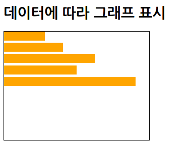

# 다양한 형식의 파일로부터 데이터 불러오기

* 외부 파일을 불러와 처리할 때는 코드와 데이터를 서버에 업로드한 다음 동작을 확인할 필요가 있다.

[TOC]

## 코드 안에 있는 단순 배열 데이터일 때

* 자바스크립트의 배열 데이터를 이용하여 그래프 그리기
	* ```xml
    <!DOCTYPE html>
    <html>
        <head>
            <meta charset="utf-8">
            <title>Sample</title>
            <script src="http://d3js.org/d3.v3.min.js" charset="utf-8"></script>
            <style>
                svg { width: 320px; height: 240px; border: 1px solid black; }
                .bar { fill : orange; }
            </style>
        </head>
        <body>
            <h1>데이터에 따라 그래프 표시</h1>
            <svg id="myGraph"></svg>
            <script src="js/sample.js"></script>
        </body>
    </html>
	```
    * ```javascript
    // 데이터셋이 코드 안에 배열로 준비되었을 때
    var dataSet = [ 50, 10, 120, 200, 90 ];
    // 그래프 그리기
    d3.select("#myGraph")
        .selectAll("rect")	// rect 요소를 지정
        .data(dataSet)	// 데이터를 요소에 연결
        .enter()	// 데이터 개수만큼 반복
        .append("rect")	// 데이터 개수만큼 rect 요소가 추가됨
        .attr("class", "bar")	// CSS 클래스를 지정
        .attr("width", function(d,i){	// 넓이를 지정. 두 번째의 파라미터에 함수를 지정
            return d;	// 데이터 값을 그대로 넓이로 반환
        })
        .attr("height", 20)	// 높이를 지정
        .attr("x", 0)	// X 좌표를 0으로 함
        .attr("y", function(d, i){	// Y 좌표를 지정함
            return i * 25	// 표시 순서에 25를 곱해 위치를 계산
        })
    ```
    * 

## TSV 형식 파일 불러오기

* TSV 형식의 데이터
	* ```
	item1	item2	item3
    50	80	900
    160	120	30
    280	300	250
    300	250	160
    60	80	100
	```

* TSV 형식의 파일을 불러와 그래프 그리기
	* ```javascript
    // 데이터셋이 TSV 파일일 때
    d3.tsv("mydata.tsv", function(error, data){
        var dataSet = [ ];	// 데이터를 저장할 배열을 준비
        for(var i=0; i<data.length; i++){	// 데이터 줄 수만큼 반복
            dataSet.push(data[i].item1);	// item1의 레이블 데이터만 추출
        }
        // 그래프 그리기
        d3.select("#myGraph")
            .selectAll("rect")	// rect 요소 지정
            .data(dataSet)	// 데이터를 요소에 연결
            .enter()	// 데이터 개수만큼 반복
            .append("rect")	// 데이터 개수만큼 rect 요소가 추가됨
            .attr("class", "bar")	// CSS 클래스를 지정
            .attr("width", function(d,i){	// 넓이를 지정. 두 번째의 파라미터에 함수를 지정
                return d;	// 데이터 값을 그대로 넓이로 반환
            })
            .attr("height", 20)	// 높이를 지정
            .attr("x", 0)	// X 좌표를 0으로 함
            .attr("y", function(d, i){	// Y 좌표를 지정함
                return i * 25	// 표시 순서에 25를 곱해 위치를 계산
            })
    })
	```
	* 

* d3.tsv() : TSV 형식의 파일을 불러옴
	* ```javascript
    d3.tvs(url[, accessor][, callback]
	```]
* 첫 번째 파라미터 불러올 TSV 형식 파일의 URL
* 두 번째 파라미터 : 파일 불러오기가 완료되었을 때 호출할 함수 지정
    * 첫 번째 파라미터 : 비동기 통신을 수행하는 객체 (XMLHttpRequest 객체)
    * 에러 확인 : XMLHttpRequest 객체의 status 속성을 조사
    * | 값 | 설명 |
      |--------|--------|
      | 200 | 파일을 정상적으로 불러옴 |
      | 400 | 올바르지 않은 요청(에러) |
      | 403 | 열람이 허가되지 않음(에러) |
      | 404 | 파일이 없음(에러) |
    * 두 번째 파라미터 : 불러온 데이터가 객체로 전달

* D3.js로 그래프를 그릴 때 '데이터 형식을 그래프를 그리는 코드에 맞추는 방식'으로 진행한다.

## CSV 형식 파일 불러오기

* CSV 형식의 데이터
	* ```
	item1,item2,item3
    120,60,300
    60,50,80
    300,30,90
    80,10,40
    220,200,150
	```

* CSV 형식 파일을 불러와 그래프를 그림
	* ```javascript
	// 데이터셋이 CSV 파일일 때
    d3.csv("mydata.csv", function(error, data){
        var dataSet = [ ];	// 데이터를 저장할 배열을 준비
        for(var i=0; i<data.length; i++){	// 데이터 줄 수만큼 반복
            dataSet.push(data[i].item1);	// item1의 레이블 데이터만 추출
        }
        // 그래프 그리기
        d3.select("#myGraph")
          .selectAll("rect")	// rect 요소 지정
          .data(dataSet)	// 데이터를 요소에 연결
          .enter()	// 데이터 개수만큼 반복
          .append("rect")	// 데이터 개수만큼 rect 요소가 추가됨
          .attr("class", "bar")	// CSS 클래스를 지정
          .attr("width", function(d,i){	// 넓이를 지정. 두 번째의 파라미터에 함수를 지정
                return d;	// 데이터 값을 그대로 넓이로 반환
          })
          .attr("height", 20)	// 높이를 지정
          .attr("x", 0)	// X 좌표를 0으로 함
          .attr("y", function(d, i){	// Y 좌표를 지정함
                return i * 25	// 표시 순서에 25를 곱해 위치를 계산
          })
    })
	```
	* 

* d3.csv() : CSV 형식의 파일을 불러옴
	* ```javascript
    d3.csv(url[, accessor][, callback])
	```]
* 첫 번째 파라미터 불러올 CSV 형식 파일의 URL
* 두 번째 파라미터 : 파일 불러오기가 완료되었을 때 호출할 함수 지정
    * 첫 번째 파라미터 : 비동기 통신을 수행하는 객체 (XMLHttpRequest 객체)
    * 두 번째 파라미터 : 불러온 데이터가 객체로 전달

**헤더 이름이 한글일 때**

* 헤더 이름에 한글을 사용한 CSV 파일을 불러와 그래프 그리기 - 1
	* ```javascript
	// 데이터셋이 CSV 파일일 때(헤더가 한글일 때)
    d3.csv("mydata.csv", function(error, data){
        var dataSet = [ ];	// 데이터를 저장할 배열을 준비
        for(var i=0; i<data.length; i++){	// 데이터 줄 수만큼 반복
            dataSet.push(data[i]["상품A"]);	// 상품A의 레이블 데이터만 추출
        }
        // 그래프 그리기
        d3.select("#myGraph")
          .selectAll("rect")	// rect 요소 지정
          .data(dataSet)	// 데이터를 요소에 연결
          .enter()	// 데이터 개수만큼 반복
          .append("rect")	// 데이터 개수만큼 rect 요소가 추가됨
          .attr("class", "bar")	// CSS 클래스를 지정
          .attr("width", function(d,i){	// 넓이를 지정. 두 번째의 파라미터에 함수를 지정
                return d;	// 데이터 값을 그대로 넓이로 반환
            })
          .attr("height", 20)	// 높이를 지정
          .attr("x", 0)	// X 좌표를 0으로 함
          .attr("y", function(d, i){	// Y 좌표를 지정함
                return i * 25	// 표시 순서에 25를 곱해 위치를 계산
            })
    })
	```

**한글 헤더 이름을 row() 메서드로 처리**

* row() : 줄단위로 데이터 전달
* get() : 

* row() 메서드에 헤더 처리를 수행할 함수를 지정하여 한글 헤더 이름을 처리
	* ```javascript
	var dataSet = [300, 130, 5, 60, 240];
    d3.csv("mydata.csv")
        .row(function(d){
            return {
                item1 : d["상품A"],
                item2 : d["상품B"],
                item3 : d["상품C"],
            }
        })
	```

* get() 메서드를 이용하여 데이터 셋을 작성
	* ```javascript
	.get(function(error, data){
		var dataSet = [ ];	// 데이터를 저장할 배열을 준비
		for(var i=0; i<data.length; i++){	// 데이터 줄 수만큼 반복
			dataSet.push(data[i].item1);	// 상품A＝item1의 레이블 데이터만 추출
		}
	```

* 헤더 이름에 한글을 사용한 CSV 파일을 불러와 그래프 그리기 - 2
	* ```javascript
	// 데이터셋이 CSV 파일일 때
    d3.csv("mydata.csv")
        .row(function(d){
            return {
                item1 : d["상품A"],
                item2 : d["상품B"],
                item3 : d["상품C"],
            }
        })
        .get(function(error, data){
            var dataSet = [ ];	// 데이터를 저장할 배열을 준비
            for(var i=0; i<data.length; i++){	// 데이터 줄 수만큼 반복
                dataSet.push(data[i].item1);	// 상품A＝item1의 레이블 데이터만 추출
            }
        // 그래프 그리기
        d3.select("#myGraph")
          .selectAll("rect")	// rect 요소 지정
          .data(dataSet)	// 데이터를 요소에 연결
          .enter()	// 데이터 개수만큼 반복
          .append("rect")	// 데이터 개수만큼 rect 요소가 추가됨
          .attr("class", "bar")	// CSS 클래스를 지정
          .attr("width", function(d,i){	// 넓이를 지정. 두 번째의 파라미터에 함수를 지정
            return d;	// 데이터 값을 그대로 넓이로 반환
          })
          .attr("height", 20)	// 높이를 지정
          .attr("x", 0)	// X 좌표를 0으로 함
          .attr("y", function(d, i){	// Y 좌표를 지정함
            return i * 25	// 표시 순서에 25를 곱해 위치를 계산
          })
    })
	```

**row() 메서드 안에서 미리 데이터를 가공**

* CSV 형식 파일을 불러와 데이터의 값을 반으로 나눈 다음 그래프 그리기
	* ```javascript
	// 데이터셋이 CSV 파일일 때
    d3.csv("mydata.csv")
        .row(function(d){
            return {
                item1 : d["상품A"] / 2	// 데이터 가공
            }
        })
        .get(function(error, data){
            var dataSet = [ ];	// 데이터를 저장할 배열을 준비
            for(var i=0; i<data.length; i++){	// 데이터 줄 수만큼 반복
                dataSet.push(data[i].item1);	// 상품A＝item1의 레이블 데이터만 추출
            }
        // 그래프 그리기
        d3.select("#myGraph")
            .selectAll("rect")	// rect 요소 지정
            .data(dataSet)	// 데이터를 요소에 연결
            .enter()	// 데이터 개수만큼 반복
            .append("rect")	// 데이터 개수만큼 rect 요소가 추가됨
            .attr("class", "bar")	// CSS 클래스를 지정
            .attr("width", function(d,i){	// 넓이를 지정. 두 번째의 파라미터에 함수를 지정
                return d;	// 데이터 값을 그대로 넓이로 반환
            })
            .attr("height", 20)	// 높이를 지정
            .attr("x", 0)	// X 좌표를 0으로 함
            .attr("y", function(d, i){	// Y 좌표를 지정함
                return i * 25	// 표시 순서에 25를 곱해 위치를 계산
            })
    })
	```
    * 

## JSON 형식 파일 불러오기

* JSON 형식의 데이터
	* ```
	[
        { "item" : "상품A", "sales" : [ 150, 90, 300 ] },
        { "item" : "상품B", "sales" : [ 70, 260, 110 ] },
        { "item" : "상품C", "sales" : [ 20, 40, 280 ] },
        { "item" : "상품D", "sales" : [ 80, 100, 50 ] },
        { "item" : "상품E", "sales" : [ 190, 100, 220 ] }
    ]
	```

* JSON 형식 파일을 불러와 그래프 그리기
	* ```javascript
	// 데이터셋이 JSON 파일일 때
    d3.json("mydata.json", function(error, data){
        var dataSet = [ ];	// 데이터를 저장할 배열을 준비
        for(var i=0; i<data.length; i++){	// 데이터 줄 수만큼 반복
            dataSet.push(data[i].sales[0]);	// sales의 최초 데이터만 추출
        }
        // 그래프 그리기
        d3.select("#myGraph")
          .selectAll("rect")	// rect 요소 지정
          .data(dataSet)	// 데이터를 요소에 연결
          .enter()	// 데이터 개수만큼 반복
          .append("rect")	// 데이터 개수만큼 rect 요소가 추가됨
          .attr("class", "bar")	// CSS 클래스를 지정
          .attr("width", function(d,i){	// 넓이를 지정. 두 번째의 파라미터에 함수를 지정
                return d;	// 데이터 값을 그대로 넓이로 반환
            })
          .attr("height", 20)	// 높이를 지정
          .attr("x", 0)	// X 좌표를 0으로 함
          .attr("y", function(d, i){	// Y 좌표를 지정함
                return i * 25	// 표시 순서에 25를 곱해 위치를 계산
            })
    })
	```
    * 

* d3.json() : JSON 형식의 파일을 불러옴
	* ```javascript
    d3.json(url[, callback])
	```]
* 첫 번째 파라미터 불러올 JSON 형식 파일의 URL
* 두 번째 파라미터 : 파일 불러오기가 완료되었을 때 호출할 함수 지정
    * 첫 번째 파라미터 : 비동기 통신을 수행하는 객체 (XMLHttpRequest 객체)
    * 두 번째 파라미터 : 불러온 데이터가 객체로 전달

## HTML 형식 파일 불러오기

* table 요소를 사용하여 준비한 HTML 형식의 데이터
    * ```xml
    <!DOCTYPE html>
    <html>
        <head>
            <meta charset="utf-8">
            <title>매출 데이터</title>
            <style>
                table, th, td { border: 1px solid gray; }
            </style>
        </head>
        <body>
            <h1>매출 데이터</h1>
            <table>
                <tr><th>상품A</th><th>상품B</th><th>상품C</th></tr>
                <tr><td>90</td><td>60</td><td>200</td></tr>
                <tr><td>130</td><td>160</td><td>250</td></tr>
                <tr><td>200</td><td>90</td><td>40</td></tr>
                <tr><td>160</td><td>40</td><td>90</td></tr>
                <tr><td>290</td><td>150</td><td>200</td></tr>
            </table>
        </body>
    </html>
    ```

* HTML 형식 파일을 불러와 그래프 그리기
	* ```javascript
	// 데이터셋이 HTML 파일일 때
    d3.html("mydata.html", function(error, docFragment){
        var tr = docFragment.querySelectorAll("table tr");	// table 요소에서 tr 요소를 추출
        var dataSet = [ ];	// 데이터를 저장할 배열을 준비
        for(var i=1; i<tr.length; i++){	// tr 요소의 줄 수-1만큼 반복(1번째 행 헤더는 무시)
            var d = tr[i].querySelectorAll("td")[0].firstChild.nodeValue;	// 데이터 읽어들이기
            dataSet.push(d);	// 상품A의 데이터만 추출
        }
        // 그래프 그리기
        d3.select("#myGraph")
          .selectAll("rect")	// rect 요소 지정
          .data(dataSet)	// 데이터를 요소에 연결
          .enter()	// 데이터 개수만큼 반복
          .append("rect")	// 데이터 개수만큼 rect 요소가 추가됨
          .attr("class", "bar")	// CSS 클래스를 지정
          .attr("width", function(d,i){	// 넓이를 지정. 두 번째의 파라미터에 함수를 지정
                return d;	// 데이터 값을 그대로 넓이로 반환
          })
          .attr("height", 20)	// 높이를 지정
          .attr("x", 0)	// X 좌표를 0으로 함
          .attr("y", function(d, i){	// Y 좌표를 지정함
                return i * 25	// 표시 순서에 25를 곱해 위치를 계산
          })
    })
	```
	* 

* d3.html() : HTML 형식의 파일을 불러옴
	* ```javascript
    d3.json(url[, callback])
	```]
* 첫 번째 파라미터 불러올 HTML 형식 파일의 URL
* 두 번째 파라미터 : 파일 불러오기가 완료되었을 때 호출할 함수 지정
    * 첫 번째 파라미터 : 비동기 통신을 수행하는 객체 (XMLHttpRequest 객체)
    * 두 번째 파라미터 : 불러온 HTML 파일이 분리된 문서 객체 모델로서 전달 (문서조각)
    	* 각 요소가 DOM 트리로 구성
    	* 전달된 파라미터를 문서 루트로서 다룰 수 있다.
    	* 일반적인 DOM 조작을 수행하는 메서드를 이용할 수 있다.
* HTML 형식은 데이터 포맷 파일로서는 적절하지 않다.
	* HTML 파일의 구성이 변하거나 하면 데이터를 불러오는 데 실패할 수 있기 때문

## XML 형식 파일 불러오기

* 상품 매출 데이터가 들어 있는 XML 형식 파일
	* ```xml
	<?xml version="1.0" encoding="utf-8" ?>
    <datalist>
    <data><item>상품A</item><sales>150</sales><sales>90</sales><sales>300</sales><sales>200</sales><sales>120</sales></data>
    <data><item>상품B</item><sales>70</sales><sales>260</sales><sales>110</sales><sales>30</sales><sales>90</sales></data>
    <data><item>상품C</item><sales>20</sales><sales>40</sales><sales>280</sales><sales>80</sales><sales>190</sales></data>
    <data><item>상품D</item><sales>80</sales><sales>100</sales><sales>50</sales><sales>150</sales><sales>120</sales></data>
    <data><item>상품E</item><sales>190</sales><sales>100</sales><sales>220</sales><sales>280</sales><sales>300</sales></data>
    </datalist>
	```

* XML 형식 파일을 불러와 그래프 그리기
	* ```javascript
	// 데이터셋이 XML 파일일 때
    d3.xml("mydata.xml", function(error, xmlRoot){
        var xmlData = xmlRoot.querySelectorAll("data");	// data 요소를 추출
        var salesRoot = xmlData[0];	// 상품A의 데이터만 추출
        var salesData = salesRoot.querySelectorAll("sales");	// sales 요소를 추출
        var dataSet = [ ];	// 데이터를 저장할 배열을 준비
        for(var i=0; i<salesData.length; i++){	// sales 요소 개수만큼 반복
            var d = salesData[i].firstChild.nodeValue;	// 데이터 읽어들이기
            dataSet.push(d);
        }
        // 그래프 그리기
        d3.select("#myGraph")
          .selectAll("rect")	// rect 요소 지정
          .data(dataSet)	// 데이터를 요소에 연결
          .enter()	// 데이터 개수만큼 반복
          .append("rect")	// 데이터 개수만큼 rect 요소가 추가됨
          .attr("class", "bar")	// CSS 클래스를 지정
          .attr("width", function(d,i){	// 넓이를 지정. 두 번째의 파라미터에 함수를 지정
                return d;	// 데이터 값을 그대로 넓이로 반환
          })
          .attr("height", 20)	// 높이를 지정
          .attr("x", 0)	// X 좌표를 0으로 함
          .attr("y", function(d, i){	// Y 좌표를 지정함
                return i * 25	// 표시 순서에 25를 곱해 위치를 계산
          })
    })
	```
	* 

* d3.xml() : XML 형식의 파일을 불러옴
	* ```javascript
    d3.xml(url[, mineType][, callback])
	```]
* 첫 번째 파라미터 불러올 XML 형식 파일의 URL
* 두 번째 파라미터 : 파일 불러오기가 완료되었을 때 호출할 함수 지정
    * 첫 번째 파라미터 : 비동기 통신을 수행하는 객체 (XMLHttpRequest 객체)
    * 두 번째 파라미터 : 불러온 XML 파일의 루트 노드 전달

## 불러온 파일이 단순 텍스트일 때

* 빗금으로 데이터가 구분된 단순 텍스트 파일
	* ```
	상품A/10/90/120/60/300
    상품B//70/260/110/90/180
    상품C//20/40/280/240/220
    상품D//80/100/50/90/130
    상품E/120/100/22/66/160/300
	```

* 단순 텍스트 파일을 불러와 그래프 그리기
	* ```javascript
	// 데이터셋이 플레인 텍스트 파일일 때
    d3.text("mydata.txt", function(error, plainText){
        var data = plainText.split("\x0a");	// \0x0a는 줄바꿈 코드
        var dataSet = [ ];	// 데이터를 저장할 배열을 준비
        var sales = data[0].split("/");	// 처음 1줄을 / 구분자로 나누어 데이터를 분할
        for(var i=1; i<sales.length; i++){
            dataSet.push(sales[i]);	// sales 데이터 추출
        }
        // 그래프 그리기
        d3.select("#myGraph")
          .selectAll("rect")	// rect 요소 지정
          .data(dataSet)	// 데이터를 요소에 연결
          .enter()	// 데이터 개수만큼 반복
          .append("rect")	// 데이터 개수만큼 rect 요소가 추가됨
          .attr("class", "bar")	// CSS 클래스를 지정
          .attr("width", function(d,i){	// 넓이를 지정. 두 번째의 파라미터에 함수를 지정
            return d;	// 데이터 값을 그대로 넓이로 반환
          })
          .attr("height", 20)	// 높이를 지정
          .attr("x", 0)	// X 좌표를 0으로 함
          .attr("y", function(d, i){	// Y 좌표를 지정함
            return i * 25	// 표시 순서에 25를 곱해 위치를 계산
          })
    })
	```
	* 

* d3.text() : 단순 텍스트 파일을 불러옴
	* ```javascript
    d3.text(url[, mineType][, callback])
	```]
* 첫 번째 파라미터 불러올 단순 텍스트 파일의 URL
* 두 번째 파라미터 : 파일 불러오기가 완료되었을 때 호출할 함수 지정
    * 첫 번째 파라미터 : 비동기 통신을 수행하는 객체 (XMLHttpRequest 객체)
    * 두 번째 파라미터 : 불러온 텍스트 파일의 전체 내용

**특정 분자로 구분한 파일의 처리**

* 밑줄(_)로 데이터가 구분된 단순 텍스트 파일
	* ```
	상품A_상품B_상품C_상품D_상품E_상품F
    120_90_120_90_200_130
    90_160_110_90_190_50
    20_80_280_240_200_60
    10_20_80_40_140_160
    30_40_50_220_150_80
    50_120_30_85_100_260
    60_180_210_200_220_190
	```

* 단순 텍스트로서 불러옴
	* ```javascript
	d3.text("mydata.txt", function(error, plainText){
	```

* d3.dsv()와 parse() 메서드로 데이터셋을 만듦
	* ```javascript
	var dataSet = d3.dsv("_", "text/plain").parse(plainText);
	```

* 적용 코드
    * ```javascript
    // 데이터셋이 특정 문자로 구분된 파일일 때
    d3.text("mydata.txt", function(error, plainText){
        var dataSet = d3.dsv("_", "text/plain").parse(plainText);
        // 그래프 그리기
        d3.select("#myGraph")
          .selectAll("rect")	// rect 요소 지정
          .data(dataSet)	// 데이터를 요소에 연결
          .enter()	// 데이터 개수만큼 반복
          .append("rect")	// 데이터 개수만큼 rect 요소가 추가됨
          .attr("class", "bar")	// CSS 클래스를 지정
          .attr("width", function(d,i){	// 넓이를 지정. 두 번째의 파라미터에 함수를 지정
                return d["상품B"];	// 상품B의 값을 넓이로 반환
          })
          .attr("height", 20)	// 높이를 지정
          .attr("x", 0)	// X 좌표를 0으로 함
          .attr("y", function(d, i){	// Y 좌표를 지정함
                return i * 25	// 표시 순서에 25를 곱해 위치를 계산
          })
    })
    ```