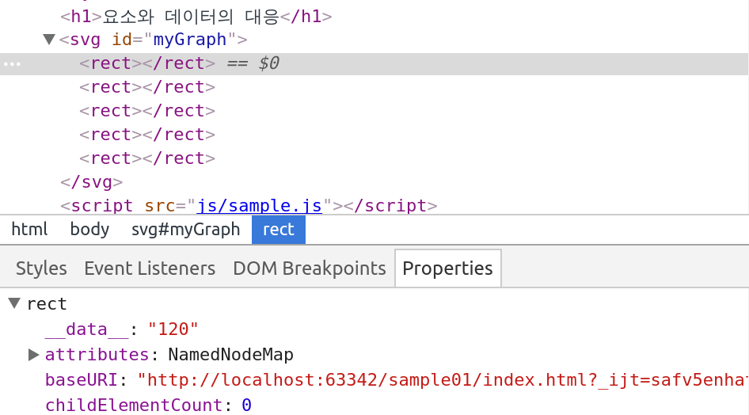
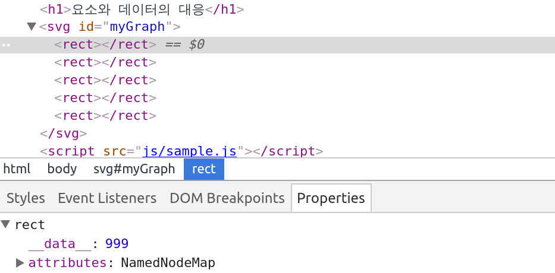
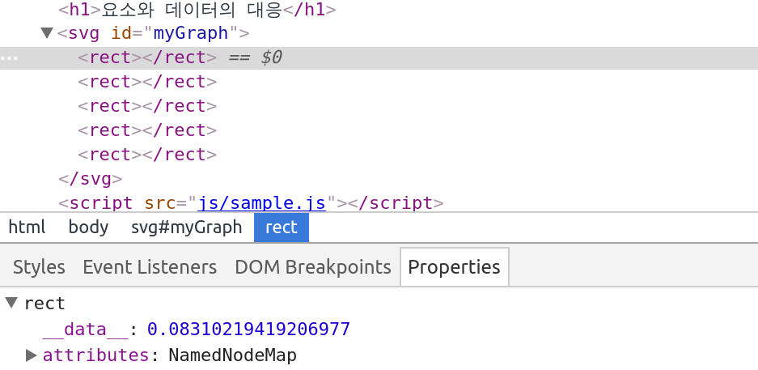
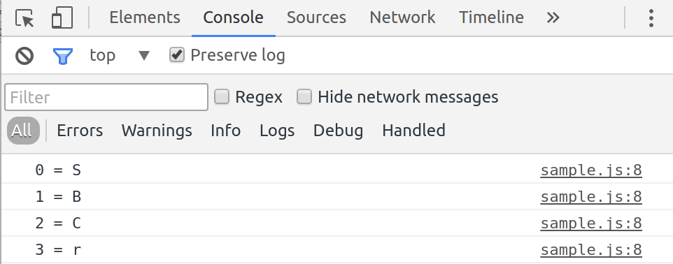
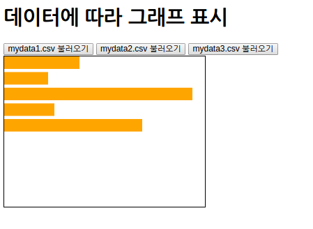

# 데이터의 갱신 · 추가 · 삭제
[TOC]

## D3.js에서 데이터와 요소의 대응

* csv 형식의 파일을 불러와 요소 내부 상태를 확인
	* ```xml
	<!DOCTYPE html>
    <html>
        <head>
            <meta charset="utf-8">
            <title>Sample</title>
            <script src="http://d3js.org/d3.v3.min.js" charset="utf-8"></script>
            <style>
                svg { width: 320px; height: 240px; border: 1px solid black; }
                .bar { fill : orange; }
            </style>
        </head>
        <body>
            <h1>요소와 데이터의 대응</h1>
            <svg id="myGraph"></svg>
            <script src="js/sample.js"></script>
        </body>
    </html>
	```
    * ```javascript
        // CSV 파일 읽어들이기
    d3.csv("mydata.csv", function(error, data){
        var dataSet = [ ];	// 데이터를 저장할 배열 준비
        for(var i=0; i<data.length; i++){	// 데이터 줄 개수만큼 반복
            dataSet.push(data[i]["상품A"]);	// 상품A의 레이블 데이터만 추출
        }
        // 요소와 데이터가 대응한 상태로 설정됨
        d3.select("#myGraph")
          .selectAll("rect")	// rect 요소 지정
          .data(dataSet)	// 데이터를 요소에 연결
          .enter()	// 데이터 개수만큼 반복
          .append("rect")	// 데이터의 개수만큼 rect 요소가 추가됨
    })
    ```
    * ```
    "상품A","상품B","상품C"
    120,60,300
    70,50,80
    300,30,90
    80,10,40
    220,200,150
    ```
    * 

* 요소의 값(데이터)을 datum() 메서드를 이용하여 999로 변경
	* ```javascript
	// CSV 파일 읽어들이기
    d3.csv("mydata.csv", function(error, data){
        var dataSet = [ ];	// 데이터를 저장할 배열 준비
        for(var i=0; i<data.length; i++){	// 데이터 줄 개수만큼 반복
            dataSet.push(data[i]["상품A"]);	// 상품A의 레이블 데이터만 추출
        }
        // 요소의 데이터를 바꿈
        d3.select("#myGraph")
          .selectAll("rect")	// rect 요소 지정
          .data(dataSet)	// 데이터를 요소에 연결
          .enter()	// 데이터 개수만큼 반복
          .append("rect")	// 데이터의 개수만큼 rect 요소가 추가됨
          .datum(999)	// 999의 데이터를 모든 요소에 설정
    })
	```
    * 

* 요소의 값(데이터)을 datum() 메서드로 난수로 바꿈
	* ```javascript
	// 요소에 데이터를 연결
    d3.select("#myGraph")
        .selectAll("rect")	// rect 요소 지정
        .data([0,0,0,0,0])	// 더미 데이터를 요소에 연결
        .enter()	// 데이터 개수만큼 반복
        .append("rect")	// 데이터의 개수만큼 rect 요소가 추가됨
        .datum(function(){	// 모든 요소에 난수값을 연결
            return Math.random();	// 난수 값을 반환
        })
	```
    * 

* 함수에 전달된 2개의 파라미터(요소가 가진 데이터와 데이터의 표시 순서)을 확인
	* ```javascript
	// 요소에 데이터를 연결
    d3.select("#myGraph")
        .selectAll("rect")	// rect 요소 지정
        .data(["S","B","C","r"])	// 데이터를 요소에 연결
        .enter()	// 데이터 개수만큼 반복
        .append("rect")	// 데이터의 개수만큼 rect 요소가 추가됨
        .datum(function(d, i){
            console.log(i+" = "+d);	// 순서와 데이터 내용 출력
            return d;	// 설정할 데이터를 반환
        })
	```
 	* 

** call(), each() : 메서드 체인에서 독자적인 처리 수행**

* ```javascript
// CSV 파일 읽어들이기
d3.csv("mydata.csv", function(error, data){
	var dataSet = [ ];	// 데이터를 저장할 배열 준비
	for(var i=0; i<data.length; i++){	// 데이터 줄 개수만큼 반복
		dataSet.push(data[i]["상품A"]);	// 상품A의 레이블 데이터만 추출
	}
	// 요소의 데이터를 읽어들어 콘솔에 출력
	d3.select("#myGraph")
		.selectAll("rect")	// rect 요소 지정
		.data(dataSet)	// 데이터를 요소에 연결
		.enter()	// 데이터 개수만큼 반복
		.append("rect")	// 데이터의 개수만큼 rect 요소가 추가됨
		.call(function(elements){	// 사용자 정의 함수를 호출하여 사용할 수 있음
			elements.each(function(d, i){	// 요소 수만큼 반복
				console.log(i+" = "+d);	// 데이터와 요소 순서 표시
			})
		})
})
```

### 데이터의 추가와 갱신

**데이터 추가 처리**

* 데이터의 수에 따라 요소를 추가하여 처리하는 패턴
	* ```javascript
	표시할 요소
    	.selectAll(SVG 요소)
        .data(데이터셋)
        .enter()
        .append(SVG 요소)
        요소 등의 설정
	```

**데이터 갱신 처리**

* 버튼을 클릭하여 CSV 파일을 불러와 그래프를 표시(기대한 대로는 동작하지 않는 코드)
	* ```xml
    <!DOCTYPE html>
    <html>
        <head>
            <meta charset="utf-8">
            <title>Sample</title>
            <script src="http://d3js.org/d3.v3.min.js" charset="utf-8"></script>
            <style>
                svg { width: 320px; height: 240px; border: 1px solid black; }
                .bar { fill : orange; }
            </style>
        </head>
        <body>
            <h1>데이터에 따라 그래프 표시</h1>
            <div>
                <button data-src="mydata1.csv">mydata1.csv 불러오기</button>
                <button data-src="mydata2.csv">mydata2.csv 불러오기</button>
                <button data-src="mydata3.csv">mydata3.csv 불러오기</button>
            </div>
            <svg id="myGraph"></svg>
            <script src="js/sample.js"></script>
        </body>
    </html>
	```
    * ```javascript
    // 버튼을 클릭하면 해당하는 CSV 파일 읽어들이기
    d3.selectAll("button").on("click", function(){
        var csvFile = this.getAttribute("data-src");	// data-src 속성을 읽어들임(즉 CSV 파일 이름)
        // CSV 파일을 불러와 그래프 표시
        d3.csv(csvFile, function(error, data){
            var dataSet = [ ];	// 데이터를 저장할 배열 준비
            for(var i=0; i<data.length; i++){	// 데이터 줄 개수만큼 반복
                dataSet.push(data[i]["상품A"]);	// 상품A의 레이블 데이터만 추출
            }
            // 그래프 그리기
            d3.select("#myGraph")
              .selectAll("rect")	// rect 요소 지정
              .data(dataSet)	// 데이터를 요소에 연결
              .enter()	// 데이터 개수만큼 반복
              .append("rect")	// 데이터의 개수만큼 rect 요소가 추가됨
              .attr("class", "bar")	// CSS 클래스를 지정
              .attr("width", function(d,i){	// 넓이 지정. 2번째 파라미터에 함수를 지정
                    return d;	// 데이터 값을 그대로 넓이로 반환
              })
              .attr("height", 20)	// 높이 지정
              .attr("x", 0)	// X 좌표를 0으로 지정
              .attr("y", function(d, i){	// Y 좌표를 지정함
                    return i * 25	// 표시 순서에 25를 곱해 위치를 계산
              })
        });
    })
    ```
    * ```
    "상품A","상품B","상품C"
    120,60,300
    70,50,80
    300,30,90
    80,10,40
    220,200,150
    ```
    * ```
    "상품A","상품B","상품C"
    50,20,200
    20,90,180
    60,130,190
    70,90,140
    80,100,250
    ```
    * ```
    "상품A","상품B","상품C"
    90,120,190
    120,280,250
    160,230,120
    170,50,40
    260,170,110
    ```
    * 


* 요소 세트를 변수에 넣어둠
	* ```javascript
	barElements = d3.select("#myGraph")
    				.selectAll("rect")
                    .data(dataSet)
	```

* 요소 세트의 데이터에 따라 요소를 추가함
	* ```javascript
	barElements.enter()
    			.append("rect")
                .attr("class", "bar")
                .attr("width", function(d, i) {
                	return d;
                })
                .attr("height", 20)
                .attr("x", 0)
                .attr("y", function(d, i){
                	return i * 25
                })
	```

* 불러온 데이터를 이용하여 요소 세트에 넓이를 지정
	* ```javascript
	barElements
    	.attr("width", function(d, i) {
        	return d
        })
	```

* 버튼을 클릭하면 CSV 파일을 불러와서 그래프를 표시(수정한 코드)
	* ```javascript
	// 버튼을 클릭하면 해당하는 CSV 파일 읽어들이기
    d3.selectAll("button").on("click", function(){
        var csvFile = this.getAttribute("data-src");	// data-src 속성을 읽어옴(즉, CSV 파일 이름)
        var barElements;	// 막대그래프의 막대 요소를 저장할 변수
        // CSV 파일을 불러와 그래프 표시
        d3.csv(csvFile, function(error, data){
            var dataSet = [ ];	// 데이터를 저장할 배열 준비
            for(var i=0; i<data.length; i++){	// 데이터 줄 개수만큼 반복
                dataSet.push(data[i]["상품A"]);	// 상품A의 레이블 데이터만 추출
            }
            // 그래프 그리기
            barElements = d3.select("#myGraph")
              .selectAll("rect")	// rect 요소 지정
              .data(dataSet)	// 데이터를 요소에 연결
            // 데이터가 추가될 때
            barElements.enter()	// 데이터 개수만큼 반복
              .append("rect")	// 데이터의 개수만큼 rect 요소가 추가됨
              .attr("class", "bar")	// CSS 클래스를 지정
              .attr("width", function(d,i){	// 넓이 지정. 2번째 파라미터에 함수 지정
                    return d;	// 데이터 값을 그대로 넓이로 반환
                })
              .attr("height", 20)	// 높이 지정
              .attr("x", 0)	// X 좌표를 0으로 함
              .attr("y", function(d, i){	// Y 좌표를 지정함
                    return i * 25	// 표시 순서에 25를 곱하여 위치를 계산
                })
            // 데이터가 갱신될 때
            barElements
              .attr("width", function(d,i){	// 넓이 지정. 2번째 파라미터에 함수 지정
                    return d;	// 데이터 값을 그대로 넓이로 반환
                })
        });
    })
	```

## 데이터 삭제

* 버튼을 클릭하여 데이터 수가 다른 CSV 파일을 불러와 그래프를 표시(기대한 대로 동작하지 않음)
	* 데이터 개수가 5
	* ```
	"상품A","상품B","상품C"
    120,60,300
    70,50,80
    300,30,90
    80,10,40
    220,200,150
	```
    * 데이터 개수가 7
    * ```
    "상품A","상품B","상품C"
    50,20,200
    20,90,180
    60,130,190
    70,90,140
    80,100,250
    280,60,100
    180,90,220
	```
    * 데이터 개수가 3
    * ```
    "상품A","상품B","상품C"
    90,120,190
    120,280,250
    160,230,120
	```

* 불필요한 요소를 삭제하는 과정
	* ```javascript
	표시할 요소
    		.selectAll(SVG 요소)
            .data(데이터셋)
            .exit()
            .remove()
	```

* 버튼을 클릭하여 데이터 수가 서로 다른 CSV 파일을 불러와 그래프를 표시(수정 코드)
	* ```javascript
    // 버튼을 클릭하면 해당하는 CSV 파일 읽어들이기
    d3.selectAll("button").on("click", function(){
        var csvFile = this.getAttribute("data-src");	// data-src 속성을 읽어옴(즉, CSV 파일 이름)
        var barElements;	// 막대그래프의 막대 요소를 저장할 변수
        // CSV 파일을 불러와 그래프 표시
        d3.csv(csvFile, function(error, data){
            var dataSet = [ ];	// 데이터를 저장할 배열 준비
            for(var i=0; i<data.length; i++){	// 데이터 줄 개수만큼 반복
                dataSet.push(data[i]["상품A"]);	// 상품A의 레이블 데이터만 추출
            }
            // 그래프 그리기
            barElements = d3.select("#myGraph")
              .selectAll("rect")	// rect 요소 지정
              .data(dataSet)	// 데이터를 요소에 연결
            //데이터가 추가될 때
            barElements.enter()	// 데이터 개수만큼 반복
              .append("rect")	// 데이터의 개수만큼 rect 요소가 추가됨
              .attr("class", "bar")	// CSS 클래스를 지정
              .attr("width", function(d,i){	// 넓이 지정. 2번째 파라미터에 함수 지정
                return d;	// 데이터 값을 그대로 넓이로 반환
              })
              .attr("height", 20)	// 높이 지정
              .attr("x", 0)	//  X 좌표를 0으로 함
              .attr("y", function(d, i){	// Y 좌표를 지정함
                return i * 25	// 표시 순서에 25를 곱하여 위치를 계산
              })
            // 데이터가 갱신될 때
            barElements
              .attr("width", function(d,i){	// 넓이 지정. 2번째 파라미터에 함수 지정
                return d;	// 데이터 값을 그대로 넓이로 반환
              })
            // 데이터가 삭제될 때
            barElements
              .exit()	// 삭제 대상 요소 추출
              .remove()	// 요소 삭제
        })
    })
	```

* D3.js에서는 데이터를 추가, 갱신, 삭제할 때는 순서는 관계없다