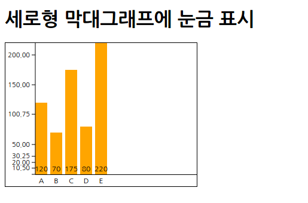

# 세로형 막대그래프
[TOC]

## 세로형 막대그래프 생성

* 세로형 막대그래프 그리기
	* ```xml
	<!DOCTYPE html>
    <html>
        <head>
            <meta charset="utf-8">
            <title>Sample</title>
            <script src="http://d3js.org/d3.v3.min.js" charset="utf-8"></script>
            <style>
                svg { width: 320px; height: 240px; border: 1px solid black; }
                .bar { fill : orange; }
            </style>
        </head>
        <body>
            <h1>세로형 막대그래프를 표시</h1>
            <svg id="myGraph"></svg>
            <script src="js/sample.js"></script>
        </body>
    </html>
	```
    * ```javascript
	var svgHeight = 240;	// SVG 요소의 높이
    var barElements;	// 막대그래프의 막대 요소를 저장할 변수
    var dataSet = [120, 70, 175, 80, 220];
    // 그래프 그리기
    barElements = d3.select("#myGraph")
        .selectAll("rect")	// rect 요소를 지정
        .data(dataSet)	// 데이터를 요소에 연결
    // 데이터 추가
    barElements.enter()	// 데이터 수만큼 반복
        .append("rect")	// 데이터 수만큼 rect 요소가 추가됨
        .attr("class", "bar")	// CSS 클래스 설정
        .attr("height", function(d,i){	// 넓이 설정. 2번째의 파라미터에 함수를 지정
            return d;	// 데이터 값을 그대로 높이로 지정
        })
        .attr("width", 20)	// 넓이 지정
        .attr("x", function(d, i){
            return i * 25;		// X 좌표를 표시 순서×25로 함
        })
        .attr("y", function(d, i){	// Y 좌표를 지정
            return svgHeight - d;	// Y 좌표를 계산
        })
    ```
	* 

* SVG의 높이로부터 데이터 값을 뺌으로써 세로형 막대를 표시
	* ```javascript
	.attr("y", function (d, i){
    	return svgHeight - d;
    })
	```

### 그래프 안에 숫자 표시

* 문자의 그리기 위치
	* | 값 | 설명 |
      |--------|--------|
      | start | 왼쪽부터 그림(기본값) |
      | middle | 가운데부터 그림 |
      | end | 오른쪽부터 그림 |

* 그래프 안에 표시할 숫자 스타일 설정
	* ```css
	barNum {
    	font-size : 9pt;
        text-anchor : middle;
    }
	```

* 세로형 막대그래프를 숫자와 함게 그리기
	* ```xml
	<!DOCTYPE html>
    <html>
        <head>
            <meta charset="utf-8">
            <title>Sample</title>
            <script src="http://d3js.org/d3.v3.min.js" charset="utf-8"></script>
            <style>
                svg { width: 320px; height: 240px; border: 1px solid black; }
                .bar { fill : orange; }
                .barNum {
                    font-size: 9pt;
                    text-anchor : middle;
                }
            </style>
        </head>
        <body>
            <h1>세로형 막대그래프에 값을 표시</h1>
            <svg id="myGraph"></svg>
            <script src="js/sample.js"></script>
        </body>
    </html>
	```
	* ```javascript
	var svgHeight = 240;	// SVG 요소의 높이
    var barElements;	// 막대그래프의 막대 요소를 저장할 변수
    var dataSet = [120, 70, 175, 80, 220];
    // 그래프 그리기
    barElements = d3.select("#myGraph")
        .selectAll("rect")	// rect 요소를 지정
        .data(dataSet)	// 데이터를 요소에 연결
    // 데이터 추가
    barElements.enter()	// 데이터 수만큼 반복
        .append("rect")	// 데이터 수만큼 rect 요소가 추가됨
        .attr("class", "bar")	// CSS 클래스 설정
        .attr("height", function(d,i){	// 넓이 설정. 2번째의 파라미터에 함수를 지정
            return d;	// 데이터 값을 그대로 높이로 지정
        })
        .attr("width", 20)	// 넓이 지정
        .attr("x", function(d, i){
            return i * 25;		// X 좌표를 표시 순서×25로 함
        })
        .attr("y", function(d, i){	// Y 좌표를 지정
            return svgHeight - d;	// Y 좌표를 계산
        })
    barElements.enter()	// text 요소 지정●↓
        .append("text")	// text 요소 추가
        .attr("class", "barNum")	// CSS 클래스 설정
        .attr("x", function(d, i){	// X 좌표를 지정
            return i * 25 + 10;	// 막대그래프의 표시 간격을 맞춤
        })
        .attr("y", svgHeight - 5)	// Y 좌표를 지정
        .text(function(d, i){	// 데이터 표시
            return d;
        })
	```
	* 

**세로쓰기로 표시**

* writing-mode : 문자의 쓰기 방향
* glyph-orientation-vertical : 문자의 회전 각도
	* text-orientation로 대체됨

* ```css
.barNum {
	font-size : 9pt;
    text-anchor : end;
    writing-mode : tb;
    text-orientation : 'upright'
    /*glyph-orientation-vertical : 0;*/
}
```
* 

* ```css
.barNum {
				font-size: 9pt;
				text-anchor : end;
				writing-mode : tb;
                text-orientation : 'sideways'
				/*glyph-orientation-vertical : 90*/
			}
```
* 

### 그래프에 눈금 표시

* 눈금 스타일 설정
	* ```css
	.axis text {
    	font-family : sans-serif;
        font-size : 11px;
    }
    .axis path,
    .axis line {
    	fill : none;
        stroke : black;
    }
	```

* 눈금의 표시 위치 설정
	* ```javascript
	.attr("tansform", "translate(30, 0)")
	```

* orient() : 눈금 위치 지정
	* | 값 | 설명 |
      |--------|--------|
      | top | 위 |
      | bottom | 아래 |
      | left | 왼쪽 |
      | right | 오른쪽 |

* 세로형 막대그래프를 눈금과 함께 그리기 (겉모습을 꾸미기 전)
	* ```xml
	<!DOCTYPE html>
    <html>
        <head>
            <meta charset="utf-8">
            <title>Sample</title>
            <script src="http://d3js.org/d3.v3.min.js" charset="utf-8"></script>
            <style>
                svg { width: 320px; height: 240px; border: 1px solid black; }
                .bar { fill : orange; }
                .barNum {
                    font-size: 9pt;
                    text-anchor : middle;
                }
                .axis text {
                    font-family: sans-serif;
                    font-size: 11px;
                }
                .axis path,
                .axis line {
                    fill: none;
                    stroke: black;
                }
            </style>
        </head>
        <body>
            <h1>세로형 막대그래프에 눈금 표시</h1>
            <svg id="myGraph"></svg>
            <script src="js/sample.js"></script>
        </body>
    </html>
	```
    * ```javascript
    var svgHeight = 240;	// SVG 요소의 높이
    var barElements;	// 막대그래프의 막대 요소를 저장할 변수
    var dataSet = [120, 70, 175, 80, 220];
    // 그래프 그리기
    barElements = d3.select("#myGraph")
        .selectAll("rect")	// rect 요소를 지정
        .data(dataSet)	// 데이터를 요소에 연결
    // 데이터 추가
    barElements.enter()	// 데이터 수만큼 반복
        .append("rect")	// 데이터 수만큼 rect 요소가 추가됨
        .attr("class", "bar")	// CSS 클래스 설정
        .attr("height", function(d,i){	// 넓이 설정. 2번째의 파라미터에 함수를 지정
            return d;	// 데이터 값을 그대로 높이로 지정
        })
        .attr("width", 20)	// 넓이 지정
        .attr("x", function(d, i){
            return i * 25;		// X좌표를 표시 순서×25로 함
        })
        .attr("y", function(d, i){	// Y 좌표를 지정
            return svgHeight - d;	// Y 좌표를 계산
        })
    barElements.enter()	// text 요소 지정
        .append("text")	// text 요소 추가
        .attr("class", "barNum")	// CSS 클래스 설정
        .attr("x", function(d, i){	// X 좌표를 지정
            return i * 25 + 10;	// 막대그래프의 표시 간격을 맞춤
        })
        .attr("y", svgHeight - 5)	// Y 좌표를 지정
        .text(function(d, i){	// 데이터 표시
            return d;
        })
    // 눈금을 표시하기 위한 스케일 설정●↓
    var yScale = d3.scale.linear()  // 스케일 설정
        .domain([0, 300])   // 원래 크기
        .range([300, 0]) // 실체 출력 크기
    // 눈금을 설정하여 표시
    d3.select("#myGraph").append("g")
        .attr("class", "axis")
        .attr("transform", "translate(30, 0)")
        .call(
            d3.svg.axis()
            .scale(yScale)  //스케일 적용
            .orient("left") //눈금의 표시 위치를 왼쪽으로 지정
        )
    ```
    * 

* 세로형 막대그래프를 눈금과 함께 그리기 (겉모습을 조정한 코드)
	* ```javascript
    var svgHeight = 240;	// SVG 요소의 높이
    var offsetX = 30;	// X 좌표의 오프셋(어긋남의 정도)●
    var offsetY = 10;	// Y 좌표의 오프셋(어긋남의 정도)●
    var barElements;	// 막대그래프의 막대 요소를 저장할 변수
    var dataSet = [120, 70, 175, 80, 220];
    // 그래프 그리기
    barElements = d3.select("#myGraph")
        .selectAll("rect")	// rect 요소를 지정
        .data(dataSet)	// 데이터를 요소에 연결
    // 데이터 추가
    barElements.enter()	// 데이터 수만큼 반복
        .append("rect")	// 데이터 수만큼 rect 요소가 추가됨
        .attr("class", "bar")	// CSS 클래스 설정
        .attr("height", function(d,i){	// 넓이 설정. 2번째의 파라미터에 함수를 지정
            return d;	// 데이터 값을 그대로 높이로 지정
        })
        .attr("width", 20)	// 넓이 지정
        .attr("x", function(d, i){
            return i * 25+offsetX;		// X 좌표를 표시 순서×25+offsetX로 함 ●
        })
        .attr("y", function(d, i){	// Y 좌표를 지정
            return svgHeight - d - offsetY;	// Y 좌표를 계산●
        })
    barElements.enter()	// text 요소 지정
        .append("text")	// text 요소 추가
        .attr("class", "barNum")	// CSS 클래스 설정
        .attr("x", function(d, i){	// X 좌표를 지정
            return i * 25 + 10+offsetX;	// 막대그래프의 표시 간격을 맞춤●
        })
        .attr("y", svgHeight - 5-offsetY)	// Y 좌표를 지정●
        .text(function(d, i){	// 데이터 표시
            return d;
        })
    // 눈금을 표시하기 위한 스케일 설정
    var yScale = d3.scale.linear()  // 스케일 설정
        .domain([0, 300])   // 원래 크기
        .range([300, 0]) // 실체 출력 크기
    // 눈금을 설정하여 표시
    d3.select("#myGraph").append("g")
        .attr("class", "axis")
        .attr("transform", "translate("+offsetX+", "+((svgHeight-300)-offsetY)+")")	//●
        .call(
            d3.svg.axis()
            .scale(yScale)  //스케일 적용
            .orient("left") //눈금의 표시 위치를 왼쪽으로 지정
        )
	```
    * 

**세로형 막대 그래프에 레이블을 표시**

* 레이블의 글꼴 크기나 그리기 위치 등의 스타일 지정
	* ```css
	.barName {
    	font-size: 9pt;
        text-anchor: middle;
    }
	```

* 수평선 표시
	* ```javascript
	d3.select("#myGraph")
    	.append("rect")
        .attr("class", "axis_x")
        .attr("width", 320)
        .attr("height", 1)
        .attr("transform", "translate("+offsetX+", "+(svgHeight-offsetX)+")")
	```

* 이번에는 레이블 문자를 배열로 준비
	* ```javascript
	.text(function(d, i)) {
    	return ["A", "B", "C", "D", "E"][i]
    }
	```

* 세로형 막대그래프를 눈금, 레이블과 함께 그리기
	* ```xml
    <!DOCTYPE html>
    <html>
        <head>
            <meta charset="utf-8">
            <title>Sample</title>
            <script src="http://d3js.org/d3.v3.min.js" charset="utf-8"></script>
            <style>
                svg { width: 320px; height: 240px; border: 1px solid black; }
                .bar { fill : orange; }
                .barNum {
                    font-size: 9pt;
                    text-anchor : middle;
                }
                .axis text {
                    font-family: sans-serif;
                    font-size: 11px;
                }
                .axis path,
                .axis line {
                    fill: none;
                    stroke: black;
                }
                .axis_x line {
                    fill: none;
                    stroke: black;
                }
                .barName {
                    font-size: 9pt;
                    text-anchor : middle;
                }
            </style>
        </head>
        <body>
            <h1>세로형 막대그래프에 눈금 표시</h1>
            <svg id="myGraph"></svg>
            <script src="js/sample.js"></script>
        </body>
    </html>
	```
    * ```javascript
    var svgHeight = 240;	// SVG 요소의 높이
    var offsetX = 30;	// X 좌표의 오프셋(어긋남의 정도)
    var offsetY = 20;	// Y 좌표의 오프셋(어긋남의 정도)
    var barElements;	// 막대그래프의 막대 요소를 저장할 변수
    var dataSet = [120, 70, 175, 80, 220];
    // 그래프 그리기
    barElements = d3.select("#myGraph")
        .selectAll("rect")	// rect 요소를 지정
        .data(dataSet)	// 데이터를 요소에 연결
    // 데이터 추가
    barElements.enter()	// 데이터 수만큼 반복
        .append("rect")	// 데이터 수만큼 rect 요소가 추가됨
        .attr("class", "bar")	// CSS 클래스 설정
        .attr("height", function(d,i){	// 넓이 설정. 2번째의 파라미터에 함수를 지정
            return d;	// 데이터 값을 그대로 높이로 지정
        })
        .attr("width", 20)	// 넓이 지정
        .attr("x", function(d, i){
            return i * 25+offsetX;		// X 좌표를 표시 순서×25+offsetX로 함 
        })
        .attr("y", function(d, i){	// Y 좌표를 지정
            return svgHeight - d - offsetY;	// Y 좌표를 계산
        })
    barElements.enter()	// text 요소 지정
        .append("text")	// text 요소 추가
        .attr("class", "barNum")	// CSS 클래스 설정
        .attr("x", function(d, i){	// X 좌표를 지정
            return i * 25 + 10+offsetX;	// 막대그래프의 표시 간격을 맞춤
        })
        .attr("y", svgHeight - 5-offsetY)	// Y 좌표를 지정
        .text(function(d, i){	// 데이터 표시
            return d;
        })
    // 눈금을 표시하기 위한 스케일 설정
    var yScale = d3.scale.linear()  // 스케일 설정
        .domain([0, 300])   // 원래 크기
        .range([300, 0]) // 실체 출력 크기
    // 세로 방향의 눈금을 설정하고 표시
    d3.select("#myGraph")
        .append("g")
        .attr("class", "axis")
        .attr("transform", "translate("+offsetX+", "+((svgHeight-300)-offsetY)+")")
        .call(
            d3.svg.axis()
            .scale(yScale)  //스케일 적용
            .orient("left") //눈금의 표시 위치를 왼쪽으로 지정
        )
    // 가로 방향의 선을 표시●↓
    d3.select("#myGraph")
        .append("rect")
        .attr("class", "axis_x")
        .attr("width", 320)
        .attr("height", 1)
        .attr("transform", "translate("+offsetX+", "+(svgHeight-offsetY)+")")
    // 막대의 레이블을 표시
    barElements.enter()
        .append("text")
        .attr("class", "barName")
        .attr("x", function(d, i){	// X 좌표를 지정
            return i * 25 + 10+offsetX;	// 막대그래프의 표시 간격을 맞춤
        })
        .attr("y", svgHeight-offsetY+15)
        .text(function(d, i){
            return ["A", "B", "C", "D", "E"][i];	// 레이블 이름을 반환
        })
    ```
    * 

**눈금 옵션**

* 눈금 간격 지정
	* ticks() : 눈금의 간격(눈금의 구간 간격을 얼마로 할 것인가). default 값 0
	* ```javascript
	d3.select("#myGraph")
        .append("g")
        .attr("class", "axis")
        .attr("transform", "translate("+offsetX+", "+((svgHeight-300)-offsetY)+")")
        .call(
            d3.svg.axis()
            .scale(yScale)  //스케일 적용
            .orient("left") //눈금의 표시 위치를 왼쪽으로 지정
            .ticks(20)	// 눈금 간격
        )
	```
    * 

* 눈금을 다른 간격으로 지정
	* tickValues() : 서로 다른 간격 표시
    * ```javascript
    d3.select("#myGraph")
        .append("g")
        .attr("class", "axis")
        .attr("transform", "translate("+offsetX+", "+((svgHeight-300)-offsetY)+")")
        .call(
            d3.svg.axis()
            .scale(yScale)  //스케일 적용
            .orient("left") //눈금의 표시 위치를 왼쪽으로 지정
            .ticks(10)	// 눈금 간격
            .tickValues([10, 20, 30, 50, 100, 150, 200])	// 눈금 간격
        )
    ```
    * 

* 눈금에 표시할 숫자에 서식을 설정
	* tickFormat() : 눈금에 표시할 숫자 서식
	* d3.format() : 숫자나 날짜의 서식 지정
	* ```javascript
	d3.select("#myGraph")
        .append("g")
        .attr("class", "axis")
        .attr("transform", "translate("+offsetX+", "+((svgHeight-300)-offsetY)+")")
        .call(
            d3.svg.axis()
            .scale(yScale)  //스케일 적용
            .orient("left") //눈금의 표시 위치를 왼쪽으로 지정
            .ticks(10)	// 눈금 간격
            .tickValues([10.5, 20, 30.25, 50, 100.75, 150, 200])	// 눈금 간격
            .tickFormat(d3.format(".2f"))	// 서식
        )
	```
	* 
	* ```javascript
	d3.select("#myGraph")
        .append("g")
        .attr("class", "axis")
        .attr("transform", "translate("+offsetX+", "+((svgHeight-300)-offsetY)+")")
        .call(
            d3.svg.axis()
            .scale(yScale)  //스케일 적용
            .orient("left") //눈금의 표시 위치를 왼쪽으로 지정
            .ticks(10)	// 눈금 간격
            .tickValues([10.5, 20, 30.25, 50, 100.75, 150, 200])	// 눈금 간격
            .tickFormat(function(d) { return "$" + d; })	// 서식
        )
	```
    * 

### 그래프 범용화

* 그래프를 사용할 수치를 변수에 입력
	* ```javascript
	var svgWidth = 320;	// SVG 요소의 넓이
    var svgHeight = 240;	// SVG 요소의 높이
    var offsetX = 30;	// X 좌표의 오프셋(어긋남의 정도)
    var offsetY = 20;	// Y 좌표의 오프셋(어긋남의 정도)
    var barElements;	// 막대그래프의 막대 요소를 저장할 변수
    var dataSet = [120, 70, 175, 80, 220, 40, 180, 70, 90];
    var dataMax = 300;	// 데이터의 최댓
    var barWidth = 20;	// 막대의 넓이
    var barMargin = 5;	// 막대의 옆 간격
	```

* 그래프에 사용할 수치를 변수에 입력하여 코드에 범용성을 부여
	* ```javascript
	// ●는 추가, 갱신한 곳
    var svgWidth = 320;	// SVG 요소의 넓이●
    var svgHeight = 240;	// SVG 요소의 높이
    var offsetX = 30;	// X 좌표의 오프셋(어긋남의 정도)
    var offsetY = 20;	// Y 좌표의 오프셋(어긋남의 정도)
    var barElements;	// 막대그래프의 막대 요소를 저장할 변수
    var dataSet = [120, 70, 175, 80, 220, 40, 180, 70, 90];
    var dataMax = 300;	// 데이터의 최댓값●
    var barWidth = 20;	// 막대의 넓이●
    var barMargin = 5;	// 막대의 옆 간격●
    // 그래프 그리기
    barElements = d3.select("#myGraph")
        .selectAll("rect")	// rect 요소를 지정
        .data(dataSet)	// 데이터를 요소에 연결
    // 데이터 추가
    barElements.enter()	// 데이터 수만큼 반복
        .append("rect")	// 데이터 수만큼 rect 요소가 추가됨
        .attr("class", "bar")	// CSS 클래스 설정
        .attr("height", function(d,i){	// 넓이 설정. 2번째의 파라미터에 함수를 지정
            return d;	// 데이터 값을 그대로 높이로 지정
        })
        .attr("width", barWidth)	// 넓이 지정●
        .attr("x", function(d, i){
            return i * (barWidth+barMargin)+offsetX;		// X 좌표를 표시 순서×25+offsetX로 함 ●
        })
        .attr("y", function(d, i){	// Y 좌표를 지정
            return svgHeight - d - offsetY;	// Y 좌표를 계산
        })
    barElements.enter()	// text 요소 지정
        .append("text")	// text 요소 추가
        .attr("class", "barNum")	// CSS 클래스 설정
        .attr("x", function(d, i){	// X 좌표를 지정
            return i * (barWidth+barMargin) + 10+offsetX;	// 막대그래프의 표시 간격을 맞춤●
        })
        .attr("y", svgHeight - 5-offsetY)	// Y 좌표를 지정
        .text(function(d, i){	// 데이터 표시
            return d;
        })
    // 눈금을 표시하기 위한 스케일 설정
    var yScale = d3.scale.linear()  // 스케일 설정
        .domain([0, dataMax])   // 원래 크기●
        .range([dataMax, 0]) // 실체 출력 크기●
    // 세로 방향의 눈금을 설정하고 표시
    d3.select("#myGraph")
        .append("g")
        .attr("class", "axis")
        .attr("transform", "translate("+offsetX+", "+((svgHeight-300)-offsetY)+")")
        .call(
            d3.svg.axis()
            .scale(yScale)  //스케일 적용
            .orient("left") //눈금의 표시 위치를 왼쪽으로 지정
        )
    // 세로 방향의 선을 표시
    d3.select("#myGraph")
        .append("rect")
        .attr("class", "axis_x")
        .attr("width", svgWidth)
        .attr("height", 1)
        .attr("transform", "translate("+offsetX+", "+(svgHeight-offsetY)+")")
    // 막대의 레이블을 표시
    barElements.enter()
        .append("text")
        .attr("class", "barName")
        .attr("x", function(d, i){	// X 좌표를 지정
            return i * (barWidth+barMargin) + 10+offsetX;	// 막대그래프의 표시 간격을 맞춤
        })
        .attr("y", svgHeight-offsetY+15)
        .text(function(d, i){
            return ["A", "B", "C", "D", "E", "F", "G", "H", "I", "J", "K", "L"][i];	// 레이블 이름을 반환●
        })
	```
    * 

### 그래프에 애니메이션 효과 적용

* D3.js에서의 애니메이션 적용 순서
	1. attr(), style() 메서드로 애니메이션 시작 시의 값을 설정
	2. transition() 메서드 다음에 attr(), style() 메서드로 애니메이션 종료 시의 값을 설정

* 애니메이션 시간 설정에 사용하는 메서드
	* | 메서드 | 설명 |
      |--------|--------|
      | duration(밀리 초) | 애니메이션 시작에서 종료까지의 시간 |
      | delay(밀리 초) | 애니메이션 시작까지 대기 시간 |

* 아래에서 위로 늘어나는 애니메이션을 적용한 세로형 막대그래프
	* ```xml
	<!DOCTYPE html>
    <html>
        <head>
            <meta charset="utf-8">
            <title>Sample</title>
            <script src="http://d3js.org/d3.v3.min.js" charset="utf-8"></script>
            <style>
                svg { width: 320px; height: 240px; border: 1px solid black; }
                .bar { fill : orange; }
                .barNum {
                    font-size: 9pt;
                    text-anchor : middle;
                }
                .axis text {
                    font-family: sans-serif;
                    font-size: 11px;
                }
                .axis path,
                .axis line {
                    fill: none;
                    stroke: black;
                }
                .axis_x line {
                    fill: none;
                    stroke: black;
                }
                .barName {
                    font-size: 9pt;
                    text-anchor : middle;
                }
            </style>
        </head>
        <body>
            <h1>애니메이션 효과 세로형 막대그래프</h1>
            <svg id="myGraph"></svg>
            <script src="js/sample.js"></script>
        </body>
    </html>
	```
    * ```javascript
    // ●는 추가, 갱신한 곳
    var svgWidth = 320;	// SVG 요소의 넓이
    var svgHeight = 240;	// SVG 요소의 높이
    var offsetX = 30;	// X 좌표의 오프셋(어긋난 정도)
    var offsetY = 20;	// Y 좌표의 오프셋(어긋난 정도)
    var barElements;	// 막대그래프의 막대 요소를 저장할 변수
    var dataSet = [120, 70, 175, 80, 220, 40, 180, 70, 90];
    var dataMax = 300;	// 데이터의 최댓값
    var barWidth = 20;	// 막대의 넓이
    var barMargin = 5;	// 막대의 옆 간격
    // 그래프 그리기
    barElements = d3.select("#myGraph")
      .selectAll("rect")	// rect 요소를 지정
      .data(dataSet)	// 데이터를 요소에 연결
    // 데이터 추가
    barElements.enter()	// 데이터 수만큼 반복
      .append("rect")	// 데이터 수만큼 rect 요소가 추가됨
      .attr("class", "bar")	// CSS 클래스 설정
      .attr("height", 0)	// 초깃값을 0으로 설정●
      .attr("width", barWidth)	// 넓이 지정
      .attr("x", function(d, i){
            return i * (barWidth+barMargin)+offsetX;		// X 좌표를 표시 순서×25+offsetX로 함
      })
      .attr("y", svgHeight - offsetY)	// 그래프 가장 아래에 좌표를 설정●
        // 애니메이션 처리●　여기부터 barElements.enter() 전까지가 추가한 곳
      .transition()
      .duration(3000)	// 애니메이션 시간
      .attr("y", function(d, i){	// Y 좌표를 지정
            return svgHeight - d - offsetY;	// Y 좌표를 계산
      })
      .attr("height", function(d,i){	// 넓이 설정. 2번째의 파라미터에 함수를 지정
            return d;	// 데이터 값을 그대로 높이로 지정
      })
    barElements.enter()	// text 요소 지정
      .append("text")	// text 요소 추가
      .attr("class", "barNum")	// CSS 클래스 설정
      .attr("x", function(d, i){	// X 좌표를 지정
            return i * (barWidth+barMargin) + 10+offsetX;	// 막대그래프의 표시 간격을 맞춤
      })
      .attr("y", svgHeight - 5-offsetY)	// Y 좌표를 지정
      .text(function(d, i){	// 데이터 표시
            return d;
        })
    // 눈금을 표시하기 위한 스케일 설정
    var yScale = d3.scale.linear()  // 스케일 설정
      .domain([0, dataMax])   // 원래 크기
      .range([dataMax, 0]) // 실체 출력 크기
    // 세로 방향의 눈금을 설정하고 표시
    d3.select("#myGraph")
      .append("g")
      .attr("class", "axis")
      .attr("transform", "translate("+offsetX+", "+((svgHeight-300)-offsetY)+")")
      .call(
        d3.svg.axis()
          .scale(yScale)  //스케일 적용
          .orient("left") //눈금의 표시 위치를 왼쪽으로 지정
      )
    // 세로 방향의 선을 표시
    d3.select("#myGraph")
      .append("rect")
      .attr("class", "axis_x")
      .attr("width", svgWidth)
      .attr("height", 1)
      .attr("transform", "translate("+offsetX+", "+(svgHeight-offsetY)+")")
    // 막대의 레이블을 표시
    barElements.enter()
      .append("text")
      .attr("class", "barName")
      .attr("x", function(d, i){	// X 좌표를 지정
        return i * (barWidth+barMargin) + 10+offsetX;	// 막대그래프의 표시 간격을 맞춤
      })
      .attr("y", svgHeight-offsetY+15)
      .text(function(d, i){
            return ["A", "B", "C", "D", "E", "F", "G", "H", "I", "J", "K", "L"][i];	// 레이블 이름을 반환
        })
    ```

**그래프의 막대가 왼쪽에서 순서대로 늘어나도록 하기**

* delay() 메서드에 함수를 지정하여 애니메이션 시작까지의 대기 시간을 조절
	* ```javascript
	.delay(function(d, i){
    	return i * 100;
    })
	```
* 아래에서 위로 늘어나는 애니메이션을 적용한 세로형 막대그래프
	* ```xml
    <!DOCTYPE html>
    <html>
        <head>
            <meta charset="utf-8">
            <title>Sample</title>
            <script src="http://d3js.org/d3.v3.min.js" charset="utf-8"></script>
            <style>
                svg { width: 320px; height: 240px; border: 1px solid black; }
                .bar { fill : orange; }
                .barNum {
                    font-size: 9pt;
                    text-anchor : middle;
                }
                .axis text {
                    font-family: sans-serif;
                    font-size: 11px;
                }
                .axis path,
                .axis line {
                    fill: none;
                    stroke: black;
                }
                .axis_x line {
                    fill: none;
                    stroke: black;
                }
                .barName {
                    font-size: 9pt;
                    text-anchor : middle;
                }
            </style>
        </head>
        <body>
            <h1>세로형 막대그래프 순서대로 애니메이션 효과</h1>
            <svg id="myGraph"></svg>
            <script src="js/sample.js"></script>
        </body>
    </html>
	```
    * ```javascript
    // ●는 추가, 갱신한 곳
    var svgWidth = 320;	// SVG 요소의 넓이
    var svgHeight = 240;	// SVG 요소의 높이
    var offsetX = 30;	// X 좌표의 오프셋(어긋난 정도)
    var offsetY = 20;	// Y 좌표의 오프셋(어긋난 정도)
    var barElements;	// 막대그래프의 막대 요소를 저장할 변수
    var dataSet = [120, 70, 175, 80, 220, 40, 180, 70, 90];
    var dataMax = 300;	// 데이터의 최댓값
    var barWidth = 20;	// 막대의 넓이
    var barMargin = 5;	// 막대의 옆 간격
    // 그래프 그리기
    barElements = d3.select("#myGraph")
        .selectAll("rect")	// rect 요소를 지정
        .data(dataSet)	// 데이터를 요소에 연결
    // 데이터 추가
    barElements.enter()	// 데이터 수만큼 반복
        .append("rect")	// 데이터 수만큼 rect 요소가 추가됨
        .attr("class", "bar")	// CSS 클래스 설정
        .attr("height", 0)	// 초깃값을 0으로 설정
        .attr("width", barWidth)	// 넓이 지정
        .attr("x", function(d, i){
            return i * (barWidth+barMargin)+offsetX;		// X 좌표를 표시 순서×25+offsetX로 함 
        })
        .attr("y", svgHeight - offsetY)	// 그래프 가장 아래에 좌표를 설정
        // 애니메이션 처리
        .transition()
        .duration(1000)	// 1초동안 애니메이션 처리●
        .delay(function(d, i){
            return i * 100;	// 0.1초 대기●
        })
        .attr("y", function(d, i){	// Y 좌표를 지정
            return svgHeight - d - offsetY;	// Y 좌표를 계산
        })
        .attr("height", function(d,i){	// 넓이 설정. 2번째의 파라미터에 함수를 지정
            return d;	// 데이터 값을 그대로 높이로 지정
        })
    barElements.enter()	// text 요소 지정
        .append("text")	// text 요소 추가
        .attr("class", "barNum")	// CSS 클래스 설정
        .attr("x", function(d, i){	// X 좌표를 지정
            return i * (barWidth+barMargin) + 10+offsetX;	// 막대그래프의 표시 간격을 맞춤
        })
        .attr("y", svgHeight - 5-offsetY)	// Y 좌표를 지정
        .text(function(d, i){	// 데이터 표시
            return d;
        })
    // 눈금을 표시하기 위한 스케일 설정
    var yScale = d3.scale.linear()  // 스케일 설정
        .domain([0, dataMax])   // 원래 크기
        .range([dataMax, 0]) // 실체 출력 크기
    // 세로 방향의 눈금을 설정하고 표시
    d3.select("#myGraph")
        .append("g")
        .attr("class", "axis")
        .attr("transform", "translate("+offsetX+", "+((svgHeight-300)-offsetY)+")")
        .call(
            d3.svg.axis()
            .scale(yScale)  //스케일 적용
            .orient("left") //눈금의 표시 위치를 왼쪽으로 지정
        )
    // 세로 방향의 선을 표시
    d3.select("#myGraph")
        .append("rect")
        .attr("class", "axis_x")
        .attr("width", svgWidth)
        .attr("height", 1)
        .attr("transform", "translate("+offsetX+", "+(svgHeight-offsetY)+")")
    // 막대의 레이블을 표시
    barElements.enter()
        .append("text")
        .attr("class", "barName")
        .attr("x", function(d, i){	// X 좌표를 지정
            return i * (barWidth+barMargin) + 10+offsetX;	// 막대그래프의 표시 간격을 맞춤
        })
        .attr("y", svgHeight-offsetY+15)
        .text(function(d, i){
            return ["A", "B", "C", "D", "E", "F", "G", "H", "I", "J", "K", "L"][i];	// 레이블 이름을 반환
        })
    ```

### 마우스 이벤트로 그래프에 변화 주기

* on() 메서드에 설정할 수 있는 주요 이벤트
	* | 이벤트 이름 | 설명 |
      |--------|--------|
      | click | 클릭 이벤트 |
      | dbclick | 더블클릭 이벤트 |
      | mouseover | 마우스를 올렸을 때의 이벤트 |
      | mouseout | 마우스를 나갔을 때의 이벤트 |
      | mousemove | 마우스를 이동했을 때의 이벤트 |
      | keydown | 키를 눌렀을 때의 이벤트 |
      | keyup | 키에서 손을 뗐을 때의 이벤트 |
      | change | 내용 변화 이벤트 |
      | load | 읽기 완료 이벤트 |

* 마우스 커서가 올라갔을 때에 막대의 색을 빨간색으로 변경
	* ```javascript
	.on("mouseover", function(){
    	d3.select(this)
        	.style("fill", "red")
    })
	```

* 마우스 커서를 올리면 색이 변하는 세로형 막대그래프
	* ```xml
    <!DOCTYPE html>
    <html>
        <head>
            <meta charset="utf-8">
            <title>Sample</title>
            <script src="http://d3js.org/d3.v3.min.js" charset="utf-8"></script>
            <style>
                svg { width: 320px; height: 360px; border: 1px solid black; }
                .bar { fill : orange; }
                .barNum {
                    font-size: 9pt;
                    text-anchor : middle;
                }
                .axis text {
                    font-family: sans-serif;
                    font-size: 11px;
                }
                .axis path,
                .axis line {
                    fill: none;
                    stroke: black;
                }
                .axis_x line {
                    fill: none;
                    stroke: black;
                }
                .barName {
                    font-size: 9pt;
                    text-anchor : middle;
                }
            </style>
        </head>
        <body>
            <h1>세로형 막대그래프 표시</h1>
            <svg id="myGraph"></svg>
            <script src="js/sample.js"></script>
        </body>
    </html>
	```
    * ```javascript
    // ●는 추가, 갱신한 곳
    var svgWidth = 320;	// SVG 요소의 넓이
    var svgHeight = 240;	// SVG 요소의 높이
    var offsetX = 30;	// X 좌표의 오프셋(어긋난 정도)
    var offsetY = 20;	// Y 좌표의 오프셋(어긋난 정도)
    var barElements;	// 막대그래프의 막대 요소를 저장할 변수
    var dataSet = [120, 70, 175, 80, 220, 40, 180, 70, 90];
    var dataMax = 300;	// 데이터의 최댓값
    var barWidth = 20;	// 막대의 넓이
    var barMargin = 5;	// 막대의 옆 간격
    // 그래프 그리기
    barElements = d3.select("#myGraph")
      .selectAll("rect")	// rect 요소를 지정
      .data(dataSet)	// 데이터를 요소에 연결
    // 데이터 추가
    barElements.enter()	// 데이터 수만큼 반복
      .append("rect")	// 데이터 수만큼 rect 요소가 추가됨
      .attr("class", "bar")	// CSS 클래스 설정
      .attr("height", 0)	// 초깃값을 0으로 설정
      .attr("width", barWidth)	// 넓이 지정
      .attr("x", function(d, i){
        return i * (barWidth+barMargin)+offsetX;		// X 좌표를 표시 순서×25+offsetX로 함 
      })
      .attr("y", svgHeight - offsetY)	// 그래프 가장 아래에 좌표를 설정
        // 이벤트 추가●↓
      .on("mouseover", function(){
            d3.select(this)
              .style("fill", "red")	// 막대의 칠하기 스타일을 빨간색으로
       })
      .on("mouseout", function(){
            d3.select(this)
              .style("fill", "orange")	// 막대의 칠하기 스타일을 오렌지색으로
      })
      // 애니메이션 처리
      .transition()
      .duration(1000)	// 1초 동안 애니메이션 처리
      .delay(function(d, i){
        return i * 100;	// 0.1초 대기
      })
      .attr("y", function(d, i){	// Y 좌표를 지정
        return svgHeight - d - offsetY;	// Y 좌표를 계산
      })
      .attr("height", function(d,i){	// 넓이 설정. 2번째의 파라미터에 함수를 지정
        return d;	// 데이터 값을 그대로 높이로 지정
      })
    barElements.enter()	// text 요소 지정
      .append("text")	// text 요소 추가
      .attr("class", "barNum")	// CSS 클래스 설정
      .attr("x", function(d, i){	// X 좌표를 지정
        return i * (barWidth+barMargin) + 10+offsetX;	// 막대그래프의 표시 간격을 맞춤
      })
      .attr("y", svgHeight - 5-offsetY)	// Y 좌표를 지정
      .text(function(d, i){	// 데이터 표시
        return d;
      })
    // 눈금을 표시하기 위한 스케일 설정
    var yScale = d3.scale.linear()  // 스케일 설정
      .domain([0, dataMax])   // 원래 크기
      .range([dataMax, 0]) // 실체 출력 크기
    // 세로 방향의 눈금을 설정하고 표시
    d3.select("#myGraph")
      .append("g")
      .attr("class", "axis")
      .attr("transform", "translate("+offsetX+", "+((svgHeight-300)-offsetY)+")")
      .call(
        d3.svg.axis()
          .scale(yScale)  //스케일 적용
          .orient("left") //눈금의 표시 위치를 왼쪽으로 지정
      )
    // 세로 방향의 선을 표시
    d3.select("#myGraph")
      .append("rect")
      .attr("class", "axis_x")
      .attr("width", svgWidth)
      .attr("height", 1)
      .attr("transform", "translate("+offsetX+", "+(svgHeight-offsetY)+")")
    // 막대의 레이블을 표시
    barElements.enter()
      .append("text")
      .attr("class", "barName")
      .attr("x", function(d, i){	// X 좌표를 지정
        return i * (barWidth+barMargin) + 10+offsetX;	// 막대그래프의 표시 간격을 맞춤
      })
      .attr("y", svgHeight-offsetY+15)
      .text(function(d, i){
        return ["A", "B", "C", "D", "E", "F", "G", "H", "I", "J", "K", "L"][i];	// 레이블 이름을 반환
      })
    ```

### CSV 파일로부터 데이터를 불러와 세로형 막대그래프를 표사

* CSV 형식의 데이터
	* ```
	A,B,C,D,E,F,G,H,I,J,K
	20,70,175,80,220,40,180,70,90,200,300
	```

**CSV 파일로부터 데이터 불러오기**

* for ~ in 문을 사용하여 데이터와 레이블을 읽어들여 배열로 저장
	* ```javascript
	d3.csv("mydata.csv", function(error, data){
        var dataSet = [ ];	// 데이터를 저장할 배열 변수
        var labelName = [ ];	// 레이블을 넣을 배열 변수
        for(var i in data[0]){	// 최초의 데이터만 처리
            dataSet.push(data[0][i]);	// 가로 한 줄 모두를 한꺼번에 넣음
            labelName.push(i);	// 레이블 넣음
        }
	```

* CSV 데이터가 여러 줄일 경우 처리
	* ```javascript
	d3.csv("mydata.csv", function(error, data){
        var dataSet = [ ];	// 데이터를 저장할 배열 변수
        var labelName = [ ];	// 레이블을 넣을 배열 변수
        for(var i in data[0]){	// 최초의 데이터만 처리
            labelName.push(i);	// 레이블 넣음
        }
        for(var j=0; j<data.length; j++){	// 데이터 수만큼 반복
            for(var i in data[0]){	// 데이터만 처리
            	dataSet.push(data[j][i]);	// 가로 한 줄 모두를 한꺼번에 입력
        	}
        }
        console.log(dataSet);
        console.log("-----");
        console.log(labelName);
	```

**svg 요소의 넓이나 높이 구하기**

* svg 요소의 넓이와 높이를 읽어 변수에 저장
	* getComputedStyle() : 스타일 속성값을 가져옴
	* getPropertyValue() : 파라미터에 읽어올 CSS 속성 이름을 지정
	* parseFloat() : 단위 제거
	* ```javascript
	var svgEle = document.getElementById("myGraph");
	var svgWidth = window.getComputedStyle(svgEle, null).getPropertyValue("width");
	var svgHeight = window.getComputedStyle(svgEle, null).getPropertyValue("height");
	svgWidth = parseFloat(svgWidth);	// 값은 단위가 있으므로 단위를 삭제
	svgHeight = parseFloat(svgHeight);	// 값은 단위가 있으므로 단위를 삭제
	```

**CSV 파일로부터 읽어온 레이블 이름 표시**

* CSV 파일로부터 읽어온 레이블 이름을 표시
	* ```javascript
	.text(dunction(d, i){
    	return labelName[i];
    }
	```

* CSV 파일로부터 데이터와 레이블을 읽어와 표시는 세로형 막대그래프
	* ```xml
	<!DOCTYPE html>
    <html>
        <head>
            <meta charset="utf-8">
            <title>Sample</title>
            <script src="http://d3js.org/d3.v3.min.js" charset="utf-8"></script>
            <style>
                svg { width: 320px; height: 360px; border: 1px solid black; }
                .bar { fill : orange; }
                .barNum {
                    font-size: 9pt;
                    text-anchor : middle;
                }
                .axis text {
                    font-family: sans-serif;
                    font-size: 11px;
                }
                .axis path,
                .axis line {
                    fill: none;
                    stroke: black;
                }
                .axis_x line {
                    fill: none;
                    stroke: black;
                }
                .barName {
                    font-size: 9pt;
                    text-anchor : middle;
                }
            </style>
        </head>
        <body>
            <h1>세로형 막대그래프 표시</h1>
            <svg id="myGraph"></svg>
            <script src="js/sample.js"></script>
        </body>
    </html>
	```
	* ```javascript
	// ●는 추가, 갱신한 곳
    // 데이터셋은 CSV 파일●↓
    d3.csv("mydata.csv", function(error, data){
        var dataSet = [ ];	// 데이터를 저장할 배열 변수
        var labelName = [ ];	// 레이블을 넣을 배열 변수
        for(var i in data[0]){	// 최초의 데이터만 처리
            dataSet.push(data[0][i]);	// 가로 한 줄 모두를 한꺼번에 넣음
            labelName.push(i);	// 레이블 넣음
        }
        // SVG요소의 넓이와 높이를 구함
        var svgEle = document.getElementById("myGraph");
        var svgWidth = window.getComputedStyle(svgEle, null).getPropertyValue("width");
        var svgHeight = window.getComputedStyle(svgEle, null).getPropertyValue("height");
        svgWidth = parseFloat(svgWidth);	// 값은 단위가 있으므로 단위를 삭제
        svgHeight = parseFloat(svgHeight);	// 값은 단위가 있으므로 단위를 삭제
        // 그래프에서 사용할 변수●↑
        var offsetX = 30;	// X 좌표의 오프셋(어긋남의 정도)
        var offsetY = 20;	// Y 좌표의 오프셋(어긋남의 정도)
        var barElements;	// 막대그래프의 막대 요소를 저장할 변수
        var dataMax = 300;	// 데이터의 최댓값
        var barWidth = 20;	// 막대의 넓이
        var barMargin = 5;	// 막대의 옆 간격
        // 그래프 그리기
        barElements = d3.select("#myGraph")
          .selectAll("rect")	// rect 요소를 지정
          .data(dataSet)	// 데이터를 요소에 연결
        // 데이터 추가
        barElements.enter()	// 데이터 수만큼 반복
          .append("rect")	// 데이터 수만큼 rect 요소가 추가됨
          .attr("class", "bar")	// CSS 클래스 설정
          .attr("height", 0)	// 초깃값을 0으로 설정
          .attr("width", barWidth)	// 넓이 지정
          .attr("x", function(d, i){
                return i * (barWidth+barMargin)+offsetX;		// X 좌표를 표시 순서×25+offsetX로 함 
            })
          .attr("y", svgHeight - offsetY)	// 그래프 가장 아래에 좌표를 설정
            // 이벤트 추가
          .on("mouseover", function(){
                d3.select(this)
                  .style("fill", "red")	// 막대의 칠하기 스타일을 빨간색으로
                })
          .on("mouseout", function(){
                d3.select(this)
                  .style("fill", "orange")	// 막대의 칠하기 스타일을 오렌지색으로
                })
            // 애니메이션 처리
          .transition()
          .duration(1000)	// 1초동안 애니메이션 처리
          .delay(function(d, i){
                return i * 100;	// 0.1초 대기
            })
          .attr("y", function(d, i){	// Y 좌표를 지정
                return svgHeight - d - offsetY;	// Y 좌표를 계산
            })
          .attr("height", function(d,i){	// 넓이 설정. 2번째의 파라미터에 함수를 지정
                return d;	// 데이터 값을 그대로 높이로 지정
            })
        barElements.enter()	// text 요소 지정
          .append("text")	// text 요소 추가
          .attr("class", "barNum")	// CSS 클래스 설정
          .attr("x", function(d, i){	// X 좌표를 지정
                return i * (barWidth+barMargin) + 10+offsetX;	// 막대그래프의 표시 간격을 맞춤
            })
          .attr("y", svgHeight - 5-offsetY)	// Y 좌표를 지정
          .text(function(d, i){	// 데이터 표시
                return d;
            })
        // 눈금을 표시하기 위한 스케일 설정
        var yScale = d3.scale.linear()  // 스케일 설정
          .domain([0, dataMax])   // 원래 크기
          .range([dataMax, 0]) // 실체 출력 크기
        // 세로 방향의 눈금을 설정하고 표시
        d3.select("#myGraph")
          .append("g")
          .attr("class", "axis")
          .attr("transform", "translate("+offsetX+", "+((svgHeight-300)-offsetY)+")")
          .call(
                d3.svg.axis()
              .scale(yScale)  //스케일 적용
              .orient("left") //눈금의 표시 위치를 왼쪽으로 지정
            )
        // 세로 방향의 선을 표시
        d3.select("#myGraph")
          .append("rect")
          .attr("class", "axis_x")
          .attr("width", svgWidth)
          .attr("height", 1)
          .attr("transform", "translate("+offsetX+", "+(svgHeight-offsetY)+")")
        // 막대의 레이블을 표시
        barElements.enter()
          .append("text")
          .attr("class", "barName")
          .attr("x", function(d, i){	// X 좌표를 지정
                return i * (barWidth+barMargin) + 10+offsetX;	// 막대그래프의 표시 간격을 맞춤
            })
          .attr("y", svgHeight-offsetY+15)
          .text(function(d, i){
                return labelName[i];	// 레이블 이름을 반환●
            })
    });
	```

**CSV 파일의 내용 등을 변경해보기**

* 데이터의 개수에 따라 SVG 요소의 넓이를 변경
	* d3.max() : 데이터의 최댓값 반환
	* ```javascript
	svgEle.style.width = dataSet.length * (barWidth + barMargin) + offsetX;
	```
