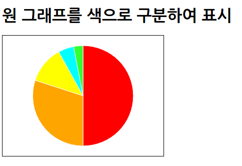

## 원 그래프와 파이 차트
[TOC]


### 원그래프 생성

* d3.js의 레이아웃 기능
	* | 종류 | 설명 |
      |--------|--------|
      | Chord | 코드 레이아웃 |
      | Cluster | 클라우드 레이아웃 |
      | Force | 역학/포스 레이아웃 |
      | Hierarchy | 계층화 레이아웃 |
      | Histogram | 히스토그램(도수분포표) |
      | Pack | 팩 레이아웃(hierarchy의 일종) |
      | Pie | 원 레이아웃 |
      | Stack | 누적 레이아웃 |
      | Tree | 트리 레이아웃(Hierarchy의 일종) |
      | Treemap | 트리맵 레이아웃(Hierarchy의 일종) |

* d3.layout.pie() : 원 그래프 레이아웃 기능 사용, 함수(객체) 반환
* d3.svg.arc() : 원그래프 전체의 크기등의 처리 수행
	* outerRadius() : 반지름 지정
	* innerRadius() : 안쪽 반지름 지정

* 원그래프 그리기
	* ```xml
	<!DOCTYPE html>
    <html>
        <head>
            <meta charset="utf-8">
            <title>Sample</title>
            <script src="http://d3js.org/d3.v3.min.js" charset="utf-8"></script>
            <style>
                svg { width: 320px; height: 240px; border: 1px solid black; }
              .pie { fill: orange; stroke: black; }
            </style>
        </head>
        <body>
            <h1>원 그래프 표시</h1>
            <svg id="myGraph"></svg>
            <script src="js/sample.js"></script>
        </body>
    </html>
	```
    * ```javascript
    var svgWidth = 320;	// SVG 요소의 넓이
    var svgHeight = 240;	// SVG 요소의 높이
    var dataSet = [50, 30, 12, 5, 3];	// 데이터셋. 비율을 나타냄
    // 원 그래프의 좌표값을 계산하는 메서드
    var pie = d3.layout.pie()	// 원 그래프 레이아웃
    // 원 그래프의 외경, 내경 설정
    var arc = d3.svg.arc().innerRadius(0).outerRadius(100);
    // 원 그래프 그리기
    var pieElements = d3.select("#myGraph")
      .selectAll("path")	// path 요소 지정
      .data(pie(dataSet))	// 데이터를 요소에 연결
    // 데이터 추가
    pieElements.enter()	// 데이터 수만큼 반복
      .append("path")	// 데이터의 수만큼 path 요소가 추가됨
      .attr("class", "pie")	// CSS 클래스 설정
      .attr("d", arc)	//부채꼴 지정
      .attr("transform", "translate("+svgWidth/2+", "+svgHeight/2+")")    // 원 그래프의 중심으로 함
    ```
	* 

### 원 그래프 색 구분

* 원 그래프의 색을 구분하여 그리기(직접 준비한 색을 사용할 때)
	* ```xml
	<!DOCTYPE html>
    <html>
        <head>
            <meta charset="utf-8">
            <title>Sample</title>
            <script src="http://d3js.org/d3.v3.min.js" charset="utf-8"></script>
            <style>
                svg { width: 320px; height: 240px; border: 1px solid black; }
              .pie { fill: orange; stroke: white; }
            </style>
        </head>
        <body>
            <h1>원 그래프를 색으로 구분하여 표시</h1>
            <svg id="myGraph"></svg>
            <script src="js/sample.js"></script>
        </body>
    </html>
	```
    * ```javascript
    var svgWidth = 320;	// SVG 요소의 넓이
    var svgHeight = 240;	// SVG 요소의 높이
    var dataSet = [50, 30, 12, 5, 3];	// 데이터셋. 비율을 나타냄
    // 원 그래프의 좌표값을 계산하는 메서드
    var pie = d3.layout.pie()	// 원 그래프 레이아웃
    // 원 그래프의 안쪽 반지름, 바깥쪽 반지름 설정
    var arc = d3.svg.arc().innerRadius(0).outerRadius(100);
    // 원 그래프 그리기
    var pieElements = d3.select("#myGraph")
      .selectAll("path")	// path 요소 지정
      .data(pie(dataSet))	// 데이터를 요소에 연결
    // 데이터 추가
    pieElements.enter()	// 데이터 수만큼 반복
      .append("path")	// 데이터의 수만큼 path 요소가 추가됨
      .attr("class", "pie")	// CSS 클래스 설정
      .attr("d", arc)	// 부채꼴 지정
      .attr("transform", "translate("+svgWidth/2+", "+svgHeight/2+")")    // 원 그래프의 중심으로 함
      .style("fill", function(d, i){
            return ["red", "orange", "yellow", "cyan", "#3f3"][i];	// 배열 안의 색을 반환
        })
    ```
	* 

* 부채꼴에 표시할 색을 배열에 입력해두고 데이터의 순서에 따라 배열의 색을 반환
	* ```javascript
	.style("fill", function(d, i){
		return ["red", "orange", "yellow", "cyan", "#3f3"][i];	// 배열 안의 색을 반환
	})
    ```

* d3.scale.category10()의 반환값을 변수에 입력한 다음 이를 사용
	* ```javascript
	var color = d3.scale.category10();
	```

* 원 그래프를 색으로 구분하여 그리기(D3.js의 기본 10색을 사용했을 때)
	* ```javascript
	var svgWidth = 320;	// SVG 요소의 넓이
    var svgHeight = 240;	// SVG 요소의 높이
    var dataSet = [50, 30, 12, 5, 3];	// 데이터셋. 비율을 나타냄
    var color = d3.scale.category10();  // D3.js가 준비한 표준 10색을 지정
    // 원 그래프의 좌표값을 계산하는 메서드
    var pie = d3.layout.pie()	// 원 그래프 레이아웃
    // 원 그래프의 안쪽 반지름, 바깥쪽 반지름 설정
    var arc = d3.svg.arc().innerRadius(0).outerRadius(100);
    // 원 그래프 그리기
    var pieElements = d3.select("#myGraph")
      .selectAll("path")	// path 요소 지정
      .data(pie(dataSet))	// 데이터를 요소에 연결
    // 데이터 추가
    pieElements.enter()	// 데이터 수만큼 반복
      .append("path")	// 데이터의 수만큼 path 요소가 추가됨
      .attr("class", "pie")	// CSS 클래스 설정
      .attr("d", arc)	// 부채꼴 지정
      .attr("transform", "translate("+svgWidth/2+", "+svgHeight/2+")")    // 원 그래프의 중심으로 함
      .style("fill", function(d, i){
            return color(i);	// 표준 10색 중 색을 반환
        })
	```
    * 

* 원 그래프를 색으로 구분하여 그리기(D3.js의 기본 20색을 사용했을 때)
	* ```javascript
	var svgWidth = 320;	// SVG 요소의 넓이
    var svgHeight = 240;	// SVG 요소의 높이
    var dataSet = [5, 10, 8, 12, 16, 20, 12, 18, 6, 9, 10, 6, 15, 20];	// 데이터셋. 비율을 나타냄
    var color = d3.scale.category20();  // D3.js가 준비한 표준 20색을 지정
    // 원 그래프의 좌표값을 계산하는 메서드
    var pie = d3.layout.pie()	// 원 그래프 레이아웃
    // 원 그래프의 안쪽 반지름, 바깥쪽 반지름 설정
    var arc = d3.svg.arc().innerRadius(0).outerRadius(100);
    // 원 그래프 그리기
    var pieElements = d3.select("#myGraph")
      .selectAll("path")	// path 요소 지정
      .data(pie(dataSet))	// 데이터를 요소에 연결
    // 데이터 추가
    pieElements.enter()	// 데이터 수만큼 반복
      .append("path")	// 데이터의 수만큼 path 요소가 추가됨
      .attr("class", "pie")	// CSS 클래스 설정
      .attr("d", arc)	// 부채꼴 지정
      .attr("transform", "translate("+svgWidth/2+", "+svgHeight/2+")")    // 원 그래프의 중심으로 함
      .style("fill", function(d, i){
            return color(i);	// 표준 20색 중 색을 반환
        })
	```
    * 
* 조금 차분한 색을 원한다면 d3.scale.category20b() 사용
	* 

### 원 그래프를 애니메이션으로 표시

* 0도에서 360도까지 한 바퀴 돌며 표시되는 원 그래프
	* ```xml
	<!DOCTYPE html>
    <html>
        <head>
            <meta charset="utf-8">
            <title>Sample</title>
            <script src="http://d3js.org/d3.v3.min.js" charset="utf-8"></script>
            <style>
                svg { width: 320px; height: 240px; border: 1px solid black; }
              .pie { fill: orange; stroke: white; }
            </style>
        </head>
        <body>
            <h1>원 그래프에 애니메이션 적용</h1>
            <svg id="myGraph"></svg>
            <script src="js/sample.js"></script>
        </body>
    </html>
	```
    * ```javascript
    var svgWidth = 320;	// SVG 요소의 넓이
    var svgHeight = 240;	// SVG 요소의 높이
    var dataSet = [50, 30, 12, 5, 3];	// 데이터셋. 비율을 나타냄
    var color = d3.scale.category10();  // D3.js가 준비한 표준 10색을 지정
    // 원 그래프의 좌표값을 계산하는 메서드
    var pie = d3.layout.pie()	// 원 그래프 레이아웃
    // 원 그래프의 안쪽 반지름, 바깥쪽 반지름 설정
    var arc = d3.svg.arc().innerRadius(0).outerRadius(100)
    // 원 그래프 그리기
    var pieElements = d3.select("#myGraph")
      .selectAll("path")	// path 요소 지정
      .data(pie(dataSet))	// 데이터를 요소에 연결
    // 데이터 추가
    pieElements.enter()	// 데이터 수만큼 반복
      .append("path")	// 데이터의 수만큼 path 요소가 추가됨
      .attr("class", "pie")	// CSS 클래스 설정
      .attr("transform", "translate("+svgWidth/2+", "+svgHeight/2+")")    // 원 그래프의 중심으로 함
      .style("fill", function(d, i){
            return color(i);	// 표준 10색 중 색을 반환
        })
      .transition()
      .duration(1000)
      .delay(function(d,i){   // 그릴 원 그래프의 시간을 어긋나게 표시
            return i*1000;
        })
      .attrTween("d", function(d, i){	// 보간 처리
            var interpolate = d3.interpolate(
                { startAngle : d.startAngle, endAngle : d.startAngle }, // 각 부분의 시작 각도
                { startAngle : d.startAngle, endAngle : d.endAngle }    // 각 부분의 종료 각도
             );
            return function(t){
                return arc(interpolate(t)); // 시간에 따라 처리
            }
        })
    ```

* attrTween() : 속성값을 시간에 따라 변화시키는 데 사용

* 각 부채꼴을 시간 차를 두어 표시
	* ```javascript
	.delay(function(d, i){
    	return i*1000;
    })
	```

* 부채꼴이 여러 개일 때는 각각의 부채꼴의 각도에 따라 처리
	* ```javascript
	var interpolate = d3.interpolate (
        {startAngle : d.startAngle, endAngle : d.startAngle},
        {startAngle : d.startAngle, endAngle : d.endAngle}
    );
	```

* interpolate() 메서드를 이용하여 좌표값을 구함
	* ```javascript
	return function(t) {
    	return arc(interpolate(t));
    }
	```

* 직선적인 움직임으로 0도부터 360도까지 한 바퀴 돌아 표시되는 원 그래프
	* ease() : 움직임 지정, 문자열 뒤에 계속해서 줄표(-)로 구분하여 in이나 out-in 등의 문자열을 추가하면 움직임의 가속 상태를 변경할 수 있다. (http://bl.ocks.org/mbostock/248bac3b8e354a9103c4 참고)
	* 움직임을 나타내는 문자열에 추가할 수 있는 문자열 : in, out, in-out, out-in
	* ```javascript
	var svgWidth = 320;	// SVG 요소의 넓이
    var svgHeight = 240;	// SVG 요소의 높이
    var dataSet = [50, 30, 12, 5, 3];	// 데이터셋. 비율을 나타냄
    var color = d3.scale.category10();  // D3.js가 준비한 표준 10색을 지정
    // 원 그래프의 좌표값을 계산하는 메서드
    var pie = d3.layout.pie()	// 원 그래프 레이아웃
    // 원 그래프의 안쪽 반지름, 바깥쪽 반지름 설정
    var arc = d3.svg.arc().innerRadius(0).outerRadius(100)
    // 원 그래프 그리기
    pieElements = d3.select("#myGraph")
      .selectAll("path")	// path 요소 지정
      .data(pie(dataSet))	// 데이터를 요소에 연결
    // 데이터 추가
    pieElements.enter()	// 데이터 수만큼 반복
      .append("path")	// 데이터의 수만큼 path 요소가 추가됨
      .attr("class", "pie")	// CSS 클래스 설정
      .attr("transform", "translate("+svgWidth/2+", "+svgHeight/2+")")    // 원 그래프의 중심으로 함
      .style("fill", function(d, i){
            return color(i);	// 표준 10색 중 색을 반환
        })
      .transition()
      .duration(1000)
      .delay(function(d,i){   // 그릴 원 그래프의 시간을 어긋나게 표시
            return i*1000;
        })
      .ease("linear")	// 직선적인 움직임으로 변경
      .attrTween("d", function(d, i){	// 보간 처리
            var interpolate = d3.interpolate(
                { startAngle : d.startAngle, endAngle : d.startAngle }, // 각 부분의 시작 각도
                { startAngle : d.startAngle, endAngle : d.endAngle }    // 각 부분의 종료 각도
             );
            return function(t){
                return arc(interpolate(t)); // 시간에 따라 처리
            }
        })
	```

### 원 그래프에 숫자와 텍스트 표시

* 원 그래프 가운데에 합계를 표시
	* d3.sum() : 배열의 합계 반환
	* ```xml
	<!DOCTYPE html>
    <html>
        <head>
            <meta charset="utf-8">
            <title>Sample</title>
            <script src="http://d3js.org/d3.v3.min.js" charset="utf-8"></script>
            <style>
                svg { width: 320px; height: 240px; border: 1px solid black; }
              .pie { fill: orange; stroke: white; }
              .total { font-size: 9pt; text-anchor: middle; }
            </style>
        </head>
        <body>
            <h1>원 그래프에 숫자 표시</h1>
            <svg id="myGraph"></svg>
            <script src="js/sample.js"></script>
        </body>
    </html>
	```
    * ```javascript
    var svgWidth = 320;	// SVG 요소의 넓이
    var svgHeight = 240;	// SVG 요소의 높이
    var dataSet = [50, 30, 12, 5, 3];	// 데이터셋. 비율을 나타냄
    var color = d3.scale.category10();  // D3.js가 준비한 표준 10색을 지정
    // 원 그래프의 좌표값을 계산하는 메서드
    var pie = d3.layout.pie()	// 원 그래프 레이아웃
    // 원 그래프의 안쪽 반지름, 바깥쪽 반지름 설정
    var arc = d3.svg.arc().innerRadius(30).outerRadius(100)
    // 원 그래프 그리기
    var pieElements = d3.select("#myGraph")
      .selectAll("path")	// path 요소 지정
      .data(pie(dataSet))	// 데이터를 요소에 연결
    // 데이터 추가
    pieElements.enter()	// 데이터 수만큼 반복
      .append("path")	// 데이터의 수만큼 path 요소가 추가됨
      .attr("class", "pie")	// CSS 클래스 설정
      .attr("transform", "translate("+svgWidth/2+", "+svgHeight/2+")")    // 원 그래프의 중심으로 함
      .style("fill", function(d, i){
            return color(i);	// 표준 10색 중 색을 반환
        })
      .transition()
      .duration(200)
      .delay(function(d,i){   // 그릴 원 그래프의 시간을 어긋나게 표시
            return i*200;
        })
      .ease("linear")	// 직선적인 움직임으로 변경
      .attrTween("d", function(d, i){	// 보간 처리
            var interpolate = d3.interpolate(
                { startAngle : d.startAngle, endAngle : d.startAngle }, // 각 부분의 시작 각도
                { startAngle : d.startAngle, endAngle : d.endAngle }    // 각 부분의 종료 각도
             );
            return function(t){
                return arc(interpolate(t)); // 시간에 따라 처리
            }
        })
    // 합계의 수와 문자를 표시
    var textElements = d3.select("#myGraph")
      .append("text")	// text 요소 추가
      .attr("class", "total")	// CSS 클래스 설정
      .attr("transform", "translate("+svgWidth/2+", "+(svgHeight/2+5)+")")    // 가운데에 표시
      .text("합계:" + d3.sum(dataSet))	// 합계 표시
    ```
    * 

**각 부채꼴의 값도 표시**

* centroid() 메서드로 부채꼴의 중심 좌표를 구함
	* centroid() : 도형의 좌표값을 아용하여 중심(무게중심)을 계산
	* ```javascript
	.attr("transform", function(d, i){
    	return "tanslate("+arc.centroid(d)+")";
    })
	```

* 원 그래프 가운데에 합계를, 부채꼴의 가운데에 데이터를 표시
	* ```xml
	<!DOCTYPE html>
    <html>
        <head>
            <meta charset="utf-8">
            <title>Sample</title>
            <script src="http://d3js.org/d3.v3.min.js" charset="utf-8"></script>
            <style>
                svg { width: 320px; height: 240px; border: 1px solid black; }
              .pie { fill: orange; stroke: white; }
              .total { font-size: 9pt; text-anchor: middle; }
              .pieNum { font-size: 10pt; text-anchor: middle; }
            </style>
        </head>
        <body>
            <h1>원 그래프에 숫자 표시</h1>
            <svg id="myGraph"></svg>
            <script src="js/sample.js"></script>
        </body>
    </html>
	```
    * ```javascript
    // ●는 변경한 곳（편집용）
    var svgWidth = 320;	// SVG 요소의 넓이
    var svgHeight = 240;	// SVG 요소의 높이
    var dataSet = [50, 30, 12, 5, 3];	// 데이터셋. 비율을 나타냄
    var color = d3.scale.category10();  // D3.js가 준비한 표준 10색을 지정
    // 원 그래프의 좌표값을 계산하는 메서드
    var pie = d3.layout.pie()	// 원 그래프 레이아웃
      .value(function(d, i){ return d; })	// 데이터셋의 데이터 반환
    // 원 그래프의 안쪽 반지름, 바깥쪽 반지름 설정
    var arc = d3.svg.arc().innerRadius(30).outerRadius(100)
    // 원 그래프 그리기
    var pieElements = d3.select("#myGraph")
      .selectAll("g")	// g 요소 지정●
      .data(pie(dataSet))	// 데이터를 요소에 연결
      .enter()
      .append("g")	// 중심 계산을 위해 그룹화하기●
      .attr("transform", "translate("+svgWidth/2+", "+svgHeight/2+")")    // 원 그래프의 중심으로 함●
    // 데이터 추가
    pieElements	// 데이터 수만큼 반복
      .append("path")	// 데이터의 수만큼 path 요소가 추가됨
      .attr("class", "pie")	// CSS 클래스 설정
      .style("fill", function(d, i){
            return color(i);	// 표준 10색 중 색을 반환
        })
      .transition()
      .duration(200)
      .delay(function(d,i){   // 그릴 원 그래프의 시간을 어긋나게 표시
            return i*200;
        })
      .ease("linear")	// 직선적인 움직임으로 변경
      .attrTween("d", function(d, i){	// 보간 처리
            var interpolate = d3.interpolate(
                { startAngle : d.startAngle, endAngle : d.startAngle }, // 각 부분의 시작 각도
                { startAngle : d.startAngle, endAngle : d.endAngle }    // 각 부분의 종료 각도
             );
            return function(t){
                return arc(interpolate(t)); // 시간에 따라 처리
            }
        })
    // 합계와 문자 표시
    var textElements = d3.select("#myGraph")
      .append("text")	// text 요소 추가
      .attr("class", "total")	// CSS 클래스 설정
      .attr("transform", "translate("+svgWidth/2+", "+(svgHeight/2+5)+")")    // 중심에 표시
      .text("합계:" + d3.sum(dataSet))	// 합계 표시
    // 숫자를 부채꼴의 가운데에 표시●↓
    pieElements
      .append("text")	// 데이터 수만큼 text 요소가 추가됨
      .attr("class", "pieNum")	// CSS 클래스 설정
      .attr("transform", function(d, i){
            return "translate("+arc.centroid(d)+")";    // 부채꼴의 중심으로 함(무게 중심 계산)
        })
      .text(function(d, i){
            return d.value;	// 값 표시
        })
    ```
    * 

### 외부 파일을 불러와 원 그래프 변화

* 2008년부터 2014년까지의 휴대전화 시장 점유율
	* mydata2008.csv ~ mydata2014.csv

* CSV 파일 내용(mydata2008.csv)
	* ```
	SKT,KT,LG U+,etc
	53,29,18,0
	```

* CSV 파일 데이터를 불러옴
	* ```javascript
	var dataSEt = [];
    for(var i in data[0]) {
    	dataSet.push(data[0)[i])
    }
	```

* svg 요소 안의 모든 요소를 지정하여 삭제함
	* ```javascript
    d3.select("#myGraph").selectAll("*").remove();
	```

* 선택 메뉴로 선택한 CVS 파일을 불러와 표시하는 원 그래프
	* ```xml
	<!DOCTYPE html>
    <html>
        <head>
            <meta charset="utf-8">
            <title>Sample</title>
            <script src="http://d3js.org/d3.v3.min.js" charset="utf-8"></script>
            <style>
                svg { width: 320px; height: 240px; border: 1px solid black; }
              .pie { fill: orange; stroke: white; }
              .total { font-size: 8pt; text-anchor: middle; }
              .pieNum { font-size: 15pt; color: white; text-anchor: middle; }
            </style>
        </head>
        <body>
            <h1>휴대전화 시장점유율 표시</h1>
            <svg id="myGraph"></svg>
            <form>
                <select id="year">
                    <option value="2008">2008년</option>
                    <option value="2009">2009년</option>
                    <option value="2010">2010년</option>
                    <option value="2011">2011년</option>
                    <option value="2012">2012년</option>
                    <option value="2013">2013년</option>
                    <option value="2014">2014년</option>
                </select>
            </form>
            <script src="js/sample.js"></script>
        </body>
    </html>
	```
    * ```javascript
    // 처음에는 2008년 데이터를 표시해둠
    drawPie("mydata2008.csv");
    // 선택 메뉴가 선택되었을 때의 처리
    d3.select("#year").on("change", function(){
        d3.select("#myGraph").selectAll("*").remove();	// svg 안의 모든 요소를 삭제
        drawPie("mydata"+this.value+".csv", this.value);	// 지정된 연도의 데이터를 불러와 원 그래프 표시
    });
    function drawPie(filename){
    // 데이터셋은 CSV 파일
        d3.csv(filename, function(error, data){
            var dataSet = [ ];	// 데이터를 저장할 배열 변수
            for(var i in data[0]){	// 최초 데이터를 처리
                dataSet.push(data[0][i]);	// 가로 한 줄 모두를 한꺼번에 입력
            }
            // SVG 요소의 넓이와 높이를 구함
            var svgEle = document.getElementById("myGraph");
            var svgWidth = window.getComputedStyle(svgEle, null).getPropertyValue("width");
            var svgHeight = window.getComputedStyle(svgEle, null).getPropertyValue("height");
            svgWidth = parseFloat(svgWidth);	// 값에는 단위가 붙어 있으므로 단위를 삭제
            svgHeight = parseFloat(svgHeight);	// 값에는 단위가 붙어 있으므로 단위를 삭제
            // 원 그래프의 좌표값을 계산하는 메서드
            var pie = d3.layout.pie()	// 원 그래프 레이아웃
            // 원 그래프의 안쪽 반지름, 바깥쪽 반지름 설정
            var arc = d3.svg.arc().innerRadius(30).outerRadius(100)
            // 원 그래프 그리기
            var pieElements = d3.select("#myGraph")
              .selectAll("g")	// g 요소 지정
              .data(pie(dataSet))	// 데이터를 요소에 연결
              .enter()
              .append("g")	// 무게 중심 계산을 위하 그룹화하기
              .attr("transform", "translate("+svgWidth/2+", "+svgHeight/2+")")    // 원 그래프의 중심으로 함
            // 데이터 추가
            pieElements	// 데이터 수만큼 반복
              .append("path")	// 데이터의 수만큼 path 요소가 추가됨
              .attr("class", "pie")	// CSS 클래스 설정
              .style("fill", function(d, i){
                    return ["#ff3344", "#ff7328", "#d3d4d5", "#dfd"][i];	// 통신사의 색을 반환
                })
              .transition()
              .duration(200)
              .delay(function(d,i){   // 그릴 원 그래프의 시간을 어긋나게 표시
                    return i*200;
                })
              .ease("linear")	// 직선적인 움직임으로 변경
              .attrTween("d", function(d, i){	// 보간 처리
                    var interpolate = d3.interpolate(
                        { startAngle : d.startAngle, endAngle : d.startAngle }, // 각 부분의 시작 각도
                        { startAngle : d.startAngle, endAngle : d.endAngle }    // 각 부분의 종료 각도
                     );
                    return function(t){
                        return arc(interpolate(t)); // 시간에 따라 처리
                    }
                })
            // 합계와 문자 표시
            var textElements = d3.select("#myGraph")
              .append("text")	// text 요소 추가
              .attr("class", "total")	// CSS 클래스 설정
              .attr("transform", "translate("+svgWidth/2+", "+(svgHeight/2+5)+")")    // 가운데에 표시
              .text("점유율")	// 문자 표시
            // 숫자를 부채꼴의 가운데 표시
            pieElements
              .append("text")	// 데이터의 수만큼 text 요소가 추가됨
              .attr("class", "pieNum")	// CSS 클래스 설정
              .attr("transform", function(d, i){
                    return "translate("+arc.centroid(d)+")";    // 부채꼴의 중심으로 함
                })
              .text(function(d, i){
                    return d.value;	// 값 표시
                })
        });
    }
    ```