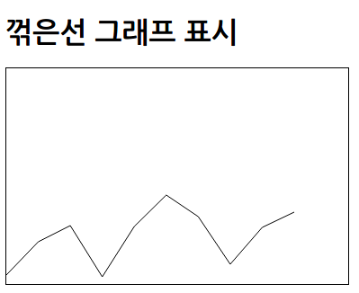
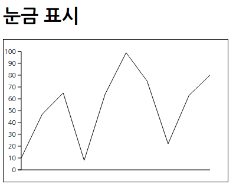
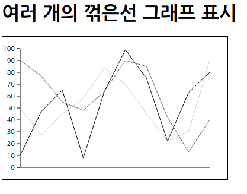
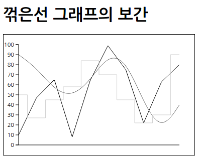
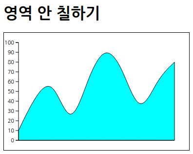
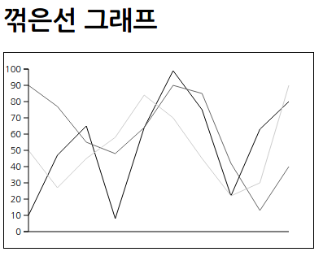
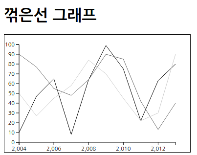
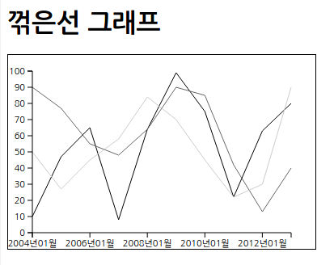
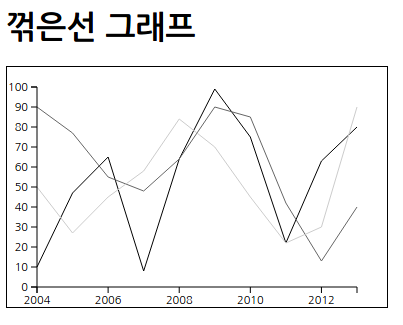

## 꺾은선 그래프

[toc]

### 꺾은선 그래프 생성

* 꺽은선 그래프는 레이아웃 기능이 없어 SVG의 연속선을 사용
* 간단한 꺾은선 그래프 그리기
* d3.svg.line() : 두 점 간의 좌표를 연결하는 처리 수행 (D3 4.0 : d3.line()으로 변경)
	* ```xml
	<!DOCTYPE html>
    <html>
        <head>
            <meta charset="utf-8">
            <title>Sample</title>
            <script src="http://d3js.org/d3.v3.min.js" charset="utf-8"></script>
            <style>
                svg { width: 380px; height: 240px; border: 1px solid black; }
              .line { fill: none; stroke: black; }
            </style>
        </head>
        <body>
            <h1>꺾은선 그래프 표시</h1>
            <svg id="myGraph"></svg>
            <script src="js/sample.js"></script>
        </body>
    </html>
	```
	* ```javascript
	var svgWidth = 320;	// SVG 요소의 넓이
    var svgHeight = 240;	// SVG 요소의 높이
    var dataSet = [10, 47, 65, 8, 64, 99, 75, 22, 63, 80];	// 데이터셋
    var margin = svgWidth/(dataSet.length - 1);	// 꺾은선 그래프의 간격 계산
    // 꺾은선 그래프의 좌표를 계산하는 메서드
    var line = d3.svg.line()	// svg의 선
        .x(function(d, i){
            return i * margin;	// X 좌표는 표시 순서×간격
        })
        .y(function(d, i){
            return svgHeight - d;	// 데이터로부터 Y 좌표 빼기
        })
    // 꺾은선 그래프 그리기
    var lineElements = d3.select("#myGraph")
        .append("path")	// 데이터 수만큼 path 요소가 추가됨
        .attr("class", "line")	// CSS 클래스 지정
        .attr("d", line(dataSet))	//연속선 지정
	```
    * 

**세로 방향 표시를 2배로 하고 눈금(세로축과 가로축)을 표시**

* 눈금을 추가한 꺾은선 그래프 그리기
	* d3.scale.linear : 선형 스케일 생성 (D3 4.0 : d3.scaleLinear()으로 변경)
	* ```xml
	<!DOCTYPE html>
    <html>
        <head>
            <meta charset="utf-8">
            <title>Sample</title>
            <script src="http://d3js.org/d3.v3.min.js" charset="utf-8"></script>
            <style>
                svg { width: 380px; height: 240px; border: 1px solid black; }
              .line { fill: none; stroke: black; }
              .axis text {
                    font-family: sans-serif;
                    font-size: 11px;
                }
              .axis path,
              .axis line {
                    fill: none;
                    stroke: black;
                }
              .axis_x line {
                    fill: none;
                    stroke: black;
                }
            </style>
        </head>
        <body>
            <h1>눈금 표시</h1>
            <svg id="myGraph"></svg>
            <script src="js/sample.js"></script>
        </body>
    </html>
	```
	* ```javascript
	var svgWidth = 320;	// SVG 요소의 넓이
    var svgHeight = 240;	// SVG 요소의 높이
    var offsetX = 30;	// 가로 오프셋
    var offsetY = 20;	// 세로 오프셋
    var scale = 2.0;	// 2배 크기로 그리기
    var dataSet = [10, 47, 65, 8, 64, 99, 75, 22, 63, 80];	// 데이터셋
    var margin = svgWidth /(dataSet.length - 1);	// 꺾은선 그래프의 간격 계산
    // 꺾은선 그래프의 좌표를 계산하는 메서드
    var line = d3.svg.line()	// svg의 선
      .x(function(d, i){
            return offsetX + i * margin;	// X 좌표는 표시 순서×간격
        })
      .y(function(d, i){
            return svgHeight - (d * scale) - offsetY;	// 데이터로부터 Y 좌표 빼기
        })
    // 꺾은선 그래프 그리기
    var lineElements = d3.select("#myGraph")
      .append("path")	// 데이터 수만큼 path 요소가 추가됨
      .attr("class", "line")	// CSS 클래스 지정
      .attr("d", line(dataSet))	//연속선 지정
    // 눈금 표시를 위한 스케일 설정
    var yScale = d3.scale.linear()  // 스케일 설정
      .domain([0, 100])   // 원래 크기
      .range([scale*100, 0]) // 실제 표시 크기
    // 눈금 표시
    d3.select("#myGraph")	// SVG 요소를 지정
          .append("g")	// g 요소 추가. 이것이 눈금을 표시하는 요소가 됨
          .attr("class", "axis")	// CSS 클래스 지정
          .attr("transform", "translate("+offsetX+", "+((100-(scale-1)*100)+offsetY)+")")
          .call(
                d3.svg.axis()
              .scale(yScale)  //스케일 적용
              .orient("left") //눈금 표시 위치를 왼쪽으로 지정
            )
        // 가로 방향의 선을 표시
    d3.select("#myGraph")
      .append("rect")	// rect 요소 추가
      .attr("class", "axis_x")	// CSS 클래스 지정
      .attr("width", svgWidth)	// 선의 넓이를 지정
      .attr("height", 1)	// 선의 높이를 지정
      .attr("transform", "translate("+offsetX+", "+(svgHeight-offsetY-0.5)+")")
	```
    * 

### 여러 개의 꺾은선 그래프 표시

* drawGraph() : 주어진 데이터셋을 이용하여 꺾은선 그래프를 그림
* drawScale() : 눈금(가로축과 세로축)을 표시

* 데이터셋과 함수 호출
	* ```javascript
	var dataSet1 = [10, 47, 65, 8, 64, 99, 75, 22, 63, 80];	// 데이터셋1
    var dataSet2 = [90, 77, 55, 48, 64, 90, 85, 42, 13, 40];	// 데이터셋2
    var dataSet3 = [50, 27, 45, 58, 84, 70, 45, 22, 30, 90];	// 데이터셋3
    var margin = svgWidth /(dataSet1.length - 1);	// 꺾은선 그래프의 간격 계산
    drawGraph(dataSet1, "itemA");	// itemA의 꺾은선 그래프 표시
    drawGraph(dataSet2, "itemB");	// itemB의 꺾은선 그래프 표시
    drawGraph(dataSet3, "itemC");	// itemB의 꺾은선 그래프 표시
    drawScale();	// 눈금 표시
	```

* 각각의 꺾은선 그래프 색을 설정
	* ```css
    .itemA { stroke: #000; }
    .itemB { stroke: #666; }
    .itemC { stroke: #ccc; }
    ```

* 여러 개의 꺾은선 그래프 그리기
	* ```xml
	<!DOCTYPE html>
    <html>
        <head>
            <meta charset="utf-8">
            <title>Sample</title>
            <script src="http://d3js.org/d3.v3.min.js" charset="utf-8"></script>
            <style>
                svg { width: 380px; height: 240px; border: 1px solid black; }
              .line { fill: none; stroke: black; }
              .axis text {
                    font-family: sans-serif;
                    font-size: 11px;
                }
              .axis path,
              .axis line {
                    fill: none;
                    stroke: black;
                }
              .axis_x line {
                    fill: none;
                    stroke: black;
                }
              .itemA { stroke: #000; }
              .itemB { stroke: #666; }
              .itemC { stroke: #ccc; }
            </style>
        </head>
        <body>
            <h1>여러 개의 꺾은선 그래프 표시</h1>
            <svg id="myGraph"></svg>
            <script src="js/sample.js"></script>
        </body>
    </html>
	```
    * ```javascript
    var svgWidth = 320;	// SVG 요소의 넓이
    var svgHeight = 240;	// SVG 요소의 높이
    var offsetX = 30;	// 가로 오프셋
    var offsetY = 20;	// 세로 오프셋
    var scale = 2.0;	// 2배 크기로 그리기
    var dataSet1 = [10, 47, 65, 8, 64, 99, 75, 22, 63, 80];	// 데이터셋1
    var dataSet2 = [90, 77, 55, 48, 64, 90, 85, 42, 13, 40];	// 데이터셋2
    var dataSet3 = [50, 27, 45, 58, 84, 70, 45, 22, 30, 90];	// 데이터셋3
    var margin = svgWidth /(dataSet1.length - 1);	// 꺾은선 그래프의 간격 계산
    drawGraph(dataSet1, "itemA");	// itemA의 꺾은선 그래프 표시
    drawGraph(dataSet2, "itemB");	// itemB의 꺾은선 그래프 표시
    drawGraph(dataSet3, "itemC");	// itemB의 꺾은선 그래프 표시
    drawScale();	// 눈금 표시
    // 꺾은선 그래프를 표시하는 함수
    function drawGraph(dataSet, cssClassName){
        // 꺾은선 그래프의 좌표를 계산하는 메서드
        var line = d3.svg.line()	// svg의 선
          .x(function(d, i){
                return offsetX + i * margin;	// X 좌표는 표시 순서×간격
            })
          .y(function(d, i){
                return svgHeight - (d * scale) - offsetY;	// 데이터로부터 Y 좌표 빼기
            })
        // 꺾은선 그래프 그리기
        var lineElements = d3.select("#myGraph")
          .append("path")	// 데이터 수만큼 path 요소가 추가됨
          .attr("class", "line "+cssClassName)	// CSS 클래스 지정
          .attr("d", line(dataSet))	//연속선 지정
    }
    // 그래프의 눈금을 표시하는 함수
    function drawScale(){
        // 눈금을 표시하기 위해 D3 스케일 설정
        var yScale = d3.scale.linear()  // 스케일 설정
          .domain([0, 100])   // 원래 크기
          .range([scale*100, 0]) // 실제 표시 크기
        // 눈금 표시
        d3.select("#myGraph")	// SVG 요소를 지정
              .append("g")	// g 요소 추가. 이것이 눈금을 표시하는 요소가 됨
              .attr("class", "axis")	// CSS 클래스 지정
              .attr("transform", "translate("+offsetX+", "+offsetY+")")
              .call(
                    d3.svg.axis()
                  .scale(yScale)  //스케일 적용
                  .orient("left") //눈금 표시 위치를 왼쪽으로 지정
                )
            // 가로 방향의 선을 표시
            d3.select("#myGraph")
              .append("rect")	// rect 요소 추가
              .attr("class", "axis_x")	// CSS 클래스 지정
              .attr("width", svgWidth)	// 선의 굵기를 지정
              .attr("height", 1)	// 선의 높이를 지정
              .attr("transform", "translate("+offsetX+", "+(svgHeight-offsetY-0.5)+")")
    }
    ```
    * 

### 꺾은선 그래프를 직선, 곡선, 계단 모양으로 표시

* 지정할 수 있는 보간 방법
	* | 보관 방법 | 설명 |
      |--------|--------|
      | linear | 직선적(양끝이 열림) |
      | linear-closed | 직선적(양끝이 닫힘) |
      | step | 계단 모양 |
      | step-before | 계단 모양(원점에서 최초 데이터를 표시) |
      | step-after | 계단 모양(X 좌표의 0 위치에서 시작하여 다음 값에 최초 데이터를 표시) |
      | basis | B 스플라인 곡선 |
      | basis-open | B 스플라인 곡선(양끝이 열림) |
      | basis-close | B 스플라인 곡선(양끝이 닫힘) |
      | bundle | 스플라인 곡선 |
      | cardinal | 카디널 스플라인 곡선 |
      | cardinal-open | 카디널 스플라인 곡선(양끝이 열림) |
      | cardinal-close | 카디널 스플라인 곡산(양끝이 닫힘) |
      | monotone | 모노 톤 간격 |

* d3.svg.line().interpolate() : 보간 처리 수행
* 좌표 사이를 곡선, 직선, 계단 모양의 꺾은선 그래프로 그림
	* ```xml
	<!DOCTYPE html>
    <html>
        <head>
            <meta charset="utf-8">
            <title>Sample</title>
            <script src="http://d3js.org/d3.v3.min.js" charset="utf-8"></script>
            <style>
                svg { width: 380px; height: 240px; border: 1px solid black; }
              .line { fill: none; stroke: black; }
              .axis text {
                    font-family: sans-serif;
                    font-size: 11px;
                }
              .axis path,
              .axis line {
                    fill: none;
                    stroke: black;
                }
              .axis_x line {
                    fill: none;
                    stroke: black;
                }
              .itemA { stroke: #000; }
              .itemB { stroke: #666; }
              .itemC { stroke: #ccc; }
            </style>
        </head>
        <body>
            <h1>꺾은선 그래프의 보간</h1>
            <svg id="myGraph"></svg>
            <script src="js/sample.js"></script>
        </body>
    </html>
	```
    * ```javascript
    var svgWidth = 320;	// SVG 요소의 넓이
    var svgHeight = 240;	// SVG 요소의 높이
    var offsetX = 30;	// 가로 오프셋
    var offsetY = 20;	// 세로 오프셋
    var scale = 2.0;	// 2배 크기로 그리기
    var dataSet1 = [10, 47, 65, 8, 64, 99, 75, 22, 63, 80];	// 데이터셋1
    var dataSet2 = [90, 77, 55, 48, 64, 90, 85, 42, 13, 40];	// 데이터셋2
    var dataSet3 = [50, 27, 45, 58, 84, 70, 45, 22, 30, 90];	// 데이터셋3
    var margin = svgWidth /(dataSet1.length - 1);	// 꺾은선 그래프의 간격 계산
    drawGraph(dataSet1, "itemA", "linear");	// 직선으로 표시
    drawGraph(dataSet2, "itemB", "basis");	// 곡선으로 표시
    drawGraph(dataSet3, "itemC", "step");	// 계단 모양으로 표시
    drawScale();	// 눈금 표시
    // 꺾은선 그래프를 표시하는 함수
    function drawGraph(dataSet, cssClassName, type){
        // 꺾은선 그래프의 좌표를 계산하는 메서드
        var line = d3.svg.line()	// svg의 선
          .x(function(d, i){
                return offsetX + i * margin;	// X 좌표는 표시 순서×간격
            })
          .y(function(d, i){
                return svgHeight - (d * scale) - offsetY;	// 데이터로부터 Y 좌표 빼기
            })
          .interpolate(type)	// 꺾은선 그래프의 모양을 설정
        // 꺾은선 그래프 그리기
        var lineElements = d3.select("#myGraph")
          .append("path")	// 데이터 수만큼 path 요소가 추가됨
          .attr("class", "line "+cssClassName)	// CSS 클래스 지정
          .attr("d", line(dataSet))	//연속선 지정
    }
    // 그래프의 눈금을 표시하는 함수
    function drawScale(){
        // 눈금을 표시하기 위한 D3 스케일 설정
        var yScale = d3.scale.linear()  // 스케일 설정
          .domain([0, 100])   // 원래 크기
          .range([scale*100, 0]) // 실제 표시 크기
        // 눈금 표시
        d3.select("#myGraph")	// SVG 요소를 지정
              .append("g")	// g 요소 추가. 이것이 눈금을 표시하는 요소가 됨
              .attr("class", "axis")	// CSS 클래스 지정
              .attr("transform", "translate("+offsetX+", "+offsetY+")")
              .call(
                    d3.svg.axis()
                  .scale(yScale)  //스케일 적용
                  .orient("left") //눈금 표시 위치를 왼쪽으로 지정
                )
            // 가로 방향의 선을 표시
            d3.select("#myGraph")
              .append("rect")	// rect 요소 추가
              .attr("class", "axis_x")	// CSS 클래스 지정
              .attr("width", svgWidth)	// 선의 굵기를 지정
              .attr("height", 1)	// 선의 높이를 지정
              .attr("transform", "translate("+offsetX+", "+(svgHeight-offsetY-0.5)+")")
    }
   	```
    * 

**영역 안을 칠한 꺾은선 그래프**

* d3.svg.area() 메서드를 사용
* HTML 파일 안에 칠하기 색을 지정
	* ```javascript
	.itemA { stroke: #000; fill: cyan}
	```
* 칠해진 그래프를 그리기 위한 drawGraph()
	* ```javascript
	function drawGraph(dataSet, cssClassName, type){
        // 영역 안이 좌표값을 계산하는 메서드
        var area = d3.svg.area()	// svg 영역
          .x(function(d, i){
                return offsetX + i * margin;	// X 좌표는 표시 순서×간격
            })
          .y0(function(d, i){
                return svgHeight - offsetY;	// 데이터로부터 Y 좌표 빼기
            })
          .y1(function(d, i){
                return svgHeight - (d * scale) - offsetY;	// 데이터로부터 Y 좌표 빼기
            })
          .interpolate(type)	// 꺾은선 그래프의 모양 설정
        // 꺾은선 그래프 그리기
        var lineElements = d3.select("#myGraph")
          .append("path")	// 데이터 수만큼 path 요소가 추가됨
          .attr("class", "line "+cssClassName)	// CSS 클래스 지정
          .attr("d", area(dataSet))	//연속선 지정
    }
	```
    * 

### 복잡한 데이터를 처리하여 꺾은선 그래프로 표시

**JSON 형식 데이터 처리(1)**

* 지금까지의 배열 데이터를 JSON 형식으로 바꾼 것(1)
 	* ```javascript
    var dataSet = [
        [
            { year : 2004, value : 10 },
            { year : 2005, value : 47 },
            { year : 2006, value : 65 },
            { year : 2007, value : 8 },
            { year : 2008, value : 64 },
            { year : 2009, value : 99 },
            { year : 2010, value : 75 },
            { year : 2011, value : 22 },
            { year : 2012, value : 63 },
            { year : 2013, value : 80 }
        ],
        [
            { year : 2004, value : 90 },
            { year : 2005, value : 77 },
            { year : 2006, value : 55 },
            { year : 2007, value : 48 },
            { year : 2008, value : 64 },
            { year : 2009, value : 90 },
            { year : 2010, value : 85 },
            { year : 2011, value : 42 },
            { year : 2012, value : 13 },
            { year : 2013, value : 40 }
        ],
        [
            { year : 2004, value : 50 },
            { year : 2005, value : 27 },
            { year : 2006, value : 45 },
            { year : 2007, value : 58 },
            { year : 2008, value : 84 },
            { year : 2009, value : 70 },
            { year : 2010, value : 45 },
            { year : 2011, value : 22 },
            { year : 2012, value : 30 },
            { year : 2013, value : 90 }
        ]
    ];
 	```

* JSON 형식 데이터를 이용한 꺾은선 그래프 그리기(1)
	* ```xml
	<!DOCTYPE html>
    <html>
        <head>
            <meta charset="utf-8">
            <title>Sample</title>
            <script src="http://d3js.org/d3.v3.min.js" charset="utf-8"></script>
            <style>
                svg { width: 380px; height: 240px; border: 1px solid black; }
              .line { fill: none; stroke: black; }
              .axis text {
                    font-family: sans-serif;
                    font-size: 11px;
                }
              .axis path,
              .axis line {
                    fill: none;
                    stroke: black;
                }
              .axis_x line {
                    fill: none;
                    stroke: black;
                }
              .itemA { stroke: #000; }
              .itemB { stroke: #666; }
              .itemC { stroke: #ccc; }
            </style>
        </head>
        <body>
            <h1>꺾은선 그래프</h1>
            <svg id="myGraph"></svg>
            <script src="js/sample.js"></script>
        </body>
    </html>
	```
	* ```javascript
	var svgWidth = 320;	// SVG 요소의 넓이
    var svgHeight = 240;	// SVG 요소의 높이
    var offsetX = 30;	// 가로 오프셋
    var offsetY = 20;	// 세로 오프셋
    var scale = 2.0;	// 2배 크기로 그리기
    var dataSet = [
        [
            { year : 2004, value : 10 },
            { year : 2005, value : 47 },
            { year : 2006, value : 65 },
            { year : 2007, value : 8 },
            { year : 2008, value : 64 },
            { year : 2009, value : 99 },
            { year : 2010, value : 75 },
            { year : 2011, value : 22 },
            { year : 2012, value : 63 },
            { year : 2013, value : 80 }
        ],
        [
            { year : 2004, value : 90 },
            { year : 2005, value : 77 },
            { year : 2006, value : 55 },
            { year : 2007, value : 48 },
            { year : 2008, value : 64 },
            { year : 2009, value : 90 },
            { year : 2010, value : 85 },
            { year : 2011, value : 42 },
            { year : 2012, value : 13 },
            { year : 2013, value : 40 }
        ],
        [
            { year : 2004, value : 50 },
            { year : 2005, value : 27 },
            { year : 2006, value : 45 },
            { year : 2007, value : 58 },
            { year : 2008, value : 84 },
            { year : 2009, value : 70 },
            { year : 2010, value : 45 },
            { year : 2011, value : 22 },
            { year : 2012, value : 30 },
            { year : 2013, value : 90 }
        ]
    ];
    var margin = svgWidth /(dataSet[0].length - 1);	// 꺾은선 그래프의 간격 계산
    drawGraph(dataSet[0], "itemA", "linear");	// 데이터셋 안의 첫 번째 데이터
    drawGraph(dataSet[1], "itemB", "linear");	// 데이터셋 안의 두 번째 데이터
    drawGraph(dataSet[2], "itemC", "linear");	// 데이터셋의 세 번째 데이터
    drawScale();	// 눈금 표시
    // 꺾은선 그래프를 표시하는 함수
    function drawGraph(dataSet, cssClassName, type){
        // 꺾은선 그래프의 좌표를 계산하는 메서드
        var line = d3.svg.line()	// svg의 선
          .x(function(d, i){
                return offsetX + i * margin;	// X 좌표는 표시 순서×간격
            })
          .y(function(d, i){
                return svgHeight - (d.value * scale) - offsetY;	// 데이터로부터 Y 좌표 빼기
            })
          .interpolate(type)	// 꺾은선 그래프의 모양 설정
        // 꺾은선 그래프 그리기
        var lineElements = d3.select("#myGraph")
          .append("path")	// 데이터 수만큼 path 요소가 추가됨
          .attr("class", "line "+cssClassName)	// CSS 클래스 지정
          .attr("d", line(dataSet))	//연속선 지정
    }
    // 그래프의 눈금을 표시하는 함수
    function drawScale(){
        // 눈금을 표시하기 위해 D3 스케일 설정
        var yScale = d3.scale.linear()  // 스케일 설정
          .domain([0, 100])   // 원래 크기
          .range([scale*100, 0]) // 실제 표시 크기
        // 눈금 표시
        d3.select("#myGraph")	// SVG 요소를 지정
              .append("g")	// g 요소 추가. 이것이 눈금을 표시하는 요소가 됨
              .attr("class", "axis")	// CSS 클래스 지정
              .attr("transform", "translate("+offsetX+", "+offsetY+")")
              .call(
                    d3.svg.axis()
                  .scale(yScale)  //스케일 적용
                  .orient("left") //눈금 표시 위치를 왼쪽으로 지정
                )
            // 가로 방향의 선을 표시
            d3.select("#myGraph")
              .append("rect")	// rect 요소 추가
              .attr("class", "axis_x")	// CSS 클래스 지정
              .attr("width", svgWidth)	// 선의 굵기를 지정
              .attr("height", 1)	// 선의 높이를 지정
              .attr("transform", "translate("+offsetX+", "+(svgHeight-offsetY-0.5)+")")
    }
	```
    * 

* drawGraph() 함수를 호출할 때 데이터셋으로 요소 번호를 지정하여 열 데이터를 전달
	* ```javascript
    drawGraph(dataSet[0], "itemA", "linear");	// 데이터셋 안의 첫 번째 데이터
    drawGraph(dataSet[1], "itemB", "linear");	// 데이터셋 안의 두 번째 데이터
    drawGraph(dataSet[2], "itemC", "linear");	// 데이터셋의 세 번째 데이터
	```

* 메서드에 지정한 함수에 전달되는 객체
	* ```javascript
	{ year : 2006, value : 65 }
	```

* 데이터(오브젝트)의 속성 이름에 value를 지정하여 값을 읽음
	* ```javascript
	return svgHeight - (d.value * scale) - offsetY; // 데이터로쿠터 Y 좌표 빼기
	```

**JSON 형식 데이터 처리(2)**

* 지금까지의 배열 데이터를 JSON 형식으로 변환
	* ```javascript
	var dataSet = [
        { year : 2004, item1 : 10, item2 : 90, item3 : 50 },
        { year : 2005, item1 : 47, item2 : 77, item3 : 27 },
        { year : 2006, item1 : 65, item2 : 55, item3 : 45 },
        { year : 2007, item1 : 8, item2 : 48, item3 : 58 },
        { year : 2008, item1 : 64, item2 : 64, item3 : 84 },
        { year : 2009, item1 : 99, item2 : 90, item3 : 70 },
        { year : 2010, item1 : 75, item2 : 85, item3 : 45 },
        { year : 2011, item1 : 22, item2 : 42, item3 : 22 },
        { year : 2012, item1 : 63, item2 : 13, item3 : 30 },
        { year : 2013, item1 : 80, item2 : 40, item3 : 90 }
    ];
	```

* drawGraph() 함수를 수정하여 그래프에 표시하고자 하는 데이터 항목 이름을 파라미터로 전다
 	* ```javascript
 	drawGraph(dataSet, "item1", "itemA", "linear");
 	```
* 메서드에 지정한 함수에 전달된 객체
	* ```javascript
	{ year : 2004, item : 10, item2 : 90, ttem2 : 50}
	```
* 데이터(객체)의 배열 첨자에 drawGraph() 함수에 전달한 파라미터를 지정하여 값을 읽음
	* ```javascript
	return svgHeight - (d[itemName] * scale) - offsetY;
	```

* JSON 형식 데이터를 이용하여 꺾은선 그래프 그리기(2)
	* ```javascript
	var svgWidth = 320;	// SVG 요소의 넓이
    var svgHeight = 240;	// SVG 요소의 높이
    var offsetX = 30;	// 가로 오프셋
    var offsetY = 20;	// 세로 오프셋
    var scale = 2.0;	// 2배 크기로 그리기
    var dataSet = [
        { year : 2004, item1 : 10, item2 : 90, item3 : 50 },
        { year : 2005, item1 : 47, item2 : 77, item3 : 27 },
        { year : 2006, item1 : 65, item2 : 55, item3 : 45 },
        { year : 2007, item1 : 8, item2 : 48, item3 : 58 },
        { year : 2008, item1 : 64, item2 : 64, item3 : 84 },
        { year : 2009, item1 : 99, item2 : 90, item3 : 70 },
        { year : 2010, item1 : 75, item2 : 85, item3 : 45 },
        { year : 2011, item1 : 22, item2 : 42, item3 : 22 },
        { year : 2012, item1 : 63, item2 : 13, item3 : 30 },
        { year : 2013, item1 : 80, item2 : 40, item3 : 90 }
    ];
    var margin = svgWidth /(dataSet.length - 1);	// 꺾은선 그래프의 간격 계산
    drawGraph(dataSet, "item1", "itemA", "linear");	// item1의 데이터
    drawGraph(dataSet, "item2", "itemB", "linear");	// item2의 데이터
    drawGraph(dataSet, "item3", "itemC", "linear");	// item3의 데이터
    drawScale();	// 눈금 표시
    // 꺾은선 그래프를 표시하는 함수
    function drawGraph(dataSet, itemName, cssClassName, type){
        // 꺾은선 그래프의 좌표를 계산하는 메서드
        var line = d3.svg.line()	// svg의 선
          .x(function(d, i){
                return offsetX + i * margin;	// X 좌표는 표시 순서×간격
            })
          .y(function(d, i){
                return svgHeight - (d[itemName] * scale) - offsetY;	// 데이터로부터 Y 좌표 빼기
            })
          .interpolate(type)	// 꺾은선 그래프의 모양 설정
        // 꺾은선 그래프 그리기
        var lineElements = d3.select("#myGraph")
          .append("path")	// 데이터 수만큼 path 요소가 추가됨
          .attr("class", "line "+cssClassName)	// CSS 클래스 지정
          .attr("d", line(dataSet))	//연속선 지정
    }
    // 그래프의 눈금을 표시하는 함수
    function drawScale(){
        // 눈금을 표시하기 위해 D3 스케일 설정
        var yScale = d3.scale.linear()  // 스케일 설정
          .domain([0, 100])   // 원래 크기
          .range([scale*100, 0]) // 실제 표시 크기
        // 눈금 표시
        d3.select("#myGraph")	// SVG 요소를 지정
              .append("g")	// g 요소 추가. 이것이 눈금을 표시하는 요소가 됨
              .attr("class", "axis")	// CSS 클래스 지정
              .attr("transform", "translate("+offsetX+", "+offsetY+")")
              .call(
                    d3.svg.axis()
                  .scale(yScale)  //스케일 적용
                  .orient("left") //눈금 표시 위치를 왼쪽으로 지정
                )
            // 가로 방향의 선을 표시
            d3.select("#myGraph")
              .append("rect")	// rect 요소 추가
              .attr("class", "axis_x")	// CSS 클래스 지정
              .attr("width", svgWidth)	// 선의 굵기를 지정
              .attr("height", 1)	// 선의 높이를 지정
              .attr("transform", "translate("+offsetX+", "+(svgHeight-offsetY-0.5)+")")
    }
	```
    * 

### 데이터셋의 날짜와 대응시킴

* JSON 형식 데이터에 포함된 연도(year)를 사용
	* ```javascript
	{ year : 2004, item1 : 10, item2 : 90, item3 : 50 }
	```

* JSON 형식 데이터를 이용하여 연도 레이블을 꺾은선 그래프에 표시
	* ```javascript
	var svgWidth = 320;	// SVG 요소의 넓이
	var svgHeight = 240;	// SVG 요소의 높이
    var offsetX = 30;	// 가로 오프셋
    var offsetY = 20;	// 세로 오프셋
    var scale = 2.0;	// 2배 크기로 그리기
    var dataSet = [
        { year : 2004, item1 : 10, item2 : 90, item3 : 50 },
        { year : 2005, item1 : 47, item2 : 77, item3 : 27 },
        { year : 2006, item1 : 65, item2 : 55, item3 : 45 },
        { year : 2007, item1 : 8, item2 : 48, item3 : 58 },
        { year : 2008, item1 : 64, item2 : 64, item3 : 84 },
        { year : 2009, item1 : 99, item2 : 90, item3 : 70 },
        { year : 2010, item1 : 75, item2 : 85, item3 : 45 },
        { year : 2011, item1 : 22, item2 : 42, item3 : 22 },
        { year : 2012, item1 : 63, item2 : 13, item3 : 30 },
        { year : 2013, item1 : 80, item2 : 40, item3 : 90 }
    ];
    var margin = svgWidth /(dataSet.length - 1);	// 꺾은선 그래프의 간격 계산
    drawGraph(dataSet, "item1", "itemA", "linear");	// item1의 데이터
    drawGraph(dataSet, "item2", "itemB", "linear");	// item2의 데이터
    drawGraph(dataSet, "item3", "itemC", "linear");	// item3의 데이터
    drawScale();	// 눈금 표시
    // 꺾은선 그래프를 표시하는 함수
    function drawGraph(dataSet, itemName, cssClassName, type){
        // 꺾은선 그래프의 좌표를 계산하는 메서드
        var line = d3.svg.line()	// svg의 선
          .x(function(d, i){
                return offsetX + i * margin;	// X 좌표는 표시 순서×간격
            })
          .y(function(d, i){
                return svgHeight - (d[itemName] * scale) - offsetY;	// 데이터로부터 Y 좌표 빼기
            })
          .interpolate(type)	// 꺾은선 그래프의 모양 설정
        // 꺾은선 그래프 그리기
        var lineElements = d3.select("#myGraph")
          .append("path")	// 데이터 수만큼 path 요소가 추가됨
          .attr("class", "line "+cssClassName)	// CSS 클래스 지정
          .attr("d", line(dataSet))	//연속선 지정
    }
    // 그래프의 눈금을 표시하는 함수
    function drawScale(){
        // 눈금을 표시하기 위해 D3 스케일 설정
        var yScale = d3.scale.linear()  // 스케일 설정
          .domain([0, 100])   // 원래 크기
          .range([scale*100, 0]) // 실제 표시 크기
        // 눈금 표시
        d3.select("#myGraph")	// SVG 요소를 지정
              .append("g")	// g 요소 추가. 이것이 눈금을 표시하는 요소가 됨
              .attr("class", "axis")	// CSS 클래스 지정
              .attr("transform", "translate("+offsetX+", "+offsetY+")")
              .call(
                    d3.svg.axis()
                  .scale(yScale)  //스케일 적용
                  .orient("left") //눈금 표시 위치를 왼쪽으로 지정
                )
        // 가로 눈금을 표시하기 위해 D3 스케일 설정
        var xScale = d3.scale.linear()  // 스케일 설정
          .domain([2004, 2013])	// 2004년부터 2013년까지
          .range([0, svgWidth]) // 표시 크기
        // 가로 눈금 표시
        d3.select("#myGraph")	// SVG 요소를 지정
              .append("g")	// g 요소 추가. 이것이 눈금을 표시하는 요소가 됨
              .attr("class", "axis")	// CSS 클래스 지정
              .attr("transform", "translate("+offsetX+", "+(svgHeight - offsetY)+")")
              .call(
                    d3.svg.axis()
                  .scale(xScale)  //스케일 적용
                  .orient("bottom") //눈금 표시 위치를 왼쪽으로 지정
                  .ticks(5)	// 2년에 1번 표시함
                )
    }
	```
    * 

**연도 레이블을 '~년 ~월'로 표시**

* d3.time.scale() : 날짜 처리하기 위한 함수 반환 (D3 4.0 : d3.scaleTime()으로 변경)
* tickFormat() :  눈금에 날짜를 연월과 같은 정해진 형식으로 표시
* d3.time.format() 메서드에 지정할 수 있는 형식 문자 (D3 4.0 : d3.timeFormat()으로 변경)
	* | 지정자 | 설명 | 지정자 | 설명 |
      |--------|--------|--------|--------|
      | %a | 주의 이름 | %L | 밀리 초 |
      | %A | 전체 주의 이름 | %p | 오전, 오후를 나타내는 문자. AM, PM|
      | %d | 월의 이름 | %S | 초 |
      | %B | 전체 월의 이름 | %U | 주의 번호. 일요일부터 시작(00~53) |
      | %c | 날짜와 문자열 | %w | 요일을 나타내는 값(0~6) |
      | %d | 월. 한 자리일 때는 0이 붙음 | %W | 주의 번호. 월요일부터 시작(00~53) |
      | %e | 월. 한 자리일 때는 앞에 공백이 옴 | %x | 날짜를 나타냄. %m/%d/%Y와 같음 |
      | %H | 24시간 제 | %X | 시간을 나타냄. %H:%M:%S와 같음 |
      | %I | 12시간 제 | %y | 연수(00~99) |
      | %j | 날짜(001~366) | %Z | 시간대/타임존 |
      | %m | 월 | %% | % 문자 |
      | %M | 분 |

* 전달된 데이터를 yyyy년 mm월 형식으로 반환
	* ```javascript
	.tickFormat(function(d, i){
					var fmtFunc = d3.time.format("%Y년%m월");	// 변환 함수
					return fmtFunc(d);	// 변환한 결과를 반환
				})
	```

* domain() 메서드에는 날짜를 나타내는 객체를 지정함
    * ```javascript
    .domain([new Date("2004/1/1"), new Date("2013/1/1")])	//2004년부터 2014년까지
    ```

* 연도 레이블을 '~년 ~월'로 표시한 꺾은선 그래프 그리기
	* ```javascript
	var svgWidth = 320;	// SVG 요소의 넓이
    var svgHeight = 240;	// SVG 요소의 높이
    var offsetX = 30;	// 가로 오프셋
    var offsetY = 20;	// 세로 오프셋
    var scale = 2.0;	// 2배 크기로 그리기
    var dataSet = [
        { year : 2004, item1 : 10, item2 : 90, item3 : 50 },
        { year : 2005, item1 : 47, item2 : 77, item3 : 27 },
        { year : 2006, item1 : 65, item2 : 55, item3 : 45 },
        { year : 2007, item1 : 8, item2 : 48, item3 : 58 },
        { year : 2008, item1 : 64, item2 : 64, item3 : 84 },
        { year : 2009, item1 : 99, item2 : 90, item3 : 70 },
        { year : 2010, item1 : 75, item2 : 85, item3 : 45 },
        { year : 2011, item1 : 22, item2 : 42, item3 : 22 },
        { year : 2012, item1 : 63, item2 : 13, item3 : 30 },
        { year : 2013, item1 : 80, item2 : 40, item3 : 90 }
    ];
    var margin = svgWidth /(dataSet.length - 1);	// 꺾은선 그래프의 간격 계산
    drawGraph(dataSet, "item1", "itemA", "linear");	// item1의 데이터
    drawGraph(dataSet, "item2", "itemB", "linear");	// item2의 데이터
    drawGraph(dataSet, "item3", "itemC", "linear");	// item3의 데이터
    drawScale();	// 눈금 표시
    // 꺾은선 그래프를 표시하는 함수
    function drawGraph(dataSet, itemName, cssClassName, type){
        // 꺾은선 그래프의 좌표를 계산하는 메서드
        var line = d3.svg.line()	// svg의 선
          .x(function(d, i){
                return offsetX + i * margin;	// X 좌표는 표시 순서×간격
            })
          .y(function(d, i){
                return svgHeight - (d[itemName] * scale) - offsetY;	// 데이터로부터 Y 좌표 빼기
            })
          .interpolate(type)	// 꺾은선 그래프의 모양 설정
        // 꺾은선 그래프 그리기
        var lineElements = d3.select("#myGraph")
          .append("path")	// 데이터 수만큼 path 요소가 추가됨
          .attr("class", "line "+cssClassName)	// CSS 클래스 지정
          .attr("d", line(dataSet))	//연속선 지정
    }
    // 그래프의 눈금을 표시하는 함수
    function drawScale(){
        // 눈금을 표시하기 위해 D3 스케일 설정
        var yScale = d3.scale.linear()  // 스케일 설정
          .domain([0, 100])   // 원래 크기
          .range([scale*100, 0]) // 실제 표시 크기
        // 눈금 표시
        d3.select("#myGraph")	// SVG 요소를 지정
              .append("g")	// g 요소 추가. 이것이 눈금을 표시하는 요소가 됨
              .attr("class", "axis")	// CSS 클래스 지정
              .attr("transform", "translate("+offsetX+", "+offsetY+")")
              .call(
                    d3.svg.axis()
                  .scale(yScale)  //스케일 적용
                  .orient("left") //눈금 표시 위치를 왼쪽으로 지정
                )
        // 가로 눈금을 표시하기 위해 D3 스케일 설정
        var xScale = d3.time.scale()  // 스케일 설정
          .domain([new Date("2004/1/1"), new Date("2013/1/1")])	// 2004년부터 2013년까지
          .range([0, svgWidth]) // 표시 크기
        // 가로 눈금 표시
        d3.select("#myGraph")	// SVG 요소를 지정
              .append("g")	// g 요소 추가. 이것이 눈금을 표시하는 요소가 됨
              .attr("class", "axis")	// CSS 클래스 지정
              .attr("transform", "translate("+offsetX+", "+(svgHeight - offsetY)+")")
              .call(
                    d3.svg.axis()
                  .scale(xScale)  //스케일 적용
                  .orient("bottom") //눈금 표시 위치를 왼쪽으로 지정
                  .ticks(5)	// 2년에 1번 표시함
                  .tickFormat(function(d, i){
                        var fmtFunc = d3.time.format("%Y년%m월");	// 변환 함수
                        return fmtFunc(d);	// 변환한 결과를 반환
                    })
                )
    }
	```
    * 

**숫자 형식으로 변환**

* 데이터를 숫자 형식으로 변환할 때는 d3.format() 메서드를 사용
	* ```javascript
	.tickFormat(d3.format("0f")) //소수점 없는 숫자일 때
	```
    * 

**연도 레이블을 90도 회전하여 세로로 표시**

* text 요소를 90도로 회전함
	* ```javascript
	.selectAll("text")
    .attr("transform", "rotate(90)");
	```

* 문자 위치의 어긋난 정도 지정
	* ```javascript
	.attr("dx", "0.7em")
    .attr("dy", "-0.43m")
    .style("text-anchor", "start")
	```
* 연도 레이블의 '~년 ~월' 표시를 세로 방샹으로 한 꺾은선 그래프ㅡ 그리기
	* ```xml
	<!DOCTYPE html>
    <html>
        <head>
            <meta charset="utf-8">
            <title>Sample</title>
            <script src="http://d3js.org/d3.v3.min.js" charset="utf-8"></script>
            <style>
                svg { width: 380px; height: 300px; border: 1px solid black; }
              .line { fill: none; stroke: black; }
              .axis text {
                    font-family: sans-serif;
                    font-size: 11px;
                }
              .axis path,
              .axis line {
                    fill: none;
                    stroke: black;
                }
              .itemA { stroke: #000; }
              .itemB { stroke: #666; }
              .itemC { stroke: #ccc; }
            </style>
        </head>
        <body>
            <h1>꺾은선 그래프</h1>
            <svg id="myGraph"></svg>
            <script src="js/sample.js"></script>
        </body>
    </html>
	```
    * ```javascript
    var svgWidth = 320;	// SVG 요소의 넓이
    var svgHeight = 240;	// SVG 요소의 높이
    var offsetX = 30;	// 가로 오프셋
    var offsetY = 20;	// 세로 오프셋
    var scale = 2.0;	// 2배 크기로 그리기
    var dataSet = [
        { year : 2004, item1 : 10, item2 : 90, item3 : 50 },
        { year : 2005, item1 : 47, item2 : 77, item3 : 27 },
        { year : 2006, item1 : 65, item2 : 55, item3 : 45 },
        { year : 2007, item1 : 8, item2 : 48, item3 : 58 },
        { year : 2008, item1 : 64, item2 : 64, item3 : 84 },
        { year : 2009, item1 : 99, item2 : 90, item3 : 70 },
        { year : 2010, item1 : 75, item2 : 85, item3 : 45 },
        { year : 2011, item1 : 22, item2 : 42, item3 : 22 },
        { year : 2012, item1 : 63, item2 : 13, item3 : 30 },
        { year : 2013, item1 : 80, item2 : 40, item3 : 90 }
    ];
    var margin = svgWidth /(dataSet.length - 1);	// 꺾은선 그래프의 간격 계산
    drawGraph(dataSet, "item1", "itemA", "linear");	// item1의 데이터
    drawGraph(dataSet, "item2", "itemB", "linear");	// item2의 데이터
    drawGraph(dataSet, "item3", "itemC", "linear");	// item3의 데이터
    drawScale();	// 눈금 표시
    // 꺾은선 그래프를 표시하는 함수
    function drawGraph(dataSet, itemName, cssClassName, type){
        // 꺾은선 그래프의 좌표를 계산하는 메서드
        var line = d3.svg.line()	// svg의 선
          .x(function(d, i){
                return offsetX + i * margin;	// X 좌표는 표시 순서×간격
            })
          .y(function(d, i){
                return svgHeight - (d[itemName] * scale) - offsetY;	// 데이터로부터 Y 좌표 빼기
            })
          .interpolate(type)	// 꺾은선 그래프의 모양 설정
        // 꺾은선 그래프 그리기
        var lineElements = d3.select("#myGraph")
          .append("path")	// 데이터 수만큼 path 요소가 추가됨
          .attr("class", "line "+cssClassName)	// CSS 클래스 지정
          .attr("d", line(dataSet))	//연속선 지정
    }
    // 그래프의 눈금을 표시하는 함수
    function drawScale(){
        // 눈금을 표시하기 위해 D3 스케일 설정
        var yScale = d3.scale.linear()  // 스케일 설정
          .domain([0, 100])   // 원래 크기
          .range([scale*100, 0]) // 실제 표시 크기
        // 눈금 표시
        d3.select("#myGraph")	// SVG 요소를 지정
              .append("g")	// g 요소 추가. 이것이 눈금을 표시하는 요소가 됨
              .attr("class", "axis")	// CSS 클래스 지정
              .attr("transform", "translate("+offsetX+", "+offsetY+")")
              .call(
                    d3.svg.axis()
                  .scale(yScale)  //스케일 적용
                  .orient("left") //눈금 표시 위치를 왼쪽으로 지정
                )
        // 가로 눈금을 표시하기 위해 D3 스케일 설정
        var xScale = d3.time.scale()  // 스케일 설정
          .domain([new Date("2004/1/1"), new Date("2013/1/1")])	// 2004년부터 2013년까지
          .range([0, svgWidth]) // 표시 크기
        // 가로 눈금 표시
        d3.select("#myGraph")	// SVG 요소를 지정
              .append("g")	// g 요소 추가. 이것이 눈금을 표시하는 요소가 됨
              .attr("class", "axis")	// CSS 클래스 지정
              .attr("transform", "translate("+offsetX+", "+(svgHeight - offsetY)+")")
              .call(
                    d3.svg.axis()
                  .scale(xScale)  //스케일 적용
                  .orient("bottom") //눈금 표시 위치를 왼쪽으로 지정
                  .ticks(10)	// 1년마다 표시
                  .tickFormat(function(d, i){
                        var fmtFunc = d3.time.format("%Y년%m월");	// 변환 함수
                        return fmtFunc(d);	// 변환한 결과를 반환
                    })
                )
              .selectAll("text")	// 눈금의 문자를 대상으로 처리
              .attr("transform", "rotate(90)")	// 90도 회전
              .attr("dx", "0.7em")	// 위치 조정
              .attr("dy", "-0.4em")	// 위치 조정
              .style("text-anchor", "start")	// 표시 위치 지정
    }
    ```

### 버튼 클릭으로 그래프의 표시 범위 변경

* JSON 형식의 데이터
	* ```json
	[
        { "year" : 1990, "item1" : 95, "item2" : 20, "item3" : 15 },
        { "year" : 1991, "item1" : 65, "item2" : 10, "item3" : 35 },
        { "year" : 1992, "item1" : 45, "item2" : 30, "item3" : 90 },
        { "year" : 1993, "item1" : 10, "item2" : 40, "item3" : 70 },
        { "year" : 1994, "item1" : 22, "item2" : 50, "item3" : 50 },
        { "year" : 1995, "item1" : 35, "item2" : 70, "item3" : 30 },
        { "year" : 1996, "item1" : 40, "item2" : 80, "item3" : 25 },
        { "year" : 1997, "item1" : 25, "item2" : 90, "item3" : 75 },
        { "year" : 1998, "item1" : 15, "item2" : 57, "item3" : 95 },
        { "year" : 1999, "item1" : 45, "item2" : 79, "item3" : 33 },
        { "year" : 2000, "item1" : 75, "item2" : 20, "item3" : 55 },
        { "year" : 2001, "item1" : 55, "item2" : 40, "item3" : 15 },
        { "year" : 2002, "item1" : 30, "item2" : 50, "item3" : 20 },
        { "year" : 2003, "item1" : 20, "item2" : 10, "item3" : 80 },
        { "year" : 2004, "item1" : 10, "item2" : 90, "item3" : 50 },
        { "year" : 2005, "item1" : 47, "item2" : 77, "item3" : 27 },
        { "year" : 2006, "item1" : 65, "item2" : 55, "item3" : 45 },
        { "year" : 2007, "item1" : 8, "item2" : 48, "item3" : 58 },
        { "year" : 2008, "item1" : 64, "item2" : 64, "item3" : 84 },
        { "year" : 2009, "item1" : 99, "item2" : 90, "item3" : 70 },
        { "year" : 2010, "item1" : 75, "item2" : 85, "item3" : 45 },
        { "year" : 2011, "item1" : 22, "item2" : 42, "item3" : 22 },
        { "year" : 2012, "item1" : 63, "item2" : 13, "item3" : 30 },
        { "year" : 2013, "item1" : 80, "item2" : 40, "item3" : 90 }
    ]
	```

**지정된 범위의 데이터를 선택하여 처리**

* pickupData() 함수
	* ```javascript
	function pickupData(data, start){
		dataSet = [ ];	// 데이터셋 삭제
		for(var i=0; i<rangeYear; i++){	// 표시할 범위의 데이터를 입력
			dataSet[i] = data[start + i];
		}
		d3.select("#myGraph").selectAll("*").remove();	// SVG 요소 안 삭제
	}
	```

**버튼을 클릭했을 때의 처리**

* 버튼을 클릭했을 때의 처리
	* ```javascript
	d3.select("#prev").on("click", function(){
		if (currentYear > year[0]){	// 최솟값(연)보다 클 때는 연도를 1 감소함
			currentYear = currentYear - 1;
		}
		// 그래프 표시
		pickupData(data, currentYear-startYear);	// 표시 범위의 데이터를 입력
		drawGraph(dataSet, "item1", "itemA", "linear");
		drawGraph(dataSet, "item2", "itemB", "linear");
		drawGraph(dataSet, "item3", "itemC", "linear");
		drawScale();
	})
	```

* JSON 데이터로부터 연(year)의 최소값과 최댓갑을 구함
* d3.extend() : 배열에서 최솟값과 최댓값을 반환
	* ```javascript
	var year = d3.extent(data, function(d){
    	return d.year;
    });
	```

* JSON 형식 데이터로 10년분을 꺾은선 그래프로 그리기
	* ```xml
	<!DOCTYPE html>
    <html>
        <head>
            <meta charset="utf-8">
            <title>Sample</title>
            <script src="http://d3js.org/d3.v3.min.js" charset="utf-8"></script>
            <style>
                svg { width: 380px; height: 300px; border: 1px solid black; }
              .line { fill: none; stroke: black; }
              .axis text {
                    font-family: sans-serif;
                    font-size: 11px;
                }
              .axis path,
              .axis line {
                    fill: none;
                    stroke: black;
                }
              .itemA { stroke: #000; }
              .itemB { stroke: #666; }
              .itemC { stroke: #ccc; }
            </style>
        </head>
        <body>
            <h1>꺾은선 그래프</h1>
            <svg id="myGraph"></svg>
            <div>
                <button id="prev">이전</button>
                <button id="next">다음</button>
            </div>
            <script src="js/sample.js"></script>
        </body>
    </html>
	```
    * ```javascript
    // JSON 데이터 불러오기
    d3.json("mydata.json", function(error, data){
        var dataSet = [ ];	// 데이터셋
        // SVG 요소의 넓이와 높이를 구함
        var svgEle = document.getElementById("myGraph");
        var svgWidth = window.getComputedStyle(svgEle, null).getPropertyValue("width");
        var svgHeight = window.getComputedStyle(svgEle, null).getPropertyValue("height");
        svgWidth = parseFloat(svgWidth) - 60;	// 값에는 단위가 있으므로 단위를 삭제
        svgHeight = parseFloat(svgHeight) - 60;	// 값에는 단위가 있으므로 단위를 삭제
        var offsetX = 30;	// 가로 오프셋
        var offsetY = 20;	// 세로 오프셋
        var scale = 2.0;	// 2배 크기로 그리기
        var rangeYear = 10;	// 10년분을 표시
        // 최댓값과 최솟값 연도를 구함
        var year = d3.extent(data, function(d){
            return d.year;
        });
        var startYear = year[0];	// 최초 연도
        var currentYear = 2000;	// 최초의 표시 기준 연도
        var margin = svgWidth /(rangeYear - 1);	// 꺾은선 그래프의 간격 계산
        // 처음 그래프 표시
        pickupData(data, currentYear-startYear);	// 표시 범위의 데이터를 입력
        drawGraph(dataSet, "item1", "itemA", "linear");	// item1의 데이터
        drawGraph(dataSet, "item2", "itemB", "linear");	// item2의 데이터
        drawGraph(dataSet, "item3", "itemC", "linear");	// item3의 데이터
        drawScale();	// 눈금 표시
        // 꺾은선 그래프를 표시하는 함수
        function drawGraph(dataSet, itemName, cssClassName, type){
            // 꺾은선 그래프의 좌표를 계산하는 메서드
            var line = d3.svg.line()	// svg의 선
              .x(function(d, i){
                    return offsetX + i * margin;	// X 좌표는 표시 순서×간격
                })
              .y(function(d, i){
                    return svgHeight - (d[itemName] * scale) - offsetY;	// 데이터로부터 Y 좌표 빼기
                })
              .interpolate(type)	// 꺾은선 그래프의 모양 설정
            // 꺾은선 그래프 그리기
            var lineElements = d3.select("#myGraph")
              .append("path")	// 데이터 수만큼 path 요소가 추가됨
              .attr("class", "line "+cssClassName)	// CSS 클래스 지정
              .attr("d", line(dataSet))	//연속선 지정
        }
        // 그래프의 눈금을 표시하는 함수
        function drawScale(){
            // 눈금을 표시하기 위해 D3 스케일 설정
            var yScale = d3.scale.linear()  // 스케일 설정
              .domain([0, 100])   // 원래 크기
              .range([scale*100, 0]) // 실제 표시 크기
            // 눈금 표시
            d3.select("#myGraph")	// SVG 요소를 지정
                  .append("g")	// g 요소 추가. 이것이 눈금을 표시하는 요소가 됨
                  .attr("class", "axis")	// CSS 클래스 지정
                  .attr("transform", "translate("+offsetX+", "+((100-(scale-1)*100)+offsetY)+")")	// ●변경
                  .call(
                        d3.svg.axis()
                      .scale(yScale)  //스케일 적용
                      .orient("left") //눈금 표시 위치를 왼쪽으로 지정
                    )
            // 가로 눈금을 표시하기 위해 D3 스케일 설정
            var xScale = d3.time.scale()  // 스케일 설정
              .domain([new Date(currentYear+"/1/1"), new Date((currentYear + rangeYear - 1)+"/1/1")])	// 표시 범위의 연도를 지정
              .range([0, svgWidth]) // 표시 크기
            // 가로 눈금 표시
            d3.select("#myGraph")	// SVG 요소를 지정
                  .append("g")	// g 요소 추가. 이것이 눈금을 표시하는 요소가 됨
                  .attr("class", "axis")	// CSS 클래스 지정
                  .attr("transform", "translate("+offsetX+", "+(svgHeight - offsetY)+")")
                  .call(
                        d3.svg.axis()
                      .scale(xScale)  //스케일 적용
                      .orient("bottom") //눈금 표시 위치를 왼쪽으로 지정
                      .ticks(10)	// 1년마다 표시
                      .tickFormat(function(d, i){
                            var fmtFunc = d3.time.format("%Y년%m월");	// 변환 함수
                            return fmtFunc(d);	// 변환한 결과를 반환
                        })
                    )
                  .selectAll("text")	// 눈금 문자를 대상으로 처리
                  .attr("transform", "rotate(90)")	// 90도 회전
                  .attr("dx", "0.7em")	// 위치 조정
                  .attr("dy", "-0.4em")	// 위치 조정
                  .style("text-anchor", "start")	// 표시 위치 지정
        }
        // JSON 데이터로부터 표시할 범위의 데이터셋을 추출하고 SVG 요소 안을 삭제
        function pickupData(data, start){
            dataSet = [ ];	// 데이터셋 삭제
            for(var i=0; i<rangeYear; i++){	// 표시할 범위의 데이터를 입력
                dataSet[i] = data[start + i];
            }
            d3.select("#myGraph").selectAll("*").remove();	// SVG 요소 안 삭제
        }
        // <이전> 버튼에 이벤트를 할당
        d3.select("#prev").on("click", function(){
            if (currentYear > year[0]){	// 최솟값(연)보다 클 때는 연도를 1 감소함
                currentYear = currentYear - 1;
            }
            // 그래프 표시
            pickupData(data, currentYear-startYear);	// 표시 범위의 데이터를 입력
            drawGraph(dataSet, "item1", "itemA", "linear");
            drawGraph(dataSet, "item2", "itemB", "linear");
            drawGraph(dataSet, "item3", "itemC", "linear");
            drawScale();
        })
        // <다음> 버튼에 이벤트를 할당
        d3.select("#next").on("click", function(){
            if (currentYear <= year[1]-rangeYear){	// 최댓값(연)+범위보다 작다면 연도를 1 증가함
                currentYear = currentYear + 1;
            }
            // 그래프 표시
            pickupData(data, currentYear-startYear);	// 표시 범위의 데이터를 입력
            drawGraph(dataSet, "item1", "itemA", "linear");
            drawGraph(dataSet, "item2", "itemB", "linear");
            drawGraph(dataSet, "item3", "itemC", "linear");
            drawScale();
        });
    });
    ```