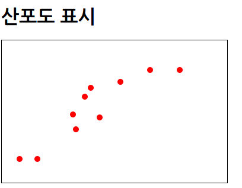
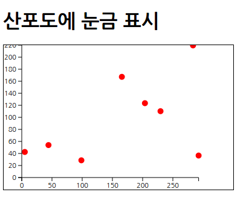
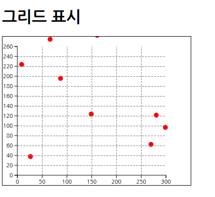
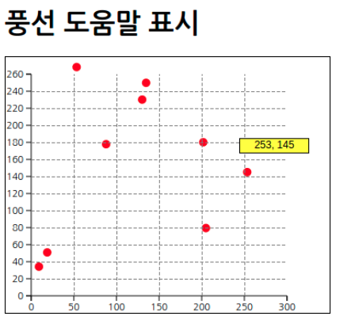
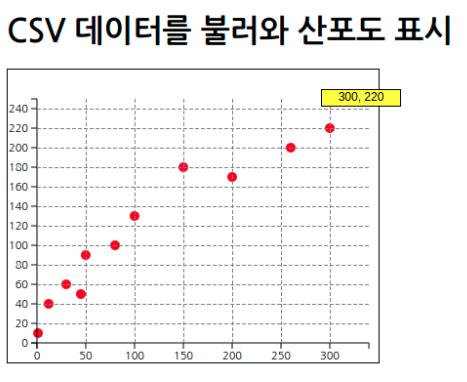
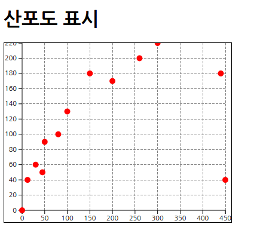
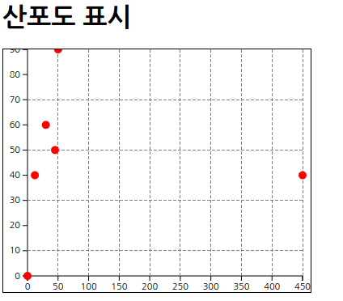
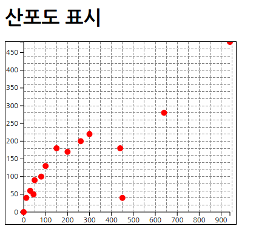
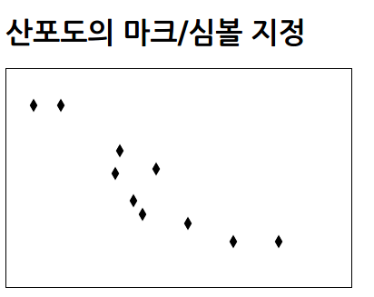

## 산포도

[toc]

### 산포도 만들기

* D3.js 에는 산포도를 표시하기 위한 레이아웃 기능이 없다.
* 사용할 데이터셋
	* ```java
	var dataSet = [
		[30, 40], [120, 115], [125, 90], [150, 160], [300, 190],
		[60, 40], [140, 145], [165, 110], [200, 170], [250, 190]
	];
	```

* 산포도 그리기
	* ```xml
	<!DOCTYPE html>
    <html>
        <head>
            <meta charset="utf-8">
            <title>Sample</title>
            <script src="http://d3js.org/d3.v3.min.js" charset="utf-8"></script>
            <style>
                svg { width: 380px; height: 240px; border: 1px solid black; }
                .mark { fill: red; stroke: none; }
            </style>
        </head>
        <body>
            <h1>산포도 표시</h1>
            <svg id="myGraph"></svg>
            <script src="js/sample.js"></script>
        </body>
    </html>
	```
    * ```javascript
    var svgWidth = 320;	// SVG 요소의 넓이
    var svgHeight = 240;	// SVG 요소의 높이
    // 데이터셋
    var dataSet = [
            [30, 40], [120, 115], [125, 90], [150, 160], [300, 190],
            [60, 40], [140, 145], [165, 110], [200, 170], [250, 190]
        ];
    // 산포도 그리기
    var circleElements = d3.select("#myGraph")
      .selectAll("circle")
      .data(dataSet)
      .enter()
      .append("circle")	// 데이터의 개수만큼 circle 요소가 추가됨
      .attr("class", "mark")	// CSS 클래스 지정
      .attr("cx", function(d, i){
            return d[0];	// 최초 요소를 X 좌표로 함
        })
      .attr("cy", function(d, i){
            return svgHeight-d[1];	// 2번째의 요소를 Y 좌표로 함
        })
      .attr("r", 5)	// 반지름을 지정
    ```
	* 

## 데이터를 애니메이션 효과와 함께 표시

* setInterval() : 일정 시간마다 반복 처리
	* ```javascript
	timerID = setInterval(일정 간격으로 호출할 처리, 호출 간격(밀리 초 단위))
	```
* d3.timer() : 일정 시간 후에 지정한 처리를 수행
* 산포도로 그린 점을 일정 시간 간격으로 움직이는 애니메이션
	* ```xml
	<!DOCTYPE html>
    <html>
        <head>
            <meta charset="utf-8">
            <title>Sample</title>
            <script src="http://d3js.org/d3.v3.min.js" charset="utf-8"></script>
            <style>
                svg { width: 380px; height: 240px; border: 1px solid black; }
                .mark { fill: red; stroke: none; }
            </style>
        </head>
        <body>
            <h1>산포도에 애니메이션 표시</h1>
            <svg id="myGraph"></svg>
            <script src="js/sample.js"></script>
        </body>
    </html>
	```
    * ```javascript
    var svgWidth = 320;	// SVG 요소의 넓이
    var svgHeight = 240;	// SVG 요소의 높이
    // 데이터셋
    var dataSet = [
            [30, 40], [120, 115], [125, 90], [150, 160], [300, 190],
            [60, 40], [140, 145], [165, 110], [200, 170], [250, 190]
        ];
    // 산포도 그리기
    var circleElements = d3.select("#myGraph")
      .selectAll("circle")
      .data(dataSet)
    circleElements
      .enter()
      .append("circle")	// 데이터의 개수만큼 circle 요소가 추가됨
      .attr("class", "mark")	// CSS 클래스 지정
      .attr("cx", function(d, i){
            return d[0];	// 최초 요소를 X 좌표로 함
        })
      .attr("cy", function(d, i){
            return svgHeight-d[1];	// 2번째의 요소를 Y 좌표로 함
        })
      .attr("r", 5)	// 반지름을 지정
    // 데이터셋 갱신
    function updateData(data){
        var result = data.map(function(d, i){	// 배열 요소 수만큼 반복
            var x = Math.random() * svgWidth;
            var y = Math.random() * svgHeight;
            return [x, y];
        })
        return result;
    }
    // 산포도 갱신
    function updateGraph(){
        circleElements
          .data(dataSet)
          .transition()	// cx, cy 애니메이션
          .attr("cx", function(d, i){
                return d[0];	// X 좌표를 설정
            })
          .attr("cy", function(d, i){
                return svgHeight-d[1];	// Y 좌표를 설정
            })
    }
    // 타이머를 사용하여 2초마다 단위를 변화시킴
    setInterval(function(){
        dataSet = updateData(dataSet);	// 데이터 갱신
        updateGraph();	// 그래프 갱신
    }, 2000);
    ```

* Math.random() :  0부터 1사이의 랜덤한 숫자를 발생
	* ```javascript
	수치 = Math.random()
	```

* map() : 배열 내의 모든 요소 각각에 대하여  제공된 함수(callback)를 호출하고, 그 결과를 모아서 새로운 배열을 반환

* setInterval()에 무명 함수를 지정하여 여러 개의 처리를 일정 시간 간격으로 호출
	* ```javascript
	setInterval(function(){
    	dataSet = updateData(dataSet);
        updateGraph();
    }, 2000);
	```


### 데이터에 따라 눈금을 조정


* 애니메이션 효과가 있는 산포도에 눈금 표시
	* ```xml
	<!DOCTYPE html>
    <html>
        <head>
            <meta charset="utf-8">
            <title>Sample</title>
            <script src="http://d3js.org/d3.v3.min.js" charset="utf-8"></script>
            <style>
                svg { width: 380px; height: 240px; border: 1px solid black; }
                .mark { fill: red; stroke: none; }
                .axis text {
                    font-family: sans-serif;
                    font-size: 11px;
                }
                .axis path,
                .axis line {
                    fill: none;
                    stroke: black;
                }
            </style>
        </head>
        <body>
            <h1>산포도에 눈금 표시</h1>
            <svg id="myGraph"></svg>
            <script src="js/sample.js"></script>
        </body>
    </html>
	```
    * ```javascript
    var svgWidth = 320;	// SVG 요소의 넓이
    var svgHeight = 240;	// SVG 요소의 높이
    var offsetX = 30;	// X 좌표의 오프셋
    var offsetY = 20;	// Y 좌표의 오프셋
    // 데이터셋
    var dataSet = [
            [30, 40], [120, 115], [125, 90], [150, 160], [300, 170],
            [60, 40], [140, 145], [165, 110], [200, 170], [250, 160]
        ];
    // 산포도 그리기
    var circleElements = d3.select("#myGraph")
      .selectAll("circle")	// circle 요소 추가
      .data(dataSet)	// 데이터셋을 요소에 설정
    circleElements
      .enter()
      .append("circle")	// 데이터의 개수만큼 circle 요소가 추가됨
      .attr("class", "mark")	// CSS 클래스 지정
      .attr("cx", function(d, i){
            return d[0] + offsetX;	// 최초 요소를 X 좌표로 함
        })
      .attr("cy", function(d, i){
            return svgHeight-d[1] - offsetY;	// 2번째의 요소를 Y 좌표로 함
        })
      .attr("r", 5)	// 반지름을 지정
    // 데이터셋 갱신
    function updateData(data){
        var result = data.map(function(d, i){	// 배열 요소 수만큼 반복
            var x = Math.random() * svgWidth;	// 난수 생성
            var y = Math.random() * svgHeight;
            return [x, y];	// 좌표값을 배열로 반환
        })
        return result;
    }
    // 산포도 갱신
    function updateGraph(){
        circleElements
          .data(dataSet)
          .transition()	// cx, cy 애니메이션
          .attr("cx", function(d, i){
                return d[0] + offsetX;	// X 좌표를 설정
            })
          .attr("cy", function(d, i){
                return svgHeight-d[1] - offsetY;	// Y 좌표를 설정
            })
    }
    // 눈금 표시
    function drawScale(){
        d3.select("#myGraph").selectAll("g").remove(); //눈금 요소 삭제 ● 수정
        var maxX = d3.max(dataSet, function(d, i){
            return d[0];	// X 좌표값
        });
        var maxY = d3.max(dataSet, function(d, i){
            return d[1];	// Y 좌표값
        });
        // 세로 눈금을 표시하고자 D3 스케일을 설정
        var yScale = d3.scale.linear()  // 스케일 설정
          .domain([0, maxY])   // 원래 데이터 범위
          .range([maxY, 0]) // 실제 표시 크기
        // 눈금 표시
        d3.select("#myGraph")	// SVG 요소를 지정
          .append("g")	// g 요소 추가. 이것이 눈금을 표시하는 요소가 됨
          .attr("class", "axis")	// CSS 클래스 지정
          .attr("transform", "translate("+offsetX+", "+(svgHeight-maxY-offsetY)+")")
          .call(
                d3.svg.axis()
              .scale(yScale)  //스케일 적용
              .orient("left") //눈금 표시 위치를 왼쪽으로 지정
            )
        // 가로 눈금을 표시하고자 D3 스케일 설정
        var xScale = d3.scale.linear()  // 스케일 설정
          .domain([0, maxX])   // 원래 데이터 범위
          .range([0, maxX]) // 실제 표시 크기
        // 눈금 표시
        d3.select("#myGraph")	// SVG 요소를 지정
              .append("g")	// g 요소 추가. 이것이 눈금을 표시하는 요소가 됨
              .attr("class", "axis")	// CSS 클래스 지정
              .attr("transform", "translate("+offsetX+", "+(svgHeight-offsetY)+")")
              .call(
                    d3.svg.axis()
                  .scale(xScale)  //스케일 적용
                  .orient("bottom") //눈금 표시 위치를 왼쪽으로 지정
                )
    }
    // 눈금 표시
    drawScale();
    // 타이머를 사용하여 2초마다 단위를 변화시킴
    setInterval(function(){
        dataSet = updateData(dataSet);	// 데이터 갱신
        drawScale(); // 눈금 그리기 ● 수정
        updateGraph();	// 그래프 갱신
    }, 2000);
    ```
    * 

* 이번 데이터셋으로부터 X 좌표의 최댓값을 구함
	*  d3.max() : 데이터의 최댓값을 구함
	* ```javascript
	var maxX = d3.max(dataSet, function(d, i) {
    	return d[0];
    });
	```

* 이번 데이터셋으로부터 Y 좌표의 최댓값을 구함
	* ```javascript
	var maxY = d3.max(dataSet, function(d, i){
    	return d[1];
    });
	```

* 데이터셋으로부터 구한 최댓값을 눈금의 최댓값으로 지정(가로 방향)
	* ```javascript
	var xSacle = d3.scale.linear()
    				.domain([0, maxX])
                    .range([0, maxX])
	```

### 그리드 표시

* d3.range() : 지정한 범위의 값을 자동으로 생성
	* ```javascript
	배열 = d3.range([시작 값,] 종료 값[, 간격])
	```

* 세로 방향의 그리드를 50 간격으로 생성
	* ```javascript
	var rangeX = d3.range(50, maxX, 50);
	```

* 가로 방향의 그리드를 20 간격으로 생성
	* ```javascript
	var rangeY = d3.range(20, maxY, 20);
	```

* 애니메이션 효과와 함께 산포도에 그리드를 표시
	* ```xml
	<!DOCTYPE html>
    <html>
        <head>
            <meta charset="utf-8">
            <title>Sample</title>
            <script src="http://d3js.org/d3.v3.min.js" charset="utf-8"></script>
            <style>
                svg { width: 380px; height: 300px; border: 1px solid black; }
                .mark { fill: red; stroke: none; }
                .axis text {
                    font-family: sans-serif;
                    font-size: 11px;
                }
                .axis path,
                .axis line {
                    fill: none;
                    stroke: black;
                }
                .grid {
                    stroke : gray;
                    stroke-dasharray : 4, 2;
                    shape-rendering : crispEdges;
                }
            </style>
        </head>
        <body>
            <h1>그리드 표시</h1>
            <svg id="myGraph"></svg>
            <script src="js/sample.js"></script>
        </body>
    </html>
	```
	* ```javascript
	var svgWidth = 320;	// SVG 요소의 넓이
    var svgHeight = 300;	// SVG 요소의 높이
    var offsetX = 30;	// X 좌표의 오프셋
    var offsetY = 20;	// Y 좌표의 오프셋
    var svg = d3.select("#myGraph");	// SVG 요소를 지정
    // 데이터셋
    var dataSet = [
            [30, 40], [120, 115], [125, 90], [150, 160], [300, 170],
            [60, 40], [140, 145], [165, 110], [200, 260], [280, 160]
        ];
    // 산포도 그리기
    var circleElements = svg
      .selectAll("circle")	// circle 요소 추가
      .data(dataSet)	// 데이터셋을 요소에 설정
    circleElements
      .enter()
      .append("circle")	// 데이터의 개수만큼 circle 요소가 추가됨
      .attr("class", "mark")	// CSS 클래스 지정
      .attr("cx", function(d, i){
            return d[0] + offsetX;	// 최초 요소를 X 좌표로 함
        })
      .attr("cy", function(d, i){
            return svgHeight-d[1] - offsetY;	// 2번째의 요소를 Y 좌표로 함
        })
      .attr("r", 5)	// 반지름을 지정
    // 데이터셋 갱신
    function updateData(data){
        var result = data.map(function(d, i){	// 배열 요소 수만큼 반복
            var x = Math.random() * svgWidth;	// 난수 생성
            var y = Math.random() * svgHeight;
            return [x, y];	// 좌표값을 배열로 반환
        })
        return result;
    }
    // 산포도 갱신
    function updateGraph(){
        circleElements
          .data(dataSet)
          .transition()	// cx, cy 애니메이션
          .attr("cx", function(d, i){
                return d[0] + offsetX;	// X 좌표를 설정
            })
          .attr("cy", function(d, i){
                return svgHeight-d[1] - offsetY;	// Y 좌표를 설정
            })
    }
    // 눈금 표시
    function drawScale(){
        var maxX = d3.max(dataSet, function(d, i){
            return d[0];	// X 좌표값
        });
        var maxY = d3.max(dataSet, function(d, i){
            return d[1];	// Y 좌표값
        });
        // 세로 눈금을 표시하고자 D3 스케일을 설정
        var yScale = d3.scale.linear()  // 스케일 설정
          .domain([0, maxY])   // 원래 크기
          .range([maxY, 0]) // 실제 표시 크기
        // 눈금 표시
        svg.append("g")	// g 요소 추가. 이것이 눈금을 표시하는 요소가 됨
          .attr("class", "axis")	// CSS 클래스 지정
          .attr("transform", "translate("+offsetX+", "+(svgHeight-maxY-offsetY)+")")
          .call(
                d3.svg.axis()
              .scale(yScale)  //스케일 적용
              .orient("left") //눈금 표시 위치를 왼쪽으로 지정
            )
        // 가로 눈금을 표시하고자 D3 스케일 설정
        var xScale = d3.scale.linear()  // 스케일 설정
          .domain([0, maxX])   // 원래 크기
          .range([0, maxX]) // 실제 표시 크기
        // 눈금 표시
        svg.append("g")	// g 요소 추가. 이것이 눈금을 표시하는 요소가 됨
              .attr("class", "axis")	// CSS 클래스 지정
              .attr("transform", "translate("+offsetX+", "+(svgHeight-offsetY)+")")
              .call(
                    d3.svg.axis()
                  .scale(xScale)  //스케일 적용
                  .orient("bottom") //눈금 표시 위치를 왼쪽으로 지정
                )
        // 그리드 표시
        var grid = svg.append("g")
        // 가로 방향과 세로 방향의 그리드 간격 자동 생성
        var rangeX = d3.range(50, maxX, 50);
        var rangeY = d3.range(20, maxY, 20);
        // 세로 방향 그리드 생성
        grid.selectAll("line.y")	// line요소 선택
          .data(rangeY)	// 세로 방향의 범위를 데이터셋으로 설정
          .enter()
          .append("line")	// line 요소 추가
          .attr("class", "grid")	// CSS 클래스의 grid를 지정
            // (x1,y1)-(x2,y2)의 좌표값을 설정
          .attr("x1", offsetX)
          .attr("y1", function(d, i){
                return svgHeight - d - offsetY;
            })
          .attr("x2", maxX + offsetX)
          .attr("y2", function(d, i){
                return svgHeight - d - offsetY;
            })
        // 가로 방향의 그리드 생성
        grid.selectAll("line.x")	// line요소의 x 클래스를 선택
          .data(rangeX)	// 가로 방향의 범위를 데이터셋으로 설정
          .enter()
          .append("line")	// line 요소 추가
          .attr("class", "grid")	// CSS 클래스의 grid를 지정
            // (x1,y1)-(x2,y2)의 좌표값을 설정
          .attr("x1", function(d, i){
                return d + offsetX;
            })
          .attr("y1", svgHeight - offsetY)
          .attr("x2", function(d, i){
                return d + offsetX;
            })
          .attr("y2", svgHeight -offsetY - maxY)
    }
    // 눈금과 그리드를 표시
    drawScale();
    // 타이머를 사용하여 2초마다 단위를 변화시킴
    setInterval(function(){
        dataSet = updateData(dataSet);	// 데이터 갱신
        updateGraph();	// 그래프 갱신
    }, 2000);
	```
    * 

### 풍선 도움말 표시

* 풍선 도움말용 CSS
	* ```css
	.tip {
				position: absolute;
				top : 0px;
				left : 0px;
				z-index: 9999;
				visibility : hidden;
				border: 1px solid black;
				background-color: yellow;
				width: 80px;
				height: 16px;
				overflow : hidden;
				text-align : center;
				font-size: 9pt;
				font-family : Tahoma, Optima, Helvetica;
				color: black;
        }
	```

* 풍선 도움말용 div 요소를 생성하고 class 속성에 CSS 클래스 이름을 할당
	* ```javascript
	var tooltip = d3.select("booy")
    				.append("div")
                    .attr("class", "tip")
	```

* 산포도의 원에 마우스를 올렸을 때 풍선 도움말을 표시
	* ```javascript
	circleElements
    	.on("mouseover", function(d){
        	풍선 도움말 표시 처리
        })
	```

* 이번에는 원 데이터를 parseInt() 함수로 정수로 만들고 좌료값으로 이용
	* ```javascript
	var x = parseInt(d[0]);
    var y = parseInt(d[1]);
	```

* 원 데이터는 datum() 메서드로 읽어옴
	* ```javascript
	var data = d3.select(this).datum();
    var dx = parseInt(data[0]);
    var dy = parseInt(data[1]);
	```

* 풍선 도움말의 내용 바꾸기
	* ````javascript
	tooltip
    	.style("left", offsetX + x + "px")
        .style("top", svgHeight + offsetY - y + "px")
        .style("visibility", "visible")
        .text(dx + ", " + dy)
    ````

* 마우스 커서를 내렸을 때 풍선 도움말을 숨김
	* ```javascript
	.on("mouseout", function() {
    	tooltip.style("visibilty, "hidden")
    })
	```

* 그리드에 그린 원에 마우스를 올리면 풍선 도움말을 표시
	* ```xml
	<!DOCTYPE html>
    <html>
        <head>
            <meta charset="utf-8">
            <title>Sample</title>
            <script src="http://d3js.org/d3.v3.min.js" charset="utf-8"></script>
            <style>
                svg { width: 380px; height: 300px; border: 1px solid black; }
                .mark { fill: red; stroke: none; }
                .axis text {
                    font-family: sans-serif;
                    font-size: 11px;
                }
                .axis path,
                .axis line {
                    fill: none;
                    stroke: black;
                }
                .grid {
                    stroke : gray;
                    stroke-dasharray : 4, 2;
                    shape-rendering : crispEdges;
                }
                .tip {
                    position: absolute;
                    top : 0px;
                    left : 0px;
                    z-index: 9999;
                    visibility : hidden;
                    border: 1px solid black;
                    background-color: yellow;
                    width: 80px;
                    height: 16px;
                    overflow : hidden;
                    text-align : center;
                    font-size: 9pt;
                    font-family : Tahoma, Optima, Helvetica;
                    color: black;
                }
            </style>
        </head>
        <body>
            <h1>풍선 도움말 표시</h1>
            <svg id="myGraph"></svg>
            <script src="js/sample.js"></script>
        </body>
    </html>
	```
    * ```javascript
    var svgWidth = 320;	// SVG 요소의 넓이
    var svgHeight = 300;	// SVG 요소의 높이
    var offsetX = 30;	// X 좌표의 오프셋
    var offsetY = 20;	// Y 좌표의 오프셋
    var svg = d3.select("#myGraph");	// SVG 요소를 지정
    // 데이터셋
    var dataSet = [
            [30, 40], [120, 115], [125, 90], [150, 160], [300, 170],
            [60, 40], [140, 145], [165, 110], [200, 260], [280, 160]
        ];
    // 산포도 그리기
    var circleElements = svg
      .selectAll("circle")	// circle 요소 추가
      .data(dataSet)	// 데이터셋을 요소에 설정
    circleElements
      .enter()
      .append("circle")	// 데이터의 개수만큼 circle 요소가 추가됨
      .attr("class", "mark")	// CSS 클래스 지정
      .attr("cx", function(d, i){
            return d[0] + offsetX;	// 최초 요소를 X 좌표로 함
        })
      .attr("cy", function(d, i){
            return svgHeight-d[1] - offsetY;	// 2번째의 요소를 Y 좌표로 함
        })
      .attr("r", 5)	// 반지름을 지정
    // 데이터셋 갱신
    function updateData(data){
        var result = data.map(function(d, i){	// 배열 요소 수만큼 반복
            var x = Math.random() * svgWidth;	// 난수 생성
            var y = Math.random() * svgHeight;
            return [x, y];	// 좌표값을 배열로 반환
        })
        return result;
    }
    // 산포도 갱신
    function updateGraph(){
        circleElements
          .data(dataSet)
          .transition()	// cx, cy 애니메이션
          .attr("cx", function(d, i){
                return d[0] + offsetX;	// X 좌표를 설정
            })
          .attr("cy", function(d, i){
                return svgHeight-d[1] - offsetY;	// Y 좌표를 설정
            })
    }
    // 눈금 표시
    function drawScale(){
        var maxX = d3.max(dataSet, function(d, i){
            return d[0];	// X 좌표값
        });
        var maxY = d3.max(dataSet, function(d, i){
            return d[1];	// Y 좌표값
        });
        // 세로 눈금을 표시하고자 D3 스케일을 설정
        var yScale = d3.scale.linear()  // 스케일 설정
          .domain([0, maxY])   // 원래 크기
          .range([maxY, 0]) // 실제 표시 크기
        // 눈금 표시
        svg.append("g")	// g 요소 추가. 이것이 눈금을 표시하는 요소가 됨
          .attr("class", "axis")	// CSS 클래스 지정
          .attr("transform", "translate("+offsetX+", "+(svgHeight-maxY-offsetY)+")")
          .call(
                d3.svg.axis()
              .scale(yScale)  //스케일 적용
              .orient("left") //눈금 표시 위치를 왼쪽으로 지정
            )
        // 가로 눈금을 표시하고자 D3 스케일 설정
        var xScale = d3.scale.linear()  // 스케일 설정
          .domain([0, maxX])   // 원래 크기
          .range([0, maxX]) // 실제 표시 크기
        // 눈금 표시
        svg.append("g")	// g 요소 추가. 이것이 눈금을 표시하는 요소가 됨
              .attr("class", "axis")	// CSS 클래스 지정
              .attr("transform", "translate("+offsetX+", "+(svgHeight-offsetY)+")")
              .call(
                    d3.svg.axis()
                  .scale(xScale)  //스케일 적용
                  .orient("bottom") //눈금 표시 위치를 왼쪽으로 지정
                )
        // 그리드 표시
        var grid = svg.append("g");
        // 가로 방향과 세로 방향의 그리드 간격 자동 생성
        var rangeX = d3.range(50, maxX, 50);
        var rangeY = d3.range(20, maxY, 20);
        // 세로 방향 그리드 생성
        grid.selectAll("line.y")	// line요소의 y 클래스를 선택
          .data(rangeY)	// 세로 방향의 범위를 데이터셋으로 설정
          .enter()
          .append("line")	// line 요소 추가
          .attr("class", "grid")	// CSS 클래스의 grid를 지정
            // (x1,y1)-(x2,y2)의 좌표값을 설정
          .attr("x1", offsetX)
          .attr("y1", function(d, i){
                return svgHeight - d - offsetY;
            })
          .attr("x2", maxX + offsetX)
          .attr("y2", function(d, i){
                return svgHeight - d - offsetY;
            })
        // 가로 방향의 그리드 생성
        grid.selectAll("line.x")	// line요소의 x 클래스를 선택
          .data(rangeX)	// 가로 방향의 범위를 데이터셋으로 설정
          .enter()
          .append("line")	// line 요소 추가
          .attr("class", "grid")	// CSS 클래스의 grid를 지정
            // (x1,y1)-(x2,y2)의 좌표값을 설정
          .attr("x1", function(d, i){
                return d + offsetX;
            })
          .attr("y1", svgHeight - offsetY)
          .attr("x2", function(d, i){
                return d + offsetX;
            })
          .attr("y2", svgHeight -offsetY - maxY)
    }
    // 풍선 도움말을 생성
    var tooltip = d3.select("body")
      .append("div")
      .attr("class", "tip")
    // 풍선 도움말을 표시
    circleElements
      .on("mouseover", function(d){
            var x = parseInt(d[0]);	// 원의 X 좌표값
            var y = parseInt(d[1]);	// 원의 Y 좌표값
            var data = d3.select(this).datum();	// 요소의 데이터를 읽어옴
            var dx = parseInt(data[0]);	// 원의 X 좌표. 변수 x와 같은 값
            var dy = parseInt(data[1]);	// 원의 Y 좌표. 변수 y와 같은 값
            tooltip
              .style("left", offsetX + x+"px")
              .style("top", svgHeight + offsetY - y+"px")
              .style("visibility", "visible")	// 풍선 도움말을 표시
              .text(dx+", "+dy)
        })
      .on("mouseout", function(){
            tooltip.style("visibility", "hidden")	// 풍선 도움말을 숨김
        })
    // 눈금과 그리드를 표시
    drawScale();
    // 타이머를 사용하여 4초마다 위치를 바꿈　●변경
    setInterval(function(){
        dataSet = updateData(dataSet);	// 데이터 갱신
        updateGraph();	// 그래프 갱신
    }, 4000);
    ```
	* 

## CSV 파일을 이용한 산포도 표시

* 맨처음 값이 '프로그램의 행수', 다음이 '버그의 수', 마지막이 '해결에 걸린 시간'을 나타내는 csv 데이터
	* ```
	total,bug,time
    110,10,2
    1200,40,5
    3000,60,16
    4500,50,22
    5000,90,60
    8000,100,75
    10000,130,100
    15000,180,160
    20000,170,190
    26000,200,210
    30000,220,210
    34000,250,210
	```

* CSV 데이터를 숫자로 변환한 다음 배열에 입력
	* ```javascript
	var dataSet = [];
    data.forEach(function(d, i)) {
    	dataSet.push([d.total/100, d.bug*1, d.time*1])
    }
	```

* CSV 파일 데이터를 기준으로 산포도 그리기
	* ```xml
	<!DOCTYPE html>
    <html>
        <head>
            <meta charset="utf-8">
            <title>Sample</title>
            <script src="http://d3js.org/d3.v3.min.js" charset="utf-8"></script>
            <style>
                svg { width: 380px; height: 300px; border: 1px solid black; }
                .mark { fill: red; stroke: none; }
                .axis text {
                    font-family: sans-serif;
                    font-size: 11px;
                }
                .axis path,
                .axis line {
                    fill: none;
                    stroke: black;
                }
                .grid {
                    stroke : gray;
                    stroke-dasharray : 4, 2;
                    shape-rendering : crispEdges;
                }
                .tip {
                    position: absolute;
                    top : 0px;
                    left : 0px;
                    z-index: 9999;
                    visibility : hidden;
                    border: 1px solid black;
                    background-color: yellow;
                    width: 80px;
                    height: 16px;
                    overflow : hidden;
                    text-align : center;
                    font-size: 9pt;
                    font-family : Tahoma, Optima, Helvetica;
                    color: black;
                }
            </style>
        </head>
        <body>
            <h1>CSV 데이터를 불러와 산포도 표시</h1>
            <svg id="myGraph"></svg>
            <script src="js/sample.js"></script>
        </body>
    </html>
	```
    * ```javascript
    // CSV 데이터를 불러옴
    d3.csv("mydata.csv", function(error, data){
        // SVG 요소의 넓이와 높이를 구함
        var svgEle = document.getElementById("myGraph");
        var svgWidth = window.getComputedStyle(svgEle, null).getPropertyValue("width");
        var svgHeight = window.getComputedStyle(svgEle, null).getPropertyValue("height");
        svgWidth = parseFloat(svgWidth);	// 값에는 단위가 있으므로 단위를 삭제
        svgHeight = parseFloat(svgHeight);	// 값에는 단위가 있으므로 단위를 삭제
        var offsetX = 30;	// X 좌표의 오프셋
        var offsetY = 20;	// Y 좌표의 오프셋
        var svg = d3.select("#myGraph");	// SVG 요소를 지정
        // 데이터를 불러와 설정함
        var dataSet = [ ];	// 데이터를 저장할 배열 변수
        data.forEach(function(d, i){	// 배열 데이터 읽어오기
            dataSet.push([d.total/100, d.bug*1, d.time*1]);	// *1로 숫자 변환
        });
        // 산포도 그리기
        var circleElements = svg
          .selectAll("circle")	// circle 요소 추가
          .data(dataSet)	// 데이터셋을 요소에 설정
        circleElements
          .enter()
          .append("circle")	// 데이터의 개수만큼 circle 요소가 추가됨
          .attr("class", "mark")	// CSS 클래스 지정
          .attr("cx", function(d, i){
                return d[0] + offsetX;	// 최초 요소를 X 좌표로 함
          })
          .attr("cy", function(d, i){
                return svgHeight-d[1] - offsetY;	// 2번째의 요소를 Y 좌표로 함
          })
          .attr("r", 5)	// 반지름을 지정
        // 눈금 표시
        function drawScale(){
            var maxX = d3.max(dataSet, function(d, i){
                return d[0];	// X 좌표값
            });
            var maxY = d3.max(dataSet, function(d, i){
                return d[1];	// Y 좌표값
            });
            // 세로 눈금을 표시하고자 D3 스케일을 설정
            var yScale = d3.scale.linear()  // 스케일 설정
              .domain([0, maxY])   // 원래 크기
              .range([maxY, 0]) // 실제 표시 크기
            // 눈금 표시
            svg.append("g")	// g 요소 추가. 이것이 눈금을 표시하는 요소가 됨
                  .attr("class", "axis")	// CSS 클래스 지정
                  .attr("transform", "translate("+offsetX+", "+(svgHeight-maxY-offsetY)+")")
                  .call(
                        d3.svg.axis()
                      .scale(yScale)  //스케일 적용
                      .orient("left") //눈금 표시 위치를 왼쪽으로 지정
                    )
            // 가로 눈금을 표시하고자 D3 스케일 설정
            var xScale = d3.scale.linear()  // 스케일 설정
              .domain([0, maxX])   // 원래 크기
              .range([0, maxX]) // 실제 표시 크기
            // 눈금 표시
            svg.append("g")	// g 요소 추가. 이것이 눈금을 표시하는 요소가 됨
              .attr("class", "axis")	// CSS 클래스 지정
              .attr("transform", "translate("+offsetX+", "+(svgHeight-offsetY)+")")
              .call(
                    d3.svg.axis()
                  .scale(xScale)  //스케일 적용
                  .orient("bottom") //눈금 표시 위치를 왼쪽으로 지정
                )
            // 그리드 표시
            var grid = svg.append("g");
            // 가로 방향과 세로 방향의 그리드 간격 자동 생성
            var rangeX = d3.range(50, maxX, 50);
            var rangeY = d3.range(20, maxY, 20);
            // 세로 방향 그리드 생성
            grid.selectAll("line.y")	// line요소의 y 클래스를 선택
              .data(rangeY)	// 세로 방향의 범위를 데이터셋으로 설정
              .enter()
              .append("line")	// line 요소 추가
              .attr("class", "grid")	// CSS 클래스의 grid를 지정
                // (x1,y1)-(x2,y2)의 좌표값을 설정
              .attr("x1", offsetX)
              .attr("y1", function(d, i){
                    return svgHeight - d - offsetY;
                })
              .attr("x2", maxX + offsetX)
              .attr("y2", function(d, i){
                    return svgHeight - d - offsetY;
                })
            // 가로 방향의 그리드 생성
            grid.selectAll("line.x")	// line요소의 x 클래스를 선택
              .data(rangeX)	// 가로 방향의 범위를 데이터셋으로 설정
              .enter()
              .append("line")	// line 요소 추가
              .attr("class", "grid")	// CSS 클래스의 grid를 지정
                // (x1,y1)-(x2,y2)의 좌표값을 설정
              .attr("x1", function(d, i){
                    return d + offsetX;
                })
              .attr("y1", svgHeight - offsetY)
              .attr("x2", function(d, i){
                    return d + offsetX;
                })
              .attr("y2", svgHeight -offsetY - maxY)
        }
        // 풍선 도움말을 생성
        var tooltip = d3.select("body")
          .append("div")
          .attr("class", "tip")
        // 풍선 도움말을 표시
        circleElements
          .on("mouseover", function(d){
                var x = parseInt(d[0]);	// 원의 X 좌표값
                var y = parseInt(d[1]);	// 원의 Y 좌표값
                var data = d3.select(this).datum();	// 요소의 데이터를 읽어옴
                var dx = parseInt(data[0]);	// 원의 X 좌표. 변수 x와 같은 값
                var dy = parseInt(data[1]);	// 원의 Y 좌표. 변수 y와 같은 값
                tooltip
                  .style("left", offsetX + x+"px")
                  .style("top", svgHeight + offsetY - y+"px")
                  .style("visibility", "visible")	// 풍선 도움말을 표시
                  .text(dx+", "+dy)
            })
          .on("mouseout", function(){
                tooltip.style("visibility", "hidden")	// 풍선 도움말을 숨김
            })
        // 눈금과 그리드를 표시
        drawScale();
    });
    ```
	* 

**화려한 애니메이션 효과 적용**

* '해결에 걸린 시간'을 읽어옴
	* ```javascript
	var data = d3.select(this).datum();
    var t = parseInt(data[2])
	```

* 공이 튀는 것과 같은 움직임로 산포도 데이터를 그림
	* ```xml
	<!DOCTYPE html>
    <html>
        <head>
            <meta charset="utf-8">
            <title>Sample</title>
            <script src="http://d3js.org/d3.v3.min.js" charset="utf-8"></script>
            <style>
                svg { width: 380px; height: 300px; border: 1px solid black; }
                .mark { fill: red; stroke: none; }
                .axis text {
                    font-family: sans-serif;
                    font-size: 11px;
                }
                .axis path,
                .axis line {
                    fill: none;
                    stroke: black;
                }
                .grid {
                    stroke : gray;
                    stroke-dasharray : 4, 2;
                    shape-rendering : crispEdges;
                }
                .tip {
                    position: absolute;
                    top : 0px;
                    left : 0px;
                    z-index: 9999;
                    visibility : hidden;
                    border: 1px solid black;
                    background-color: yellow;
                    width: 80px;
                    height: 16px;
                    overflow : hidden;
                    text-align : center;
                    font-size: 9pt;
                    font-family : Tahoma, Optima, Helvetica;
                    color: black;
                }
            </style>
        </head>
        <body>
            <h1>산포도 표시</h1>
            <svg id="myGraph"></svg>
            <script src="js/sample.js"></script>
        </body>
    </html>
	```
    * ```javascript
    // CSV 데이터를 불러옴
    d3.csv("mydata.csv", function(error, data){
        // SVG 요소의 넓이와 높이를 구함
        var svgEle = document.getElementById("myGraph");
        var svgWidth = window.getComputedStyle(svgEle, null).getPropertyValue("width");
        var svgHeight = window.getComputedStyle(svgEle, null).getPropertyValue("height");
        svgWidth = parseFloat(svgWidth);	// 값에는 단위가 있으므로 단위를 삭제
        svgHeight = parseFloat(svgHeight);	// 값에는 단위가 있으므로 단위를 삭제
        var offsetX = 30;	// X 좌표의 오프셋
        var offsetY = 20;	// Y 좌표의 오프셋
        var svg = d3.select("#myGraph");	// SVG 요소를 지정
        // 데이터를 불러와 설정함
        var dataSet = [ ];	// 데이터를 저장할 배열 변수
        data.forEach(function(d, i){	// 배열 데이터 읽어오기
            dataSet.push([d.total/100, d.bug*1, d.time*1]);	// *1로 숫자 변환
        });
        // 산포도 그리기
        var circleElements = svg
          .selectAll("circle")	// circle 요소 추가
          .data(dataSet)	// 데이터셋을 요소에 설정
        circleElements
          .enter()
          .append("circle")	// 데이터의 개수만큼 circle 요소가 추가됨
          .attr("class", "mark")	// CSS 클래스 지정
          .attr("cx", svgWidth / 2 + offsetX)	// X 좌표의 눈금 가운데로 함　●
          .attr("cy", svgHeight/2 - offsetY)	// Y 좌표의 눈금 가운데로 함　●
          .attr("r", 100)	// 반지름을 100으로 함　●
          .attr("opacity", 0)	// 투명하게 함　●
          .transition()	// X, Y 좌표까지 애니메이션　●
          .duration(2000)	// 2초 동안 애니메이션　●
          .ease("bounce")	// 통통튀는 움직임으로 함　●
          .attr("cx", function(d, i){
                return d[0] + offsetX;	// 최초 요소를 X 좌표로 함
            })
          .attr("cy", function(d, i){
                return svgHeight-d[1] - offsetY;	// 2번째의 요소를 Y 좌표로 함
            })
          .attr("r", 5)	// 반지름을 지정
          .attr("opacity", 1.0)	// 불투명하게 함　●
        // 눈금 표시
        function drawScale(){
            var maxX = d3.max(dataSet, function(d, i){
                return d[0];	// X 좌표값
            });
            var maxY = d3.max(dataSet, function(d, i){
                return d[1];	// Y 좌표값
            });
            // 세로 눈금을 표시하고자 D3 스케일을 설정
            var yScale = d3.scale.linear()  // 스케일 설정
              .domain([0, maxY])   // 원래 크기
              .range([maxY, 0]) // 실제 표시 크기
            // 눈금 표시
            svg.append("g")	// g 요소 추가. 이것이 눈금을 표시하는 요소가 됨
                  .attr("class", "axis")	// CSS 클래스 지정
                  .attr("transform", "translate("+offsetX+", "+(svgHeight-maxY-offsetY)+")")
                  .call(
                        d3.svg.axis()
                      .scale(yScale)  //스케일 적용
                      .orient("left") //눈금 표시 위치를 왼쪽으로 지정
                    )
            // 가로 눈금을 표시하고자 D3 스케일 설정
            var xScale = d3.scale.linear()  // 스케일 설정
              .domain([0, maxX])   // 원래 크기
              .range([0, maxX]) // 실제 표시 크기
            // 눈금 표시
            svg.append("g")	// g 요소 추가. 이것이 눈금을 표시하는 요소가 됨
              .attr("class", "axis")	// CSS 클래스 지정
              .attr("transform", "translate("+offsetX+", "+(svgHeight-offsetY)+")")
              .call(
                    d3.svg.axis()
                  .scale(xScale)  //스케일 적용
                  .orient("bottom") //눈금 표시 위치를 왼쪽으로 지정
                )
            // 그리드 표시
            var grid = svg.append("g");
            // 가로 방향과 세로 방향의 그리드 간격 자동 생성
            var rangeX = d3.range(50, maxX, 50);
            var rangeY = d3.range(20, maxY, 20);
            // 세로 방향 그리드 생성
            grid.selectAll("line.y")	// line요소의 y 클래스를 선택
              .data(rangeY)	// 세로 방향의 범위를 데이터셋으로 설정
              .enter()
              .append("line")	// line 요소 추가
              .attr("class", "grid")	// CSS 클래스의 grid를 지정
                // (x1,y1)-(x2,y2)의 좌표값을 설정
              .attr("x1", offsetX)
              .attr("y1", function(d, i){
                    return svgHeight - d - offsetY;
                })
              .attr("x2", maxX + offsetX)
              .attr("y2", function(d, i){
                    return svgHeight - d - offsetY;
                })
            // 가로 방향의 그리드 생성
            grid.selectAll("line.x")	// line요소의 x 클래스를 선택
              .data(rangeX)	// 가로 방향의 범위를 데이터셋으로 설정
              .enter()
              .append("line")	// line 요소 추가
              .attr("class", "grid")	// CSS 클래스의 grid를 지정
                // (x1,y1)-(x2,y2)의 좌표값을 설정
              .attr("x1", function(d, i){
                    return d + offsetX;
                })
              .attr("y1", svgHeight - offsetY)
              .attr("x2", function(d, i){
                    return d + offsetX;
                })
              .attr("y2", svgHeight -offsetY - maxY)
        }
        // 풍선 도움말을 생성
        var tooltip = d3.select("body")
          .append("div")
          .attr("class", "tip")
        // 풍선 도움말에 시간을 표시　●
        circleElements
          .on("mouseover", function(d){
                var x = parseInt(d[0]);	// 원의 X 좌표값
                var y = parseInt(d[1]);	// 원의 Y 좌표값
                var data = d3.select(this).datum();	// 요소의 데이터를 읽어옴
                var t = parseInt(data[2]);	// 해결에 필요한 시간　●
                tooltip
                  .style("left", offsetX + x+"px")
                  .style("top", svgHeight + offsetY - y+"px")
                  .style("visibility", "visible")	// 풍선 도움말을 표시
                  .text(t+"시간")	// ●
            })
          .on("mouseout", function(){
                tooltip.style("visibility", "hidden")	// 풍선 도움말을 숨김
            })
        // 눈금과 그리드를 표시
        drawScale();
    });
    ```

### 데이터 범위에 따라 그래프 조정

* 표시할 스케일/눈금의 범위 조정
 	* ```javascript
 	xSacle = d3.scale.linear()
 		.domain([0, maxX])
 		.range([0, xAxisWidth])
	```

* 스케일에 맞추어 그릴 원의 좌표를 구함
* xScale(값) : 값을 스케일에 맞추어 계산한 결과 반환
	* ```javascript
	.attr("cx", function(d, i){
    	return xScale(d[0]) + offsetX;
    })
    .attr("cy", function(d, i){
    	return yScale(d[1]);
    })
	```

* 스케일에 맞추어 그리드의 좌표 값을 구함
	* ```javascript
	.attr("x1", offsetX)
    .attr("y1", function(d, i){
    	return svgHeight - yScale(d) - offsetY;
    })
    .attr("x2", xAxisWidth + offsetX)
    .attr("y2", function(d, i){
    	return svgHeight - yScale(d) - offsetY
    })
	```

* 스케일에 맞추어 풍선 도움말의 좌표값을 구함
	* ```javascript
	var x = parseInt(xScale(d[0]));
    var y = parseInt(yScale(d[1]));
	```

* 풍선 도움말에 표시할 '해결에 걸린 시간'을 읽어옴
	* ```javascript
	var t = parseInt(d[2]);
    ```

* 데이터의 범위에 따라 자동으로 그리드나 눈금이 변하는 산포도
	* ```xml
	<!DOCTYPE html>
    <html>
        <head>
            <meta charset="utf-8">
            <title>Sample</title>
            <script src="http://d3js.org/d3.v3.min.js" charset="utf-8"></script>
            <style>
                svg { width: 380px; height: 300px; border: 1px solid black; }
                .mark { fill: red; stroke: none; }
                .axis text {
                    font-family: sans-serif;
                    font-size: 11px;
                }
                .axis path,
                .axis line {
                    fill: none;
                    stroke: black;
                }
                .grid {
                    stroke : gray;
                    stroke-dasharray : 4, 2;
                    shape-rendering : crispEdges;
                }
                .tip {
                    position: absolute;
                    top : 0px;
                    left : 0px;
                    z-index: 9999;
                    visibility : hidden;
                    border: 1px solid black;
                    background-color: yellow;
                    width: 80px;
                    height: 16px;
                    overflow : hidden;
                    text-align : center;
                    font-size: 9pt;
                    font-family : Tahoma, Optima, Helvetica;
                    color: black;
                }
            </style>
        </head>
        <body>
            <h1>산포도 표시</h1>
            <svg id="myGraph"></svg>
            <script src="js/sample.js"></script>
        </body>
    </html>
	```
    * ```javascript
    // CSV 데이터를 불러옴
    d3.csv("mydata.csv", function(error, data){
        // SVG 요소의 넓이와 높이를 구함
        var svgEle = document.getElementById("myGraph");
        var svgWidth = window.getComputedStyle(svgEle, null).getPropertyValue("width");
        var svgHeight = window.getComputedStyle(svgEle, null).getPropertyValue("height");
        svgWidth = parseFloat(svgWidth);	// 값에는 단위가 있으므로 단위를 삭제
        svgHeight = parseFloat(svgHeight);	// 값에는 단위가 있으므로 단위를 삭제
        var offsetX = 30;	// X 좌표의 오프셋　●
        var offsetY = 20;	// Y 좌표의 오프셋　●
        var xScale;	// 가로축의 스케일●
        var yScale;	// 세로축의 스케일　●
        var yAxisHeight = svgHeight - 20;	// 가로축의 넓이　●
        var xAxisWidth = svgWidth - 40;	// 세로축의 넓이　●
        var svg = d3.select("#myGraph");	// SVG 요소를 지정
        // 데이터를 불러와 설정함
        var dataSet = [ ];	// 데이터를 저장할 배열 변수
        data.forEach(function(d, i){	// 배열 데이터 읽어오기
            dataSet.push([d.total/100, d.bug*1, d.time*1]);	// *1로 숫자 변환
        });
        // 눈금과 그리드를 먼저 표시　●
        drawScale();
        // 산포도 그리기
        var circleElements = svg
          .selectAll("circle")	// circle 요소 추가
          .data(dataSet)	// 데이터셋을 요소에 설정
        circleElements
          .enter()
          .append("circle")	// 데이터의 개수만큼 circle 요소가 추가됨
          .attr("class", "mark")	// CSS 클래스 지정
          .attr("cx", svgWidth / 2 + offsetX)	// X 좌표의 눈금 가운데로 함
          .attr("cy", svgHeight/2 - offsetY)	// Y 좌표의 눈금 가운데로 함
          .attr("r", 100)	// 반지름을 100으로 함
          .attr("opacity", 0)	// 투명하게 함
          .transition()	// X,Y 좌표까지 애니메이션
          .duration(2000)	// 2초 동안 애니메이션
          .ease("bounce")	// 통통튀는 움직임으로 함
          .attr("cx", function(d, i){
                return xScale(d[0]) + offsetX;	// 최초 요소를 X 좌표로 함　●
            })
          .attr("cy", function(d, i){
                return yScale(d[1]);	// 2번째의 요소를 Y 좌표로 함　●
            })
          .attr("r", 5)	// 반지름을 지정
          .attr("opacity", 1.0)	// 불투명하게 함
        // 눈금 표시
        function drawScale(){
            var maxX = d3.max(dataSet, function(d, i){
                return d[0];	// X 좌표값
            });
            var maxY = d3.max(dataSet, function(d, i){
                return d[1];	// Y 좌표값
            });
            // 세로 눈금을 표시하고자 D3 스케일을 설정
            yScale = d3.scale.linear()  // 스케일 설정　●
              .domain([0, maxY])   // 원래 크기
              .range([yAxisHeight, 0]) // 실제 표시 크기　●
            // 눈금 표시
            svg.append("g")	// g 요소 추가. 이것이 눈금을 표시하는 요소가 됨
                  .attr("class", "axis")	// CSS 클래스 지정
                  .attr("transform", "translate("+offsetX+", "+(svgHeight-yAxisHeight-offsetY)+")")	// ●
                  .call(
                        d3.svg.axis()
                      .scale(yScale)  //스케일 적용
                      .orient("left") //눈금 표시 위치를 왼쪽으로 지정
                    )
            // 가로 눈금을 표시하고자 D3 스케일 설정
            xScale = d3.scale.linear()  // 스케일 설정　●
              .domain([0, maxX])   // 원래 크기
              .range([0, xAxisWidth]) // 실제 표시 크기　●
            // 눈금 표시
            svg.append("g")	// g 요소 추가. 이것이 눈금을 표시하는 요소가 됨
              .attr("class", "axis")	// CSS 클래스 지정
              .attr("transform", "translate("+offsetX+", "+(svgHeight-offsetY)+")")
              .call(
                    d3.svg.axis()
                  .scale(xScale)  //스케일 적용
                  .orient("bottom") //눈금 표시 위치를 왼쪽으로 지정
                )
            // 그리드 표시
            var grid = svg.append("g");
            // 가로 방향과 세로 방향의 그리드 간격 자동 생성
            var rangeX = d3.range(50, maxX+50, 50);
            var rangeY = d3.range(20, maxY, 20);
            // 세로 방향 그리드 생성
            grid.selectAll("line.y")	// line요소의 y 클래스를 선택
              .data(rangeY)	// 세로 방향의 범위를 데이터셋으로 설정
              .enter()
              .append("line")	// line 요소 추가
              .attr("class", "grid")	// CSS 클래스의 grid를 지정
                // (x1,y1)-(x2,y2)의 좌표값을 설정
              .attr("x1", offsetX)
              .attr("y1", function(d, i){
                    return svgHeight - yScale(d) - offsetY;	// ●
                })
              .attr("x2", xAxisWidth + offsetX)
              .attr("y2", function(d, i){
                    return svgHeight - yScale(d) - offsetY;	// ●
                })
            // 가로 방향의 그리드 생성
            grid.selectAll("line.x")	// line요소의 x 클래스를 선택
              .data(rangeX)	// 가로 방향의 범위를 데이터셋으로 설정
              .enter()
              .append("line")	// line 요소 추가
              .attr("class", "grid")	// CSS 클래스의 grid를 지정
                // (x1,y1)-(x2,y2)의 좌표값을 설정
              .attr("x1", function(d, i){
                    return xScale(d) + offsetX;	//  ●
                })
              .attr("y1", svgHeight - offsetY)
              .attr("x2", function(d, i){
                    return xScale(d) + offsetX;	//  ●
                })
              .attr("y2", svgHeight -offsetY - yAxisHeight)	// ●
        }
        // 풍선 도움말을 생성
        var tooltip = d3.select("body")
          .append("div")
          .attr("class", "tip")
        // 풍선 도움말에 시간을 표시
        circleElements
          .on("mouseover", function(d){
                var x = parseInt(xScale(d[0]));	// 원의 X 좌표값  ●
                var y = parseInt(yScale(d[1]));	// 원의 Y 좌표값  ●
                var t = parseInt(d[2]);	// 해결에 필요한 시간  ●
                tooltip
                  .style("left", offsetX + x+"px")
                  .style("top", offsetY + 30 + y+"px")	//　●
                  .style("visibility", "visible")	// 풍선 도움말을 표시
                  .text(t+"시간")
            })
          .on("mouseout", function(){
                tooltip.style("visibility", "hidden")	// 풍선 도움말을 숨김
            })
    });
    ```
	* 
	* 
	* 

**D3.js에 준비된 산포도 마크/심볼 지정**

* d3.svg.symbol().type(종류) : 마크/심볼 지정
	* | 종류 | 설명 |
        |--------|--------|
        | circle | 원/표시 |
        | cross | 십자 표시 |
        | diamond | 마름모꼴 |
        | square | 삼각형 |
        | triangle-down | 아래로 향한 삼각형 |
        | triangle-up | 위로 향한 삼각형 |
* 코드 예
	* ```javascript
	var circleElements = d3.select("#myGraph")
        .selectAll("path")
        .data(dataSet)
        .enter()
        .append("path")	// 데이터의 수만큼 path 요소가 추가됨
        .attr("transform", function(d) { return "translate(" + d[0] + "," + d[1] + ")"; })  // 위치 지정
        .attr("d", d3.svg.symbol().type("diamond"))	// 원을 지정
	```
* 