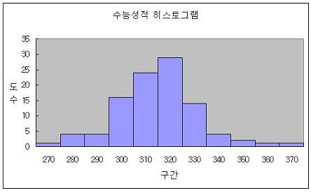
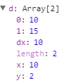
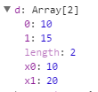
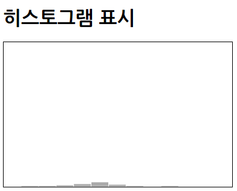
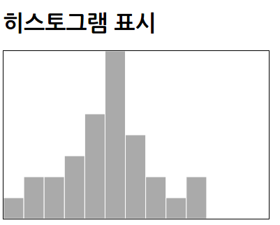
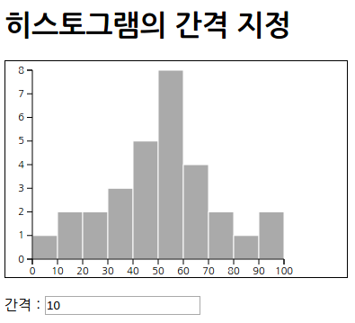
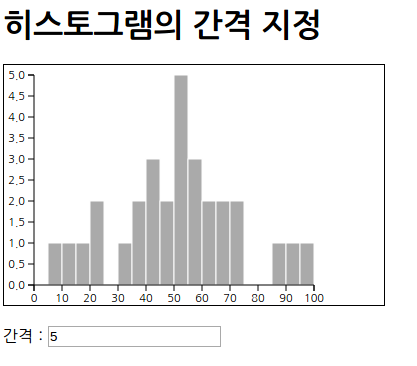

## 히스토그램

[TOC]

### 히스토그램 생성

**히스토그램**

* 데이터가 존재하는 범위를 몇 개의 구간으로 나누고, 각 구간에 들어가는 데이터의 출현도수를 세  

     어서 막대그림으로 그린 것  

* 


**히스토그램 생성의 기본**

* 사용할 데이터셋(30명의 시험 점수)
  * ```javascript
    var dataSet = [
    50, 95, 60, 44, 60, 50, 35, 20, 10, 8,
    56, 70, 65, 42, 22, 33, 40, 53, 52, 89,
    90, 55, 50, 55, 65, 72, 45, 35, 15, 45
    ];
    ```


* 10점 간격의 히스토그램으로 표시하고자 막대의 넓이는 svg 요소 넓이를 11로 나누어 구함
  * ```javascript
    var barWidth = svgwidth / 11;
    ```

* d3.layout.histogram() : 히스토그램의 레이아웃 기능 사용(D3 4.0 : d3.histogram()으로 변경)
* range() : 데이터의 범위를 지정(D3 4.0 : domain()으로 변경)
* bins() : 데이터 구별 처리, 구별할 범위는 배열 형식으로 지정(D3 4.0 : thresholds()으로 변경)
* 히스토그램의 데이터 구별 방법을 bins() 메서드로 지정(10점 간격일 때)
  * ```javascript
    .bins([0, 10, 20, 30, 40, 50, 60, 70, 80, 90, 100])
    ```


* 히스토그램의 데이터 구별 방법을 bins() 메서드로 지정(25점 간격일 때)
  * ```javascript
    .bin([0, 25, 50, 75, 100])
    ```


* 히스토그램 그리기(기대한 대로 표시하지 않는 코드)
  * ```xml
    <!DOCTYPE html>
    <html>
        <head>
            <meta charset="utf-8">
            <title>Sample</title>
            <script src="http://d3js.org/d3.v3.min.js" charset="utf-8"></script>
            <style>
                svg { width: 380px; height: 240px; border: 1px solid black; }
                .bar { fill: #aaa; stroke : white; stroke-width : 1; }
            </style>
        </head>
        <body>
            <h1>히스토그램 표시</h1>
            <svg id="myGraph"></svg>
            <script src="js/sample.js"></script>
        </body>
    </html>
    ```

  * ```javascript
    var svgWidth = 320;// SVG요소의 넓이
    var svgHeight = 240;	// SVG요소의 높이
    var barWidth = svgWidth / 11;	// 막대의 넓이
    // 데이터셋
    var dataSet = [
            50, 95, 60, 44, 60, 50, 35, 20, 10, 8,
            56, 70, 65, 42, 22, 33, 40, 53, 52, 89,
            90, 55, 50, 55, 65, 72, 45, 35, 15, 45
    ];
    // 히스토그램 설정
    var histogram = d3.layout.histogram()
      .range([0, 100])
      .bins([0, 10, 20, 30, 40, 50, 60, 70, 80, 90, 100])
    // 히스토그램 그리기
    var barElements = d3.select("#myGraph")
      .selectAll("rect")	// rect 요소로 히스토그램 표시
      .data(histogram(dataSet))	// 데이터를 대응시킴
      .enter()
      .append("rect")	// rect 요소를 추가
      .attr("class", "bar")	// CSS 클래스 추가
      .attr("x", function(d, i){	// X 좌표 설정
            return i * barWidth;
        })
      .attr("y", function(d, i){	// Y 좌표 설정
            return svgHeight - d.y;
        })
      .attr("width", barWidth)	// 넓이 설정
      .attr("height", function(d, i){	// 높이 설정
            return d.y;
        })
    ```

  * rect 요소의 __ data __ 속성 내용
    * |          d3 v3           |          d3 v4           |
      | :----------------------: | :----------------------: |
      |  |  |

  * 

**히스토그램 표시 조정**

* 표시할 스케일 설정
  * ```javascript
    var yScale = d3.scale.linear()
    				.domain([0, maxValue])
                    .range([svgHeight, 0])
    ```


* 스케일에 맞추어 히스토그램의 막대 좌표값을 구함
  * ```javascript
    .attr("y", function(d, i){
    	return yScale(d.y);
    })
    ```


* 히스토그램 그리기(기대한 대로 표시되는 코드)
  * ```javascript
    var svgWidth = 320;// SVG요소의 넓이
    var svgHeight = 240;	// SVG요소의 높이
    var barWidth = svgWidth / 11;	// 막대의 넓이
    // 데이터셋
    var dataSet = [
            50, 95, 60, 44, 60, 50, 35, 20, 10, 8,
            56, 70, 65, 42, 22, 33, 40, 53, 52, 89,
            90, 55, 50, 55, 65, 72, 45, 35, 15, 45
    ];
    // 히스토그램 데이터를 설정
    var histogram = d3.layout.histogram()
      .range([0, 100])
      .bins([0, 10, 20, 30, 40, 50, 60, 70, 80, 90, 100])
    // 데이터셋으로부터 최댓값을 구함
    var maxValue = d3.max(histogram(dataSet), function(d, i){
            return d.y;	// 데이터 자체가 아닌 최대 횟수를 반환
        })
    // 세로 스케일 설정
    var yScale = d3.scale.linear()
      .domain([0, maxValue])
      .range([svgHeight, 0])
    // 히스토그램 그리기
    var barElements = d3.select("#myGraph")
      .selectAll("rect")	// rect 요소로 히스토그램 표시
      .data(histogram(dataSet))	// 데이터를 대응시킴
      .enter()
      .append("rect")	// rect 요소를 추가
      .attr("class", "bar")	// CSS 클래스 추가
      .attr("x", function(d, i){	// X 좌표 설정
            return i * barWidth;
        })
      .attr("y", function(d, i){	// Y 좌표 설정
            return yScale(d.y);
        })
      .attr("width", barWidth)	// 넓이 설정
      .attr("height", function(d, i){	// 높이 설정
            return svgHeight - yScale(d.y);
        })
    ```

    * 

### 히스토그램의 표시 데이터 범위 지정

* 히스토그램의 표시 데이터 범위(점수의 범위)를 입력할 폼
  * ```xml
    <form>
    	<p>간격<input type="text" value="10", id="step"></p>
    </form>
    ```


* bin()메서드에 지정할 데이터 구간을 d3.range()메서드로 생성
  * ```javascript
    var histogram = d3.layout.histogram()
    				.range([0, 100])
                    .bins(d3.range(0, 100.1, stepX))
    ```


* 히스토그램의 표시를 수행하는 처리와 눈금 표시 함수
  * calcScale() : 스케일 계산
  * drawHistogram() : 히스토그램 그리기
  * drawScale() : 눈금 그리기

* 막대의 넓이 간격은 히스토그램 레이아웃에서 계산한 dx 속성의 값을 사용함
  * ```javascript
    .attr("witdh", function(d, i){
    	return xSacle(d.dx);
    })
    ```

* 폼에 입력된 수를 히스토그램의 표시 데이터 범위로 지정
  * ```javascript
    d3.select("#step").on("change", function(){
    stepX = this.value;
        histogram
        		.bins(d3.range(0, 100.1, stepX))
        d3.select("#myGraph").selectAll("*").remove();
        calcScale();
        drawHistogram();
    })
    ```

* 폼에 입력된 점수의 간격으로 히스토그램 그리기
  * ```xml
    <!DOCTYPE html>
    <html>
        <head>
            <meta charset="utf-8">
            <title>Sample</title>
            <script src="http://d3js.org/d3.v3.min.js" charset="utf-8"></script>
            <style>
                svg { width: 380px; height: 240px; border: 1px solid black; }
                .bar { fill: #aaa; stroke : white; stroke-width : 1; }
                .axis text {
                    font-family: sans-serif;
                    font-size: 11px;
                }
                .axis path,
                .axis line {
                    fill: none;
                    stroke: black;
                }
            </style>
        </head>
        <body>
            <h1>히스토그램의 간격 지정</h1>
            <svg id="myGraph"></svg>
            <form>
                <p>간격：<input type="text" value="10" id="step"></p>
            </form>
            <script src="js/sample.js"></script>
        </body>
    </html>
    ```

  * ```javascript
      var svgWidth = 320;// SVG요소의 넓이
      var svgHeight = 240;// SVG요소의 높이
      var yAxisHeight = svgHeight - 30;// 가로축의 넓이
      var xAxisWidth = svgWidth - 40;// 세로축의 넓이
      var offsetX = 30;// 가로 오프셋
      var offsetY = 10;// 세로 오프셋
      var stepX = 10;// 막대그래프의 개수. 10 간격.
      var xScale;// 가로 스케일
      var yScale;// 세로 스케일
      // 데이터셋
      var dataSet = [
            50, 95, 60, 44, 60, 50, 35, 20, 10, 8,
            56, 70, 65, 42, 22, 33, 40, 53, 52, 89,
            90, 55, 50, 55, 65, 72, 45, 35, 15, 45
      ];
      // 히스토그램 설정
      var histogram = d3.layout.histogram()
      .range([0, 100])
      .bins(d3.range(0, 100.1, stepX))	// ●범위를 계산하여 구함
      // 데이터셋으로부터 스케일 계산
      function calcScale(){
        // 데이터셋으로부터 최댓값을 구함
        var maxValue = d3.max(histogram(dataSet), function(d, i){
                return d.y;	// 데이터 자체가 아닌 최대 횟수를 반환
            })
        // 세로 스케일 설정
        yScale = d3.scale.linear()
          .domain([0, maxValue])
          .range([yAxisHeight, 0])
        // 가로 스케일을 설정
        xScale = d3.scale.linear()
          .domain([0, 100])
          .range([0, xAxisWidth ])
      }
      // 스케일/눈금 표시
      function drawScale(){
        // 세로 눈금 표시
        d3.select("#myGraph")	// SVG 요소 지정
              .append("g")	// g요소를 추가. 이것이 눈금을 표시하는 요소가 됨
              .attr("class", "axis")	// CSS 클래스 지정
              .attr("transform", "translate("+offsetX+", "+offsetY+")")
              .call(
                    d3.svg.axis()
                  .scale(yScale)  // 스케일 적용
                  .orient("left") //눈금의 표시 위치를 왼쪽으로 지정
                )
        // 가로 눈금 표시
        d3.select("#myGraph")	// SVG 요소 지정
              .append("g")	// g요소를 추가. 이것이 눈금을 표시하는 요소가 됨
              .attr("class", "axis")	// CSS 클래스 지정
              .attr("transform", "translate("+offsetX+", "+(yAxisHeight + offsetY)+")")
              .call(
                    d3.svg.axis()
                  .scale(xScale)  // 스케일 적용
                  .orient("bottom") // 눈금의 표시 위치를 아래쪽으로 지정
                )
      }
      // 히스토그램 요소 설정
      function drawHistgram(){
        var barElements = d3.select("#myGraph")
          .selectAll("rect")	// rect 요소로 히스토그램 표시
          .data(histogram(dataSet))	// 데이터를 대응시킴
          .enter()
          .append("rect")	// rect 요소를 추가
          .attr("class", "bar")	// CSS 클래스 추가
          .attr("x", function(d, i){	// X 좌표 설정
                return i * xScale(d.dx) + offsetX;
            })
          .attr("y", function(d, i){	// Y 좌표 설정
                return yScale(d.y) + offsetY;
            })
          .attr("width", function(d, i){	// 넓이 설정
                return xScale(d.dx);
            })
          .attr("height", function(d, i){	// 높이 설정
                return yAxisHeight - yScale(d.y);
            })
      }
      // 간격이 변경되면 히스토그램을 갱신
      d3.select("#step").on("change", function(){
        stepX = this.value;
        histogram
          .bins(d3.range(0, 100.1, stepX))
        d3.select("#myGraph").selectAll("*").remove();
        calcScale();
        drawHistgram();
        drawScale();
      })
      // 최초의 히스토그램 표시 처리
      calcScale();
      drawHistgram();
      drawScale();
    ```

  * 
  * 

**히스토그램에 애니메이션 효과 적용**

* 히스토그램 막대 표시에 애니메이션 효과 적용
  * ```xml
    <!DOCTYPE html>
    <html>
        <head>
            <meta charset="utf-8">
            <title>Sample</title>
            <script src="http://d3js.org/d3.v3.min.js" charset="utf-8"></script>
            <style>
                svg { width: 380px; height: 240px; border: 1px solid black; }
                .bar { fill: #aaa; stroke : white; stroke-width : 1; }
                .axis text {
                    font-family: sans-serif;
                    font-size: 11px;
                }
                .axis path,
                .axis line {
                    fill: none;
                    stroke: black;
                }
            </style>
        </head>
        <body>
            <h1>히스토그램의 간격 지정</h1>
            <svg id="myGraph"></svg>
            <form>
                <p>간격：<input type="text" value="10" id="step"></p>
            </form>
            <script src="js/sample.js"></script>
        </body>
    </html>
    ```

  * ```javascript
    var svgWidth = 320;	// SVG요소의 넓이
    var svgHeight = 240;	// SVG요소의 높이
    var yAxisHeight = svgHeight - 30;	// 가로축의 넓이
    var xAxisWidth = svgWidth - 40;	// 세로축의 넓이
    var offsetX = 30;	// 가로 오프셋
    var offsetY = 10;	// 세로 오프셋
    var stepX = 10;	// 막대그래프의 개수. 10 간격.
    var xScale;	// 가로 스케일
    var yScale;	// 세로 스케일
    // 데이터셋
    var dataSet = [
            50, 95, 60, 44, 60, 50, 35, 20, 10, 8,
            56, 70, 65, 42, 22, 33, 40, 53, 52, 89,
            90, 55, 50, 55, 65, 72, 45, 35, 15, 45
    ];
    // 히스토그램 설정
    var histogram = d3.layout.histogram()
      .range([0, 100])
      .bins(d3.range(0, 100.1, stepX))	// 범위를 계산하여 구함
    // 데이터셋으로부터 스케일 계산
    function calcScale(){
        // 데이터셋으로부터 최댓값을 구함
        var maxValue = d3.max(histogram(dataSet), function(d, i){
                return d.y;	// 데이터 자체가 아닌 최대 횟수를 반환
            })
        // 세로 스케일 설정
        yScale = d3.scale.linear()
          .domain([0, maxValue])
          .range([yAxisHeight, 0])
        // 가로 스케일을 설정
        xScale = d3.scale.linear()
          .domain([0, 100])
          .range([0, xAxisWidth ])
    }
    // 눈금 표시
    function drawScale(){
        // 세로 눈금 표시
        d3.select("#myGraph")	// SVG 요소 지정
              .append("g")	// g요소를 추가. 이것이 눈금을 표시하는 요소가 됨
              .attr("class", "axis")	// CSS 클래스 지정
              .attr("transform", "translate("+offsetX+", "+offsetY+")")
              .call(
                    d3.svg.axis()
                  .scale(yScale)  // 스케일 적용
                  .orient("left") //눈금의 표시 위치를 왼쪽으로 지정
                )
        // 가로 눈금 표시
        d3.select("#myGraph")	// SVG 요소 지정
              .append("g")	// g요소를 추가. 이것이 눈금을 표시하는 요소가 됨
              .attr("class", "axis")	// CSS 클래스 지정
              .attr("transform", "translate("+offsetX+", "+(yAxisHeight + offsetY)+")")
              .call(
                    d3.svg.axis()
                  .scale(xScale)  // 스케일 적용
                  .orient("bottom") // 눈금의 표시 위치를 아래쪽으로 지정
                )
    }
    // 히스토그램 요소 설정
    function drawHistgram(){
        var barElements = d3.select("#myGraph")
          .selectAll("rect")	// rect 요소로 히스토그램 표시
          .data(histogram(dataSet))	// 데이터를 대응시킴
          .enter()
          .append("rect")	// rect 요소를 추가
          .attr("class", "bar")	// CSS 클래스 추가
          .attr("width", function(d, i){	// 넓이 설정
                return xScale(d.dx);
            })
          .attr("x", function(d, i){	// X 좌표 설정
                return i * xScale(d.dx) + offsetX;
            })
          .attr("y", function(d, i){	// Y 좌표 설정
                return yScale(d.y) + offsetY;
            })
          .attr("y", yAxisHeight + offsetY)
          .attr("height", 0)
          .transition()
          .duration(1000)
          .attr("y", function(d, i){	// Y 좌표 설정
                return yScale(d.y) + offsetY;
            })
          .attr("height", function(d, i){	// 높이 설정
                return yAxisHeight - yScale(d.y);
            })
    }
    // 간격이 변경되면 히스토그램을 갱신
    d3.select("#step").on("change", function(){
        stepX = this.value;
        histogram
          .bins(d3.range(0, 100.1, stepX))
        d3.select("#myGraph").selectAll("*").remove();
        calcScale();
        drawHistgram();
        drawScale();
    })
    // 최초의 히스토그램 표시 처리
    calcScale();
    drawHistgram();
    drawScale();
    ```
    ​

### CSV 파일을 이용하여 히스토그램 그리기

* 헤더 g1은 1학년, g6은 6학년으로 이루어져 있다.
  * 한줄에 각 학년의 시험 점수 정리
  * ```
    g1,g2,g3,g4,g5,g6
    50,15,20,40,55,40
    95,25,52,20,52,50
    ~ 생략 ~
    55,26,10,25,95,58
    65,19,13,10,100,90
    72,2,32,60,,94
    45,8,45,58,,
    35,60,46,,,
    ,50,8,,,
    ,55,,,,
    ```


* 최초 히스토그램 표시용으로 1학년 데이터를 불러옴
  * ```javascript
    var dataSet = [];
    data.forEach(function(d, i){
    	dataSet.push(d.g1);
    })
    ```


* 버튼을 클릭하면 학년별 히스토그램을 표시하는 입력 폼

  * data-* : HTML5에서 생긴 사용자가 정의할 수 있는 속성

  * ```xml
    <input type="button" data-grader="g1" value="1학년">
    <input type="button" data-grader="g2" value="2학년">
    <input type="button" data-grader="g3" value="3학년">
    <input type="button" data-grader="g4" value="4학년">
    <input type="button" data-grader="g5" value="5학년">
    <input type="button" data-grader="g6" value="6학년">
    ```

  ​

* attr() 메서드로 data-grander 속성의 내용을 읽어옴
  * ```javascript
    var grander = d3.select(this).attr("data-grander");
    ```
    ​

* 불러온 data-grander 속성으로 학년에 대응하는 데이터를 세팅함
  * ```javascript
    dataSet = [];
    data.forEach(function(d, i){
    	dataSet.push(d[grander]);
    })
    ```


* 불러온 CSV 파일 내용을 버튼 클리긍로 바꾸어 히스토그램으로 그리기
  * ```xml
    <!DOCTYPE html>
    <html>
        <head>
            <meta charset="utf-8">
            <title>Sample</title>
            <script src="http://d3js.org/d3.v3.min.js" charset="utf-8"></script>
            <style>
                svg { width: 380px; height: 240px; border: 1px solid black; }
                .bar { fill: #aaa; stroke : white; stroke-width : 1; }
                .axis text {
                    font-family: sans-serif;
                    font-size: 11px;
                }
                .axis path,
                .axis line {
                    fill: none;
                    stroke: black;
                }
            </style>
        </head>
        <body>
            <h1>학년별로 히스토그램 표시</h1>
            <svg id="myGraph"></svg>
            <form id="dataSelect">
                <input type="button" data-grader="g1" value="1학년">
                <input type="button" data-grader="g2" value="2학년">
                <input type="button" data-grader="g3" value="3학년">
                <input type="button" data-grader="g4" value="4학년">
                <input type="button" data-grader="g5" value="5학년">
                <input type="button" data-grader="g6" value="6학년">
                <p>간격：<input type="text" value="10" id="step"></p>
            </form>
            <script src="js/sample.js"></script>
        </body>
    </html>
    ```

  * ```javascript
     // CSV 파일을 불러와 히스토그램 표시
    d3.csv("mydata.csv", function(error, data){
        // SVG 요소의 넓이과 높이를 구함
        var svgEle = document.getElementById("myGraph");
        var svgWidth = window.getComputedStyle(svgEle, null).getPropertyValue("width");
        var svgHeight = window.getComputedStyle(svgEle, null).getPropertyValue("height");
        svgWidth = parseFloat(svgWidth);	// 값에 단위가 포함되었으므로 단위를 삭제
        svgHeight = parseFloat(svgHeight);	// 값에 단위가 포함되었으므로 단위를 삭제
        var yAxisHeight = svgHeight - 30;	// 가로축의 넓이
        var xAxisWidth = svgWidth - 40;	// 세로축의 넓이
        var offsetX = 30;	// 가로 오프셋
        var offsetY = 10;	// 세로 오프셋
        var stepX = 10;	// 막대그래프의 개수. 10 간격.
        var xScale;	// 가로 스케일
        var yScale;	// 세로 스케일
        // 데이터셋 불러오기
        var dataSet = [ ];
        data.forEach(function(d, i){
            dataSet.push(d.g1);	// 1학년 데이터 입력
        })
        // 히스토그램 설정
        var histogram = d3.layout.histogram()
          .range([0, 100])
          .bins(d3.range(0, 100.1, stepX))	// ●범위를 계산하여 구함
        // 데이터셋으로부터 스케일 계산
        function calcScale(){
            // 데이터셋으로부터 최댓값을 구함
            var maxValue = d3.max(histogram(dataSet), function(d, i){
                    return d.y;	// 데이터 자체가 아닌 최대 횟수를 반환
                })
            // 세로 스케일 설정
            yScale = d3.scale.linear()
              .domain([0, maxValue])
              .range([yAxisHeight, 0])
            // 가로 스케일을 설정
            xScale = d3.scale.linear()
              .domain([0, 100])
              .range([0, xAxisWidth ])
        }
        // 눈금 표시
        function drawScale(){
            // 세로 눈금 표시
            d3.select("#myGraph")	// SVG 요소 지정
                  .append("g")	// g요소를 추가. 이것이 눈금을 표시하는 요소가 됨
                  .attr("class", "axis")	// CSS 클래스 지정
                  .attr("transform", "translate("+offsetX+", "+offsetY+")")
                  .call(
                        d3.svg.axis()
                      .scale(yScale)  // 스케일 적용
                      .orient("left") //눈금의 표시 위치를 왼쪽으로 지정
                    )
            // 가로 눈금 표시
            d3.select("#myGraph")	// SVG 요소 지정
                  .append("g")	// g요소를 추가. 이것이 눈금을 표시하는 요소가 됨
                  .attr("class", "axis")	// CSS 클래스 지정
                  .attr("transform", "translate("+offsetX+", "+(yAxisHeight + offsetY)+")")
                  .call(
                        d3.svg.axis()
                      .scale(xScale)  // 스케일 적용
                      .orient("bottom") // 눈금의 표시 위치를 아래쪽으로 지정
                    )
        }
        // 히스토그램 요소 설정
        function drawHistgram(){
            var barElements = d3.select("#myGraph")
              .selectAll("rect")	// rect 요소로 히스토그램 표시
              .data(histogram(dataSet))	// 데이터를 대응시킴
              .enter()
              .append("rect")	// rect 요소를 추가
              .attr("class", "bar")	// CSS 클래스 추가
              .attr("width", function(d, i){	// 넓이 설정
                    return xScale(d.dx);
                })
              .attr("x", function(d, i){	// X 좌표 설정
                    return i * xScale(d.dx) + offsetX;
                })
              .attr("y", function(d, i){	// Y 좌표 설정
                    return yScale(d.y) + offsetY;
                })
              .attr("y", yAxisHeight + offsetY)
              .attr("height", 0)
              .transition()
              .duration(1000)
              .attr("y", function(d, i){	// Y 좌표 설정
                    return yScale(d.y) + offsetY;
                })
              .attr("height", function(d, i){	// 높이 설정
                    return yAxisHeight - yScale(d.y);
                })
        }
        // 간격이 변경되면 히스토그램을 갱신
        d3.select("#step").on("change", function(){
            stepX = this.value; 
            histogram
              .bins(d3.range(0, 100.1, stepX))
            // 히스토그램 다시 그리기
            d3.select("#myGraph").selectAll("*").remove();	// 요소 삭제
            calcScale();
            drawHistgram();
            drawScale();
        })
        // 최초의 히스토그램 표시 처리
        calcScale();
        drawHistgram();
        drawScale();
        // 이벤트 설정
        d3.select("#dataSelect").selectAll("input[type='button']")
          .on("click", function(){
                var grader = d3.select(this).attr("data-grader");	// 학년 데이터 (g1〜g6)
                // 데이터 설정
                dataSet = [ ];
                data.forEach(function(d, i){
                    dataSet.push(d[grader]);	// 클릭한 학년의 데이터를 입력
                })
                // 히스토그램 갱신
                d3.select("#myGraph").selectAll("*").remove();	// 요소 삭제
                calcScale();
                drawHistgram();
                drawScale();
            });
    })
    ```
    ​

**히스토그램을 이미지로 표시**

* 히스토그램의 배경이나 막대에 이미지를 사용
  * ```xml
    <!DOCTYPE html>
    <html>
        <head>
            <meta charset="utf-8">
            <title>Sample</title>
            <script src="http://d3js.org/d3.v3.min.js" charset="utf-8"></script>
            <style>
                svg { width: 380px; height: 240px; border: 1px solid black;
                    background-image: url(images/bg.png);
                }
                .bar { stroke : white; stroke-width : 1; }
                .axis text {
                    font-family: sans-serif;
                    font-size: 11px;
                }
                .axis path,
                .axis line {
                    fill: none;
                    stroke: black;
                }
            </style>
        </head>
        <body>
            <h1>히스토그램에 이미지 사용</h1>
            <svg id="myGraph"></svg>
            <form id="dataSelect">
                <input type="button" data-grader="g1" value="1학년">
                <input type="button" data-grader="g2" value="2학년"2014-08-11>
                <input type="button" data-grader="g3" value="3학년">
                <input type="button" data-grader="g4" value="4학년">
                <input type="button" data-grader="g5" value="5학년">
                <input type="button" data-grader="g6" value="6학년">
                <p>간격：<input type="text" value="10" id="step"></p>
            </form>
            <script src="js/sample.js"></script>
        </body>
    </html>
    ```

  * ```javascript
      // CSV 파일을 불러와 히스토그램 표시
      d3.csv("mydata.csv", function(error, data){
        // SVG 요소의 넓이과 높이를 구함
        var svgEle = document.getElementById("myGraph");
        var svgWidth = window.getComputedStyle(svgEle, null).getPropertyValue("width");
        var svgHeight = window.getComputedStyle(svgEle, null).getPropertyValue("height");
        svgWidth = parseFloat(svgWidth);	// 값에 단위가 포함되었으므로 단위를 삭제
        svgHeight = parseFloat(svgHeight);	// 값에 단위가 포함되었으므로 단위를 삭제
        var yAxisHeight = svgHeight - 30;	// 가로축의 넓이
        var xAxisWidth = svgWidth - 40;	// 세로축의 넓이
        var offsetX = 30;	// 가로 오프셋
        var offsetY = 10;	// 세로 오프셋
        var stepX = 10;	// 막대그래프의 개수. 10 간격.
        var xScale;	// 가로 스케일
        var yScale;	// 세로 스케일
        // 데이터셋 불러오기
        var dataSet = [ ];
        data.forEach(function(d, i){
            dataSet.push(d.g1);	// 1학년 데이터 입력
        })
        // 히스토그램 설정
        var histogram = d3.layout.histogram()
          .range([0, 100])
          .bins(d3.range(0, 100.1, stepX))	// ●범위를 계산하여 구함
        // 데이터셋으로부터 스케일 계산
        function calcScale(){
            // 데이터셋으로부터 최댓값을 구함
            var maxValue = d3.max(histogram(dataSet), function(d, i){
                    return d.y;	// 데이터 자체가 아닌 최대 횟수를 반환
                })
            // 세로 스케일 설정
            yScale = d3.scale.linear()
              .domain([0, maxValue])
              .range([yAxisHeight, 0])
            // 가로 스케일을 설정
            xScale = d3.scale.linear()
              .domain([0, 100])
              .range([0, xAxisWidth ])
        }
        // 눈금 표시
        function drawScale(){
            // 세로 눈금 표시
            d3.select("#myGraph")	// SVG 요소 지정
                  .append("g")	// g요소를 추가. 이것이 눈금을 표시하는 요소가 됨
                  .attr("class", "axis")	// CSS 클래스 지정
                  .attr("transform", "translate("+offsetX+", "+offsetY+")")
                  .call(
                        d3.svg.axis()
                      .scale(yScale)  // 스케일 적용
                      .orient("left") //눈금의 표시 위치를 왼쪽으로 지정
                    )
            // 가로 눈금 표시
            d3.select("#myGraph")	// SVG 요소 지정
                  .append("g")	// g요소를 추가. 이것이 눈금을 표시하는 요소가 됨
                  .attr("class", "axis")	// CSS 클래스 지정
                  .attr("transform", "translate("+offsetX+", "+(yAxisHeight + offsetY)+")")
                  .call(
                        d3.svg.axis()
                      .scale(xScale)  // 스케일 적용
                      .orient("bottom") // 눈금의 표시 위치를 아래쪽으로 지정
                    )
        }
        // 히스토그램 요소 설정
        function drawHistgram(){
            var barElements = d3.select("#myGraph")
              .selectAll("image")	// image 요소로 히스토그램 표시
              .data(histogram(dataSet))	// 데이터를 대응시킴
              .enter()
              .append("image")	// image 요소를 추가
              .attr("class", "bar")	// CSS 클래스 추가
              .attr("xlink:href", "images/man.png")			
              .attr("width", function(d, i){	// 넓이 설정
                    return xScale(d.dx);
                })
              .attr("x", function(d, i){	// X 좌표 설정
                    return i * xScale(d.dx) + offsetX;
                })
              .attr("y", function(d, i){	// Y 좌표 설정
                    return yScale(d.y) + offsetY;
                })
              .attr("y", yAxisHeight + offsetY)
              .attr("height", 32)
              .transition()
              .duration(1000)
              .attr("y", function(d, i){	// Y 좌표 설정
                    return yScale(d.y) + offsetY;
                })
              .attr("height", function(d, i){	// 높이 설정
                    return yAxisHeight - yScale(d.y);
                })
        }
        // 간격이 변경되면 히스토그램을 갱신
        d3.select("#step").on("change", function(){
            stepX = this.value; 
            histogram
              .bins(d3.range(0, 100.1, stepX))
            // 히스토그램 다시 그리기
            d3.select("#myGraph").selectAll("*").remove();	// 요소 삭제
            calcScale();
            drawHistgram();
            drawScale();
        })
        // 최초의 히스토그램 표시 처리
        calcScale();
        drawHistgram();
        drawScale();
        // 이벤트 설정
        d3.select("#dataSelect").selectAll("input[type='button']")
          .on("click", function(){
                var grader = d3.select(this).attr("data-grader");	// 학년 데이터 (g1〜g6)
                // 데이터 설정
                dataSet = [ ];
                data.forEach(function(d, i){
                    dataSet.push(d[grader]);	// 클릭한 학년의 데이터를 입력
                })
                // 히스토그램 갱신
                d3.select("#myGraph").selectAll("*").remove();	// 요소 삭제
                calcScale();
                drawHistgram();
                drawScale();
            });
      })
    ```
    ​


