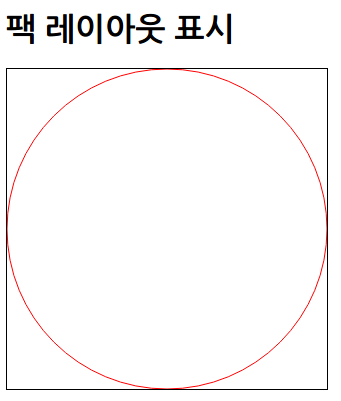
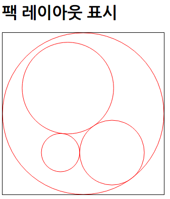

## 팩 레이아웃

[TOC]

### 팩 레이아웃 생성

* 사용할 데이터셋 (루트 데이터)
  * ```javascript
    var dataSet = {
    	value : 40
    }
    ```
    ​

* value : 팩 레이아웃에서 기본값으로 사용되는 속성 이름

* d3.layout.pack() : 팩 레이아웃 기능 사용 (D3 4.0 : d3.pack())으로 변경)

* size() : 표현할 범위 지정
  * 파라미터에는 배열 형식으로 넓이와 높이 지정

* 데이터셋에 nodes() 메서드를 사용하여 노드 데이터를 준비
  * ```javascript
    .data(bubble.nodes(dataSet))
    ```

* data() 설정
  * d3 v3
  * ```javascript
    var bubble = d3.layout.pack()
    .size([320, 320])

    ...
    .data(bubble.nodes(dataSet))
    ```

  * d3 v4
  * ```javascript
    var bubble = d3.pack()
    .size([320, 320])

    var root = d3.hierarchy(dataSet);

    bubble(root);

    ...
    .data(root.descendants())
    ```

* 팩 레이아웃에서 생성된 속성
  * | 속성       | 설명                      |
    | -------- | ----------------------- |
    | parent   | 부모 노드, 루트(최상위)일 때는 null |
    | children | 자식노드, 없다면 null          |
    | value    | 값                       |
    | depth    | 계층의 깊이, 루트일 때는 0        |
    | x        | 원의 중심 X 좌표              |
    | y        | 원의 중심 Y 죄표              |
    | r        | 원의 반지름                  |

* 팩 레이아웃을 이용하여 원 그리기
  * ```xml
    <!DOCTYPE html>
    <html>
        <head>
            <meta charset="utf-8">
            <title>Sample</title>
            <script src="http://d3js.org/d3.v3.min.js" charset="utf-8"></script>
            <style>
                svg { width: 320px; height: 320px; border: 1px solid black; }
                circle { stroke: red; fill: none; }
            </style>
        </head>
        <body>
            <h1>팩 레이아웃 표시</h1>
            <svg id="myGraph"></svg>
            <script src="js/sample.js"></script>
        </body>
    </html>
    ```

  * ```javascript
    var svgWidth = 320;	// SVG요소의 넓이
    var svgHeight = 320;	// SVG요소의 높이
    // 데이터셋
    var dataSet = {
        value : 40
    }
    // 팩 레이아웃
    var bubble = d3.layout.pack()
      .size([320, 320])	// 표시 크기 지정
    d3.select("#myGraph")
      .selectAll("circle")	// circle요소를 추가
      .data(bubble.nodes(dataSet))	// 데이터셋을 요소로 설정
      .enter()
      .append("circle")	// 데이터 수만큼 circle 요소가 추가됨
      .attr("r", function(d){	// 반지름 지정
            return d.r;
        })
      .attr("cx", function(d, i){	// 중심 X 좌표 지정
            return d.x;
        })
      .attr("cy", function(d, i){	// 중심 Y 좌표 지정
            return d.y;
        })
    ```

* 


* 데이터셋 안에 자식으로 표시할 데이터를 준비
  * ```javascript
    var dataSet = {
    	value : 40,
        children : [
        	{ value : 35 },
            { value : 100},
            { value : 200 }
        ]
    }
    ```

  * 


* 자식 안에 또 자식 데이터를 준비
  * ```javascript
    var dataSet = {
        value : 40,
        children : [
          { value : 35 },
            { value : 10 },
            { value : 20 },
            { value : 900,
            	children : [
                	{ value : 20 },
                    { value : 50 }
                ]
            }
        ]
    }
    ```

**원에 색과 애니메이션 적용**

* D3.js의 기본 10색을 준비함
  * ```javascript
    var color = d3.scale.category10();
    ```

* 팩 레이아웃을 이용하여 다양한 원을 애니메이션 효과와 함께 표시
  * ```xml
    <!DOCTYPE html>
    <html>
        <head>
            <meta charset="utf-8">
            <title>Sample</title>
            <script src="http://d3js.org/d3.v3.min.js" charset="utf-8"></script>
            <style>
                svg { width: 320px; height: 320px; border: 1px solid black; }
                circle { stroke: none; }
            </style>
        </head>
        <body>
            <h1>팩 레이아웃 표시</h1>
            <svg id="myGraph"></svg>
            <script src="js/sample.js"></script>
        </body>
    </html>
    ```

  * ```javascript
    var svgWidth = 320;	// SVG요소의 넓이
    var svgHeight = 320;	// SVG요소의 높이
    // 데이터셋
    var dataSet = {
        value : 40,
        children : [
            { value : 35 },
            { value : 10 },
            { value : 20 },
            { value : 900,
                children : [
                    { value : 20 },
                    { value : 50 }
                ]
            }
        ]
    }
    // 색을 준비
    var color = d3.scale.category10();  // 10색을 지정
    // 팩 레이아웃
    var bubble = d3.layout.pack()
      .size([320, 320])	// 표시 크기 지정
    d3.select("#myGraph")
      .selectAll("circle")	// circle요소를 추가
      .data(bubble.nodes(dataSet))	// 데이터셋을 요소에 설정
      .enter()
      .append("circle")	// 데이터의 수만큼 circle 요소가 추가됨
      .attr("cx", function(d, i){	// 중심 X 좌표 지정
            return d.x;
        })
      .attr("cy", function(d, i){	// 中중심 Y 좌표 지정
            return d.y;
        })
      .attr("r", 0)	// 최초 반지름은 0으로 함
      .transition()
      .duration(function(d, i){	// 자식의 깊이에 따라 대기 시간을 설정
            return d.depth * 1000 + 500;	// 깊이×1초+0.5초
        })
      .attr("r", function(d){	// 반지름 지정
            return d.r;
        })
      .style("fill", function(d, i){
            return color(i);
        })
    ```
    ​

### 팩 레이아웃으로 인구를 표시

* 사용할 데이터셋(2010년 일본 국세조사를 이용한 도도부현별 인구 데이터)
  * ```javscript
    {
        "name" : "전국", "value" : 128057352,
        "children" : [
            { "name" : "도쿄도", "value" : 13159388 },
            { "name" : "오사카부", "value" : 8865245 },
            { "name" : "아이치현", "value" : 7410719 },
            { "name" : "나가노현", "value" : 2152449,
                "children" : [
                    { "name" : "나가노시", "value" : 31511 },
                    { "name" : "마츠모토시", "value" : 243037 },
                    { "name" : "시오지리시", "value" : 67670 }
                ]
            }
        ]
    }
    ```


* g 요소로 원과 문자의 표시 위치를 한꺼번에 변경
  * ```javascript
    var pack = d3.select("#myGraph")
          .selectAll("g")
          .data(bubble.nodes(dataSet))	// 데이터셋을 요소에 설정
          .enter()
          .append("g")
          .attr("transform", function(d, i){
                return "translate(" + d.x + "," + d.y + ")";	// X,Y 좌표 설정
            })
    ```


* 팩 레이아웃의 계층 깊이를 이용하여 도도부현의 이름만 표시함
  * ```javascript
    .text(function(d, i){
    	if (d.depth == 1){	// 제1계층(도도부현)의 대상
    		return d.name;	// name 속성의 내용을 반환
    	}
    	return null;	// 제1계층 이외는 표시하지 않음
    })
    ```


* 팩 레이아웃으로 인구 표시
  * ```xml
    <!DOCTYPE html>
    <html>
        <head>
            <meta charset="utf-8">
            <title>Sample</title>
            <script src="http://d3js.org/d3.v3.min.js" charset="utf-8"></script>
            <style>
                svg { width: 320px; height: 320px; border: 1px solid black; }
                circle { stroke: none; opacity : 0.25; }
                text { font-size: 10pt; text-anchor: middle; fill: black; opacity: 0; }
            </style>
        </head>
        <body>
            <h1>인구를 팩 레이아웃으로 표시</h1>
            <svg id="myGraph"></svg>
            <script src="js/sample.js"></script>
        </body>
    </html>
    ```

  * ```javascript
    var svgWidth = 320;	// SVG요소의 넓이
    var svgHeight = 320;	// SVG요소의 높이
    // 데이터셋
    var dataSet = {
        name : "전국", value : 128057352,
        children : [
            { name : "도쿄도", value : 13159388 },
            { name : "오사카부", value : 8865245 },
            { name : "아이치현", value : 7410719 },
            { name : "나가노현", value : 2152449,
                children : [
                    { name : "나가노시", value : 381511 },
                    { name : "마츠모토시", value : 243037 },
                    { name : "시오지리시", value : 67670 }
                ]
            }
        ]
    }
    // 색을 준비
    var color = d3.scale.category10();  // 10색을 지정
    // 팩 레이아웃
    var bubble = d3.layout.pack()
      .size([320, 320])	// 표시 크기 지정
    // 팩 레이아웃으로 사용할 크룹을 작성
    var pack = d3.select("#myGraph")
      .selectAll("g")
      .data(bubble.nodes(dataSet))	// 데이터셋을 요소에 설정
      .enter()
      .append("g")
      .attr("transform", function(d, i){
            return "translate(" + d.x + "," + d.y + ")";	// X, Y 좌표 설정
        })
    // 원 생성
    pack.append("circle")	// circle 요소를 추가
      .attr("r", 0)	// 최초 반지름은 0으로 함
      .transition()
      .duration(function(d, i){	// 자식의 깊이에 따라 대기 시간을 설정
            return d.depth * 1000 + 500;	// 깊이×1초+0.5초
        })
      .attr("r", function(d){	// 반지름 지정
            return d.r;
        })
      .style("fill", function(d, i){
            return color(i);
        })
    // 원에 표시할 문자 생성
    pack.append("text")
      .style("opacity", 0)	// 투명으로 함
      .transition()
      .duration(3000)	// 3초에 걸쳐 표시
      .style("opacity", 1.0)	// 불투명으로 함
      .text(function(d, i){
            if (d.depth == 1){	// 제1계층(도도부현)의 대상
                return d.name;	// name 속성의 내용을 반환
            }
            return null;	// 제1계층 이외는 표시하지 않음
        })
    ```
    ​

### 외부 데이터를 불러와 팩 레이아웃으로 표시

* json 형식의 데이터
  * ```json
    {
        "name" : "전국", "value" : 128057352,
        "children" : [
            { "name" : "도쿄도", "value" : 13159388 },
            { "name" : "오사카부", "value" : 8865245 },
            { "name" : "아이치현", "value" : 7410719 },
            { "name" : "나가노현", "value" : 2152449,
                "children" : [
                    { "name" : "나가노시", "value" : 31511 },
                    { "name" : "마츠모토시", "value" : 243037 },
                    { "name" : "시오지리시", "value" : 67670 }
                ]
            }
        ]
    }
    ```

* json 데이터를 불러와 팩 레이아웃으로 인구를 표시
  * ```xml
    <!DOCTYPE html>
    <html>
        <head>
            <meta charset="utf-8">
            <title>Sample</title>
            <script src="http://d3js.org/d3.v3.min.js" charset="utf-8"></script>
            <style>
                svg { width: 320px; height: 320px; border: 1px solid black; }
                circle { stroke: none; opacity : 0.25; }
                text { font-size: 10pt; text-anchor: middle; fill: black; opacity: 0; }
            </style>
        </head>
        <body>
            <h1>인구 비율 표시</h1>
            <svg id="myGraph"></svg>
            <script src="js/sample.js"></script>
        </body>
    </html>
    ```

  * ```javascript
    var svgWidth = 320;	// SVG요소의 넓이
    var svgHeight = 320;	// SVG요소의 높이
    // JSON 데이터를 불러와 처리
    d3.json("data2010.json", function(error, data){
        drawPackLayout(data);
    });
    // 팩 레이아웃 표시
    function drawPackLayout(dataSet){
        // 색을 준비
        var color = d3.scale.category10();  // 10색을 지정
        // 팩 레이아웃
        var bubble = d3.layout.pack()
          .size([320, 320])	// 표시 크기 지정
        // 팩 레이아웃으로 사용할 크룹을 작성
        var pack = d3.select("#myGraph")
          .selectAll("g")
          .data(bubble.nodes(dataSet))	// 데이터셋을 요소에 설정
          .enter()
          .append("g")
          .attr("transform", function(d, i){
                return "translate(" + d.x + "," + d.y + ")";	// X,Y 좌표 설정
            })
        // 원 생성
        pack.append("circle")	// circle요소를 추가
          .attr("r", 0)	// 최초 반지름은 0으로 함
          .transition()
          .duration(function(d, i){	// 자식의 깊이에 따라 대기 시간을 설정
                return d.depth * 1000 + 500;	// 깊이×1초+0.5초
            })
          .attr("r", function(d){	// 반지름 지정
                return d.r;
            })
          .style("fill", function(d, i){
                return color(i);
            })
        // 원에 표시할 문자 생성
        pack.append("text")
          .style("opacity", 0)	// 투명으로 함
          .transition()
          .duration(3000)	// 3초에 걸쳐 표시
          .style("opacity", 1.0)	// 불투명으로 함
          .text(function(d, i){
                if (d.depth == 1){	// 제1계층(도도부현)의 대상
                    return d.name;	// name 속성의 내용을 반환
                }
                return null;	// 제1계층 이외는 표시하지 않음
            })
    }
    ```
    ​

**여러 개의 JSON 데이터를 교체하여 표시**

* json 형식의 데이터
  * ```json
    {
        "name" : "전국", "year2000" : 126925843, "year2005" : 127767994, "year2010" : 128057352,
        "children" : [
            { "name" : "도쿄도", "year2000" : 12064101, "year2005" : 12576601, "year2010" : 13159388 },
            { "name" : "오사카부", "year2000" : 8805081, "year2005" : 8817166, "year2010" : 8865245 },
            { "name" : "아이치현", "year2000" : 7043300, "year2005" : 7254704, "year2010" : 7410719 },
            { "name" : "나가노현", "year2000" : 2215168, "year2005" : 2196114, "year2010" : 2152449,
                "children" : [
                    { "name" : "나가노시", "year2000" : 360112, "year2005" : 3785120, "year2010" : 38151100 },
                    { "name" : "마츠모토시", "year2000" : 208970, "year2005" : 2276270, "year2010" : 24303700 },
                    { "name" : "시오지리시", "year2000" : 64128, "year2005" : 683460, "year2010" : 6767000 }
                ]
            }
        ]
    }
    ```


* 특정 키를 팩 레이아웃의 value로 사용
  * ```javascript
    .data(bubble.value(function(d, i){
    		return d[year];
    	}).nodes(dataSet))
    ```


* 버튼을 클릭하면 data-year 속성의 내용을 읽어옴
  * ```xml
    <input type="button" value="2000년" data-year="year2000">
    <input type="button" value="2005년" data-year="year2005">
    <input type="button" value="2010년" data-year="year2010">
    ```

* 버튼을 클릭하면 JSON 데이터를 교체한 다음 팩 레이아웃으로 인구 표시
  * ```xml
    <!DOCTYPE html>
    <html>
        <head>
            <meta charset="utf-8">
            <title>Sample</title>
            <script src="http://d3js.org/d3.v3.min.js" charset="utf-8"></script>
            <style>
                svg { width: 320px; height: 320px; border: 1px solid black; }
                circle { stroke: none; opacity : 0.25; }
                text { font-size: 10pt; text-anchor: middle; fill: black; opacity: 0; }
            </style>
        </head>
        <body>
            <h1>인구 데이터를 불러와 표시</h1>
            <svg id="myGraph"></svg>
            <form>
                <input type="button" value="2000년" data-year="year2000">
                <input type="button" value="2005년" data-year="year2005">
                <input type="button" value="2010년" data-year="year2010">
            </form>
            <script src="js/sample.js"></script>
        </body>
    </html>
    ```

  * ```javascript
    (function(){
        // SVG 요소의 넓이과 높이를 구함
        var svgEle = document.getElementById("myGraph");
        var svgWidth = window.getComputedStyle(svgEle, null).getPropertyValue("width");
        var svgHeight = window.getComputedStyle(svgEle, null).getPropertyValue("height");
        svgWidth = parseFloat(svgWidth);	// 값에 단위가 포함되었으므로 단위를 삭제
        svgHeight = parseFloat(svgHeight);	// 값에 단위가 포함되었으므로 단위를 삭제
        var pack;		// 원을 패킹하는 g 요소 일람
        var circles;	// circle 요소 일람
        var texts;	// text 요소 일람
        var bubble;	// 팩 레이아웃 객체	
        var allData;	// 모든 데이터를 저장할 변수
        var year = "year2000";	// 표시할 데이터를 나타내는 변수. 최초에는 2005년 데이터
        // JSON 데이터를 불러와 처리
        d3.json("data.json", function(error, data){
            allData = data;
            drawPackLayout(data);
        });
        // 팩 레이아웃 표시
        function drawPackLayout(dataSet){
            // 색을 준비
            var color = d3.scale.category10();  // 10색을 지정
            // 팩 레이아웃
            bubble = d3.layout.pack()
              .size([320, 320])	// 표시 크기 지정
            // 팩 레이아웃으로 사용할 크룹을 작성
            pack = d3.select("#myGraph")
              .selectAll("g")
              .data(bubble.value(function(d, i){
                    return d[year];	
                }).nodes(dataSet))	// 데이터셋을 요소에 설정
              .enter()
              .append("g")
            // 원 생성
            circles = pack.append("circle")
              .attr("r", 0)	// 최초 반지름은 0으로 함
              .attr("transform", function(d, i){
                    return "translate(" + d.x + "," + d.y + ")";	// X,Y 좌표 설정
                })
              .style("fill", function(d, i){
                    return color(i);
                })
            circles.transition()
              .duration(function(d, i){	// 자식의 깊이에 따라 대기 시간을 설정
                    return d.depth * 1000 + 500;	// 깊이×1초+0.5초
                })
              .attr("r", function(d){	// 반지름 지정
                    return d.r;
                })
            // 원에 표시할 문자 생성
            texts = pack.append("text")
              .attr("transform", function(d, i){
                    return "translate(" + d.x + "," + d.y + ")";	// X,Y 좌표 설정
                })
            texts.style("opacity", 1.0)	// 투명으로 함
              .transition()
              .duration(3000)	// 3초에 걸쳐 표시
              .style("opacity", 1.0)	// 불투명으로 함
              .text(function(d, i){
                    if (d.depth == 1){	// 제1계층(도도부현)의 대상
                        return d.name;	// name 속성의 내용을 반환
                    }
                    return null;	// 제1계층 이외는 표시하지 않음
                })
        }
        // 버튼 클릭으로 데이터를 불러와 애니메이션 효과와 함께 표시
        d3.selectAll("input").on("click", function(){
            year = d3.select(this).attr("data-year");
            pack.data(bubble.value(function(d, i){
                return d[year];	
            }).nodes(allData))	// 데이터셋을 요소에 설정
            circles
              .transition()	// 속성을 애니메이션을 사용하여 변경
              .duration(500)	// 0.5초간 애니메이션
              .ease("bounce")	// 통통 튀는 움직임으로 함
              .attr("r", function(d, i){	// 원의 반지름을 설정
                    return d.r;
                })
              .attr("transform", function(d, i){
                    return "translate(" + d.x + "," + d.y + ")";	// X,Y 좌표 설정
                })
            texts
              .transition()	// 속성을 애니메이션을 사용하여 변경
              .duration(500)	// 0.5초간 애니메이션
              .ease("bounce")
              .attr("transform", function(d, i){
                    return "translate(" + d.x + "," + d.y + ")";	// X,Y 좌표 설정
                })
        });
    })();
    ```
    ​

