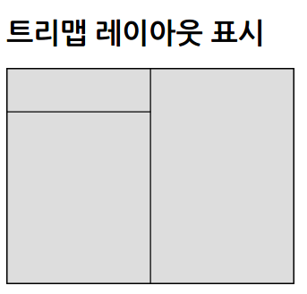
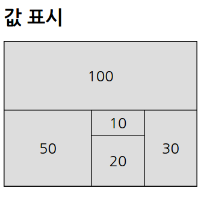
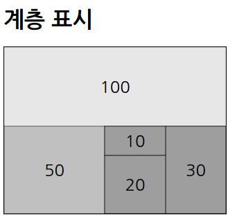
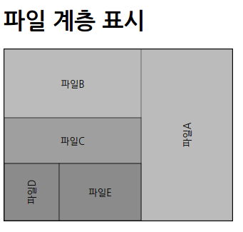

## 트리맵 레이아웃

### 트리맵 생성

* 부모 · 자식(계층) 관계를 이용하여 차트로 표현

**트리맵 레이아웃 생성의 기본**

* 사용할 데이터셋(루트가 되는 데이터)
  * ```javascript
    var dataSet = {
    	value : 40
    }
    ```

* 데이터셋 안에 자식 노드(계층화) 데이터를 준비
  * ```javascript
    var dataSet = {
    	children : [
        	{ value : 10},
            { value : 8},
            { value : 2}
        ]
    }
    ```

* 자식 노드 안에 또 자식 노드 데이터를 준비
  * ```javascript
    var dataSet = {
    	children : [
        	{ value : 100 },
            { child : [
            	{ value : 50 },
                { children : [
                	{ value : 10},
                    { value : 8},
                    { value : 2}
                ]}
            ]}
        ]
    }
    ```

* 데이터셋에 nodes() 메서드를 사용하여 노드 데이터를 준비
  * ```javascript
    data(treemap.nodes(dataSet))
    ```

* 트리맵 레이아웃에서 생성한 속성
  * | column   | column                         |
    | -------- | ------------------------------ |
    | parent   | 부모 계층의 노드, 루트(가장 상위 계층)라면 null |
    | children | 자식 노드, 없으면 null                |
    | value    | 값                              |
    | depth    | 계틍의 깊이, 루트일 때는 0               |
    | x        | 사각형의 X 좌표                      |
    | y        | 사각형의 Y 좌표                      |
    | dx       | 가로 오프셋                         |
    | dy       | 세로 오프셋                         |

* 트리맵 레이아웃으로 사각형을 분할하여 표시
  * ```xml
    <!DOCTYPE html>
    <html>
        <head>
            <meta charset="utf-8">
            <title>Sample</title>
            <script src="http://d3js.org/d3.v3.min.js" charset="utf-8"></script>
            <style>
                svg { width: 320px; height: 240px; border: 1px solid black; }
                .block { stroke: black; fill: #ddd; }
            </style>
        </head>
        <body>
            <h1>트리맵 레이아웃 표시</h1>
            <svg id="myGraph"></svg>
            <script src="js/sample.js"></script>
        </body>
    </html>
    ```

  * ```javascript
    var svgWidth = 320;	// SVG요소의 넓이
    var svgHeight = 240;	// SVG요소의 높이
    // 데이터셋
    var dataSet = {
        children : [
            { value : 10 },
            { value : 8 },
            { value : 2 }
        ]
    }
    // 트리맵 레이아웃
    var treemap = d3.layout.treemap()
      .size([svgWidth, svgHeight])	// SVG 요소의 넓이에 맞춤
    // 트리맵 그리기
    var tmap = d3.select("#myGraph")
      .selectAll("rect")	// rect 요소 지정
      .data(treemap.nodes(dataSet))	// 노드를 대상으로 처리
    // 분할 맵 영역 추가
    tmap.enter()
      .append("rect")	// rect 요소를 추가
      .attr("class", "block")	// CSS 클래스 추가
      .attr("x", function(d, i) {	// X 좌표 설정
            return d.x;
        }) 
      .attr("y", function(d, i) {	// Y 좌표 설정
            return d.y;
        })
      .attr("width", function(d, i) {	// 넓이 설정
            return d.dx;
        })
      .attr("height", function(d, i) {	// 높이 설정
            return d.dy;
        })
    ```
  ​

* 

**분할된 영역에 데이터 값을 표시**

* 트리맵 레이아웃의 계층 깊이와 노드의 속성을 이용하여 특정 노드만 문자열을 표시
  * ```javascript
    .text(function(d,i){
    	if ((d.depth == 0) || (d.children)) {
        	return null;
        }
        return d.value
    })
    ```

* 트리맵 레이아웃으로 분할한 영역에 데이터 값 표시
  * ```xml
    <!DOCTYPE html>
    <html>
        <head>
            <meta charset="utf-8">
            <title>Sample</title>
            <script src="http://d3js.org/d3.v3.min.js" charset="utf-8"></script>
            <style>
                svg { width: 320px; height: 240px; border: 1px solid black; }
                .block { stroke: black; fill: #ddd; }
                .name { font-size: 18pt; text-anchor: middle; }
            </style>
        </head>
        <body>
            <h1>값 표시</h1>
            <svg id="myGraph"></svg>
            <script src="js/sample.js"></script>
        </body>
    </html>
    ```

  * ```javascript
    var svgWidth = 320;	// SVG요소의 넓이
    var svgHeight = 240;	// SVG요소의 높이
    // 데이터셋
    var dataSet = {
        children: [
            { value : 100 },
            { children: [
                    { value : 50 },
                    { children: [
                            { value: 30 },
                            { value: 20 },
                            { value: 10 }
                        ]
                    }
                ]
            }
        ]
    }
    // 트리맵 레이아웃
    var treemap = d3.layout.treemap()
      .size([svgWidth, svgHeight])	// SVG 요소의 넓이에 맞춤
    // 트리맵 그리기
    var tmap = d3.select("#myGraph")
      .selectAll("rect")	// rect 요소 지정
      .data(treemap.nodes(dataSet))	// 노드를 대상으로 처리
    // 분할 맵 영역 추가
    tmap.enter()
      .append("rect")  // rect 요소를 추가
      .attr("class", "block")	// CSS 클래스 추가
      .attr("x", function(d, i) {	// X 좌표 설정
            return d.x;
        }) 
      .attr("y", function(d, i) {	// Y 좌표 설정
            return d.y;
        })
      .attr("width", function(d, i) {	// 넓이 설정
            return d.dx;
        })
      .attr("height", function(d, i) {	// 높이 설정
            return d.dy;
        })
    // 맵 안에 문자 추가
    tmap.enter()
      .append("text")	// text요소를 추가
      .attr("class", "name")	// CSS 클래스 추가
      .attr("transform", function(d, i) {	// 위치를 계산하여 XY 좌표를 일괄 설정
            return "translate(" + (d.x+d.dx/2) + "," + (d.y+d.dy/2)+")";
        })
      .attr("dy", "0.35em")	// 표시 위치 조정
      .text(function(d, i) {	// 문자 표시
            if ((d.depth == 0) || (d.children)){	// 루트이거나 자식 노드가 있을 때는 아무것도 표시하지 않음
                return null;
            }
            return d.value;	// 영역 안에 표시할 문자를 반환
        })
    ```
  ​

* 

**데이터의 계층 구조를 겉모습으로 표현**

* 트리맵 레이아웃의 계층 깊이를 이용하여 투명도를 변화시킴
  * ```javascript
    .style("opacity", function(d, i){
    	return d.depth / 5;
    })
    ```

* 트리맵 레이아웃으로 영역의 계틍이 깊어질수록 배경색이 짙어짐
  * ```xml
    <!DOCTYPE html>
    <html>
        <head>
            <meta charset="utf-8">
            <title>Sample</title>
            <script src="http://d3js.org/d3.v3.min.js" charset="utf-8"></script>
            <style>
                svg { width: 320px; height: 240px; border: 1px solid black; }
                .block { stroke: black; fill: #888; }
                .name { font-size: 18pt; text-anchor: middle; }
            </style>
        </head>
        <body>
            <h1>계층 표시</h1>
            <svg id="myGraph"></svg>
            <script src="js/sample.js"></script>
        </body>
    </html>
    ```

  * ```javascript
    var svgWidth = 320;	// SVG요소의 넓이
    var svgHeight = 240;	// SVG요소의 높이
    // 데이터셋
    var dataSet = {
        children: [
            { value : 100 },
            { children: [
                    { value : 50 },
                    { children: [
                            { value: 30 },
                            { value: 20 },
                            { value: 10 }
                        ]
                    }
                ]
            }
        ]
    }
    // 트리맵 레이아웃
    var treemap = d3.layout.treemap()
      .size([svgWidth, svgHeight])	// SVG 요소의 넓이에 맞춤
    // 트리맵 그리기
    var tmap = d3.select("#myGraph")
      .selectAll("rect")	// rect 요소 지정
      .data(treemap.nodes(dataSet))	// 노드를 대상으로 처리
    // 분할 맵 영역 추가
    tmap.enter()
      .append("rect")  // rect 요소를 추가
      .attr("class", "block")	// CSS 클래스 추가
      .attr("x", function(d, i) {	// X 좌표 설정
            return d.x;
        }) 
      .attr("y", function(d, i) {	// Y 좌표 설정
            return d.y;
        })
      .attr("width", function(d, i) {	// 넓이 설정
            return d.dx;
        })
      .attr("height", function(d, i) {	// 높이 설정
            return d.dy;
        })
      .style("opacity", function(d, i){	// 깊이에 따라 투명도를 설정
            return d.depth / 5;	// 자식이 깊어지면 짙어짐
        })
    // 맵 안에 문자 추가
    tmap.enter()
      .append("text")	// text 요소를 추가
      .attr("class", "name")	// CSS 클래스 추가
      .attr("transform", function(d, i){	// 위치를 계산하여 XY 좌표를 일괄 설정
            return "translate(" + (d.x+d.dx/2) + "," + (d.y+d.dy/2)+")";	
        })
      .attr("dy", "0.35em")	// 표시 위치 조정
      .text(function(d, i) {  // 문자 표시
            if ((d.depth == 0) || (d.children)) {	// 루트인가 자식 노드가 있는가
                return null;	// 루트이거나 자식 노드가 있다면 null을 반환하여 아무것도 표시하지 않음 
            }
            return d.value;	// 영역 안에 표시할 문자를 반환
        })
    ```
  ​

* 

### 폴더 안에 있는 파일 크기에 따라 표시

* 사용할 데이터셋
  * ```xml
    <!DOCTYPE html>
    <html>
        <head>
            <meta charset="utf-8">
            <title>Sample</title>
            <script src="http://d3js.org/d3.v3.min.js" charset="utf-8"></script>
            <style>
                svg { width: 320px; height: 240px; border: 1px solid black; }
                .file { stroke: black; fill: #777; }
                .name { font-size: 10pt; text-anchor: middle; }
            </style>
        </head>
        <body>
            <h1>파일 계층 표시</h1>
            <svg id="myGraph"></svg>
            <script src="js/sample.js"></script>
        </body>
    </html>
    ```

  * ```javascript
    var svgWidth = 320;	// SVG요소의 넓이
    var svgHeight = 240;	// SVG요소의 높이
    // 데이터셋
    var dataSet = {
        name: "루트",
        children: [
            { name: "Dir1", children: [
                    { name: "Dir2", children: [
                            { name: "파일A", value: 5000 },
                            { name: "파일B", value: 3000 },
                            { name: "Dir3", children: [
                                    { name: "파일C", value: 2000 },
                                    { name: "Dir4", children: [
                                            { name: "파일D", value: 1000 },
                                            { name: "파일E", value: 1500 }
                                        ]
                                    }
                                ]
                            }
                        ]
                    }
                ]
            }
        ]
    }
    // 트리맵 레이아웃
    var treemap = d3.layout.treemap()
      .size([svgWidth, svgHeight])	// SVG 요소의 넓이에 맞춤
    // 트리맵 그리기
    var tmap = d3.select("#myGraph")
      .selectAll("rect")	// rect 요소 지정
      .data(treemap.nodes(dataSet))	// 노드를 대상으로 처리
    // 분할 맵 영역 추가
    tmap.enter()
      .append("rect")	// rect 요소를 추가
      .attr("class", "file")	// CSS 클래스 추가
      .attr("x", function(d, i) {	// X 좌표 설정
            return d.x;
        }) 
      .attr("y", function(d, i) {	// Y 좌표 설정
            return d.y;
        })
      .attr("width", function(d, i) {	// 넓이 설정
            return d.dx;
        })
      .attr("height", function(d, i) {	// 높이 설정
            return d.dy;
        })
      .style("opacity", function(d, i){	// 깊이에 따라 투명도를 설정
            return d.depth / 10;	// 자식이 깊어지면 짙어짐
        })
    // 맵 안에 문자 추가
    tmap.enter()
      .append("text")	// text 요소를 추가
      .attr("class", "name")	// CSS 클래스 추가
      .attr("transform", function(d, i) {	// 위치를 계산하여 XY 좌표를 일괄 설정
            var deg = 0;	// 각도는 0
            if (d.dx < d.dy){	// 만약 세로 방향 영역이라면 문자를 90도 회전
                deg = -90;
            }
            return "translate(" + (d.x+d.dx/2) + "," + (d.y+d.dy/2) + ") rotate("+deg+")";	// X, Y 좌표 설정
        })
      .attr("dy", "0.35em")	// 표시 위치 조정
      .text(function(d, i) {	// 문자 표시
            if ((d.depth == 0) || (d.children)) {	// 루트인가 자식 노드가 있는가
                return null;	// 루트이거나 자식 노드가 있다면 null을 반환하여 아무것도 표시하지 않음 
            }
            return d.name;	// 영역 안에 표시할 문자를 반환
        })
    ```
  ​

* 

**계층 구조를 애니메이션 효과와 함께 표시**

* 위쪽 계층부터 표시되도록 함
  * ```javascript
    .delay(function(d, i) {
    	return d.depth * 500;
    })
    ```
    ​

* 폴더 안의 파일 크기에 따라 애니메이션 표과와 함께 표시
  * ```xml
    <!DOCTYPE html>
    <html>
        <head>
            <meta charset="utf-8">
            <title>Sample</title>
            <script src="http://d3js.org/d3.v3.min.js" charset="utf-8"></script>
            <style>
                svg { width: 320px; height: 240px; border: 1px solid black; }
                .file { stroke: black; fill: #777; }
                .name { font-size: 10pt; text-anchor: middle; }
            </style>
        </head>
        <body>
            <h1>파일 계층을 단계적으로 표시</h1>
            <svg id="myGraph"></svg>
            <script src="js/sample.js"></script>
        </body>
    </html>
    ```

  * ```javascript
    var svgWidth = 320;	// SVG요소의 넓이
    var svgHeight = 240;	// SVG요소의 높이
    // 데이터셋
    var dataSet = {
        name: "루트",
        children: [
            { name: "Dir1", children: [
                { name: "Dir2", children: [
                    { name: "파일 A", value: 5000 },
                    { name: "파일 B", value: 3000 },
                    { name: "Dir3", children: [
                        { name: "파일 C", value: 2000 },
                        { name: "Dir4", children: [
                                { name: "파일 D", value: 1000 },
                                { name: "파일 E", value: 1500 }
                        ]
                        }
                    ]
                    }
                ]
                }
            ]
            }
        ]
    }
    // 트리맵 레이아웃
    var treemap = d3.layout.treemap()
      .size([svgWidth, svgHeight])	// SVG 요소의 넓이에 맞춤
    // 트리맵 그리기
    var tmap = d3.select("#myGraph")
      .selectAll("rect")	// rect 요소 지정
      .data(treemap.nodes(dataSet))	// 노드를 대상으로 처리
    // 분할 맵 영역 추가
    tmap.enter()
      .append("rect")	// rect 요소를 추가
      .attr("class", "file")	// CSS 클래스 추가
      .attr("x", function(d, i) {	// X 좌표 설정
            return d.x;
        }) 
      .attr("y", function(d, i) {	// Y 좌표 설정
            return d.y;
        })
      .attr("width", function(d, i) {	// 넓이 설정
            return d.dx;
        })
      .attr("height", function(d, i) {	// 높이 설정
            return d.dy;
        })
      .style("opacity", 0)	// 영역을 투명에서 불투명으로 함
      .transition()
      .delay(function(d, i){	// 시간 차로 표시
            return d.depth * 500;
        })
      .style("opacity", function(d, i){	// 깊이에 따라 투명도를 설정
            return d.depth / 10;	// 자식이 깊어지면 짙어짐
        })
    // 맵 안에 문자 추가
    tmap.enter()
      .append("text")	// text 요소를 추가
      .attr("class", "name")	// CSS 클래스 추가
      .attr("transform", function(d, i){	// 위치를 계산하여 X, Y 좌표를 일괄 설정
            var deg = 0;	// 각도는 0
            if (d.dx < d.dy){	// 만약 세로 방향 영역이라면 문자를 90도 회전
                deg = -90;
            }
            return "translate(" + (d.x+d.dx/2) + "," + (d.y+d.dy/2) + ") rotate("+deg+")";	// X, Y 좌표 설정
        })
      .attr("dy", "0.35em")	// 표시 위치 조정
      .text(function(d, i) {	// 문자 표시
            if ((d.depth == 0) || (d.children)) {	// 루트인가 자식 노드가 있는가
                return null;	// 루트이거나 자식 노드가 있다면 null을 반환하여 아무것도 표시하지 않음 
            }
            return d.name;	// 영역 안에 표시할 문자를 반환
        })
      .style("opacity", 0)	// 문자를 투명에서 불투명으로 함
      .transition()
      .delay(function(d, i) {	// 시간 차로 표시
            return d.depth * 500;
        })
      .style("opacity", 1.0)
    ```


### 사용한 문자 개수를 세어 표시

* 출현한 문자 개수 세기 처리
  * ```javascript
    var count = [ ];
    for(var i=0; i<plainText.length; i++){
    var c = plainText.charAt(i);
    if(!count[c]){
    	count[c] = 1;
    }else{
    	count[c] = count[c] + 1;
    }
    }
    ```


* 임시 배열 변수에 문자와 출현 횟수 입력
  * ```javascript
    var temp = [ ];
    for(i in count){
    temp.push({ name : i, value : count[i] });
    }
    ```
    ​

* 임시 배열 변수를 데이터셋의 children에 지정
  * ```javascript
    var dataSet = {
    children: temp
    };
    ```


* 영역의 면적을 곱한 값을 글꼴 크기로 사용
  * ```javascript
    .style("font-size", function(d, i) {// 영역의 크기에 따라 문자 크기를 조정
    	return (d.dx * d.dy) / 200;
    })
    ```

* 텍스트 파일을 읽어와 문자가 사용된 횟수에 따라 표시
  * ```xml
    <!DOCTYPE html>
    <html>
        <head>
            <meta charset="utf-8">
            <title>Sample</title>
            <script src="http://d3js.org/d3.v3.min.js" charset="utf-8"></script>
            <style>
                svg { width: 800px; height: 800px; border: 1px solid black; }
                .block { stroke: black; fill: #ddd; }
                .name { text-anchor: middle; }
            </style>
        </head>
        <body>
            <h1>사용 문자수를 트리맵으로 표시</h1>
            <svg id="myGraph"></svg>
            <script src="js/sample.js"></script>
        </body>
    </html>
    ```

  * ```javascript
    var svgWidth = 800;	// SVG요소의 넓이
    var svgHeight = 800;	// SVG요소의 높이
    // 조사할 텍스트 파일 불러오기
    d3.text("sample.txt", function(error, plainText){
        var count = [ ];	// 문자 종류를 넣을 변수(해시로 사용)
        for(var i=0; i<plainText.length; i++){	// 전체 문자 수만큼 반복
            var c = plainText.charAt(i);	// 1 문자 읽어오기
            if(!count[c]){	// 이미 등록된 문자인가 조사
                count[c] = 1;	// 처음 문자가 나옴
            }else{
                count[c] = count[c] + 1;	// 카운트를 늘임
            }
        }
        var temp = [ ];	// 일시적인 배열 변수
        for(i in count){	// 문자의 종류만큼 반복
            temp.push({ name : i, value : count[i] });	// 문자 이름과 표시 수를 입력
        }
        // 데이터셋 생성
        var dataSet = {
            children: temp
        };
        drawTreemap(dataSet);	// 트리맵 표시
    })
    // 트리맵을 표시할 함수
    function drawTreemap(dataSet){
        // 트리맵 레이아웃
        var treemap = d3.layout.treemap()
          .size([svgWidth, svgHeight])	// SVG 요소의 넓이에 맞춤
        // 트리맵 그리기
        var tmap = d3.select("#myGraph")
          .selectAll("rect")	// rect 요소 지정
          .data(treemap.nodes(dataSet))	// 노드를 대상으로 처리
        // 분할 맵 영역 추가
        tmap.enter()
          .append("rect")	// rect 요소를 추가
          .attr("class", "block")	// CSS 클래스 추가
          .attr("x", function(d, i) {	// X 좌표 설정
                return d.x;
            }) 
          .attr("y", function(d, i) {	// Y 좌표 설정
                return d.y;
            })
          .attr("width", function(d, i) {	// 넓이 설정
                return d.dx;
            })
          .attr("height", function(d, i) {	// 높이 설정
                return d.dy;
            })
        // 맵 안에 문자 추가
        tmap.enter()
          .append("text")	// text요소를 추가
          .attr("class", "name")	// CSS 클래스 추가
          .attr("transform", function(d, i) {	// 위치를 계산하여 XY 좌표를 일괄 설정
                return "translate(" + (d.x+d.dx/2) + "," + (d.y+d.dy/2) + ")";	// X,Y 좌표 설정
            })
          .attr("dy", "0.2em")	// 표시 위치 조정
          .text(function(d, i) {	// 문자 표시
                return d.name;	// 영역 안에 표시할 문자를 반환
            })
          .style("font-size", function(d, i) {	// 영역의 크기에 따라 문자 크기를 조정
                return (d.dx * d.dy) / 200;
            })
    }
    ```


**트리맵 레이아웃 표시 방법 변경**

* 트리맵 레이아웃의 표시 방법
  * | 종류         | 설명       |
    | ---------- | -------- |
    | squarity   | 사각형(기본값) |
    | slice      | 수평 분할    |
    | dice       | 수직 분할    |
    | slice-dice | 분할       |

* 트리맵 레이아웃의 표시 방법 지정 예
  * ```javascript
    var treemap = d3.layout.treemap()
    .size([svgWidth, svgHeight])
    .mode("slice")
    ```
