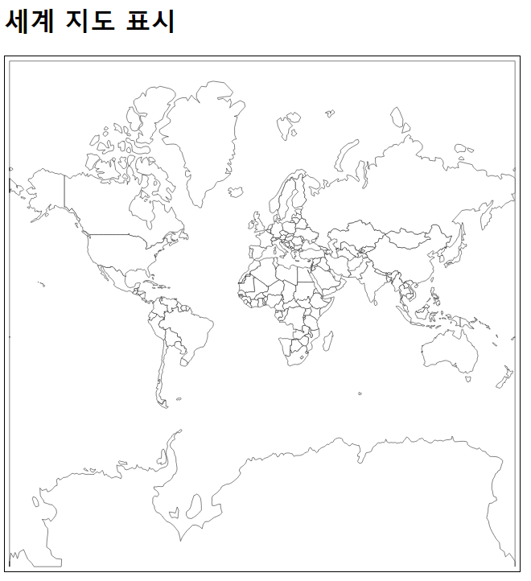
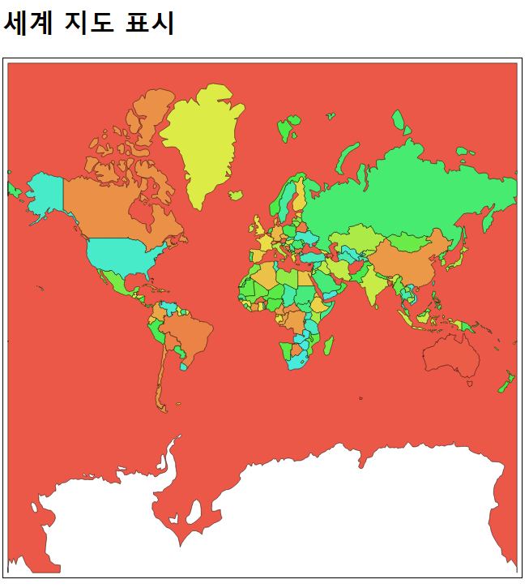
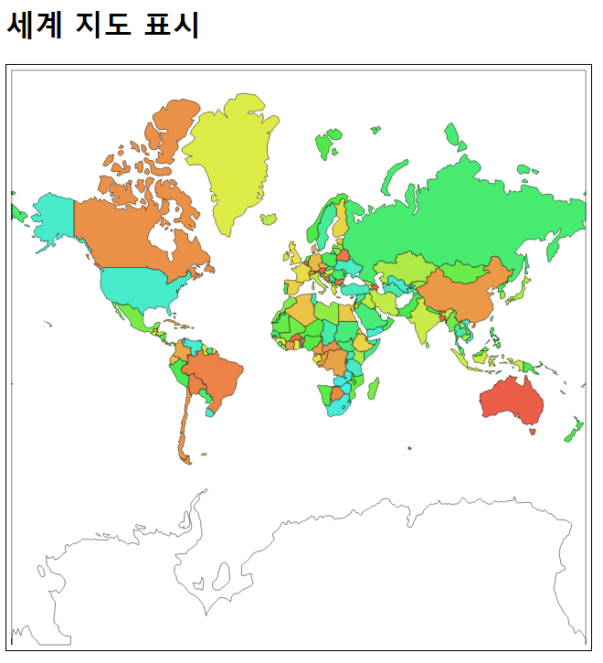
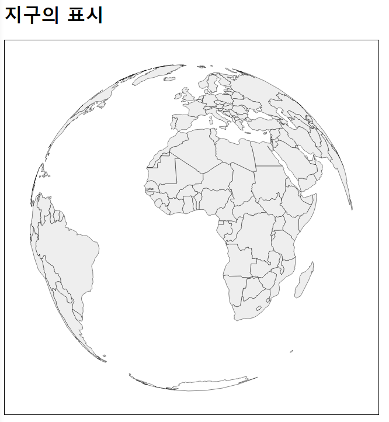

## 지도/맵 레이아웃
[TOC]


### D3.js로 다룰 수 있는 지도의 종류

* 지도 데이터 변환

### 세계 지도 표시

* D3.js 라이브러리 다음에 projection 라이브러리를 불러옴
  * ```javascript
    <script src="http://d3js.org/d3.geo.projection.v0.min.js"></script>
    ```
    ​

* 지도의 CSS 스타일 지정
  * ```css
    path { fill: white; stroke: black; stroke-width: 0.5; }
    ```
    ​

* projection() 메서드로 투영 방법과 표시할 축척이나 표시 위치 등을 지정
  * ```javascript
    var path = d3.geo.path()
    .projection(
      	d3.geo.mercator()
        .translate([svgWidth/2, svgHeight/2])
        .scale(100)
    )
    ```
    ​

* GeoJSON 형식의 지도 데이터 읽어들임
  * ```javascript
    d3.select("#myGraph")
        .selectAll("path")
        .data(world.features)
        .enter()
        .append("path")
        .attr("d", path)
    ```
    ​

* 세계 지도 표시
  * ```xml
    <!DOCTYPE html>
    <html>
        <head>
            <meta charset="utf-8">
            <title>Sample</title>
            <script src="http://d3js.org/d3.v3.min.js" charset="utf-8"></script>
            <script src="http://d3js.org/d3.geo.projection.v0.min.js"></script>
            <style>
                svg { width: 640px; height: 640px; border: 1px solid black; background-color: #fff; }
                path { fill : white; stroke: black; stroke-width: 0.5; }
            </style>
        </head>
        <body>
            <h1>세계 지도 표시</h1>
            <svg id="myGraph"></svg>
            <script src="js/sample.js"></script>
        </body>
    </html>
    ```

  * ```javascript
    var svgWidth = 640;	// SVG요소의 넓이
    var svgHeight = 640;	// SVG요소의 높이
    var path = d3.geo.path()	// 지도의 패스 생성
      .projection(
            d3.geo.mercator()   // 투영 방법을 메르카토르 도법으로 설정
          .translate([svgWidth/2, svgHeight/2])	// 화면에서의 표시 위치 조정
          .scale(100)	// 축척 지정
        )
    // 세계 지도 데이터를 불러옴
    d3.json("data/world.json", function(error, world) {
        d3.select("#myGraph")
          .selectAll("path")	// path 요소 지정
          .data(world.features)	// 데이터를 저장
          .enter()
          .append("path")	// path를 추가
          .attr("d", path)	// 지형 데이터 설정
    })
    ```
    * 

**나라마다 다른 색으로 표시**

* 나라마다 칠하기 색을 달리하여 세계 지도를 표시(겉모양을 조정하기 전 코드)
  * ```xml
    <!DOCTYPE html>
    <html>
        <head>
            <meta charset="utf-8">
            <title>Sample</title>
            <script src="http://d3js.org/d3.v3.min.js" charset="utf-8"></script>
            <script src="http://d3js.org/d3.geo.projection.v0.min.js"></script>
            <style>
                svg { width: 640px; height: 640px; border: 1px solid black; background-color: #fff; }
                path { fill : white; stroke: black; stroke-width: 0.5; }
            </style>
        </head>
        <body>
            <h1>세계 지도 표시</h1>
            <svg id="myGraph"></svg>
            <script src="js/sample.js"></script>
        </body>
    </html>
    ```

  * ```javascript
    var svgWidth = 640;// SVG요소의 넓이
    var svgHeight = 640;	// SVG요소의 높이
    var path = d3.geo.path()	// 지도의 패스 생성
      .projection(
            d3.geo.mercator()   // 투영 방법을 메르카토르 도법으로 설정
          .translate([svgWidth/2, svgHeight/2])	// 화면에서의 표시 위치 조정
          .scale(100)	// 축척 지정
        )
    // 세계 지도 데이터를 불러옴
    d3.json("data/world.json", function(error, world) {
        d3.select("#myGraph")
          .selectAll("path")	// path 요소 지정
          .data(world.features)	// 데이터를 저장
          .enter()
          .append("path")	// path를 추가
          .attr("d", path)	// 지형 데이터 설정
          .style("fill", function(d, i){
                return "hsl("+i+", 80%, 60%)";	// 색 설정
            })
    })
    ```
    * 

* 남극은 흰색으로 표시
  * ```javascript
    if (d.properties.name == "Antarctica") {
    	return "#fff";
    }
    ```

* 나라마다 칠하기 색을 달리하여 세계 지도를 표시(겉모양을 조정한 코드)
  * ```xml
    <!DOCTYPE html>
    <html>
        <head>
            <meta charset="utf-8">
            <title>Sample</title>
            <script src="http://d3js.org/d3.v3.min.js" charset="utf-8"></script>
            <script src="http://d3js.org/d3.geo.projection.v0.min.js"></script>
            <style>
                svg { width: 640px; height: 640px; border: 1px solid black; background-color: #fff; }
                path { fill : white; stroke: black; stroke-width: 0.5; }
            </style>
        </head>
        <body>
            <h1>세계 지도 표시</h1>
            <svg id="myGraph"></svg>
            <script src="js/sample.js"></script>
        </body>
    </html>
    ```

  * ```javascript
    var svgWidth = 640;	// SVG요소의 넓이
    var svgHeight = 640;	// SVG요소의 높이
    var path = d3.geo.path()	// 지도의 패스 생성
      .projection(
            d3.geo.mercator()   // 투영 방법을 메르카토르 도법으로 설정
          .translate([svgWidth/2, svgHeight/2])	// 화면에서의 표시 위치 조정
          .scale(100)	// 스케일 지정
        )
    // 세계 지도의 데이터를 불러옴
    d3.json("data/world.json", function(error, world) {
        d3.select("#myGraph")
          .selectAll("path")	// path 요소 지정
          .data(world.features)	// 데이터를 저장
          .enter()
          .append("path")	// path를 추가
          .attr("d", path)	// 지형 데이터 설정
          .style("fill", function(d, i){
                if (d.properties.name == "Antarctica"){	// 남극일 때의 처리
                    return "#fff";
                }
                return "hsl("+i+", 80%, 60%)";	// 색 설정
            })
    })
    ```
    * 

* 한국만 색을 바꾸어 세계 지도를 표시
  * ```xml
    <!DOCTYPE html>
    <html>
        <head>
            <meta charset="utf-8">
            <title>Sample</title>
            <script src="http://d3js.org/d3.v3.min.js" charset="utf-8"></script>
            <script src="http://d3js.org/d3.geo.projection.v0.min.js"></script>
            <style>
                svg { width: 640px; height: 640px; border: 1px solid black; background-color: #fff; }
                path { fill : white; stroke: black; stroke-width: 0.5; }
            </style>
        </head>
        <body>
            <h1>세계 지도 표시</h1>
            <svg id="myGraph"></svg>
            <script src="js/sample.js"></script>
        </body>
    </html>
    ```

  * ```javascript
    var svgWidth = 640;// SVG요소의 넓이
    var svgHeight = 640;	// SVG요소의 높이
    var path = d3.geo.path()	// 지도의 패스 생성
      .projection(
            d3.geo.mercator()   // 투영 방법을 메르카토르 도법으로 설정
          .translate([svgWidth/2, svgHeight/2])	// 화면에서의 표시 위치 조정
          .scale(100)	// 스케일 지정
        )
    // 세계 지도 데이터를 불러옴
    d3.json("data/world.json", function(error, world) {
        d3.select("#myGraph")
          .selectAll("path")	// path 요소 지정
          .data(world.features)	// 데이터를 저장
          .enter()
          .append("path")	// path를 추가
          .attr("d", path)	// 지형 데이터 설정
          .style("fill", function(d, i){
                if (d.properties.name == "Antarctica"){	// 남극일 때의 처리
                    return "#fff";
                }
                if (d.properties.name == "Korea"){	// 한국일 때의 처리
                    return "red";
                }
                return "#eee";	// 한국 이외는 회색으로
            })
    })
    ```
    * 

### 지구 표시

*   지도 데이터를 공 모양으로 매핑
    * ```javascript
      var path = d3.geo.path()
      	.projection(
          d3.geo.orthographic()
          .translate([svgWidth/2, svgHeight/2])
          .clipAngle(90)
          .scale(280)
          )
      ```


*   지구의 표시
    * ```xml
      <!DOCTYPE html>
      <html>
        <head>
            <meta charset="utf-8">
            <title>Sample</title>
            <script src="http://d3js.org/d3.v3.min.js" charset="utf-8"></script>
            <script src="http://d3js.org/d3.geo.projection.v0.min.js"></script>
            <style>
                svg { width: 640px; height: 640px; border: 1px solid black; background-color: #fff; }
                path { fill : white; stroke: black; stroke-width: 0.5; }
            </style>
        </head>
        <body>
            <h1>지구의 표시</h1>
            <svg id="myGraph"></svg>
            <script src="js/sample.js"></script>
        </body>
      </html>
      ```

    * ```javascript
          var svgWidth = 640;	// SVG요소의 넓이
          var svgHeight = 640;	// SVG요소의 높이
          var path = d3.geo.path()	// 지도의 패스 생성
            .projection(
                  d3.geo.orthographic()   // 투영 방법을 Orthographic에 설정
                .translate([svgWidth/2, svgHeight/2])	// 화면에서의 표시 위치 조정
                .clipAngle(90)	// 클립 범위 지정
                .scale(280)	// 축척 지정
              )
          // 지구의 데이터를 불러옴
          d3.json("data/world.json", function(error, world) {
              d3.select("#myGraph")
                .selectAll("path")	// path 요소 지정
                .data(world.features)	// 데이터를 저장
                .enter()
                .append("path")	// path를 추가
                .attr("d", path)	// 지형 데이터 설정
                .style("fill", function(d, i){
                      if (d.properties.name == "Antarctica"){	// 남극일 때의 처리
                          return "#fff";
                      }
                      if (d.properties.name == "Korea"){	// 한국일 때의 처리
                          return "red";
                      }
                      return "#eee";	// 한국 이외는 회색으로
                  })
          })
      ```
      * 


**지구를 회전**

* 투영 방법과 패스 부분을 별도의 변수에 넣음
  * ```javascript
    var earth = d3.geo.orthographic()   // 투영 방법을 Orthographic에 설정
      .translate([svgWidth/2, svgHeight/2])	// 화면에서의 표시 위치 조정
      .clipAngle(90)	// 클립 범위 지정
      .scale(280)	// 척도 지정
      .rotate([degree, -25])	// 회전 각도 지정
    ```

* 회전 각도를 변수에 넣음

  * ```javascript
    var degree = 0;
    ```

* 지구를 회전하는 처리

  * ```javascript
    d3.timer(function() {
      earth.rotate([degree, -25]);
      degree = degree + 2;
      earthPath.attr("d", path);
    })
    ```

* 지구를 표시하고 회전함

  * ```html
    <!DOCTYPE html>
    <html>
    	<head>
    		<meta charset="utf-8">
    		<title>Sample</title>
    		<script src="http://d3js.org/d3.v3.min.js" charset="utf-8"></script>
    		<script src="http://d3js.org/d3.geo.projection.v0.min.js"></script>
    		<style>
    			svg { width: 640px; height: 640px; border: 1px solid black; background-color: #fff; }
    			path { fill : white; stroke: black; stroke-width: 0.5; }
    		</style>
    	</head>
    	<body>
    		<h1>지구의 표시</h1>
    		<svg id="myGraph"></svg>
    		<script src="js/sample.js"></script>
    	</body>
    </html>
    ```

  * ```javascript
    var svgWidth = 640;	// SVG요소의 넓이
    var svgHeight = 640;	// SVG요소의 높이
    var degree = 0;	// 회전 각도
    var earth = d3.geo.orthographic()   // 투영 방법을 Orthographic에 설정
      .translate([svgWidth/2, svgHeight/2])	// 화면에서의 표시 위치 조정
      .clipAngle(90)	// 클립 범위 지정
      .scale(280)	// 척도 지정
      .rotate([degree, -25])	// 회전 각도 지정
    var path = d3.geo.path()	// 패스와 투영 방법 설정
      .projection(earth)
    // 지구의 데이터를 불러옴
    d3.json("data/world.json", function(error, world) {
    	var earthPath = d3.select("#myGraph")
    	  .selectAll("path")	// path 요소 지정
    	  .data(world.features)	// 데이터를 저장
    	  .enter()
    	  .append("path")	// path를 추가
    	  .attr("d", path)	// 지형 데이터 설정
    	  .style("fill", function(d, i){
    			if (d.properties.name == "Antarctica"){	// 남극일 때의 처리
    				return "#fff";
    			}
    			if (d.properties.name == "Korea"){	// 한국일 때의 처리
    				return "red";
    			}
    			return "#eee";	// 한국 이외는 회색으로
    		})
    	// 타이머를 사용하여 지구를 회전시킴
    	d3.timer(function(){
    		earth.rotate([degree, -25]);	// 각도 설정
    		degree = degree + 2;	// 2도씩 움직임
    		earthPath.attr("d", path)	// 지형 데이터 설정
    	});
    })
    ```


**지구를 푸른 구로 만듦**

* 지구의 구가되는 푸른 원을 그림

  * ```javascript
    d3.select()
    .append("circle")
    .attr("cx", svgWidth/2)
    .attr("cy", svgHeight/2)
    .attr("r", earthSize)
    .style("fill", "blue")
    ```

* 세계 지도 표시

  * ```html
    <!DOCTYPE html>
    <html>
    	<head>
    		<meta charset="utf-8">
    		<title>Sample</title>
    		<script src="http://d3js.org/d3.v3.min.js" charset="utf-8"></script>
    		<script src="http://d3js.org/d3.geo.projection.v0.min.js"></script>
    		<style>
    			svg { width: 640px; height: 640px; border: 1px solid black; background-color: #fff; }
    			path { fill : white; stroke: black; stroke-width: 0.5; }
    		</style>
    	</head>
    	<body>
    		<h1>지구의 표시</h1>
    		<svg id="myGraph"></svg>
    		<script src="js/sample.js"></script>
    	</body>
    </html>
    ```

  * ```javascript
    var svgWidth = 640;	// SVG요소의 넓이
    var svgHeight = 640;	// SVG요소의 높이
    var degree = 0;	// 회전 각도
    var earthSize = 280;	// 지구의 크기
    var earth = d3.geo.orthographic()   // 투영 방법을 Orthographic에 설정
      .translate([svgWidth/2, svgHeight/2])	// 화면에서의 표시 위치 조정
      .clipAngle(90)	// 클립 범위 지정
      .scale(earthSize)	// 척도 지정
      .rotate([degree, -25])	// 회전 각도 지정
    var path = d3.geo.path()	// 패스와 투영 방법 설정
      .projection(earth)
    // 지구의 데이터를 불러옴
    d3.json("data/world.json", function(error, world) {
    	d3.select("#myGraph")
    	  .append("circle")	// 지구는 원형이므로 원을 추가
    	  .attr("cx", svgWidth/2)	// 표시 화면의 가운데를 중심 X 좌표로 함
    	  .attr("cy", svgHeight/2)	// 표시 화면의 가운데를 중심 Y 좌표로 함
    	  .attr("r", earthSize)	// 표시할 지구의 반지름을 지정
    	  .style("fill", "blue")	// 푸른 지구로 함
    	var earthPath = d3.select("#myGraph")
    	  .selectAll("path")	// path 요소 지정
    	  .data(world.features)	// 데이터를 저장
    	  .enter()
    	  .append("path")	// path를 추가
    	  .attr("d", path)	// 지형 데이터 설정
    	  .style("fill", function(d, i){
    			if (d.properties.name == "Antarctica"){	// 남극일 때의 처리
    				return "#fff";
    			}
    			if (d.properties.name == "Korea"){	// 한국일 때의 처리
    				return "red";
    			}
    			return "#eee";	// 한국 이외는 회색으로
    		})
    	// 타이머를 사용하여 지구를 회전시킴
    	d3.timer(function(){
    		earth.rotate([degree, -25]);	// 각도 설정
    		degree = degree + 2;	// 2도씩 움직임
    		earthPath.attr("d", path)	// 지형 데이터 설정
    	});
    })
    ```