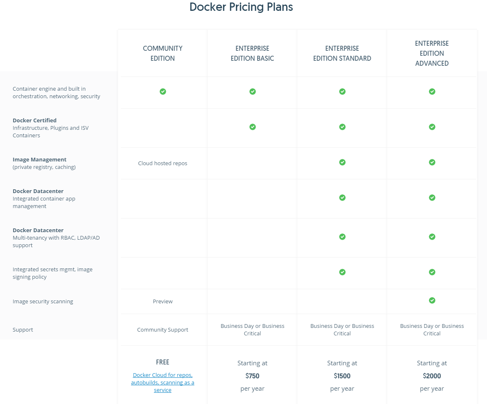
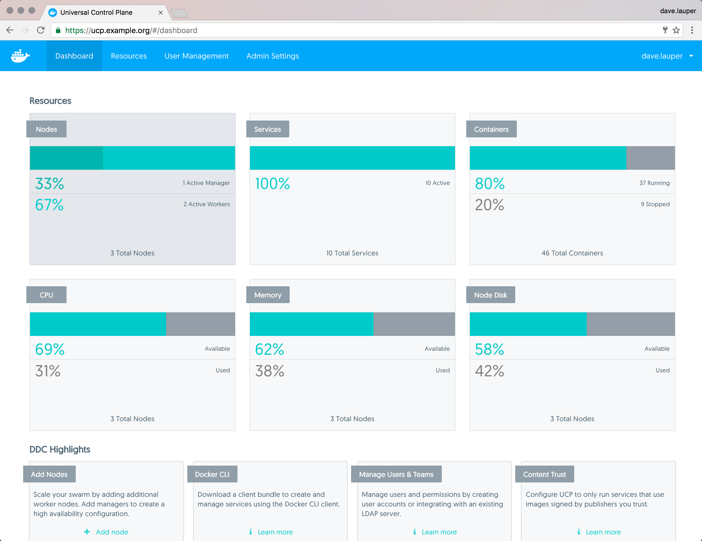
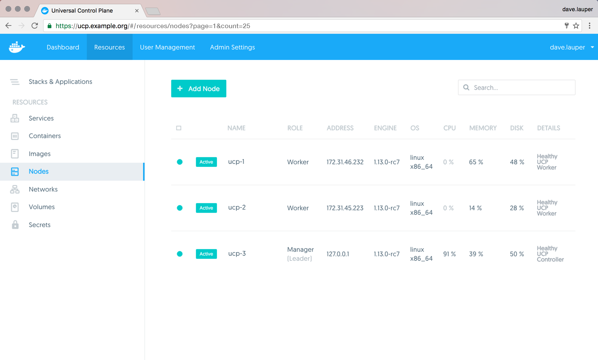
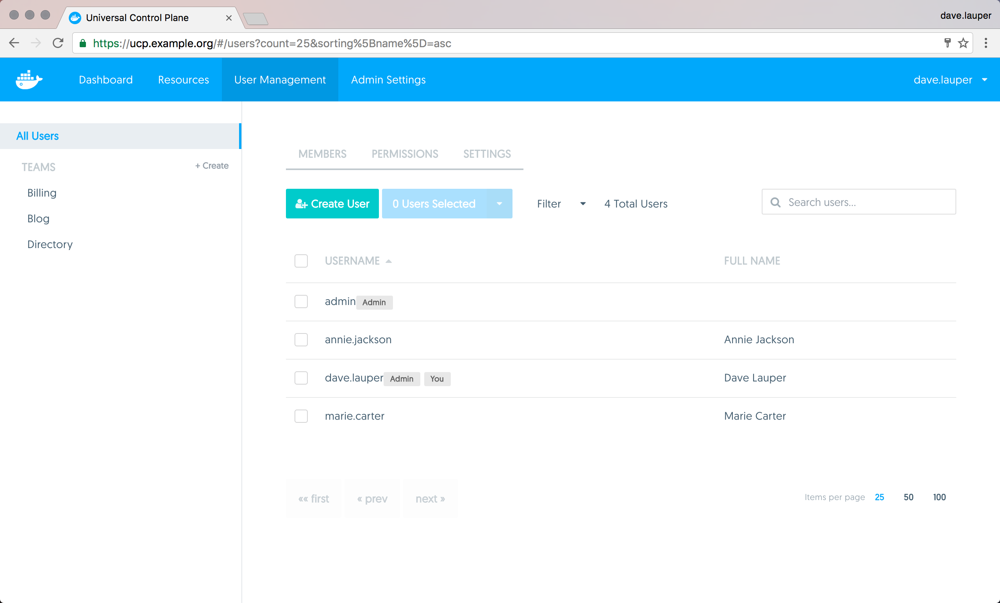

# Docker Enterprise 가격 정책



* Enterprise를 사용할 경우 평일 오전 9시~오후 6시까지 서포트를 받을 수 있음.
  * 한국 시간이 아닌 현지 시간임에 주의.
* 심각도에 따라 2/4/12시간 이내로 답변
  * Urgent(P1) : 라이브 환경에서 운영에 심각한 영향을 미치는 모든 사건. 일반적으로 작업이 중단되고 이를 다시 복구할 수 있는 방법이 없는 경우.
  * High(P2) : 라이브 환경에서 중대한 영향을 주거나 비중이 작은 비즈니스 운영이라 하더라도 심각한 영향을 미치는 모든 사건. 일반적으로 작동은 되지만 성능이 저하 된 상태이며 회복이 되지 않는 상황
  * Normal(P3) : 비즈니스 운영에 중대한 영향을 미치는 모든 사건. 일반적으로 작업은 작동은 되지만 기능을 제대로 사용할 수 없는 경우.
  * Low(P4) : 비즈니스 운영에는 거의 영향을 미치지 않는 모든 사건. 일반적으로 제품 향상을 위한 문의.
* Support 사이트나 Email, 핸드폰으로 연락을 받을 수 있음.
* 하루에 기본 4번의 문의 가능
* 심각한 사항인 경우 하루 8번까지 가능
* Community 버전을 사용하는 경우 모든 지원은 온라인 도커 사용자 커뮤니티 사이트를 통해서만 가능.


# Docker Datacenter

Docker Datacenter는 Docker API를 지원하며 Engine 및 Swarm과 같은 Docker 오픈 소스 프로젝트를 플랫폼에 직접 포함한다. 즉, 앱 개발자가 간단하게 도커 작성 명령을 사용하여 Docker Compose를 UCP로 직접 정의할 수 있다. 

## Universal Control Plane (UCP)

Docker Universal Control Plane (UCP)은 Docker의 엔터프라이즈 급 클러스터 관리 솔루션이며, 온 - 프레미스 또는 가상 사설 클라우드에 설치하면 Docker 클러스터 및 응용 프로그램을 한 곳에서 관리 할 수 있다.




### 중앙 집중식 클러스터 관리 (Centralized cluster management)

* Docker를 사용하면 최대 수천 개의 실제 또는 가상 시스템을 결합하여 컨테이너 클러스터를 만들 수 있으므로 응용 프로그램을 대규모로 배포 할 수 있다. 
* Docker Universal Control Plane은 Docker가 제공하는 기능을 확장하여 클러스터를 중앙에서 쉽게 관리 할 수 있도록 한다.
* 그래픽 UI를 사용하여 컨테이너 클러스터를 관리하고 모니터링 할 수 있다.



* UCP는 표준 Docker API를 제공하므로 Docker CLI 클라이언트를 비롯하여 이미 알고있는 도구를 계속 사용하여 응용 프로그램을 배포하고 관리 할 수 있다.

  * 예를 들어 docker info 명령을 사용하여 UCP가 관리하는 Docker 클러스터의 상태를 확인 가능.

    ```
    $ docker info

    Containers: 30
    Images: 24
    Server Version: ucp/2.0.1
    Role: primary
    Strategy: spread
    Filters: health, port, containerslots, dependency, affinity, constraint
    Nodes: 2
      ucp-node-1: 192.168.99.100:12376
        └ Status: Healthy
        └ Containers: 20
      ucp-node-2: 192.168.99.101:12376
        └ Status: Healthy
        └ Containers: 10
    ```


### 배포, 관리 및 모니터링

* 노드, 볼륨 및 네트워크와 같은 모든 컴퓨팅 리소스를 중앙 집중식으로 관리
* 응용 프로그램과 서비스를 배포하고 모니터링 


### 내장 보안 및 액세스 제어 (Built-in security and access control)

Docker UCP에는 고유 한 인증 메커니즘이 있으며 LDAP 서비스와 통합 되고, Role Based Access Control (RBAC) 기능을 제공하므로 클러스터 및 응용 프로그램에 접근할 수 있는 사용자를 관리할 수 있다.



* Docker UCP는 Docker Trusted Registry와 통합되므로 Docker 이미지를 방화벽 뒤에서 안전하게 사용할 수 있다.
* 보안 정책을 통해 이미 등록되어 신뢰할 수 있는 Docker 이미지를 사용하는 응용프로그램만 허용하도록 할 수 있다.


## Docker Trusted Registry(DTR)

### 이미지 관리

* DTR은 on-premises 환경 또는 가상 사설 클라우드에 설치할 수 있다.
  * 방화벽을 사용하여 Docker 이미지를 안전하게 저장
* DTR은 지속적인 통합과 지속적인 전달 프로세스의 일부로 응용 프로그램을 작성, 배송 및 실행하는 데 사용할 수 있다.
* DTR에는 승인 된 사용자가 도커 이미지를 탐색 할 수있게 해주는 웹 기반 사용자 인터페이스를 제공.
  * 누가 언제 어떤 이미지를 푸시했는지에 대한 정보 제공
  * 이미지를 생성하는 데 사용 된 dockerfile 행을 볼 수 있음.
  * security scanning을 사용하는 경우 이미지에 설치된 모든 소프트웨어 목록을 볼 수 있음.


### 내장 액세스 제어 (Built-in access control)

* DTR은 Docker Universal Control Plane과 동일한 인증 메커니즘을 사용
* 사용자는 수동으로 관리하거나 LDAP 또는 Active Directory에서 조정할 수 있다. 
* DTR은 Role Based Access Control (RBAC)를 사용하여 Docker 이미지에 액세스 할 수있는 사용자를 위해 세분화 된 액세스 제어 정책을 구현할 수 있다.


### 보안 검색 (Security Scanner)

* DTR에는 이미지에서 사용되는 소프트웨어 버전을 확인하는 데 사용할 수있는  security scanner를 내장하고 있음.
* 가장 중요한 용도는 각 레이어를 스캔하고 집계한 정보로 소프트웨어의 정기적 인 업데이트를 통해 최신 상태를 유지하여 취약점을 제거하는 것.


### 이미지 서명 (Image Signing)

* DTR에는 Docker Content Trust를 사용하여 이미지에 서명하고 확인할 수 있도록 공증인이 기본 제공됨


