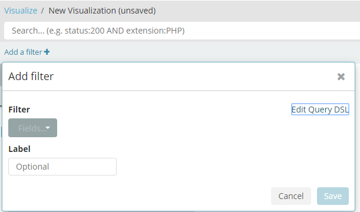

* 문서가 색인되면 각 노드의 레플리카로 복제되는데 주 노드와 레플리카간의 싱크는 잘 맞을까?

  * 문서가 색인 될 때 아래와 같은 과정을 거친다.
    1. 색인 요청을 받은 일래스틱서치 노드는 우선 문서를 색인할 샤드를 선택한다.
       * 각 문서에 대해 샤드는 그 문서의 ID 문자열을 해싱해서 결정
       * 각 샤드는 동등하게 새로운 문서를 받을 기회와 함께 동등한 해시 범위를 갖는다.
    2. 대상 샤드가 결정되면 현재 노드는 샤드를 소유한 노드로 문서를 전달한다.
    3. 샤드의 모든 복제 때문에 색인 작업이 다시 수행된다.
    4. 색인 명령은 모든 가능한 레플리카가 문서를 색인한 후에 성공적으로 반환한다.
    5. 검색 요청이 들어오면 요청 받은 노드는 모든 데이터를 포함한 샤드에 요청을 전달한다.
       * 라운드 로빈 방식을 사용해서 이용 가능한 주 혹은 레플리카 샤드를 선택하고 검색 요청을 전달.
       * 여러 노드로 요청이 분산되고 부분 부분 결과를 수집
    6. 일래스틱 서치는 샤드들로부터 결과를 모아서 하나의 응답으로 집계 후에 클라이언트 애플리케이션에 응답을 전달한다.
  * 이와 같이 레플리카에까지 색인이 완료되어야 성공적으로 반환되기 때문에 싱크는 항상 맞을 수 밖에 없다. 
  * 대신 레플리카가 많을 수록 각각이 색인 작업이 필요하기 때문에 색인에 들어가는 시간이 오래 소요될 것이다.

* 각 노드별로 색인이 샤드에 분산되어 저장된 상태로 데이터가 많이 쌓인 상황에서 새로운 노드가 추가되면 이에 대한 균형은 어떻게 맞출까?

* 필드에 대한 매핑 정보가 정해지면 이 후에 변경이 불가능한가? 변경 하고 싶다면?

* kibana의 Add a filter 기능에서 Query DSL은 무엇일까?

  

  * 일래스틱 서치는 JSON 포맷으로 모든 검색 기준을 명시하도록 해준다.

  * 그러므로 아래와 같은 형식으로 쿼리를 요청 결과로 필터링 할 수 있다.

    ```json
    {
      "query": {
        "query_string": {
          "query": "yongho*"
        }
      }
    }
    ```

  * REST 방식을 사용하는 것보다 JSON을 사용할 경우 더 많은 조건을 명시할 수 있다는 장점이 있다.

  * 공백을 구분으로 기본으로 지정한 필드를 And 연산으로 찾는 예

    ```json
    {
      "query": {
        "query_string": {
          "query": "yongho1 yongho2 yongho3",
          "default_field": "nickname",
          "default_operator": "AND"
        }
      }
    }
    ```

    * 위 쿼리는 다음과 같다.

      ```
      "query": "nickname:yongho1 AND nickname:yongho2 AND nickname:yongho3"
      ```

  * 단어만 찾는 것이 목적인 경우 term 쿼리 사용

    ```json
    {
      "query": {
        "term": {
          "nickname": "yongho1"
        }
      }
    }
    ```

  * 점수 상관 없이 일치하는 지가 목적인 경우 filter 쿼리 사용

    ```json
    {
      "query": {
        "bool": {
          "filter": {
            "term" : {
              "nickname": "yongho1" 
            }
          }
        }
      }
    }
    ```

    * 다른 쿼리보다 빠르고 쉽게 캐시에 저장할 수 있다.
    * 책에서는 filtered로 되어 있는데 최신 버전에서는 bool로 변경되었다.

  * 집계를 통해 통계를 얻기위한 목적인 경우 aggregations 사용

    ```json
    {
      "aggregations": {
        "test": {
          "terms": {
            "field": "nickname.keyword"
          }
        }
      }
    }
    ```

    * test라 명시한 부분은 집계를 명명한 이름. (임의로 지정 가능)

    * terms 하위의 field는 예약어로 해당 타입 내 필드를 명시한다.

    * 여기서 nickname에 keyword를 명시하지 않으면 text로 취급되어 아래와 같은 에러가 발생한다.

      ```json
      {
        "error": {
          "root_cause": [
            {
              "type": "illegal_argument_exception",
              "reason": "Fielddata is disabled on text fields by default. Set fielddata=true on [nickname] in order to load fielddata in memory by uninverting the inverted index. Note that this can however use significant memory. Alternatively use a keyword field instead."
            }
          ]
        ... 생략 ...
        }
      }
      ```

    * 결과

      ```json
      "aggregations": {
          "test": {
            "doc_count_error_upper_bound": 33,
            "sum_other_doc_count": 2908,
            "buckets": [
              {
                "key": "승기12",
                "doc_count": 121
              },
              {
                "key": "5000",
                "doc_count": 98
              },
              {
                "key": "선명190",
                "doc_count": 96
              },
              {
                "key": "test02",
                "doc_count": 76
              },
              {
                "key": "선명150",
                "doc_count": 66
              },
              {
                "key": "노승현컴퓨터",
                "doc_count": 60
              },
              {
                "key": "aa",
                "doc_count": 58
              },
              {
                "key": "승기14",
                "doc_count": 53
              },
              {
                "key": "테스트777",
                "doc_count": 43
              },
              {
                "key": "승기02",
                "doc_count": 38
              }
            ]
          }
        }
      ```

      ​