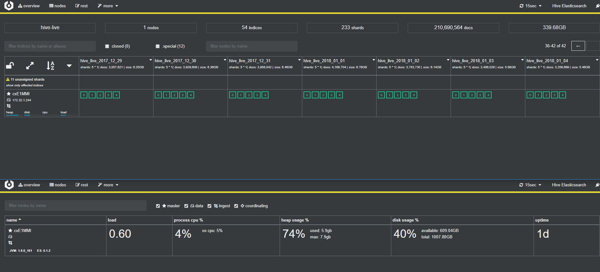
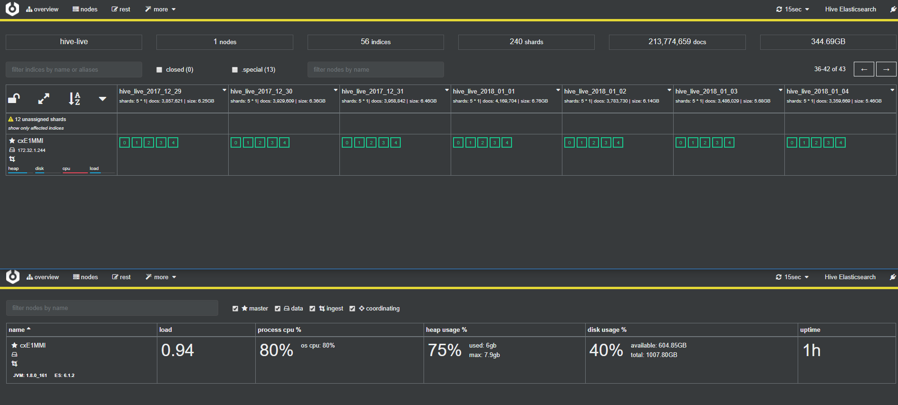

엘라스틱서치로 한대의 머신에서 어느정도 메모리가 차야 CPU에 부하가 발생하는지를 테스트해보았는데, Xms로  설정한 힙 사이즈 Max치의 70%까지는 원활하게 동작했는데, 이 이상이 되면서 부터 GC가 발생하며 CPU에 부하가 발생하기 시작했다. 


### celebro를 통해 모니터링

* 원활한 상태

  

* 부하 상태

  


### 테스트 사양

* 머신 사양

  ```
  r4.large
  CPU : 2
  메모리 : 16GB
  ```

* 원활할 때 인덱싱 상태

  ```
  heap usage : 5.8GB
  total heap : 8GB
  Indice : 49
  shards : 208
  docs : 191,867,020
  disk usage : 309.15GB
  ```

* 부하 발생 시점 인덱싱 상태

  ```
  heap usage : 6.4GB
  total heap : 8GB
  Indice : 58
  shards : 253
  docs : 224,508,611
  disk usage : 362.15GB
  ```

  ​

검색 서비스를 제공하는건 아니라서 캐시 옵션들은 최소화 한 상태인데 여기서 더 메모리 사용량을 줄이고 싶어서 조금 더 찾아보았다.

너무 많은 데이터를 색인을 했더니 위와 같이 원활한 상태에서도 엘라스틱서치 프로세스를 재실행 했을 때는 처음 데이터들을 메모리에 올리면서 과부하가 발생하였다. 그러면서 구동 시 다음과 같은 Exception들이 발생하였다.

```
[2018-02-01T07:43:28,674][INFO ][o.e.n.Node               ] [] initializing ...
[2018-02-01T07:43:28,810][INFO ][o.e.e.NodeEnvironment    ] [cxE1MMI] using [1] data paths, mounts [[/ (/dev/xvda1)]], net usable_space [609gb], net total_space [1007.8gb], types [ext4]
[2018-02-01T07:43:28,811][INFO ][o.e.e.NodeEnvironment    ] [cxE1MMI] heap size [7.9gb], compressed ordinary object pointers [true]
[2018-02-01T07:43:29,452][INFO ][o.e.n.Node               ] node name [cxE1MMI] derived from node ID [cxE1MMIOQSmpfEC9tErajQ]; set [node.name] to override
[2018-02-01T07:43:29,452][INFO ][o.e.n.Node               ] version[6.1.2], pid[25614], build[5b1fea5/2018-01-10T02:35:59.208Z], OS[Linux/4.4.0-112-generic/amd64], JVM[Oracle Corporation/Java HotSpot(TM) 64-Bit Server VM/1.8.0_161/25.161-b12]
[2018-02-01T07:43:29,452][INFO ][o.e.n.Node               ] JVM arguments [-Xms8g, -Xmx8g, -XX:+UseConcMarkSweepGC, -XX:CMSInitiatingOccupancyFraction=75, -XX:+UseCMSInitiatingOccupancyOnly, -XX:+AlwaysPreTouch, -Xss1m, -Djava.awt.headless=true, -Dfile.encoding=UTF-8, -Djna.nosys=true, -XX:-OmitStackTraceInFastThrow, -Dio.netty.noUnsafe=true, -Dio.netty.noKeySetOptimization=true, -Dio.netty.recycler.maxCapacityPerThread=0, -Dlog4j.shutdownHookEnabled=false, -Dlog4j2.disable.jmx=true, -XX:+HeapDumpOnOutOfMemoryError, -Des.path.home=/home/ubuntu/programs/elasticsearch-6.1.2-2, -Des.path.conf=/home/ubuntu/programs/elasticsearch-6.1.2-2/config]
[2018-02-01T07:43:33,355][INFO ][o.e.p.PluginsService     ] [cxE1MMI] loaded module [aggs-matrix-stats]
[2018-02-01T07:43:33,356][INFO ][o.e.p.PluginsService     ] [cxE1MMI] loaded module [analysis-common]
[2018-02-01T07:43:33,356][INFO ][o.e.p.PluginsService     ] [cxE1MMI] loaded module [ingest-common]
[2018-02-01T07:43:33,356][INFO ][o.e.p.PluginsService     ] [cxE1MMI] loaded module [lang-expression]
[2018-02-01T07:43:33,357][INFO ][o.e.p.PluginsService     ] [cxE1MMI] loaded module [lang-mustache]
[2018-02-01T07:43:33,357][INFO ][o.e.p.PluginsService     ] [cxE1MMI] loaded module [lang-painless]
[2018-02-01T07:43:33,357][INFO ][o.e.p.PluginsService     ] [cxE1MMI] loaded module [mapper-extras]
[2018-02-01T07:43:33,357][INFO ][o.e.p.PluginsService     ] [cxE1MMI] loaded module [parent-join]
[2018-02-01T07:43:33,358][INFO ][o.e.p.PluginsService     ] [cxE1MMI] loaded module [percolator]
[2018-02-01T07:43:33,358][INFO ][o.e.p.PluginsService     ] [cxE1MMI] loaded module [reindex]
[2018-02-01T07:43:33,358][INFO ][o.e.p.PluginsService     ] [cxE1MMI] loaded module [repository-url]
[2018-02-01T07:43:33,358][INFO ][o.e.p.PluginsService     ] [cxE1MMI] loaded module [transport-netty4]
[2018-02-01T07:43:33,359][INFO ][o.e.p.PluginsService     ] [cxE1MMI] loaded module [tribe]
[2018-02-01T07:43:33,359][INFO ][o.e.p.PluginsService     ] [cxE1MMI] loaded plugin [repository-s3]
[2018-02-01T07:43:33,360][INFO ][o.e.p.PluginsService     ] [cxE1MMI] loaded plugin [x-pack]
[2018-02-01T07:43:36,380][INFO ][o.e.x.m.j.p.l.CppLogMessageHandler] [controller/25662] [Main.cc@128] controller (64 bit): Version 6.1.2 (Build 258b02b7b1f613) Copyright (c) 2018 Elasticsearch BV
[2018-02-01T07:43:38,601][INFO ][o.e.d.DiscoveryModule    ] [cxE1MMI] using discovery type [zen]
[2018-02-01T07:43:39,466][INFO ][o.e.n.Node               ] initialized
[2018-02-01T07:43:39,467][INFO ][o.e.n.Node               ] [cxE1MMI] starting ...
[2018-02-01T07:43:39,722][INFO ][o.e.t.TransportService   ] [cxE1MMI] publish_address {172.32.1.244:9300}, bound_addresses {[::]:9300}
[2018-02-01T07:43:39,959][INFO ][o.e.b.BootstrapChecks    ] [cxE1MMI] bound or publishing to a non-loopback address, enforcing bootstrap checks
[2018-02-01T07:43:43,043][INFO ][o.e.c.s.MasterService    ] [cxE1MMI] zen-disco-elected-as-master ([0] nodes joined), reason: new_master {cxE1MMI}{cxE1MMIOQSmpfEC9tErajQ}{SNia_miyRuCj4vlKIhm2Ug}{172.32.1.244}{172.32.1.244:9300}{ml.machine_memory=16032681984, ml.max_open_jobs=20, ml.enabled=true}
[2018-02-01T07:43:43,048][INFO ][o.e.c.s.ClusterApplierService] [cxE1MMI] new_master {cxE1MMI}{cxE1MMIOQSmpfEC9tErajQ}{SNia_miyRuCj4vlKIhm2Ug}{172.32.1.244}{172.32.1.244:9300}{ml.machine_memory=16032681984, ml.max_open_jobs=20, ml.enabled=true}, reason: apply cluster state (from master [master {cxE1MMI}{cxE1MMIOQSmpfEC9tErajQ}{SNia_miyRuCj4vlKIhm2Ug}{172.32.1.244}{172.32.1.244:9300}{ml.machine_memory=16032681984, ml.max_open_jobs=20, ml.enabled=true} committed version [1] source [zen-disco-elected-as-master ([0] nodes joined)]])
[2018-02-01T07:43:43,094][INFO ][o.e.h.n.Netty4HttpServerTransport] [cxE1MMI] publish_address {172.32.1.244:9200}, bound_addresses {[::]:9200}
[2018-02-01T07:43:43,094][INFO ][o.e.n.Node               ] [cxE1MMI] started
[2018-02-01T07:43:47,199][WARN ][r.suppressed             ] path: /_stats/docs,store, params: {metric=docs,store}
org.elasticsearch.cluster.block.ClusterBlockException: blocked by: [SERVICE_UNAVAILABLE/1/state not recovered / initialized];
        at org.elasticsearch.cluster.block.ClusterBlocks.globalBlockedException(ClusterBlocks.java:165) ~[elasticsearch-6.1.2.jar:6.1.2]
        at org.elasticsearch.action.admin.indices.stats.TransportIndicesStatsAction.checkGlobalBlock(TransportIndicesStatsAction.java:68) ~[elasticsearch-6.1.2.jar:6.1.2]
        at org.elasticsearch.action.admin.indices.stats.TransportIndicesStatsAction.checkGlobalBlock(TransportIndicesStatsAction.java:45) ~[elasticsearch-6.1.2.jar:6.1.2]
        at org.elasticsearch.action.support.broadcast.node.TransportBroadcastByNodeAction$AsyncAction.<init>(TransportBroadcastByNodeAction.java:256) ~[elasticsearch-6.1.2.jar:6.1.2]
        at org.elasticsearch.action.support.broadcast.node.TransportBroadcastByNodeAction.doExecute(TransportBroadcastByNodeAction.java:234) ~[elasticsearch-6.1.2.jar:6.1.2]
        at org.elasticsearch.action.support.broadcast.node.TransportBroadcastByNodeAction.doExecute(TransportBroadcastByNodeAction.java:79) ~[elasticsearch-6.1.2.jar:6.1.2]
        at org.elasticsearch.action.support.TransportAction$RequestFilterChain.proceed(TransportAction.java:167) ~[elasticsearch-6.1.2.jar:6.1.2]
        at org.elasticsearch.action.support.TransportAction.execute(TransportAction.java:139) ~[elasticsearch-6.1.2.jar:6.1.2]
        at org.elasticsearch.action.support.TransportAction.execute(TransportAction.java:81) ~[elasticsearch-6.1.2.jar:6.1.2]
        at org.elasticsearch.client.node.NodeClient.executeLocally(NodeClient.java:83) ~[elasticsearch-6.1.2.jar:6.1.2]
        at org.elasticsearch.client.node.NodeClient.doExecute(NodeClient.java:72) ~[elasticsearch-6.1.2.jar:6.1.2]
        at org.elasticsearch.client.support.AbstractClient.execute(AbstractClient.java:405) ~[elasticsearch-6.1.2.jar:6.1.2]
        at org.elasticsearch.client.support.AbstractClient$IndicesAdmin.execute(AbstractClient.java:1253) ~[elasticsearch-6.1.2.jar:6.1.2]
        at org.elasticsearch.client.support.AbstractClient$IndicesAdmin.stats(AbstractClient.java:1574) ~[elasticsearch-6.1.2.jar:6.1.2]
        at org.elasticsearch.rest.action.admin.indices.RestIndicesStatsAction.lambda$prepareRequest$17(RestIndicesStatsAction.java:144) ~[elasticsearch-6.1.2.jar:6.1.2]
        at org.elasticsearch.rest.BaseRestHandler.handleRequest(BaseRestHandler.java:97) [elasticsearch-6.1.2.jar:6.1.2]
        at org.elasticsearch.rest.RestController.dispatchRequest(RestController.java:240) [elasticsearch-6.1.2.jar:6.1.2]
        at org.elasticsearch.rest.RestController.tryAllHandlers(RestController.java:336) [elasticsearch-6.1.2.jar:6.1.2]
        at org.elasticsearch.rest.RestController.dispatchRequest(RestController.java:174) [elasticsearch-6.1.2.jar:6.1.2]
        at org.elasticsearch.http.netty4.Netty4HttpServerTransport.dispatchRequest(Netty4HttpServerTransport.java:497) [transport-netty4-6.1.2.jar:6.1.2]
        at org.elasticsearch.http.netty4.Netty4HttpRequestHandler.channelRead0(Netty4HttpRequestHandler.java:80) [transport-netty4-6.1.2.jar:6.1.2]
        at io.netty.channel.SimpleChannelInboundHandler.channelRead(SimpleChannelInboundHandler.java:105) [netty-transport-4.1.13.Final.jar:4.1.13.Final]
        at io.netty.channel.AbstractChannelHandlerContext.invokeChannelRead(AbstractChannelHandlerContext.java:362) [netty-transport-4.1.13.Final.jar:4.1.13.Final]
        at io.netty.channel.AbstractChannelHandlerContext.invokeChannelRead(AbstractChannelHandlerContext.java:348) [netty-transport-4.1.13.Final.jar:4.1.13.Final]
        at io.netty.channel.AbstractChannelHandlerContext.fireChannelRead(AbstractChannelHandlerContext.java:340) [netty-transport-4.1.13.Final.jar:4.1.13.Final]
        at org.elasticsearch.http.netty4.pipelining.HttpPipeliningHandler.channelRead(HttpPipeliningHandler.java:68) [transport-netty4-6.1.2.jar:6.1.2]
        at io.netty.channel.AbstractChannelHandlerContext.invokeChannelRead(AbstractChannelHandlerContext.java:362) [netty-transport-4.1.13.Final.jar:4.1.13.Final]
        at io.netty.channel.AbstractChannelHandlerContext.invokeChannelRead(AbstractChannelHandlerContext.java:348) [netty-transport-4.1.13.Final.jar:4.1.13.Final]
        at io.netty.channel.AbstractChannelHandlerContext.fireChannelRead(AbstractChannelHandlerContext.java:340) [netty-transport-4.1.13.Final.jar:4.1.13.Final]
        at io.netty.handler.codec.MessageToMessageDecoder.channelRead(MessageToMessageDecoder.java:102) [netty-codec-4.1.13.Final.jar:4.1.13.Final]
        at io.netty.handler.codec.MessageToMessageCodec.channelRead(MessageToMessageCodec.java:111) [netty-codec-4.1.13.Final.jar:4.1.13.Final]
        at io.netty.channel.AbstractChannelHandlerContext.invokeChannelRead(AbstractChannelHandlerContext.java:362) [netty-transport-4.1.13.Final.jar:4.1.13.Final]
        at io.netty.channel.AbstractChannelHandlerContext.invokeChannelRead(AbstractChannelHandlerContext.java:348) [netty-transport-4.1.13.Final.jar:4.1.13.Final]
        at io.netty.channel.AbstractChannelHandlerContext.fireChannelRead(AbstractChannelHandlerContext.java:340) [netty-transport-4.1.13.Final.jar:4.1.13.Final]
        at io.netty.handler.codec.MessageToMessageDecoder.channelRead(MessageToMessageDecoder.java:102) [netty-codec-4.1.13.Final.jar:4.1.13.Final]
        at io.netty.channel.AbstractChannelHandlerContext.invokeChannelRead(AbstractChannelHandlerContext.java:362) [netty-transport-4.1.13.Final.jar:4.1.13.Final]
        at io.netty.channel.AbstractChannelHandlerContext.invokeChannelRead(AbstractChannelHandlerContext.java:348) [netty-transport-4.1.13.Final.jar:4.1.13.Final]
        at io.netty.channel.AbstractChannelHandlerContext.fireChannelRead(AbstractChannelHandlerContext.java:340) [netty-transport-4.1.13.Final.jar:4.1.13.Final]
        at io.netty.handler.codec.MessageToMessageDecoder.channelRead(MessageToMessageDecoder.java:102) [netty-codec-4.1.13.Final.jar:4.1.13.Final]
        at io.netty.channel.AbstractChannelHandlerContext.invokeChannelRead(AbstractChannelHandlerContext.java:362) [netty-transport-4.1.13.Final.jar:4.1.13.Final]
        at io.netty.channel.AbstractChannelHandlerContext.invokeChannelRead(AbstractChannelHandlerContext.java:348) [netty-transport-4.1.13.Final.jar:4.1.13.Final]
        at io.netty.channel.AbstractChannelHandlerContext.fireChannelRead(AbstractChannelHandlerContext.java:340) [netty-transport-4.1.13.Final.jar:4.1.13.Final]
        at io.netty.handler.codec.ByteToMessageDecoder.fireChannelRead(ByteToMessageDecoder.java:310) [netty-codec-4.1.13.Final.jar:4.1.13.Final]
        at io.netty.handler.codec.ByteToMessageDecoder.channelRead(ByteToMessageDecoder.java:284) [netty-codec-4.1.13.Final.jar:4.1.13.Final]
        at io.netty.channel.AbstractChannelHandlerContext.invokeChannelRead(AbstractChannelHandlerContext.java:362) [netty-transport-4.1.13.Final.jar:4.1.13.Final]
        at io.netty.channel.AbstractChannelHandlerContext.invokeChannelRead(AbstractChannelHandlerContext.java:348) [netty-transport-4.1.13.Final.jar:4.1.13.Final]
        at io.netty.channel.AbstractChannelHandlerContext.fireChannelRead(AbstractChannelHandlerContext.java:340) [netty-transport-4.1.13.Final.jar:4.1.13.Final]
        at io.netty.channel.ChannelInboundHandlerAdapter.channelRead(ChannelInboundHandlerAdapter.java:86) [netty-transport-4.1.13.Final.jar:4.1.13.Final]
        at io.netty.channel.AbstractChannelHandlerContext.invokeChannelRead(AbstractChannelHandlerContext.java:362) [netty-transport-4.1.13.Final.jar:4.1.13.Final]
        at io.netty.channel.AbstractChannelHandlerContext.invokeChannelRead(AbstractChannelHandlerContext.java:348) [netty-transport-4.1.13.Final.jar:4.1.13.Final]
        at io.netty.channel.AbstractChannelHandlerContext.fireChannelRead(AbstractChannelHandlerContext.java:340) [netty-transport-4.1.13.Final.jar:4.1.13.Final]
        at io.netty.channel.DefaultChannelPipeline$HeadContext.channelRead(DefaultChannelPipeline.java:1334) [netty-transport-4.1.13.Final.jar:4.1.13.Final]
        at io.netty.channel.AbstractChannelHandlerContext.invokeChannelRead(AbstractChannelHandlerContext.java:362) [netty-transport-4.1.13.Final.jar:4.1.13.Final]
        at io.netty.channel.AbstractChannelHandlerContext.invokeChannelRead(AbstractChannelHandlerContext.java:348) [netty-transport-4.1.13.Final.jar:4.1.13.Final]
        at io.netty.channel.DefaultChannelPipeline.fireChannelRead(DefaultChannelPipeline.java:926) [netty-transport-4.1.13.Final.jar:4.1.13.Final]
        at io.netty.channel.nio.AbstractNioByteChannel$NioByteUnsafe.read(AbstractNioByteChannel.java:134) [netty-transport-4.1.13.Final.jar:4.1.13.Final]
        at io.netty.channel.nio.NioEventLoop.processSelectedKey(NioEventLoop.java:644) [netty-transport-4.1.13.Final.jar:4.1.13.Final]
        at io.netty.channel.nio.NioEventLoop.processSelectedKeysPlain(NioEventLoop.java:544) [netty-transport-4.1.13.Final.jar:4.1.13.Final]
        at io.netty.channel.nio.NioEventLoop.processSelectedKeys(NioEventLoop.java:498) [netty-transport-4.1.13.Final.jar:4.1.13.Final]
        at io.netty.channel.nio.NioEventLoop.run(NioEventLoop.java:458) [netty-transport-4.1.13.Final.jar:4.1.13.Final]
        at io.netty.util.concurrent.SingleThreadEventExecutor$5.run(SingleThreadEventExecutor.java:858) [netty-common-4.1.13.Final.jar:4.1.13.Final]
        at java.lang.Thread.run(Thread.java:748) [?:1.8.0_161]
[2018-02-01T07:43:49,552][ERROR][o.e.x.m.c.i.IndexRecoveryCollector] [cxE1MMI] collector [index_recovery] failed to collect data
org.elasticsearch.cluster.block.ClusterBlockException: blocked by: [SERVICE_UNAVAILABLE/1/state not recovered / initialized];
        at org.elasticsearch.cluster.block.ClusterBlocks.globalBlockedException(ClusterBlocks.java:165) ~[elasticsearch-6.1.2.jar:6.1.2]
        at org.elasticsearch.action.admin.indices.recovery.TransportRecoveryAction.checkGlobalBlock(TransportRecoveryAction.java:114) ~[elasticsearch-6.1.2.jar:6.1.2]
        at org.elasticsearch.action.admin.indices.recovery.TransportRecoveryAction.checkGlobalBlock(TransportRecoveryAction.java:52) ~[elasticsearch-6.1.2.jar:6.1.2]
        at org.elasticsearch.action.support.broadcast.node.TransportBroadcastByNodeAction$AsyncAction.<init>(TransportBroadcastByNodeAction.java:256) ~[elasticsearch-6.1.2.jar:6.1.2]
        at org.elasticsearch.action.support.broadcast.node.TransportBroadcastByNodeAction.doExecute(TransportBroadcastByNodeAction.java:234) ~[elasticsearch-6.1.2.jar:6.1.2]
        at org.elasticsearch.action.support.broadcast.node.TransportBroadcastByNodeAction.doExecute(TransportBroadcastByNodeAction.java:79) ~[elasticsearch-6.1.2.jar:6.1.2]
        at org.elasticsearch.action.support.TransportAction$RequestFilterChain.proceed(TransportAction.java:167) ~[elasticsearch-6.1.2.jar:6.1.2]
        at org.elasticsearch.action.support.TransportAction.execute(TransportAction.java:139) ~[elasticsearch-6.1.2.jar:6.1.2]
        at org.elasticsearch.action.support.TransportAction.execute(TransportAction.java:81) ~[elasticsearch-6.1.2.jar:6.1.2]
        at org.elasticsearch.client.node.NodeClient.executeLocally(NodeClient.java:83) ~[elasticsearch-6.1.2.jar:6.1.2]
        at org.elasticsearch.client.node.NodeClient.doExecute(NodeClient.java:72) ~[elasticsearch-6.1.2.jar:6.1.2]
        at org.elasticsearch.client.support.AbstractClient.execute(AbstractClient.java:405) ~[elasticsearch-6.1.2.jar:6.1.2]
        at org.elasticsearch.client.support.AbstractClient.execute(AbstractClient.java:394) ~[elasticsearch-6.1.2.jar:6.1.2]
        at org.elasticsearch.client.support.AbstractClient$IndicesAdmin.execute(AbstractClient.java:1247) ~[elasticsearch-6.1.2.jar:6.1.2]
        at org.elasticsearch.action.ActionRequestBuilder.execute(ActionRequestBuilder.java:46) ~[elasticsearch-6.1.2.jar:6.1.2]
        at org.elasticsearch.action.ActionRequestBuilder.get(ActionRequestBuilder.java:60) ~[elasticsearch-6.1.2.jar:6.1.2]
        at org.elasticsearch.xpack.monitoring.collector.indices.IndexRecoveryCollector.doCollect(IndexRecoveryCollector.java:88) ~[x-pack-6.1.2.jar:6.1.2]
        at org.elasticsearch.xpack.monitoring.collector.Collector.collect(Collector.java:100) [x-pack-6.1.2.jar:6.1.2]
        at org.elasticsearch.xpack.monitoring.MonitoringService$MonitoringExecution$1.doRun(MonitoringService.java:222) [x-pack-6.1.2.jar:6.1.2]
        at org.elasticsearch.common.util.concurrent.AbstractRunnable.run(AbstractRunnable.java:37) [elasticsearch-6.1.2.jar:6.1.2]
        at java.util.concurrent.Executors$RunnableAdapter.call(Executors.java:511) [?:1.8.0_161]
        at java.util.concurrent.FutureTask.run(FutureTask.java:266) [?:1.8.0_161]
        at org.elasticsearch.common.util.concurrent.ThreadContext$ContextPreservingRunnable.run(ThreadContext.java:568) [elasticsearch-6.1.2.jar:6.1.2]
        at java.util.concurrent.ThreadPoolExecutor.runWorker(ThreadPoolExecutor.java:1149) [?:1.8.0_161]
        at java.util.concurrent.ThreadPoolExecutor$Worker.run(ThreadPoolExecutor.java:624) [?:1.8.0_161]
        at java.lang.Thread.run(Thread.java:748) [?:1.8.0_161]
[2018-02-01T07:43:49,560][ERROR][o.e.x.m.c.i.IndexStatsCollector] [cxE1MMI] collector [index-stats] failed to collect data
org.elasticsearch.cluster.block.ClusterBlockException: blocked by: [SERVICE_UNAVAILABLE/1/state not recovered / initialized];
        at org.elasticsearch.cluster.block.ClusterBlocks.globalBlockedException(ClusterBlocks.java:165) ~[elasticsearch-6.1.2.jar:6.1.2]
        at org.elasticsearch.action.admin.indices.stats.TransportIndicesStatsAction.checkGlobalBlock(TransportIndicesStatsAction.java:68) ~[elasticsearch-6.1.2.jar:6.1.2]
        at org.elasticsearch.action.admin.indices.stats.TransportIndicesStatsAction.checkGlobalBlock(TransportIndicesStatsAction.java:45) ~[elasticsearch-6.1.2.jar:6.1.2]
        at org.elasticsearch.action.support.broadcast.node.TransportBroadcastByNodeAction$AsyncAction.<init>(TransportBroadcastByNodeAction.java:256) ~[elasticsearch-6.1.2.jar:6.1.2]
        at org.elasticsearch.action.support.broadcast.node.TransportBroadcastByNodeAction.doExecute(TransportBroadcastByNodeAction.java:234) ~[elasticsearch-6.1.2.jar:6.1.2]
        at org.elasticsearch.action.support.broadcast.node.TransportBroadcastByNodeAction.doExecute(TransportBroadcastByNodeAction.java:79) ~[elasticsearch-6.1.2.jar:6.1.2]
        at org.elasticsearch.action.support.TransportAction$RequestFilterChain.proceed(TransportAction.java:167) ~[elasticsearch-6.1.2.jar:6.1.2]
        at org.elasticsearch.action.support.TransportAction.execute(TransportAction.java:139) ~[elasticsearch-6.1.2.jar:6.1.2]
        at org.elasticsearch.action.support.TransportAction.execute(TransportAction.java:81) ~[elasticsearch-6.1.2.jar:6.1.2]
        at org.elasticsearch.client.node.NodeClient.executeLocally(NodeClient.java:83) ~[elasticsearch-6.1.2.jar:6.1.2]
        at org.elasticsearch.client.node.NodeClient.doExecute(NodeClient.java:72) ~[elasticsearch-6.1.2.jar:6.1.2]
        at org.elasticsearch.client.support.AbstractClient.execute(AbstractClient.java:405) ~[elasticsearch-6.1.2.jar:6.1.2]
        at org.elasticsearch.client.support.AbstractClient.execute(AbstractClient.java:394) ~[elasticsearch-6.1.2.jar:6.1.2]
        at org.elasticsearch.client.support.AbstractClient$IndicesAdmin.execute(AbstractClient.java:1247) ~[elasticsearch-6.1.2.jar:6.1.2]
        at org.elasticsearch.action.ActionRequestBuilder.execute(ActionRequestBuilder.java:46) ~[elasticsearch-6.1.2.jar:6.1.2]
        at org.elasticsearch.action.ActionRequestBuilder.get(ActionRequestBuilder.java:60) ~[elasticsearch-6.1.2.jar:6.1.2]
        at org.elasticsearch.xpack.monitoring.collector.indices.IndexStatsCollector.doCollect(IndexStatsCollector.java:87) ~[x-pack-6.1.2.jar:6.1.2]
        at org.elasticsearch.xpack.monitoring.collector.Collector.collect(Collector.java:100) [x-pack-6.1.2.jar:6.1.2]
        at org.elasticsearch.xpack.monitoring.MonitoringService$MonitoringExecution$1.doRun(MonitoringService.java:222) [x-pack-6.1.2.jar:6.1.2]
        at org.elasticsearch.common.util.concurrent.AbstractRunnable.run(AbstractRunnable.java:37) [elasticsearch-6.1.2.jar:6.1.2]
        at java.util.concurrent.Executors$RunnableAdapter.call(Executors.java:511) [?:1.8.0_161]
        at java.util.concurrent.FutureTask.run(FutureTask.java:266) [?:1.8.0_161]
        at org.elasticsearch.common.util.concurrent.ThreadContext$ContextPreservingRunnable.run(ThreadContext.java:568) [elasticsearch-6.1.2.jar:6.1.2]
        at java.util.concurrent.ThreadPoolExecutor.runWorker(ThreadPoolExecutor.java:1149) [?:1.8.0_161]
        at java.util.concurrent.ThreadPoolExecutor$Worker.run(ThreadPoolExecutor.java:624) [?:1.8.0_161]
        at java.lang.Thread.run(Thread.java:748) [?:1.8.0_161]
[2018-02-01T07:43:49,650][ERROR][o.e.x.m.c.c.ClusterStatsCollector] [cxE1MMI] collector [cluster_stats] failed to collect data
java.lang.NullPointerException: null
        at org.elasticsearch.xpack.monitoring.collector.cluster.ClusterStatsCollector.doCollect(ClusterStatsCollector.java:119) ~[x-pack-6.1.2.jar:6.1.2]
        at org.elasticsearch.xpack.monitoring.collector.Collector.collect(Collector.java:100) [x-pack-6.1.2.jar:6.1.2]
        at org.elasticsearch.xpack.monitoring.MonitoringService$MonitoringExecution$1.doRun(MonitoringService.java:222) [x-pack-6.1.2.jar:6.1.2]
        at org.elasticsearch.common.util.concurrent.AbstractRunnable.run(AbstractRunnable.java:37) [elasticsearch-6.1.2.jar:6.1.2]
        at java.util.concurrent.Executors$RunnableAdapter.call(Executors.java:511) [?:1.8.0_161]
        at java.util.concurrent.FutureTask.run(FutureTask.java:266) [?:1.8.0_161]
        at org.elasticsearch.common.util.concurrent.ThreadContext$ContextPreservingRunnable.run(ThreadContext.java:568) [elasticsearch-6.1.2.jar:6.1.2]
        at java.util.concurrent.ThreadPoolExecutor.runWorker(ThreadPoolExecutor.java:1149) [?:1.8.0_161]
        at java.util.concurrent.ThreadPoolExecutor$Worker.run(ThreadPoolExecutor.java:624) [?:1.8.0_161]
        at java.lang.Thread.run(Thread.java:748) [?:1.8.0_161]
[2018-02-01T07:43:50,217][INFO ][o.e.l.LicenseService     ] [cxE1MMI] license [30de65d7-2dd2-4650-b06b-8bd1e481b28c] mode [trial] - valid
[2018-02-01T07:43:50,222][WARN ][o.e.l.LicenseService     ] [cxE1MMI]
#
# License [will expire] on [Thursday, February 22, 2018]. If you have a new license, please update it.
# Otherwise, please reach out to your support contact.
#
# Commercial plugins operate with reduced functionality on license expiration:
# - security
#  - Cluster health, cluster stats and indices stats operations are blocked
#  - All data operations (read and write) continue to work
# - watcher
#  - PUT / GET watch APIs are disabled, DELETE watch API continues to work
#  - Watches execute and write to the history
#  - The actions of the watches don't execute
# - monitoring
#  - The agent will stop collecting cluster and indices metrics
#  - The agent will stop automatically cleaning indices older than [xpack.monitoring.history.duration]
# - graph
#  - Graph explore APIs are disabled
# - ml
#  - Machine learning APIs are disabled
# - logstash
#  - Logstash specific APIs are disabled. You can continue to manage and poll stored configurations
# - deprecation
#  - Deprecation APIs are disabled
# - upgrade
#  - Upgrade API is disabled
[2018-02-01T07:43:50,229][WARN ][o.e.l.LicenseService     ] [cxE1MMI]
#
# License [will expire] on [Thursday, February 22, 2018]. If you have a new license, please update it.
# Otherwise, please reach out to your support contact.
#
# Commercial plugins operate with reduced functionality on license expiration:
# - security
#  - Cluster health, cluster stats and indices stats operations are blocked
#  - All data operations (read and write) continue to work
# - watcher
#  - PUT / GET watch APIs are disabled, DELETE watch API continues to work
#  - Watches execute and write to the history
#  - The actions of the watches don't execute
# - monitoring
#  - The agent will stop collecting cluster and indices metrics
#  - The agent will stop automatically cleaning indices older than [xpack.monitoring.history.duration]
# - graph
#  - Graph explore APIs are disabled
# - ml
#  - Machine learning APIs are disabled
# - logstash
#  - Logstash specific APIs are disabled. You can continue to manage and poll stored configurations
# - deprecation
#  - Deprecation APIs are disabled
# - upgrade
#  - Upgrade API is disabled
[2018-02-01T07:43:50,236][INFO ][o.e.g.GatewayService     ] [cxE1MMI] recovered [54] indices into cluster_state
[2018-02-01T07:43:54,520][INFO ][o.e.m.j.JvmGcMonitorService] [cxE1MMI] [gc][15] overhead, spent [279ms] collecting in the last [1s]
[2018-02-01T07:43:55,554][INFO ][o.e.m.j.JvmGcMonitorService] [cxE1MMI] [gc][16] overhead, spent [318ms] collecting in the last [1s]
[2018-02-01T07:43:57,606][INFO ][o.e.m.j.JvmGcMonitorService] [cxE1MMI] [gc][18] overhead, spent [362ms] collecting in the last [1s]
[2018-02-01T07:43:59,607][INFO ][o.e.m.j.JvmGcMonitorService] [cxE1MMI] [gc][20] overhead, spent [264ms] collecting in the last [1s]
[2018-02-01T07:44:02,339][INFO ][o.e.c.m.MetaDataCreateIndexService] [cxE1MMI] [.monitoring-es-6-2018.02.01] creating index, cause [auto(bulk api)], templates [.monitoring-es], shards [1]/[1], mappings [doc]
[2018-02-01T07:44:02,609][INFO ][o.e.m.j.JvmGcMonitorService] [cxE1MMI] [gc][23] overhead, spent [350ms] collecting in the last [1s]
[2018-02-01T07:44:04,610][INFO ][o.e.m.j.JvmGcMonitorService] [cxE1MMI] [gc][25] overhead, spent [292ms] collecting in the last [1s]
[2018-02-01T07:44:11,689][INFO ][o.e.m.j.JvmGcMonitorService] [cxE1MMI] [gc][32] overhead, spent [299ms] collecting in the last [1s]
[2018-02-01T07:44:13,690][INFO ][o.e.m.j.JvmGcMonitorService] [cxE1MMI] [gc][34] overhead, spent [280ms] collecting in the last [1s]
[2018-02-01T07:44:17,725][INFO ][o.e.m.j.JvmGcMonitorService] [cxE1MMI] [gc][38] overhead, spent [263ms] collecting in the last [1s]
[2018-02-01T07:44:20,726][INFO ][o.e.m.j.JvmGcMonitorService] [cxE1MMI] [gc][41] overhead, spent [288ms] collecting in the last [1s]
[2018-02-01T07:44:25,839][INFO ][o.e.m.j.JvmGcMonitorService] [cxE1MMI] [gc][46] overhead, spent [354ms] collecting in the last [1s]
[2018-02-01T07:44:30,953][INFO ][o.e.m.j.JvmGcMonitorService] [cxE1MMI] [gc][51] overhead, spent [266ms] collecting in the last [1s]
[2018-02-01T07:44:36,999][INFO ][o.e.m.j.JvmGcMonitorService] [cxE1MMI] [gc][57] overhead, spent [289ms] collecting in the last [1s]
[2018-02-01T07:44:43,012][INFO ][o.e.m.j.JvmGcMonitorService] [cxE1MMI] [gc][63] overhead, spent [251ms] collecting in the last [1s]
[2018-02-01T07:44:47,014][INFO ][o.e.m.j.JvmGcMonitorService] [cxE1MMI] [gc][67] overhead, spent [277ms] collecting in the last [1s]
[2018-02-01T07:44:52,017][INFO ][o.e.m.j.JvmGcMonitorService] [cxE1MMI] [gc][72] overhead, spent [276ms] collecting in the last [1s]
[2018-02-01T07:44:57,019][INFO ][o.e.m.j.JvmGcMonitorService] [cxE1MMI] [gc][77] overhead, spent [276ms] collecting in the last [1s]
[2018-02-01T07:45:02,032][INFO ][o.e.m.j.JvmGcMonitorService] [cxE1MMI] [gc][82] overhead, spent [403ms] collecting in the last [1s]
[2018-02-01T07:45:10,112][INFO ][o.e.m.j.JvmGcMonitorService] [cxE1MMI] [gc][90] overhead, spent [261ms] collecting in the last [1s]
[2018-02-01T07:45:15,152][INFO ][o.e.m.j.JvmGcMonitorService] [cxE1MMI] [gc][95] overhead, spent [271ms] collecting in the last [1s]
[2018-02-01T07:45:18,153][INFO ][o.e.m.j.JvmGcMonitorService] [cxE1MMI] [gc][98] overhead, spent [257ms] collecting in the last [1s]
[2018-02-01T07:45:22,155][INFO ][o.e.m.j.JvmGcMonitorService] [cxE1MMI] [gc][102] overhead, spent [268ms] collecting in the last [1s]
[2018-02-01T07:45:28,279][INFO ][o.e.m.j.JvmGcMonitorService] [cxE1MMI] [gc][108] overhead, spent [250ms] collecting in the last [1s]
[2018-02-01T07:45:32,950][WARN ][o.e.x.m.e.l.LocalExporter] unexpected error while indexing monitoring document
org.elasticsearch.xpack.monitoring.exporter.ExportException: UnavailableShardsException[[.monitoring-es-6-2018.02.01][0] primary shard is not active Timeout: [1m], request: [BulkShardRequest [[.monitoring-es-6-2018.02.01][0]] containing [250] requests]]
        at org.elasticsearch.xpack.monitoring.exporter.local.LocalBulk.lambda$throwExportException$2(LocalBulk.java:140) ~[?:?]
        at java.util.stream.ReferencePipeline$3$1.accept(ReferencePipeline.java:193) ~[?:1.8.0_161]
        at java.util.stream.ReferencePipeline$2$1.accept(ReferencePipeline.java:175) ~[?:1.8.0_161]
        at java.util.Spliterators$ArraySpliterator.forEachRemaining(Spliterators.java:948) ~[?:1.8.0_161]
        at java.util.stream.AbstractPipeline.copyInto(AbstractPipeline.java:481) ~[?:1.8.0_161]
        at java.util.stream.AbstractPipeline.wrapAndCopyInto(AbstractPipeline.java:471) ~[?:1.8.0_161]
        at java.util.stream.ForEachOps$ForEachOp.evaluateSequential(ForEachOps.java:151) ~[?:1.8.0_161]
        at java.util.stream.ForEachOps$ForEachOp$OfRef.evaluateSequential(ForEachOps.java:174) ~[?:1.8.0_161]
        at java.util.stream.AbstractPipeline.evaluate(AbstractPipeline.java:234) ~[?:1.8.0_161]
        at java.util.stream.ReferencePipeline.forEach(ReferencePipeline.java:418) ~[?:1.8.0_161]
        at org.elasticsearch.xpack.monitoring.exporter.local.LocalBulk.throwExportException(LocalBulk.java:141) ~[?:?]
        at org.elasticsearch.xpack.monitoring.exporter.local.LocalBulk.lambda$doFlush$0(LocalBulk.java:123) ~[?:?]
        at org.elasticsearch.action.ActionListener$1.onResponse(ActionListener.java:60) ~[elasticsearch-6.1.2.jar:6.1.2]
        at org.elasticsearch.action.support.ContextPreservingActionListener.onResponse(ContextPreservingActionListener.java:43) ~[elasticsearch-6.1.2.jar:6.1.2]
        at org.elasticsearch.action.support.TransportAction$1.onResponse(TransportAction.java:85) ~[elasticsearch-6.1.2.jar:6.1.2]
        at org.elasticsearch.action.support.TransportAction$1.onResponse(TransportAction.java:81) ~[elasticsearch-6.1.2.jar:6.1.2]
        at org.elasticsearch.action.bulk.TransportBulkAction$BulkRequestModifier.lambda$wrapActionListenerIfNeeded$0(TransportBulkAction.java:571) ~[elasticsearch-6.1.2.jar:6.1.2]
        at org.elasticsearch.action.ActionListener$1.onResponse(ActionListener.java:60) [elasticsearch-6.1.2.jar:6.1.2]
        at org.elasticsearch.action.bulk.TransportBulkAction$BulkOperation$1.finishHim(TransportBulkAction.java:380) [elasticsearch-6.1.2.jar:6.1.2]
        at org.elasticsearch.action.bulk.TransportBulkAction$BulkOperation$1.onFailure(TransportBulkAction.java:375) [elasticsearch-6.1.2.jar:6.1.2]
        at org.elasticsearch.action.support.TransportAction$1.onFailure(TransportAction.java:91) [elasticsearch-6.1.2.jar:6.1.2]
        at org.elasticsearch.action.support.replication.TransportReplicationAction$ReroutePhase.finishAsFailed(TransportReplicationAction.java:908) [elasticsearch-6.1.2.jar:6.1.2]
        at org.elasticsearch.action.support.replication.TransportReplicationAction$ReroutePhase.retry(TransportReplicationAction.java:878) [elasticsearch-6.1.2.jar:6.1.2]
        at org.elasticsearch.action.support.replication.TransportReplicationAction$ReroutePhase.retryBecauseUnavailable(TransportReplicationAction.java:943) [elasticsearch-6.1.2.jar:6.1.2]
        at org.elasticsearch.action.support.replication.TransportReplicationAction$ReroutePhase.retryIfUnavailable(TransportReplicationAction.java:780) [elasticsearch-6.1.2.jar:6.1.2]
        at org.elasticsearch.action.support.replication.TransportReplicationAction$ReroutePhase.doRun(TransportReplicationAction.java:733) [elasticsearch-6.1.2.jar:6.1.2]
        at org.elasticsearch.common.util.concurrent.AbstractRunnable.run(AbstractRunnable.java:37) [elasticsearch-6.1.2.jar:6.1.2]
        at org.elasticsearch.action.support.replication.TransportReplicationAction$ReroutePhase$2.onTimeout(TransportReplicationAction.java:897) [elasticsearch-6.1.2.jar:6.1.2]
        at org.elasticsearch.cluster.ClusterStateObserver$ContextPreservingListener.onTimeout(ClusterStateObserver.java:317) [elasticsearch-6.1.2.jar:6.1.2]
        at org.elasticsearch.cluster.ClusterStateObserver$ObserverClusterStateListener.onTimeout(ClusterStateObserver.java:244) [elasticsearch-6.1.2.jar:6.1.2]
        at org.elasticsearch.cluster.service.ClusterApplierService$NotifyTimeout.run(ClusterApplierService.java:578) [elasticsearch-6.1.2.jar:6.1.2]
        at org.elasticsearch.common.util.concurrent.ThreadContext$ContextPreservingRunnable.run(ThreadContext.java:568) [elasticsearch-6.1.2.jar:6.1.2]
        at java.util.concurrent.ThreadPoolExecutor.runWorker(ThreadPoolExecutor.java:1149) [?:1.8.0_161]
        at java.util.concurrent.ThreadPoolExecutor$Worker.run(ThreadPoolExecutor.java:624) [?:1.8.0_161]
        at java.lang.Thread.run(Thread.java:748) [?:1.8.0_161]
Caused by: org.elasticsearch.action.UnavailableShardsException: [.monitoring-es-6-2018.02.01][0] primary shard is not active Timeout: [1m], request: [BulkShardRequest [[.monitoring-es-6-2018.02.01][0]] containing [250] requests]
        ... 12 more

... 생략 (같은 Exception이 엄청나게 발생함) ...


[2018-02-01T07:47:53,699][WARN ][o.e.x.m.MonitoringService] [cxE1MMI] monitoring execution failed
org.elasticsearch.xpack.monitoring.exporter.ExportException: Exception when closing export bulk
        at org.elasticsearch.xpack.monitoring.exporter.ExportBulk$1$1.<init>(ExportBulk.java:106) ~[?:?]
        at org.elasticsearch.xpack.monitoring.exporter.ExportBulk$1.onFailure(ExportBulk.java:104) ~[?:?]
        at org.elasticsearch.xpack.monitoring.exporter.ExportBulk$Compound$1.onResponse(ExportBulk.java:217) ~[?:?]
        at org.elasticsearch.xpack.monitoring.exporter.ExportBulk$Compound$1.onResponse(ExportBulk.java:211) ~[?:?]
        at org.elasticsearch.xpack.common.IteratingActionListener.onResponse(IteratingActionListener.java:108) ~[?:?]
        at org.elasticsearch.xpack.monitoring.exporter.ExportBulk$Compound.lambda$null$0(ExportBulk.java:175) ~[?:?]
        at org.elasticsearch.action.ActionListener$1.onFailure(ActionListener.java:68) ~[elasticsearch-6.1.2.jar:6.1.2]
        at org.elasticsearch.xpack.monitoring.exporter.local.LocalBulk.throwExportException(LocalBulk.java:147) ~[?:?]
        at org.elasticsearch.xpack.monitoring.exporter.local.LocalBulk.lambda$doFlush$0(LocalBulk.java:123) ~[?:?]
        at org.elasticsearch.action.ActionListener$1.onResponse(ActionListener.java:60) ~[elasticsearch-6.1.2.jar:6.1.2]
        at org.elasticsearch.action.support.ContextPreservingActionListener.onResponse(ContextPreservingActionListener.java:43) ~[elasticsearch-6.1.2.jar:6.1.2]
        at org.elasticsearch.action.support.TransportAction$1.onResponse(TransportAction.java:85) ~[elasticsearch-6.1.2.jar:6.1.2]
        at org.elasticsearch.action.support.TransportAction$1.onResponse(TransportAction.java:81) ~[elasticsearch-6.1.2.jar:6.1.2]
        at org.elasticsearch.action.bulk.TransportBulkAction$BulkRequestModifier.lambda$wrapActionListenerIfNeeded$0(TransportBulkAction.java:571) ~[elasticsearch-6.1.2.jar:6.1.2]
        at org.elasticsearch.action.ActionListener$1.onResponse(ActionListener.java:60) [elasticsearch-6.1.2.jar:6.1.2]
        at org.elasticsearch.action.bulk.TransportBulkAction$BulkOperation$1.finishHim(TransportBulkAction.java:380) [elasticsearch-6.1.2.jar:6.1.2]
        at org.elasticsearch.action.bulk.TransportBulkAction$BulkOperation$1.onFailure(TransportBulkAction.java:375) [elasticsearch-6.1.2.jar:6.1.2]
        at org.elasticsearch.action.support.TransportAction$1.onFailure(TransportAction.java:91) [elasticsearch-6.1.2.jar:6.1.2]
        at org.elasticsearch.action.support.replication.TransportReplicationAction$ReroutePhase.finishAsFailed(TransportReplicationAction.java:908) [elasticsearch-6.1.2.jar:6.1.2]
        at org.elasticsearch.action.support.replication.TransportReplicationAction$ReroutePhase.retry(TransportReplicationAction.java:878) [elasticsearch-6.1.2.jar:6.1.2]
        at org.elasticsearch.action.support.replication.TransportReplicationAction$ReroutePhase.retryBecauseUnavailable(TransportReplicationAction.java:943) [elasticsearch-6.1.2.jar:6.1.2]
        at org.elasticsearch.action.support.replication.TransportReplicationAction$ReroutePhase.retryIfUnavailable(TransportReplicationAction.java:780) [elasticsearch-6.1.2.jar:6.1.2]
        at org.elasticsearch.action.support.replication.TransportReplicationAction$ReroutePhase.doRun(TransportReplicationAction.java:733) [elasticsearch-6.1.2.jar:6.1.2]
        at org.elasticsearch.common.util.concurrent.AbstractRunnable.run(AbstractRunnable.java:37) [elasticsearch-6.1.2.jar:6.1.2]
        at org.elasticsearch.action.support.replication.TransportReplicationAction$ReroutePhase$2.onTimeout(TransportReplicationAction.java:897) [elasticsearch-6.1.2.jar:6.1.2]
        at org.elasticsearch.cluster.ClusterStateObserver$ContextPreservingListener.onTimeout(ClusterStateObserver.java:317) [elasticsearch-6.1.2.jar:6.1.2]
        at org.elasticsearch.cluster.ClusterStateObserver$ObserverClusterStateListener.onTimeout(ClusterStateObserver.java:244) [elasticsearch-6.1.2.jar:6.1.2]
        at org.elasticsearch.cluster.service.ClusterApplierService$NotifyTimeout.run(ClusterApplierService.java:578) [elasticsearch-6.1.2.jar:6.1.2]
        at org.elasticsearch.common.util.concurrent.ThreadContext$ContextPreservingRunnable.run(ThreadContext.java:568) [elasticsearch-6.1.2.jar:6.1.2]
        at java.util.concurrent.ThreadPoolExecutor.runWorker(ThreadPoolExecutor.java:1149) [?:1.8.0_161]
        at java.util.concurrent.ThreadPoolExecutor$Worker.run(ThreadPoolExecutor.java:624) [?:1.8.0_161]
        at java.lang.Thread.run(Thread.java:748) [?:1.8.0_161]
Caused by: org.elasticsearch.xpack.monitoring.exporter.ExportException: failed to flush export bulks
        at org.elasticsearch.xpack.monitoring.exporter.ExportBulk$Compound.lambda$null$0(ExportBulk.java:167) ~[?:?]
        ... 26 more
Caused by: org.elasticsearch.xpack.monitoring.exporter.ExportException: bulk [default_local] reports failures when exporting documents
        at org.elasticsearch.xpack.monitoring.exporter.local.LocalBulk.throwExportException(LocalBulk.java:136) ~[?:?]
        ... 24 more
[2018-02-01T07:47:59,775][INFO ][o.e.c.r.a.AllocationService] [cxE1MMI] Cluster health status changed from [RED] to [YELLOW] (reason: [shards started [[.monitoring-es-6-2018.02.01][0], [hive_live_2017_11_24][4], [hive_live_2017_11_24][0]] ...]).
```

5~10분 정도 기다리니 RED 상태에서 YELLOW 상태로 전환되고 이후 부터는 Exception이 발생하지 않음


