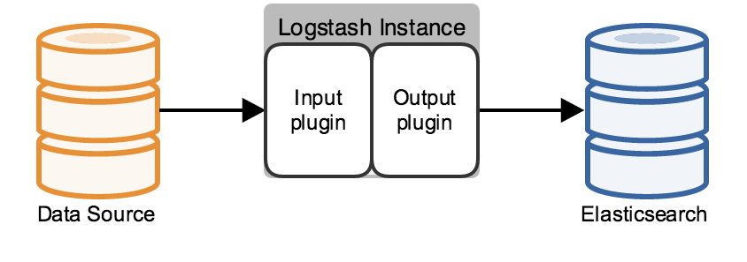
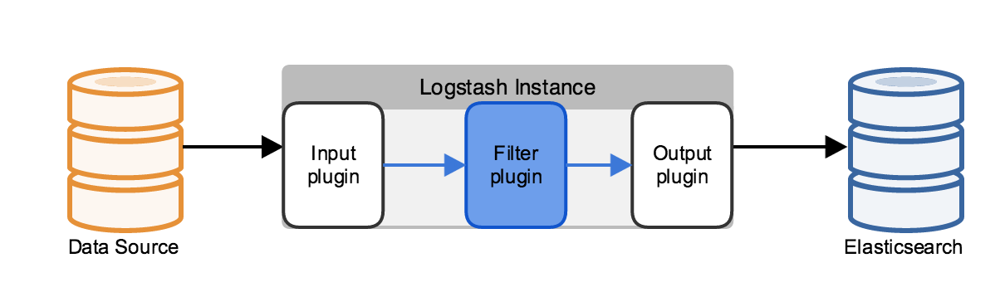
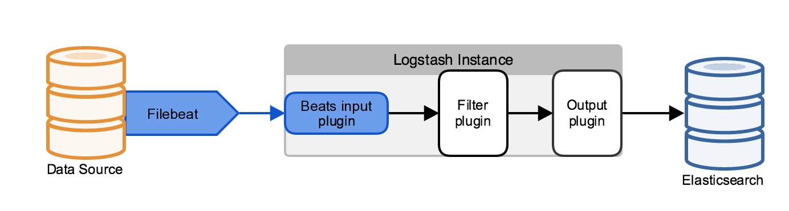
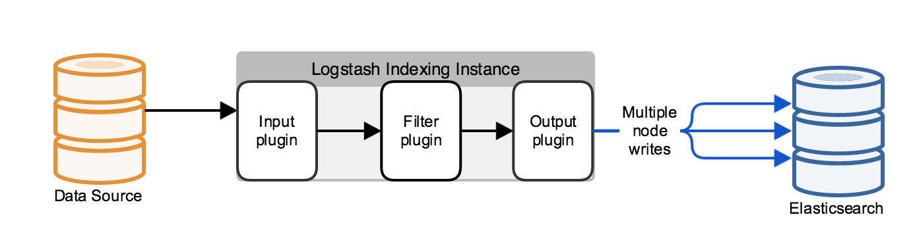
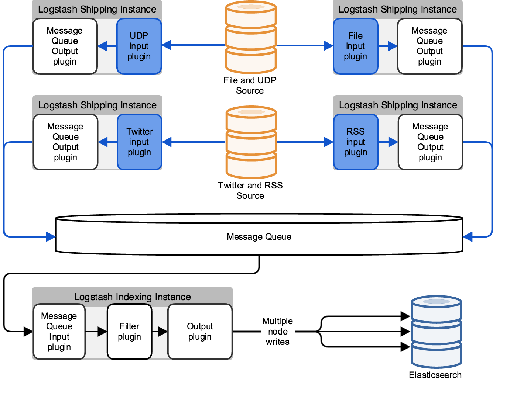
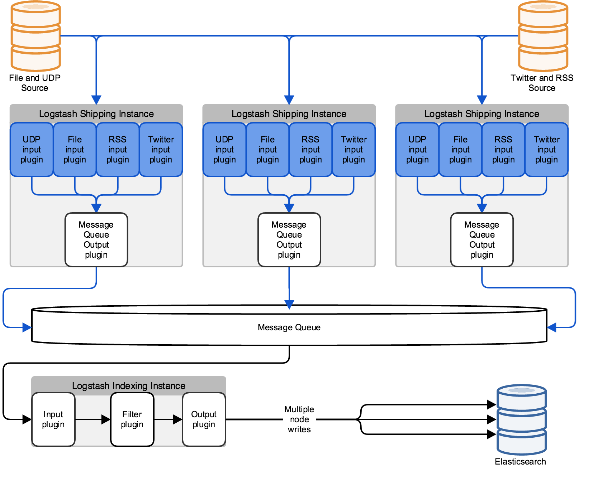

# Logstash 배포 및 확장

Logstash의 유스 케이스가 발전함에 따라 주어진 규모에서 선호하는 아키텍처가 변경 될 것입니다. 이 포스트에서는 최소한의 설치부터 시작하여 시스템에 요소를 추가하는 등 일련의 복잡한 Logstash 아키텍처에 대해 설명합니다. 이 섹션의 배포 예제는 하나의 Elasticsearch 클러스터를 위해 작성되었지만 Logstash는 다양한 엔드 포인트에 대해서도 작성될 수 있습니다.


## 최소한의 설치

최소의 Logstash 설치는 하나의 Logstash 인스턴스와 하나의 Elasticsearch 인스턴스를 포함하고 있습니다. 이러한 인스턴스들은 서로 직접 연결됩니다. Logstash는 Logstash 처리 파이프 라인을 따라 입력 플러그인을 사용하여 데이터를 수집하고 Elasticsearch 출력 플러그인을 사용하여 Elasticsearch에 데이터를 색인합니다.  Logstash 인스턴스에는 인스턴스 설정 파일을 기반으로 시작시 생성되는 고정 파이프 라인이 있습니다. 반드시 입력 플러그인을 지정해야하며, 출력의 기본값은 stdout이고, 다음 절에서 설명 할 파이프 라인의 필터링 섹션은 선택 사항입니다.




## 필터 사용

로그 데이터는 일반적으로 구조화 되어있지 않기 때문에 유스 케이스와 관련이 없는 정보를 포함하거나 로그 내용에서 파생 될 수있는 관련 정보가 누락되는 경우가 있습니다. 필터 플러그인을 사용하면 로그를 필드로 구문 분석하고 불필요한 정보를 제거하고 기존 필드에서 추가 정보를 얻을 수 있습니다. 예를 들어 필터는 IP 주소에서 지리적 위치 정보를 추출하여 해당 정보를 로그에 추가하거나 grok 필터로 임의의 텍스트를 구문 분석하여 구조화 할 수 있습니다.

필터 플러그인을 추가하면 필터 플러그인이 수행하는 계산량과 처리중인 로그의 볼륨에 따라 성능에 큰 영향을 줄 수 있습니다. grok 필터의 정규 표현식 계산은 특히 리소스를 많이 사용합니다. 컴퓨팅 리소스에 대한 이러한 수요 증가를 해결하기 위한 한 가지 방법은 멀티 코어 컴퓨터에서 병렬 처리를 사용하는 것입니다. -w 스위치를 사용하여 Logstash 필터링 작업의 실행 스레드 수를 설정하십시오. 예를 들어 bin/logstash -w 8 명령은 필터 처리를 위해 8개의 서로 다른 스레드를 사용합니다.




## Filebeat 사용

Filebeat는 서버에 있는 파일에서 로그를 수집하여 다른 시스템에 전달하기 위한 Go로 작성된 리소스를 적게 먹는 가벼운 도구입니다. Filebeat는 Beats 프로토콜을 사용하여 중앙 집중식 Logstash 인스턴스와 통신합니다.  Beats 데이터를 수신할 수 있게 입력 플러그인에 Beats를 사용하도록 Logstash 인스턴스를 구성하십시오.

Filebeat는 소스 데이터를 호스팅하는 컴퓨터의 컴퓨팅 리소스를 사용하고 Beats 입력 플러그인은 Logstash 인스턴스에 대한 리소스 요구를 최소화하므로 리소스 제약 조건이 있는 환경에서 이 아키텍처가 매력적일 수 있습니다. 




큰 규모의 Elasticsearch 클러스터링으로 확장
일반적으로 Logstash는 단일 Elasticsearch 노드와 통신하지 않고 여러 노드로 구성된 클러스터와 통신합니다. 기본적으로 Logstash는 HTTP 프로토콜을 사용하여 데이터를 클러스터로 전달합니다.

Elasticsearch HTTP REST API를 사용하여 데이터를 Elasticsearch 클러스터로 색인 할 수 있습니다. 이 API는 JSON으로 색인 된 데이터를 나타냅니다. REST API를 사용하면 Java 클라이언트 클래스나 추가적인 JAR 파일이 필요없고, transport 나 node 프로토콜과 비교해도 성능상의 단점이 없습니다. SSL 및 HTTP 기본 인증을 지원하는 X-Pack Security를 사용하여 HTTP REST API를 사용하는 통신을 보호 할 수도 있습니다.

HTTP 프로토콜을 사용하는 경우 Elasticsearch 클러스터의 지정된 호스트 집합에 인덱싱 요청을 자동으로 로드 밸런싱 하도록 Logstash Elasticsearch 출력 플러그인을 설정 할 수 있습니다. 여러 Elasticsearch 노드를 지정하면 현재 활성화된 Elasticsearch 노드로 트래픽을 라우팅하여 Elasticsearch 클러스터의 고 가용성을 제공 할 수 있습니다.

또한 Elasticsearch Java API를 사용하여 transport 프로토콜을 사용하여 데이터를 바이너리로 직렬화 할 수 있습니다. transport 프로토콜은 요청의 끝점을 스니핑하고 Elasticsearch 클러스터에서 임의의 클라이언트 또는 데이터 노드를 선택할 수 있습니다.

HTTP 또는 transport 프로토콜을 사용하면 Logstash 인스턴스를 Elasticsearch 클러스터와 별도로 유지할 수 있습니다. 대조적으로, 노드 프로토콜에는 Logstash 인스턴스를 실행하는 시스템이 Elasticsearch 인스턴스를 실행하는 Elasticsearch 클러스터에 참여합니다. 인덱싱이 필요한 데이터는 이 노드에서 나머지 클러스터로 전파됩니다. 시스템이 클러스터의 일부이기 때문에 클러스터 토폴로지를 사용할 수 있으므로 노드 프로토콜은 상대적으로 적은 수의 퍼시스턴스(지속적인) 연결을 사용하는 사용 사례에 적합합니다.

서드파티(third-party) 하드웨어 또는 소프트웨어 부하 분산 장치를 사용하여 Logstash와 외부 응용 프로그램 간의 연결을 처리 할 수도 있습니다.

```
Logstash 설정이 전용 클러스터 관리를 수행하는 Elasticsearch 전용 마스터 노드에 직접 연결되어 있지 않은지 확인하십시오. LogStash를 클라이언트 또는 데이터 노드에 연결하여 Elasticsearch 클러스터의 안정성을 보호하십시오.
```




## 메시지 큐를 통한 처리량 스파이크 관리

Logstash 파이프 라인에 들어오는 데이터가 Elasticsearch 클러스터의 데이터 수집 기능을 초과하면 메시지 브로커를 버퍼로 사용할 수 있습니다. 기본적으로 Logstash는 인덱서 소비 속도가 들어오는 데이터 속도보다 낮을 때 들어오는 이벤트를 제한합니다. 이러한 제한으로 인해 이벤트가 데이터 소스에 버퍼링 될 수 있으므로 메시지 브로커를 통해 역압을 방지하는 것이 배포 관리의 중요한 부분이됩니다.

Logstash 배포에 메시지 브로커를 추가하면 데이터 손실을 일정 수준 방지할 수 있습니다. 메시지 브로커에서 데이터를 소비한 Logstash 인스턴스가 실패하면 메시지 브로커에서 활성 Logstash 인스턴스로 데이터를 재생(replay)할 수 있습니다.

Redis, Kafka 또는 RabbitMQ와 같은 몇 가지 third-party 메시지 브로커가 있습니다. Logstash는 이러한 third-party 메시지 브로커 중 일부와 통합 할 수 있는 입력 및 출력 플러그인을 제공합니다. Logstash 배포시 메시지 브로커가 설정되어있는 경우 Logstash는 기능적으로 메시지 브로커의 데이터 처리 및 저장을 처리하는 인스턴스 운송과 메시지 브로커에서 데이터를 검색하고 설정된 필터링을 적용하는 인스턴스 인덱싱의 두 단계로 이루어집니다. 필터링 된 데이터는 Elasticsearch 색인에 추가됩니다.


## Logstash 고가용성을 위한 다중 연결

Logstash 처리를 개별 인스턴스 실패에 보다 탄력적으로 만들려면 데이터 소스 시스템과 Logstash 클러스터 사이에 로드 밸런서를 설정하십시오. 로드 밸런서는 개별 인스턴스를 사용할 수없는 경우에도 데이터 처리 및 처리의 연속성을 보장하기 위해 Logstash 인스턴스에 대한 개별 연결을 처리합니다.



위 다이어그램의 아키텍처는 해당 입력 유형 전용 Logstash 인스턴스를 사용할 수 없게되면 RSS 피드 또는 파일과 같은 특정 유형의 입력을 처리 할 수 없습니다. 보다 견고한 입력 처리를 위해서는 다음 다이어그램과 같이 Logstash 인스턴스를 여러 입력으로 구성하십시오.



이 아키텍처는 구성한 입력을 기반으로 Logstash 작업 부하를 병렬화합니다. 추가 입력으로 Logstash 인스턴스를 추가하여 수평으로 확장 할 수 있습니다. 별도의 병렬 파이프 라인은 단일 실패 지점을 제거하여 스택의 안정성을 높입니다.


## Logstash 스케일링

성숙된 Logstash 배포에는 일반적으로 다음과 같은 파이프 라인이 있습니다.

* 입력 계층은 소스의 데이터를 사용하며 적절한 입력 플러그인이있는 Logstash 인스턴스로 구성됩니다.
* 메시지 브로커는 수집 된 데이터를 보관하고 failover(장애)를 보호하기 위한 버퍼 역할을 합니다.
* 필터 계층은 메시지 브로커에서 소비 한 데이터에 구문 분석 및 기타 처리를 적용합니다.
* 인덱싱 계층은 처리 된 데이터를 Elasticsearch로 전달합니다.


이러한 계층은 컴퓨팅 리소스를 추가하여 확장 할 수 있습니다. 유스 케이스가 발전함에 따라 이러한 구성 요소의 성능을 정기적으로 검토하고 필요에 따라 리소스를 추가하십시오. Logstash가 정기적으로 들어오는 이벤트를 줄이면 메시지 브로커에 저장소를 추가하는 것을 고려하거나 Logstash 색인 생성 인스턴스를 추가하여 Elasticsearch 클러스터의 데이터 소비량을 늘리십시오.