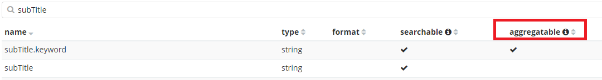

## 재화 소비량

```json
GET hive_user/7062524311363492765/_search
{
  "query": {
    "bool": {
      "must": [
        {
          "term": {
            "title": "goods"
          }
        },
        {
          "term": {
            "subTitle": "consume"
          }
        },
        {
          "range" : {
            "detail.gold" : {
              "gt" : 0
            }
          }
        }
      ]
    }
  },
  "aggs" : {
        "consume_goods" : { "sum" : { "field" : "detail.gold" } }
    }
}
```

* gold 부분을 특정 재화명으로 입력하면 해당 재화에 대한 정보 및 통계 출력


## 오류 : aggregation 실패

* subtitle을 script 사용하여 쿼리하는 경우

  ```json
  GET hive_user/_search
  {
    "query": {
      "bool": {
        "must": [
          {
            "match": {
              "title": "SHOP"
            }
          },
          {
            "script": {
              "script": {
                "inline": "doc['subTitle'].value.contains(params.sub)",
                "lang": "painless",
                "params": {
                  "sub": "BATTLE_ITEM"
                }
              }
            }
          }
        ]
      }
    }
  }
  ```

* 위와 같이 쿼리를 날리면 script_exception이 발생한다.

* doc['subTitle'] 이 부분에서 에러가 발생했는데 이유는 해당 필드가 aggregation이 불가능 한 필드이기 때문이었다.

* Management > Index Pattern으로 가서 필드를 검색해보면 aggregation이 가능한지 여부를 확인할 수 있다.

  

  * 위 그림에서 보면 subTitle은 aggregatable이 체크되어 있지 않으므로 집계에는 사용이 불가능하다.
  * 대신에 subTitle.keyword는 체크 표시가 되어 있으므로 사용 가능.