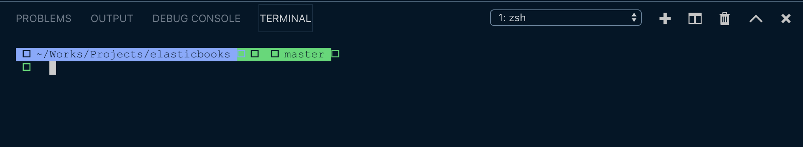
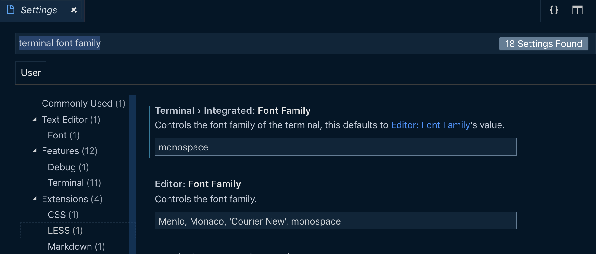
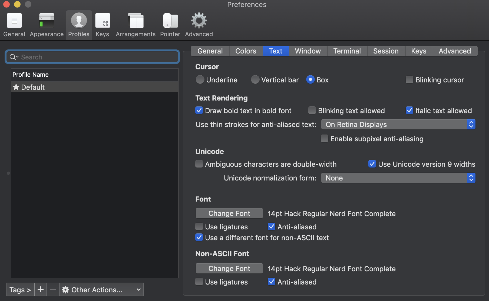
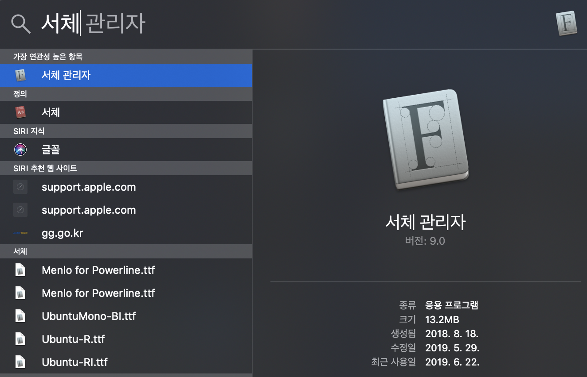
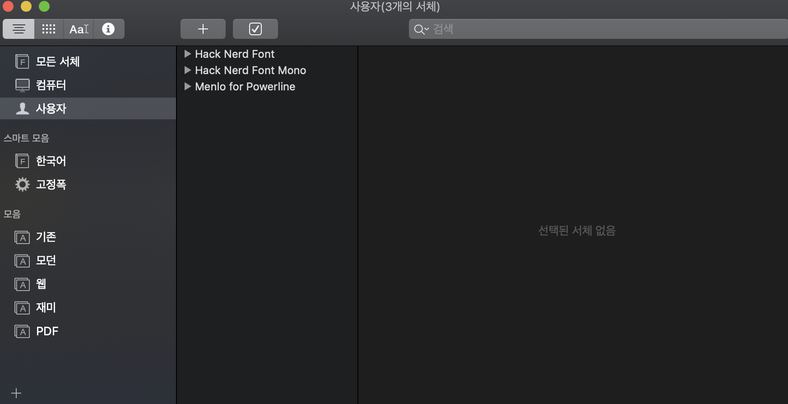
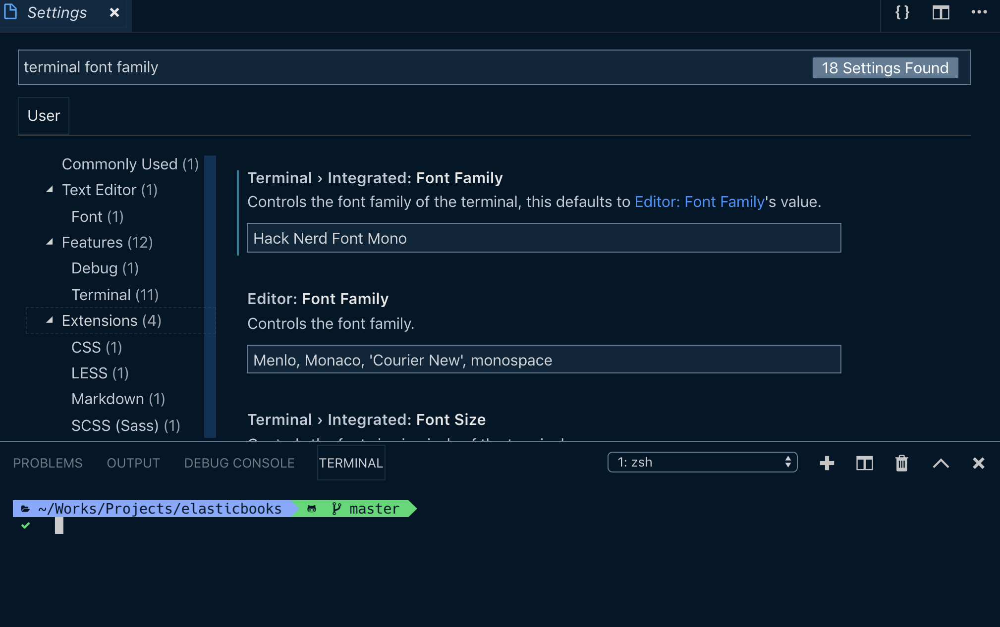

# Mac에서 VS Code 터미널 폰트 깨짐 문제

Last Edited: Jun 22, 2019 9:11 PM

## 1. 문제

oh my zsh 사용 시 VS Code에서 터미널 창을 열면 다음과 같이 폰트가 깨지는 현상이 발생한다.

## 2. 해결

zsh에서 사용 중인 폰트를 현재 VS Code에서 지원하지 않기 떄문에 발생하는 문제 이기 때문에 폰트를 교체해주어야한다.

1. 먼저 VS Code의 터미널 폰트를 확인해본다.  

    (Code → Preference → Settings → 검색 창에 'terminal font family' 입력)

    

    - Terminal > Integrated: Font Family의 값이 monospace로 되어 있다.
2. 이번에는 Mac에서 터미널로 사용하고 있는 ITerms2의 폰트를 확인해본다.

    (Iterms2 → Preference → Profiles → Text)

    

    - Font는 Hac Regular Nerd Font Complete를 사용하고 있다.
3. 로컬에 설치된 서체 리스트를 확인 하기 위해 Mac의 Spotlite 검색으로 서체 관리자 실행 한다.

    

4. 내 로컬에는 다음과 같이 세개의 서체가 설치되어 있다.

    

    - 만일 서체가 설치되어 있지 않다면 구글에 검색해서 다운로드 받은 후 설치하면 된다.
    - Hack Nerd Font의 경우에는 다음 링크에서 다운로드 받아 설치할 수 있다.

    [ryanoasis/nerd-fonts](https://github.com/ryanoasis/nerd-fonts)

5. 다시 VS Code로 돌아와서 Terminal > Integrated: Font Family 값을 "Hack Nerd Font Mono"로 변경한다. 변경 저장 시 바로 터미널에 반영되어 기존에 깨졌던 폰트가 정상적으로 출력되는 것을 확인할 수 있다.

    