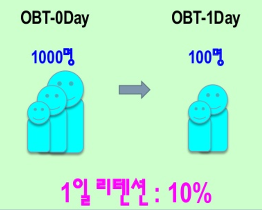
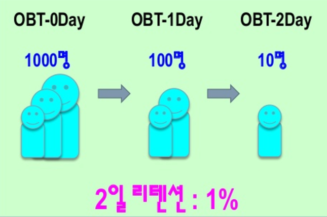

# Retention

* 게임이 얼마나 방문자들에게 만족도를 주고 있는가에 대한 측정 지표

  

  

## Retention 산출 주의사항

1. 상품의 특성에 따라 달라지는 경우
   * 향수를 파는 가게인 경우 향수를 한번 구매하고 재구매까지는 향수가 다 쓸 때까지
   * 향수를 쓰는데 3개월이 걸린다면 재구매(리텐션)의 버퍼는 3개월로 잡아야 바람직
2. 고객의 특성에 따라 달라지는 경우
   * 항구에 위치한 술집인 경우 술집을 이용하는 사람들은 1개월 주기로 입항
   * 술집에 아무리 싸고 맛이 좋아도 고객은 물리적인 이유로 인해 1개월의 버퍼를 두고 재방문(리텐션)
3. 서비스 특성에 따라 달라지는 경우
   * 휴무를 가지는 서비스인 경우 고객들이 재방문을 하고 싶어도 휴무날에는 재방문(리텐션)이 불가능

## 시간 흐름에 따른 리텐션

1. 일일 리텐션율
   * 일일 단위로 갱신된 리텐션율을 산출하는 방식
   * 게임의 상태 변화를 파악하는데 용이
   * 일일 리텐션 = Day + 0에 접속한 유저 중 Day + 1에도 접속한 User / Day + 0에 접속한 User
     * 월요일에 접속한 User가 12명이고 이 12명 중 화요일에 접속한 User가 5명이라면,
     * 5 / 12 = 0.41666
     * 백분율로 나타내기 위해 곱하기 100을 해주면 약 41%
2. 주간 리텐션율
   * 주간 단위로 갱신된 리텐션율을 산출하는 방식
   * 사람들의 생활 패턴을 고려했을 때 가장 통상적으로 사용될만한 리텐션율
   * 주간 리텐션 = Day +0에 접속한 User 중 Day 1~7 중 1회 이상 접속한 User / Day + 0에 접속한 User
     * 2017-8-1에 접속한 User는 12명이고, 이 12명 중 8-2~8 사이에 1회이상 접속 기록이 있는 User는 12명 이라면,
     * 12/12 = 0
     * 백분율로 나타내면 리테션율은 100%

## 리텐션의 변수 설정

* 신규 가입자
* 기존 이용자
* 만레벨 이용자
* 미과금 이용자
* 고과금 이용자
* 연령별 이용자
* 등등

## 리텐션의 이용

**결국 시간과 변수의 설정이 핵심**

* 게임 상태 파악
  * 리텐션율 셋업이 완료되고 나면 서비스 기간 중 업데이트에 따라 변화하는 리텐션을 파악할 수 있다.
* 서비스 방향 설계의 참고지표
  * 변화폭이 발생하는 구간별로 정성&정량 데이터를 비교 분석 할 수 있다면 서비스 방향 설계에 중요한 참고지표가 될 수 있다.
* 마케팅 비용 절감
  * 흡수한 트래픽을 이용자로 전환하는 비율이 높기 때문에 마케팅 시 투자 대비 성과가 높게 나온다