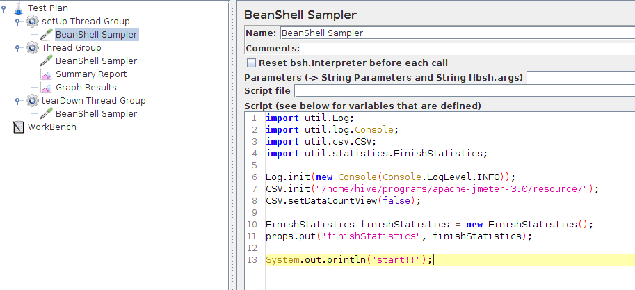
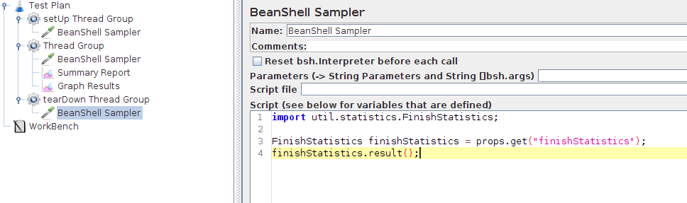

# BeanShell의 props 기능

JMeter의 BeanShell을 사용하여 부하 테스트를 하던 중 각 스레드별로 평균 응답속도나 오래걸린 패킷과 같은 통계를 내다가 마지막에 전체 스레드에 대한 통계를 내고 싶어져서 알아보니 props를 사용하여 전역 객체를 관리할 수가 있었다.  서블릿의 application 객체처럼 key-value 형식으로 저장이 되는데, 테스트 시작 시에 통계관련 인스턴스를 담아두고, 테스트에 사용되는 스레드들에서 각 스레드별 결과를 수집하며 마지막에 총 집계를 출력하도록 설정하였다. 

이를 위해서는 루프를 도는 스레드 그룹에서는 수행할 수 없기 때문에 해당 스레드 그룹을 수행하기 전 setUp 스레드 그룹에서 초기화를 진행하고, 테스트 종료 후 tearDown 스레드 그룹에서 결과를 출력하였다. 

이렇게 하니 기존에 스레드 그룹에서 매번 싱글톤 객체를 초기화하던 코드를 분리하여 더 깔끔하게 처리할 수 있었다. 