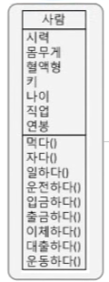
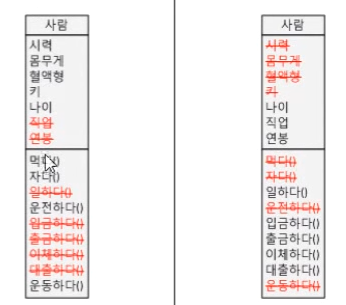
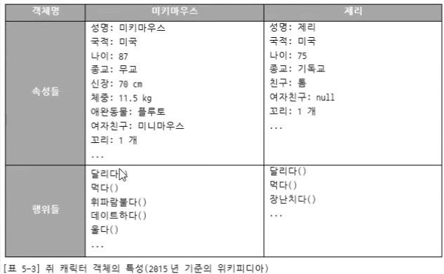
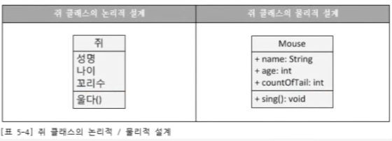
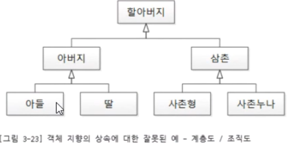
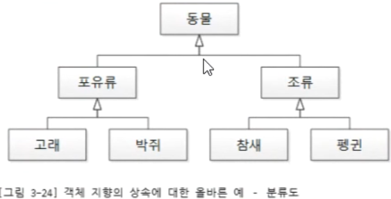
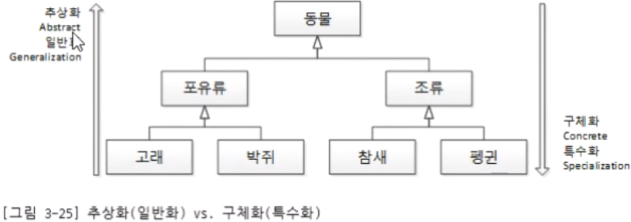
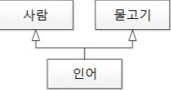

## 객체지향 프로그래밍이란?

* 부품에 해당하는 객체들을 먼저 만들고, 이것들을 하나씩 조립해서 완성된 프로그램을 만드는 기법을 객체지향 프로그래밍이라고 한다.
* 사람이 전자계산기의 기능을 사용하고 전자계산기는 계산 결과를 사람에게 알려주는 것으로 상호작용 하듯이 객체지향 세계에서도 각 객체들은 독립적으로 존재하고 서로가 상호작용하면서 동작한다.
* 현실세계의 객체를 소프트웨어 객체로 설계하는 것을 객체 모델링
  * 현실 세계의 속성과 동작을 추려내어 소프트웨어 객체의 필드와 메소드로 정의하는 과정
* ​

## 객체란?

* 객체
  * 세상에 존재하는 모든 것은 사물, 즉 객체.
  * 물리적으로 존재하거나 추상적으로 생각할 수 있는 것 중에서 자신의 속성을 가지고 있고 다른것과 식별 가능한 것.
* 각각의 사물은 고유하다
* 사물은 속성을 갖는다.
  * 값으로 가질 수 있는 것
  * ex) 사람의 키, 몸무게 등
* 사물은 행위를 한다.
  * 무생물은 의인화 필요
* 객체를 인지할 때 우리는 분류(class) 한다.


## 클래스 vs 객체

* 현실 세계에서 자동차를 만들기 위해서는 설계도가 필요. 자바에서 이 설계도에 해당하는 것이 클래스

* 클래스에는 객체를 생성하기 위한 필드와 메소드가 정의되어 있다.

* 클래스로부터 만들어진 객체를 해당 클래스의 인스턴스라고 한다.

  * 클래스로부터 객체를 만드는 과정을 인스턴스화라고 한다.

* 자동차 설계도로 여러 대의 자동차를 만들 수 있듯이 하나의 클래스로 여러개의 인스턴스를 만들 수 있다.

* 객체 : 세상에 존재하는 유일무이한 사물

* 클래스 :  같은 속성들과 기능들을 가진 객체들을 총칭하는 개념

  * 사람 분류(class)
    * 사람 클래스의 인스턴스들 = 원빈, 현빈, 장동건 등등
    * 사람이라는 분류가 클래스, 원빈, 현빈과 같은 특정 인물(실체)이 인스턴스

* 붕어빵틀 vs 붕어빵 은 잘못된 개념

  * 클래스와 객체의 필요충분조건

    ```
    클래스 객체참조변수명 = new 클래스()
    ```

    * 붕어빵에 적용하면

      ```
      붕어빵틀 붕어빵 = new  붕어빵틀()
      ```

      풀어서 설명하면 붕어빵 틀을 하나 제작하여 붕어빵 틀 역할을 하는 붕어빵이라 이름지었다. -> 논리가 맞지 않음.

    * 여기서의 붕어빵틀은 클래스가 아니라 붕어빵이 팩토리이다.

  * 펭귄 뽀로로 = new 펭귄() -> 뽀로로는 펭귄이다. -> 논리적으로 적절함.

* 우리가 작성하는 코드는 기계를 위한 것이 아니다. 사람을 위한 것임. (실행 시에는 전부 기계어로 번역) 그러므로 사람이 보기 쉽게 논리에 맞게 작성 해야 한다.

* 결국 클래스와 객체는 유일무의한 분류인 class와 이를 실체화한 것을 객체라고 생각하면 된다.

* new 연산자는 힙 영역에 객체를 생성시킨 후, 객체의 주소를 리턴.

  * 리턴된 주소를 객체 참조 변수에 저장하여 변수를 통해서 객체를 사용.


## 클래스 구성 멤버

* 필드 : 생성자와 메서드 전체에서 사용되며 객체가 소멸되지 않는 한 객체와 함께 존재.

  * 변수와는 다름. 
  * 변수는 생성자와 메서드 내에서만 사용되고 생성자와 메서드가 실행 종료되면 자동 소멸
  * 필드의 초기 값이 동일한 경우 필드 선언 시 초기값 대입
  * 객체 생성 시점에 외부의 값으로 대입이 필요하다면 생성자에서 초기화.

* 생성자

  * new 연산자로 호출되며, 객체 생성 시 초기화를 담당.

  * 필드를 초기화하거나 메서드를 호출해서 객체를 사용할 준비를 한다.

  * 메서드와 비슷하게 생겼지만 클래스 이름으로 되어 있고 리턴타입이 없다.

  * 모든 클래스는 생성자가 반드시 존재해야 하고, 생성자 없이 객체를 생성할 수 없다.

  * 생성자를 선언하지 않은 경우 컴파일러가 빈 생성자(기본 생성자)를 만들어준다.

  * 클래스에 명시적으로 선언한 클래스가 한개라도 있다면 컴파일러는 기본생성자를 추가하지 않는다.

  * 상속 관계인 경우 상위 클래스의 생성자 호출(super())도 명시되어 있지 않다면 컴파일러가 생성해준다. 

    * 마찬가지로 상위 클래스에 기본 생성자가 아닌 인자를 가진 생성자가 명시적으로 선언되어 있다면 하위클래스에서도 super 키워드를 사용하여 명시해주어야 함.

  * 생성자는 오버로딩이 가능.

  * this 키워드를 사용하여 오버로딩 된 다른 생성자 호출 가능

  * super 키워드로 상위 클래스의 생성자 호출 가능

    ​

* 메서드

  * 객체의 동작에 해당하며 해당 객체의 필드를 읽고 수정하는 역할과 객체간의 상호작용 역할을 한다.
  * 외부로부터 값을 받을 수도 있고 실행 후 외부로 값을 리턴할 수도 있다.
  * 선언부와 실행 블록으로 구성
    * 선언부는 리턴타입, 메소드이름, 매개변수를 의미하고 시그너처라고도 한다.


## 객체간의 관계

* 집합 관계 : 객체 하나는 부품이고 하나는 완성품. 

  * 자동차는 엔진, 타이어, 핸들 등으로 구성되므로 자동차와 이 부품들은 집합관계

* 사용 관계 : 객체 간의 상호작용

  * 하나의 객체가 다른 객체의 메소드를 호출하여 원하는 결과를 얻어냄
  * 사람은 자동차를 사용하므로 사람과 자동차는 사용 관계

* 상속 관계 : 상위 객체를 기반으로 하위 객체를 생성하는 관계

  * 상위 객체는 종류, 하위 객체는 구체적인 사물에 해당
  * 자동차는 기계의 한 종류

* 객체지향 프로그래밍은 만들고자 하는 완성품인 객체를 모델링하고, 집합관계에 있는 부품 객체와 사용관계에 있는 객체를 하나씩 설계한 후 조립하는 방식으로 프로그램을 개발하는 기법.

  ​


## 객체지향의 4대 특성

* 캡슐화(Encapsulation)
  * 목적은 정보 은닉 (information Hiding)
    * private
    * getter, setter
* 상속 (Inheritance)
  * 목적은 재사용(reuse)
  * 상속은 오해를 불러일으킴. 상속 대신 확장 -> 그래서 자바에서는 keyword가 extends
* 추상화(Abstraction)
  * 추상화는 모델링이다.
  * 구체적인 것을 분해해서 관심 영역에 대한 특성만을 가지고 재조합 하는 것 = 모델링
* 다형성(Polymorphism)
  * overriding
  * overloading


## 추상화

* 구체적인 것을 분해해서 관심 영역에 대한 특성만을 가지고 재조합 하는 것

* 추상화의 안경을 쓰고 객체들을 통해 클래스를 모델링

  

  * 사람을 표현하기 위해서는 위의 내용 말고도 표현해야할 내용들이 엄청나게 많다. 
  * 관심 영역, 즉 어플리케이션 경계(=도메인, =컨텍스트)를 설정하는 것이 중요하다.

  

  * 병원 어플리케이션이라고 하면 사람은 환자다.
    * 시력, 몸무게, 혈액형 등의 정보가 필요.
    * 직업이나 연봉과 같은 정보는 필요 없음.
  * 은행 어플리케이션이라고 하면 사람은 고객이다.
    * 나이, 직업, 연봉 등의 정보가 필요.
    * 시력, 몸무게 혈액형 등의 정보는 필요 없음.

* 쥐를 가지고 예를 들어보자

  

  위와 같이 쥐의 특성을 먼저 파악해본다. 그런 다음 어플리케이션의 경계를 설정하여 관심있는 특성들만 추려낸다. 이 때 툴이나 언어에 종속되지 않고 자유롭게 설계하는 것을 논리적 설계라 하고, 툴이나 언어에 의존적인 설계를 물리적 설계라고 한다. 아래와 같이 설계 할 수 있다.

  

  결국 추상화라는 것은 모델링을 한다는 의미이고, 모델링은 클래스를 설계하는 것을 의미한다. 클래스를 설계할 떄 아래와 같은 사항들을 정의 해야 한다.

  * 클래스 설계
    * 클래스 멤버 (static) : 클래스 멤버 속성/메소드
    * 객체 멤버 : 객체 멤버 속성/메소드

  ​


## 상속(inheritance)

* OO의 상속은 계층이나 조직이 아니다.



* OO의 상속은 확장이다. 그래서 자바에서는 inheritance 키워드가 없고 extends를 사용한다.
  * 계층도, 조직도가 아닌 분류도이다.



* 고래는 포유류를 확장하는 개념, 포유류는 동물을 확장하는 개념.



* 분류도의 위로 올라갈 수록 추상적. 아래로 내려 올 수록 구체적이다.

* 계층도, 조직도로 생각하면 is a 관계가 성립하지 않는다. 나는 아버지인가? 아버지는 할아버지인가? 논리적으로 성립되지 않는다. 하지만 분류도로 생각하면 논리에 맞다. 고래는 포유류이고, 포유류는 동물이다. 즉, 하위클래스는 상위클래스다. (LSP - 리스코프 치환 원칙)

* 동물이 최상위 클래스일까? 자바에서의 모든 클래스에 대해 최상위 클래스는 Object 클래스이다.

* 자바는 다중 상속을 지원하지 않는다. 다이아몬드 상속 문제 때문. 

  
  * 인어는 사람과 물고기의 특성 일부를 가지고 있다. 여기서 수영을 하기 라는 행위를 하려하면 인어는 사람처럼 다리로 헤엄쳐야할지 물고기 처럼 지느러미로 헤엄을 쳐야할지 애매한 상황이 발생한다.  잘 사용하면 좋지만 문제가 발생할 소지가 있기 떄문에 자바에서는 다중상속을 허용하지 않는다.
  * 이를 위해 다이아 상속 문제를 일으키지 않는 인터페이스를 제공. 


* 상속은 재사용과 확장.
  * 상위 객체를 재사용해서 하위 객체를 쉽고 빨리 설계할 수 있도록 도와주고, 이미 잘 개발된 객체를 재사용해서 새로운 객체를 만들기 때문에 반복된 코드의 중복을 줄여준다.
  * 하위 클래스를 생성하면 메모리에 상위클래스도 함께 적재된다.
* 상속은 is a 관례를 만족해야 한다. 하지만 분류의 관계에서는 is a 보다는 is a kind of 가 맞는 말.
* 포유류 is a 동물 이라고 하면 포유류는 객체가 된다. 하지만 포유류도 역시 분류. 그렇기 때문에 포유류는 동물의 한 종류이다 라고 하는 것이 더 나은 방법. 
  * 하위분류 is a kind of 상위분류, 객체 is a 상위분류.
* 상속의 목적은 재사용. 인터페이스의 목적은 구현 강제. 표준 준수
  * 객체 is able to 인터페이스
  * Serializable : 직렬화 할 수 있는
  * Cloneable : 복제 할 수 있는
  * Comparable : 비교할 수 있는
  * Runnable : 실행할 수 있는
* 인터페이스는 최소주의
* 상속은 재사용이기 떄문에 풍성할 수록 좋음.
  * 상위 클래스가 많은 것을 구현하고 있으면 하위 클래스는 구현할 것이 적어짐.
  * 그렇다고 무조건 공통된 기능을 상위클래스에 올리는 것은 클래스를 복잡하게 만들 수 있음. 논리에 맞게 역할에 맞게 구현.
  * 그래서 모델링이 중요


## 다형성

* 같은 타입이지만 실행 결과가 다양한 객체를 이용할 수 있는 성질.

* 자바는 다형성을 위해 상위 클래스 또는 인터페이스의 타입 변환을 허용한다.

  * 상위 클래스에는 모든 하위 클래스가 대입될 수 있고, 인터페이스 타입에는 모든 구현 객체가 대입 될 수 있다.
  * 하위 클래스는 상위 클래스나 인터페이스로 자동 타입 변환이 가능
  * 하위 클래스로 생성된 인스턴스는 하위클래스의 객체 참조변수에 대입되나 상위 클래스의 객체참조변수에 대입되나 같은 주소를 가리킨다.
    * sub == super (객체간 == 연산자는 주소 비교)
  * 상위 클래스로 변환된 경우 상위 클래스에 선언된 필드와 메서드에만 접근 가능.
  * 오버라이딩 된 메서드가 있는 경우 상위 클래스의 객체 참조변수를 사용하더라도 하위 클래스의 메서드가 호출됨.

* 강제 타입 변환(Casting)

  * 상위 클래스를 하위 클래스로 강제 변환
  * instanceof로 상속관계가 맞는지 확인
    * 확인 없이 다른 클래스를 캐스팅 하면 ClassCastException 발생
  * ​

* 다형성의 효과로 객체는 부품화가 가능

  * 자동차를 설계할 때 타이어 인터페이스 타입을 적용했다면 인터페이스를 구현한 실제 타이어들은 어떤 것이든 상관없이 장착이 가능.

    ​


### 오버로딩, 오버라이딩

* ride : 올라 타다
  * 재정의

* load : 적재하다
  * 메소드 이름은 같지만 인자가 다름.

* 오버로딩 : 클래스 내에 같은 이름의 메소드를 여러 개 선언하는 것

  * 매개변수의 타입, 개수, 순서 중 하나가 달라야 한다.
  * 오버로딩된 메소드를 호출할 경우 JVM은 매개값의 타입을 보고 메소드를 선택
  * 일차적으로는 매개 변수의 타입을 보고, 타입이 일치하지 않으면 자동 타입 변환이 가능한지를 검사한다. 
  * 오버로딩의 예 : println()

* 오버라이딩 : 상속된 메소드의 내용이 자식 클래스에 맞지 않을 경우, 자식 클래스에서 동일한 메소드를 재정의 하는 것.

  * 상위 객체의 메소드는 숨겨지기 때문에 메서드 호출 시 하위 클래스의 메서드가 호출된다.
  * 상위 객체의 메서드와 동일한 시그너처를 가져야한다.
  * 접근 제한을 더 강하게 오버라이딩 할 수 없다.
    * 상위 클래스가 public이라면 하위클래스에서는 default나 private으로 선언할 수 없다.
    * 반대는 가능
  * 새로운 예외를 throws할 수 없다.

  ​


* 다형성의 목적 = 코딩의 편의성
  * 하나의 메소드 명으로 다양한 인자를 취하는 다수의 메소드 구현 가능 (오버로딩)
  * 상위 클래스의 기능을 재정의하고 코딩에서는 이를 신경쓰지 않고 호출 가능 (오버라이딩)


## 캡슐화

* 객체의 필드, 메소드를 하나로 묶고, 실제 구현 내용을 감추는 것.
  * 정보 은닉
* 변화에 유연한 대응
* 외부의 잘못된 사용으로 인해 객체가 손상되지 않도록 함.
* 접근제한자 : 객체의 필드와 메소드의 사용 범위를 제한함으로써 외부로부터 보호.
  * private
  * protected
  * default
  * public
* Getter/Setter
  * 객체의 데이터를 외부에서 마음대로 읽고 변경할 경우 객체의 무결성이 깨어질 수 있기 때문에 외부에서 직접적으로 접근하는 것을 막는다.
  * 데이터는 외부에서 접근할 수 없도록 막고 메소드는 공개해서 외부에서 메서드를 통해 데이터에 접근하도록 유도.
  * 필드 타입이 boolean일 경우 is로 시작하는 것이 관례
  * ​


## 추상클래스

* 추상 메서드가 하나 이상 포함된 클래스
* abstract 키워드로 표현
* abstract와 final을 함께 사용할 수 없다.
  * final은 상속을 불가능하게 하는데 abstract는 반드시 상속을 통해서만 사용 가능하기 때문.
* 하위클래스는 반드시 추상 메서드를 오버라이딩해서 구현해야함
  * 하위 클래스에게 메서드 구현을 강제
* 일반 클래스처럼 new 키워드를 통해 객체로 생성될 수 없음.


### 추상클래스와 인터페이스의 차이

* 추상클래스는 extends, 인터페이스는 implements 키워드를 사용하여 구현
* 추상 클래스는 변수를 가질 수 있지만 인터페이스는 가질 수 없다.
  * 인터페이스가 변수를 가질 수 있다면 메소드와 같이 다중 상속 시 애매모호한 문제가 발생.
  * static 변수는 가질 수 있음. (static 변수는 그 클래스에만 종속된 변수이기 때문)
* 추상 클래스는 클래스이기 때문에 다중 상속 불가능
  * 추상 클래스도 클래스이기 때문에 구현 부분을 포함할 수 있음.
* 다중 상속이 불가능한 제약을 인터페이스를 통해 해결.
  * 인터페이스는 공통적인 부분을 묶어준다고 생각.
* 추상 클래스와 인터페이스는 목적이 다름
  * 추상 클래스는 클래스를 상속받아서 기능을 이용하거 확장하는 목적
  * 인터페이스는 메서드의 구현을 강제하기 위함. 이를 통해 구현하는 하위 클래스에게 같은 동작을 보장.
* 둘 중에 어떤 것을 사용할 것인가?
  * 추상 메소드만으로 가능한 경우에는 인터페이스를, 공통된 구현 부분이나 필드가 필요한 경우에는 추상클래스를.


## 인터페이스

- 다중 상속이 가지는 단점을 제외하고 장점만을 가진 것이 인터페이스
- 인터페이스는 추상 메소드만으로 이루어진 클래스
- 인터페이스 역시 new 키워드로 생성될 수 없음.
- ​


## Call By

* Call By Value : 값에 의한 전달, 기본 자료형은 저장하고 있는 값이 전달된다.
  * 대입문 사용시 인자 전달 시 메소드 리턴시
* Call By Reference : 참조/주소에 의한 전달 (포인터)


## Static

* static 멤버 : 클래스에 고정된 멤버로서 객체를 생성하지 않고 사용할 수 있는 필드와 메소드
* 인스턴스에 속한 멤버가 아니라 클래스에 소속된 멤버이기 때문에 클래스 멤버라고도 한다.
* static 필드와 메서드는 클래스에 고정된 멤버이므로 클래스 로더가 클래스(바이트 코드)를 로딩해서 메서드 메모리영역에 적재할 때 클래스별로 관리된다.
  * 클래스 로딩이 끝나면 바로 사용 가능
* 인스턴스 필드 vs static 필드
  * 객체마다 가지고 이써야 할 데이터라면 인스턴스 필드로 선언
  * 객체마다 가지고 있을 필요성이 없는 공용적인 데이터라면 정적필드로 선언
* 인스턴스 메서드 vs static 메서드
  * 인스턴스 필드를 이용해서 실행해야 한다면 인스턴스 메서드로 선언
  * 인스턴스 필드를 이용하지 않는 다면 정적 메서드로 선언
* static 요소들은 클래스 이름으로 접근하는 것이 좋다.
  * 인스턴스를 통해 접근할 경우 인스턴스를 먼저 훑고나서 없는 걸 확인한 후 클래스를 참조하기 때문에 하나의 스텝이 더 생긴다.
* static 필드는 선언과 동시에 초기값을 주는 것이 보통이지만 초기화 과정이 복잡한 경우 static 블럭을 사용할 수 있다.
  * 클래스가 메모리로 로딩 될 때 자동으로 수행된다. 
  * 인스턴스가 없어도 실행되기 때문에 인스턴스 필드나 메소드, this 키워드를 사용할 수 없다.


## final

* final 필드 : 초기값이 저장되면 프로그램 실행 도중 수정할 수 없다.
  * 필드 선언시 초기화를 하거나 생성자에서 초기화를 수행해야 한다.
    * 그렇지 않으면 컴파일 에러
* static final로 상수 선언
  * 클래스에만 포함되며 값을 변경할 수 없다.
  * 필드 선언시 초기화를 하거나 static 블럭에서 초기화를 수행해야 한다.
  * 상수 이름은 모두 대문자로 하는 것이 관례
  * 예 : Math.PI
* final 메서드 : 오버라이딩 불가능
* final class : 상속 불가능


## 패키지

* 클래스를 체계적으로 관리하기 위해 사용
* 클래스를 유일하게 만들어주는 식별자 역할
* 컴파일러는 클래스에 포함되어 있는 패키지 선언을 보고 파일 시스템의 폴더를 자동 생성
* 모두 소문자로 하는 것이 관례
* 숫자로 시작하면 안되고 _,$를 제외한 특수문자 사용 불가능
* java로 시작하는 패키지는 자바 표준 API에서만 사용하므로 사용 불가
* 보통 회사들 간에 패키지 중복을 피하기 위해 회사 도메인 이름으로 패키지를 만든다.
  * 포괄적인 이름이 상위 패키지가 되도록 도메인의 역순으로 이름을 짓는다.
  * 마지막에는 프로젝트 이름을 붙여주는 것이 관례
  * ex) com.javacafe.javastudy
* ​


