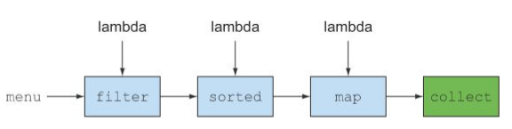
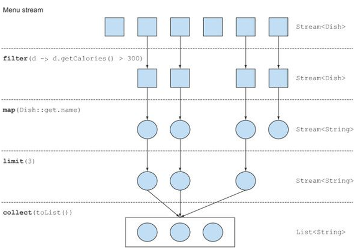
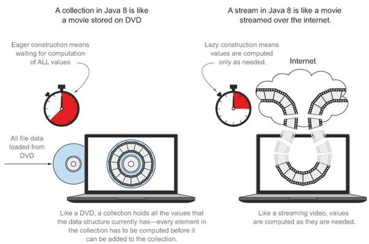
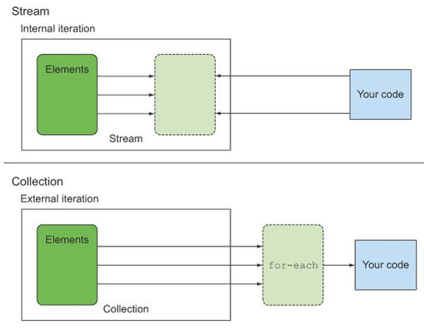
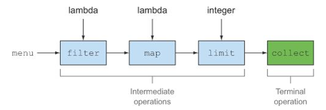

# Chap4. 스트림 소개

* 컬렉션은 자바에서 가장 많이 사용하는 기능 중 하나다.
  * 거의 모든 자바 애플리케이션은 컬렉션을 만들고 처리하는 과정을 포함.
  * 컬렉션으로 데이터를 그룹화하고 처리할 수 있다.
  * 대부분의 자바 애플리케이션에서는 컬렉션을 많이 사용하지만 완벽한 컬렉션 관련 연산을 지원하려면 한참 멀었다.
* 요리 애플리케이션 예시
  * 대부분의 비즈니스 로직에는 요리를 카테고리(예를 들면 채식주의자용)로 그룹화 한다든가 가장 비싼 요리를 찾는 등의 연산이 포함된다.
  * 데이터베이스에서는 선언형으로 이와 같은 연산을 표현할 수 있다.
    * 칼로리가 낮은 요리명 선택 - SELECT name FROM dishes WHERE calorie < 400
    * 요리의 속성을 이용하여 어떻게 필터링 할 것인지는 구현할 필요가 없다.
    * 자바의 경우 반복자, 누적자등을 이용.
    * SQL에서는 질의를 어떻게 구현해야 할지 명시할 필요가 없으며 구현은 자동으로 제공된다.
  * 많은 요소를 포함하는 커다란 컬렉션을 처리하려면?
    * 성능을 높이기 위해 멀티코어 아키텍처를 활용해서 병렬로 컬렉션의 요소를 처리해야 한다.
    * 병렬 처리 코드를 구현하는 것은 단순 반복 처리 코드에 비해 복잡하고 어렵다.
    * 복잡한 코드는 디버깅도 어렵다.


## 4.1 스트림이란 무엇인가?

* 스트림은 자바 API에 새로 추가된 기능.

* 선언형(즉, 데이터를 처리하는 임시 구현 코드 대신 질의로 표현 가능)으로 컬렉션 데이터를 처리할 수 있다.

* 멀티 스레드 코드를 구현하지 않아도 데이터를 **투명하게** 병렬로 처리할 수 있다. (병렬처리는 7장에서)

* 예제 : 저칼로리의 요리명을 반환하고 칼로리를 기준으로 요리를 정렬.

  * 자바7 코드

    ```java
    List<Dish> lowCaloricDishes = new ArrayList<>();

    // 누적자로 요소 필터링
    for(Dish d:menu) {
        if(d.getCalories() < 400) {
            lowCaloricDishes.add(d);
        }
    }

    // 익명 클래스로 요리 정렬
    Collections.sort(lowCaloricDishes, new Comparator<Dish>() {
        @Override
        public int compare(Dish d1, Dish d2) {
            return Integer.compare(d1.getCalories(), d2.getCalories());
        }
    });

    // 정렬된 리스트를 처리하면서 요리 이름 선택
    List<String> lowCaloricDishesName = new ArrayList<>();
    for(Dish d : lowCaloricDishes) {
        lowCaloricDishesName.add(d.getName());
    }
    ```

  * 자바8 코드

    ```java
    List<String> lowCaloricDishesName = menu.stream().filter(d -> d.getCalories() <400)
            .sorted(Comparator.comparing(Dish::getCalories))
            .map(d -> d.getName())
            .collect(toList());
    ```

  * 자바8 병렬

    ```
    List<String> lowCaloricDishesName = menu.parallelStream()
    		.filter(d -> d.getCalories() <400)
            .sorted(Comparator.comparing(Dish::getCalories))
            .map(d -> d.getName())
            .collect(toList());
    ```

* 스트림이 주는 이점

  * **선언형**으로 코드를 구현할 수 있다.

    * 루프와 조건문을 사용해서 **어떻게** 동작을 구현할지 지정할 필요 없이 동작의 수행을 지정할 수 있다.
    * 선언형 코드와 동작 파라미터화를 활용하면 변하는 요구사항에 쉽게 대응할 수 있다.

  * filter, sorted, map, collect 같은 여러 빌등 블록 연산을 연결해서 복잡한 데이터 처리 파이프라인을 만들 수 있다.

    

    * 여러 연산을 파이프라인으로 연결해도 여전히 가독성과 명확성이 유지된다.
    * filter 메서드의 결과는 sorted 메서드로, 다시 sorted의 결과는 map 메서드로, map 메서드의 결과는 collect로 연결된다.

* filter(또는 sorted, map, collect) 같은 연산은 **고수준 빌딩 블록(high-level building block)**으로 이루어져 있다.

  * 즉, 특정 스레딩 모델에 제한되지 않고 자유롭게 어떤 상황에서든 사용할 수 있다.
  * 이들은 내부적으로 단일 스레드 모델에 사용할 수 있지만 멀티코어 아키텍처를 최대한 투명하게 활용할 수 있도록 구현되어 있다.
  * 결과적으로 데이터 처리 과정을 병렬화하면서 스레드와 락을 걱정할 필요가 없다.

* 스트림 API는 매우 비싼 연산이다.

  ```java
  Map<Dish.Type, List<Dish>> dishesByType = 
  	menu.stream().collect(groupingBy(Dish::getType));
  ```

  * Map 내부의 형식에 따라 요리를 그룹화한다. (자세한 사항은 6장에서)

  ```
  {
  	FISH=[prawns, salmon],
  	OTHER=[french fries, rice, season fruit, pizza],
  	MEAT=[pork, beef, chicken]
  }
  ```

  * 위와 같은 결과가 출력된다.
  * 일반적인 명령형 프로그래밍의 루프를 이용했을 때와 비교해보면 매우 간결하고 가독성이 좋다.

* 기타 라이브러리 : 구아바, 아파치, 람다j

  * 구아바 : 구글에서 만든 인기 라이브러리로 멀티맵, 멀티셋등 추가적인 컨테이너 클래스를 제공한다.
  * 아파치 공통 컬렉션 라이브러리(Apache Commons Collections) : 구아바와 비슷한 기능 제공한다.
  * 람다J : 함수형 프로그래밍에서 영감을 받은 선언형으로 컬렉션을 제어하는 다양한 유틸리티를 제공한다.

* 자바8 스트림 API의 특징

  * **선언형** : 더 간결하고 가독성이 좋아진다.
  * **조립할 수 있음** : 유연성이 좋아진다.
  * **병렬화** : 성능이 좋아진다.


### 예제에서 사용될 공통 코드

```java
List<Dish> menu = Arrays.asList(
        new Dish("pork", false, 200, Dish.Type.MEAT),
        new Dish("beef", false, 300, Dish.Type.MEAT),
        new Dish("chicken", false, 400, Dish.Type.MEAT),
        new Dish("french", true, 500, Dish.Type.OTHER),
        new Dish("rice", true, 500, Dish.Type.OTHER),
        new Dish("season fruit", true, 500, Dish.Type.OTHER),
        new Dish("pizza", true, 500, Dish.Type.OTHER),
        new Dish("prawns", true, 500, Dish.Type.FISH),
        new Dish("salmon", true, 600, Dish.Type.FISH)
);
```

```java
public class Dish {
    private final String name;
    private final boolean vegetarian;
    private final int calories;
    private final Type type;

    public Dish(String name, boolean vegetarian, int calories, Type type) {
        this.name = name;
        this.vegetarian = vegetarian;
        this.calories = calories;
        this.type = type;
    }

    public enum Type{
        MEAT, FISH, OTHER
    }

    public String getName() {
        return name;
    }

    public boolean isVegetarian() {
        return vegetarian;
    }

    public int getCalories() {
        return calories;
    }

    @Override
    public String toString() {
        return name;
    }

    public Type getType() {
        return type;
    }
}
```


## 4.2 스트림 시작하기

* 자바8의 컬렉션에서는 스트림을 반환하는 stream이라는 메서드가 추가되었다.


#### 스트림이란?

**데이터 처리 연산**을 지원하도록 **소스**에서 추출된 **연속된 요소**

* 연속된 요소
  * 컬렉션과 마찬가지로 스트림은 특정 요소 형식으로 이루어진 연속된 값 집합의 인터페이스를 제공한다.
  * 컬렉션은 자료구조이므로 시간과 공간의 복잡성과 관련된 요소 저장 및 접근 연산이 주를 이룬다.
    * 예를 들어 ArrayList를 사용할 것인지 아니면 LinkedList를 사용할 것인지.
  * 반면 스트림은 filter, sorted, map처럼 표현 계산식이 주를 이룬다.
    * 컬렉션의 주제는 데이터고 스트림의 주제는 계산이다.
* 소스
  * 스트림은 컬렉션, 배열, I/O 자원 등의 데이터 제공 소스로부터 데이터를 소비(consume)한다.
  * 정렬된 컬렉션으로 스트림을 생성하면 정렬이 그대로 유지된다.
    * 리스트로 스트림을 만들면 스트림 요소는 리스트의 요소와 같은 순서를 유지.
* 데이터 처리 연산
  * 스트림은 함수형 프로그래밍 언어에서 일반적으로 지원하는 연산과 데이터베이스와 비슷한 연산을 지원한다.
    * filter, map, reduce, find, match, sort 등으로 데이터를 조작.
  * 스트림 연산은 순차적으로 또는 병렬로 수행가능.
* 파이프라이닝
  * 스트림 연산끼리 연결해서 커다란 파이프라인을 구성할 수 있도록 스트림 자신을 반환한다.
    * 게이름(laziness), 쇼트서킷(short-circuting) 같은 최적화를 얻을 수 있다.
  * 연산 파이프라인은 데이터베이스 질의와 비슷.
* 내부 반복
  * 반복자를 이용해서 명시적으로 반복하는 컬렉션과 달리 스트림은 내부 반복을 지원한다.


설명한 내용 예제로 확인

```java
List<String> threeHighCaloricDishNames =
        menu.stream()   // 메뉴에서 스트림을 얻는다.
            .filter(d -> d.getCalories() > 300) // 고칼로리 요리 필터링
            .map(Dish::getName) // 요리명 추출
            .limit(3)   // 선착순 세개만 선택
            .collect(toList()); // 결과를 다른 리스트로 저장
System.out.println(threeHighCaloricDishNames);
```

* 여기서 **데이터 소스**는 요리 리스트(menu).
* 데이터 소스는 **연속된 요소**를 스트림에 제공.
* 스트림에 filter, map, limit, collect로 이어지는 일련의 **데이터 처리 연산**을 적용.
* collect를 제외한 모든 연산은 서로 **파이프라인**을 형성할 수 있도록 스트림을 반환.
* 마지막으로 collect 연산으로 파이프라인을 처리해서 결과를 반환
  * collect는 스트림이 아닌 List를 반환한다.
* collect를 호출하기 전까지는 menu에서 아무것도 선택되지 않으며 출력 결과도 없다.


##### 데이터 처리 연산

* filter : 람다를 인수로 받아 스트림에서 특정 요소를 제외시킨다.
* map : 람다를 이용해서 한 요소를 다른 요소로 변환하거나 정보를 추출한다.
* limit : 정해진 개수 이상의 요소가 스트림에 저장되지 못하게 스트림 크기를 축소한다.
* collect : 스트림을 다른 형식으로 변환한다. 





## 4.3 스트림과 컬렉션

* 자바의 기존 컬렉션과 새로운 스트림 모두 연속된 요소 형식의 값을 저장하는 자료구조의 인터페이스를 제공한다.
  * **연속된** 이라는 표현은 순차적으로 값에 접근한다는 것을 의미.


### 컬렉션과 스트림의 차이

* 시각적인 차이 (예 : DVD와 인터넷 스트리밍)

  * DVD의 경우 전체 자료구조가 저장되어 있으므로 컬렉션이다.

  * 인터넷 스트리밍의 경우 사용자가 시청하는 부분의 몇 프레임을 미리 내려 받고 재생할 수 있다.

    

* 데이터를 **언제** 계산하느냐가 컬렉션과 스트림의 가장 큰 차이라고 할 수 있다.

  * 컬렉션은 현재 자료구조가 포함하는 모든 값을 메모리에 저장하는 자료구조.
    * 즉, 컬렉션의 모든 요소는 컬렉션에 추가하기 전에 계산 되어야 한다.
  * 스트림은 이론적으로 요청할 때만 요소를 계산하는 고정된 자료구조.
    * 스트림에 요소를 추가하거나 스트림에서 요소를 제거할 수 없다.
    * 사용자가 요청하는 값만 스트림에서 추출한다는 것이 핵심.
    * 결과적으로 스트림은 생산자와 소비자 관계를 형성한다.
    * 또한 스트림은 게으르게 만들어지는 컬렉션과 같다.
      * 사용자가 데이터를 요청할 때만 값을 계산.

* 소수 예제

  * 컬렉션은 끝이 없는 모든 소수를 포함하려 할 것이므로 무한 루프를 돌며 새로운 소수를 계산하고 추가하기를 반복할 것이다.
    * 소비자는 영원히 볼 수 없다.

* 브라우저 인터넷 검색 예제

  * 검색어를 입력하면 그림을 포함한 모든 검색 결과를 내려받을 때까지 기다리지 않아도 가장 비슷한 10개 또는 20개의 결과요소를 포함하는 스트림을 얻을 수 있다.


### 4.3.1 딱 한번만 탐색할 수 있다!

* 탐색된 스트림의 요소는 소비된다.

* 반복자와 마찬가지로 한 번 탐색한 요소를 다시 탐색하려면 초기 데이터 소스에서 새로운 스트림을 만들어야 한다.

  ```java
  List<String> title = Arrays.asList("Java8", "In", "Action");
  Stream<String> s = title.stream();
  s.forEach(System.out::println); // title의 각 단어를 출력
  s.forEach(System.out::println); // IllegalStateException: 스트림이 이미 소비되었거나 닫힘
  ```

* 스트림과 컬렉션의 철학적 접근

  * 스트림을 시간적으로 흩어진 값의 집합으로 간주할 수 있다.
  * 컬렉션은 특정 시간에 모든 것이 존재하는 공간(컴퓨터 메모리)에 흩어진 값으로 비유할 수 있다.
  * for-each 루프 내에서 반복자를 이용해서 공간에 흩어진 요소에 접근할 수 있다.

* 컬렉션과 스트림의 또 다른 차이점은 데이터 반복 처리 방법이다.


### 4.3.2 외부 반복과 내부 반복

* 외부 반복(컬렉션 방식)
  * 컬렉션 인터페이스를 사용하려면 사용자가 직접 요소를 반복해야 한다.
* 내부 반복(스트림 방식)
  * 반복을 알아서 처리하고 결과 스트림값을 어딘가에 저장해준다.




#### 예제

* for-each 루프를 이용하는 외부 반복

  ```java
  List<String> names = new ArrayList<>();
  for(Dish d: menu) {	// 메뉴 리스트를 명시적으로 순차 반복
    names.add(d.getName());	// 이름을 추출해서 리스트에 추가
  }
  ```

  * for-each를 이용하면 Iterator 객체를 이용하는 것보다 더 쉽게 컬렉션을 반복할 수 있다.

* 내부적으로 숨겨졌던 반복자를 사용한 외부 반복

  ```java
  List<String> names = new ArrayList<>();
  Iterator<String> iterator = menu.iterator();
  while(iterator.hasNext()) {	// 명시적 반복
    Dish d = iterator.next();
    names.add(d.getName());
  }
  ```

* 내부 반복

  ```java
  List<String> names = menu.stream()
  						.map(Dish::getName)	// 요리명 추출
  						.collect(toList());	// 파이프라인 실행. 반복자는 필요 없다.
  ```

  * 내부 반복을 이용하면 작업을 투명하게 병렬로 처리하거나 더 최적화된 다양한 순서로 처리할 수 있다.
  * 내부 반복 뿐 아니라 자바 8에서 스트림을 제공하는 더 다양한 이유가 있다.
    * 스트림 라이브러리의 내부 반복은 데이터 표현과 하드웨어를 활용한 병렬성 구현을 자동으로 선택한다.
    * 반면 for-each를 사용하는 외부 반복에서는 병렬성을 스스로 관리해야 한다.
      * 병렬성을 포기하던지 synchronized로 시작하는 힘들고 긴 전쟁을 시작함을 의미.


## 4.4 스트림 연산

```java
List<String> names = menu.stream()   // 메뉴에서 스트림을 얻는다.
            			.filter(d -> d.getCalories() > 300) // 중간연산
            			.map(Dish::getName) // 중간연산
            			.limit(3)   // 중간연산
            			.collect(toList()); // 스트림을 리스트로 변환
```

위 예제에서 연산을 두 그룹으로 구분할 수 있다.

* filter, map, limit는 서로 연결되어 파이프라인을 형성한다.
* collect로 파이프라인을 실행한 다음에 닫는다.

연결할 수 있는 스트림 연산을 **중간 연산(intemediate operation)**이라고 하며, 스트림을 닫는 연산을 **최종 연산(terminal operation)**이라고 한다.




### 4.4.1 중간연산

* filter나 sorted 같은 중간 연산은 다른 스트림을 반환.
  * 여러 중간 연산을 연결해서 질의를 만들 수 있다.
* 중간 연산의 중요한 특징은 단말 연산을 스트림 파이프라인에 실행하기 전까지는 아무 연산도 수행하지 않는다는 것이다.(lazy)
  * 중간 연산을 합친 다음에 합쳐진 중간 연산을 최종 연산으로 한번에 처리.


#### 예제

```java
List<String> names =
        menu.stream()
                .filter(d -> {
                    System.out.println("filtering " + d.getName());
                    return d.getCalories() > 300;
                })
                .map(d -> {
                    System.out.println("mapping " + d.getName());
                    return d.getName();
                })
                .limit(3)
                .collect(toList());
System.out.println(names);
```

```
filtering pork
mapping pork
filtering beef
mapping beef
filtering chicken
mapping chicken
[pork, beef, chicken]
```

* 스트림의 게으른 특성 덕분에 얻은 최적화 효과
  1. 300 칼로리가 넘는 요리는 여러개지만 오직 처음 3개만 선택되었다.
     * limit 연산을 통해 **쇼트서킷**이라 불리는 기법 덕분.
  2. filter와 map은 서로 다른 연산이지만 한과정으로 병합되었다.
     * 이 기법을 **루프 퓨전(loop fusion)** 이라고 한다.


### 4.4.2 최종 연산

* 최종 연산은 스트림 파이프라인에서 결과를 도출한다.
* 보통 최종 연산에 의해 List, Integer, void 등 스트림 이외의 결과가 반환된다.


#### 예제

```java
menu.stream().forEach(System.out::println);
```

* menu에서 만든 스트림의 모든 요리를 출력한다.


### 퀴즈 : 중간 연산과 최종 연산

* 중간 연산과 최종 연산 구별

  ```java
  long count = menu.stream()
  				.filter(d -> d.getCalories() > 300)
  				.distinct()
  				.limit(3)
  				.count();
  ```

  * 마지막 연산 count는 스트림이 아닌 long을 반환하므로 최종 연산.
  * filter, distinct, limit는 스트림을 반환하며 서로 연결할 수 있으므로 중간 연산.


### 4.4.3 스트림 이용하기

* 스트림 이용 과정
  * 질의를 수행할 (컬렉션 같은) **데이터 소스**
  * 스트림 파이프라인을 구성할 **중간 연산** 연결
  * 스트림 파이프라인을 실행하고 결과를 만들 **최종 연산**
* 스트림 파이프라인의 개념은 빌더 패턴과 비슷하다.
  * 빌더 패턴에서는 호출을 연결해서 설정을 만든다.
  * 준비된 설정에 build() 메서드를 호출한다. (스트림의 최종 연산에 해당)
* 중간 연산
  * filter
  * map
  * limit
  * sorted
  * distinct
* 최종 연산
  * forEach
  * count
  * collect


## 4.5 요약

* 스트림은 소스에서 추출된 연속 요소로, 데이터 처리 연산을 지원한다.
* 스트림은 내부 반복을 지원한다.
  * 내부 반복은 filter, map, sorted 등의 연산으로 반복을 추상화.
* 스트림에는 중간 연산과 최종 연산이 있다.
  * filter와 map처럼 스트림을 반환하면서 다른 연산과 연결될 수 있는 연산을 중간 연산.
  * 중간 연산을 이용해서 파이프라인을 구성할 수 있지만 어떤 결과도 생성할 수 없다.
  * forEach나 count처럼 스트림 파이프라인을 처리해서 스트림이 아닌 결과를 반환하는 연산을 최종 연산.
* 스트림의 요소는 요청할 때만 계산된다.