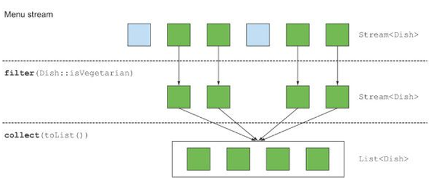
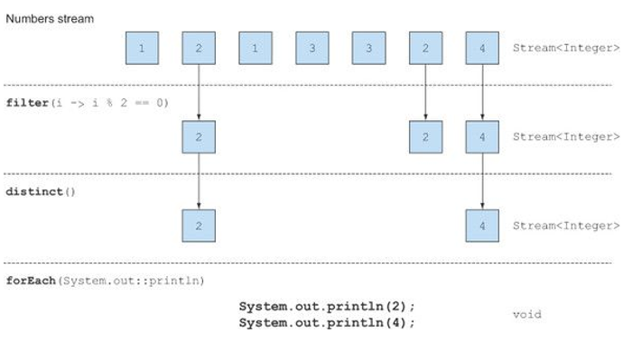
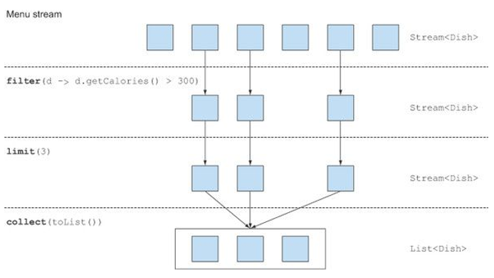
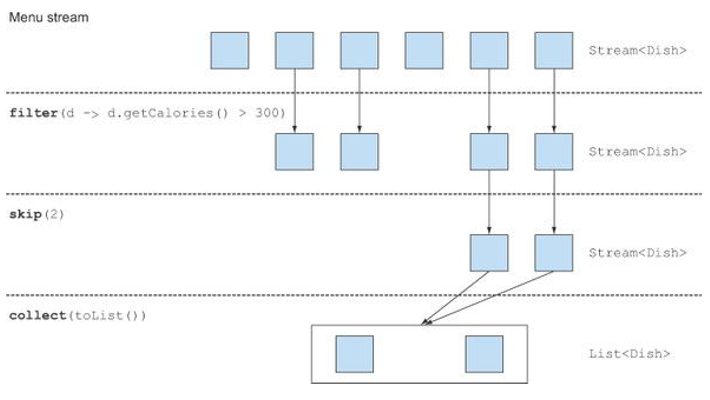
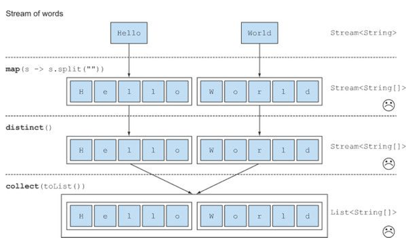
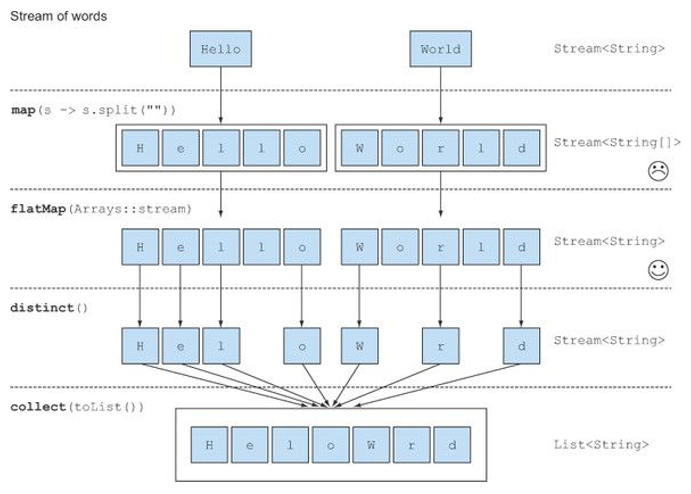
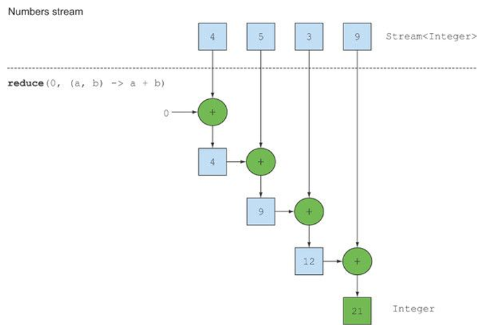
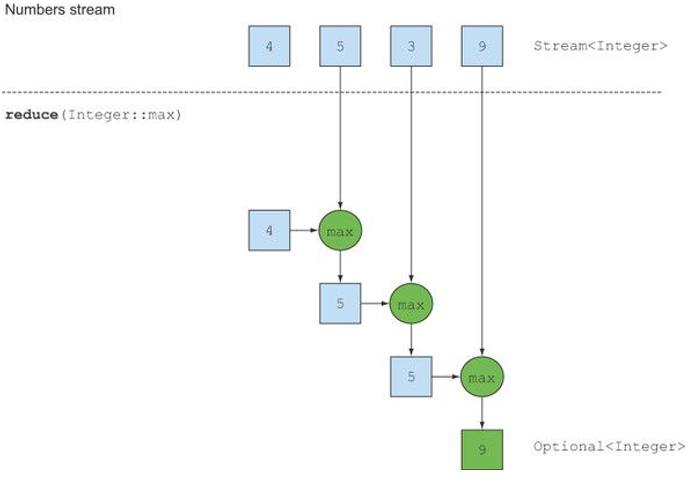

# Chap5. 스트림 활용

## 5.1 필터링과 슬라이싱

### 5.1.1 프레디케이트로 필터링

* 스트림 인터페이스는 filter 메서드를 지원한다.

  * filter 메서드는 프레디케이트(불린을 반환하는 함수)를 인수로 받아서 일치하는 모든 요소를 포함하는 스트림을 반환한다.

  ```java
  List<Dish> vegetarianMenu = menu.stream()
  								.filter(Dish::isVegetarian)
  								.collect(toList());
  ```

  * 모든 채식 요리를 필터링해서 채식 메뉴 생성.




### 5.1.2 고유 요소 필터링

* 스트림은 고유 요소로 이루어진 스트림을 반환하는 distinct 메서드를 지원한다.

  * 고유 여부는 스트림에서 만든 객체의 hashCode, equals로 결정.

  ```java
  List<Integer> numbers = Arrays.asList(1, 2, 1, 3, 3, 2, 4);
  numbers.stream()
  		.filter(i -> i % 2 == 0)
  		.distinct()
  		.forEach(System::println);
  ```

  * 모든 짝수를 선택하고 중복을 필터링.




### 5.1.3 스트림 축소

* 스트림은 주어진 사이즈 이하의 크기를 갖는 새로운 스트림을 반환하는 limit(n) 메서드를 지원한다.

  * 스트림이 정렬되어 있으면 최대 n개의 요소를 반환할 수 있다.

  ```java
  List<Dish> dishes = menu.stream()
  						.filter(d -> d.getCalories() > 300)
  						.limit(3)
  						.collect(toList());
  ```

  * 300 칼로리 이상의 세 요리를 선택해서 리스트 생성.




### 5.1.4 요소 건너뛰기

* 스트림은 처음 n개 요소를 제외한 스트림을 반환하는 skip(n) 메서드를 지원한다.

  * n개 이하의 요소를 포함하는 스트림에 skip(n)을 호출하면 빈 스트림이 반환된다.
  * limit(n)과 skip(n)은 상호 보완적인 연산을 수행.

  ```java
  List<Dish> dishes = menu.stream()
  						.filter(d -> d.getCalories() > 300)
  						.skip(2)
  						.collect(toList());
  ```

  * 300 칼로리 이상의 처음 두 요리를 건너뛴 다음에 300 칼로리가 넘는 나머지 요리를 반환한다.



### 퀴즈 : 필터링

스트림을 이용해서 처음 등장하는 두 고기 요리를 필터링하시오.


* 정답

  ```java
  List<Dish> dishes = menu.stream()
  						.filter(d -> d.getType() == Dish.Type.MEAT)
  						.limit(2)
  						.collect(toList());
  ```


## 5.2 매핑

특정 객체에서 특정 데이터를 선택하는 작업은 데이터 처리 과정에서 자주 수행되는 연산이다.

* 예를 들어 SQL의 테이블에서 특정 열만 선택.
* 스트림 API의 map과 flatMap 메서드는 특정 데이터를 선택하는 기능을 제공.


### 5.3.1 스트림의 각 요소에 함수 적용하기

* 스트림은 함수를 인수로 받는 map 메서드를 지원한다.
* 인수로 제공된 함수는 각 요소에 적용되며 함수를 적용한 결과가 새로운 요소로 매핑된다.
  * 이 과정은 기존의 값을 고친다는 개념보다는 새로운 버전을 만든다라는 개념에 가까우므로 **변환**에 가까운 **매핑**이라는 단어를 사용한다.


#### 예제 1

```java
List<String> dishNames = menu.stream()
							.map(Dish::getName)
							.collect(toList());
```

* Dish::getName을 map 메서드로 전달해서 스트림의 요리명을 **추출**하는 코드
* getName은 문자열을 반환하므로 map 메서드의 출력 스트림은 Stream<String> 형식을 갖는다.


#### 예제 2

```java
List<String> words = Arrays.asList("Java8", "Lambdas", "In", "Action");
List<Integer> wordLengths = words.stream()
								.map(String::length)
								.collect(toList());
```

* 단어 리스트가 주어졌을 때 각 단어가 포함하는 글자 수의 리스트를 반환.


예제1에서 각 요리명의 길이를 알고 싶다면?

```java
List<String> dishNames = menu.stream()
							.map(Dish::getName)
							.map(String::length)
							.collect(toList());
```


### 5.2.2 스트림 평면화

**고유문자**로 이루어진 리스트를 반환하려는 경우

* ["Hello", "World"] 리스트가 있다면 결과로 ["H", "e", "l", "o", "W", "r", "d"]가 반환되어야 한다.

* distinct로 중복된 문자를 필터링해서 쉽게 문제를 해결할 수 있을 것이라 추측.

  ```java
  words.stream()
  	.map(word -> word.split(""))
  	.distinct()
  	.collect(toList());
  ```

  * map으로 전달되는 람다의 결과는 각 단어의 String[](문자열 배열)을 반환한다는 점이 문제다.
  * map 메서드가 반환한 스트림의 형식은 Stream<String[]>가 된다.
    * 우리가 원하는 것은 Stream<String>

  

  * flatMap 메서드를 이용해서 이를 해결할 수 있다.


#### map과 Arrays.stream 활용

* 위 예제를 만족하려면 배열 스트림 대신 문자열 스트림이 필요하다.

  * 문자열 배열을 받아 스트림을 만드는 Arrays.stream() 메서드 사용

  ```java
  String[] arrayOfWords = {"Goodbye", "World"};
  Stream<String> streamOfWords = Arrays.stream(arrayOfWords);
  ```

* 위 예제에 적용

  ```java
  words.stream()
  	.map(word -> word.split(""))	// 각 단어를 개별 문자열 배열로 변환
  	.map(Arrays::stream)	// 각 배열을 별도의 스트림으로 생성
  	.distinct()
  	.collect(toList());
  ```

  * 스트림 리스트(Stream<Stream<String>>)가 만들어지면서 문제가 해결되지 않았다.


* 문제를 해결하려면 먼저 각 단어를 개별 문자열로 이루어진 배열로 만든 다음에 각 배열을 별도의 스트림으로 만들어야 한다.


#### flatMap 사용

```java
List<String> uniqueCharacters =
    words.stream()
        .map(word -> word.split(""))
        .flatMap(Arrays::stream)
        .distinct()
        .collect(toList());
```

* flatMap은 각 배열을 스트림이 아니라 **스트림의 콘텐츠**로 매핑한다.
  * map(Arrays::stream)과 달리 flatMap은 하나의 평면화된 스트림을 반환.



* flatMap 메서드는 스트림의 각 값을 다른 스트림으로 만든 다음에 모든 스트림을 하나의 스트림으로 연결하는 기능을 수행한다.


### 퀴즈 : 매핑

1. 숫자 리스트가 주어졌을 때 각 숫자의 제곱근으로 이루어진 리스트를 반환하시오.

   * 예를 들어 [1, 2, 3, 4, 5]가 주어지면 [1, 4, 9, 16, 25]를 반환해야함.

   * 답

     * 숫자를 인수로 받아 제곱근을 반환하는 람다를 map으로 넘겨주는 방식으로 해결.

       ```java
       List<Integer> numbers = Arrays.asList(1, 2, 3, 4, 5);
       List<Integer> squares = 
       	numbers.stream()
       		.map(n -> n * n)
       		.collect(toList());
       ```

2. 두 개의 숫자 리스트가 있을 때 모든 숫자 쌍의 리스트를 반환하시오.

   * [1, 2, 3]과 [3, 4]가 주어지면 [(1, 3), (1, 4), (2, 3), (2, 4), (3, 3), (3, 4)]를 반환해야함.

   * 답

     * 두 개의 map을 이용해서 두 리스트를 반복한 다음에 숫자 쌍을 만들 수 있다.
     * 결과로 Stream<Stream<Integer[]>>가 반환된다.
     * 따라서 Stream<Integer[]>로 평면화한 스트림이 필요하다. (flatMap 사용 필요)

     ```java
     List<Integer> numbers1 = Arrays.asList(1, 2, 3);
     List<Integer> numbers2 = Arrays.asList(3, 4);

     List<int[]> pairs = numbers1.stream()
             .flatMap(
                 i -> numbers2.stream()
                             .map(j -> new int[]{i, j}))
             .collect(toList());
     ```

3. 이전 예제에서 합이 3으로 나누어떨어지는 쌍만 반환하려면 어떻게 해야할까?

   * (2, 4), (3, 3)을 반환해야함.

   * 답

     * filter를 프레디케이트와 함께 사용하면 스트림의 요소를 필터링 할 수 있다.
     * flatMap을 실행하면 숫자 쌍을 포함하는 int[] 스트림이 반환되므로 프레디케이트를 이용해서 숫자 쌍의 합이 3으로 나누어떨어지는지 확인할 수 있다.

     ```java
     List<Integer> numbers1 = Arrays.asList(1, 2, 3);
     List<Integer> numbers2 = Arrays.asList(3, 4);

     List<int[]> pairs = numbers1.stream()
             .flatMap(
                 i -> numbers2.stream()
                 			.filter(j -> (i + j) % 3 == 0)
                             .map(j -> new int[]{i, j}))
             .collect(toList());
     ```


## 5.3 검색과 매칭

### 5.3.1 프레디케이트가 적어도 한 요소와 일치하는지 확인

* anyMatch 메서드 : 프레디케이트가 주어진 스트림에서 적어도 한 요소와 일치하는지 확인

  ```java
  if(menu.stream().anyMatch(Dish::isVegetarian)) {
    System.out.println("The menu is (somewhat) vegetarian friendly!!");
  }
  ```

  * anyMatch는 불린을 반환하므로 최종 연산이다.


### 5.3.2 프레디케이트가 모든 요소와 일치하는지 검사

* allMatch 메서드 : 스트림의 모든 요소가 주어진 프레디케이트와 일치하는지 검사.

  ```java
  boolean isHealthy = menu.stream()
  						.allMatch(d -> d.getCalories() < 1000);
  ```

  * 모든 요리가 1000칼로리 이하면 건강식으로 간주하는 예제.


#### noneMatch

* allMatch와 반대 연산을 수행한다.

* 즉, 주어진 프레디케이트와 일치하는 요소가 없는지 확인한다.

* 위의 allMatch 예제를 noneMatch로 구현

  ```java
  boolean isHealthy = menu.stream()
  						.noneMatch(d -> d.getCalories() >= 1000);
  ```


anyMatch, allMatch, noneMatch 세가지 메서드는 스트림 **쇼트서킷** 기법, 즉 자바의 &&, ||와 같은 연산을 활용한다.


#### 쇼트서킷 평가

* 때로는 전체 스트림을 처리하지 않았더라도 결과를 반환할 수 있다.
  * 여러 and 연산으로 연결된 커다란 불린 표현식을 평가한다면,
  * 표현식에서 하나라도 거짓이라는 결과가 나오면 나머지 표현식의 결과와 상관없이 전체 결과도 거짓이된다.
  * 이러한 상황을 **쇼트서킷** 이라고 한다.
* allMatch, noneMatch, findFirst, findAny 등의 연산은 모든 스트림의 요소를 처리하지 않고도 결과를 반환할 수 있다.
  * 원하는 요소를 찾았으면 즉시 결과를 반환.
  * (주어진 크기의 스트림을 생성하는)limit도 쇼트서킷 연산.
  * 무한한 요소를 가진 스트림을 유한한 크기로 줄일 수 있는 유용한 연산.


### 5.3.3 요소 검색

* findAny 메서드는 현재 스트림에서 임의의 요소를 반환한다.

  * 다른 스트림 연산과 연결해서 사용할 수 있다.

  ```java
  Optional<Dish> dish = 
  	menu.stream()
  		.filter(Dish::isVegetarian)
  		.findAny();
  ```

  * 스트림 파이프라인은 내부적으로 단일 과정으로 실행할 수 있도록 최적화된다.
    * 쇼트 서킷을 이용해서 결과를 찾는 즉시 실행을 종료.


#### Optional이란?

* 값의 존재나 부재 여부를 표현하는 컨테이너 클래스.(java.util.Optional)

* 이전 예제에서 findAny는 아무 요소도 반환하지 않을 수 있다.

  * null은 쉽게 에러를 일으킬 수 있으므로 자바 8 라이브러리 설계자는 Optional<T>라는 기능을 만들었다.

* 메서드

  * isPresent() : Optional이 값을 포함하면 참을 반환하고, 그렇지 않으면 거짓 반환.
  * ifPresent(Consumer<T> block) : 값이 있으면 주어진 블록을 실행.
  * T get() : 값이 존재하면 값을 반환하고, 없으면 NoSuchElementException을 일으킨다.
  * T orElse(T other) : 값이 있으면 값을 반환하고, 없으면 기본값을 반환.

  ```java
  menu.stream()
  	.filter(Dish::isVegetarian)
  	.findAny();	// Optional<Dish> 반환
  	.ifPresent(d -> System.out.println(d.getName()));	// 값이 있으면 출력, 없으면 아무 일도 일어나지 않는다.
  ```


### 5.3.4 첫 번째 요소 찾기

리스트 또는 정렬된 연속 데이터로부터 생성된 스트림처럼 일부 스트림에는 논리적인 아이템 순서가 정해져 있을 수 있다. 이런 스트림에서 첫번째 요소를 찾으려면 어떻게 해야할까?

```java
List<Integer> someNumbers = Arrays.asList(1, 2, 3, 4, 5);
Optional<Integer> firstSquareDivisibleByThree =
        someNumbers.stream()
                    .map(x -> x * x)
                    .filter(x -> x % 3 == 0)
                    .findFirst();	// 9
```


#### findFirst와 findAny는 언제 사용하나?

* 왜 findFirst와 findAny 두가지 메서드가 모두 필요할까?
  * 병렬성 때문.
  * 병렬 실행에서는 첫 번째 요소를 찾기 어렵다. 
  * 요소의 반환 순서가 상관없다면 병렬 스트림에서는 제약이 적은 findAny를 사용.


## 5.4 리듀싱

* **리듀싱 연산** : 모든 스트림 요소를 처리해서 값으로 도출.
  * 함수형 프로그래밍 언어 용어로는 이 과정이 마치 종이(우리의 스트림)를 작은 조각이 될 때까지 반복해서 접는 것과 비슷하다는 의미로 **폴드(fold)**라고 부른다.


### 5.4.1 요소의 합

* for-each 루프를 이용해서 리스트의 숫자 요소를 더하는 코드

  ```java
  int sum = 0;
  for(int x : numbers) {
    sum += x;
  }
  ```

  * numbers의 각 요소는 결과에 반복적으로 더해진다.
  * 리스트에서 하나의 숫자가 남을 때까지 이 과정을 반복.
  * 코드에는 두 개의 파라미터가 사용되었다.
    * sum 변수의 초깃값 0
    * 리스트의 모든 요소를 조합하는 연산(+)

* 위 코드에서 모든 숫자를 곱하는 연산을 추가로 구현하려면?

  * 같은 코드 복붙 필요.

  * reduce를 이용하면 애플리케이션의 반복된 패턴을 추상화할 수 있다.

    ```java
    int sum = numbers.stream().reduce(0, (a, b) -> a + b)
    ```

  * reduce는 두 개의 인수를 갖는다.

    * 초깃값 0
    * 두 요소를 조합해서 새로운 값을 만드는 BinaryOperator<T>, 예제에서는 람다 표현식 (a, b) -> a + b를 사용했다.

  * reduce로 다른 람다를 넘겨주면 곱셉 연산을 적용할 수 있다.

    ```java
    int sum = numbers.stream().reduce(0, (a, b) -> a * b)
    ```

    

    * 스트림이 하나의 값으로 줄어들 때까지 람다는 각 요소를 반복해서 조합한다.

    * reduce가 스트림의 모든 숫자를 더하는 과정

      1. 람다의 첫번째 파라미터(a)에 0이 사용된다.
      2. 스트림에서 4를 소비해서 두번째 파라미터(b)로 사용.
      3. 0 + 4의 결과인 4가 새로운 누적값이 되었다.
      4. 누적값으로 람다를 다시 호출하며 다음 요소인 5를 소비한다.
      5. 결과는 9가 된다.
      6. 다음 요소 3을 소비하면서 누적값은 12가 된다.
      7. 누적값 12와 스트림의 마지막 요소 9로 람다를 호출하면 최종값으로 21이 도출된다.

    * 메서드 레퍼런스를 이용해서 코드를 좀 더 간결하게 만들 수 있다.

    * 자바 8에서는 Integer 클래스에 두 숫자를 더하는 정적 sum 메서드를 제공한다.

      ```java
      int sum = numbers.stream().reduce(0, Integer::sum)
      ```


#### 초깃값 없음

* 초깃값을 받지 않도록 오버로드 된 reduce는 Optional 객체를 반환한다.

  ```java
  Optional<Integer> sum = numbers.stream().reduce((a, b) -> (a + b));
  ```

  * 스트림에 아무 요소도 없다면, 초깃값이 없으므로 reduce는 합계를 반환할 수 없다.
  * 따라서 합계가 없음을 가리킬 수 있도록 Optional 객체로 감싼 결과를 반환한다.


### 5.4.2 최댓값과 최솟값

* reduce는 두 인수를 받는다.
  * 초깃값
  * 스트림의 두 요소를 합쳐서 하나의 값으로 만드는데 사용할 람다



* 두 요소에서 최대값을 반환하는 람다만 있으면 최댓값을 구할 수 있다.

* reduce 연산은 새로운 값을 이용해서 스트림의 모든 요소를 소비할 때까지 람다를 반복 수행하면서 최댓값을 생산한다.

  ```java
  Optional<Integer> max = numbers.stream().reduce(Integer::max);
  ```

* Integer.max 대신 Integer.min을 reduce로 넘겨주면 최솟값을 찾을 수 있다.

  ```java
  Optional<Integer> min = numbers.stream().reduce(Integer::min);
  ```

  * Integer::min 대신 (x, y) -> x < y ? x : y 를 사용해도 무방하지만 메서드 레퍼런스 표현이 더 읽기 쉽다.


### 퀴즈 : 리듀스

map과 reduce 메서드를 이용해서 스트림의 요리 개수를 계산하시오.

* 답

  ```java
  int count = menu.stream()
                  .map(d -> 1)
                  .reduce(0, Integer::sum); // 또는 (a, b) -> a + b
  ```

  * 스트림에서 각 요소를 1로 매핑한 다음에 reduce로 이들의 합계를 계산.

    * 스트림에 저장된 숫자를 차례로 더한다.

  * map과 reduce를 연결하는 기법을 맵 리듀스 패턴이라 한다.

    * 쉽게 병렬화하는 특징 덕분에 구글이 웹 검색에 적용하면서 유명해졌다.

  * 4장에서 살펴본 count() 메서드로 동일한 결과를 얻을 수 있다.

    ```java
    long count = menu.stream().count();
    ```


#### reduce 메서드의 장점과 병렬화

* reduce를 이용하면 내부 반복이 추상화되면서 내부 구현에서 병렬로 reduce를 실행할 수 있게된다.

  * 반복적인 합계에서는 sum 변수를 공유해야 하므로 쉽게 병렬화하기 어렵다.
  * 강제적으로 동기화시킨다 하더라도 결국 병렬화로 얻어야 할 이득이 스레드 간의 소모적인 경쟁 때문에 상쇄되어 버린다.

* 병렬화를 위해서는 입력을 분할 하고, 분할된 입력을 더한 다음에, 더한 값을 합쳐야 한다.

  * 7장에서 포크/조인 프레임워크를 이용하는 방법을 살펴본다.

* 스트림의 모든 요소를 더하는 코드를 병렬로 만드는 방법

  * stream()을 parallelStream()으로 바꾼다.

    ```java
    int sum = numbers.parallelStream().reduce(0, Integer::sum);
    ```

    * 7장에서 살펴봄.

  * 위 코드를 병렬로 실행하려면 대가를 지불해야 한다.

    * reduce에 넘겨준 람다의 상태(인스턴스 변수 같은)가 바뀌지 말아야 하며, 연산이 어떤 순서로 실행되더라도 결과가 바뀌지 않는 구조여야 한다.


#### 스트림 연산 : 상태 없음과 상태 있음

* 스트림 연산은 마치 만병통치약 같은 존재다.
  * 원하는 모든 연산을 쉽게 구현할 수 있다.
  * 컬렉션으로 스트림을 만드는 stream 메서드를 parallelStream로 바꾸는 것만으로도 병렬성을 얻을 수 있다.
* 다양하게 응용 가능.
  * 요리 리스트를 스트림으로 변환 할 수 있다.
  * filter로 원하는 종류의 요리만 선택할 수 있다.
  * map을 이용해서 칼로리를 추가한 다음에 reduce로 요리의 칼로리 총합을 계산한다.
  * 병렬로 실행할 수 있다.
    * 각각의 연산은 다양한 연산을 수행하기 때문에 내부적인 상태를 고려해야 한다.
* map, filter 등은 입력 스트림에서 각 요소를 받아 0 또는 결과를 출력 스트림으로 보낸다.
  * 사용자가 제공한 람다나 메서드 레퍼런스가 내부적인 가변 상태를 갖지 않는 다는 가정 하에 보통 상태가 없는, 즉 내부 상태를 갖지 않는 연산이다.
* reduce, sum, max 같은 연산은 결과를 누적할 내부 상태가 필요하다.
  * 스트림에서 처리하는 요소 수와 관계 없이 내부 상태의 크기는 **한정(bounded)** 되어 있다.
    * int나 double과 같은 내부 상태 사용.
* sorted나 distinct 같은 연산은 filter나 map과는 달리 스트림의 요소를 정렬하거나 중복을 제거하려면 과거의 이력을 알고 있어야 한다.
  * 어떤 요소를 출력 스트림으로 추가하려면 **모든 요소가 버퍼에 추가되어 있어야 한다**.
  * 연산을 수행하는 데 필요한 저장소 크기는 정해져있지 않다.
    * 따라서 데이터 스트림의 크기가 크거나 무한이라면 문제가 생길 수 있다.
  * 이러한 연산은 **내부 상태를 갖는 연산(stateful operation)**으로 간주할 수 있다.


## 5.5 실전 연습

1. 2011년에 일어난 모든 트랜잭션을 찾아 값을 오름차순으로 정리하시오.
2. 거래자가 근무하는 모든 도시를 중복 없이 나열하시오.
3. 케임브리지에서 근무하는 모든 거래자를 찾아서 이름순으로 정렬하시오.
4. 모든 거래자의 이름을 알파벳 순으로 정렬해서 반환하시오.
5. 밀라노에 거래자가 있는가?
6. 케임브리지에 거주하는 거래자의 모든 트랜잭션값을 출력하시오.
7. 전체 트랜잭션 중 최댓값은 얼마인가?
8. 전체 트랜잭션 중 최솟값은 얼마인가?


### 5.5.1 거래자와 트랜잭션

```java
Trader raoul = new Trader("Raoul", "Cambridge");
Trader mario = new Trader("Mario", "Milan");
Trader alan = new Trader("Alan", "Cambridge");
Trader brian = new Trader("Brian", "Cambridge");

List<Transaction> transaction = Arrays.asList(
        new Transaction(brian, 2011, 300),
        new Transaction(raoul, 2012, 1000),
        new Transaction(raoul, 2011, 400),
        new Transaction(mario, 2012, 710),
        new Transaction(mario, 2012, 700),
        new Transaction(alan, 2012, 950)
);
```

* Trader.java

  ```java
  public class Trader {
      private final String name;
      private final String city;

      public Trader(String name, String city) {
          this.name = name;
          this.city = city;
      }

      public String getName() {
          return name;
      }

      public String getCity() {
          return city;
      }

      @Override
      public String toString() {
          return "Trader{" +
                  "name='" + name + '\'' +
                  ", city='" + city + '\'' +
                  '}';
      }
  }
  ```

* Transaction.java

  ```java
  public class Transaction{
      private final Trader trader;
      private int year;
      private int value;

      public Transaction(Trader trader, int year, int value) {
          this.trader = trader;
          this.year = year;
          this.value = value;
      }

      public Trader getTrader() {
          return trader;
      }

      public int getYear() {
          return year;
      }

      public int getValue() {
          return value;
      }

      @Override
      public String toString() {
          return "Transaction{" +
                  "trader=" + trader +
                  ", year=" + year +
                  ", value=" + value +
                  '}';
      }
  }
  ```

  ​

### 5.5.2 실전 연습 정답

1. 2011년에 일어난 모든 트랜잭션을 찾아서 값을 오름차순으로 정렬하시오.

   ```java
   List<Transaction> tr2011 = 
   	transactions.stream()
   				.map(transaction -> transaction.getYear() == 2011)
   				.sorted(comparing(Transaction::getValue))
   				.collect(toList());
   ```

2. 거래자가 근무하는 모든 도시를 중복 없이 나열하시오.

   ```java
   List<String> cities = 
   	transactions.stream()
   				.map(transaction -> transaction.getTrader().getCity())
     				.distinct()
     				.collect(toList());
   ```

   * distinct() 대신에 스트림을 집합으로 변환하는 toSet()을 사용할 수 있다.

     ```java
     List<String> cities = 
     	transactions.stream()
     				.map(transaction -> transaction.getTrader().getCity())
       				.collect(toSet());
     ```

3. 케임브리지에서 근무하는 모든 거래자를 찾아서 이름순으로 정렬하시오.

   ```java
   List<String> cities = 
   	transactions.stream()
   				.map(transaction -> transaction.getTrader().getName())
     				.distinct()
     				.sorted(comparing(Trader::getName))
     				.collect(toList());
   ```

4. 모든 거래자의 이름을 알파벳 순으로 정렬해서 반환하시오.

   ```java
   List<String> cities = 
   	transactions.stream()
   				.map(transaction -> transaction.getTrader().getName())
     				.distinct()
     				.sorted()
     				.reduce("", (n1, n2) -> n1 + n2);
   ```

   * 각 반복과정에서 모든 문자열을 반복적으로 연결해서 새로운 문자열 객체를 만든다.

   * 위 코드는 효율성이 부족하다. 

   * joining()을 이용하는 것이 더 효율적이다.

     ```java
     List<String> cities = 
     	transactions.stream()
     				.map(transaction -> transaction.getTrader().getName())
       				.distinct()
       				.sorted()
       				.collect(joining());
     ```

5. 밀라노에 거래자가 있는가?

   ```java
   boolean milanBased = 
   	transactions.stream()
   				.anyMatch(transaction -> transaction.getTrader()
   												.getCity()
   												.equals("Milan"));
   ```

6. 케임브리지에 거주하는 거래자의 모든 트랜잭션값을 출력하시오.

   ```java
   transactions.stream()
   			.filter(t -> "Cambridge".equals(t.getTrader().getCity()))
   			.map(Transaction::getValue)
   			.forEach(System.out::println);
   ```

7. 전체 트랜잭션 중 최댓값은 얼마인가?

   ```java
   Optional<Integer> highestValue = 
   	transactions.stream()
   				.map(Transaction::getValue)
   				.reduce(Integer::max);
   ```

8. 전체 트랜잭션 중 최솟값은 얼마인가?

   ```java
   Optional<Integer> highestValue = 
   	transactions.stream()
     				.reduce((t1, t2) -> t1.getValue() < t2.getValue() ? t1 : t2);
   ```

   * 스트림은 최댓값과 최솟값을 계산하는데 사용할 키를 지정하는 Comparator를 인수로 받는 min과 max 메서드를 제공한다.

     ```java
     Optional<Integer> smallestTransaction = 
     	transactions.stream()
     				.min(comparing(Transaction::getValue));
     ```


## 5.6 숫자형 스트림

