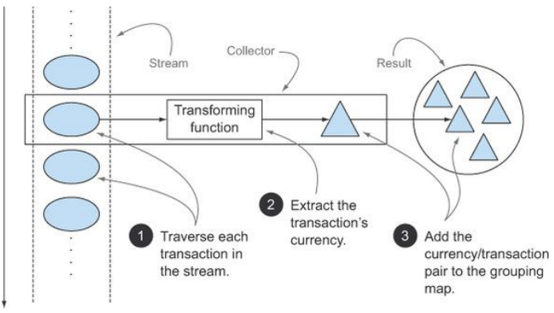
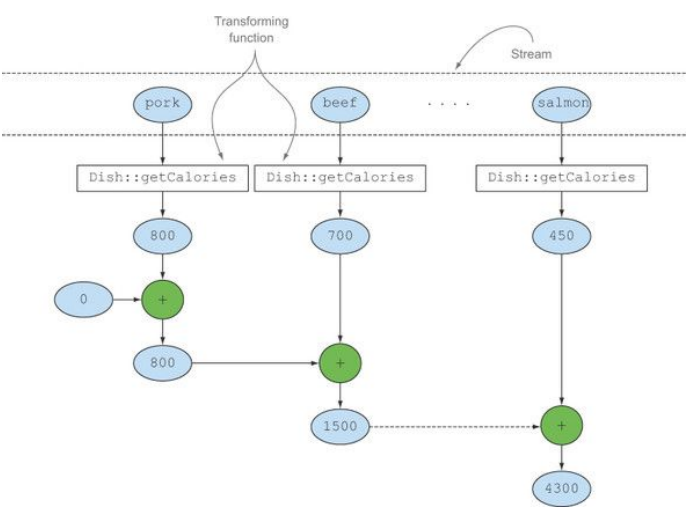
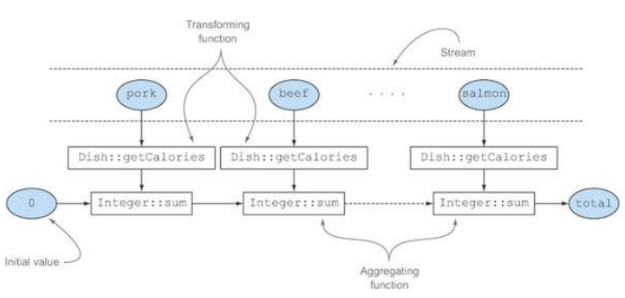
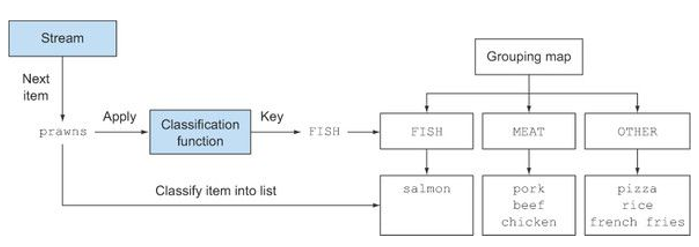
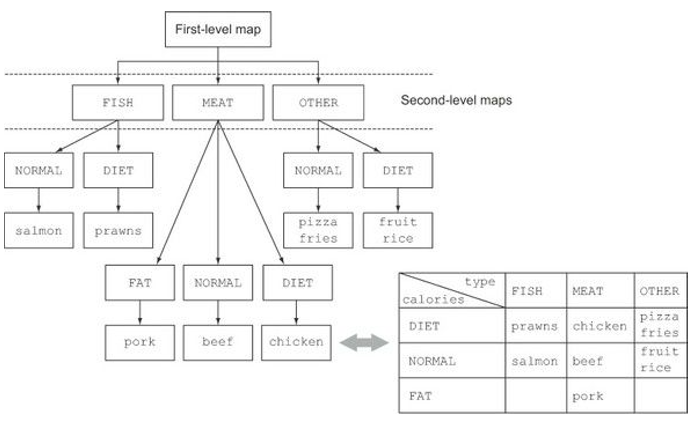
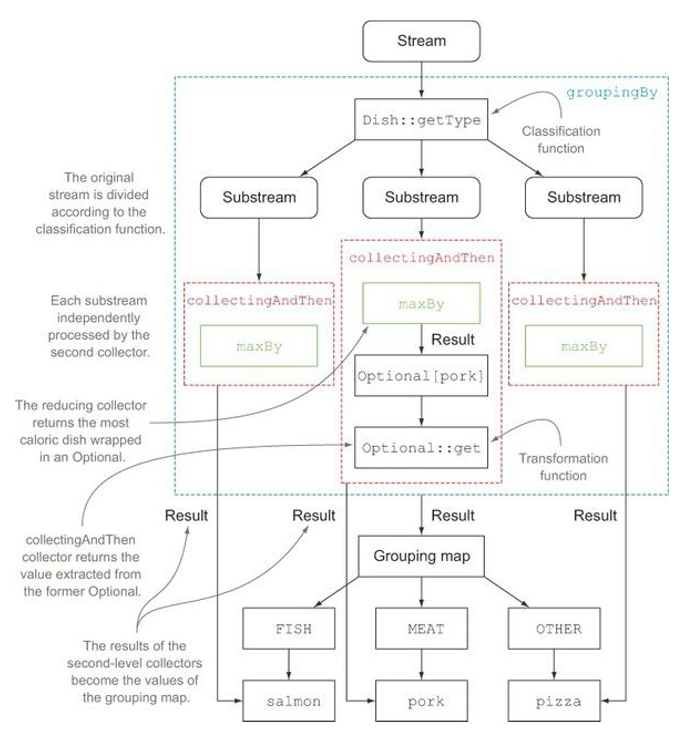
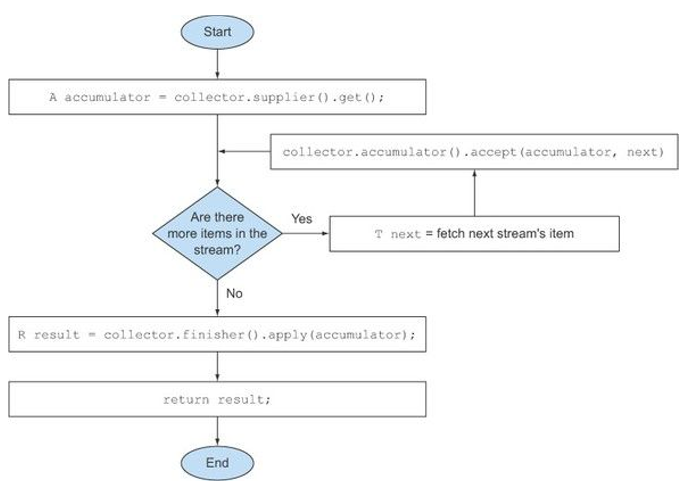
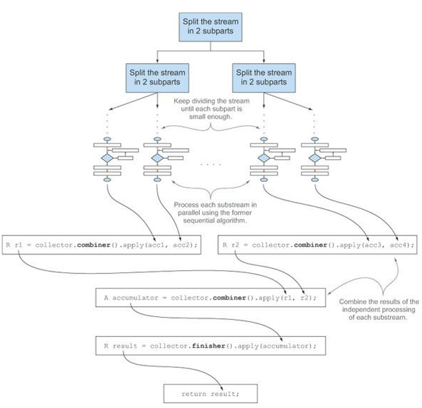

# Chap6. 스트림으로 데이터 수집

* 자바 8의 스트림이란 데이터 집합을 멋지게 처리하는 게으른 반복자라고 생각할 수 있다.

* 스트립 연산은 filter 또는 map 과 같은 중간 연산과 count, findFirst, forEach, reduce 등의 최종 연산으로 구분할 수 있다.

  * 중간 연산 : 한 스트림을 다른 스트림으로 변환하는 연산
    * 여러 연산을 연결할 수 있다.
    * 스트림 파이프라인을 구성하며, 스트림의 요소를 소비하지 않는다.
  * 최종 연산 : 스트림의 요소를 소비해서 최종 결과를 도출한다.
    * 스트림 파이프라인을 최적화하면서 계산 과정을 짧게 생략하기도 한다.

* Collection, Collector, collect를 헷갈리지 않도록 주의!

* collect와 Collector로 구현할 수 있는 질의 예제

  * 통화별로 트랜잭션을 그룹화한 다음에 해당 통화로 일어난 모든 트랜잭션 합계를 계산하시오.

    * Map<currency, Integer> 반환

  * 트랜잭션을 비싼 트랜잭션과 저렴한 트랜잭션 두 그룹으로 분류하시오.

    * Map<Boolean, List<Transaction>> 반환

  * 트랜잭션을 도시 등의 다수준으로 그룹화하시오. 그리고 각 트랜잭션이 비싼지 저렴한지 구분하시오.

    * Map<String, Map<Boolean, List<Transaction>> 반환.

  * 통화별로 트랜잭션을 그룹화한 코드(명령형 버전)

    ```java
    // 그룹화한 트랜잭션을 저장할 맵을 생성.
    Map<Currency, List<Transaction>> transactionByCurrencies = new HashMap<>();

    for(Transaction transaction : transactions) {
      Currency currency = transaction.getCurrency();	// 트랜잭션의 통화 추출.
      List<Transaction> transactionsForCurrency = transactionByCurrencies.get(currency);

      // 현재 통화를 그룹화하는 맵에 항목이 없으면 항목을 만든다.
      if(transactionsForCurrency == null) {
        transactionsForCurrency = new ArrayList<>();
        transactionsByCurrencies.put(currency, transactionsForCurrency);
      }

      // 같은 통화를 가진 트랜잭션 리스트에 현재 탐색 중인 트랙잭션 추가.
      transactionsForCurrency.add(transaction);
    }
    ```

    * 간단한 작업임에도 코드가 너무 길다.
    * 코드가 무엇을 실행하는 지 한눈에 파악하기 어렵다.

    ```java
    Map<Currency, List<Transaction>> transactionsByCurrencies =
    	transactions.stream().collect(groupingBy(Transaction::getCurrency));
    ```

    * 스트림을 사용하여 간결하게 표현.


## 6.1 컬렉터란 무엇인가?

* 함수형 프로그래밍에서는 '무엇'을 원하는지 직접 명시할 수 있어서 어떤 방법으로 이를 얻을지는 신경 쓸 필요가 없다.
* Collector 인터페이스 구현은 스트림의 요소를 어떤 식으로 도출할지 지정한다.
  * 5장에서는 toList를 Collector 인터페이스의 구현으로 사용.
  * 6장에서는 groupingBy를 이용해서 '각 키(통화) 버킷(bucket) 그리고 각 키 버킷에 대응하는 요소 리스트를 값으로 포함하는 맵을 만들라'는 동작을 수행.
* 다수준(multilevel)으로 그룹화를 수행할 때 명령형 프로그래밍과 함수형 프로그래밍의 차이점이 더욱 두드러진다.
  * 명령형 코드에서는 문제를 해결하는 과정에서 다중 루프와 조건문을 추가하여 가독성과 유지보수성이 크게 떨어진다.
  * 함수형 프로그래밍에서는 필요한 컬렉터를 쉽게 추가할 수 있다.(6.3절 참조)


### 6.1.1 고급 리듀싱 기능을 수행하는 컬렉터

* 함수형 API의 또 다른 장점으로 높은 수준의 조합성과 재사용성을 꼽을 수 있다.

  * collect로 결과를 수집하는 과정을 간단하면서도 유연한 방식으로 정의할 수 있다는 점이 컬렉터의 최대 강점.
    * 스트림에 collect를 호출하면 스트림의 요소에(컬렉터로 파라미터화된) 리듀싱 연산이 수행된다.
  * 통화별로 트랜잭션을 그룹화하는 리듀싱 연산
    * 명령형 프로그래밍에서 우리가 직접 구현해야했던 작업이 자동으로 수행된다.
    * collect에서는 리듀싱 연산을 이용해서 스트림의 각 요소를 방문하면서 컬렉터가 작업을 처리한다.
    * 보통 함수를 요소로 변환(toList처럼 데이터 자체를 변환하는 것보다는 데이터 저장 구조를 변환할 때가 많다)할 때는 컬렉터를 적용하며 최종 결과를 저장하는 자료구조에 값을 누적한다.
      * 통화 트랜잭션 그룹화 예제에서 변환함수는 각 트랜잭션에서 통화를 추출한 다음에 통화를 키로 사용해서 트랜잭션 자체를 결과 맵에 누적했다.

* Collector 인터페이스의 메서드를 어떻게 구현하느냐에 따라 스트림에 어떤 리듀싱 연산을 수행할지 결정된다.

  * Collectors 유틸리티 클래스는 자주 사용하는 컬렉터 인스턴스를 손쉽게 생성할 수 있는 정적 팩토리 메서드를 제공. (대표적인 예 - toList)

    ```java
    List<Transaction> transactions =
    	transactionStream.collect(Collectors.toList());
    ```


### 6.1.2 미리 정의된 컬렉터

* Collectors에서 제공하는 메서드의 기능
  * 스트림 요소를 하나의 값으로 리듀스하고 요약
  * 요소 그룹화
  * 요소 분할


### 6.2 리듀싱과 요약

* 컬렉터로 스트림의 모든 항목을 하나의 결과로 합칠 수 있다.

* 예제

  * counting()이라는 팩토리 메서드가 반환하는 컬렉터로 메뉴에서 요리 수를 계산.

    ```java
    long howManyDishes = menu.stream().collect(Collectors.counting());
    ```

    불필요한 과정 생략 가능

    ```java
    long howManyDishes = menu.stream().count();
    ```

    * counting 컬렉터는 다른 컬렉터와 함께 사용할 때 위력을 발휘한다.(뒤에서 설명)


### 6.2.1 스트림값에서 최댓값과 최솟값 검색

* Collectors.maxBy
* Collectors.minBy

두 컬렉터는 스트림의 요소를 비교하는 데 사용할 Comparator를 인수로 받는다.

```java
Comparator<Dish> dishCaloriesComparator =
	Comparator.comparingInt(Dish::getCalories);

Optional<Dish> mostCalorieDish =
	menu.stream()
		.collect(maxBy(dishCaloriesComparator));
```

* 칼로리로 요리를 비교하는 Comparator를 구현한 다음에 Collectors.maxBy로 전달.
* Optional은 값을 포함하거나 포함하지 않을 수 있는 컨테이너 (자바8)


스트림에 있는 객체의 숫자 필드의 합계나 평균등을 반환하는 연산에도 리듀싱 기능이 자주 사용된다. 이러한 연산을 요약(summarization) 연산이라 부른다.


### 6.2.2 요약 연산

* Collectors 클래스는 Collectors.summingInt라는 특별한 요약 팩토리 메서드를 제공한다.
* summingInt는 객체를 int로 매핑하는 함수를 인수로 받는다.
* summingInt의 인수로 전달된 함수는 객체를 Int로 매핑한 컬렉터를 반환한다.
* summingInt가 collect 메서드로 전달되면 요약 작업을 수행한다.

```java
int totalCalories = menu.stream().collect(summingInt(Dish::getCalories));
```


* summingInt 컬렉터의 누적 과정

  

  * 칼로리로 매핑된 각 요리의 값을 탐색하면서 초깃값(여기서는 0)으로 설정되어 있는 누적자에 칼로리를 더한다.
  * 다른 타입들도 존재
    * summingLong
    * summingDouble
  * 다른 형식들도 존재
    * averagingInt
    * averagingLong
    * averagingDouble

* 두 개 이상의 연산을 한 번에 수행해야 할 경우.

  * 팩토리 메서드 summarizingInt 사용.

    ```java
    IntSummaryStatistics menuStatistics =
    	menu.stream().collect(summarizingInt(Dish::getCalories));
    ```

  * 합계, 평균, 최댓값, 최솟값 등을 포함.

    ```
    IntSummaryStatistics{
    	count=3, sum=350, min=100,
    	average=116.666667, max=130
    }
    ```

    ​

### 6.2.3 문자열 연결

컬렉터에 joining 팩토리 메서드를 이용하면 스트림의 각 객체에 toString 메서드를 호출해서 추출한 모든 문자열을 하나의 문자열로 연결해서 반환한다.

```java
String shortMenu = menu.stream().map(Dish::getName).collect(joining());
```

* 내부적으로 StringBuilder를 이용해서 문자열을 하나로 만든다.

* Dish 클래스가 요리명을 반환하는 toString 메서드를 포함하고 있다면 map 처리 과정 생략 가능.

  ```java
  String shortMenu = menu.stream().collect(joining());
  ```

문자열이 구분 없이 합쳐져서 반환되므로 해석할 수가 없다.

```
porkbeefchickenfrench friesriceseason fruitpizzaprawnssalmon
```

* 콤마로 구분

  ```java
  String shortMenu = menu.stream().map(Dish::getName).collect(joining(", "));
  ```

  ```
  pork, beef, chicken, french fries, rice, season fruit, pizza, prawns, salmon
  ```


### 6.2.4 범용 리듀싱 요약 연산

* 지금까지 살펴본 모든 컬렉터는 reducing 팩토리 메서드로도 정의할 수 있다.

* 범용 팩토리 메서드 대신 특화된 컬렉터를 사용한 이유는 프로그래밍적 편의성 때문이다.

  * 편의성 뿐만 아니라 가독성도 중요하다는 사실을 명심!

* reducing 메서드로 만들어진 컬렉터로도 메뉴의 모든 칼로리 합계를 계산할 수 있다.

  ```java
  int totalCalories = menu.stream().collect(reducing(
  									0, Dish::getCalories, (i, j) -> i + j));
  ```

  * 첫 번째 인수는 리듀싱 연산의 시작값이거나 스트림에 인수가 없을 때는 반환값.
  * 두 번째 인수는 요리를 칼로리 정수로 변환할 때 사용한 변환 함수.
  * 세 번째 인수는 같은 종류의 두 항목을 하나의 값으로 더하는 BinaryOperator.

* 한 개의 인수를 가진 reducing 버전을 이용해서 가장 칼로리가 높은 요리를 찾는 방법도 있다.

  ```java
  Optional<Dish> mostCalorieDish =
  	menu.stream().collect(reducing(
  		(d1, d2) -> d1.getCalories() > d2.getCalories() ? d1 : d2));
  ```

  * 스트림의 첫 번째 요소를 첫 번째 인수으로 받으며, 자신을 그대로 반환하는 항등함수를 두번째 인수로 받는 상황에 해당한다.
  * 시작 값이 없으므로 빈 스트림이 넘겨졌을 때 시작값이 설정되지 않는 상황이 벌어진다.
    * 그래서 Optional 객체를 반환한다.


#### collect와 reduce

```java
Stream<Integer> stream = Arrays.asList(1, 2, 3, 4, 5, 6).stream();
List<Integer> numbers = stream.reduce(
							new ArrayList<Integer>(),
							(List<Integer> l, Integer e) -> {
                              l.add(e);
                              return l;
							},
							(List<Integer> l1, List<Integer> l2) -> {
                              l1.addAll(12);
                              return l1;
							});
```

* collect는 도출하려는 결과를 누적하는 컨테이너를 바꾸도록 설계된 메서드.
* reduce는 두 값을 하나로 도출하는 불변형 연산.
* 위 예제에서는 reduce 메서드를 누적자로 사용된 리스트를 변환시키므로 같은 결과를 반환하더라도 잘못 사용한 예에 해당한다.
  * 여러 스레드가 동시에 같은 데이터 구조체를 고치면 리스트 자체가 망가져버리므로 리듀싱 연산을 병렬로 수행할 수 없다.
  * 이 문제를 해결하려고 매번 새로운 리스트를 할당한다면 성능이 저하.
* 가변 컨테이너 관련 작업이면서 병렬성을 확보하려면 collect 메서드로 리듀싱 연산을 구현하는 것이 바람직하다.


#### 컬렉션 프레임워크 유연성 : 같은 연산도 다양한 방식으로 수행할 수 있다!

1. reducing 컬렉터를 사용한 이전 예제에서 람다 표현식 대신 Integer 클래스의 sum 메서드 레퍼런스를 이용하면 코드를 좀 더 단순화할 수 있다.

   ```java
   int totalCalories = menu.stream().collect(reducing(0,	// 초깃값
   								Dish::getCalories,	// 변환 함수
   								Integer::sum));		// 합계 함수
   ```

   * 메뉴의 모든 칼로리를 더하는 리듀싱 과정

     

     * 누적자를 초깃값으로 초기화하고, 합계 함수를 이용해서 각 요소에 변환 함수를 적용한 결과 숫자를 반복적으로 조합한다.

   * 6.2절에서 언급했던 counting 컬렉터도 reducing 팩토리 메서드를 이용해서 구현할 수 있다.

     ```java
     public static <T> Collector<T, ?, Long> counting() {
       return reducing(0L, e -> 1L, Long::sum);
     }
     ```

     * 제네릭 와일드카드 '?' 사용법
       * 위 예제에서 count 팩토리 메서드가 반환하는 컬렉터 시그너처의 두번째 제네릭 형식으로 와일드 카드 '?' 사용.
       * '?'는 컬렉터의 누적자 형식이 알려지지 않았음을, 즉 누적자의 형식이 자유로움을 의미한다.

2. 5장에서 컬렉터를 이용하지 않고 같은 연산을 수행했던 방법

   ```java
   int totalCalories =
   	menu.stream().map(Dish::getCalories).reduce(Integer::sum).get();
   ```

   * 요리 스트림을 요리의 칼로리로 매핑한 다음 메서드 레퍼런스로 결과 스트림을 리듀싱
     * reduce(Integer::sum)도 빈 스트림과 관련한 널 문제를 피할 수 있도록 int가 아닌 Optional<Integer>를 반환한다.
     * 요리 스트림이 비어있지 않다는 사실을 알고 있으므로 get을 자유롭게 사용할 수 있지만 일반적으로는 기본값을 제공할 수 있는 orElse, orElseGet 등을 이용하는 것이 좋다.

3. 스트림을 IntStream으로 매핑한 다음에 sum 메서드를 호출하는 방법

   ```java
   int totalCalories = menu.stream().mapToInt(Dish::getCalories).sum();
   ```

   ​

#### 자신의 상황에 맞는 최적의 해법 선택

* 스트림 인터페이스에서 직접 제공하는 메서드를 이용하는 것에 비해 컬렉터를 이용하는 코드가 더 복잡하다.

* 코드가 좀 더 복잡한 대신 재사용성과 커스터마이즈 가능성을 제공하는 높은 수준의 추상화와 일반화를 얻을 수 있다.

* 위 예제들 중에서는 IntStream을 사용한 방법이 가독성이 가장 좋고 간결하다.

  ```java
  int totalCalories = menu.stream().mapToInt(Dish::getCalories).sum();
  ```

  * IntStream 덕분에 auto-unboxing 연산을 수행하거나 Integer를 int로 변환하는 과정을 피할 수 있으므로 성능까지 좋다.


#### 퀴즈

아래 joining 컬렉터를 6.2.4절에서 사용한 reducing 컬렉터로 올바르게 바꾼 코드를 모두 선택하시오.

```java
String shortMenu = menu.stream().map(Dish::getName).collect(joining());
```

1. String shortMenu = menu.stream().map(Dish::getName)

   ​	.collect( reducing( (s1, s2) -> s1 + s2) ).get();

2. String shortMenu = menu.stream().map(Dish::getName)

   ​	.collect( reducing( (d1, d2) -> d1.getName() + d2.getName() ) ).get();

3. String shortMenu = menu.stream().map(Dish::getName)

   ​	.collect( reducing( "", Dish::getName, (s1, s2) -> s1 + s2) ).get();


* 답
  * 1, 3번이 답, 2번은 컴파일 되지 않는 코드.
    1. 원래의 joining 컬렉터처럼 각 요리를 요리명으로 변환한 다음에 문자열을 누적자로 사용해서 문자열 스트림을 리듀스하면서 요리명을 하나씩 연결한다.
    2. reducing은 BinaryOperator<T>, 즉 BiFunction<T, T, T>를 인수로 받는다.
       * 두 인수를 받아 같은 형식을 반환하는 함수.
       * 2번 람다 표현식은 두 개의 요리를 인수로 받아 문자열을 반환하므로 컴파일 오류.
    3. 빈 문자열을 포함하는 누적자를 이용해서 리듀싱 과정을 시작하며, 스트림의 요리를 방문하면서 각 요리를 요리명으로 변환한 다음에 누적자로 추가한다.
       * 세개의 인수를 갖는 reducing은 누적자 초깃값을 설정할 수 있으므로 Optional을 반환할 필요가 없다.
* 1, 3번이 올바른 코드이기는 하지만 범용 reducing으로 joining을 구현할 수 있음을 보여주는 예제일 뿐이다.
* 실무에서는 joining을 사용하는 것이 가독성과 성능에 좋다.


### 6.3 그룹화

팩토리 메서드 Collectors.groupingBy를 이용해서 쉽게 그룹화 할 수 있다.

```java
Map<Dish.Type, List<Dish>> dishesByType =
	menu.stream().collect(groupingBy(Dish::getType));
```

* 고기를 포함하는 그룹, 생선을 포함하는 그룹, 나머지 그룹으로 메뉴를 그룹화.

* Map에 포함된 결과

  ```
  {FISH=[pawns, salmon], OTHER=[french fries, rice, season fruit, pizza],
  MEAT=[pork, beef, chicken]}
  ```

* 스트림의 각 요리에서 Dish.Type과 일치하는 모든 요리를 추출하는 함수를 groupingBy 메서드로 전달했다.

  * 이 함수를 기준으로 스트림이 그룹화되므로 이를 **분류 함수(classification function)**라고 부른다.

* 그룹화로 스트림의 항목을 분류하는 과정

  

* 단순한 속성 접근자 대신 더 복잡한 분류 기준이 필요한 상황에서는 메서드 레퍼런스를 분류함수로 사용할 수 없다.

  * 메서드 레퍼런스 대신 람다 표현식 사용.

  ```java
  public enum CaloricLevel { DIET, NORMAL, FAT }

  Map<CaloricLevel, List<Dish>> dishesByCaloricLevel = menu.stream().collect(
  	groupingBy(dish -> {
        if (dish.getCalories() <= 400) {
          return CaloricLevel.DIET;
        } else if (dish.getCalories() <= 700) {
          return CaloricLevel.NORMAL;
        } else {
          return CaloricLevel.FAT;
        }
  	})
  );
  ```


### 6.3.1 다수준 그룹화

두 인수를 받는 팩토리 메서드 Collectors.groupingBy 를 이용해서 항목을 다수준으로 그룹화 할 수 있다.

* 일반적인 분류함수와 컬렉터를 인수로 받는다.

  * 바깥 쪽 groupingBy 메서드에 스트림의 항목을 분류할 두 번째 기준을 정의하는 내부 groupingBy를 전달해서 두 수준으로 스트림의 항목을 그룹화할 수 있다.

* 다수준 그룹화

  ```java
  Map<Dish.Type, Map<CaloricLevel, List<Dish>>> dishesByTypeCaloricLevel =
  	menu.stream().collect(
  		groupingBy(Dish::getType,	// 첫 번째 수준의 분류 함수
  			groupingBy(dish -> {	// 두 번째 수준의 분류 함수
                if (dish.getCalories() <= 400) {
                  return CaloricLevel.DIET;
                } else if (dish.getCalories() <= 700) {
                  return CaloricLevel.NORMAL;
                } else {
                  return CaloricLevel.FAT;
                }
  			})));
  ```

  ```
  {MEAT={DIET=[chicken], NORMAL=[beef], FAT=[pork]},
  FISH={DIET=[pawns], NORMAL=[salmon]},
  OTHER={DIET=[rice, season fruit], NORMAL=[french fries, pizza]}}
  ```

  * 외부 맵은 첫 번쨰 수준의 분류 함수에서 분류한 키 값 'fish, meat, other'를 갖는다.
  * 외부 맵의 값은 두 번째 수준의 분류 함수의 기준 'normal, diet, fat'을 키 값으로 갖는다.
  * 최종적으로 두 수준의 맵은 첫 번째 키와 두 번째 키의 기준에 부합하는 요소 리스트 값으로 갖는다.

* n 수준 중첩 맵과 n차원 분류표

  

* 보통 groupingBy의 연산을 버킷 개념으로 생각하면 쉽다.

  * 첫 번째 groupingBy는 각 키의 버킷을 만든다.
  * 그리고 준비된 각각의 버킷을 서브스트림 컬렉터로 채워가기를 반복하면서 n수준 그룹화를 달성한다!


### 6.3.2 서브그룹으로 데이터 수집

* 첫 번째 groupingBy로 넘겨주는 컬렉터의 형식은 제한이 없다.

  * 예를 들어 groupingBy 컬렉터에 두 번째 인수로 counting 컬렉터를 전달해서 메뉴에서 요리의 수를 종류별로 계산할 수 있다.

    ```java
    Map<Dish.Type, Long> typesCount = menu.stream().collect(
    	groupingBy(Dish::getType, counting()));
    ```

    ```
    {MEAT=3, FISH=2, OTHER=4}
    ```

    * 분류 함수 한개의 인수를 갖는 groupingBy(f)는 groupingBy(f, toList())의 축약형이다.

  * 가장 높은 칼로리를 가진 요리를 찾는 프로그램도 다시 구현가능

    ```java
    Map<Dish.Type, Optional<Dish>> mostCaloricByType =
    	menu.stream()
    		.collect(groupingBy(Dish::getType,
    			maxBy(comparingInt(Dish::getCalories))));
    ```

    ```
    {FISH=Optional[salmon], OTHER=Optional[pizza], MEAT=Optional[pork]}
    ```

    * groupingBy 컬렉터는 스트림의 첫 번째 요소를 찾은 이후에야 그룹화 맵에 새로운 키를 (게으르게) 추가한다.
    * 리듀싱 컬렉터가 반환하는 형식을 사용하는 상황이므로 굳이 Optional 래퍼를 사용할 필요가 없다.


#### 컬렉터 결과를 다른 형식에 적용하기

팩토리 메서드 Collectors.collectingAndThen으로 컬렉터가 반환한 결과를 다른 형식으로 활용할 수 있다.

```java
Map<Dish.Type, Optional<Dish>> mostCaloricByType =
	menu.stream()
		.collect(groupingBy(Dish::getType,	// 분류 함수
            collectingAndThen(
				maxBy(comparingInt(Dish::getCalories)),	// 감싸인 컬렉터
            	Optional::get)));	// 변환 함수
```

* collectingAndThen은 적용할 컬렉터와 변환 함수를 인수로 받아 다른 컬렉터를 반환한다.
* 반환되는 컬렉터는 기존 컬렉터의 래퍼 역할.
* collect의 마지막 과정에서 변환 함수로 자신이 반환하는 값을 매핑.
* 리듀싱 컬렉터는 절대 Optional.empty()를 반환하지 않는다.

```
{FISH=Optional[salmon], OTHER=Optional[pizza], MEAT=Optional[pork]}
```




* 컬렉터는 점선으로 표시.
* groupingBy는 가장 바깥쪽에 위치하면서 요리의 종류에 따라 메뉴 스트림을 세 개의 서브스트림으로 그룹화.
* groupingBy 컬렉터는 collectingAndThen 컬렉터를 감싼다.
  * 두 번째 컬렉터는 그룹화된 세 개의 서브스트림에 적용된다.
* collectingAndThen 컬렉터는 세번째 컬렉터 maxBy를 감싼다.
* 리듀싱 컬렉터가 서브스트림에 연산을 수행한 결과에 collectingAndThen의 Optional::get 변환 함수가 적용된다.
* groupingBy 컬렉터가 반환하는 맵의 분류 키에 대응하는 세 값이 각각의 요리 형식에서 가장 높은 칼로리다.


#### groupingBy와 함께 사용하는 다른 컬렉터 예제

일반적으로 스트림에서 같은 그룹으로 분류된 모든 요소에 리듀싱 작업을 수행할 때는 팩토리 메서드groupBy에 두 번째 인수로 전달한 컬렉터를 사용한다.

```java
Map<Dish.Type, Integer> totalCaloriesByType =
	menu.stream().collect(groupingBy(Dish::getType, summingInt(Dish::getCalories)));
```

* mapping 메서드로 만들어진 컬렉터도 groupingBy와 자주 사용.

  * mapping 메서드는 스트림의 인수를 변환하는 함수와 변환 함수의 결과 객체를 누적하는 컬렉터를 인수로 받는다.
  * 입력 요소를 누적하기 전에 매핑 함수를 적용해서 다양한 형식의 객체를 주어진 형식의 컬렉터에 맞게 변환하는 역할.

  ```java
  Map<Dish.Type, Set<CaloricLevel>> caloricLevelsByType =
  	menu.stream().collect(
  		groupingBy(Dish::getType, mapping(dish -> {
            if (dish.getCalories() <= 400) {
            	return CaloricLevel.DIET;
            } else if (dish.getCalories() <= 700) {
            	return CaloricLevel.NORMAL;
            } else {
            	return CaloricLevel.FAT;
            }
  		}, toSet())));
  ```

  * mapping 메서드에 전달한 변환 함수는 Dish를 CaloricLevel로 매핑.
  * 결과 스트림은 toSet 컬렉터로 전달.
    * 리스트가 아닌 집합으로 스트림의 요소가 누적. (중복값 적용 x)

  ```java
  {OTHER=[DIET, NORMAL], MEAT=[DIET, NORMAL, FAT], FISH=[DIET, NORMAL]}
  ```

* 결과를 수집할 컬렉터 형식 지정.

  ```
  Map<Dish.Type, Set<CaloricLevel>> caloricLevelsByType =
  	menu.stream().collect(
  		groupingBy(Dish::getType, mapping(dish -> {
            if (dish.getCalories() <= 400) {
            	return CaloricLevel.DIET;
            } else if (dish.getCalories() <= 700) {
            	return CaloricLevel.NORMAL;
            } else {
            	return CaloricLevel.FAT;
            }
  		}, toCollection(HashSet::new))));
  ```


### 6.4 분할

* 분할은 분할 함수(partitioning function)라 불리는 프레디케이트를 분류 함수로 사용하는 특수한 그룹화 기능.

* 불린을 반환하므로 맵의 키 형식은 Boolean이다.

* 결과적으로 그룹화 맵은 최대 두 개의 그룹(true/false)으로 분류된다.

  ```java
  Map<Boolean, List<Dish>> partitionedMenu =
  	menu.stream().collect(partitioningBy(Dish::isVegetarian));	// 분할 함수
  ```

  * 채식주의자 친구를 저녁에 초대했다고 가정.
  * 모든 요리를 채식 요리와 채식이 아닌 요리로 분류.

  ```
  {false=[pork, beef, chicken, prawns, salmon],
   true=[french fries, rice, season fruit, pizza]}
  ```

  * 참 값의 키로 맵에서 모든 채식 요리를 얻을 수 있다.

  ```java
  List<Dish> vegetarianDishes = partitionedMenu.get(true);
  ```

  * 이전 예제에서 사용한 프레디케이트로 필터링한 다음에 별도의 리스트에 결과를 수집해도 같은 결과.

  ```java
  List<Dish> vegetarianDishes =
  	menu.stream().filter(Dish::isVegetarian).collect(toList());
  ```


#### 6.4.1 분할의 장점

분할 함수가 반환하는 참, 거짓 두 가지 요소의 스트림 리스트를 모두 유지한다는 것이 분할의 장점.

* 분할 함수에 두번째 인수로 컬렉터 지정 가능

  ```java
  Map<Boolean, Map<Dish.Type, List<Dish>>> vegetarianDishesByType =
  	menu.stream().collect(
  		partitioningBy(Dish::isVegetarian,	// 분할 함수
  			groupingBy(Dish::getType)));	// 두 번째 컬렉터
  ```

  ```
  {false={FISH=[prawns, salmon], MEAT=[pork, beef, chicken]},
   true={OTHER=[french fries, rice, season fruit, pizza]}}
  ```

  * 채식인지에 대한 그룹과 요리 종류에 대한 그룹 두 수준의 맵이 반환.

* 추가로 가장 칼로리가 높은 요리도 찾을 수 있다.

  ```java
  Map<Boolean, Dish> mostCaloricPartitionedByVegetarian =
  	menu.stream().collect(
  		partitioningBy(Dish::isVegetarian,
  			collectingAndThen(
  				maxBy(comparingInt(Dish::getCalories)),
  				Optional::get)));
  ```

  ```
  {false=pork, true=pizza}
  ```

* 퀴즈 (partitioningBy 사용)

  * 다수준 분할 결과 예측

    1. menu.stream().collect(partitioningBy(Dish::isVegetarian,

       ​					partitioningBy(d -> d.getCalories() > 500)));

    2. menu.stream().collect(partitioningBy(Dish::isVegetarian,

       ​					partitioningBy(Dish::getType)));

    3. menu.stream().collect(partitioningBy(Dish::isVegetarian,

       ​					counting()));

  * 답

    1. 다음과 같은 두 수준의 맵을 반환

       ```
       {false={false=[chicken, prawns, salmon], true=[pork, beef]},
        true={false=[rice, season fruit], true=[french fries, pizza]}}
       ```

    2. partitioningBy는 불린을 반환하는 함수, 즉 프레디케이트를 요구하므로 컴파일 되지 않는 코드.

    3. 다음과 같은 맵 반환

       ```
       {false=5, true=4}
       ```


#### 6.4.2 숫자를 소수와 비소수로 분할하기

* 정수 n을 인수로 받아서 2에서 n까지의 자연수를 소수와 비소수로 나누는 프로그램

  ```java
  public boolean isPrime(int candidate) {
    return IntStream.range(2, candidate)	// 2부터 candidate 미만 사이의 자연수 생성.
    				.noneMatch(i -> candidate % i == 0);
  }
  ```

* 소수의 대상을 주어진 수의 제곱근 이하의 수로 제한

  ```java
  public boolean isPrime(int candidate) {  
    int candidateRoot = (int) Math.sqrt((double) candidate);
    return IntStream.rangeClosed(2, candidateRoot)
    				.noneMatch(i -> candidate % i == 0);
  }
  ```

* isPrime 메서드를 프레디케이트로 이용하고 partitioningBy 컬렉터로 리듀스해서 숫자를 소수와 비소수로 분류

  ```java
  public Map<Boolean, List<Integer>> partitionPrimes(int n) {  
    return IntStream.rangeClosed(2, n).boxed()
    				.collect(
    					partitioningBy(candidate -> isPrime(candidate)));
  }
  ```

  ​

##### Collectors 클래스의 정적 팩토리 메서드

* 책 참조 (p208 ~ p209)


### 6.5 Collector 인터페이스

Collector 인터페이스는 리듀싱 연산(즉, 컬렉터)을 어떻게 구현할지 제공하는 메서드 집합으로 구성된다.


* Collector 인터페이스

  ```java
  public interface Collector<T, A, R> {
    Supplier<A> supplier();
    BiConsumer<A, T> accumulator();
    Function<A, R> finisher();
    BinaryOperator<A> combiner();
    Set<Characteristics> characteristics();
  }
  ```

  * T는 수집될 스트림 항목의 제네릭 형식이다.

  * A는 누적자, 즉 수집과정에서 중간 결과를 누적하는 객체의 형식이다.

  * R은 수집 연산 결과 객체의 형식(항상 그런것은 아니지만 대게 컬렉션 형식)이다.

  * 예

    ```java
    public class ToListCollector<T> implements Collector<T, List<T>, List<T>>
    ```

    * Stream<T>의 모든 요소를 List<T>로 수집하는 ToListCollector 클래스.


#### 6.5.1 Collector 인터페이스의 메서드 살펴보기

* characteristics 메서드는 collect 메서드가 어떤 최적화(예를 들면 병렬화 같은)를 이용해서 리듀싱 연산을 수행할 것인지 결정하도록 돕는 힌트 특성 집합을 제공.
* 그 외 4개의 메서드는 collect 메서드에서 실행하는 함수를 반환.


##### supplier 메서드: 새로운 결과 컨테이너 만들기

* supplier는 수집 과정에서 빈 누적자 인스턴스를 만드는 파라미터가 없는 함수.

* 위의 예시 ToListCollector에 활용

  ```java
  public Supplier<List<T>> supplier() {
    return () -> new ArrayList<T>();
  }
  ```

  ```java
  public Supplier<List<T>> supplier() {
    return ArrayList::new;
  }
  ```


##### accumulator 메서드: 결과 컨테이너에 요소 추가하기

* 리듀싱 연산을 수행하는 함수를 반환.

* 스트림에서 n번째 요소를 탐색 할 때 누적자와 n 번째 요소를 함수에 적용.

  ```java
  public BiConsumer<List<T>, T> accumulator() {
    return (list, item) -> list.add(item);
  }
  ```

  ```java
  public BiConsumer<List<T>, T> accumulator() {
    return List::add;
  }
  ```


##### finisher 메서드: 최종 변환값을 결과 컨테이너로 적용하기

* 스트림 탐색을 끝내고 누적자 객체를 최종 결과로 변환하면서 누적 과정을 끝낼 때 호출할 함수를 반환.

  * 누적자 객체가 이미 최종 결과인 경우 변환 과정이 필요하지 않으므로 finisher 메서드는 항등 함수를 반환

  ```java
  public Function<List<T>, List<T>> finisher() {
    return Function.identity();
  }
  ```

  ​

##### combiner 메서드: 두 결과 컨테이너 병합

스트림의 서로 다른 서브파트를 병렬로 처리할 때 누적자가 이 결과를 어떻게 처리할지 정의.

스트림의 리듀싱을 병렬로 수행할 때 자바 7의 포크/조인 프레임워크와 7장에서 배울 Spliterator를 사용한다.



```java
public BinaryOperator<List<T>> combiner() {
  return (list1, list2) -> {
    list1.addAll(list2);
    return list;
  }
}
```


* 스트림의 병렬 리듀싱 수행 과정

  

  1. 스트림을 분할해야 하는지 정의하는 조건이 거짓으로 바뀌기 전까지 원래 스트림을 재귀적으로 분할.
     * 보통 분산된 작업의 크기가 너무 작아지면 병렬 수행의 속도는 순차 수행 속도보다 느려진다.
     * 일반적으로 프로세싱 코어의 개수를 초과하는 병렬 작업은 효율적이지 않다.
  2. 서브스트림(substream)의 각 요소에 리듀싱 연산을 순차적으로 적용해서 서브스트림을 병렬로 처리.
  3. 컬렉터의 combiner 메서드가 반환하는 함수로 모든 부분결과를 쌍으로 합친다.
     * 분할된 모든 서브스트림의 결과를 합치면서 연산 완료.


##### Characteristics 메서드

컬렉터의 연산을 정의하는 Characteristics 형식의 불변 진합을 반환.

* Characteristics는 스트림을 병렬로 리듀스할 것인지 그리고 병렬로 리듀스한다면 어떤 최적화를 선택해야 할지 힌트를 제공한다.
  * UNORDERED : 리듀싱 결과는 스트림 요소의 방문 순서나 누적 순서에 영향을 받지 않는다.
  * CONCURRENT : 다중 스레드에서 accumulator 함수를 동시에 호출할 수 있으며 이 컬렉터는 스트림의 병렬 리듀싱을 수행할 수 있다.
    * UNORDERED를 함께 설정하지 않았다면 데이터소스가 정렬되어 있지 않은 상황에서만 병렬 리듀싱을 수행할 수 있다.
  * IDENTITY_FINISH : finisher 메서드가 반환하는 함수는 단순히 identity를 적용할 뿐이므로 이를 생략할 수 있다.
    * 리듀싱 과정의 최종 결과로 누적자 객체를 바로 사용할 수 있다.
    * 누적자 A를  결과 R로 안전하게 형변환 할 수 있다.


#### 6.5.2 응용하기

```java
import java.util.*;
import java.util.function.BiConsumer;
import java.util.function.BinaryOperator;
import java.util.function.Function;
import java.util.function.Supplier;
import java.util.stream.Collector;

import static java.util.stream.Collector.Characteristics.CONCURRENT;
import static java.util.stream.Collector.Characteristics.IDENTITY_FINISH;

public class ToListCollector<T> implements Collector<T, List<T>, List<T>> {
    @Override
    public Supplier<List<T>> supplier() {
        return ArrayList::new;	// 수집 연산의 시발점
    }

    @Override
    public BiConsumer<List<T>, T> accumulator() {
        return List::add;	// 탐색한 항목을 누적하고 바로 누적자를 고친다.
    }

    @Override
    public Function<List<T>, List<T>> finisher() {
        return Function.identity();	// 항등 함수
    }

    @Override
    public BinaryOperator<List<T>> combiner() {
        return (list1, list2) -> {
            list1.addAll(list2);	// 두 번째 콘텐츠와 합쳐서 첫 번째 누적자를 고친다.
            return list1;	// 변경된 첫 번째 누적자를 반환한다.
        };
    }

    @Override
    public Set<Characteristics> characteristics() {
        return Collections.unmodifiableSet(EnumSet.of(
          IDENTITY_FINISH, CONCURRENT));	// 콜렉터의 플래그를 설정한다.
    }
}
```

* 자바 API에서 제공하는 컬렉터는 싱글턴 Collections.emptyList()로 빈 리스트를 반환한다.

* 사용

  ```java
  List<Dish> dishes = menuStream.collect(new ToListCollector<Dish>());
  ```

* 기존 코드

  ```
  List<Dish> dishes = menuStream.collect(toList());
  ```

* 기존 코드의 toList는 팩토리지만 ToListCollector는 new로 인스턴스화한다는 점이 다르다.


##### 컬렉터 구현을 만들지 않고도 커스텀 수집 수행하기

* IDENTITY_FINISH 수집 연산에서는 Collector 인터페이스를 완전히 새로 구현하지 않고도 같은 결과를 얻을 수 있다.

* Stream은 세 함수(supplier, accumulator, combiner)를 인수로 받는 collect 메서드를 오버로드하며 각각의 메서드는 Collector 인터페이스의 메서드가 반환하는 함수와 같은 기능을 수행한다.

  ```java
  List<Dish> dishes = menuStream.collect(
  	ArrayList::new,		// supplier
  	List::add,			// accumulator
  	List::addAll);		// combiner
  ```

  * 전보다 좀 더 간결하고 축약되어 있지만 가독성은 떨어진다.
    * 적절한 클래스로 커스텀 컬렉터를 구현하는 편이 중복을 피하고 재사용을 높이는데 도움이 된다.
  * 두 번째 collect 메서드로는 Characteristics를 전달할 수 없다.
    * 두 번째 collect 메서드는 IDENTITY_FINISH와 CONCURRENT지만 UNORDERED는 아닌 컬렉터로만 동작한다.


### 6.6 커스텀 컬렉터를 구현해서 성능 개선하기

* 커스텀 컬렉터로 n까지의 자연수를 소수와 비소수로 분할

  ```java
  public Map<Boolean, List<Integer>> partitionPrimes(int n) {
    return IntStream.rangeClosed(2, n).boxed()
    				.collect(partitioningBy(candidate -> isPrime(candidate));
  }
  ```

* 제곱근 이하로 대상(candidate)의 숫자 범위를 제한해서 isPrime 개선

  ```java
  public boolean isPrime(int candidate) {
    int candidateRoot = (int) Math.sqrt((double) candidate);
    return IntStream.rangeClosed(2, candidateRoot)
    				.noneMatch(i -> candidate % i == 0);
  }
  ```

* 커스텀 컬렉터를 이용하면 성능을 더 개선할 수 있다.


#### 6.6.1 소수로만 나누기

* 소수로 나누어 떨어지는지 확인하여 대상의 범위를 좁힐 수 있다.

* 제수(devisor)가 소수가 아니면 소용없으므로 제수를 현재 숫자 이하에서 발견한 소수로 제한.

* 먼저 주어진 숫자가 소수인지 아닌지 판단

  * 지금까지 발견한 소수 리스트에 접근해야 한다.
  * 현재까지의 컬렉터로는 컬렉터 수집 과정에서 부분결과에 접근할 수 없다.
  * 커스텀 컬렉터 클래스로 이 문제를 해결할 수 있다.

* 중간 결과 리스트가 있다면 isPrime 메서드로 중간 결과 리스트를 전달.

  ```java
  public static boolean isPrime(List<Integer> primes, int candidate) {
    return primes.stream().noneMatch(i -> candidate % i == 0);
  }
  ```

  * 대상 숫자의 제곱근보다 작은 소수만 사용하도록 코드를 최적화해야함.

    * 다음 소수가 대상의 루트보다 커진다면 소수로 나누어보는 검사를 멈춰야 한다.
    * 스트림 API에는 제공하는 메서드가 없다.
    * filter(p -> p <= candidateRoot)를 이용해서 대상의 루트보다 작은 소수를 필터링할 수 있다.
      * filter는 전체 스트림을 처리한 다음에 결과를 반환하게 된다.
      * 소수 리스트와 대상 숫자의 범위가 아주 크다면 성능 문제가 발생할 수 있다.
      * 대상의 제곱보다 큰 소수를 찾으면 검사를 중단함으로써 성능 문제를 없앨 수 있다.

    ```java
    public static <A> List<A> takeWhile(List<A> list, Predicate<A> p) {
      int i = 0;
      for(A item : list) {
        if(!p.test(item)) {		// 리스트의 현재 요소가 프레디케이트를 만족하는지 검사
          return list.subList(0, i);	// 프레디케이트를 만족하지 않으면 서브리스트 반환
        }
        i++;
      }
      return list;	// 모든 항목이 프레디케이트를 만족하므로 리스트 자체를 반환.
    }
    ```

    * 이 메서드를 이용해서 isPrime이 자신의 제곱근보다 작은 소수만 찾도록 최적화.

      ```java
      public static boolean isPrime(List<Integer> primes, int candidate) {
        int candidateRoot = (int) Math.sqrt((double) candidate);
        return takeWhile(primes, i -> i <= candidateRoot)
        			.stream()
        			.noneMatch(p -> candidate % p == 0);
      }
      ```

* 여기까지의 과정은 게으름과 반대되는 열심 버전의 takeWhile임.

* noneMatch와 takeWhile을 합쳐서 게으른 버전의 takeWhile을 만들 수 있지만 6장에서 설명하는 스트림 API 구현과 관계가 없으므로 자세히 살펴보지 않음.


##### 1단계: Collector 클래스 시그너처 정의

```java
public interface Collector<T, A, R>
```

* T : 스트림 요소의 형식
* A : 중간 결과를 누적하는 객체의 형식
* R : collect 연산의 최종 결과 형식

```java
public class PrimeNumbersCollector
		implements Collector<Integer,	// 스트림 요소의 형식
							Map<Boolean, List<Integer>>,	// 누적자 형식
							Map<Boolean, List<Integer>>>	// 수집 연산의 결과 형식
```


##### 2단계: 리듀싱 연산 구현

* supplier 메서드는 누적자를 만드는 함수를 반환해야 한다.

  ```java
  public Supplier<Map<Boolean, List<Integer>>> supplier() {
    return () -> new HashMap<Boolean, List<Integer>>() {{
      pub(true, new ArrayList<Integer>());
      put(false, new ArrayList<Integer>());
    }};
  }
  ```

  * 누적자로 사용할 맵을 만들면서 true, false 키와 빈 리스트로 초기화.
  * accumulator 메서드에서 스트림의 요소를 어떻게 수집할지 결정.
    * accumulator는 최적화의 핵심

* 지금까지 발견한 소수를 포함하는 누적자에 접근할 수 있다.

  ```java
  public BiConsumer<Map<Boolean, List<Integer>>, Integer> accumulator() {
    return (Map<Boolean, List<Integer>> acc, Integer candidate) -> {
      acc.get(isPrime(acc.get(true), candidate))	// isPrime결과에 따라 소수/비소수 리스트생성
      	.add(candidate);	// candidate를 알맞은 리스트에 추가.
    };
  }
  ```


##### 3단계: 병렬 실행할 수 있는 컬렉션 만들기(가능하다면)

* 병렬 수집 과정에서 두 부분 누적자를 합칠 수 있는 메서드를 만든다.

  ```java
  public BinaryOperator<Map<Boolean, List<Integer>>> combiner() {
    return (Map<Boolean, List<Integer>> map1,
    		Map<Boolean, List<Integer>> map2) -> {
            map1.get(true).addAll(map2.get(true));
            map1.get(false).addAll(map2.get(false));
            return map1;
    		}
  }
  ```

  * 알고리즘 자체가 순차적이어서 컬렉터를 실제 병렬로 사용할 순 없다.
    * 학습 목적으로 구현한 것.


##### 4단계: finisher 메서드와 컬렉터의 characteristics 메서드

```java
public Function<Map<Boolean, List<Integer>>,
				Map<Boolean, List<Integer>>> finisher() {
  return Function.identity();
}
```

커스텀 컬렉터는 CONCURRENT도 아니고 UNORDERED도 아니지만 IDENTITY_FINISH 이므로 다음처럼 구현 할 수 있다.

```java
public Set<Characteristics> characteristics() {
  return Collections.unmodifiableSet(EnumSet.of(IDENTITY_FINISH));
}
```


* 최종 구현 코드

  ```java
  public class PrimeNumbersCollector implements Collector<Integer, Map<Boolean, List<Integer>>, Map<Boolean, List<Integer>>> {

      @Override
      public Supplier<Map<Boolean, List<Integer>>> supplier() {
        	// 두 개의 빈 리스트를 포함하는 맵으로 수집 동작을 시작.
          return () -> new HashMap<Boolean, List<Integer>>() {{
              put(true, new ArrayList<Integer>());
              put(false, new ArrayList<Integer>());
          }};
      }

      @Override
      public BiConsumer<Map<Boolean, List<Integer>>, Integer> accumulator() {
          return (Map<Boolean, List<Integer>> acc, Integer candidate) -> {
            	// 지금까지 발견한 소수 리스트를 isPrime 메서드로 전달.
              acc.get(isPrime(acc.get(true)
                  , candidate))
                      .add(candidate);
          };
      }

      @Override
      public BinaryOperator<Map<Boolean, List<Integer>>> combiner() {
          return (Map<Boolean, List<Integer>> map1,
                  Map<Boolean, List<Integer>> map2) -> {	// 두번째 맵을 첫번째 맵에 병합
              map1.get(true).addAll(map2.get(true));
              map1.get(false).addAll(map2.get(false));
              return map1;
          };
      }

      @Override
      public Function<Map<Boolean, List<Integer>>, Map<Boolean,
        List<Integer>>> finisher() {
        	// 최종 수집 과정에서 데이터 변환이 필요하지 않으므로 항등함수 반환
          return Function.identity();
      }

      @Override
      public Set<Characteristics> characteristics() {
        	// 발견한 소수의 순서에 의미가 있으므로 콜렉터는 IDENTITY_FINISH지만
        	// UNORDERED, CONCURRENT는 아니다.
          return Collections.unmodifiableSet(EnumSet.of(IDENTITY_FINISH));
      }
  }
  ```

* partitioningBy를 이용했던 예제를 커스텀 컬렉터로 교체

  ```java
  public Map<Boolean, List<Integer>> partitionPrimesWithCustom(int n) {
    return IntStream.rangeClosed(2, n).boxed()
    				.collect(new PrimeNumbersCollector());
  }
  ```


#### 6.6.2 컬렉터 성능 비교

* 컬렉터 성능을 확인할 수 있는 하니스(harness)

  ```java
  public class CollectorHarness {
    public static void main(String[] args) {
      long fastest = Long.MAX_VALUE;
      for(int i = 0; i < 10; i++) {
        long start = System.nanoTime();
        partitionPrimes(1_000_000);
        long duration = (System.nanoTime() - start) / 1_000_000;
        if(duration < fastest) {
          fastest = duration;
        }
      }
      System.out.println("Fastest execution done in " + fastest + "msecs");
    }
  }
  ```

  * partitioningBy로 백만 개의 자연수를 소수와 비소수로 분류하는 작업을 10회 반복.

  * 가장 빨리 실행된 속도를 기록.

  * 인텔 i5  2.4Hz로 프로그램 실행

    ```
    Fastest execution done in 4716 msecs
    ```

  * partitionPrimes를 partitionPrimesWithCustomCollector로 바꾼 후 실행

    ```
    Fastest execution done in 3201 msecs
    ```

    * 성능 약 32%까지 향상.

* PrimeNumbersCollector의 핵심 로직을 구현

  ```java
  public Map<Boolean, List<Integer>> partitionPrimesWithCustomCollector(int n) {
    IntStream.rangeClosed(2, n).boxed()
    	.collect(
    		() -> new HashMap<Boolean, List<Integer>>() {{
            pub(true, new ArrayList<Integer>();
            pub(false, new ArrayList<Integer>();
    		}},
    		(acc, candidate) -> {
            acc.get(isPrime(acc.get(true), candidate))
            	.add(candidate);
    		},
    			(map1, map2) -> {
                map1.get(true).addAll(map2.get(true));
                map1.get(false).addAll(map2.get(false));
    			})
  }
  ```

  * Collector 인터페이스를 구현하는 새로운 클래스를 만들 필요가 없다.

  * 결과 코드는 간결하지만 가독성과 재사용성은 떨어진다.

    ​

### 6.7 요약

* collect는 스트림의 요소를 요약 결과로 누적하는 다양한 방법(컬렉터라 불리는)을 인수로 갖는 최종 연산이다.
* 스트림의 요소를 하나의 값으로 리듀스하고 요약하는 컬렉터뿐 아니라 최솟값, 최댓값, 평균값을 계산하는 컬렉터 등이 미리 정의되어 있다.
* 미리 정의된 컬렉터인 groupingBy로 스트림의 요소를 그룹화하거나, partitioningBy로 스트림의 요소를 분할할 수 있다.
* 컬렉터는 다수준의 그룹화, 분할, 리듀싱 연산에 적합하게 설계되어 있다.
* Collector 인터페이스에 정의된 메서드를 구현해서 커스텀 컬렉터를 개발할 수 있다.
