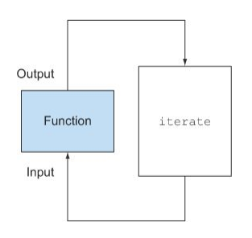

[TOC]


# Chap07. 병렬 데이터 처리와 성능

* 이 장에서 다룰 내용
  * 병렬 스트림으로 데이터를 병렬 처리하기
  * 병렬 스트림의 성능 분석
  * 포크/조인 프레임워크
  * Spliterator로 스트림 데이터 쪼개기


## 7.1 병렬 스트림

* 스트림 인터페이스를 이용하면 아주 간단하게 요소를 병렬로 처리할 수 있다.

  * 컬렉션에 parallelStream을 호출하면 **병렬스트림(parallel stream)**이 생성된다.

* 병렬 스트림이란?

  * 각각의 스레드에서 처리할 수 있도록 스트림 요소를 여러 청크로 분할한 스트림.
  * 병렬 스트림을 이용하면 모든 멀티코어 프로세서가 각각의 청크를 처리하도록 할당할 수 있다.

* 예제 : 숫자 n을 인수로 받아서 1부터 n까지의 모든 숫자의 합계를 반환하는 메서드.

  ```java
  public static long sequentialSum(long n) {
  	return Stream.iterate(1L, i -> i + 1)	// 무한 자연수 스트림 생성
                      .limit(n)	// n 개 이하로 제한
                      .reduce(0L, Long::sum);  // 모든 숫자를 더하는 스트림 리듀싱 연산
  }
  ```

  * 숫자로 이루어진 무한 스트림을 만든 다음 인수로 주어진 크기로 스트림을 제한하고 두 숫자를 더하는 BinaryOperator로 리듀싱 작업을 수행.
    * BinaryOperator이기 때문에 인자로 받은 타입과 동일한 타입으로 반환
  * 전통적인 자바에서는 아래와 같이 반복문으로 이를 구현할 수 있다.

  ```java
  public static long iterativeSum(long n) {
  	long result = 0;
      for(long i = 1L; i <= n; i++) {
          result += i;
      }
      return result;
  }
  ```

  * n이 커진다면 이 연산을 병렬로 처리하는 것이 좋을 것이다.
  * 고려해봐야 할 사항
    * 결과 변수는 어떻게 동기화해야 할까?
    * 몇 개의 스레드를 사용해야 할까?
    * 숫자는 어떻게 생성할까?
    * 생성된 숫자는 누가 더할까?
  * 병렬 스트림을 이용하면 쉽게 해결할 수 있다.


### 7.1.1 순차 스트림을 병렬 스트림으로 변환하기

* 순차 스트림에 parallel 메서드를 호출하면 기존의 함수형 리듀싱 연산이 병렬로 처리된다.

  ```java
  public static long parallelSum(long n) {
    return Stream.iterate(1L, i -> i + 1)
    				.limit(n)
    				.parallel()	// 스트림을 병렬 스트림으로 변환
    				.reduce(0L, Long::sum);
  }
  ```

  * 이전 코드와 다른 점은 스트림이 여러 청크로 분할되어 있다는 것.

  * 리듀싱 연산을 여러 청크에 병렬로 수행할 수 있다.

    

    * 마지막 리듀싱 연산으로 생성된 부분결과를 다시 리듀싱 연산으로 합쳐서 전체 스트림의 리듀싱 결과를 도출한다.

  * 순차 스트림에 parallel을 호출해도 스트림 자체에는 아무 변화도 일어나지 않는다.

    * 내부적으로는 parallel을 호출하면 이후 연산이 병렬로 수행해야 함을 의미하는 불린 플래그가 설정된다.

  * 반대로 sequential로 병렬 스트림을 순차 스트림으로 바꿀 수 있다.

    * 이 두 메서드를 이용해서 어떤 연산을 병렬로 실행하고 어떤 연산을 순차로 실행할지 제어할 수 있다.

      ```java
      stream.parallel()
      		.filter(...)
      		.sequential()
      		.map(...)
      		.parallel()
      		.reduce();
      ```

      * parallel과 sequential 두 메서드 중 최종적으로 호출된 메서드가 전체 파이프라인에 영향을 미친다.
      * 위 코드에서는 파이프라인의 마지막 호출이 parallel 이므로 파이프라인은 전체적으로 병렬로 수행된다.


#### 병렬 스트림에서 사용하는 스레드 풀 설정

* 병렬 스트림은 내부적으로 ForkJoinPool을 사용한다. (7.2절에서 설명)

* 기본적으로 ForkJoinPool은 프로세서 수, 즉 Runtime.getRuntime().availableProcessors()가 반환하는 값에 상응하는 스레드를 갖는다.

  ```java
  System.setProperty("java.util.concurrent.ForkJoinPool.common.parallelism", "12");
  ```

  * 위 예제는 전역 설정 코드이므로 이후의 모든 병렬 스트림 연산에 영향을 준다.
  * 현재는 하나의 병렬 스트림에 사용할 수 있는 특정한 값을 지정할 수 없다.
  * 일반적으로 기기의 프로세서 수와 같으므로 특별한 이유가 없다면 기본값 그대로 사용할 것을 권장한다.


### 7.1.2 스트림 성능 측정

* 소프트웨어 공학에서 추측은 위험한 방법!

* 성능을 최적화 할 때는 세가지 황금 규칙을 기억해야 한다.

  * 첫째도 측정, 둘째도 측정, 셋째도 측정!

* 예제 : n개의 숫자를 더하는 함수의 성능 측정

  ```java
  public long measureSumPerf(Function<Long, Long> adder, long n) {
    long fastest = Long.MAX_VALUE;
    for(int i = 0; i < 10; i++) {
      long start = System.nanoTime();
      long sum = adder.apply(n);
      long duration = (System.nanoTime() - start) / 1_000_000;
      System.out.println("Result: " + sum);
      if(duration < fastest) fastest = duration;
    }
    return fastest;
  }
  ```

  * 함수와 long을 인수로 받는다.

  * 주어진 long 값을 이용해서 메서드로 전달된 함수를 10번 반복 수행하며 시간을 밀리초 단위로 측정하고 그 중 가장 짧은 시간을 반환한다.

  * 지금까지 개발한 모든 메서드를 ParallelStreams라는 클래스로 구현했다고 가정하면 다음처럼 위 측정 코드와 순차 덧셈 함수를 이용해서 천만 개 숫자의 합계에 걸리는 시간을 계산할 수 있다.

  * 아래의 테스트들은 맥북 프로 인텔 i7 2.3GHz 쿼드코어에서 실행.

  * 병렬 스트림을 적용하지 않은 sequential stream.

    ```java
    System.out.println("Sequential sum done in: " +
                       measureSumPerf(ParallelStreams::sequentialSum, 10_000_000) + " msecs");
    ```

    ```
    Sequential sum done : 97 msecs
    ```

  * 고전적인 for 루프를 사용한 반복 버전이 생각보다 빠르다는 점도 고려해야한다.

    * for 루프는 저수준으로 작동하며 기본값을 박싱하거나 언박싱할 필요가 없으므로 수행속도가 빠르다.

    ```java
    System.out.println("Iterative sum done in: " + 
    	measureSumPerf(ParallelStreams::iterativeSum, 10_000_000) + " msecs");
    ```

    ```
    Iterative sum done in: 2 msecs
    ```

  * 병렬 스트림 적용

    ```java
    System.out.println("Parallel sum done in: " + 
    	measureSumPerf(ParallelStreams::parallelSum, 10_000_000) + " msecs");
    ```

    ```
    Parallel sum done in: 164 msecs
    ```

    * 병렬 버전이 위의 순차 버전보다 느리게 동작한다.

      * iterate가 박싱된 객체를 생성하므로 이를 다시 언박싱하는 과정이 필요.

      * iterate는 병렬로 실행될 수 있도록 독립적인 청크로 분할하기가 어렵다.

        * 이전 연산의 결과에 따라 다음 함수의 입력이 달라지기 때문에 iterate연산을 청크로 분할하기가 어렵다.

        

        * 이와 같은 상황에서는 리듀싱 연산이 수행되지 않는다.
        * 리듀싱 과정을 시작하는 시점에 전체 숫자 리스트가 준비되지 않았으므로 스트림을 병렬로 처리할 수 있도록 청크로 분할할 수 없다.
        * 스트림이 병렬로 처리되도록 지시했고 각각의 합계가 다른 스레드에서 수행되었지만 결국 순차처리 방식과 크게 다른 점이 없으므로 스레드를 할당하는 오버헤드만 증가하게 된다.

* 병렬 프로그래밍을 오용(예를들어 병렬과 거리가 먼 iterate를 사용)하면 오히려 전체 프로그램의 성능이 나빠질 수도 있다.


#### 더 특화된 메서드 사용

* 멀티코어 프로세서를 활용해서 효과적으로 합계 연산을 병렬로 실행하려면?

  * LongStream.rangeClosed (5장에서 소개했었음)
    * 기본형 long을 직접 사용하므로 박싱과 언박싱 오버헤드가 사라진다.
    * 쉽게 청크로 분할할 수 있는 숫자 범위를 생산한다.

* 언박싱과 관련된 오버헤드 측정

  ```java
  public static long rangedSum(long n) {
    return LongStream.rangeClosed(1, n)
    					.reduce(0L, Long::sum);
  }
  ```

  ```
  Ranged sum done in: 17 msecs
  ```

  * iterate 팩토리 메서드로 생성한 순차 버전에 비해 이 예제의 숫자 스트림 처리 속도가 더 빠르다.

    * 특화되지 않은 스트림을 처리할 때는 오토박싱, 언박싱 등의 오버헤드를 수반.

  * 상황에 따라서는 어떤 알고리즘을 병렬화하는 것보다 적절한 자료구조를 선택하는 것이 더 중요하다.

    ```java
    public static long parallelRangedSum(long n) {
      return LongStream.rangeClosed(1, n)
      					.parallel()
      					.reduce(0L, Long::sum);
    }
    ```

    ```
    Parallel range sum done in: 1 msecs
    ```

    * 실질적으로 리듀싱 연산이 병렬로 수행된다.

* 병렬화가 완전 공짜는 아니라는 사실을 기억하자

  * 스트림을 재귀적으로 분할해야 하고,
  * 각 서브스트림을 서로 다른 스레드의 리듀싱 연산으로 할당하고,
  * 결과를 하나의 값으로 합쳐야 한다.

* 멀티코어 간의 데이터 이동은 우리 생각보다 비싸다.

  * 따라서, 코어 간에 데이터 전송 시간보다 훨씬 오래 걸리는 작업만 병렬로 다른 코어에서 수행하는 것이 바람직하다.

* 상황에 따라 쉽게 병렬화를 이용할 수 있거나 아니면 아예 병렬화를 이용할 수 없는 때도 있다.

* 스트림을 병렬화해서 코드 실행 속도를 빠르게 하고 싶으면 항상 병렬화를 올바르게 사용하고 있는지 확인해야한다.


### 7.1.3 병렬 스트림의 올바른 사용법

* 병렬 스트림을 잘못 사용하면서 발생하는 많은 문제는 공유된 상태를 바꾸는 알고리즘을 사용하기 때문에 일어난다.

* 예제 : n까지의 자연수를 더하면서 공유된 누적자를 바꾸는 프로그램

  ```java
  public static long sideEffectSum(long n) {
    Accumulator accumulator = new Accumulator();
    LongStream.rangeClosed(1, n).forEach(accumulator::add);
    return accumulator.total;
  }

  public class Accumulator {
    public long total = 0;
    public void add(long value) { total += value; }
  }
  ```

  * 위 코드는 본질적으로 순차 실행할 수 있도록 구현되어 있으므로 병렬로 실행하면 참사가 일어난다.
    * 특히, total을 접근할 때마다(다수의 스레드에서 동시 접근) 데이터 레이스 문제가 일어난다.
    * 동기화로 문제를 해결하다 보면 결국 병렬화라는 특성이 없어져 버릴 것이다.

* 위 예제를 병렬화로 수행

  ```java
  public static long sideEffectParallelSum(long n) {
    Accumulator accumulator = new Accumulator();
    LongStream.rangeClosed(1, n).parallel.forEach(accumulator::add);
    return accumulator.total;
  }
  ```

  ```java
  System.out.println("SideEffect parallel sum done in: " + 
  	measurePerf(ParallelStreams::sideEffectParallelSum, 10_000_000L) + "msecs");
  ```

  * 결과

  ```
  Result: 6431705159695
  Result: 6767891733151
  Result: 11834768628881
  Result: 6598795769163
  Result: 8340036216259
  Result: 6817885072782
  Result: 5474914622349
  Result: 6293323781930
  Result: 6917221933822
  Result: 7558243635708
  SideEffect prallel sum done in: 49 msecs
  ```

  * 성능은 둘째 치고 올바른 결과값이 나오지 않는다.
  * 병렬 계산에서는 공유된 가변 상태를 피해야 한다.


### 7.1.4 병렬 스트림 효과적으로 사용하기

#### 확신이 서지 않는다면 직접 측정하라.

* 순차 스트림을 병렬 스트림으로 쉽게 바꿀 수 있다.
* 무조건 병렬 스트림으로 바꾸는 것이 능사는 아니다.
* 병렬 스트림의 수행과정은 투명하지 않을 때가 많다.
* 순차 스트림과 병렬 스트림 중 어떤 것이 좋을지 모르겠다면 적절한 벤치마크로 직접 성능을 측정하는 것이 바람직하다.


#### 박싱을 주의하라.

* 자동 박싱과 언박싱은 성능을 크게 저하시킬 수 있는 요소다.
* 자바 8은 박싱 동작을 피할 수 있도록 기본형 특화 스트림을 제공한다.
  * IntStream, LongStream, DoubleStream


#### 순차 스트림보다 병렬 스트림에서 성능이 떨어지는 연산이 있다.

* 특히 limit나 findFirst처럼 요소의 순서에 의존하는 연산을 병렬 스트림에서 수행하려면 비싼 비용을 치러야 한다.
  * 예를들어, findAny는 요소의 순서와 상관 없이 연산하므로 findFirst보다 성능이 좋다.
* 정렬된 스트림에 unordered를 호출하면 비정렬된 스트림을 얻을 수 있다.
  * 요소의 순서가 상관 없다면 비정렬된 스트림에 limit를 호출하는 것이 더 효율적이다.


#### 스트림에서 수행하는 전체 파이프라인 연산 비용을 고려하라.

* 전체 스트림 파이프 라인 처리 비용 = N * Q
  * N : 처리해야할 요소 수
  * Q : 하나의 요소를 처리하는데 드는 비용
* Q가 높아진다는 것은 병렬 스트림으로 성능을 개선할 수 있는 가능성이 있음을 의미한다.


#### 소량의 데이터에서는 병렬 스트림이 도움 되지 않는다.

* 병렬화 과정에서 생기는 부가 비용을 상쇄할 수 있을 만큼의 이득을 얻지 못한다.


#### 스트림을 구성하는 자료구조가 적절한지 확인하라.

* 예를 들어 ArrayList를 LinkedList보다 효율적으로 분할할 수 있다.
  * LinkedList를 분할하려면 모든 요소를 탐색해야 하지만 ArrayList는 요소를 탐색하지 않고도 리스트를 분할할 수 있기 때문.
* range 팩토리 메서드로 만든 기본형 스트림도 쉽게 분해할 수 있다.
* 커스텀 Spliterator를 구현해서 분해 과정을 완벽하게 제어할 수 있다.


#### 스트림의 특성과 파이프라인의 중간 연산이 스트림의 특성을 어떻게 바꾸는지에 따라 분해 과정의 성능이 달라질 수 있다.

* 예를 들어 SIZED 스트림은 정확히 같은 크기의 두 스트림으로 분할 할 수 있으므로 효과적으로 스트림을 병렬처리할 수 있다. 
* 반면 필터 연산이 있으면 스트림의 길이를 예측할 수 없으므로 효과적으로 스트림을 병렬처리할 수 있을지 알 수 없게 된다.


#### 최종 연산의 병합 과정 비용을 살펴보라.

* 병합 과정의 비용이 비싸다면 병렬 스트림으로 얻은 성능의 이익이 서브스트림의 부분결과를 합치는 과정에서 상쇄될 수 있다.


#### 병렬 스트림이 수행되는 내부 인프라구조도 살펴봐야 한다.

* 자바 7에서 추가된 포크/조인 프레임워크로 병렬 스트림이 처리된다.


## 7.2 포크/조인 프레임워크

* 포크/조인 프레임워크는 병렬화 할 수 있는 작업을 재귀적으로 작은 작업으로 분할한 다음에 서브태스크 각각의 결과를 합쳐서 전체 결과를 만들도록 설계되었다.
* 서브태스크를 스레드 풀(ForkJoinPool)의 작업자 스레드에 분산 할당하는 ExcutorService 인터페이스를 구현한다.


### 7.2.1 RecursiveTask 활용

* 스레드 풀을 이용하려면 RecursiveTask<R>의 서브클래스를 만들어야 한다.

  * R은 병렬화된 태스크가 생성하는 결과 형식.
  * 결과가 없을 때는 RecursiveAction 형식.
    * 결과가 없더라도 다른 비지역 구조를 바꿀 수 있다.

* RecursiveTask를 정의하려면 추상 메서드 compute를 구현해야 한다.

  ```java
  protected abstract R compute();
  ```

  * 태스크를 서브태스크로 분할하는 로직과 더 이상 분할할 수 없을 때 개별 서브 태스크의 결과를 생산할 알고리즘을 정의.

  * 대부분의 compute 메서드 구현은 다음과 같은 의사코드 형식을 유지한다.

    ```java
    if(태스크가 충분히 작거나 더 이상 분할할 수 없으면) {
      순차적으로 태스크 계산
    } else {
      태스크를 두 서브태스크로 분할
      태스크가 다시 서브태스크로 분할되도록 이 메서드를 재귀적으로 호출함
      모든 서브태스크의 연산이 완료될 때까지 기다림
      각 서브태스크의 결과를 합침
    }
    ```

  * 태스크를 더 분할할 것인지 말 것인지 정해진 기준은 없지만 아래에서 몇 가지 경험적으로 얻은 좋은 데이터를 소개할 예정.

* 재귀적인 태스크 분할 과정

  

  * 위 알고리즘은 분할 후 정복(divide and conquer) 알고리즘의 병렬화 버전이다.
    * 하나의 문제를 작은 문제로 분할해서 해결하는 방식을 의미.
    * 자세한 내용은 [위키피디아](http://en.wikipedia.org/wiki/Divide_and_conquer_algorithms) 참고

* 예제 : 포크/조인 프레임워크를 이용해서 범위의 숫자를 더하는 문제 구현.

  * 다음 코드에서 보여주는 것처럼 먼저 RecursiveTask를 구현해야 한다.

  ```java
  public class ForkJoinSumCalculator
          extends java.util.concurrent.RecursiveTask<Long> {  // RecursiveTask를 상속받아 포크/조인 프레임워크에서 사용할 태스크를 생성.
    private final long[] numbers;
    private final int start;  // 서브 태스크에서 처리할 배열의 초기 위치
    private final int end;    // 서브 태스크에서 처리할 배열의 최종 위치
    public static final long THRESHOLD = 10_000;  // 이 값 이하의 서브태스크는 더이상 분할할 수 없다.

    // 메인 태스크를 생성할 때 사용할 공개 생성자
    public ForkJoinSumCalculator(long[] numbers) {
      this(numbers, 0, numbers.length);
    }

    // 메인 태스크의 서브태스크를 재귀적으로 만들 때 사용할 비공개 생성자
    public ForkJoinSumCalculator(long[] numbers, int start, int end) {
      this.numbers = numbers;
      this.start = start;
      this.end = end;
    }

    @Override
    protected Long compute() {  // RecursiveTask의 추상 메서드 오버라이드
      int length = end - start; // 이 태스크에서 더할 배열의 길이
      if(length <= THRESHOLD) {
        return computeSequentially(); // 기준 값과 같거나 작으면 순차적으로 결과를 계산.
      }

      // 배열의 첫 번째 절반을 더하도록 서브 태스크를 생성
      ForkJoinSumCalculator leftTask = new ForkJoinSumCalculator(numbers, start, start + length / 2);
      leftTask.fork();  // ForkJoinPool의 다른 스레드로 새로 생성한 태스크를 비동기로 실행.

      // 배열의 나머지 절반을 더하도록 서브태스크를 생성
      ForkJoinSumCalculator rightTask = new ForkJoinSumCalculator(numbers, start + length / 2, end);
      Long rightResult = rightTask.compute(); // 두 번째 서브태스크를 동기 실행한다.(이 때 추가로 분할이 일어날 수 있다.)
      Long leftResult = leftTask.join();  // 첫 번째 서브태스크의 결과를 읽거나 아직 결과가 없으면 기다린다.
      return rightResult + leftResult;  // 두 서브태스크의 결과를 조합한 값이 이 태스크의 결과
    }

    // 더 분할할 수 없을 때 서브태스크의 결과를 계산하는 단순한 알고리즘
    private long computeSequentially() {
      long sum = 0;
      for (int i = start; i < end; i++) {
        sum += numbers[i];
      }
      return sum;
    }
  }
  ```

  ```java
  public static long forkJoinSum(long n) {
      long[] numbers = LongStream.rangeClosed(1, n).toArray();
      ForkJoinTask<Long> task = new ForkJoinSumCalculator(numbers);
      return new ForkJoinPool().invoke(task);
  }
  ```

  * LongStream으로 n까지의 자연수를 포함하는 배열 생성
  * 생성된 배열을 ForJoinSumCalculator의 생성자로 전달해서 ForkJoinTask 생성
  * 생성한 태스크를 새로운 ForkJoinPool의 invoke 메서드로 전달.
    * 반환값은 ForkJoinSumCalculator에서 정의한 태스크의 결과.
  * 일반적으로 애플리케이션에서는 둘 이상의 ForkJoinPool을 사용하지 않는다.
    * 소프트웨어의 필요한 곳에서 언제든 가져다 쓸 수 있도록 ForkJoinPool을 한 번만 인스턴스화해서 정적 필드에 싱글턴으로 저장한다.
  * ForkJoinPool을 만들면서 인수가 없는 디폴트 생성자를 이용했는데, 이는 JVM에서 이용할 수 있는 모든 프로세서가 자유롭게 풀에 접근할 수 있음을 의미한다.
  * 정확하게는 Runtime.availableProcessors의 반환값으로 풀에 사용할 스레드 수를 결정한다.
    * availableProcessors(사용할 수 있는 프로세서)라는 이름과는 달리 실제 프로세서 외에 하이퍼스레딩과 관련된 가상 프로세서도 개수에 포함한다.


#### ForkJoinSumCalculator 실행

* ForkJoinSumCalculator를 ForkJoinPool로 전달하면 풀의 스레드가 ForkJoinSumCalculator의 compute 메서드를 실행하면서 작업을 수행한다.
* compute 메서드는 병렬로 실행할 수 있을 만큼 태스크의 크기가 충분히 작아졌는지 확인하며, 아직 태스크의 크기가 크다고 판단되면 숫자 배열을 반으로 분할해서 두 개의 새로운 ForkJoinSumCalculator로 할당한다.
* 그러면 다시 ForkJoinPool이 새로 생성된 ForkJoinSumCalculator를 실행한다.
* 결국 이 과정이 재귀적으로 반복되면서 주어진 조건을 만족 할 때까지 태스크 분할을 반복한다.
  * 예제에서는 덧셈을 수행할 항목이 만개 이하여야 함이 주어진 조건.
* 각 서브태스크는 순차적으로 처리되며 포킹 프로세스로 만들어진 이진트리의 태스크를 루트에서 역순으로 방문한다.
  * 각 서브태스크의 부분결과를 합쳐서 태스크의 최종 결과를 계산.


* 포크/조인 프레임워크의 합계 메서드 성능

  ```java
  System.out.println("ForkJoin sum done in: " + measureSumPerf(
  	ForkJoinSumCalculator::forkJoinSum, 10_000_000) + " msecs");
  ```

  ```
  ForkJoin sum done in: 41 msecs
  ```

  * 병렬 스트림을 이용할 떄보다 성능이 나빠졌다.
    * ForkJoinSumCalculator 태스크에서 사용할 수 있도록 전체 스트림을 long[]으로 변환했기 때문.


### 7.2.2 포크/조인 프레임워크를 제대로 사용하는 방법

* join 메서드를 태스크에 호출하면 태스크가 생산하는 결과가 준비될 때까지 호출자를 블록시킨다.
  * 따라서 두 서브태스크가 모두 시작된 다음에 join을 호출해야 한다.
  * 그렇지 않으면 각각의 서브태스크가 다른 태스크가 끝나길 기다리는 일이 발생하여 원래 순차알고리즘보다 느리고 복잡한 프로그램이 되어버릴 수 있다.
* RecursiveTask 내에서는 ForkJoinPool의 invoke 메서드를 사용하지 말아야 한다.
  * 대신 compute나 fork 메서드를 직접 호출할 수 있다.
  * 순차 코드에서 병렬 계산을 시작할 때만 invoke를 사용한다.
* 서브태스크에 fork 메서드를 호출해서 ForkJoinPool의 일정을 조절할 수 있다.
  * 왼쪽 작업과 오른쪽 작업 모두에 fork 메서드를 호출하는 것이 자연스러울 것 같지만 한쪽 작업에는 fork를 호출하는 것보다는 compute를 호출하는 것이 효율적이다.
    * 두 서브태스크의 한 태스크에는 같은 스레드를 재사용할 수 있으므로 풀에서 불필요한 태스크를 할당하는 오버헤드를 피할 수 있다.
* 포크/조인 프레임워크를 이용하는 병렬 계산은 디버깅이 어렵다.
  * 보통 스택 트레이스로 문제가 일어난 과정을 쉽게 확인 할 수 있는데, 포크/조인 프레임워크에서는 fork라 불리는 다른 스레드에서 compute를 호출하므로 스택 트레이스가 도움이 되지 않는다.
* 병렬 스트림에서 살펴본 것 처럼 멀티코어에 포크/조인 프레임워크를 사용하는 것이 순차처립다 무조건 빠를 거라는 생각은 버려야 한다.
  * 병렬 처리로 성능을 개선하려면 태스크를 여러 독립적인 서브태스크로 분할할 수 있어야 한다.
  * 각 서브태스크의 실행시간은 새로운 태스크를 포킹하는데 드는 시간보다 길어야 한다.
    * 예를 들어 I/O를 한 서브태스크에 할당하고 다른 서브태스크에서는 계산을 실행하여  I/O와 계산을 병렬로 실행할 수 있다.
    * 실행시간이 포킹하는 시간보다 짧다면 순차처리와 다를 바 없어지고 포킹하는 비용만 들어갈 뿐이다. 즉, 병렬 수행이 의미 없어진다.
  * 순차 버전과 병렬 버전의 성능을 비교할 때는 다른 요소도 고려해야 한다.
    * JIT 컴파일러에 의해 최적화되려면 몇 차례의 준비과정(warmed up) 또는 실행 과정을 거쳐야 한다. 
      * 따라서 성능을 측정할 때는 여러번 프로그램을 실행한 결과를 측정해야 한다.
    * 컴파일러 최적화는 병렬 버전보다는 순차버전에 집중될 수 있다.
      * 예를 들어 순차버전에서는 죽은 코드를 분석해서 사용되지 않는 계산은 아예 삭제하는 등의 최적화를 달성하기 쉽다.


### 7.2.3 작업 훔치기

* 코어 개수와 관계없이 적절한 크기로 분할된 많은 태스크를 포킹하는 것이 바람직하다.

  * 이론적으로는 코어 개수만큼 병렬화된 태스크로 작업 부하를 분할하면 모든 CPU 코어에서 태스크를 실행할 것이고 크기가 같은 각각의 태스크는 같은 시간에 종료될 것이라 생각할 수 있다.
  * 하지만 위 예제보다 복잡한 시나리오가 사용되는 현실에서는 각각의 서브태스크의 작업완료 시간이 크게 달라질 수 있다.
    * 분할 기법이 효율적이지 않았기 때문일 수도 있고 예기치 않게 디스크 접근 속도가 저하되었거나 외부 서비스와 협력하는 과정에서 지연이 생길 수도 있다.
  * 포크/조인 프레임워크에서는 **작업 훔치기(work stealing)**라는 기법으로 이 문제를 해결한다.

* 작업 훔치기 기법

  * 작업 훔치기 기법에서는 ForkJoinPool의 모든 스레드를 거의 공정하게 분할한다.
  * 각각의 스레드는 자신에게 할당된 태스크를 포함하는 이중 연결 리스트를 참조하면서 작업이 끝날때마다 큐의 헤드에서 다른 태스크를 가져와서 작업을 처리한다.
  * 이 때, 한 스레드는 다른 스레드보다 자신에게 할당된 태스크를 더 빨리 처리할 수 있다.
    * 다른 스레드는 바쁘게 일하고 있는데 한 스레드는 할일이 다 떨어진 상황.
  * 할일이 없어진 스레드는 유휴 상태로 바꾸는 것이 아니라 다른 스레드 큐의 꼬리(tail)에서 작업을 훔쳐온다.
  * 모든 태스크가 작업을 끝낼 때까지 이 과정을 반복한다.
    * 모든 큐가 빌때까지 반복
  * 따라서 태스크의 크기를 작게 나누어야 작업자 스레드 간의 작업 부하를 비슷한 수준으로 유지할 수 있다.

  


## 7.3 Spliterator

* 자바 8에서는 Spliterator라는 새로운 인터페이스를 제공한다.

* Spliterator = 분할할 수 있는 반복자

  * Iterator처럼 Spliterator는 소스의 요소 탐색 기능을 제공한다는 점은 같지만 병렬 작업에 특화되어있다.

* 커스텀 Spliterator를 꼭 직접 구현해야 하는 것은 아니지만 Spliterator가 어떻게 동작하는지 이해한다면 병렬 스트림 동작과 관련한 통찰력을 얻을 수 있다.

* 자바 8은 컬렉션 프레임워크에 포함된 모든 자료구조에 사용할 수 있는 디폴트 Spliterator 구현을 제공한다.

  * spliterator라는 메서드를 제공하는 Spliterator 인터페이스를 구현.

  ```java
  public inerface Spliterator<T> {
    boolean tryAdvance(Consumer<? super T> action);
    Spliterator<T> trySplit();
    long estimateSize();
    int characteristics();
  }
  ```

  * T :  Spliterator에서 탐색하는 요소의 형식.
  * tryAdvance 메서드 : Spliterator의 요소를 하나씩 순차적으로 소비하면서 탐색해야 할 요소가 남아있으면 참을 반환.
    * 일반적인 Iterator 동작과 같다.
  * trySplit 메서드 : Spliterator의 일부 요소(자신이 반환한 요소)를 분할해서 두 번째 Spliterator를 생성.
  * estimateSize 메서드 : 탐색해야 할 요소 수.
    * 탐색해야 할 요소 수가 정확하진 않더라도 제공된 값을 이용해서 더 쉽고 공평하게 Spliterator를 분할할 수 있다.


### 7.3.1 분할 과정


* 스트림을 여러 스트림으로 분할하는 과정은 재귀적으로 일어난다.
  * Step 1 에서 첫 번째 Spliterator에 trySplit을 호출하면 두 번째 Spliterator가 생성된다.
  * Spte 2에서 두개의 Spliterator에 trySplit을 다시 호출하면 네 개의 Spliterator가 생성된다.
  * trySplit의 결과가 null이 될 때까지 이 과정을 반복한다.
    * null이 되었다는 것은 더 이상 자료구조를 분할할 수 없음을 의미.
  * Step 4에서 Spliterator에 호출한 모든 trySplit의 결과가 null이면 재귀 분할 과정이 종료된다.


#### Spliterator 특성

* Spliterator는 characteristics라는 추상 메서드도 정의한다.

  * Spliterator 자체의 특성 집합을 포함하는 int를 반환.
  * Spliterator를 이용하는 프로그램은 이 특성들을 참고해서 Spliterator를 더 잘 제어하고 최적화할 수 있다.

* Spliterator의 특성

  | 특성         | 의미                                       |
  | ---------- | ---------------------------------------- |
  | ORDERED    | 리스트처럼 요소에 정해진 순서가 있으므로 Spliterator는 요소를 탐색하고 분할할 떄 이 순서에 유의해야 한다. |
  | DISTINCT   | x, y 두 요소를 방문했을 때 x.equals(y)는 항상 false를 반환한다. |
  | SORTED     | 탐색된 요소는 미리 정의된 정렬 순서를 따른다.               |
  | SIZED      | 크기가 알려진 소스(예를들어 Set)로 Spliterator를 생성했으므로 estimatedSize()는 정확한 값을 반환한다. |
  | NOTNULL    | 탐색하는 모든 요소는 null이 아니다.                   |
  | IMMUTABLE  | 이 Spliterator의 소스는 불변이다. 즉, 요소를 탐색하는 동안 요소를 추가/삭제/수정이 불가능. |
  | CONCURRENT | 동기화 없이 Spliterator의 소스를 여러 스레드에서 동시에 고칠 수 있다. |
  | SUBSIZED   | 이 Spliterator 그리고 분할되는 모든 Spliterator는 SIZED 특성을 갖는다. |


### 7.3.2 커스텀 Spliterator 구현하기

* 예제 : 반복형 단어 개수 메서드

  ```java
  public int countWordsIteratively(String s) {
    int counter = 0;
    boolean lastSpace = true;
    for (char c : s.toCharArray()) {	// 문자열의 모든 문자를 하나씩 탐색
      if (Character.isWhitespace(c)) {
        lastSpace = true;
      } else {
        if (lastSpace) {	// 공백 문자를 만나면 지금까지 탐색한 문자를 단어로 인식
          counter++;		// 단어 개수 증가
        }
        lastSpace = false;
      }
    }
    return counter;
  }
  ```

* 반복형 대신 함수형을 이용하면 직접 스레드를 동기화하지 않고도 병렬 스트림으로 작업을 병렬화 할 수 있다.


#### 함수형으로 단어 개수 계산 메서드 재구현하기

* 우선 String을 스트림으로 변환해야 한다.

  * 스트림은 int, long, double 기본형만 제공하므로 Stream<Character>를 사용해야 한다.

    ```java
    Stream<Character> stream = IntStream.range(0, SENTENCE.length())
    								.mapToObj(SENTENCE::charAt);
    ```

* 스트림에 리듀싱 연산을 실행하면서 단어 수를 계산할 수 있다.

  * 지금까지 발견한 단어 수를 계산하는 int 변수와 마지막 문자가 공백이었는지 여부를 기억하는 Boolean 변수가 필요하다.

  * 자바에는 튜플이 없으므로 이들 변수 상태를 캡슐화하는 새로운 클래스 WordCounter를 만든다.

    ```java
    class WordCounter {
      private final int counter;
      private final boolean lastSpace;
      
      public WordCounter(int counter, boolean lastSpace) {
        this.counter = counter;
        this.lastSpace = lastSpace;
      }
      
      // 문자열의 문자를 하나씩 탐색
      public WordCounter accumulate(Character c) {
        if (Character.isWhitespace(c)) {
          return lastSpace ? this : new WordCounter(counter, true);
        } else {
          // 공백 문자를 만나면 지금까지 탐색한 문자를 단어로 간주하여 단어 개수 증가
          return lastSpace ? new WordCounter(counter + 1, false) : this;
        }
      }
      
      // 두 WordCounter의 counter 값을 더한다.
      public WordCounter combine(WordCounter wordCounter) {
      	// counter 값만 더할 것이므로 마지막 공백은 신경쓰지 않는다.
        return new WordCounter(counter + wordCounter.counter, wordCounter.lastSpace);
      }
      
      public int getCounter() {
        return counter;
      }
    }
    ```

    * accumulate 메서드는 새로운 WordCounter 클래스를 어떤 상태로 생성할 것인지 정의한다.

    * 스트림을 탐색하면서 새로운 만자를 찾을 떄마다 accumulate 메서드를 호출한다.

    * 새로운 비공백 문자를 탐색한 다음에 마지막 문자가 공백이면 counter를 증가시킨다.

      

    * 위 그림은 accumulate 메서드에서 새로운 문자를 탐색 했을 때 WordCounter의 상태 변이를 보여준다.

    * combine 메서드는 문자열 서브 스트림을 처리한 WordCounter의 결과를 합친다.

      * WordCounter 내부의 counter 값 합산.

  * 이제 문자 스트림의 리듀싱 연산을 직관적으로 구현할 수 있다.

    ```java
    private int countWords(Stream<Character> stream) {
      WordCounter wordCounter = stream.reduce(new WordCounter(0, true),
      										WordCounter::accumulate,
      										WordCounter::combine);
      return wordCounter.getCounter();
    }
    ```


#### WordCounter 병렬로 수행하기

* 단어 수를 계산하는 연산을 병렬 스트림으로 처리.

  ```java
  System.out.println("Found " + countWords(stream.parallel()) + " words");
  ```

  * 원하는 결과가 나오지 않는다.
  * 원래 문자열을 임의의 위치에서 둘로 나누다보니 예상치 못하게 하나의 단어를 둘로 계산하는 상황이 발생할 수 있다.
  * 즉, 순차 스트림을 병렬 스트림으로 바꿀 때 스트림 분할 위치에 따라 잘못된 결과가 나올 수 있다.
  * 문자열을 임의의 위치에서 분할하지 말고 단어가 끝나는 위치에서만 분할하는 방법으로 이 문제를 해결할 수 있다.
    * 단어 끝에서 문자열을 분할하는 문자 Spliterator가 필요.

* WordCounterSpiterator

  ```java
  class WordCounterSpliterator implements Spliterator<Character> {
    private final String string;
    private int currentChar = 0;
    
    public WordCounterSpliterator(String string) {
      this.string = string;
    }
    
    @Override
    public boolean tryAdvance(Consumer<? super Character> action) {
      action.accept(string.charAt(currentChar++));	// 현재 문자 소비
      return currentChar < string.length();	// 소비할 문자가 남아있으면 true
    }
    
    @Override
    public Spliterator<Character> trySplit() {
      int currentSize = string.length() - currentChar;
      if(currentSize < 10) {	// 파싱할 문자열을 순차처리할 수 있을만큼 작아졌음을 알리는 null 반환
        return null;
      }
      
      for(int splitPos = currentSize / 2 + currentChar;
      		splitPos < string.length(); splitPos++) {	// 파싱할 문자열의 중간을 분할위치로 설정
        // 다음 공백이 나올때까지 분할 위치를 뒤로 이동
        if(Character.isWhitespace(string.charAt(splitPos))) {	
          // 처음부터 분할 위치까지 문자열을 파싱할 새로운 WordSpliterator를 생성
          Spliterator<Character> spliterator = 
          	new WordCounterSpliterator(string.substring(currentChar, splitPos));
          currentChar = splitPos;	// 시작 위치를 분할 위치로 설정
          return spliterator;
        }
      }
    }
  }
  ```

  * 분석 대상 문자열로 Spliterator를 생성한 다음에 현재 탐색 중인 문자를 가리키는 인덱스를 이용해서 모든 문자를 반복 탐색한다.
  * tryAdvance 메서드는 문자열에서 현재 인덱스에 해당하는 문자를 Consumer에 제공한 다음에 인덱스를 증가시킨다.
    * 인수로 전달된 Consumer는 스트림을 탐색하면서 적용해야 하는 함수 집합이 작업을 처리할 수 있도록 소비한 문자를 전달하는 자바 내부 클래스다.
      * 예제에서는 스트림을 탐색하면서 하나의 리듀싱 함수 accumulate 메서드만 적용한다.
    * 새로운 커서 위치가 전체 문자열 길이보다 작으면 참을 반환.
      * 반복 탐색해야 할 문자가 남아있음을 의미.
  * trySplit 메서드는 반복될 자료구조를 분할하는 로직을 포함.
    * Spliterator에서 가장 중요한 메서드.
    * 우선 분할 동작을 중단할 한계를 설정해야 한다.
    * 여기서는 10개로 제한
      * 실전의 애플리케이션에서는 너무 많은 태스크를 만들지 않도록 더 높은 한계값을 설정해야 한다.
    * 분할 과정에서 남은 문자 수가 한계값 이하면 null 반환.
      * 분할 중지를 지시
    * 반대로 분할이 필요한 상황에는 파싱해야할 문자열 청크의 중간 위치를 기준으로 분할하도록 지시한다.
      * 단어 중간을 분할하지 않도록 빈 문자가 나올 떄까지 분할 위치를 이동시킨다.
      * 분할 위치를 찾았으면 새로운 Spliterator를 만든다.
    * 새로 만든 Spliterator는 현재 위치(currentChar)부터 분할된 위치까지의 문자를 탐색한다.
  * estimatedSize(탐색해야 할 요소의 개수)는  Spliterator가 파싱할 문자열 전체 길이와 현재 반복중인 위치의 차다.
    * estimatedSize = string.length() - currentChar
  * characteristic 메서드는 프레임워크에 Spliterator가 아래와 같은 특성임을 알려준다.
    * ORDERED : 문자열의 문자 등장 순서가 유의미함
    * SIZED : estimatedSize 메서드의 반환값이 정확함
    * SUBSIZED : trySplit으로 생성된 Spliterator도 정확한 크기를 가짐
    * NOTNULL : 문자열에는 null 문자가 존재하지 않음
    * IMMUTABLE : 문자열 자체가 불변 클래스이므로 문자열을 파싱하면서 속성이 추가되지 않음


#### WordCounterSpliterator 활용

* 이제 새로운 WordCounterSpliterator를 병렬 스트림에 사용할 수 있다.

  ```java
  Spliterator<Character> spliterator = new WordCounterSpliterator(SENTENCE);
  Stream<Character> stream = StreamSupport.stream(spliterator, true);
  ```

  * StreamSupport.stream 팩토리 메서드로 전달한 두번째 불린 인수는 병렬 스트림 생성 여부를 지시한다.

  * 이제 병렬 스트림을 countWords 메서드로 전달하면 정상 결과가 출력된다.

    ```java
    System.out.println("Found " + countWords(stream) + " words");
    ```

* Spliterator는 첫번째 탐색 시점, 첫 번째 분할 시점, 또는 첫 번째 예상 크기(estimatedSize) 요청 시점에 요소의 소스를 바인딩 할 수 있다.

  * 이와 같은 동작을 **늦은 바인딩 Spliterator**라고 부른다.


## 7.4 요약

* 내부 반복을 이용하면 명시적으로 다른 스레드를 사용하지 않고도 스트림을 병렬로 처리할 수 있다.
* 간단하게 스트림을 병렬로 처리할 수 있지만 항상 병렬 처리가 빠른것은 아니다.
  * 병렬 소프트웨어 동작 방법과 성능은 직관적이지 않을 때가 많으므로 성능을 직접 측정해봐야 한다.
* 병렬 스트림으로 데이터 집합을 병렬 실행할 때 특히 처리해야 할 데이터가 아주 많거나 각 요소를 처리하는데 오랜 시간이 걸릴 때 성능을 높일 수 있다.
* 가능하면 기본형 특화 스트림을 사용하는 등 올바른 자료구조 선택이 어떤 연산을 병렬로 처리하는 것보다 성능적으로 더 큰 영향을 미칠 수 있다.
* 포크/조인 프레임워크에서는 병렬화 할 수 있는 태스크를 작은 태스크로 분할한 다음에 분할된 태스크를 각각의 스레드로 실행하여 서브태스크 각각의 결과를 합쳐서 최종 결과를 생산한다.
* Spliterator는 탐색하려는 데이터를 포함하는 스트림을 어떻게 병렬화할 것인지 정의한다.