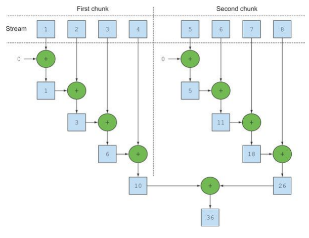
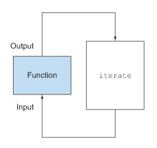

# Chap07. 병렬 데이터 처리와 성능

* 이 장에서 다룰 내용
  * 병렬 스트림으로 데이터를 병렬 처리하기
  * 병렬 스트림의 성능 분석
  * 포크/조인 프레임워크
  * Spliterator로 스트림 데이터 쪼개기


## 7.1 병렬 스트림

* 스트림 인터페이스를 이용하면 아주 간단하게 요소를 병렬로 처리할 수 있다.

  * 컬렉션에 parallelStream을 호출하면 **병렬스트림(parallel stream)**이 생성된다.

* 병렬 스트림이란?

  * 각각의 스레드에서 처리할 수 있도록 스트림 요소를 여러 청크로 분할한 스트림.
  * 병렬 스트림을 이용하면 모든 멀티코어 프로세서가 각각의 청크를 처리하도록 할당할 수 있다.

* 예제 : 숫자 n을 인수로 받아서 1부터 n까지의 모든 숫자의 합계를 반환하는 메서드.

  ```java
  public static long sequentialSum(long n) {
  	return Stream.iterate(1L, i -> i + 1)	// 무한 자연수 스트림 생성
                      .limit(n)	// n 개 이하로 제한
                      .reduce(0L, Long::sum);  // 모든 숫자를 더하는 스트림 리듀싱 연산
  }
  ```

  * 숫자로 이루어진 무한 스트림을 만든 다음 인수로 주어진 크기로 스트림을 제한하고 두 숫자를 더하는 BinaryOperator로 리듀싱 작업을 수행.
    * BinaryOperator이기 때문에 인자로 받은 타입과 동일한 타입으로 반환
  * 전통적인 자바에서는 아래와 같이 반복문으로 이를 구현할 수 있다.

  ```java
  public static long iterativeSum(long n) {
  	long result = 0;
      for(long i = 1L; i <= n; i++) {
          result += i;
      }
      return result;
  }
  ```

  * n이 커진다면 이 연산을 병렬로 처리하는 것이 좋을 것이다.
  * 고려해봐야 할 사항
    * 결과 변수는 어떻게 동기화해야 할까?
    * 몇 개의 스레드를 사용해야 할까?
    * 숫자는 어떻게 생성할까?
    * 생성된 숫자는 누가 더할까?
  * 병렬 스트림을 이용하면 쉽게 해결할 수 있다.


### 7.1.1 순차 스트림을 병렬 스트림으로 변환하기

* 순차 스트림에 parallel 메서드를 호출하면 기존의 함수형 리듀싱 연산이 병렬로 처리된다.

  ```java
  public static long parallelSum(long n) {
    return Stream.iterate(1L, i -> i + 1)
    				.limit(n)
    				.parallel()	// 스트림을 병렬 스트림으로 변환
    				.reduce(0L, Long::sum);
  }
  ```

  * 이전 코드와 다른 점은 스트림이 여러 청크로 분할되어 있다는 것.

  * 리듀싱 연산을 여러 청크에 병렬로 수행할 수 있다.

    

    * 마지막 리듀싱 연산으로 생성된 부분결과를 다시 리듀싱 연산으로 합쳐서 전체 스트림의 리듀싱 결과를 도출한다.

  * 순차 스트림에 parallel을 호출해도 스트림 자체에는 아무 변화도 일어나지 않는다.

    * 내부적으로는 parallel을 호출하면 이후 연산이 병렬로 수행해야 함을 의미하는 불린 플래그가 설정된다.

  * 반대로 sequential로 병렬 스트림을 순차 스트림으로 바꿀 수 있다.

    * 이 두 메서드를 이용해서 어떤 연산을 병렬로 실행하고 어떤 연산을 순차로 실행할지 제어할 수 있다.

      ```java
      stream.parallel()
      		.filter(...)
      		.sequential()
      		.map(...)
      		.parallel()
      		.reduce();
      ```

      * parallel과 sequential 두 메서드 중 최종적으로 호출된 메서드가 전체 파이프라인에 영향을 미친다.
      * 위 코드에서는 파이프라인의 마지막 호출이 parallel 이므로 파이프라인은 전체적으로 병렬로 수행된다.


#### 병렬 스트림에서 사용하는 스레드 풀 설정

* 병렬 스트림은 내부적으로 ForkJoinPool을 사용한다. (7.2절에서 설명)

* 기본적으로 ForkJoinPool은 프로세서 수, 즉 Runtime.getRuntime().availableProcessors()가 반환하는 값에 상응하는 스레드를 갖는다.

  ```java
  System.setProperty("java.util.concurrent.ForkJoinPool.common.parallelism", "12");
  ```

  * 위 예제는 전역 설정 코드이므로 이후의 모든 병렬 스트림 연산에 영향을 준다.
  * 현재는 하나의 병렬 스트림에 사용할 수 있는 특정한 값을 지정할 수 없다.
  * 일반적으로 기기의 프로세서 수와 같으므로 특별한 이유가 없다면 기본값 그대로 사용할 것을 권장한다.


### 7.1.2 스트림 성능 측정

* 소프트웨어 공학에서 추측은 위험한 방법!

* 성능을 최적화 할 때는 세가지 황금 규칙을 기억해야 한다.

  * 첫째도 측정, 둘째도 측정, 셋째도 측정!

* 예제 : n개의 숫자를 더하는 함수의 성능 측정

  ```java
  public long measureSumPerf(Function<Long, Long> adder, long n) {
    long fastest = Long.MAX_VALUE;
    for(int i = 0; i < 10; i++) {
      long start = System.nanoTime();
      long sum = adder.apply(n);
      long duration = (System.nanoTime() - start) / 1_000_000;
      System.out.println("Result: " + sum);
      if(duration < fastest) fastest = duration;
    }
    return fastest;
  }
  ```

  * 함수와 long을 인수로 받는다.

  * 주어진 long 값을 이용해서 메서드로 전달된 함수를 10번 반복 수행하며 시간을 밀리초 단위로 측정하고 그 중 가장 짧은 시간을 반환한다.

  * 지금까지 개발한 모든 메서드를 ParallelStreams라는 클래스로 구현했다고 가정하면 다음처럼 위 측정 코드와 순차 덧셈 함수를 이용해서 천만 개 숫자의 합계에 걸리는 시간을 계산할 수 있다.

  * 아래의 테스트들은 맥북 프로 인텔 i7 2.3GHz 쿼드코어에서 실행.

  * 병렬 스트림을 적용하지 않은 sequential stream.

    ```java
    System.out.println("Sequential sum done in: " +
                       measureSumPerf(ParallelStreams::sequentialSum, 10_000_000) + " msecs");
    ```

    ```
    Sequential sum done : 97 msecs
    ```

  * 고전적인 for 루프를 사용한 반복 버전이 생각보다 빠르다는 점도 고려해야한다.

    * for 루프는 저수준으로 작동하며 기본값을 박싱하거나 언박싱할 필요가 없으므로 수행속도가 빠르다.

    ```java
    System.out.println("Iterative sum done in: " + 
    	measureSumPerf(ParallelStreams::iterativeSum, 10_000_000) + " msecs");
    ```

    ```
    Iterative sum done in: 2 msecs
    ```

  * 병렬 스트림 적용

    ```java
    System.out.println("Parallel sum done in: " + 
    	measureSumPerf(ParallelStreams::parallelSum, 10_000_000) + " msecs");
    ```

    ```
    Parallel sum done in: 164 msecs
    ```

    * 병렬 버전이 위의 순차 버전보다 느리게 동작한다.

      * iterate가 박싱된 객체를 생성하므로 이를 다시 언박싱하는 과정이 필요.

      * iterate는 병렬로 실행될 수 있도록 독립적인 청크로 분할하기가 어렵다.

        * 이전 연산의 결과에 따라 다음 함수의 입력이 달라지기 때문에 iterate연산을 청크로 분할하기가 어렵다.

        

        * 이와 같은 상황에서는 리듀싱 연산이 수행되지 않는다.
        * 리듀싱 과정을 시작하는 시점에 전체 숫자 리스트가 준비되지 않았으므로 스트림을 병렬로 처리할 수 있도록 청크로 분할할 수 없다.
        * 스트림이 병렬로 처리되도록 지시했고 각각의 합계가 다른 스레드에서 수행되었지만 결국 순차처리 방식과 크게 다른 점이 없으므로 스레드를 할당하는 오버헤드만 증가하게 된다.

* 병렬 프로그래밍을 오용(예를들어 병렬과 거리가 먼 iterate를 사용)하면 오히려 전체 프로그램의 성능이 나빠질 수도 있다.


#### 더 특화된 메서드 사용

* 멀티코어 프로세서를 활용해서 효과적으로 합계 연산을 병렬로 실행하려면?

  * LongStream.rangeClosed (5장에서 소개했었음)
    * 기본형 long을 직접 사용하므로 박싱과 언박싱 오버헤드가 사라진다.
    * 쉽게 청크로 분할할 수 있는 숫자 범위를 생산한다.

* 언박싱과 관련된 오버헤드 측정

  ```java
  public static long rangedSum(long n) {
    return LongStream.rangeClosed(1, n)
    					.reduce(0L, Long::sum);
  }
  ```

  ```
  Ranged sum done in: 17 msecs
  ```

  * iterate 팩토리 메서드로 생성한 순차 버전에 비해 이 예제의 숫자 스트림 처리 속도가 더 빠르다.

    * 특화되지 않은 스트림을 처리할 때는 오토박싱, 언박싱 등의 오버헤드를 수반.

  * 상황에 따라서는 어떤 알고리즘을 병렬화하는 것보다 적절한 자료구조를 선택하는 것이 더 중요하다.

    ```java
    public static long parallelRangedSum(long n) {
      return LongStream.rangeClosed(1, n)
      					.parallel()
      					.reduce(0L, Long::sum);
    }
    ```

    ```
    Parallel range sum done in: 1 msecs
    ```

    * 실질적으로 리듀싱 연산이 병렬로 수행된다.

* 병렬화가 완전 공짜는 아니라는 사실을 기억하자

  * 스트림을 재귀적으로 분할해야 하고,
  * 각 서브스트림을 서로 다른 스레드의 리듀싱 연산으로 할당하고,
  * 결과를 하나의 값으로 합쳐야 한다.

* 멀티코어 간의 데이터 이동은 우리 생각보다 비싸다.

  * 따라서, 코어 간에 데이터 전송 시간보다 훨씬 오래 걸리는 작업만 병렬로 다른 코어에서 수행하는 것이 바람직하다.

* 상황에 따라 쉽게 병렬화를 이용할 수 있거나 아니면 아예 병렬화를 이용할 수 없는 때도 있다.

* 스트림을 병렬화해서 코드 실행 속도를 빠르게 하고 싶으면 항상 병렬화를 올바르게 사용하고 있는지 확인해야한다.


### 7.1.3 병렬 스트림의 올바른 사용법

* 병렬 스트림을 잘못 사용하면서 발생하는 많은 문제는 공유된 상태를 바꾸는 알고리즘을 사용하기 때문에 일어난다.

* 예제 : n까지의 자연수를 더하면서 공유된 누적자를 바꾸는 프로그램

  ```java
  public static long sideEffectSum(long n) {
    Accumulator accumulator = new Accumulator();
    LongStream.rangeClosed(1, n).forEach(accumulator::add);
    return accumulator.total;
  }

  public class Accumulator {
    public long total = 0;
    public void add(long value) { total += value; }
  }
  ```

  * 위 코드는 본질적으로 순차 실행할 수 있도록 구현되어 있으므로 병렬로 실행하면 참사가 일어난다.
    * 특히, total을 접근할 때마다(다수의 스레드에서 동시 접근) 데이터 레이스 문제가 일어난다.
    * 동기화로 문제를 해결하다 보면 결국 병렬화라는 특성이 없어져 버릴 것이다.

* 위 예제를 병렬화로 수행

  ```java
  public static long sideEffectParallelSum(long n) {
    Accumulator accumulator = new Accumulator();
    LongStream.rangeClosed(1, n).parallel.forEach(accumulator::add);
    return accumulator.total;
  }
  ```

  ```java
  System.out.println("SideEffect parallel sum done in: " + 
  	measurePerf(ParallelStreams::sideEffectParallelSum, 10_000_000L) + "msecs");
  ```

  * 결과

  ```
  Result: 6431705159695
  Result: 6767891733151
  Result: 11834768628881
  Result: 6598795769163
  Result: 8340036216259
  Result: 6817885072782
  Result: 5474914622349
  Result: 6293323781930
  Result: 6917221933822
  Result: 7558243635708
  SideEffect prallel sum done in: 49 msecs
  ```

  * 성능은 둘째 치고 올바른 결과값이 나오지 않는다.
  * 병렬 계산에서는 공유된 가변 상태를 피해야 한다.


### 7.1.4 병렬 스트림 효과적으로 사용하기

#### 확신이 서지 않는다면 직접 측정하라.

* 순차 스트림을 병렬 스트림으로 쉽게 바꿀 수 있다.
* 무조건 병렬 스트림으로 바꾸는 것이 능사는 아니다.
* 병렬 스트림의 수행과정은 투명하지 않을 때가 많다.
* 순차 스트림과 병렬 스트림 중 어떤 것이 좋을지 모르겠다면 적절한 벤치마크로 직접 성능을 측정하는 것이 바람직하다.


#### 박싱을 주의하라.

* 자동 박싱과 언박싱은 성능을 크게 저하시킬 수 있는 요소다.
* 자바 8은 박싱 동작을 피할 수 있도록 기본형 특화 스트림을 제공한다.
  * IntStream, LongStream, DoubleStream


#### 순차 스트림보다 병렬 스트림에서 성능이 떨어지는 연산이 있다.

* 특히 limit나 findFirst처럼 요소의 순서에 의존하는 연산을 병렬 스트림에서 수행하려면 비싼 비용을 치러야 한다.
  * 예를들어, findAny는 요소의 순서와 상관 없이 연산하므로 findFirst보다 성능이 좋다.
* 정렬된 스트림에 unordered를 호출하면 비정렬된 스트림을 얻을 수 있다.
  * 요소의 순서가 상관 없다면 비정렬된 스트림에 limit를 호출하는 것이 더 효율적이다.


#### 스트림에서 수행하는 전체 파이프라인 연산 비용을 고려하라.

* 전체 스트림 파이프 라인 처리 비용 = N * Q
  * N : 처리해야할 요소 수
  * Q : 하나의 요소를 처리하는데 드는 비용
* Q가 높아진다는 것은 병렬 스트림으로 성능을 개선할 수 있는 가능성이 있음을 의미한다.


#### 소량의 데이터에서는 병렬 스트림이 도움 되지 않는다.

* 병렬화 과정에서 생기는 부가 비용을 상쇄할 수 있을 만큼의 이득을 얻지 못한다.


#### 스트림을 구성하는 자료구조가 적절한지 확인하라.

* 예를 들어 ArrayList를 LinkedList보다 효율적으로 분할할 수 있다.
  * LinkedList를 분할하려면 모든 요소를 탐색해야 하지만 ArrayList는 요소를 탐색하지 않고도 리스트를 분할할 수 있기 때문.
* range 팩토리 메서드로 만든 기본형 스트림도 쉽게 분해할 수 있다.
* 커스텀 Spliterator를 구현해서 분해 과정을 완벽하게 제어할 수 있다.


#### 스트림의 특성과 파이프라인의 중간 연산이 스트림의 특성을 어떻게 바꾸는지에 따라 분해 과정의 성능이 달라질 수 있다.

* 예를 들어 SIZED 스트림은 정확히 같은 크기의 두 스트림으로 분할 할 수 있으므로 효과적으로 스트림을 병렬처리할 수 있다. 
* 반면 필터 연산이 있으면 스트림의 길이를 예측할 수 없으므로 효과적으로 스트림을 병렬처리할 수 있을지 알 수 없게 된다.


#### 최종 연산의 병합 과정 비용을 살펴보라.

* 병합 과정의 비용이 비싸다면 병렬 스트림으로 얻은 성능의 이익이 서브스트림의 부분결과를 합치는 과정에서 상쇄될 수 있다.


#### 병렬 스트림이 수행되는 내부 인프라구조도 살펴봐야 한다.

* 자바 7에서 추가된 포크/조인 프레임워크로 병렬 스트림이 처리된다.


## 7.2 포크/조인 프레임워크

* 포크/조인 프레임워크는 병렬화 할 수 있는 작업을 재귀적으로 작은 작업으로 분할한 다음에 서브태스크 각각의 결과를 합쳐서 전체 결과를 만들도록 설계되었다.
* 서브태스크를 스레드 풀(ForkJoinPool)의 작업자 스레드에 분산 할당하는 ExcutorService 인터페이스를 구현한다.


### 7.2.1 RecursiveTask 활용

* 스레드 풀을 이용하려면 RecursiveTask<R>의 서브클래스를 만들어야 한다.

  * R은 병렬화된 태스크가 생성하는 결과 형식.
  * 결과가 없을 때는 RecursiveAction 형식.
    * 결과가 없더라도 다른 비지역 구조를 바꿀 수 있다.

* RecursiveTask를 정의하려면 추상 메서드 compute를 구현해야 한다.

  ```java
  protected abstract R compute();
  ```

  * 태스크를 서브태스크로 분할하는 로직과 더 이상 분할할 수 없을 때 개별 서브 태스크의 결과를 생산할 알고리즘을 정의.

  * 대부분의 compute 메서드 구현은 다음과 같은 의사코드 형식을 유지한다.

    ```java
    if(태스크가 충분히 작거나 더 이상 분할할 수 없으면) {
      순차적으로 태스크 계산
    } else {
      태스크를 두 서브태스크로 분할
      태스크가 다시 서브태스크로 분할되도록 이 메서드를 재귀적으로 호출함
      모든 서브태스크의 연산이 완료될 때까지 기다림
      각 서브태스크의 결과를 합침
    }
    ```

    ​