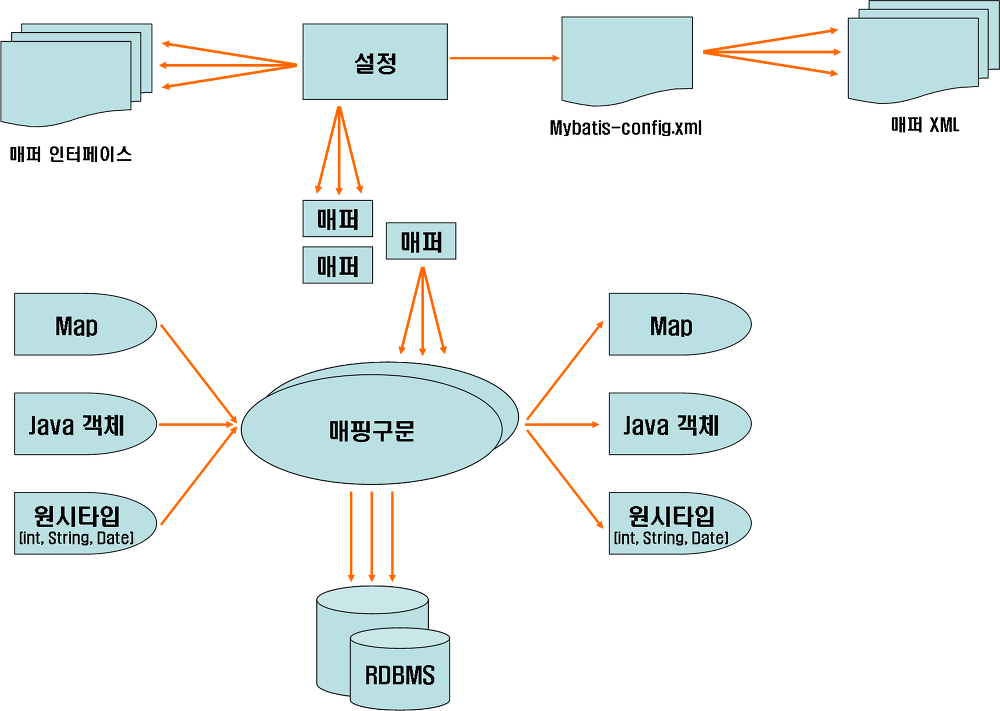
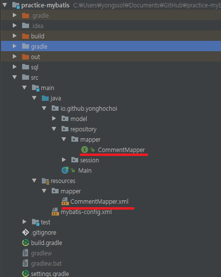

[TOC]


## 마이바티스 구조




* 설정 파일(mybatis-config.xml) : 데이터베이스 설정과 트랜잭션 등 마이바티스가 동작하는 규칙을 정의.
* 매퍼 : SQL을 XML에 정의한 매퍼 XML 파일과 SQL을 인터페이스의 메소드마다 애노테이션으로 정의한 매퍼 인터페이스를 의미
* 결과 매핑과 매핑 구문 : 조회 결과를 자바 객체에 설정하는 규칙을 나타내는 결과 매핑과 SQL을 XML에 정의한 매핑 구문을 말한다. 매핑 구문을 정의하는 방법은 애노테이션과 XML 방식 두가지가 있다.
* 지원하는 파라미터/결과 타입 : Map 객체, 자바 모델 클래스, 원시 타입(int, String 등)


## 예제

### 댓글 시스템

#### 기본 설정 파일

* mybatis-config.xml

  ```xml
  <?xml version="1.0" encoding="UTF-8"?>
  <!DOCTYPE configuration
          PUBLIC "-//mybatis.org//DTD Config 3.0//EN"
          "http://mybatis.org/dtd/mybatis-3-config.dtd">
  <configuration>
      <typeAliases>
          <typeAlias type="io.github.yonghochoi.model.Comment" alias="Comment"/>
      </typeAliases>
      <environments default="development">
          <environment id="deveelopment">
              <transactionManager type="JDBC" />
              <dataSource type="POOLED">
                  <property name="driver" value="com.mysql.jdbc.Driver"/>
                  <property name="url" value="jdbc:mysql://192.168.99.100:3306/mybatis_example"/>
                  <property name="username" value="mybatis"/>
                  <property name="password" value="mybatis"/>
              </dataSource>
          </environment>
      </environments>
      <mappers>
          <mapper resource="mapper/CommentMapper.xml"/>
      </mappers>
  </configuration>
  ```

    * 이 후 추가되는 매퍼는 mappers의 하위 항목에 추가됨.
    * 경로 지정에서 mapper의 경우 resource로 지정할 수도 있고, class로 지정할 수도 있다. 
    * 경로는 classpath를 기준으로 하기 때문에 resource로 한 경우 intelliJ에서 resource 디렉토리를 root로 하여 경로가 설정된다. 
    * 경로를 class로 할 경우 java 디렉토리를 root로 하여 경로가 설정된다.

  


* CommentMapper.xml

  ```xml
  <?xml version="1.0" encoding="UTF-8"?>
  <!DOCTYPE mapper
          PUBLIC "-//mybatis.org//DTD Mapper 3.0//EN"
          "http://mybatis.org/dtd/mybatis-3-mapper.dtd">
  <mapper namespace="io.github.yonghochoi.repository.mapper.CommentMapper">
      <select id="selectCommentByPrimaryKey" parameterType="long"
              resultType="io.github.yonghochoi.model.Comment">
          SELECT comment_no AS commentNo,
              user_id AS userId,
              comment_content AS commentContent,
              reg_date AS regDate
          FROM comment
          WHERE comment_no = #{commentNo}
      </select>
  </mapper>
  ```

  * mapper의 namespace로 `io.github.yonghochoi.repository.mapper.CommentMapper`를 지정했기 때문에 쿼리를 수행하기 위해서는 아래와 같이 해당 네임스페이스와 쿼리 id를 지정하여 사용하면 된다.

    ```java
    sqlSession.selectOne("io.github.yonghochoi.mapper.CommentMapper.selectCommentByPrimaryKey", commentNo);
    ```

    ​


* Comment 모델 클래스

  ```java
  package io.github.yonghochoi.model;

  import lombok.Getter;
  import lombok.Setter;
  import lombok.ToString;

  import java.io.Serializable;
  import java.util.Date;

  @Getter
  @Setter
  @ToString
  public class Comment implements Serializable{
      private Long commentNo;
      private String userId;
      private Date regDate;
      private String commentContent;
  }
  ```

  * 캐시 사용을 위해서는 Serializable 인터페이스를 구현해야함.


* Reply 모델 클래스

  ```java
  package io.github.yonghochoi.model;

  import lombok.Getter;
  import lombok.Setter;
  import lombok.ToString;

  import java.io.Serializable;
  import java.util.Date;

  @Getter
  @Setter
  @ToString
  public class Reply implements Serializable{
      private Long replyNo;
      private Long commentNo;
      private String userId;
      private String replyContent;
      private Date regDate;
  }
  ```


* User 모델 클래스

  ```java
  package io.github.yonghochoi.model;

  import lombok.Getter;
  import lombok.Setter;
  import lombok.ToString;

  import java.io.Serializable;

  @Getter
  @Setter
  @ToString
  public class User implements Serializable{
      private String userId;
      private String userName;
  }
  ```


* CommentSessionRepository 클래스

  ```java
  package io.github.yonghochoi.repository.session;

  import io.github.yonghochoi.model.Comment;
  import org.apache.ibatis.io.Resources;
  import org.apache.ibatis.session.SqlSession;
  import org.apache.ibatis.session.SqlSessionFactory;
  import org.apache.ibatis.session.SqlSessionFactoryBuilder;

  import java.io.IOException;
  import java.io.InputStream;

  public class CommentSessionRepository {
      public SqlSessionFactory getSqlSessionFactory() throws IOException {
          String resource = "mybatis-config.xml";

          try (InputStream inputStream = Resources.getResourceAsStream(resource)){
              return new SqlSessionFactoryBuilder().build(inputStream);
          }
      }

      public Comment selectCommentByPrimaryKey(Long commentNo) throws IOException {
          SqlSessionFactory sf = getSqlSessionFactory();
          System.out.println(sf);
          try(SqlSession sqlSession = sf.openSession()) {
              String statement = "io.github.yonghochoi.mapper.CommentMapper.selectCommentByPrimaryKey";
              return (Comment) sqlSession.selectOne(statement, commentNo);
          }
      }
  }
  ```

  * SqlSessionFactory를 통해 SqlSession 인스턴스를 만들 수 있다.

    * SqlSession는 데이터베이스에 SQL 명령어를 실행하기 위해 필요한 모든 메소드를 가지고 있다.

      ```java
      public SqlSessionFactory getSqlSessionFactory() throws IOException {
          String resource = "mybatis-config.xml";

          try (InputStream inputStream = Resources.getResourceAsStream(resource)){
              return new SqlSessionFactoryBuilder().build(inputStream);
          }
      }

      public Comment selectCommentByPrimaryKey(Long commentNo) throws IOException {
          SqlSessionFactory sf = getSqlSessionFactory();
          try(SqlSession sqlSession = sf.openSession()) {
              String statement = "io.github.yonghochoi.mapper.CommentMapper.selectCommentByPrimaryKey";
              return (Comment) sqlSession.selectOne(statement, commentNo);
          }
      }
      ```

      * selectOne 메서드를 통해 쿼리를 수행하는데 statement에 입력된 값 처럼 class 경로를 붙여서 사용하는 것보다는 아래와 같이 Class 객체를 사용하는 것이 더 낫다.

      ```java
      SqlSessionFactory sf = getSqlSessionFactory();
      try(SqlSession sqlSession = sf.openSession()) {
          CommentMapper mapper = sqlSession.getMapper(CommentMapper.class);
          return mapper.selectCommentByPrimaryKey(commentNo);
      }
      ```

      ​


* CommentMapper 클래스

  ```java
  package io.github.yonghochoi.repository.mapper;

  import io.github.yonghochoi.model.Comment;

  public interface CommentMapper {
      Comment selectCommentByPrimaryKey(int commentNo);
  }
  ```


#### insert 구문

* 쿼리를 명시했던 mapper xml 파일에 insert 구문을 추가한다.

  * CommentMapper.xml

    ```xml
    ...
    <insert id="insertComment" parameterType="io.github.yonghochoi.model.Comment">
        INSERT INTO comment(user_id, comment_content, reg_date)
        VALUES (#{userId}, #{commentContent}, #{regDate})
    </insert>
    ...
    ```

    ​

* mapper xml파일과 연결 시켜 줄 CommentMapper interface에도 해당 id와 동일한 이름의 메서드를 추가해준다.

  * CommentMapper.java

    ```java
    public interface CommentMapper {
        Comment selectCommentByPrimaryKey(int commentNo);
        int insertComment(Comment comment);
    }
    ```


* sqlSession 사용하여 insert를 수행할 메서드를 추가한다.

  * CommentSessionRepository.java

    ```java
    public void insertComment(Comment comment) throws IOException {
        SqlSessionFactory sf = getSqlSessionFactory();
        try(SqlSession sqlSession = sf.openSession()) {
            CommentMapper mapper = sqlSession.getMapper(CommentMapper.class);
            if(mapper.insertComment(comment) > 0) {
                sqlSession.commit();
            }
        }
    }
    ```

    * insert 쿼리의 경우 트랜잭션 완료 후 반드시 커밋 메서드를 호출해주어야 데이터베이스에 반영된다.


