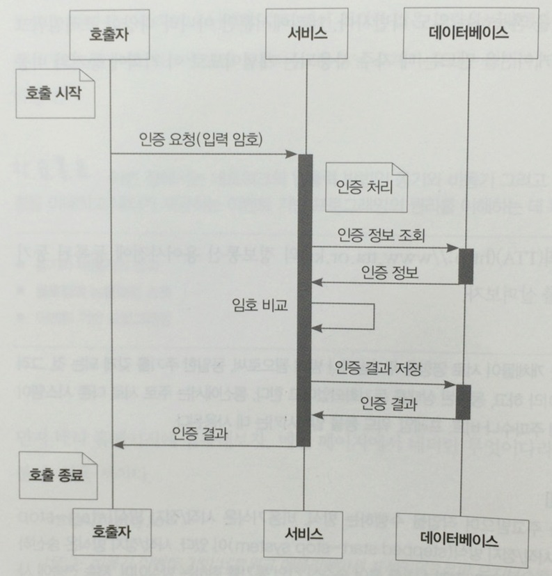
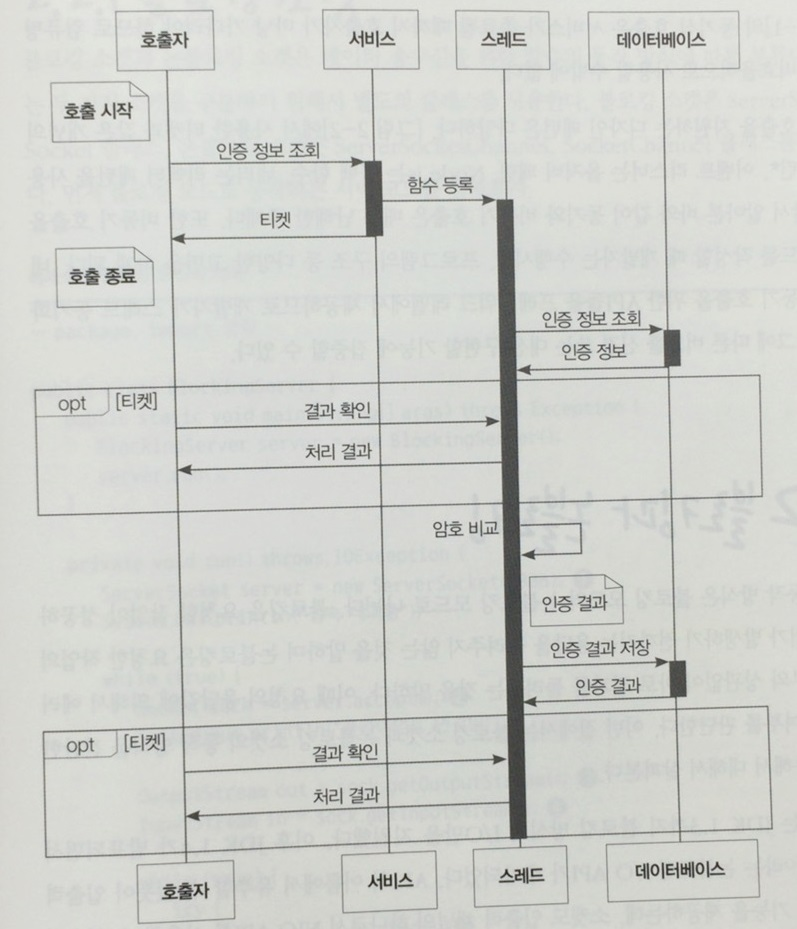
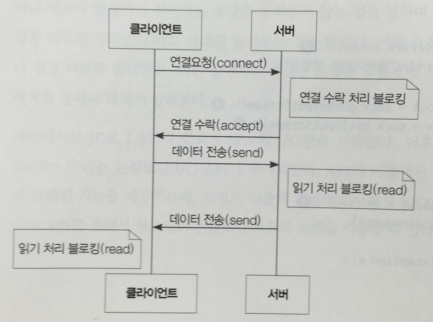
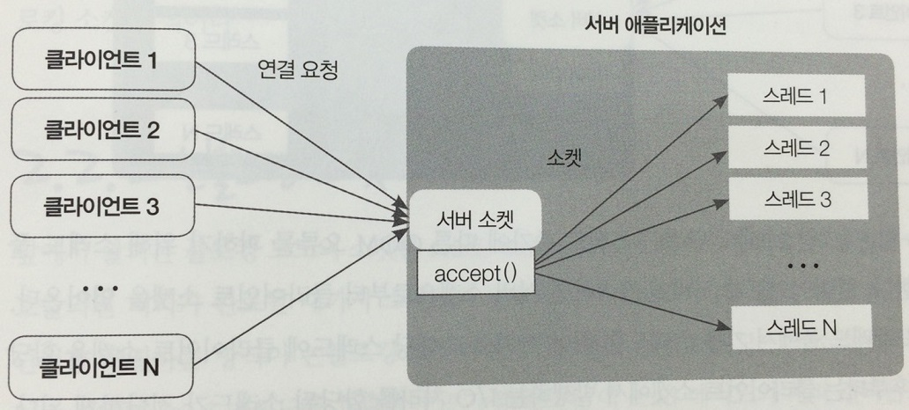
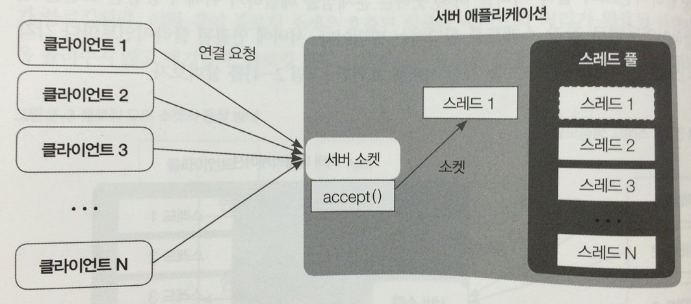
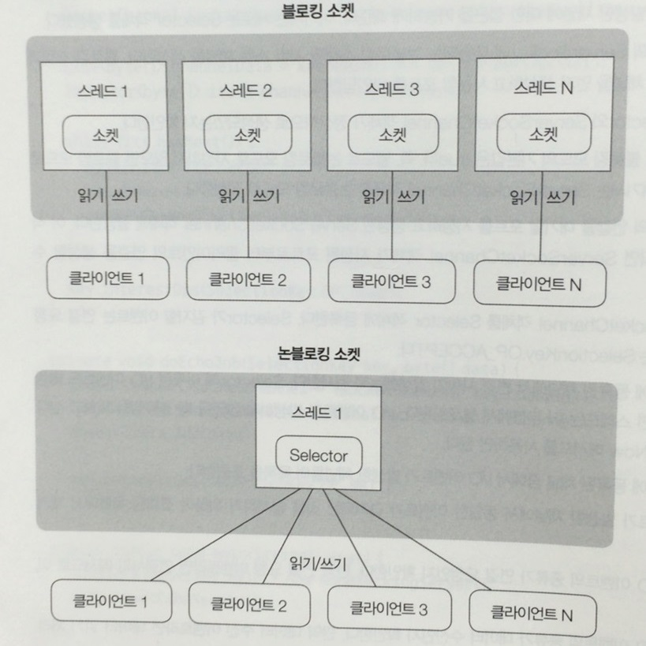
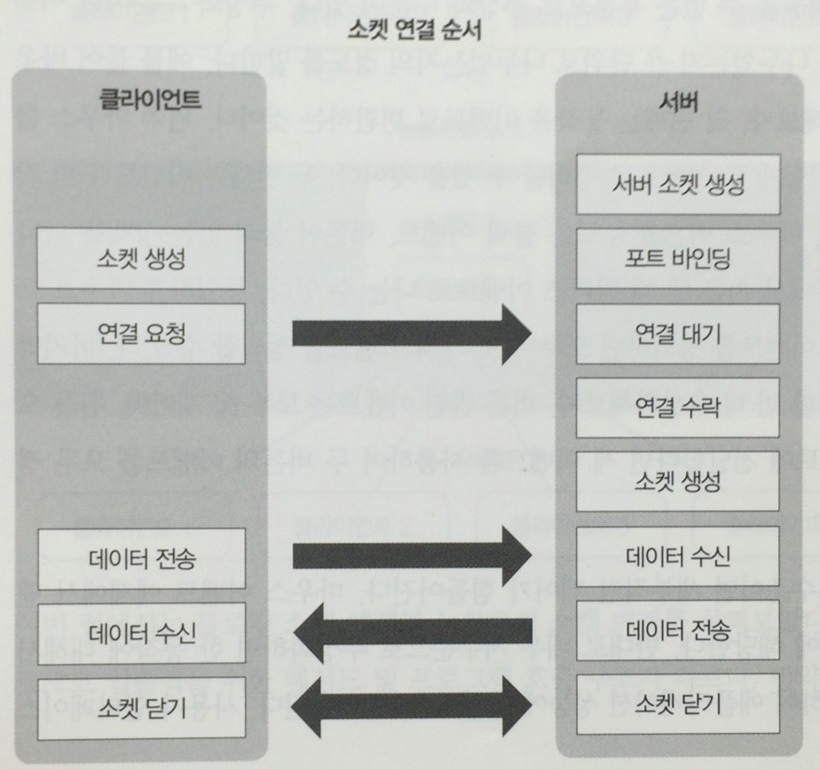
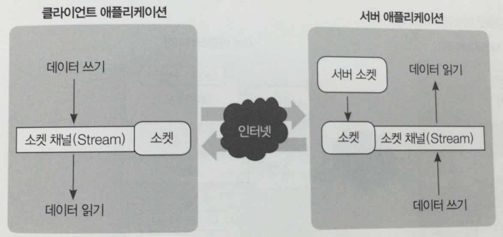
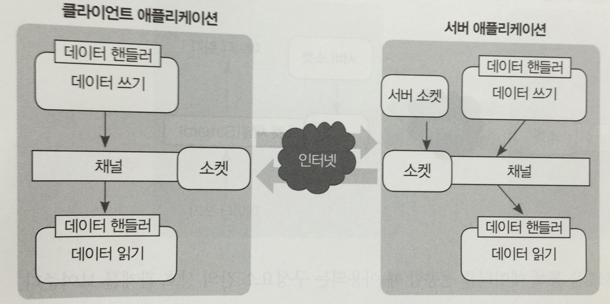

# 동기와 비동기

* 최초의 자바 API는 블로킹 함수만 지원했었다.
* 다수의 동시 클라이언트를 관리하려면 새로운 클라이언트 Socket 마다 새로운 Thread를 할당해야 한다.
	* 여러 스레드가 입/출력 데이터를 무한정 대기하므로 리소스 낭비.
	* 각 스레드가 스택 메모리를 할당해야 한다.
	* 스레드가 많아질 수록 컨텍스트 전환에 따른 오버헤드 발생.
* 자바 NIO를 통해 논블로킹 호출이 가능해졌다.

## 동기


* 서비스 호출자는 호출 시작 이 후 호출 종료까지 결과를 확인 할 수 없다.
* 응답이 올 때까지 기다림.
* 쉬운 디버깅과 직관적인 흐름 추적이 가능하다는 장점.
* 호출자가 결과를 마냥 기다려야 하므로 리소스를 비효율적으로 사용.

## 비동기


* 호출자가 서비스에 인증 정보 조회를 요청하는데 서비스는 스레드에 인증 요청을 위한 함수를 다른 스레드에 등록한다.
* 실제 인증 처리가 완료되 않아도 서비스 호출 종료가 이루어진다.
* 응답으로 호출자에게 티켓을 전달한다.
* 호출자는 티켓을 통해 요청했던 작업이 완료되었는지 체크.
    *  여기서의 티켓은 네티의 퓨처 패턴에 해당됨.
* 이 때, 호출자는 다른 작업을 수행할 수 있다.
* 네티는 비동기 이벤트 기반 네트워크 애플리케이션 프레임워크.
* 개발자가 스레드 동기화 이슈 및 그에 따른 버그를 신경쓰는 대신 구현에 집중 할 수 있다.
	* 네티에서는 이를 위한 API를 프레임워크 레벨에서 제공.
 
# 블로킹과 논블로킹

블로킹 : 요청한 작업이 성공하거나 에러가 발생하기 전까지는 응답을 돌려주지 않는 것을 의미.
논블로킹 : 요청한 작업의 성공 여부와 상관없이 바로 결과를 돌려주는 것을의 의미.

* 블로킹, 논블로킹, 동기, 비동기 간단 비교
    * 블로킹 : 함수가 작업을 완료할 때까지 멈춤.
    * 논블로킹 : 함수가 작업을 완료하지 못해도 멈추지 않음.
    * 동기 : 함수 호출이 끝난 직 후 결과를 바로 받아볼 수 있음.
    * 비동기 : 함수 호출이 끝난 직후 결과를 받지 않고 임의의 타이밍에 결과를 받음.

## 블로킹 소켓

* 자바의 블로킹 소켓
	* ServerSocket 클래스
	* Socket 클래스

### 처리 순서



1. 서버에서 클라이언트 연결 대기 (블로킹)
	* 이 때, 해당 스레드로는 다른 클라이언트의 연결이 불가능함.
2. 클라이언트가 연결 요청
3. 서버와 연결이 수락되고 서버는 클라이언트의 데이터를 기다림(블로킹)
4. 클라이언트가 데이터를 전송하면 서버에서 수신.

* 위와 같이 블로킹 소켓은 다중 클라이언트의 접속을 처리하지 못함.

*해결 방안 1 : 클라이언트 별 스레드 생성*



* accept를 통해 연결된 클라이언트 별로 스레드를 생성하여 해당 클라이언트 소켓에 대한 I/O 처리를 위임.

```
+ 다중 클라이언트의 접속 처리가 가능.
- 클라이언트 수에 따라 스레드 수 증가.
- 힙 메모리 부족으로 Out Of Memory가 발생할 수 있음.
```

*해결 방안 2 : 스레드 풀링.*



* accept를 통해 클라이언트가 연결 되면 스레드를 관리하는 스레드에게 위임.
* 해당 스레드는 클라이언트 연결 시 스레드 풀에서 스레드를 가져오고 연결 종료 시 풀에 스레드를 반환한다. 

```
+ Out of Memory 발생 방지.
+ 다중 클라이언트의 접속 처리 가능.
- 동시에 접속 가능한 사용자 수가 스레드 풀에 저장한 스레드에 의존.
```
* 동시 접속자 수를 늘리기 위해 스레드 풀의 크기를 늘리게되면 생기는 문제점.
    * 커진 풀 크기 만큼 가비지 컬렉션의 대상이 많아짐.
        * 힙에 할당된 메모리가 크면 클수록 가비지 컬렉션이 수행되는 횟수는 줄어들지만 수행시간은 상대적으로 길어진다.
    * 운영체제에서 사용되는 컨텍스트 스위칭 문제.

*해결 방안 3 : 논블로킹 소켓 사용.*

## 논블로킹 소켓

* 자바의 논블로킹 소켓
    * ServerSocketChannel 클래스
    * SocketChannel 클래스

* 논블로킹 소켓을 사용하면 데이터를 읽고 쓰는 부분의 로직을 완전히 분리시켜야 하므로 블로킹 소켓에 비해 코드가 복잡해진다.
	* 클라이언트로부터 데이터 수신.
	* 이벤트 감지(Selector)
	* 해당 이벤트가 공유하는 객체로부터 소켓 채널을 얻음.
	* 소켓을 통해 클라이언트로 데이터를 전송.



## 이벤트 기반 프로그래밍

* 각 이벤트를 먼저 정의해두고 발생한 이벤트에 따라서 코드가 실행되도록 프로그램을 작성.
	* ex) 마우스 클릭

* 추상화 수준 : 이벤트를 나눌 때 작은 단위로 나누었는지 큰 단위로 나누었는지의 정도.
	* 추상화가 너무 고수준이면 세부적인 제어가 힘들어진다.
	* 추상화가 너무 저수준이면 한 동작에 대해서 너무 많은 이벤트가 발생하여 애플리케이션 성능에 악영향을 미치게된다.
* 서버에 연결될 클라이언트 수는 매우 가변적이며 예측 불가능.
	* 적절한 이벤트 추상화 단위가 매우 중요.

### 이벤트 기반 네트워크 프로그래밍

* 절차
	1. 이벤트가 발생할 주체를 정의. (소켓)
	2. 주체에서 발생될 이벤트 종류를 정의. (연결, 데이터 송수신 등)

* 네트워크와 이벤트 발생



* 네트워크 프로그램 구조


* 소켓이란 데이터 송수신을 위한 네트워크 추상화 단위.
	* 일반적으로 네트워크 프로그램에서 소켓은 IP 주소와 포트를 가진다.
	* 양방향 네트워크 통신이 가능한 객체이다.
* 소켓에 데이터를 기록하고 읽으려면 소켓에 연결된 소켓 채널(NIO) 또는 스트림(OIO : Old Blocking IO)을 사용해야 한다.
* 네트워크 상황은 불안정하기 때문에 다양한 상황에 대비한 예외처리가 필요.

* 네티를 사용한 네트워크 프로그램 구조


* 데이터를 소켓으로 전송하기 위해서 채널에 직접 기록하는 것이 아니라 데이터 핸들러(이벤트 핸들러)를 통해 기록.
	* 서버 쪽 코드를 클라이언트 쪽에서 재사용할 수 있는 장점.
	* 이벤트에 따라 로직을 분리할 수 있는 장점.
* 에러 이벤트 정의도 가능
	* 특정 이벤트에 대한 로직을 작성할 때 에러처리에 대한 부담을 덜어줌.
