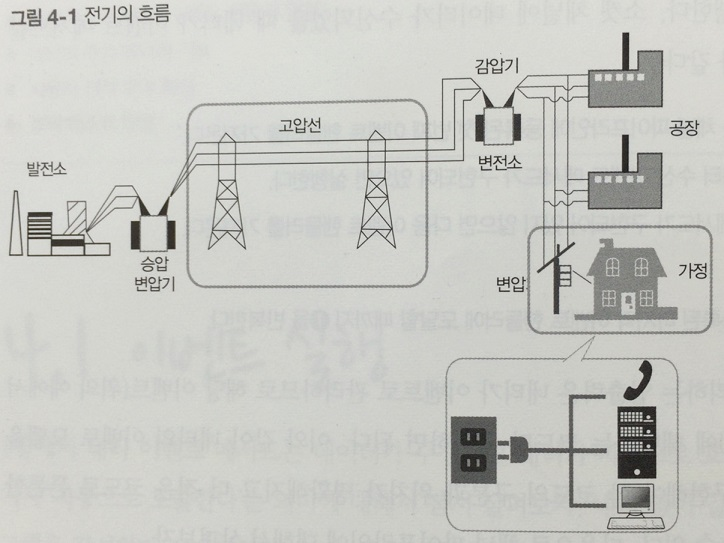
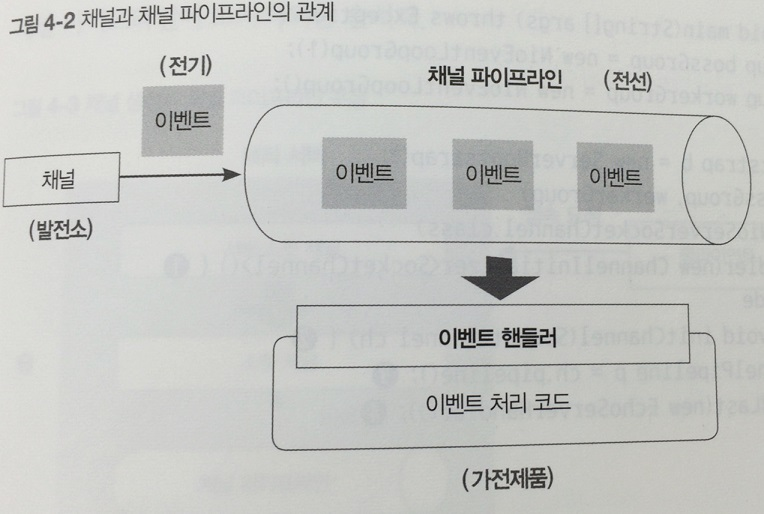
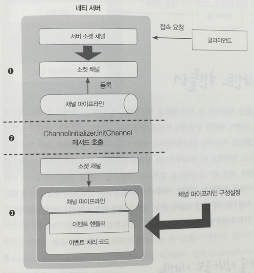
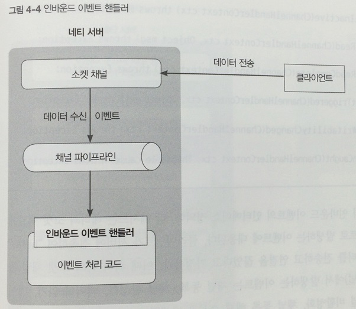
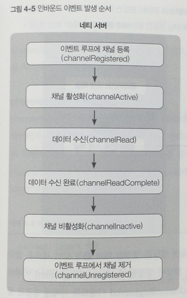
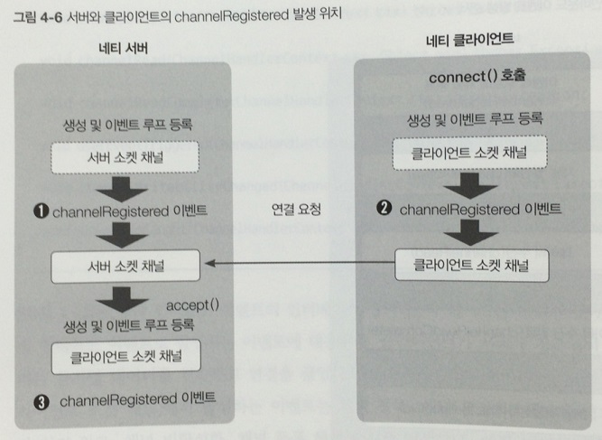
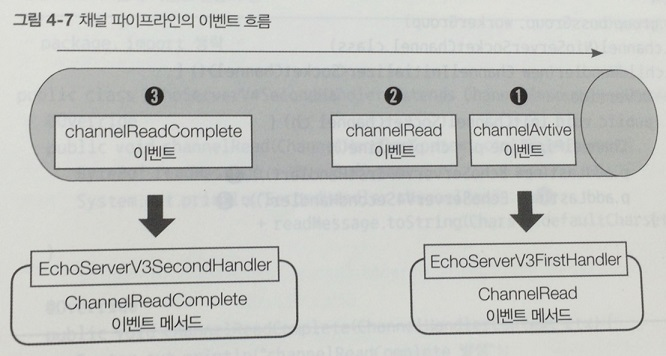

# 채널 파이프라인과 코덱

* 채널 파이프라인 : 채널에서 발생한 이벤트가 이동하는 통로.
* 이벤트 핸들러 : 채널 파이프라인을 통해서 이동하는 이벤트를 처리하는 클래스.
* 코덱 : 이벤트 핸들러를 상속받아서 구현한 구현체들.

## 이벤트 실행

* 일반 네트워크 프로그램 로직 구현 순서
	1. 소켓에 데이터가 있는지 확인.
	2. 1에 데이터가 존재하면 데이터를 읽어들이는 메서드 호출.
	3. 존재하지 않는 다면 데이터가 도착할 때까지 대기.
	4. 데이터를 기다리는 중에 네트워크가 끊어지면 에러 처리를 위한 메서드 호출.
	* 예외에 대한 대비가 철저할수록 오류는 적어지지만 프로그램 복잡도는 증가하게 된다.

* 네티로 네트워크 프로그램 로직 구현 순서
	1. 부트스트랩으로 네트워크 애플리케이션에 필요한 설정을 지정.
	2. 부트스트랩에 이벤트 핸들러를 사용하여 채널 파이프라인을 구성.
	3. 이벤트 핸들러의 데이터 수신 이벤트 메서드에서 데이터를 읽어들인다.
	4. 이벤트 핸들러의 네트워크 끊김 이벤트 메서드에서 에러 처리를 한다.
	* 네티는 이벤트를 채널 파이프라인과 이벤트 핸들러로 추상화 한다.
	* 예외 상황에 대해서 관여할 필요가 없다.

* 소켓 채널에 데이터가 수신되었을 때 네티가 이벤트 메서드를 실행하는 방법
	1. 네티의 이벤트 루프가 채널 파이프라인에 등록된 첫 번째 이벤트 핸들러를 가져온다.
	2. 이벤트 핸들러에 데이터 수신 이벤트 메서드가 구현되어 있으면 실행한다.
	3. 구현되어 있지 않다면 다음 이벤트 핸들러를 가져온다.
	4. 2를 수행한다.
	5. 채널 파이프라인에 등록된 마지막 이벤트 핸들러에 도달할 때까지 1을 반복.

## 채널 파이프라인

네티의 채널과 이벤트 핸들러 사이에서 연결 통로 역할을 수행.

### 채널 파이프라인의 구조

전기가 발전소에서 생산되어 전선을 타고 가정까지 도달하기까지의 과정이 네티의 채널 파이프라인과 유사하다.





* 채널은 소켓과 같은 개념으로 생각하면 되는데, 발전소에 대응된다.
* 소켓에서 발생한 이벤트는 채널 파이프라인을 따라 흐른다. 전선과 멀티탭에 대응된다.
* 채널에서 발생한 이벤트들을 수신하고 처리하는 기능은 이벤트 핸들러가 수행하는데, 가전제품에 대응된다.
* 멀티탭에 여러 개의 가전 제품을 연결하듯이 하나의 채널 파이프라인에 여러 이벤트 핸들러를 등록할 수 있다.

### 채널 파이프라인의 동작

```java
public class EchoServer {
    public static void main(String[] args) {
        EventLoopGroup bossGroup = new NioEventLoopGroup(1);
        EventLoopGroup workerGroup = new NioEventLoopGroup();

        try {
            ServerBootstrap b = new ServerBootstrap();
            b.group(bossGroup, workerGroup)
                    .channel(NioServerSocketChannel.class)
                    .childHandler(new ChannelInitializer<SocketChannel>() {		// [1]
                        @Override
                        protected void initChannel(SocketChannel ch) throws Exception {	//[2]
                            ChannelPipeline p = ch.pipeline();	// [3]
                            p.addLast(new EchoServerHandler());	// [4]
                        }
                    });
            ... 생략 ...
        } finally {
            workerGroup.shutdownGracefully();
            bossGroup.shutdownGracefully();
        }
    }
}
```

* [1]은 childHandler 메서드를 통해서 연결된 클라이언트 소켓 채널이 사용할 채널 파이프라인을 설정한다.
* [2]는 클라이언트 소켓 채널이 생성될 때 자동으로 호출이 되는데 이 때 채널 파이프라인의 설정을 수행한다.
* [3]에서는 initChannel 메서드의 인자로 입력된 소켓 채널에 설정된 채널 파이프라인을 가져오게 되는데, 네티의 내부에서는 클라이언트 소켓 채널을 생성할 때 빈 채널 파이프라인 객체를 생성하여 할당한다.
* [4]에서 이벤트 핸들러인 EchoServerHandler를 채널 파이프라인에 등록한다.



1. 클라이언트 연결에 대응하는 소켓 채널 객체를 생성하고 빈 채널 파이프라인 객체를 생성하여 소켓 채널에 할당한다.
2. 소켓 채널에 등록된 ChannelInitializer 인터페이스의 구현체를 가져와서 initChannel 메서드를 호출한다.
3. 소켓 채널 참조로부터 1에서 등록한 파이프라인 객체를 가져오고 채널 파이프라인에 입력된 이벤트 핸들러의 객체를 등록한다.
4. 채널이 등록됐다는 이벤트가 발생하고 이때부터 클라이언트와 서버 간의 데이터 송수신을 위한 처리가 시작된다.

### 이벤트 핸들러

네티는 비동기 호출을 지원하는 두 가지 패턴을 제공하는데 첫번 쨰는 퓨처 패턴이고, 두 번째는 리액터 패턴의 구현체인 이벤트 핸들러이다. 이벤트 핸들러는 네티의 소켓 채널에서 발생한 이벤트를 처리하는 인터페이스 이다.

* 소켓 채널의 이벤트를 인터페이스로 정의하고 이 인터페이스를 상속받는 이벤트 핸들러를 작성하여 채널 파이프라인에 등록.
* 채널 파이프라인으로 입력되는 이벤트를 이벤트 루프가 가로채어 이벤트에 해당하는 메서드를 수행.
* 네티는 소켓 채널에서 발생하는 이벤트를 인바운드 이벤트와 아웃바운드 이벤트로 추상화한다.

#### 채널 인바운드 이벤트

인바운드 이벤트는 소켓 채널에서 발생한 이벤트 중에서 연결 상대방이 어떤 동작을 취했을 때 발생한다.



* 데이터 수신 시 소켓 채널에서 읽을 데이터가 있다는 이벤트를 채널 파이프라인으로 흘려보낸다.
* 채널 파이프라인에 등록된 이벤트 핸들러 중에서 인바운드 이벤트 핸들러에 해당하는 메서드를 수행한다.
* 네티는 채널 인바운드 이벤트를 ChannelInboundHandler 인터페이스로 제공한다.

```java
public interface ChannelInboundHandler extends ChannelHandler {
    void channelRegistered(ChannelHandlerContext ctx) throws Exception;

    void channelUnregistered(ChannelHandlerContext ctx) throws Exception;

    void channelActive(ChannelHandlerContext ctx) throws Exception;

    void channelInactive(ChannelHandlerContext ctx) throws Exception;

    void channelRead(ChannelHandlerContext ctx, Object msg) throws Exception;

    void channelReadComplete(ChannelHandlerContext ctx) throws Exception;

    void userEventTriggered(ChannelHandlerContext ctx, Object evt) throws Exception;

    void channelWritabilityChanged(ChannelHandlerContext ctx) throws Exception;

    @Override
    @SuppressWarnings("deprecation")
    void exceptionCaught(ChannelHandlerContext ctx, Throwable cause) throws Exception;
}
```



* channelRegistered 이벤트 : 채널이 이벤트 루프에 등록되었을 때 발생.
	* 이벤트 루프는 네티가 이벤트를 실행하는 스레드로써 부트 스트랩에 설정한 이벤트 루프를 의미.
	* 클라이언트와 서버에서의 channelRegistered 이벤트 발생 위치가 다르다.
	* 
		* 서버는 처음 서버 소켓 채널을 생성할 때와 새로운 클라이언트가 서버에 접속하여 클라이언트 소켓 채널이 생성될 때 이벤트 발생.
		* 클라이언트는 서버 접속을 위한 connect 메서드를 수행할 때 이벤트 발생.
		* 즉, 새로운 채널이 생성되는 시점에 발생한다.

* channelActive 이벤트 : 채널이 생성되고 이벤트 루프에 등록된 이후에 네티 API를 사용하여 채널 입출력을 수행할 상태가 되었음을 알려주는 이벤트.
	* 이 이벤트를 사용하기 적합한 작업의 예
		* 서버 애플리케이션에 연결된 클라이언트의 연결 개수를 셀 때
		* 서버 애플리케이션에 연결된 클라이언트에게 최초 연결에 대한 메시지를 전송할 때
		* 클라이언트 애플리케이션이 연결된 서버에 최초 메시지를 전달할 때
		* 클라이언트 애플리케이션에서 서버에 연결된 상태에 대한 작업이 필요할 때

* channelRead 이벤트 : 데이터가 수신 시 발생.
	* 수신된 데이터는 네티의 ByteBuf 객체에 저장되어 있으며, 두 번째 인자인 msg를 통해서 접근할 수 있다.
	* 에코 서버 부트스트랩 설정
    ```java
    public class EchoServerV1 {
        public static void main(Stringp[] args) throws Exception {
            ...생략...
            b.group(bossGroup, workerGroup)
                .channel(NioServerSocketChannel.class)
                .childHandler(new ChannelInitializer<SocketChannel>() {
                    @Override
                    public void initChannel(SocketChannel ch) {
                        ChannelPipeline p = ch.pipline();
                        p.addLast(new EchoServerV1Handler());
                    }
                });
            ... 생략...
            }
        }
    ```
    * 에코 서버 이벤트 핸들러
    ```java
    public class EchoServerV1Handler extends ChannelInboundHandlerAdapter {
    	@Override
        public void channelRead(ChannelHandlerContext ctx, Object msg) {
        	ByteBuf readMessage = (ByteBuf) msg;
            System.out.println("channelRead : " + readMessage.toString(Charset.defaultCharset()));
            ctx.writeAndFlush(msg);
        }
        
        @Override
        public void exceptionCaught(ChannelHandlerContext ctx, Throwable cause) {
        	cause.printStackTrace();
            ctx.close();
        }
    }
    ```
    	* 네티 내부에서는 모든 데이터가 ByteBuf로 관리된다.

* channelReadComplete 이벤트 : 데이터 수신이 완료되었을 때 발생.
	* 채널에 데이터가 있을 경우에는 channelRead 이벤트가 발생하고 채널에 더이상 데이터가 없을 때 channelReadComplete 이벤트가 발생한다.
```java
public class EchoServerV1Handler extends ChannelInboundHandlerAdapter {
    @Override
    public void channelRead(ChannelHandlerContext ctx, Object msg) {
        ByteBuf readMessage = (ByteBuf) msg;
        System.out.println("channelRead : " + readMessage.toString(Charset.defaultCharset()));
        ctx.writeAndFlush(msg);
    }

    @Override
    public void channelReadComplete(ChannelHandlerContext ctx) {
    	System.out.println("channelReadComplete 발생");
        ctx.flush();	// 네티의 채널 버퍼에 저장된 데이터를 상대방으로 즉시 전송.
    }
    
    ... 생략 ...
}
```

* channelInactive 이벤트 : 채널이 비활성화되었을 때 발생.
	* 이 후에는 채널에 대한 입출력 작업을 수행할 수 없다.

* channelUnregistered 이벤트 : 채널이 이벤트 루프에서 제거되었을 때 발생.
	* 이 후에는 채널에서 발생한 이벤트를 처리할 수 없다.

#### 아웃바운드 이벤트

소켓 채널에서 발생한 이벤트 중에서 네티 사용자(프로그래머)가 요청한 동작에 해당하는 이벤트.(연결 요청, 데이터 전송, 소켓 닫기 등)
네티는 아웃바운드 이벤트를 ChannelOutboundHandler 인터페이스로 제공.

* ChannelHandlerContext 객체 : 네티 객체에 대한 상호작용을 도와주는 인터페이스
    ```
    채널에 대한 입출력 처리
      - writeAndFlush 메서드로 채널에 데이터를 기록.
      - close 메서드로 채널의 연결 종료.

    채널 파이프라인에 대한 상호작용
      - 사용자에 의한 이벤트 발생
      - 채널 파이프라인에 등록된 이벤트 핸들러의 동적 변경.
    ```

```java
public interface ChannelOutboundHandler extends ChannelHandler {
    void bind(ChannelHandlerContext ctx, SocketAddress localAddress, ChannelPromise promise) throws Exception;

    void connect(
            ChannelHandlerContext ctx, SocketAddress remoteAddress,
            SocketAddress localAddress, ChannelPromise promise) throws Exception;

    void disconnect(ChannelHandlerContext ctx, ChannelPromise promise) throws Exception;

	void close(ChannelHandlerContext ctx, ChannelPromise promise) throws Exception;

    void deregister(ChannelHandlerContext ctx, ChannelPromise promise) throws Exception;

    void read(ChannelHandlerContext ctx) throws Exception;

    void write(ChannelHandlerContext ctx, Object msg, ChannelPromise promise) throws Exception;

    void flush(ChannelHandlerContext ctx) throws Exception;
}
```

* bind 이벤트 : 서버 소켓 채널이 클라이언트의 연결을 대기하는 IP와 포트가 설정되었을 때 발생.
* connect 이벤트 : 클라이언트 소켓 채널이 서버에 연결되었을 때 발생.
* disconnect 이벤트 : 클라이언트 소켓 채널의 연결이 끊어졌을 때 발생.
* close 이벤트 : 클라이언트 소켓 채널의 연결이 닫혔을 때 발생.
* write 이벤트 : 소켓 채널에 데이터가 기록되었을 때 발생.
* flush 이벤트 : 소켓 채널에 대한 flush 메서드가 호출되었을 때 발생.

#### 이벤트 이동 경로와 이벤트 메서드 실행

* 다중 이벤트 핸들러 등록
```java
public class EchoServerV3 {
    public static void main(Stringp[] args) throws Exception {
        ...생략...
        b.group(bossGroup, workerGroup)
            .channel(NioServerSocketChannel.class)
            .childHandler(new ChannelInitializer<SocketChannel>() {
                @Override
                public void initChannel(SocketChannel ch) {
                    ChannelPipeline p = ch.pipline();
                    p.addLast(new EchoServerV3FirstHandler());
                    p.addLast(new EchoServerV3SecondHandler());
                }
            });
        ... 생략...
        }
    }
}
```
```java
public class EchoServerV3FirstHandler extends ChannelInboundHandlerAdapter {
    @Override
    public void channelRead(ChannelHandlerContext ctx, Object msg) {
        ByteBuf readMessage = (ByteBuf) msg;
        System.out.println("channelRead : " + readMessage.toString(Charset.defaultCharset()));
        ctx.writeAndFlush(msg);
    }
```
```java
public class EchoServerV3SecondHandler extends ChannelInboundHandlerAdapter {
    @Override
    public void channelReadComplete(ChannelHandlerContext ctx) {
    	System.out.println("channelReadComplete 발생");
        ctx.flush();
    }

	@Override
    public void exceptionCaught(ChannelHandlerContext ctx, Throwable cause) {
    	cause.printStackTrace();
        ctx.close();
    }
```

* 채널 파이프라인의 이벤트 흐름

	1. 클라이언트 채널이 생성되고 해당 채널의 채널 파이프라인에 channelActive 이벤트가 발생.
	2. channelActive 이벤트가 구현되어있지 않으므로 무시.
	3. channelRead 이벤트 발생후 이벤트 메서드 수행.
	4. channelReadComplete 이벤트 발생 후 이벤트 메서드 수행.

* 동일한 이벤트 메서드를 구현한 이벤트 핸들러가 여럿인 경우
```java
public class EchoServerV4 {
    public static void main(Stringp[] args) throws Exception {
        ...생략...
        b.group(bossGroup, workerGroup)
            .channel(NioServerSocketChannel.class)
            .childHandler(new ChannelInitializer<SocketChannel>() {
                @Override
                public void initChannel(SocketChannel ch) {
                    ChannelPipeline p = ch.pipline();
                    p.addLast(new EchoServerV4FirstHandler());
                    p.addLast(new EchoServerV4SecondHandler());
                }
            });
        ... 생략...
        }
    }
}
```
```java
public class EchoServerV4FirstHandler extends ChannelInboundHandlerAdapter {
    @Override
    public void channelRead(ChannelHandlerContext ctx, Object msg) {
        ByteBuf readMessage = (ByteBuf) msg;
        System.out.println("channelRead : " + readMessage.toString(Charset.defaultCharset()));
        ctx.writeAndFlush(msg);
    }
```
```java
public class EchoServerV4SecondHandler extends ChannelInboundHandlerAdapter {
    @Override
    public void channelRead(ChannelHandlerContext ctx, Object msg) {
        ByteBuf readMessage = (ByteBuf) msg;
        System.out.println("channelRead : " + readMessage.toString(Charset.defaultCharset()));
        ctx.writeAndFlush(msg);
    }

	@Override
    public void channelReadComplete(ChannelHandlerContext ctx) {
    	System.out.println("channelReadComplete 발생");
        ctx.flush();
    }
    
    @Override
    public void exceptionCaught(ChannelHandlerContext ctx, Throwable cause) {
    	cause.printStackTrace();
        ctx.close();
    }
```
실행 결과
```
FirstHandler channelRead : a
channelReadComplete 발생
FirstHandler channelRead : s
channelReadComplete 발생
FirstHandler channelRead : d
channelReadComplete 발생
FirstHandler channelRead : f
channelReadComplete 발생
```

* 첫 번째 이벤트 핸들러만 실행되고 두 번째 이벤트 핸들러는 실행되지 않음.
* 하나의 이벤트는 하나의 이벤트 메서드만 수행한다.
* 두번째 이벤트 핸들러에서도 수행하고 싶다면 첫 번째 이벤트 핸들러를 아래와 같이 수정.
	```java
    public class EchoServerV4FirstHandler extends ChannelInboundHandlerAdapter {
    @Override
    public void channelRead(ChannelHandlerContext ctx, Object msg) {
        ByteBuf readMessage = (ByteBuf) msg;
        System.out.println("channelRead : " + readMessage.toString(Charset.defaultCharset()));
        ctx.write(msg);
        ctx.fireChannelRead(msg);	// 채널 파이프 라인에 이벤트를 발생 시킴.
    }
    ```
    * fireChannelRead 메서드를 호출하면 네티는 채널 파이프 라인에 channelRead 이벤트를 발생시킨다.
    * fire라는 접두어가 붙은 메서드가 이벤트를 발생시키는 메서드다.