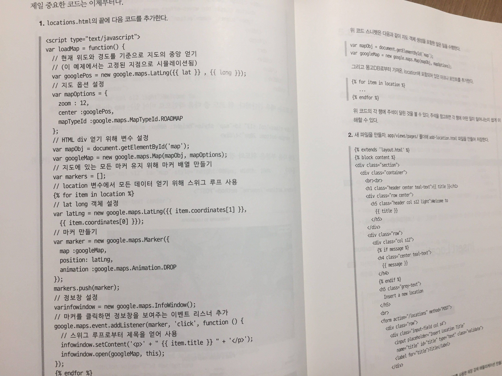

최근 진행 중인 프로젝트에서 오픈소스를 활용하고 있는데 오픈 소스의 기능에 더해서 추가적으로 제공을 해야하는 기능이나 권한과 같은 문제에 의해 제한을 해야 하는 부분들이 생겨서 오픈 소스를 조금 고쳐서 사용해야하는 이슈가 발생했었습니다. 웹 개발에 대한 짧은 경험이 있었기 때문에 살짝 수정하는 것은 문제가 없을 것이라 판단하고 소스를 열어봤더니 전혀 이해할 수 없는 문법들이었습니다. 바로 node.js로 되어 있었는데, npm 사용법 조차 제대로 몰랐었기 때문에 시작부터 포기하고 싶은 마음이 들었습니다. 

Node.js로 되어 있는 코드를 제대로 이해하고 싶기도 했고, 실제로 Node.js를 사용하면 어떠한 것들을 할 수 있는지 궁금했기 때문에 이 책을 선택하고 살펴보기 시작했습니다. 책을 받고 보니 깔끔한 표지에 그렇게 두껍지 않았기 때문에 가볍게 읽어볼 수 있겠다는 생각이 들었고, 다 읽고 나면 왠만큼은 오픈 소스 코드를 이해할 수 있겠구나 라는 기대감을 가지게 되었습니다. 

책이 두껍지 않은 만큼 이론적인 설명은 최소화 되어 있다는 느낌이 들었습니다. 그리고 이 책의 대상은 자바스크립트, CSS에 대한 초중급의 지식이 필요하고, 웹 개발에 필요한 일부 지식을 가지고 있는 독자들을 대상으로 하기 때문에 이론적인 부분에 대해서는 친절하게 설명해주지는 않습니다. 대신에 여러 유형의 프로젝트들을 하나씩 따라해보면서 저자의 노하우를 흡수할 수 있게끔 구성이 되어 있었습니다.

개인적으로 책에 수록된 예제는 정말 마음에 들었습니다. Node.js 뿐만 아닌 여러 지식들이 담겨져 있었고, 무엇보다 따라하며 만들어볼 수 있는 페이지가 깔끔하게 잘 만들어져 있었기 때문에 잘 배워서 이 템플릿 위에 웹 페이지를 하나 만들어봐도 좋겠다는 생각이 들었습니다. 

하지만 처음에 언급했듯이 완전 초급자가 대상이 아니기 때문에 첫 예제부터 많은 내용을 담고 있습니다. 각종 미들웨어들을 짧은 소개와 함께 한꺼번에 설치해서 사용하기도 하고, 부트스트랩은 당연히 알고 있지? 하는 것과 같이 별다른 언급 없이 부트스트랩을 사용하고 있습니다. 또한 몽고 DB 미들웨어를 설치해서 사용을 하기도 하고, 암호화와 인증 처리까지 다룹니다. 

저의 경우에는 기존에 부트스트랩으로 프로젝트를 했었던 경험이 있었고, 데이터베이스나 인증 관련 부분에도 경험이 있기 때문에 읽어나가는데 문제가 없었지만 이에 대한 경험이 없으신 분들께는 멘붕이 오지 않았을까하는 생각이 들었습니다.

가장 간단한 웹 페이지부터 시작해서 미들웨어를 하나씩 차근히 붙여 나가는 식으로 소개를 해주는 책들도 좋지만 이렇게 실용적인 예제들로 구성된 책도 괜찮구나라는 생각이 들었습니다. 

하지만 설명보다는 코드양이 많아서 기계적으로 따라친다라는 느낌이 많이 들었습니다. 이걸 하나씩 전부 다 따라치는 것은 지루한 과정이고 그다지 도움이 되지 않는다고 생각합니다. 그래서 라우팅을 처리하는 부분이나 프로퍼티를 설정하고 가져다 쓰는 등의 코드는 직접 따라 쳐보시되 그 외 HTML이나 CSS 코드 부분은 github repository를 clone 하셔서 복사&붙여넣기 하며 진행하셔도 나쁘지 않을 것이라 생각합니다. 

저 또한 몰랐던 부분들은 직접 따라쳐보며 진행했고, 단순 타이핑을 요구하는 부분은 복사, 붙여넣기 해가며 진행하였습니다. 

책의 마지막에 지속적인 통합에 대한 부분도 다루고 있는데, 책의 주제에는 벗어난 감은 있지만 저 또한 이부분이 굉장히 중요하다고 생각하기 때문에 주의 깊게 읽어보았습니다. 저자 또한 책의 주제와는 다르다고 생각해서인지 간단하지 않은 내용들을 짧게 설명한 부분은 조금 아쉬웠습니다. 하지만 이런식으로도 구성이 가능하다는 것을 알게된 것만으로도 저에게는 큰 도움이 되었습니다. 

끝으로 이 책을 읽고 난 뒤에 저자의 노하우들을 조금이나마 경험 해볼 수 있어서 좋았고, 책에 담긴 내용들을 보고 있자니 제가 업무에서 얻은 것들을 정리해나가는 방식과 굉장히 비슷해서 뭔가 익숙한 느낌이 들었습니다. 책 전반적으로 설명보다는 개발 노트 같은 느낌이어서 호불호가 있을 것 같긴 하지만 저는 나름 괜찮았다고 생각합니다. 이론에 대한 설명이 담긴 Node.js 프로그래밍 과 같은 책 옆에 두고 함께 보면 좋을 것 같습니다.