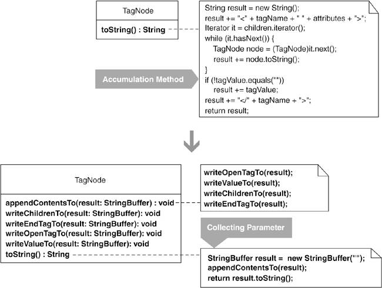
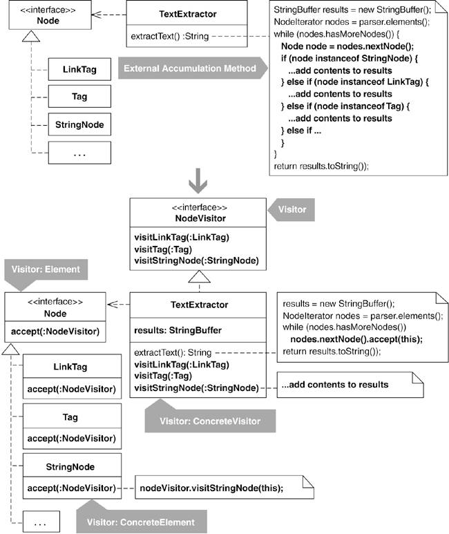
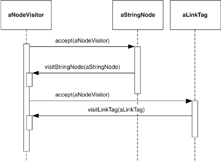
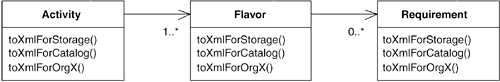
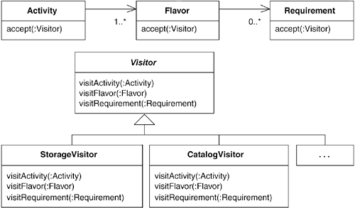
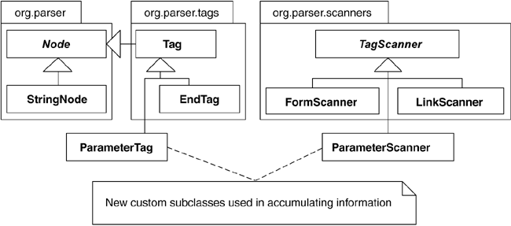

# 10장 Accumulation
[toc]

## Move Accumulation to Collecting Parameter
지역 변수에 정보를 축적하는 매우 긴 메서드가 있다면,
그것을 여러 메서드로 분해하고 각 메서드에 수집 파라미터를 넘겨 정보를 축적하도록 한다.



### 동기

* 수집 파라미터(Collecting Parameter) : 주어진 정보를 수집하기 위해 메서드에 파라미터로 넘겨지는 객체
* Compose Method와 함께 사용하는 경우가 많다.
* 각 메서드의 정보를 어떻게 축적할 것인가?
	* 리턴한 정보를 보관했다가 최종적으로 결합한다.
	* 수집 파라미터를 넘겨서 점진적으로 결합한다.
* 수집 파라미터가 정보를 축적하는 방법
	* 각 메서드가 수집 파라미터의 콜백 메서드 호출
	* 객체 자신을 수집 파라미터에 넘기고 수집 파라미터가 객체의 콜백 메서드를 호출
* 특정 클래스의 특정 인터페이스를 이용할때 사용하므로, 많은 대상과 다양한 인터페이스에는 적합하지 않다. -> Move Accumulation to Visitor
* Collecting Parameter 패턴은 재귀적으로 정보를 축적할 수 있으므로 Composite 패턴과 잘 맞는다.
	* 예 : JUnit 프레임워크는 테스트 컴포짓 구조의 테스트 케이스^test^ ^case^에서 결과 정보를 축적하기 위해 TestResult라는 수집 파라미터를 사용한다.

### 장점과 단점

```
 + 비대한 메서드를 작고 간단하며 이해하기 쉬운 여러개의 메서드로 분해하는데 도움이 된다.
 + 코드의 실행 속도가 향상될 수 있다.
```

### 절차

1. 정보를 축적하여 하나의 결과로 만드는 축적 메서드를 찾는다.
	* 결과를 담는 지역변수를 수집 파라미터로 한다.
	* 여러 메서드를 통해 정보를 모으는 데 적합하지 않다면, 타입을 바꾼다.
	* 컴파일한다.
1. 정보 축적의 한 과정을 골라 Extract Method로 별도의 메서드로 뽑아낸다.
	* 접근 지정자 private, 리턴타입 void, 결과 변수를 파라미터로 받는다.
	* 뽑아낸 메서드 안에서는 결과 변수에 정보를 기록하도록 만든다.
	* 컴파일 후 테스트한다.
1. 단계 2를 반복한다.
	* 결과 객체를 생성한다.
	* 여러 메서드 중 첫 번째 메서드에 결과 객체를 파라미터로 넘긴다.
	* 결과 객체로부터 수집된 정보를 얻는다.
	* 컴파일 후 테스트한다.

* 단계 2와 3의 작업은 축적 메서드와 이 과정에서 새로 만든 여러 메서드에 Compose Method 리팩터링을 적용한 셈이 된다.

### 예제

* 예 : XML 트리 모델을 만드는 컴포짓 객체
	* TagNode::toString() 메서드에서 각 노드를 재귀적으로 방문해 XML 트리의 문자열 표현을 생성한다.
1. toString() 메서드는 컴포짓 구조 내 각 태그의 정보를 재귀적으로 축적해 변수 result에 저장하고 있다.
	* ```java
    class TagNode...
       public String toString() {
          String result = new String();
          result += "<" + tagName + " " + attributes + ">";
          Iterator it = children.iterator();
          while (it.hasNext()) {
             TagNode node = (TagNode)it.next();
             result += node.toString();
          }
          if (!value.equals(""))
             result += value;
          result += "</" + tagName + ">";
          return result;
       }
	```
	* result의 타입을 StringBuffer로 바꾼다.
	* ```java
    class TagNode...
       public String toString() {
          StringBuffer result = new StringBuffer("");
    ```
2. result 변수에 XML의 시작 태그^open^ ^tag^와 속성을 결합해  result 변수에 저장하는 코드를 찾아 Extract Method를 적용한다.
	* ```java
    class TagNode...
        public String toString() {
            StringBuffer result = new StringBuffer("");
            result += "<" + tagName + " " + attributes + ">";
            ...
        }
    ```
    * ```java
    class TagNode...
        public String toString() {
            StringBuffer result = new StringBuffer("");
            writeOpenTagTo( result );
            ...
        }

        private void writeOpenTagTo( StringBuffer result ) {
            result.append( "<" );
            result.append( name );
            result.append( attributes.toString() );
            result.append( ">" );
        }
    }
    ```
3. toString()의 나머지 부분에 대해서도 Extract Method를 적용한다.
	* result 변수에 자식 노드를 추가하는 부분에 재귀적 호출이 포함되어 있다.
	* ```java
    class TagNode...
        public String toString()...
            Iterator it = children.iterator();
            while (it.hasNext()) {
                TagNode node = (TagNode)it.next();
                result += node.toString();
            }
            if (!value.equals(""))
            	result += value;
            ...
        }

    private void writeChildrenTo(StringBuffer result) {
        Iterator it = children.iterator();
        while (it.hasNext()) {
            TagNode node = (TagNode)it.next();
            node.toString(result); // toString()에는 파라미터를 받지 않는다.
        }
    ...
    }
	```
	* toString()메서드가 하는 일을 그대로 하면서 StringBuffer를 파라미터로 받는 메서드를 만든다.
	* ```java
    public String toString() {
       StringBuffer result = new StringBuffer("");
       appendContentsTo(result);
       return result.toString();
    }

    private void appendContentsTo(StringBuffer result) {
       writeOpenTagTo(result);
       ...
    }
    ```
	* 재귀적으로 수행되는 코드를 appendContentsTo() 메서드로 대체한다.
	* ```java
    private String appendContentsTo(StringBuffer result) {
        writeOpenTagTo(result);
        writeChildrenTo(result);
        ...
        return result.toString();
    }

    private void writeChildrenTo(StringBuffer result) {
        Iterator it = children.iterator();
        while (it.hasNext()) {
            TagNode node = (TagNode)it.next();
            node.appendContentsTo(result);  // 재귀 호출을 사용할수 있다.
        }
        if (!value.equals(""))
        	result.append(value);
    }
    ```
	* 자식들을 재귀적으로 추가하는 부분과 자신의 값을 추가하는 단계를 구분하기 위해 별도의 메서드로 뽑아낸다.
	* ```java
    private void writeValueTo(StringBuffer result) {
       if (!value.equals(""))
          result.append(value);
    }
    ```
	* 종료 태그^close^ ^tag^ 문자열을 추가하는 부분을 리팩터링하여 마무리한다.
	* ```java
    public class TagNode...
       public String toString() {
          StringBuffer result = new StringBuffer("");
          appendContentsTo(result);
          return result.toString();
       }

       private void appendContentsTo(StringBuffer result) {
          writeOpenTagTo(result);
          writeChildrenTo(result);
          writeValueTo(result);
          writeEndTagTo(result);
       }

       private void writeOpenTagTo(StringBuffer result) {
          result.append("<");
          result.append(name);
          result.append(attributes.toString());
          result.append(">");
       }

       private void writeChildrenTo(StringBuffer result) {
          Iterator it = children.iterator();
          while (it.hasNext()) {
             TagNode node = (TagNode)it.next();
             node.appendContentsTo(result);
          }
       }

       private void writeValueTo(StringBuffer result) {
          if (!value.equals(""))
             result.append(value);
       }

       private void writeEndTagTo(StringBuffer result) {
          result.append("</");
          result.append(name);
          result.append(">");
       }
    }
    ```

## Move Accumulation to Visitor

어떤 메서드가 이질적인 여러 클래스들로부터 정보를 얻어 축적하고 있다면,
각 클래스를 방문해 정보를 축적하는 방문자(Visitor) 객체로 축적 기능을 옮긴다.



### 동기

```
Visitor 패턴이 필요한 경우는 거의 없지만, 일단 필요한 경우가 생기면 다른 방법이 없다.
											- Ralph Johnson -
```

* Visitor 패턴
	* 방문을 받는 클래스들이 각각 서로 다른 종류의 정보를 담고, 그에 대한 인터페이스 또한 서로 다를 경우에 사용.
	* 정보를 얻기 위해 이중 디스패치(double-dispatch)를 이용.
		* accept(수납) 메서드의 파라미터를 통해 방문자 객체 자신을 넘기고, 콜백 메서드를 호출하여 정보 제공.
		
    * 방문자 클래스가 제공하는 visit...(...) 메서드는 특정 타입의 객체를 파라미터로 받기 때문에 타입변환 필요 없이 사용 가능.
    * 대부분의 Visitor 패턴은 정보를 축적하기 위한 것.
    	* Collecting Parameter 패턴과는 이질적인 클래스들로부터 정보를 얼마나 쉽게 축적할 수 있느냐의 차이가 있다.
    
* Visitor 패턴이 꼭 필요한 경우
    * 이질적인 클래스들로 이루어진 어떤 객체 구조를 여러 알고리즘을 통해 처리하고 싶지만 Visitor 패턴만큼 단순하고 간결한 해결책이 없을 때.
    * 
        * 위와 같은 설계로는 새로운 메소드 추가 시 모든 클래스에 추가해 주어야 한다.
        * toXml 과 같은 메서드를 내부 축적 메서드라 부른다.
            * 축적 메서드 : 이질적인 클래스로부터 정보를 얻어 축적하는 메서드.
            * 내부 축적 메서드 : 클래스 자체에 속하는 것.
    * 
    * 외부 축적 메서드가 매우 많을 때
    	* 외부 축적 메서드 : 대상 클래스가 아닌 별도의 클래스에 속하는 것.
    	* 대체로 Iterator 패턴을 사용하고, 타입 변환을 수행.
        ```java
        public String extractText() {
            ...

            while(nodes.hasMoreNodes()) {
                Node node = nodes.nextNode();
                if(node instanceof StringNode) {
                    StringNode stringNode = (StringNode)node;
                    results.append(stringNode.getText());
                } else if(node instanceof LinkTag) {
                    LinkTag linkTag = (LinkTag)node;
                    if(isPreTag) {
                        results.append(link.getLinkText());
                    } else {
                        results.append(link.getLink());
                    }
                } else if ...
            }
        }
        ```
		* 공통 인터페이스를 도입할 수 없다면, Visitor 패턴으로 리팩터링하는 것이 더 나은 해결책.
    * 축적 메서드가 없지만 개선을 위해 Visitor 패턴 사용

* 주의 사항
    * Visitor 패턴으로 리팩터링 하는 작업이 절대 간단하지 않으므로 결정하기 전에 그 필요성을 확실히 확인해야 한다.
    * 방문 대상 클래스가 계속 늘어가는 상황이라면 Visitor 패턴을 피하는 것이 좋다.
        * 대상 클래스가 새로 생길 때마다 accept 메서드를 구현하고, 새 클래스에 대응하는 Visit...(... ) 메서드를 각각의 비지터 클래스에 추가 해야함.
    * 캡슐화의 특성을 깨뜨릴 수 있다.
        * 방문자 클래스가 대상 클래스의 어떤 메서드를 이용해야하기 때문에 해당 메서드는 public 이어야 한다.
        * Visitor 패턴을 사용하지 않고 코드를 꾸려가는 것보다 캡슐화 특성을 양보하는 편이 치러야 하는 대가가 훨씬 적다.
    * 방문 루프만 봐서는 무슨 일을 하는지 알 수가 없다.
        * Visitor 패턴을 이해한다면 방문 루프가 하는 일을 명확히 알 수 있다.
        * 복잡성이나 난해함의 정도는 Visitor 패턴을 얼마나 잘 이해하고 있느냐 여부에 달려있다.
    * 패턴 중독 조심.
        * 필요하지 않은 경우에도 Visitor 패턴을 도입하려고 한다. (과시용이거나 패턴 중독이거나)
        * 비용이 크기 때문에 도입에 신중해야한다.

### 장점과 단점
```
+ 이질적인 클래스들로 이루어진 객체 구조를 처리하는 여러 알고리즘들을 수용한다.
+ 하나의 상속 구조 또는 여러 다른 상속 구조 내의 클래스들을 처리할 수 있다.
+ 이질적인 클래스들이 제공하는 메서드들을 타입 변환 없이 호출할 수 있다.
- 공통 인터페이스를 도입하여 이질적인 클래스들을 동질적으로 만들 수 있다면 괜히 설계만 복잡하게 만드는 것이다.
- 방문 대상 클래스가 새로 추가되면, accept 메서드도 함께 구현해야 하고 새 클래스에 대응하는 visit...(...) 메서드를 각 방문자 클래스에 추가해야 한다.
- 대상 클래스의 캡슐화 특성을 깨뜨릴 수도 있다.
```

### 절차

#### 외부 축적 메서드

축적 메서드를 포함하는 클래스를 "호스트"라 부른다.

호스트가 너무 많은 역할을 하고 있다면 본격적인 작업에 앞서 Replace Method with Method Object 리팩터링을 통해 축적 메서드를 별도의 클래스로 분리하여 새 호스트로 삼는다.

1. 축적 메서드 내의 지역 변수 중에서 축적 로직에 의해 두번 이상 참조되는 것을 찾아 호스트 클래스의 필드로 바꾼다.
2. 축적 로직에 Extract Method를 적용한다.
	* 분리된 메서드가 축적 소스의 타입을 파라미터로 받도록 한다.
	* 메서드명을 accept(...) 로 한다.
	* 나머지 축적 로직에 대해 반복한다.
3. accept(...) 메서드의 몸체에 Extract Method를 적용하여 visitClassName() 메서드로 뽑아낸다.
	* 분리된 메서드의 파라미터로 축적 소스 타입을 받도록 한다. (공통 인터페이스가 아닌 concrete class)
		* ex) visitEndTag(EndTag endTag)
	* 나머지 축적 로직에 대해 반복한다.
4. 모든 accept(...) 메서드에 Move Method를 적용해 대응되는 축적 소스로 옮긴다.
5. 축적 메서드에서 accept(...) 메서드를 호출하는 모든 부분을 인라인화 한다. (Inline Method)
6. 축적 소스의 수퍼클래스 또는 인터페이스에 Unify Interfaces를 적용하여 accept(...) 메서드가 다형적으로 호출될 수 있도록 한다.
7. 호스트 클래스에 Extract Interface를 적용해 방문자 인터페이스를 생성한다. (visit...(...))
8. 각 accept(...) 메서드의 시그너처를 변경해 방문자 인터페이스를 사용하도록 만든다.

#### 내부 축적 메서드

1. 방문자로 삼을 새 클래스를 하나 만든다.
	* Visitor라는 단어를 포함시키는 것이 좋음.
2. 방문 대상이 되는 클래스 중 하나를 선택하고, 방문자 클래스에 visitClassName(...) 메서드를 추가한다.
	* 이 메서드의 리턴 타입은 void.
	* 파라미터로 대상 클래스 타입의 객체를 받는다.
	* 상속 구조 내의 모든 방문 대상 클래스에 대해 반복.
3. 각 방문 대상 클래스에 있는 축적 메서드의 몸체에 Extract Method를 적용해 accept 메서드로 뽑아낸다.
	* 모든 accept 메서드의 시그너처를 동일하게 만들어서 호출하는 코드가 같아지도록 한다.
4. 축적 메서드에 Pull Up Method를 적용해 수퍼클래스로 옮긴다.
5. accept(...) 메서드에 Add Parameter를 적용해 방문자 클래스 타입의 파라미터를 추가한다.
6. 방문 대상 클래스의 accept(...) 메서드에 Move Method를 적용해 방문자 클래스로 옮기는데 이름은 visit...(...)이 되도록 한다.
	* 이제 accept 메서드는 방문 대상 객체 타입을 파라미터로 받는 visit...(...) 메서드를 호출하도록 바뀐다.
```java
class StringNode...
	void accept(Visitor visitor) {
    	visitor.visitStringNode(this);
    }
class Visitor {
	void visitStringNode(StringNode stringNode) ...
}
```
	* 이 과정을 모든 방문 대상 클래스에 대해 반복.

#### Visitor 패턴으로 대체

내부 또는 외부에 축적 메서드는 존재하지 않지만, Visitor 패턴을 사용하도록 수정할 경우 설계를 개선할 수 있는 상황을 가정.



1. 방문자로 삼을 새 클래스를 하나 만든다.
	* Visitor라는 단어를 포함시키는 것이 좋음.
	* 또 다른 방문자 클래스를 추가로 만들 경우
		* 첫 번째 방문자 클래스에 Extract Superclass를 적용해 추상 방문자 클래스를 만든다. (특정 클래스에만 해당하는 데이터나 메서드는 포함시키지 않음)
		* 모든 방문 대상 클래스의 accept(...) 메서드 시그너처를 수정해 첫 번째 방문자 클래스 타입 대신에 추상 방문자 클래스 타입을 파라미터로 받도록 한다.
2. 방문자 클래스가 얻을 정보의 원천이 되는 클래스(방문 대상 클래스)를 하나 선택한다.
	* 그에 대응되는 방문자 클래스에 visitClassName(...) 메서드를 추가한다.
	* 리턴 타입은 void로 하고 방문 대상 클래스 타입의 파라미터를 받도록 한다.
	* ex) public void visitStringNode(StringNode stringNode)
3. 2에서 선택한 방문 대상 클래스에 accept 메서드를 추가하고 방문자 클래스 타입의 파라미터를 받도록 만든다.
	* 추상 방문자 클래스가 있다면 이를 사용.
	* 이 메서드의 내부에서 방문자 클래스의 visit...(...) 메서드를 콜백.
	* 콜백 시 방문 대상 객체 자신을 파라미터로 넘김.
	```java
    class Tag ...
    	public void accept(NodeVisitor nodeVisitor) {
        	nodeVisitor.visitTag(this);
        }
    ```
4. 다른 방문 대상 클래스에 대해 단계 2, 3을 반복.
5. 축적 결과를 리턴하는 public 메서드를 방문자 클래스에 구현한다.
6. 축적 메서드 내에 방문자 클래스 타입의 지역 변수를 선언하고 방문자 객체를 생성해 대입한다.
	* 그리고 각 방문 대상 클래스로부터 정보를 얻어 축적하는 코드를 찾아 방문자 객체를 파라미터로 하여 해당 방문 클래스의 accept(...) 메서드를 호출하는 코드를 추가한다.
	* 그 후 원래의 축적 결과 대신 방문자 객체가 리턴하는 축적 결과를 사용하도록 수정한다.
	* 이 마지막 작업 때문에 기존의 테스트 코드를 실행하면 실패 할 것이다.
7. 방문자 클래스의 visit...(...) 메서드의 몸체를 구현한다.
	* 축적 메서드의 코드를 visit...(...) 메서드로 복사하는 경우
		* 각 visit...(...) 메서드는 방문 대상 클래스의 주요 데이터와 로직에 접근할 수 있음을 보장해야한다.
		* visit...(...) 메서드가 두 개 이상 접근하는 방문자 클래스의 필드를 선언하고 초기화한다.
		* 축적에 사용되는 필수 데이터를 축적 메서드에서 방문자 클래스의 생성자로 넘기게 한다.
8. 축적 메서드 내의 예전 코드를 가능한 한 많이 삭제한다.
9. 이제 주어진 객체 구조 내부를 순회하며 각 방문 대상 클래스의 accept(...) 메서드에 방문자 객체를 넘기는 코드만 남았다.
	* 만약 그 객체 구조에 속한 객체 중 accept(...) 메서드를 구현하지 않는 것이 있다면(즉, 방문 대상이 아님), 그 클래스에 아무일도 하지 않는 빈 accept(...) 메서드를 정의한다.
10. 축적 메서드의 순회 코드에 Extract Method를 적용해 지역 accept(...) 메서드를 만든다.
	* 유일한 파라미터는 방문자 클래스 타입이어야 하고, 주어진 객체 구조 내부를 순회하면서 각 객체의 accept(...) 메서드에 방문자 객체를 파라미터로 전달하도록 한다.
11. 지역 accept(...) 메서드를 좀 더 자연스러운 위치로 옮긴다.
	* 클라이언트에서 쉽게 접근할 수 있는 클래스와 같은...

### 예제

HTML 또는 XML 문서를 파싱하면서 각종 태그와 문자열을 인식한다.

```
<HTML>
	<BODY>
    	Hello, and welcome to my Web page! I work for
        <A HREF="http://...">
        	
        </A>
    </BODY>
</HTML>
```

파싱 후에 다음과 같은 객체를 생성한다.

```
- Tag(<BODY> 태그)
- StringNode("Hello, ..." 문자열)
- LinkTag(<A HREF="...">...</A> 태그)
- ImageTag( 태그)
- EndTag(</BODY> 태그)
```

파서의 클라이언트에서는 HTML 또는 XML 문서로부터 정보를 축적한다.

* TextExtractor 클래스 : 문서로부터 텍스트 데이터를 얻는 방법 제공.
	* extractText()가 핵심 메서드

```java
public class TextExtractor...
	public String extractText() throws ParserException {
    	Node node;
        boolean isPreTag = false;
        boolean isScriptTag = false;
        StringBuffer results = new StringBuffer();
        
        parser.flushScanners();
        parser.registerScanners();
        
        for(NodeIterator e = parser.elements(); e.hasMoreNodes();){
        	node=e.nextNode();
            if(node instanceof StringNode) {
            	if(!isScriptTag) {
                	StringNode stringNode = (StringNode) node;
                    if(isPreTag) {
                    	results.append(stringNode.getText());
                    } else {
                    	String text = Translate.decode(stringNode.getText());
                        if(getReplaceNonBreakingSpace()) {
                        	text = text.replace('\u00a0', ' ');
                        }
                        if(getCollapse()) {
                        	collapse(results, text);
                        } else {
                        	results.append(text);
                        }
                    }
                }
            } else if(node instanceof LinkTag) {
            	LinkTag link = (LinkTag)node;
                if(isPreTag) {
                	results.append(link.getLinkText());
                } else {
                	collapse(results, Translate.decode(link.getLinkText()));
                }
                if(getLinks()) {
                	results.append("<");
                    results.append(link.getLink());
                    results.append(">");
                }
            } else if (node instanceof EndTag) {
                EndTag endTag = (EndTag) node;
                String tagName = endTag.getTagName();
                if(tagName.equalsIgnoreCase("PRE")) {
                    isPreTag = false;
                } else if (tagName, equalsIgnoreCase("SCRIPT")) {
                    isScriptTag = false;
                }
            } else if (node instanceof Tag) {
                Tag tag = (Tag) node;
                String tagName = tag.getTagName();
                if(tagName.equalsIgnoreCase("PRE")) {
                    isPreTag = true;
                } else if (tagName.equalsIgnoreCase("SCRIPT")) {
                    isScriptTag = true;
                }
            }
        }
        return (results.toString());
    }
```

파서가 리턴하는 모든 노드 객체를 순회하면서 객체의 타입을 식별한 후, 타입을 변환하여 각 노드의 데이터를 축적한다.
리팩터링 여부에 대해 다음 사항 고려.

```
- Visitor 패턴을 도입하면 더 단순하고 간결한 설계가 될 것인가?
- Visitor 패턴을 도입하면 파서의 다른 부분이나 클라이언트 코드 또한 유사한 리팩터링을 적용해 설계를 개선할 수 있는가?
- Visitor 패턴보다 단순한 해결책은 없는가?
- 혹시 기존 코드만으로 충분하지는 않은가?
```

* 예제에서는 특정 객체가 특정 메서드를 통해서만 결과를 축적할 수 있으므로 하나의 공통 메서드를 통한 구현은 불가능.
* Visitor 패턴을 도입하면 파서의 다른 부분과 클라이언트 코드 역시 개선될 수 있으므로 리팩터링할 가치가 있다.
* TextExtractor가 방문자 역할을 하는 것이 옳을지 아니면 클래스를 별도로 만들어야할지 결정해야 한다.
	* 텍스트 추출이란 오직 한 역할만을 수행하고 있으므로 그냥 방문자 역할을 맡겨도 된다.

1. 축적 메서드 extractText() 메서드 내 지역변수를 필드로 변환.
```java
public class TextExtractor ...
	private boolean isPreTag;
    private boolean isScriptTag;
    private StringBuffer results;
    
    public String extractText()...
    	/*boolean isPreTag = false;
    	boolean isScriptTag = false;
    	StringBuffer results = new StringBuffer();
        */
        isPreTag = false;
    	isScriptTag = false;
    	results = new StringBuffer();
        ...
```
2. StringNode에 대한 축적 코드에 Extract Method를 적용.
```java
public class TextExtractor...
	public String extractText()...
    	...
        for(NodeIterator e = parser.elements(); e.hasMoreNodes();) {
        	node = e.nextNode();
            if(node instanceof StringNode) {
            	accept(node);
            } else if(...
        }
    private void accept(Node node) {
    	if(!isScriptTag) {
            StringNode stringNode = (StringNode) node;
            if(isPreTag) {
                results.append(stringNode.getText());
            } else {
                String text = Translate.decode(stringNode.getText());
                if(getReplaceNonBreakingSpace()) {
                    text = text.replace('\u00a0', ' ');
                }
                if(getCollapse()) {
                    collapse(results, text);
                } else {
                    results.append(text);
                }
            }
        }
    }
```
	* accept 메서드의 파라미터로 Node를 받아 StringNode로 변환하고 있는데 나중에 모든 축적 소스에 accept 메서드를 구현할 것이므로 파라미터를 StringNode로 변경한다.
```java
public class TextExtractor...
	public String extractText()...
    	...
        for(NodeIterator e = parser.elements(); e.hasMoreNodes;) {
        	node = e.nextNode();
            if(node instanceof StringNode) {
            	accept((StringNode)node)
            }...
        }
    private void accept(StringNode stringNode) ...
```
	* 이 과정을 나머지 축적 소스에 대해 반복.
```java
public class TextExtractor...
	public String extractText()...
    	...
        for(NodeIterator e = parser.elements(); e.hasMoreNodes;) {
        	node = e.nextNode();
            if(node instanceof StringNode) {
            	accept((StringNode)node)
            } else if(node instanceof LinkTag) {
            	accept((LinkTag)node)
            } else if(node instanceof EndTag) {
            	accept((EndTag)node)
            } else if(node instanceof Tag) {
            	accept((Tag)node)
            }
        }
```
3. accept(StringNode stringNode) 메서드에 Extact Method를 적용하여 visitStringNode() 메서드를 만든다.
```java
public class TextExtractor...
	private void accept(StringNode stringNode) {
    	visitStringNode(stringNode);
    }
    private void visitStringNode(StringNode stringNode) {
    	if(!isScriptTag) {
            if(isPreTag) {
                results.append(stringNode.getText());
            } else {
                String text = Translate.decode(stringNode.getText());
                if(getReplaceNonBreakingSpace()) {
                    text = text.replace('\u00a0', ' ');
                }
                if(getCollapse()) {
                    collapse(results, text);
                } else {
                    results.append(text);
                }
            }
        }
    }
```
	* 나머지 accept() 메서드에 대해 반복.
```java
public class TextExtractor...
	private void accept(Tag tag) {
    	visitTag(tag);
    }
    private void visitTag(Tag tag) ...
    
    private void accept(EndTag endTag) {
    	visitEndTag(endTag);
    }
    private void visitEndTag(EndTag endTag) ...
    
    private void accept(LinkTag link) {
    	visitLink(link);
    }
    private void visitLink(LinkTag link) ...
    
    private void accept(StringNode stringNode) {
    	visitStringNode(stringNode);
    }
    private void visitStringNode(StringNode stringNode) ...
```
4. 모든 accept 메서드를 각각 그에 관련된 축적 소스로 옮긴다.(Move Method)
```java
public class TextExtractor...
	private void accept(StringNode stringNode) {
    	visitStringNode(stringNode);
    }
```
```java
public class StringNode...
	private void accept(TextExtractor textExtractor) {
    	textExtractor.visitStringNode(this);
    }
```
    * 이 과정에서 TextExtractor의 visitStringNode(...) 메서드를 public으로 만들어야 한다.
    * 위 작업을 반복하여 모든 accept 메서드들을 해당 클래스로 옮긴다.
5. extractText() 내에서 accept()를 호출하는 부분을 인라인화 한다. (Inline Method)
```java
public class TextExtractor...
	public String extractText()...
    	...
        for(NodeIterator e = parser.elements(); e.hasMoreNodes;) {
        	node = e.nextNode();
            if(node instanceof StringNode) {
            	((StringNode)node).accept(this);
            } else if(node instanceof LinkTag) {
            	(LinkTag)node.accept(this);
            } else if(node instanceof EndTag) {
            	(EndTag)node.accept(this);
            } else if(node instanceof Tag) {
            	(Tag)node.accept(this);
            }
        }
		/*
        private void accept(Tag tag) {
            visitTag(tag);
        }

        private void accept(EndTag endTag) {
            visitEndTag(endTag);
        }

        private void accept(LinkTag link) {
            visitLink(link);
        }

        private void accept(StringNode stringNode) {
            visitStringNode(stringNode);
        }
        */
```
6. 다형적으로 accept() 메서드를 호출하도록 Unify Interface 적용.
```java
public interface Node...
	public void accept(TextExtractor textExtractor);
```
```java
public abstract class AbstractNode implements Node...
	public void accept(TextExtractor textExtractor) {
    }
```
7. extractText() 내부에 다형적으로 accept() 메서드 호출.
```java
public class TextExtractor...
	public String extractText()...
    	...
        for(NodeIterator e = parser.elements(); e.hasMoreNodes;) {
        	node = e.nextNode();
            node.accept(this);
        }
```
8. TextExtractor로부터 방문자 인터페이스를 뽑아낸다.
```java
public interface NodeVisitor {
	public abstract void visitTag(Tag tag);
    public abstract void visitEndTag(EndTag endTag);
    public abstract void visitLinkTag(LinkTag link);
    public abstract void visitStringNode(StringNode stringNode);
}
public class TextExtractor implements NodeVisitor...
```
9. 마지막으로 모든 accept() 메서드가 TExtExtractor 대신 NodeVisitor를 파라미터로 받도록 수정.
```java
public interface Node...
	public void accept(NodeVisitor nodeVisitor);
```
```java
public abstract class AbstractNode implements Node...
	public void accept(NodeVisitor nodeVisitor) {
    }
```
```java
public class StringNode extends AbstractNode...
	public void accept(NodeVisitor nodeVisitor) {
    	nodeVisitor.visitStringNode(this);
    }
```