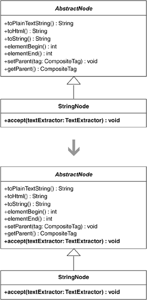
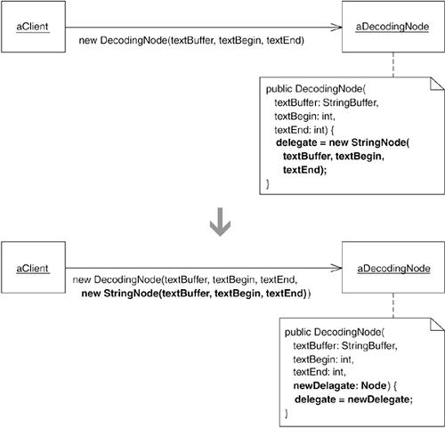

# 11장 Utility
[TOC]

## Chain Constructors
중복된 코드를 갖는 생성자가 여러 개 있다면, 중복을 최소화하기 위해 생성자들이 서로 호출하게 한다.

### 동기
- 클래스에 새로운 필드를 추가하고 이를 초기화 하기 위해 생성자 하나는 수정했지만, 다른 생성자를 수정하는 것은 깜박 했다면 또 다른 결함이 생겨난다.
- 클래스에 생성자가 많을수록 더 많은 중복이 발생한다.
- 생성자 체인을 통해 해결할 수 있다. 특수 목적의 생성자가 더 일반적인 생성자를 호출하도록 생성자 전체를 수정하여, 생성자들이 체인을 형성하도록 만드는 것이다.
- 클래스에 생성자가 너무 많아서 클라이언트가 어떤 상황에서 어느 생성자를 사용해야 할지 알기 어려워 보인다면, Replace Constructors with Creation Methods 리팩터링의 적용을 고려한다.

### 절차
1. 중복된 코드를 갖는 두 생성자를 찾는다. 그중 하나가 다른 하나를 호출하게 하는 것이 중복된 코드를 안전하게 제거할 수 있을지 살펴본다. 한 생성자가 다른 생성자를 호출하도록 수정하여 중복 코드를 줄이거나 없앤다.
1. 이미 작업한 생성자를 포함해 클래스 내의 모든 생성자에 대해 단계 1을 반복한다. 이렇게 해서 모든 생성자에 대해 중복을 가능한 한 적게 만든다.
1. public으로 남겨둘 필요가 없는 생성자의 접근 지정자를 변경한다.

### 예제
```java
import java.util.Date;

public class Loan {
        private CapitalStrategy strategy;
        private float notional;
        private float outstanding;
        private int rating;
        private Date expiry;
        private Date maturity;

        public Loan(float notional, float outstanding, int rating, Date expiry) {
                this.strategy = new TermROC();
                this.notional = notional;
                this.outstanding = outstanding;
                this.rating = rating;
                this.expiry = expiry;
        }

        public Loan(float notional, float outstanding, int rating, Date expiry, Date maturity) {
                this.strategy = new RevolvingTermROC();
                this.notional = notional;
                this.outstanding = outstanding;
                this.rating = rating;

        }

        public Loan(CapitalStrategy strategy, float notional, float outstanding, int rating, Date expiry, Date maturity) {
                this.strategy = strategy;
                this.notional = notional;
                this.outstanding = outstanding;
                this.rating = rating;
                this.expiry = expiry;
                this.maturity = maturity;
        }
}
```
1. 처음 두 생성자를 살펴본다. 코드가 중복돼 있고, 셋째 생성자도 마찬가지다. 첫째 생성자가 호출하기에 다른 두 생성자 중 어느 것이 더 쉬울지 생각 해본다. 셋째 생성자를 호출하도록 하는 것이 작업을 최소화할 수 있을 것 같다. 생성자를 다음과 같이 수정한다.
```java
public Loan(float notional, float outstanding, int rating, Date expiry) {
        this(new TermROC(), notional, outstanding, rating, expiry, null);
}
```
1. 중복을 가능한 한 많이 제거하기 위해 단계 1을 반복한다. 따라서 둘째 생성자도 변경하게 된다. 둘째 생성자 역시 다음과 같이 셋째 생성자를 호출하면 될 것 같다.
```java
public Loan(float notional, float outstanding, int rating, Date expiry, Date maturity) {
        this(new RevolvingTermROC(), notinal, outstading, rating, expiry, maturity);
}
```
1. 생성자의 public 접근 지정자를 바꿀 수 있는지 확인하기 위해 세 생성자를 호출하는 모든 부분을 살펴본다. 이 경우에는 접근 지정자를 바꿀 수 없다.

## Unify Interfaces
수퍼클래스(또는 인터페이스)가 서브클래스와 동일한 인터페이스를 가질 필요가 있다면,
서브클래스에서 수퍼클래스에 없는 모든 public 메서드를 찾아 이를 수퍼클래스에 추가한다.
이때 메서드 몸체는 비워놓아 아무 일도 하지 않도록 만든다.


### 동기

* 여러 객체를 다형적으로 처리하려면, 그 클래스들은 수퍼클래스가 됐든 인터페이스가 됐든 동일한 인터페이스를 공유해야 한다.
* 이 리팩터링은 수퍼클래스나 인터페이스가 자신의 서브클래스와 동일한 인터페이스를 가져야 할 필요가 있는 경우를 위한 것이다.
* Unify Interfaces 리팩터링은 다른 곳으로 가기 위한 임시 단계가 되기도 한다.
* 예를 들면, 이 리팩터링을 수행한 후, 다시 일련의 리팩터링을 통해 인터페이스를 통합하면서 추가한 메서드를 제거할 수도 있다. 또는 Extract Interface 리팩터링을 적용한 후 추상 클래스에 있는 메서드의 디폴트 구현이 더는 필요하지 않게 될 수도 있다.

### 절차

* 서브클래스와 public 메서드 중에서 수퍼클래스나 인터페이스에 선언되지 않은 것을 찾는다. 이런 메서드를 간단히 ‘누락 메서드’라 하자.
1. 누락 메서드를 복사해 수퍼클래스/인터페이스에 추가한다. 수퍼클래스에 추가하는 경우라면 메서드 몸체를 비워 아무 일도 하지 않게 만든다.
2. 수퍼클래스/인터페이스가 서브클래스와 동일한 인터페이스를 갖게 될 때까지 반복한다.
3. 수퍼클래스와 관계된 모든 코드가 기대한 대로 동작하는지 테스트한다.

### 예제

* ```java
public class StringNode extends AbstractNode {
        public void accept(TextExtracter textExtractor) {
                ...
        }
}
```

1. accept(...) 메서드를 복사해 AbstractNode? 클래스에 추가한 다음, 메서드가 아무 일도 하지 않도록 몸체를 비운다.
    * ```java
    public abstract class AbstractNode...
        public void accept(TextExtractor textExtractor) {
        }
    ```
2. 모든 것이 제대로 동작하는지 컴파일, 테스트해 확인한다.

## Extract Parameter

메서드나 생성자 내에서 생성한 값을 필드에 저장하고 있다면,
대입문의 우변을 새 파라미터로 대체해 클라이언트가 그 값을 지정할 수 있도록 한다.



### 동기

* 객체 내의 필드에 대입할 값을 다른 객체가 지정하도록 하고 싶을 수 있다.
* 그 필드에 지역값이 할당되고 있다면, 대입문의 우변을 새로운 파라미터로 대체해 클라이언트가 그 값을 지정하도록 할 수 있다.
* 저자의 경우 Replace Inheritance with Delegation 리팩터링을 수행한 후에 이 리팩터링이 필요해졌음.
	* 작업을 위임하는 클래스는 대리 객체(delegatee)에 대한 필드를 가지고 있고, 여기에 새로운 대리 객체 인스턴스를 할당한다.
	* 그러나 클라이언트가 이 대리객체를 지정할 수 있어야 했다.
	* Extract Parameter 리팩터링을 통해 대리 객체 생성 코드를 클라이언트가 제공하는 파라미터 값으로 간단히 대체할 수 있었다.

### 절차

1. 리팩터링을 수행하기 전에 해당 필드에 대한 대입문은 생성자나 메서드 내에 있어야 한다.
	* 그렇지 않을 경우 해당 대입문을 생성자나 메서드 안으로 옮긴다.
2. Add Parameter 리팩터링을 적용해 필드를 위한 값을 파라미터로 전달 할 수 있도록 한다.
	* 파라미터로 전달한 값을 필드에 저장.

### 예제

HTML 파서의 DecodingNode 클래스는 delegate란 필드를 갖고 있는데, DecodingNode의 생성자에서 이 필드에 StringNode 인스턴스를 할당하고 있다.

```java
public class DecodingNode implements Node ...
	private Node delegate;
    
    public DecodingNode(StringBuffer textBuffer, int textBegin, int textEnd) {
    	delegate = new StringNode(textBuffer, textBegin, textEnd);
    }
```

1. DecodeNode의 생성자에서 delegate에 이미 값을 할당하고 있으므로, 다음 단계로 넘어갈 수 있다.
2. Add Parameter 리팩터링을 적용하는데, 새로 추가하는 파라미터의 디폴트 값은 new StringNode(textBuffer, textBegin, textEnd)로 한다.
```java
public class DecodingNode implements Node ...
	private Node delegate;
    
    public DecodingNode(StringBuffer text, int textBegin, int textEnd, Node newDelegate) {
    	delegate = newDelegate;
    }
```
```java
public class StringNode ...
	...
    return new DecodingNode(..., new StringNode(textBuffer, textBegin, textEnd));
```

이 리팩터링이 끝난 후 Remove Parameter를 여러번 적용.

```java
public class DecodingNode implements Node ...
	private Node delegate;
    /*
    public DecodingNode(StringBuffer text, int textBegin, int textEnd, Node newDelegate) {
    	delegate = newDelegate;
    }
    */
    public DecodingNode(Node newDelegate) {
    	delegate = newDelegate;
    }
```