# 8장. Organizing Data

[toc]

## Self Encapsulate Field

==필드에 직접 접근하고 있는데 필드에 대한 결합이 이상해지면==, 그 필드에 대한 get/set 메소드를 만들고 항상 이 메소드를 사용하여 필드에 접근하라.
```java
  private int _low, _high;
  boolean includes (int arg) {
      return arg >= _low && arg <= _high;
  }
                             
  private int _low, _high;
  boolean includes (int arg) {
      return arg >= getLow() && arg <= getHigh();
  }
  int getLow() {return _low;}
  int getHigh() {return _high;}
```

### 동기

* 간접 접근 방식( indirect variable access )의 장점은 서브클래스에서 정보를 가져오는 방식을 재정의 할 수 있으며, 데이터를 관리하는데 있어 lazy initialization(사용할 필요가 있을 때 값을 초기화 한다.) 많은 융통성을 제공할 수 있다.
* 직접 접근 방식( direct variable access )의 장점은 코드가 읽기 쉬워진다는 것이다.
* 슈퍼클래스에 있는 필드에 접근하지만 이 변수 접근을 서브클래스에서 계산되는 값으로 오버라이드하고 싶을 때 좋다.

### 절차

* 필드에 대한 get/set 메소드를 만든다.
* 해당 필드가 참조되는 곳을 모두 찾아 get/set 메소드를 사용하도록 바꾼다.
	* 필드에 접근하는 코드는 get 메소드를 호출하도록 바꾸고, 필드에 값을 할당하는 경우에는 set메소드를 사용하도록 바꾼다.
	* 필드의 이름을 임시로 바꿔서 컴파일 하면 필드를 참조하는 곳을 쉽게 찾을 수 있다.
* 필드를 private한다.
* 모든 참조를 수정했는지 다시 확인한다.
* 컴파일과 테스를 한다.

### 예제
```java
  class IntRange {

    private int _low, _high;

    boolean includes (int arg) {
        return arg >= _low && arg <= _high;
    }

    void grow(int factor) {
        _high = _high * factor;
    }
    IntRange (int low, int high) {
        _low = low;
        _high = high;
    }
```

* 만약 get/set 메소드가 없다면, 자체 캡슐화를 하기 위해 get/set 메소드를 정의한 다음, 이 메소드를 사용하도록 한다.

```java
  class IntRange {

    private int _low, _high;

    boolean includes (int arg) {
        return arg >= _low && arg <= _high;
    }

    void grow(int factor) {
        _high = _high * factor;
    }
    IntRange (int low, int high) {
        _low = low;
        _high = high;
    }

  class IntRange {

    boolean includes (int arg) {
        return arg >= getLow() && arg <= getHigh();
    }

    void grow(int factor) {
        setHigh (getHigh() * factor);
    }

    private int _low, _high;

    int getLow() {
        return _low;
    }

    int getHigh() {
        return _high;
    }

    void setLow(int arg) {
        _low = arg;
    }

    void setHigh(int arg) {
        _high = arg;
    }
```

* 자체 캡슐화를 사용할 때, 생성자에서 set메소드가 사용되는 것에 주의해야 한다.
* set 메소드에는 초기화 할 때와는 다른 동작을 포함 해야 한다.
```java
    IntRange (int low, int high) {
        initialize (low, high);
    }

    private void initialize (int low, int high) {
        _low = low;
        _high = high;
    }
```

* 이렇게 해두면 다음과 같이 서브클래스를 만들 때 그 진가가 드러난다.
```java
  class CappedRange extends IntRange {

    CappedRange (int low, int high, int cap) {
        super (low, high);
        _cap = cap;
    }

    private int _cap;

    int getCap() {
        return _cap;
    }

    int getHigh() {
        return Math.min(super.getHigh(), getCap());
    }
   }
```

## Replace Data Value with Object
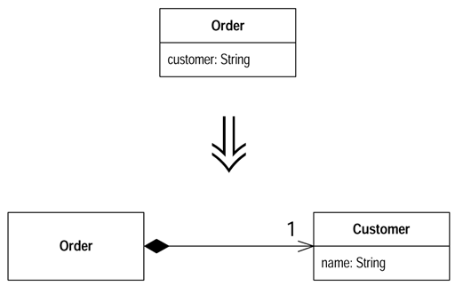
* 추가적인 **데이터**나 **기능**을 필요로 하는 데이터 아이템
* 데이터 아이템을 **객체**로 바꾸어라.
* **DATA -> OBJECT**

### 동기
* 간단한 데이터 아이템이 더 이상 간단하지 않을때
	* ex) 전화번호 포멧팅, 지역코드 추출
* 객체안에 메서드를 넣어도 되겠지만
	* 중복(duplication)과 잘못된 소속의 냄새

### 절차
1. Data에 대한 Class를 만든다.
1. 소스 Class의 값과 같은 타입으로 필드를 만들어 final(const)로 선언한다.
1. get() 메소드와 데이터 값의 필드를 매개변수로 받는 대입 생성자를 추가한다.
1. 바로 컴파일~!
1. 소스 Class의 필드 타입을 새로운 Class로 바꾼다.
1. 소스 Class의 get() 메소드에서 새 클래스의 get() 메소드를 호출한다.
	* 필드가 생성자에서 사용되면, 새 클래스의 생성자에서 값을 할당하게 한다.
1. get() 메소드에서 새 Class의 인스턴스를 생성한다.
1. 컴파일 테스트~!
1. Change Value to Reference를 검토한다.

### 예제

* 고객의 이름을 문자열로 저장하고 있는 Order Class
* ```java
class Order...
        public Order (String customer) {
                _customer = customer;
        }
        public String getCustomer() {
                return _customer;
        }
        public void setCustomer(String arg) {
                _customer = arg;
        }
        private String _customer;
```

* Order Class를 사용하는 코드
* ```java
private static int numberOfOrdersFor(Collection orders, String customer){
        int result = 0;
        Iterator iter = orders.iterators();
        while (iter.hasNext()) {
                Order each = (Order) iter.next();
                if (each.CustomerName().equals(customer)) result++;
        }
        return result;
}
```

* 고객(customer)을 객체로 만든다.
 	* 속성 정의하고, 속성을 사용하는 생성자와 읽기 메서드를 추가한다.
 	* 주소나 신용등급 같은 데이터를 저장할 장소와 이정보를 이용하는 유용한 기능이 생긴다.
* ```java
class Customer {
        public Customer (String name) {
                _name = name;
        }
        public String getName() {
                return _name;
        }
        private final String _name;
}
```

* Order의 _customer 필드 타입을 Customer로 바꾼다.
	* 그 필드를 참조하는 메서드 수정
* ```java
class Order...
        public Order (String customer) {
                _customer = new Customer(customer);
        }
        public String getCustomer() {
                return _customer.getName();
        }

        private Customer _customer;

        public void setCustomer(String arg) {
                _customer = new Customer(arg);
        }
```

* 각각의 Order가 자신만의 Customer 객체를 가지게되고, 규칙에 따라 Customer(값 객체)는 변경 불가여야한다.
	* 왜곡 오류(aliasing bug)를 피할 수 있다.
* 컴파일 테스트
* 반환되는 값이 객체가 아니라 고객명임을 확실히 한다.
	* get() 메소드에서 Rename Method(메소드의 이름이 동작을 나타낸다.)를 사용하여 return 값을 명확하게 한다.
* ```java
        public String getCustomerName() {
                return _customer.getName();
        }
```

* set() 메소드에서 파라미터 이름 변경
* ```java
        public Order (String customerName) {
                _customer = new Customer(customerName);
        }
        public void setCustomer(String customerName) {
                _customer = new Customer(customerName);
        }
```

* 추가로, 기존의 Customer 객체를 파라미터로 취하는 생성자와 set() 메소드
* ```java
        public Order (Customer customer) {
                _customer = customer;
        }
        public void setCustomer(Customer customer) {
                _customer = customer;
        }
```
* 아직 데이터를 추가 할 수 없다
	* Customer는 값 객체로 취급되기 때문
* Customer 객체에 필드를 추가하고 싶다면, Change Value to Reference를 사용하여 같은 고객에 대해서 같은 Customer 객체를 공유하도록 해야한다.


## Change Value to Reference
클래스에 같은 인스턴스가 많이 들어 있어서 이것들을 하나의 객체로 바꿔야 할 땐 그 객체를 참조 객체로 전환하자.
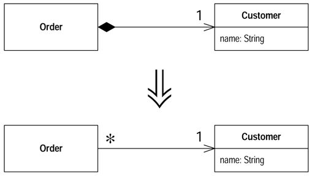

### 동기

* 참조 객체(고객, 계좌), 값 객체(날짜, 금액)
* 불변성(immutable) 데이터를 가지는 간단한 값을 가지는 객체에서 **변경 가능 데이터를 추가**하고자 할때.
	* 그 변경으로 인해 객체를 참조하는 모든 곳이 영향 받는지 확인해야 할 때도 있디.

### 절차

1. Replace Constructor with Factory Method를 사용한다.
1. 컴파일, 테스트
1. 참조 객체에 대한 접근을 책임지는 객체를 정한다.
	* 정적 사전(static dictionary), 레지스트리 객체(registry object)
	* 액세스 포인트로 동작할 하나 이상의 객체를 갖는다.
1. 미리 생성할지, 필요할 때 생성할지 정한다.
	* 미리 메모리에 생성한다면, 확실히 생성해야한다.
1. 팩토리 매소트가 참조 객체를 리턴하도록 수행한다.
	* 미리 생성된 객체의 경우 에러 처리를 생각해야 한다.
	* 팩토리에 Rename Method를 적용하여..
1. 컴파일, 테스트

### 예제

* Replace Data Value with Object에 이어서...
```java
class Customer {
        public Customer (String name) {
                _name = name;
        }
        public String getName() {
                return _name;
        }
        private final String _name;
	}
class Order {
        public Order  (String customerName) {
                _customer = new Customer (customerName);
        }
        public void setCustomer (String customerName) {
                _customer = new Customer (customerName);
        }
        public String getCustomerName() {
                return _customer.getName();
        }
        private Customer _customer;
	}
private static int numberOfOrdersFor (Collection orders, String customer){
        int result = 0;
        Iterator iter = orders.iterators();
        while (iter.hasNext()) {
                Order each = (Order) iter.next();
                if (each.CustomerName().equals(customer)) result++;
        }
        return result;
	}
```

* 하나의 Customer를 여러 Order에서 공유하도록 하고싶다.
* 각각의 고객 이름에 하나의 Customer가 있어야 한다.
* Replace Constructor with Factory Method를 사용한다.
```java
class Customer {
        public static Customer create (String name) {
                return new Customer(name);
        }
        private Customer (String name) {
                _name = name;
        }
}
class Order {
        public Order (String customerName) {
                _customer = Customer.create(customerName);
        }
}
```

* 별도의 객체를 사용해서 Customer에 접근한다.
* Customer 클레스에 접근하기 의해 별도의 레지스트리 객체를 생성한다.
```java
	private static Dictionary _instances = new Hashtable();
```

* Customer 클래스를 미리 만들어둔다.
* 일단 직접 코드를 사용하고 나중에 Substitute Algorithem을 사용
```java
class Customer...
        static void loadCustomers() {
                new Customer("Lemon Car Hire").store();
                new Customer("Associated Coffee Machine").store();
                new Customer("Bilston Gasworks").store();
        }
        private void store() {
                _instance.put(this.getName(), this);
        }
```

* 미리 생성된 Customer 객체를 리턴한다.
```java
public static Customer create (String name) {
        return (Customer)_instance.get(name);
}
````

* Rename Method(313)를 사용하여, 미리 존재하는 고객을 리턴한다는 것을 명시한다.
```java
public static Customer getNamed (String name) {
        return (Customer)_instance.get(name);
}
```

## Change Reference to Value
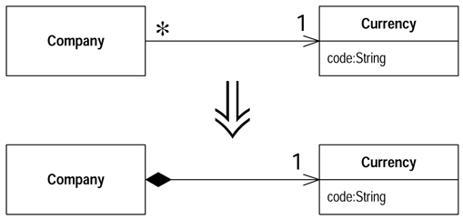
* 참조 객체가 작고, 불변성(immutable)의 관리하기 어려운 참조 객체를 값 객체로 만들어라.

### 동기

* 참조 객체로 작업하는 것이 복잡하다.
* 값 객체는 분산 시스템(Distributed System) 및 병렬 시스템(Concurrent System)에서 유용하다.
* 값 객체는 변경 할 수 없다
	* 불변성(immutable) - 항상 같은 결과

### 절차

1. 바꿀 객체가 불변성인지, 혹은 그럴 가능성이 있는지 확인한다.
	* 불변성이 아니면, Remove Setting Method를 사용하여 immutable 객체로 만들어야 한다.
	* immutable이 될 수 없다면, 리펙토링을 포기한다.
1. equals와 hashCode 메소드를 만든다.
1. 컴파일, 테스트를 한다.
1. 팩토리 메소드를 제거하고, 생성자를 public으로 할지 고려한다.

### 예제

* Currency Class
	* 단순히 코드를 저장하고 반환하는 클래스
```java
class Currency...
        private String _code;

        public String getCode() {
                return _code;
        }
        private Currency(String code) {
                _code = code;
        }
```

* Currency의 동일 인스턴스 얻기
	* 생성자가 private이므로 인스턴스를 만들기 위해 생성자를 사용할 수는 없다.
```java
Currency usd = Currency.get("USD");
```

* 값 객체로 변경하기 위해서는 그 객체가 변경불가인지 확인해야한다.
```java
new Currency("USD").equals(new Currency("USD")) //false를 리턴
```

* immutable인지 확인.
* equals 메소드를 정의한다.
	* _code가 값다면 같은 객체라는 것을 정의
```java
public boolean equals(Object arg) {
        if (! (arg instanceof Currency)) return false;
        Currency other = (Currency)arg;
        return (_code.equals(other._code));
}
```

* hashCode 메소드를 정의한다.
	* _code가 값다면 Map에 같은 키로 저장
```java
public int hashCode() {
        return _code.hashCode();
}
```

* 이제 클래스 내의 모든 컨트롤러 관련 동작과 팩토리 메소드를 제거하고, 그냥 생성자를 사용할 수 있다.
```java
new Currency("USD").equals(new Currency("USD")) //true를 리턴
```

## Replace Array with Object
배열의 특정 요소가 다른 뜻을 가지고 있다면, 배열을 객체로 바꿔라.
```java
String[] row = newString[3];
row[0] = "Liverpool";
row[1] = "15";
```
```java
Performance row = new Performance();
row.setName("Liverpool");
row.setWins("15");
```

###동기

* '배열의 첫 번째 요소는 사람의 이름이다.'는 식의 약속(convention)
* 객체를 사용하여 필드의 이름이나 메소드에 정보를 전달한다.
* 정보를 캡슐화(encapsulate) 하고 Move Method(170)를 사용하여 객체에 동작을 추가.

###절차

1. 새로운 클래스를 만들고, 배열을 위한 public 필드를 만든다.
1. 해당 배열을 사용하는 부분을 모두 새로운 클래스를 사용하도록 바꾼다.
1. 컴파일, 테스트 한다.
1. 배열의 요소에 get/set 메소드를 추가하고 이름을 잘 정한다.
1. get/set 메소드를 사용하도록 하나씩 수정하면서 컴파일, 테스트 한다.
1. 배열을 private으로 만든다.
1. 컴파일 한다.
1. 배열의 각 요소에 대해 필드를 만들고, get/set 메소드를 사용하도록 수정한다.
1. 하나씩 바꾸면서 컴파일, 테스트 한다.
1. 배열의 모든 요소를 필드로 바꾼 후에, 배열을 제거한다.

###예제

* 스포츠 팀의 이긴 경기 횟수, 진 경기 횟수를 저장하는 배열
```java
String row = new String[3];
row[0] = "Liverpool";
row[1] = "15";
String name = row[0];
int wins = Integer.parseInt(row[1]);
```

* Replace Array with Object
* 새로운 클래스를 만든다.
```java
class Performance {}
```

* public 데이터 맴버를 만든다.
```java
        public String[] _data = new String[3];
```

* 배열을 생성하는 부분과 사용하는 부분을 바꾼다.
```java
Performance row = new Performance();
row._data [0] = "Liverpool";
row._data [1] = "15";
String name = row._data [0];
int wins = Integer.parseInt(row._data [1]);
```

* get/set 메소드를 추가한다.
```java
class Performance...
        public String getName() {
                return _data[0];
        }
        public void setName(String arg) {
                _data[0] = arg;
        }

        public String getWins() {
                return Integer.parseInt.(_data[0]);
        }
        public void setWins(String arg) {
                _data[1] = arg;
        }
```

* row를 사용하는 부분을 get/set 메소드를 사용하도록 수정한다.
```java
row.setName("Liverpool");
row.setWins("15");
String name = row.getName();
int wins = row.getWins();
```

* 배열을 private으로 만들수 있다.
```java
        private String[] _data = new String[3];
```

* 인터페이스 작업 종료, 배열 요소에 대한 필드 추가.
```java
class Performance...
        public String getName() {
                return _name;
        }
        public void setName(String arg) {
                _name = arg;
        }
        private String _name;

        public String getWins() {
                return _wins;
        }
        public void setWins(Integer arg) {
                _wins = arg;
        }
        private Integer _wins;
```

##Duplicate Observerd Data
GUI 컨트롤에서만 사용 가능한 도메인(domain) 데이터가 있고, 도메인 메소드에서 접근이 필요한 경우. 데이터를 도메인 객체로 복사하고, Observer를 두어 두 데이터를 동기화 하라.
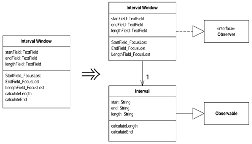

###동기

* 비지니스 로직 처리 코드와 사용자 인터페이스 처리 코드를 분리하여 시스템 개발을 용이하게 한다.
	* 비슷한 비지니스 로직을 여러 인터페이스가 처리
	* 비지니스 로직까지 처리하려면 사용자 인터페이스가 너무 복잡
	* 인터페이스와 분리된 비지니스 로직이 더욱 유지보수하기 쉬움
	* 두 부분을 서로 다른 개발자가 다루게 할 수 있다.


###절차

1. 프리젠테이션(presentation) 클래스를 도메인 클래스의 Observer로 만든다.
	* 도메인 클래스가 없다면, 만든다.
	* 프리젠테이션 클래스에서 도메인 클래스로의 링크가 없다면, 프리젠테이션 클래스의 필드에 도메인 클래스를 필드로 작성한다.
1. 프리젠테이션 클래스 내의 도메인 데이터에 Self Encapsulate Field(205)를 사용한다.
	* getter/setter 메서드 작성
1. 컴파일, 테스트
1. 이벤트 핸들러 안에 있는 set메소드에 컴포넌트를 현재 값으로 업데이트하는 코드를 추가한다.
	* 컴포넌트에 직접 접근하여 현재 값을 알아낸다.
1. 컴파일, 테스트
1. 도메인 클래스에 데이터와 접근자 메소드를 정의한다.
	* 도메인의 set 메소드가 Observer 패턴의 통보(notify) 메커니즘을 작동하도록 하라.
	* 도메인에 프리젠테이션에 있는 것과 같은 데이터 타입을 사용하라.
1. 접근자가 도메인 필드로 접근하도록 재지정한다.
1. Observer의 update 메소드가 도메인 필드의 데이터를 GUI 컴포넌트로 복사하도록 수정한다.
1. 컴파일, 테스트

###예제

* 셋 중 하나의 값을 변경시키면, 다른 필드의 값도 업데이트 된다.
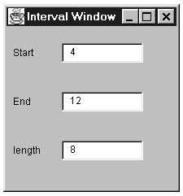


* 각각의 필드가 포커스를 잃을때 이벤트 메소드를 호출한다.
```java
public class IntervalWindow extends Fram...
        java.awt.TextField _startField;
        java.awt.TextField _endField;
        java.awt.TextField _lengthField;

        class SymFocus extends java.awt.event.FocusAdapter
        {
                public void FocusLost(java.awt.event.FocusEvent event)
                {
                        Object object = event.getSource();
                        if (object == _startField)
                                StartField_FocusLost(event);
                        else if (object == _endField)
                                EndField_FocusLost(event);
                        else if (object == _lengthField)
                                LengthField_FocusLost(event);
                }
        }
```

* 이벤트 처리 메소드
	* 숫자가 아닌 문자 입력 시 필드를 0으로 삽입하고
	* 숫자 입력 시 계산 메서드를 호출한다.
```java
void StartField_FocusLost(java.awt.event.FocusEvent event) {
        if (isNotInteger (_startField.getText()))
                _startField.setText("0");
        calculateLength();
}
void EndField_FocusLost(java.awt.event.FocusEvent event) {
        if (isNotInteger (_endField.getText()))
                _endField.setText("0");
        calculateLength();
}
void LengthField_FocusLost(java.awt.event.FocusEvent event) {
        if (isNotInteger (_lengthField.getText()))
                _lengthField.setText("0");
        calculateEnd();
}
```

* 계산 루틴
	* start 값과 end 값의 길이 차이를 구해 length에 대입
	* start 값과 length 값의 합을 구해 end에 대입
```java
void calculateLength() {
        try {
                int start = Integer.parseInt(_startField.getText());
                int end = Integer.parseInt(_endField.getText());
                int length = end - start;
                _lengthField.setText(String.valueOf(length));
        } catch (NumberFormatException e) {
                throw new RuntimeException ("Unexpected Number Format Error");
        }
}
void calculateEnd() {
        try {
                int start = Integer.parseInt(_startField.getText());
                int length = Integer.parseInt(_lengthField.getText());
                int end = start + length;
                _endField.setText(String.valueOf(end));
        } catch (NumberFormatException e) {
                throw new RuntimeException ("Unexpected Number Format Error");
        }
}
```
* 인터페이스로 로직을 분리
* 계산 루틴을 분리
	* calculateLength와 calculateEnd를 별도의 도메인 클래스로 옮김.
		* start, end, length 데이터를 IntervalWindow 클래스를 거치지 않고 참조
		* start, end, length 데이터를 Interval 클래스에 중복시키고, IntervalWindow 있는 데이터와 동기화

* 도메인 클래스를 만든다.
```java
class Interval extends Observable {}
```

* IntervalWindow에 이 도메인 클래스의 링크를 만든다.
```java
private Interval _subject;
```

* IntervalWindow의 생성자에서 IntervalWindow를 Intrerval의 Observer로 만든다.
	* update 메서드로 Interval 클래스 호출
	* Interval의 데이터를 복제함과 동시에 IntervalWindow의 값들이 초기화된다.
```java
_subject = new Interval();
_subject.addObserver(this);
update(_subject, null);
```

* IntervalWindow를 Observer로 선언한다.
```java
public class IntervalWindow extends Frame implements Observer
```

* Observer를 구현하기 위해 update 메소드를 정의한다.
```java
public void update (Observable observed, Object arg) {
}
```

* 컴파일, 테스트
* 한번에 한 필드씩 변경(end 필드)
* Self Encapsulate Field를 적용한다.
* getText/setText 메소드를 호출하는 접근자를 만든다.
```java
String getEnd() {
        return _endField.getText();
}
void setEnd(String arg) {
        _endField.setText(arg);
}
```

* _endField를 참조하는 곳을 접근자로 바꾼다.
```java
void calculateLength() {
        try {
                int start = Integer.parseInt(_startField.getText());
                int end = Integer.parseInt(getEnd());
                int length = end - start;
                _lengthField.setText(String.valueOf(length));
        } catch (NumberFormatException e) {
                throw new RuntimeException ("Unexpected Number Format Error");
        }
}
void calculateEnd() {
        try {
                int start = Integer.parseInt(_startField.getText());
                int length = Integer.parseInt(_lengthField.getText());
                int end = start + length;
                setEnd(String.valueOf(end));
        } catch (NumberFormatException e) {
                throw new RuntimeException ("Unexpected Number Format Error");
        }
}
void EndField_FocusLost(java.awt.event.FocusEvent event) {
        if (isNotInteger (getEnd()))
                 setEnd("0");
        calculateLength();
}
```

* endField의 값을 end 필드의 현재값으로 대입
```java
void EndField_FocusLost(java.awt.event.FocusEvent event) {
        setEnd(_endField.getText());
        if (isNotInteger (getEnd()))
                setEnd("0");
        calculateLength();
}
```

* getEnd가 값을 필드에서 얻는 것이 아니라 도메인 객체에서 얻게 하게 할 것이므로 getEnd를 사용하면 안된다.
* 컴파일, 캡슐화 테스트
* 도메인 클래스에 end 필드를 추가.
```java
class Interval...
        private String _end = "0";
```

* end 필드를 초기화, get/set 메소드를 추가.
```java
class Interval...

        String getEnd() {
                return _end;
        }
        void setEnd(String arg) {
                _end = arg;
                setChanged();
                notifyObservers();
        }
```

* IntervalWindow에 있는 접근자가 Interval을 사용하도록 변경.
```java
class IntervalWindow...
        String getEnd() {
                return _subject.getEnd();
        }
        void setEnd(String arg) {
                _subject.setEnd(arg);
        }

        //GUI가 통보에 반응하는 것을 확실히 하기 위해 update를 변경
        public void update(Observable observed, Object arg) {
                _endField.setText(_subject.getEnd());
        }
```

* 다른 두 필드에 대해서 같은 작업이 끝나면, Move Method(170)를 적용하여 calculateEnd와 calculateLength를 Interval 클래스로 옮길 수 있다.
* GUI 클래스를 완전히 제거할 수 있다.


## Change Unidirectional Association to Bidirectional
==각각 서로의 기능을 필요로 하는 클래스가 있는데, 링크가 한쪽 방향으로만 되어 있는 경우== 반대 방향으로 포인터를 추가하고, 수정자가 양쪽 세트를 모두 업데이트 하게 변경하라.

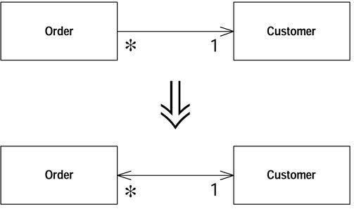

### 동기
* 두 개의 클래스가 연관관계에 놓여 있으나 한 클래스에서만 상대 클래스를 참조 하고 있는경우 다른 클래스를 알아내기가 쉽지 않을 수가 있다. 즉 단방향 링크는 한계가 있으므로 역 포인터로 불리는 양방향 참조를 사용해야 한다.

### 절차
1. 역 포인터를 위한 필드 추가.
1. 어떤 클래스가 이 연관을 제어할 것인지 결정.
1. 연관을 제어하지 않는 쪽에 헬퍼 메소드를 만든다. (네이밍에 주의한다)
1. 연관을 제어하는 쪽에 수정자가 있으면, 역 포인터를 업데이트하도록 수정한다.
1. 만약 수정자가 제어되는 쪽에 있다면, 제어하는 쪽에 제어 메소드를 만들고, 수정자에서 이 메소드를 호출하도록 한다

### 예제

* Customer 클래스를 참조하는 Order 클래스
```java
class Order...
Customer getCustomer() {
    return _customer;
}
void setCustomer (Customer arg) {
    _customer = arg;
}
Customer _customer;
```

### 리팩토링
* Customer 클래스에서 여러개의 Order를 가져야 되는 상황 발생

* n개의 Order 클래스를 가지는 컬렉션을 Customer에 추가
```java
class Customer {
    private Set _orders = new HashSet();
```
* 연관 책임에 대한 결정 (여기선 Order 객체가 1번에 해당하므로 Order 객체가 컨트롤러 역활)
 1. 두 객체가 모두 참조 객체이고 연관이 일대다인 경우 하나의 참조를 가지는 객체를 컨트롤러로 설정.
 1. 한 객체가 다른 객체의 일부로 사용된다면 포함하고 있는 객체가 연관을 컨트롤.
 1. 두 객체가 모두 참조 객체이고 연관이 다대다인 경우, 상관없음

* Customer 클래스에 헬퍼 메소드 추가 (메소드의 용도가 명확하고 가시성을 적당히 조절한다.)
```java
class Customer...
Set friendOrders () {
/** should only be used by Order when modifying the association */
    return _orders;
}
```

* Order 클래스의 수정자를 양쪽의 포인터를 동기화 하도록 수정한다.
```java
class Order...
void setCustomer (Customer arg) ...
    if (_customer != null) _customer.friendOrders().remove(this);
    _customer = arg;
    if (_customer != null) _customer.friendOrders().add(this);
}
```

* 만약 Customer를 통해 링크를 수정하고 싶다면 Order 클래스의 제어 메소드를 호출하도록 한다.
```java
class Customer...
void addOrder(Order arg) {
    arg.setCustomer(this);
}
```

* Order 클래스와 Customer 클래스의 관계가 다대다인 경우 아래와 같은 코드가 된다.
```java
 class Order... //controlling methods
 void addCustomer (Customer arg) {
     arg.friendOrders().add(this);
     _customers.add(arg);
 }

 void removeCustomer (Customer arg) {
     arg.friendOrders().remove(this);
     _customers.remove(arg);
 }

 class Customer...
 void addOrder(Order arg) {
     arg.addCustomer(this);
 }

 void removeOrder(Order arg) {
     arg.removeCustomer(this);
 }
```

## Change Bidirectional Association to Unidirectional
==서로 링크를 가지는 두 개의 클래스에서 한 쪽이 다른 한쪽을 더 이상 필요로 하지 않을때==는 불필요한 링크를 제거하라.

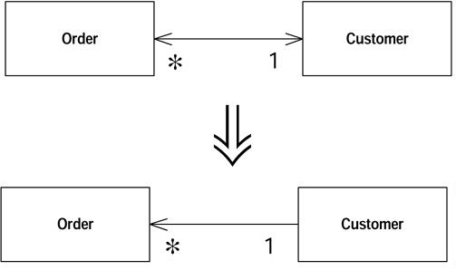

### 동기
* 양방향 유지에 따른 복잡성 증가.(에러의 원인)
* 종속성 증가.
* 종속성이 많으면 시스템의 결합성이 증가하여 약간의 변경이 예상할 수 없는 많은 문제를 유발한다.

### 절차
* 삭제 대상이 되는 포인터에 대한 필드를 읽고 있는 곳을 모두 조사.
 * 필드를 직접 읽는 메소드와 그 메소드를 호출하는 다른 메소드 검사.
 * 포인터를 사용하지 않고 다른 객체를 알아내는 법 (Substitute Algorithm) 고려.
 * 포인터 필드 사용 메소드에 객체를 파라메터로 넘기기.
* 클라이언트 사용 get 메소드를 Self Encapsulate Field 적용하고 Substitute Algorithm 적용 후 컴파일, 테스트.
* 클라이언트 에서 get 메소드를 필요로 하지 않으면 필드의 객체를 다른 방법으로 얻을 수 있도록 한다. 각각의 변경에 대해 컴파일,테스트를 한다.
* 필드를 읽는 부분을 모두 제거한 후에, 필드를 업데이트 하는 코드와 필드를 제거한다.
* 컴파일, 테스트를 한다.

### 예제
```java
class Order...
Customer getCustomer() {
    return _customer;
}
void setCustomer (Customer arg) {
    if (_customer != null) _customer.friendOrders().remove(this);
    _customer = arg;
    if (_customer != null) _customer.friendOrders().add(this);
}
private Customer _customer;

class Customer...
void addOrder(Order arg) {
    arg.setCustomer(this);
}
Set friendOrders() {
    /** should only be used by Order */
    return _orders;
}
private Set _orders = new HashSet();

```
### 리팩토링
* 고객(Customer)이 없는 경우에는 주문(Order)도 없다. 그러므로 Order에서 Customer로의 링크를 끊자
* 포인터 필드를 제거하기 위해 다른 대안을 제공해야 한다. 필드를 읽는 메소드와 이 메소드들을 사용하는 다른 메소드를 조사한 후 대안을 적용하자.
 * Customer 객체를 파라미터로 제공하는 방법
    ```java
    class Order...
    double getDiscountedPrice() {
        return getGrossPrice() * (1 - _customer.getDiscount());
    }

    // change
    class Order...
    double getDiscountedPrice(Customer customer) {
        return getGrossPrice() * (1 - customer.getDiscount());
    }
    ```
 * ==Substutite Algorithm==을 이용한 get 메소드 리팩토링
  ```java
      Customer getCustomer() {
      Iterator iter = Customer.getInstances().iterator();
        while (iter.hasNext()) {
            Customer each = (Customer)iter.next();
            if (each.containsOrder(this)) return each;
        }
        return null;
    }
  ```

## Replace Magic Number with Symbolic Constant
특별한 의미를 가지는 숫자 리터럴이 있으면 상수를 만들고, 의미를 잘 나타내도록 이름을 지은 다음, 숫자를 상수로 바꾸어라.

### 동기
* 매직 넘버는 명확하지 않다.
* 매직 넘버가 변경될때 여러곳을 고쳐야 한다면....
* 가독성이 좋지 않다.

### 절차
* 상수를 선언하고 그 값을 매직 넘버의 값으로 설정한다.
* 매직 넘버가 사용되는 곳을 모두 찾는다.
* 매직 넘버가 상수의 의미와 맞는지 보고, 의미가 맞으면 상수로 바꾼다.
* 컴파일한다.
* 모든 매직 넘버를 바꾼 후에 컴파일, 테스트를 한다.

### 예제
```java
double potentialEnergy(double mass, double height) {
    return mass * 9.81 * height;
}
```
### 리팩토링
```java
double potentialEnergy(double mass, double height) {
    return mass * GRAVITATIONAL_CONSTANT * height;
}

static final double GRAVITATIONAL_CONSTANT = 9.81;
```

## Encapsulate Field
public 필드가 있는 경우, 그 필드를 private로 만들고, 접근자를 제공하라.

### 동기
* 캡슐화.
* public은 모듈성을 떨어트린다.
* 변경의 용이함.
* ==Move Method==의 시작.

### 절차
* 필드에 대한 get/set 메소드를 만든다.
* 클래스 밖에서 그 필드를 참조하는 모든 클라이언트 코드를 찾는다. 만약 클라이언트 코드에서 이 값을 이용한다면, get/set 메소드 호출로 바꾼다.
* 각각의 변경에 대해서 컴파일, 테스트를 한다.
* 클라이언트 코드를 모두 수정했으면, 필드를 private로 만든다.
* 컴파일 테스트를 한다.

### 예제
```java
public String _name;
```

### 리팩토링
```java
private String _name;
public String getName() {return _name;}
public void setName(String arg) {_name = arg;}
```

## Encapsulate Collection

Collection을 리턴하는 메소드가 있으면, 그 메소드가 읽기전용 뷰(read-only vier)를 리턴하도록 만들고, add/remove 메소드를 제공하라.

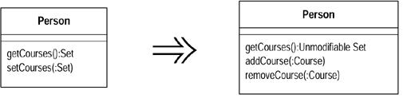

### 동기
* 컬렉션을 리턴하면 외부에서 수정이 일어날 가능성이 있다.
* 외부에 객체 내부 데이터 구조를 너무 많이 드러내지 말자.
* 컬렉션에 대한 set 메소드를 제거하고 컬렉션을 조작할 수 있는 오퍼레이션을 두자

### 절차
1. 컬렉션에 대한 add/remove 메소드 추가
1. 필드를 빈 컬렉션으로 초기화한다.
1. 컴파일한다.
1. set 메소드를 호출하는 코드를 찾아 add/remove로 수정한다.
1. set 메소드의 이름을 Rename Method를 사용하여 바꾼다.(initialize, replace)
1. 컴파일, 테스트를 한다.
1. get 메소드를 사용하여 컬렉션을 수정하는 코드를 찾아서 add/remove 메소드를 사용하도록 수정한다. 각각의 변경에 대해 컴파일, 테스트를 한다.
1. get 메소드를 사용하여 컬렉션을 수정하는 코드를 모두 바꾸었으면, get 메소드가 컬렉션의 읽기전용 뷰(read-only view)를 리턴하도록 수정한다.
1. 컴파일, 테스트를 한다.
1. get 메소드를 사용하는 코드를 찾는다. 호스트 객체(컬렉션을 가지고 있는 객체)에 있어야 하는 코드가 있는지 본다.
 ==Extract Method==와 ==Move Method==를 사용하여 코드를 호스트 객체로 옮긴다.

### 예제
* 사용 대상 코드
```java
class Course...
    public Course (String name, boolean isAdvanced) {...};
    public boolean isAdvanced() {...};

    ...
class Person...
    public Set getCourses() {
        return _courses;
    }
    public void setCourses(Set arg) {
        _courses = arg;
    }
    private Set _courses;
```
* 사용 코드
```java
    Person kent = new Person();
    Set s = new HashSet();
    s.add(new Course ("Smalltalk Programming", false));
    s.add(new Course ("Appreciating Single Malts", true));
    kent.setCourses(s);
    Assert.equals (2, kent.getCourses().size());
    Course refact = new Course ("Refactoring", true);
    kent.getCourses().add(refact);
    kent.getCourses().add(new Course ("Brutal Sarcasm", false));
    Assert.equals (4, kent.getCourses().size());
    kent.getCourses().remove(refact);
    Assert.equals (3, kent.getCourses().size());

    //고급 과목 개수에 대한 코드
    Iterator iter = person.getCourses().iterator();
    int count = 0;
    while (iter.hasNext()) {
            Course each = (Course) iter.next();
            if (each.isAdvanced()) count ++;
    }
```

### 리팩토링
* 컬렉션을 조작할 수 있는 메소드 추가
 ```java
class Person
public void addCourse(Course arg) {
    _courses.add(arg);
}
public void removeCourse(Course arg) {
    _courses.remove(arg);
}
 ```
* 기존 set 호출부를 add 메서드로 전환
 * 외부에서 데이터를 설정한 후 설정된 데이터를 set
  ```java
    class Person...
    public void setCourses(Set arg) {
        Assert.isTrue(_courses.isEmpty());
        Iterator iter = arg.iterator();

        while (iter.hasNext()) {
        	addCourse((Course) iter.next());
        }
     }
  ```
 * ==Rename Method== 적용
	```java
   public void initializeCourses(Set arg) {
        Assert.isTrue(_courses.isEmpty());
        Iterator iter = arg.iterator();
        while (iter.hasNext()) {
            addCourse((Course) iter.next());
        }
    }
    ```
 * 초기화를 위해 요소 추가시 별도의 동작이 필요없다면 loop 제거
  ```java
  public void initializeCourses(Set arg) {
        Assert.isTrue(_courses.isEmpty());
        _courses.addAll(arg);
    }
  ```
   * 외부에서 Set을 넘겨준 후 그 Set을 수정하면 캡슐화 위반 (복사본이 필요)
 * add/remove 메소드만을 사용하도록 수정 (set 제거)
  ```java
    Person kent = new Person();
    kent.addCourse(new Course ("Smalltalk Programming", false));
    kent.addCourse(new Course ("Appreciating Single Malts", true));
  ```
* get 메소드에 따른 내부 컬렉션 수정부 변경
```java
kent.getCourses().add(new Course ("Brutal Sarcasm", false));
...
-> kent.addCourse(new Course ("Brutal Sarcasm", false));
```
* get 메소드가 수정 불가능한 뷰를 리턴하게 한다.(java 1.2)
```java
public Set getCourses() {
    return Collections.\hl unmodifiableSet \hl(_courses);
}
```
* get 메소드를를 사용하는 부분을 찾아서 동작하는 부분을 클래스로 옮긴다.
 * ==Extract Method== 사용
  ```java
  int numberOfAdvancedCourses(Person person) {
        Iterator iter = person.getCourses().iterator();
        int count = 0;
        while (iter.hasNext()) {
            Course each = (Course) iter.next();
            if (each.isAdvanced()) count ++;
        }
        return count;
    }
  ```
  * ==Move Method== 사용하여 Person 클래스로 이동
   ```java
   class Person...
    int numberOfAdvancedCourses() {
        Iterator iter = getCourses().iterator();
        int count = 0;
        while (iter.hasNext()) {
            Course each = (Course) iter.next();
            if (each.isAdvanced()) count ++;
        }
        return count;
    }
   ```
   
## Replace Record with Data Class

전통적인 프로그래밍 환경에서 레코드 구조를 이용한 인터페이스를 제공해야 할 땐, 레코드 구조를 저장할 덤 데이터 객체를 작성하자.
* 덤 데이터 객체(dumb data object) : 데이터가 거의 들어 있지 않은 객체. 기능 추가 없이 데이터에 public 속성이나 읽기/쓰기 메서드로 접근할 수 있다.
	* 객체지향 프로그래밍 개념에서 주로 기능과 데이터를 클래스 안에 모아놔야 한다는 정통적 개념에 위배된다.

### 동기

* 외부 요소를 처리할 인터페이스 역할을 하는 클래스를 작성하는 경우
	* 구버전 프로그램을 복사하는 경우
	* 구조화된 레코드를 기존의 프로그래밍 API나 데이터베이스 레코드와 소통하는 경우
* 클래스를 외부 레코드 처럼 만들고 다른 필드와 메서드는 나중에 클래스로 옮긴다.
* 각 인덱스에 들어있는 원소에 특수한 의미가 있는 배열의 경우 배열을 객체로 전환(Replace Array with Object)을 실시하자.

### 방법

* 레코드를 표현할 클래스를 작성하자.
* 그 클래스에 각 데이터 항목에 대한 읽기 메서드와 쓰게 메서드를 작성하고 private 필드를 선언하자.


## Replace Type Code with Class

클래스의 동작에 영향을 미치지 않는 숫자로 된 타입코드가 있으면, 숫자를 클래스로 바꾸어라.

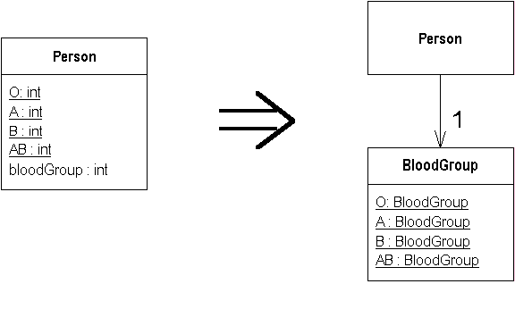

### 동기

* 숫자로된 타입코드나 열거형을 사용한다면 컴파일러는 우리가 지정한 상징적인 이름이 아니라 결국 숫자를 이용하여 타입체크를 한다. 
* 타입코드를 파라미터로 받는 메소드 또한 숫자로 인식할 뿐 우리가 의도한 대로 상징적인 이름을 사용하도록 강제할 수 있는 방법이 없으며, 소스의 가독성을 떨어뜨리고 버그의 원인이 될 수 있다. 
* 이것을 클래스로 바꾸]면 컴파일러는 클래스에 대해서 타입 체크를 할 수 있게 된다. 
	* 단 타입 코드가 순수한 데이터일 때에만 실시해야 한다. (타입코드가 switch 문에 사용되는 경우에는 클래스로 전환하면 안됨.)

### 절차

1. 타입 코드를 위한 새로운 클래스를 만든다.
2. 소스 클래스에서 새로 만든 클래스를 사용하도록 구현을 수정한다.
3. 컴파일, 테스트를 한다.
4. 소스 클래스에서 코드를 사용하는 각각의 메소드에 대해, 새로 만든 클래스를 사용하는 새로운 메소드를 만든다.
5. 소스 클래스의 클라이언트 코드를 하나씩 수정하여 새로운 인터페이스를 사용하도록 한다.
6. 각각의 클라이언트 코드를 수정할 때마다 컴파일과 테스트를 한다.
7. 코드를 사용하는 기존의 인터페이스와, 코드에 대한 static 변수 선언을 제거한다.
8. 컴파일, 테스트 한다.

### 예제

```java
class Person {

    public static final int O = 0;
    public static final int A = 1;
    public static final int B = 2;
    public static final int AB = 3;

    private int _bloodGroup;

    public Person (int bloodGroup) {
        _bloodGroup = bloodGroup;
    }

    public void setBloodGroup(int arg) {
        _bloodGroup = arg;
    }

    public int getBloodGroup() {
        return _bloodGroup;
    }

  }
```

* 타입코드를 클래스로 만든다.
* 타입번호를 멤버로 갖도록 한다.
```java
class BloodGroup {
    public static final BloodGroup O = new BloodGroup(0);
    public static final BloodGroup A = new BloodGroup(1);
    public static final BloodGroup B = new BloodGroup(2);
    public static final BloodGroup AB = new BloodGroup(3);
    private static final BloodGroup[] _values = {O, A, B, AB};

    private final int _code;

    private BloodGroup (int code ) {
  	  _code = code;
    }

    public int getCode() {
    	return _code;
    }

    public static BloodGroup code(int arg) {
    	return _values[arg];
    }
}
```

* 멤버를 새로 만든 타입코드 클래스로 변경하고 get/set함수를 추가한다.
* 그리고 생성자에 타입코드 클래스를 받아 설정하도록 추가한다.
```java
class Person {
    public static final int O = BloodGroup.O.getCode();
    public static final int A = BloodGroup.A.getCode();
    public static final int B = BloodGroup.B.getCode();
    public static final int AB = BloodGroup.AB.getCode();

    private BloodGroup _bloodGroup;

    public Person (int bloodGroup) {
    	_bloodGroup = BloodGroup.code(bloodGroup);
    }

    // 이전 코드와 호환성 유지때문에..
    public void setBloodGroup(int arg) {
    	_bloodGroup = BloodGroup.code (arg);
    }

    // 이전 코드와 호환성 유지때문에.. getBloodGroup 함수를 -> getBloodGroupCode 로 변경하여 의미를 명확하게 했다.
    public int getBloodGroupCode() {
 	   return _bloodGroup.getCode();
    }

    public BloodGroup getBloodGroup() {
    	return _bloodGroup;
    }

    public Person (BloodGroup bloodGroup ) {
    	_bloodGroup = bloodGroup;
    }

    public void setBloodGroup(BloodGroup arg) {
    	_bloodGroup = arg;
    }
}
```

* 사용하는 쪽에도 변경한다.
```java
// Person의 상수를 사용하지 않고 생성자에서 BloodGroup를 설정하도록.
Person thePerson = new Person(Person.A); 
		-> Person thePerson = new Person(BloodGroup.A);
// getBloodGroup 로 BloodGroup를 얻어와 직접 접근하도록 변경.
thePerson.getBloodGroupCode()
		-> thePerson.getBloodGroup().getCode()
// Person의 상수를 사용하지 않도록 변경.
thePerson.setBloodGroup(Person.AB)
		-> thePerson.setBloodGroup(BloodGroup.AB)
```

* 사용하는 쪽이 모두 변경됐다면 호환을 위해 남겨뒀던 코드같은 불필요해진 코드들을 제거한다.
```java
class Person {
    private BloodGroup _bloodGroup;

    public Person (BloodGroup bloodGroup ) {
    	_bloodGroup = bloodGroup;
    }

    public void setBloodGroup(BloodGroup arg) {
    	_bloodGroup = arg;
    }
    public BloodGroup getBloodGroup() {
    	return _bloodGroup;
    }
}
```

* BloodGroup에서 사용하는 메소드를 private로 변경할 수 있다.
```java
class BloodGroup...
    private int getCode() {
	    return _code;
    }

    private static BloodGroup code(int arg) {
    	return _values[arg];
	}
```

## Replace Type Code with Subclasses

==클래스 동작에 영향을 미치는 변경 불가능한 타입 코드가 있다면== 타입코드를 서브클래스로 바꿔라. (팩토리 패턴)

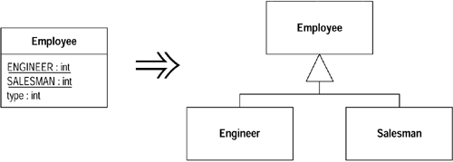

### 동기

* 동작에 영향을 미치지 않는다면 앞에서 소개한 Replace Type Code with Class 를 사용할 수 있지만 영향을 준다면 다형성을 사용하여 여러가지 동작을 처리하도록 한다.

* 보통은 타입코드를 이용한 조건문이 많을 때 이런 경우가 발생한다.

* 어떤 타입에 따라 다른 코드를 실행하는 로직이 있다면 Replace Conditional with Polymorphism 을 사용해 리팩토링 하는것이 좋은데, 그렇게 하기 위한 전 단계가 이번에 소개하는 리펙토링이다.

* 만약 객체가 생성된 후 타입코드값이 바껴야된다거나 타입코드를 가지는 클래스가 이미 서브 클래스를 가진다면 Replace Type Code with State/Strategy를 사용해야 한다.

* 장점은 새로운 동작이 추가되면 서브클래스만 추가해주면 된다는 것이다.

### 절차

1. 타입 코드를 자체 캡슐화 한다.
2. 각각의 타입 코드에 대해 서브클래스를 생성한다.
	* 서브 클래스에서 타입코드를 얻는 get메소드를 오버라이드 하여 관련된 값을 리턴하도록 한다.
3. 각각의 타입 코드를 서브클래스로 바꾸고 난 후에 컴파일, 테스트 한다.
4. 슈퍼 클래스에서 타입 코드필드를 제거하고 타입 코드에 대한 접근자를 추상화 한다.
5. 컴파일, 테스트 한다.

### 예제

```java
class Employee...
	private int _type;
    static final int ENGINEER = 0;
	static final int SALESMAN = 1;
	static final int MANAGER = 2;

	Employee (int type) {
		_type = type;
	}
```

* get메소드를 추가하고 생성자를 팩토리 메소드로 변경한다. getType 은 abstract 함수로 변경한다.
```java
class Employee...
	private int _type;
    static final int ENGINEER = 0;
    static final int SALESMAN = 1;
    static final int MANAGER = 2;

    Employee (int type) {
    	_type = type;
    }

    abstruct int getType();

    Employee create(int type) {
    	return new Employee(type);
    }

    private Employee (int type) {
    	_type = type;
    }
```

* 서브클래스를 생성한다.
```java
class Engineer extends Employee {
    int getType() {
	    return Employee.ENGINEER;
    }
}
```

* 생성된 서브 클래스를 사용하도록 Employee를 변경한다.
```java
class Employee
    static Employee create(int type) {
        switch (type) {
        	case ENGINEER:
        		return new Engineer();
        	case SALESMAN:
        		return new Salesman();
        	case MANAGER:
        		return new Manager();
        	default:
        		throw new IllegalArgumentException("Incorrect type code value");
    }
}
```

## Replace Type Code with State/Strategy

==클래스의 동작에 영향을 미치는 타입 코드가 있지만 서브 클래스로 바꿀 수 없을 때==는 타입코드를 스테이트 객체로 바꾸어라. (스테이트/스트레티지 패턴을 사용하자)

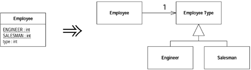

### 동기

* 객체의 존속 기간동안 타입 코드가 바뀐다거나 하는 이유로 Replace Type Code with Subclasses 를 사용할 수 없을 때 사용한다.
* 스테이트와 스트레티지는 리펙토링 방법이 같기 때문에 상황에 맞게 어느것을 사용할지는 결정하도록 하자.
* 만약 Replace Conditional with Polymorphism 으로 알고리즘을 단순화하길 원한다면 스트레티지를 사용하도록 하고,
* 상태를 나타내는 데이터를 다루고 객체를 상태가 바뀌는 것이라고 생각한다면 스테이트 패턴을 사용한다.

### 절차

1. 타입 코드를 자체 캡슐화 한다.
2. 새로운 클래스를 만들고, 타입코드의 목적을 잘 나타내도록 이름을 정한다. (스테이트 객체)
3. 각각의 코드에 대해서 스테이트 객체의 서브 클래스를 추가한다. (한번에 하나씩 추가하지 말고 모든 서브클래스를 추가하는게 더 쉽다)
4. 스테이트 객체에 타입 코드를 리턴하는 추상질의 메소드를 만든다. 스테이트 객체에 서브클래스에서 적절한 타입 코드를 리턴하도록 질의 메소드를 오버라이트 한다.
5. 컴파일 한다.
6. 원래의 클래스에 새로 만든 스테이트 객체를 위한 필드를 만든다.
7. 원래의 클래스에 있는 질의 메소드가 스테이트 객체로 작업을 위임하도록 조정한다.
8. 원래의 클래스에서 타입코드 set 메소드가 적절한 스테이트 객체 서브클래스 인스턴스를 할당하도록 조절한다.
9. 컴파일, 테스트 한다.

### 예제

```java
  class Employee...
    private int _type;
    static final int ENGINEER = 0;
    static final int SALESMAN = 1;
    static final int MANAGER = 2;

    Employee (int type) {
        _type = type;
    }

    int payAmount() {
        switch (_type) {
            case ENGINEER:
               return _monthlySalary;
            case SALESMAN:
               return _monthlySalary + _commission;
            case MANAGER:
               return _monthlySalary + _bonus;
            default:
               throw new RuntimeException("Incorrect Employee");
        }
    }
```

* 먼저 타입 자체를 캡슐화한다.
```java
    Employee (int type) {
    	setType (type);
    }

    int getType() {
        return _type;
    }

    void setType(int arg) {
        _type = arg;
    }

    int payAmount() {
       switch (getType()) {
            case ENGINEER:
               return _monthlySalary;
            case SALESMAN:
               return _monthlySalary + _commission;
            case MANAGER:
               return _monthlySalary + _bonus;
            default:
               throw new RuntimeException("Incorrect Employee");
        }
    }
```

* 스테이트 클래스를 선언한다. 추상클래스로 선언하고 추상 메소드도 추가한다.
```java
  abstract class EmployeeType {
    abstract int getTypeCode();
  }
```

* 각 타입별 클래스를 생성한다.
```java
class Engineer extends EmployeeType {
	int getTypeCode () {
		return Employee.ENGINEER;
	}
}
class Manager extends EmployeeType {
	int getTypeCode () {
		return Employee.MANAGER;
	}
}
class Salesman extends EmployeeType {
	int getTypeCode () {
		return Employee.SALESMAN;
	}
}
```

* 타입별로 서브클래스 인스턴스를 생성하도록 수정.
```java
  class Employee...
    private EmployeeType _type;

    int getType() {
        return _type.getTypeCode();
    }

    void setType(int arg) {
        switch (arg) {
        	case ENGINEER:
           		_type = new Engineer();
               	break;
            case SALESMAN:
           		_type = new Salesman();
               	break;
            case MANAGER:
           		_type = new Manager();
               	break;
            default:
               	throw new IllegalArgumentException("Incorrect Employee Code");
        }
    }
```

* 이제 모든 type에 대한 정보를 EmployeeType 클래스로 옮긴다.
```java
class EmployeeType...
	static EmployeeType newType(int code) {
		switch (code) {
			case ENGINEER:
				return new Engineer();
			case SALESMAN:
				return new Salesman();
			case MANAGER:
				return new Manager();
			default:
				throw new IllegalArgumentException("Incorrect Employee Code");
		}
	}
    static final int ENGINEER = 0;
    static final int SALESMAN = 1;
    static final int MANAGER = 2;
```
```java
class Employee...
	private EmployeeType _type;

    int getType() {
        return _type.getTypeCode();
    }
	void setType(int arg) {
		_type = EmployeeType.newType(arg);
	}
	int payAmount() {
		switch (getType()) {
			case EmployeeType.ENGINEER:
				return _monthlySalary;
			case EmployeeType.SALESMAN:
				return _monthlySalary + _commission;
			case EmployeeType.MANAGER:
				return _monthlySalary + _bonus;
			default:
				throw new RuntimeException("Incorrect Employee");
		}
	}
```

## Replace Subclass with Fields

서브 클래스 중 상수 데이터를 리턴하는 메소드만 존재하는 클래스가 있다면, 그 메소드를 슈퍼 클래스 필드로 바꾸고 서브 클래스를 제거하라.

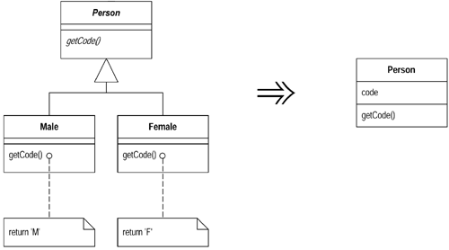

### 동기

* 상수 메소드가 유용하기는 하지만 상수메소드만을 포함하고 있는 서브 클래스는 존재할 가치가 없다. 
* 슈퍼 클래스에 필드를 추가하고 완전히 제거하면 서브 클래스를 사용하면서 생기는 복잡성을 제거할 수 있다.

### 절차

1. 서브 클래스에 Replace Constructor with Factory Method를 사용한다.
2. 서브 클래스를 참조하는 코드는 슈퍼클래스를 참조하도록 수정한다.
3. 각각의 상수 메소드에 대한 필드를 슈퍼 클래스에 선언한다.
4. 이 필드들을 초기화 하기 위해, 슈퍼 클래스에 protected생성자를 만든다.
5. 새로운 슈퍼 클래스 생성자를 호출하도록 서브 클래스 생성자를 수정하거나 추가한다.
6. 컴파일, 테스트를 한다.
7. 슈퍼 클래스에서 각각의 상수 메소드가 필드의 값을 리턴하도록 하고, 서브 클래스에서 상수 메소드를 제거한다.
8. 각각의 메소드를 제거할 때마다 컴파일, 테스트 한다.
9. 서브 클래스의 모든 메소드가 제거되었으면, Inline Method를 사용하여 생성자를 슈퍼 클래스 팩토리 메소드 안으로 넣는다.
10. 컴파일, 테스트 한다.
11. 서브 클래스를 제거한다.
12. 컴파일, 테스트 한다.
13. 불필요한 서브 클래스가 모두 사라질 때까지 각각의 서브 클래스에 대해 Inline Method를 사용하여 생성자를 슈퍼 클래스의 팩토리 메소드 안으로 넣고, 서브 클래스를 제거한다.

### 예제

```java
  abstract class Person {

    abstract boolean isMale();
    abstract char getCode();
  ...

  class Male extends Person {
    boolean isMale() {
        return true;
    }
    char getCode() {
        return 'M';
    }
  }

  class Female extends Person {
    boolean isMale() {
        return false;
    }
    char getCode() {
        return 'F';
    }
  }
```

* 각 서브 클래스에 대한 팩토리 메소드가 필요하다.
```java
class Person...
	static Person createMale(){
		return new Male();
	}
	static Person createFemale() {
		return new Female();
	}
```

* 그리고 사용하는 쪽의 코드를 모두 바꾼다.
```java
 Person kent = new Male();
        ->  Person kent = Person.createMale();
```

* 서브 클래스를 참조하는 코드가 더이상 없도록 만들고 ( 클래스를 private로 만들면 오류가 생겨서 쉽게 찾을 수 있다.)
* 각각 상수 메소드에 대한 필드를 슈퍼 클래스에 선언한다.
```java
class Person...
	private final boolean _isMale;
	private final char _code;

	protected Person (boolean isMale, char code) {
		_isMale = isMale;
		_code = code;
	}
```

* 서브 클래스에 새로만든 수퍼 클래스의 생성자를 호출하는 생성자를 추가한다.
```java
class Male...
	Male() {
		super (true, 'M');
	}
class Female...
	Female() {
		super (false, 'F');
	}
class Person...
    // 이 소스는 제거한다.
    //   boolean isMale() {
    //       return _isMale;
    //   }
class Male...
	boolean isMale() {
		return true;
	}
```

* 서브클래스의 메소드를 모두 제거한 후 Person 클래스의 추상화를 해제하고 팩토리 메소드를 아래처럼 수정한다.
```java
class Person
	static Person createMale(){
		return new Person(true, 'M');
	}
```

* 이제 서브클래스를 제거한다.