# 8장 Generalization
[TOC]

## Form Template Method
  한 상속 구조 내의 어떤 두 서브클래스가 유사한 단위 작업을 같은 순서로 실행하는 메서드를 각각 구현하고 있다면, 각 단위 작업을 별도의 메서드로 뽑아내어 두 메서드를 일반화하고 이렇게 일반화된 메서드를 수퍼클래스로 올려 템플릿 메서드로 만든다.

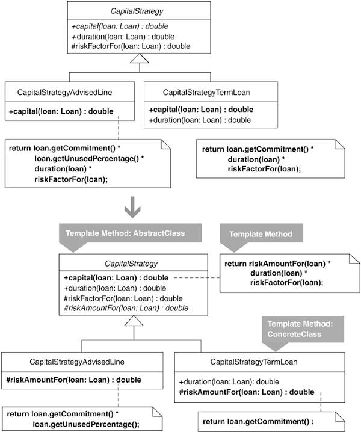

### 동기

* 템플릿 메서드는 '알고리즘에서 불변적인 동작은 한 번만 구현하고 가변적인 동작은 서브클래스에서 구현할 수 있도록 남겨 둔 것'
* 템플릿 메서드의 불변적 동작은 다음을 포함한다.
    * 알고리즘을 구성하는 **메서드 목록과 그 호출 순서**
    * 서브클래스가 꼭 **오버라이드해야 할 추상메서드**
    * 서브클래스가 **오버라이드해도 되는 훅 메서드, 즉 구체 메서드**
* ```java
public abstract class Game...
   public void initialize() {
   //메서드 목록과 그 호출 순서 규정
      deck = createDeck();
      shuffle(deck);
      drawGameBoard();ㅁ
      dealCardsFrom(deck);
   }

   protected abstract Deck createDeck();

   protected void shuffle(Deck deck) {
   //훅 메서드, 서브클래스에서 오버라이드해서 변경할 수도 있다.
      ...shuffle implementation
   }

   protected abstract void drawGameBoard();
   protected abstract void dealCardsFrom(Deck deck);
```
* Template Method 패턴을 구현할 때에 서브클래스에서 오버라이드해야 하는 메서드가 너무 많으면 곤란.
	* 프로그래머가 어떤 메서드를 오버라이드해야 할지 쉽게 알 수 없을 것이다.
* 템플릿 메소드는 팩터리 메서드를 호출하기도 한다. (Introduce Polymorphic Creation with Factory Method)
	* 

### 장점과 단점

```
 + 서브클래스들의 공통 기능을 수퍼클래스로 옮겨, 중복 코드가 제거된다.
 + 알고리즘의 과정이 단순해지고, 쉽게 알아볼수 있다.
 + 서브클래스에서 알고리즘의 구현을 재정의하는 것이 쉬워진다.
 - 서브클래스가 꼭 구현해야 하는 메서드의 개수가 많다면, 설계가 복잡해진다.
```

### 절차

1. 주어진 상속 구조 내의 두 서브클래스 사이에 유사 메서드가 존재하는지 확인
	* 유사 메서드란, 다른 서브클래스에 있는 메서드와 비슷한 작업을 비슷한 순서로 수행하는 메서드를 말한다.
	* 유사 메서드가 확인되면, 양쪽에 Compose Method 리팩터링을 적용한다.
	* 이 과정에서 동일한 시그니처와 내용을 가지는 메서드와 그렇지 않은 메서드가 새로 생성될 수 있다.
	* 특수 메서드로 만든다면 나중에는 결국 이것을 수퍼클래스의 추상 메서드 또는 훅 메서드로 만들어야 한다.
	* 다른 서브클래스가 이 특수 메서드를 상속하거나 오버라이드할 필요가 없다면 처음부터 공통 메서드로 만들어야 한다.
1. 공통 메서드를 Pull Up Method 리팩터링을 통해 수퍼클래스로 올린다.
1. 서브클래스에서 유사 메서드의 내용이 서로 같아지도록, 각 특수 메서드에 Rename Method 리팩터링을 적용한다.
	* Rename Method 리팩터링을 한 번 적용 할때마다, 컴파일 후 테스트한다.
1. 유사 메서드의 시그너처가 동일하지 않다면, Rename Method 리팩터링을 적용해 동일하게 만든다.
1. 유사 메서드를 Pull Up Method 리팩터링을 통해 수퍼클래스로 올린다.
1. 각각의 특수 메서드에 대응하는 추상 메서드를 수퍼클래스에 정의한다.
	* 수퍼클래스로 올린 유사메서드는 템플릿 메서드가 된다.
1. 컴파일 후 테스트한다.


### 예제

* Replace Conditional Logic with Strategy 리펙토링 맨 마지막 부분을 보면, CapitalStrategy 추상 클래스와 서브클래스가 있다.
	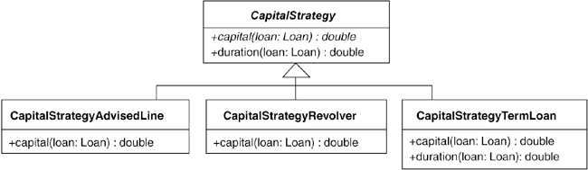
* 세 서브 클래스에는 중복된 코드가 약간 있으며, Form Template Method 리팩터링을 통해 중복을 제거한다.
	* 중복을 최소화 하기 위해 Strategy 패턴과 Template Method 패턴을 결합하는 방법을 자주 사용한다.
* CapitalStrategy 클래스는 Capital을 계산하기 위한 추상 메서드를 선언한다.
	* ```java
	public abstract class CapitalStrategy {
    	public abstract double capital(Loan loan);
    }
    ```
* CapitalStrategy의 서브클래스에서 capital을 계산하는 방식은 서로 비슷하다.
	* ```java
    public class CapitalStrategyAdvisedLine {
        public double capital(Loan loan) {
            return loan.getCommitment() * loan.getUnusedPercentage() *
                                        duration(loan) * riskFactorFor(loan);
        }
    }

    public class CapitalStrategyRevolver {
        public double capital(Loan loan) {
            return (loan.outstandingRiskAmount() * duration(loan) * riskFactorFor(loan))
                        + (loan.unusedRiskAmount() * duration(loan) * unusedRiskFactor(loan));
        }
    }

    public class CapitalStrategyTermLoan {
        public double capital(Loan loan) {
            return loan.getCommitment() * duration(loan) * riskFactorFor(loan);
        }
        protected double duration(Loan loan) {
            return weightedAverageDuration(loan);
        }
        private double weightedAverageDuration(Loan loan) {}
    }
	```
1. CapitalStrategyAdvisedLine과 CapitalStrategyTermLoan이 구현한 capital()이 유사 메서드에 해당한다.
	* 두 capital() 메서드에 Compose Method 리펙터링을 적용해 공통 메서드와 특수 메서드를 뽑아낸다.
	* load.getUnusedPercentage()의 결과값을 곱하는 것만 제외하면 두 메서드는 동일하므로 특수 메서드로 뽑아낼지 아니면 다른코드를 포함하는 메서드로 만들지 결정해야 한다.
	* 저자의 경우 은행에서 다년간 대출 계산기를 프로그래밍한 경험이 이번 결정을 하게 된다.
	* 대출에는 3가지 종류( Term Loan, Revolver, Advised Line )
		* AdvisedLine에 대한 Risk Amount 는 loan.getCommitment() * load.getUnusedPercetage()로 구할 수 있다.
		* riskAdjusted capital 계산하는 표준 공식을 ( Risk Amount ***** Duration ***** Risk Factor )
	* ```java
    public class CapitalStrategyAdvisedLine{
        public double capital(Loan loan) {
            return riskAmountFor(loan) * duration(loan) * riskFactorFor(loan);
        }

        private double riskAmountFor(Loan loan) {
            return loan.getCommitment() * loan.getUnusedPercentage();
        }
    }

    public class CapitalStrategyTermLoan {
        public double capital(Loan loan) {
            return riskAmountFor(loan) * duration(loan) * riskFactorFor(loan);
        }

        private double riskAmountFor(Loan loan) {
            return loan.getCommitment();
        }
    }
    ```
    * 공통 메서드를 수퍼클래스인 CapitalStrategy로 올린다. 이 때 RiskAmountFor() 메서드는 서브클래스마다 그 구현이 다르기 때문에 공통 메서드가 아니다.
    * 이제 각 서브클래스에서 서로 대응하는 특수 메서드들이 동일한 시그너처를 가지도록 만든다.
1. 공통 메서드를 Pull Up Method 리펙터링을 통해 수퍼 클래스로 올린다.
	* 공통 메서드를 수퍼클래스인 CapitalStrategy로 올린다.
	* riskAmountFor메서드는 서브클래스마다 그 구현이 다르기 때문에 공통 메서드가 아니다.
1. 각 서브클래스에서 서로 대응하는 특수 메서드들이 동일한 시그너처를 갖도록 만들 차례다.
	* riskAmountFor(..)메서드의 경우에는 이미 그 조건이 만족한다.
1. 유사 메서드인 capital(...)의 모든 서브클래스에서 동일한 시그니처를 갖도록 만든다.
	* capital(..) 메서드의 경우에도 이미 그 조건이 만족한다.
1. 양쪽 유사 메서드를 Pull Up Method 리팩터링을 통해 수퍼클래스로 올린다.
	* 특수 메서드인 riskAmountFor(...)을 위해 CapitalStrategy에 같은 이름의 추상 메서드를 선언한다.
	* ```java
	public abstract class CapitalStrategy {
		//public abstract double capital(Loan loan);
   		public double capital(Loan loan) {
			return riskAmountFor(loan) * duration(loan) * riskFactorFor(loan);
		}
		public abstract double riskAmountFor(Loan loan);
	}
    ```
	* CapitalStrategyAdvisedLine과 CapitalStrategyTermLoan에 대한 리팩토링이 완료되었다.
	* CapitalStrategyRevolver를 수정을 하는데 1단계에서 riskAmountFor(...)가 만들어지지 않았다면, CapitalStrategyAdvisedLine.capital(..) 내부 코드중 load.UnusedPercentage() 부분만을 unusedPercentageFor(...)라는 이름의 특수 메서드로 뽑았다고 가정하면, 그 메서드는 결국 다음과 같이 훅 메서드가 될것 이다.
	* ```java
    public abstract class CapitalStrategy {
        public double capital(Loan loan) {
            return loan.getCommitment() * unusedPercentageFor(loan) *
                duration(loan) * riskFactorFor(loan);
        }
        public abstract double riskAmountFor(Loan loan);

        protected double unusedPercentageFor(Loan loan) {  // hook method
            return 1.0;
        }
    }
	```
	* CapitalStrategyAdvisedLine처럼 오버라이드하지 않는 한 계산 결과는 아무런 영향을 주지 않는다.
		* ```java
        public class CapitalStrategyAdvisedLine {
            protected double unusedPercentageFor(Loan loan) {
            	return loan.getUnusedPercentage();
            };
		}
        ```
	* CapitalStrategyTermLoan은 riskAmountFor(...)를 구현하는 것이 아니라 수퍼클래스의 capital(...) 메서드 구현을 상속 받기만 하면 된다.
		* ```java
		public class CapitalStrategyTermLoan {
			/*public double capital(Loan loan) {
				return loan.getCommitment() * duration(loan) * riskFactorFor(loan);
  			}*/

            protected double duration(Loan loan) {
              return weightedAverageDuration(loan);
            }
            private double weightedAverageDuration(Loan loan){}
        }
        ```
	* 결과적으로, 이렇게 해도 Template Method 패턴이 되는 것은 똑같다. 그러나 첫 번째 방식에 비해 다음과 같은 단점이 있다.
		* risk-adjusted Capital을 계산하는 표준공식( Risk Amount ***** Duration ***** Risk Factor )이 명확히 드러나지 않는다.
		* CapitalStrategyTermLoan과 CapitalStrategyRevolver에게는 상속 받는 훅 메서드가 전혀 쓸모없다. CapitalStrategy의 서브클래스중 3분의 2가 그런 상황이 된다.
	* 첫 번째 방식으로 돌아와서, CapitalStrategyRevolver까지 수정해 리팩터링을 마무리하자. CapitalStrategyRevolver의 Capital()은 다음과 같다.
	* ```java
    public class CapitalStrategyRevolver {
        public double capital(Loan loan) {
            return (loan.outstandingRiskAmount() * duration(loan) * riskFactorFor(loan))
            			+ (loan.unusedRiskAmount() * duration(loan) * unusedRiskFactor(loan));
        }
    }
    ```
	* 절반은 Risk Amount ***** Duration ***** Risk Factor라는 표준공식과 비슷하고, 절반도 비슷하다.
	* 따라서 수퍼클래스가 제공하는 템플릿 메서드를 그대로 사용하면서도 원하는 계산을 할 수 있도록 다음과 같이 리팩토링할 수 있다.
	* ```java
    public class CapitalStrategyRevolver {
        public double capital(Loan loan) {
            return super.capital(loan) + (loan.unusedRiskAmount() * duration(loan) * unusedRiskFactor(loan));
        }

        protected double riskAmountFor(Loan loan) {
            return loan.outstandingRiskAmount();
        }
    }
    ```
1. Form Template Method 리팩터링을 모두 완료했다.
	* 미묘한 중복이 사라졌으며, 코드를 보고 계산 공식을 알아보기가 쉬워졌다.
	* 보통은 공통의 계산 방식을 따르다가 Revolver의 경우에만 Unused Capital을 추가적으로 고려해 준다는 사실이 잘 드러나기 때문이다.
	* Extract Method리팩토링 적용하면 아래와 같은 코드가 될 것이고, 더 명확해 질 것이다.
	* ```java
    public class CapitalStrategyRevolver {
        public double capital(Loan loan) {
        	return super.capital(loan) + unusedCapital(loan);
        }
        public double unusedCapital(Loan loan) {
        	return loan.unusedRiskAmount() * duration(loan) * unusedRiskFactor(loan);
        }
    }
    ```

## Extract Composite
한 상속 구조 내의 서브 클래스가 동일한 컴포짓(Composite) 기능을 각자 구현하고 있다면, 컴포짓 기능을 슈퍼 클래스로 옮겨 구현한다.

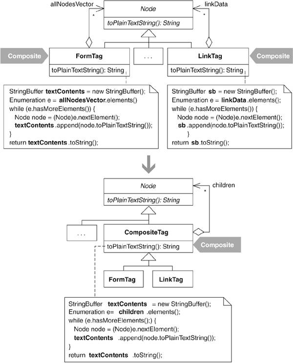

### 동기
- Martin Fowler said,
 - Extract Superclass 리팩터링과 같이 몇몇 클래스들이 비슷한 기능을 각자 구현하고 있을때, 공통의 수퍼클래스로 옮기는 것.
 - Extract Composite 리팩터링은 컴포짓 기능에 대한 것.
- 자식 객체 처리 로직을 Extract Composite 리팩터링으로 수퍼클래스로 올리고, 그 후에 중복된 로직이 남아 있다면 Extract Superclass 리팩터링을 사용한다.
- Composite 패턴으로 리팩터링 할 조건
 - 상속 구조 내의 서브 클래스들이 자식 객체를 저장하고,
 - 그 자식 객체들의 기능에 접근하기 위한 메서드를 각자 구현하고,
 - 자식 객체의 타입이 부모 객체와 동일한 상속 구조 내의 타입이라면,

### 장점
```
+ 중복된 자식 객체 저장/처리 로직을 제거한다.
+ 자식 객체 처리 로직을 상속 받아 그대로 사용할 수 있음이 명확히 드러난다.
```
### 절차
- Extract Superclass 리팩터링의 절차를 기반으로 한다.
1. 리팩터링 후에 컴포짓이 될 클래스를 만든다.
    - 자식 객체의 종류를 이름에 표시하는 것이 좋다.(예: CompositeTag?)
    - 컴파일
1. 자식 객체 컨테이너를 1.의 컴포짓 클래스의 서브클래스로 만든다.
    - 컨테이너는 상속 구조에서 중복된 자식 객체 처리 로직을 포함한다.
    - 컴파일
1. 공통 메서드를 찾아서 공통된 부분을 컴포짓 클래스로 옮긴다.
    1. 완전/부분 공통 메소드를 찾는다.
    1. 공통의 부분을 컴포짓 클래스로 옮긴다.
		1. 완전 중복 메소드는 Pull Up Field / Pull Up Method 리택터링을 사용한다.
		1. 부분 중복 메소드는 Substitute Algorithm 리팩터링으로 동일한 메소드로 만들어 완전 중복 메소드로 만든다.
		1. Extract Method 리팩터링으로 공통의 부분을 별도의 메소드로 만들고 Pull Up Method 리팩터링으로 컴포짓 클래스로 옮긴다.
			- 동일한 단계를 따르지만 각 단계가 조금씩 다르다면, Form Template Method 리팩터링도 사용 가능하다.
	1. 각 단계마다 컴파일과 테스트를 한다.
1. 다른 중복된 객체 처리 메소드를 찾아서 3.의 단계를 반복한다.
1. 클라이언트 코드에서 자식 객체 컨테이너를 사용할 때 일률적으로 컴포짓 클래스 타입만을 통하도록 만든다.
	- 컴파일 후 테스트 한다.

### 예제
**HTML 파서**

- HTML 문서를 읽어가면서 태그나 문자열을 만나면 그에 대응하는 HTML 요소 객체를 생성한다.
	```html
   <HTML>
   <BODY>
      Hello, and welcome to my Web page! I work for
      <A HREF="http://industriallogic.com">
         
      </A>
   </BODY>
</HTML>
```
- 위의 HTML에 대해서 다음과 같은 타입의 객체를 생성한다.
    1. Tag 객체 : <body> 등의 태그
    1. StringNode? 객체 : 'Hello, and welcome ...'과 같은 문자열
    1. LinkTag? 객체 : ```<A HERF="...">```
- 파서가 링크 태그 내의 이미지 태그를 만나면 ImageTag 객체를 생성하고 그것을 LinkTag 객체의 자식 객체로 만든다.
- 자식 객체를 저장하고 처리하는 기능을 각자 구현하고 있었다.
	```java
public class LinkTag extends Tag...
    private Vector nodeVector;

    public String toPlainTextString()  {
      StringBuffer sb = new StringBuffer();
      Node node;
      for (Enumeration e=linkData();e.hasMoreElements();) {
         node = (Node)e.nextElement();
         sb.append(node.toPlainTextString());
      }
      return sb.toString();
   }
.
.
.
public class FormTag extends Tag...
    protected Vector allNodesVector;

    public String toPlainTextString()  {
      StringBuffer stringRepresentation = new StringBuffer();
      Node node;
      for (Enumeration e=getAllNodesVector().elements();e.hasMoreElements();) {
         node = (Node)e.nextElement();
         stringRepresentation.append(node.toPlainTextString());
      }
      return stringRepresentation.toString();
   }
```
- 공통점
    - FormTag와 LinkTag 객체는 모두 자식 노드를 저장할 Vector 필드를 갖는다.
    - toPlainTextString() 매소드에서 자식 객체를 순회하는 동일한 로직을 각자 구현하고 잇다.

**Extract Complsite 리팩터링**
1. 자식 컨테이너 클래스의 수퍼클래스가 될 수퍼 클래스를 만든다.
	```java
   public abstract class CompositeTag extends Tag {
       public CompositeTag(
          int tagBegin,
          int tagEnd,
          String tagContents,
          String tagLine) {
          super(tagBegin, tagEnd, tagContents, tagLine);
       }
}
```
1. 자식 컨테이너 클래스들을 CompositeTag의 서브 클래스가 되도록 만든다.
	```java
    public class LinkTag extends CompositeTag
    public class FormTag extends CompositeTag
```
1. 모든 자식 컨테이너를 조사해서 완전 중복 메소드를 찾는다.
	- LinkTag의 객체를 저장하는 Vector 필드를 수퍼 클래스로 옮긴다.
		```java
    public abstract class CompositeTag extends Tag...
    protected Vector nodeVector// pulled-up field

	public class LinkTag extends CompositeTag...
    //private Vector nodeVector;
```
	- FormTag의 Vactor 필드의 이름을 수정한다.
		```java
    public class FormTag extends CompositeTag...
        //protected Vector allNodesVector;
        protected Vector nodeVector;
    ...
```
    - 필드를 제거하여, 수퍼클래스에서 상속 받아 사용한다.
        ```java
        public class FormTag extends CompositeTag...
        //protected Vector nodeVector;
    ```
    - 필드의 이름을 의미 있게 수정한다.
        ```java
        public abstract class CompositeTag extends Tag...
            //protected Vector nodeVector;
            protected Vector children;
    ```
    - toPlainTextString() 메소드는 완전히 동일하지 않기 때문에 Pull Up Method를 할 수 없다.
        ```java
        public class LinkTag extends CompositeTag
           public Enumeration linkData() {
              return children.elements();
           }

           public String toPlainTextString()...
              for (  Enumeration e=linkData()  ;e.hasMoreElements();)
                 ...
        .
        .
        public class FormTag extends CompositeTag...
           public Vector getAllNodesVector() {
              return children;
           }

           public String toPlainTextString()...
              for (  Enumeration e=getAllNodesVector().elements()  ;e.hasMoreElements();)
                 ...
    ```
    - 컴포짓 클래스에 열거자를 리턴하는 메소드를 만들어 해결한다.
        ```java
        public abstract class CompositeTag extends Tag...
           public Enumeration children() {
              return children.elements();
    ```
1. 나머지 중복 메소드에 대해서도 단계 3을 적용하여 CompositeTag로 옮긴다.
	- toHTML() 매소드는 해당 객체에 대응하는 HTML 문자열을 생성하는데, LinkTag와 FormTag에서 각각 구현하고 있다.
	```java
    //LinkTag
    public class LinkTag extends CompositeTag
        public String toHTML()  {
          StringBuffer sb = new StringBuffer();
          putLinkStartTagInto(sb);

          Node node;
          for (Enumeration e = children();e.hasMoreElements();) {
             node = (Node)e.nextElement();
             sb.append(node.toHTML());
          }
          sb.append("</A>");
          return sb.toString();
       }

       public void putLinkStartTagInto(StringBuffer sb) {
          sb.append("<A ");
          String key,value;

          int i = 0;
          for (Enumeration e = parsed.keys();e.hasMoreElements();) {
             key = (String)e.nextElement();
             i++;
             if (key!=TAGNAME) {
                value = getParameter(key);
                sb.append(key+"=\""+value+"\"");
                if (i<parsed.size()-1) sb.append(" ");
             }
          }
          sb.append(">");
       }

    //FormTag
    public class FormTag extends CompositeTag...
        public String toHTML() {
          StringBuffer rawBuffer = new StringBuffer();
          Node node,prevNode=null;

          rawBuffer.append("<FORM METHOD=\""+formMethod+"\" ACTION=\""+formURL+"\"");
          if (formName!=null && formName.length()>0)
             rawBuffer.append(" NAME=\""+formName+"\"");

          Enumeration e = children.elements();
          node = (Node)e.nextElement();
          Tag tag = (Tag)node;
          Hashtable table = tag.getParsed();
          String key,value;

          for (Enumeration en = table.keys();en.hasMoreElements();) {
             key=(String)en.nextElement();
             if (!(key.equals("METHOD")
                || key.equals("ACTION")
                || key.equals("NAME")
                || key.equals(Tag.TAGNAME))) {
                value = (String)table.get(key);
                rawBuffer.append(" "+key+"="+"\""+value+"\"");
             }
          }

          rawBuffer.append(">");
          rawBuffer.append(lineSeparator);
          for (;e.hasMoreElements();) {
             node = (Node)e.nextElement();
             if (prevNode!=null) {
                if (prevNode.elementEnd()>node.elementBegin()) {
                   // It's a new line
                   rawBuffer.append(lineSeparator);
                }
             }
             rawBuffer.append(node.toHTML());
             prevNode=node;
          }
          return rawBuffer.toString();
       }
```
	- toHTML()은 부분 중복 메소드이므로, Subsititute Algorithm 리팩터링으로 완전 중복으로 만들수 있는지 살펴봐야 한다.
	```
 - 시작 태그 및 그 속성에 대한 처리
 - 자식 태그에 대한 처리
 - 종료 태그에 대한 처리
```
        - 각 과정에 해당하는 공통 메소드를 CompositeTag에 만들고, 두 서브 클래스에서는 그 메소드를 사용하여, toHTML()을 구현한다.
        ```java
         public abstract class CompositeTag extends Tag...
            public void putStartTagInto(StringBuffer sb) {
              sb.append("<" + getTagName() + " ");
              String key,value;
              int i = 0;
              for (Enumeration e = parsed.keys();e.hasMoreElements();) {
                 key = (String)e.nextElement();
                 i++;
                 if (key!=TAGNAME) {
                    value = getParameter(key);
                    sb.append(key+"=\""+value+"\"");
                    if (i<parsed.size()) sb.append(" ");
                 }
              }
              sb.append(">");
           }
.
.
        public class LinkTag extends CompositeTag...
           public String toHTML() {
              StringBuffer sb = new StringBuffer();
               putStartTagInto(sb)
              ...
.
.
        public class FormTag extends CompositeTag
           public String toHTML() {
              StringBuffer rawBuffer = new StringBuffer();
               putStartTagInto(rawBuffer)
              ...
```
	- 자식 태그와 종료 태그에 대해서도 같은 작업을 반복한다.
	```java
       public abstract class CompositeTag extends Tag...
           public String toHTML() {
               StringBuffer htmlContents = new StringBuffer();
               putStartTagInto(htmlContents);
               putChildrenTagsInto(htmlContents);
               putEndTagInto(htmlContents);
               return htmlContents.toString();
           }
```
1. 자식 컨테이너 클래스에 대한 클라이언트 코드가 CompositeTag 타입만을 사용하도록 할 수 있는지 확인한다.


## Replace One/Many Distinctions with Composite

```
어떤 클래스에서 주어진 객체를 처리할 때, 
그 객체의 개수에 따라 서로 다른 로직을 사용하고 있다면, 
컴포짓을 사용해 객체의 개수에 상관없이 한 로직으로 처리할 수 있도록 만든다.
```

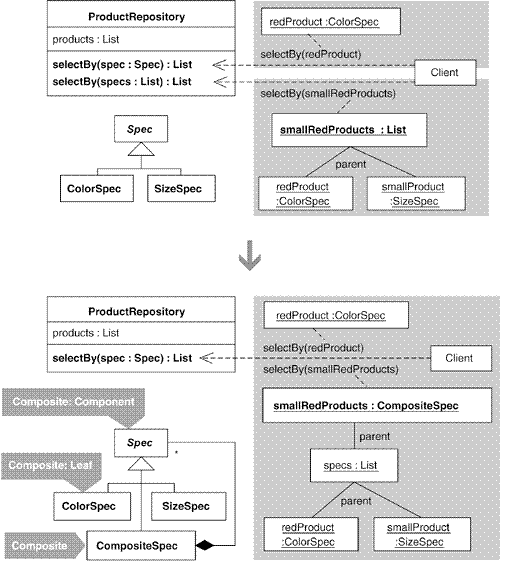

* 어떤 클래스 : ProductRepository
* 주어진 객체 : Spec
* 객체의 개수에 따라 : 단수 / 복수
* 서로 다른 로직 : selectBy(Spec:Spec) / selectBy (Spec:List)

### 동기

* 코드가 중복된다.
	* 처리할 객체가 하나 인 경우와 여러 개인 경우의 처리 로직은 기본 적으로 동일한 경우가 많음.
* 클라이언트 코드가 복잡해진다.
	* 처리할 객체 마다 시그니처가 다른 메서드들이 존재하게 됨. 이에 따라 클라이언트도 호출을 다르게 해야 하므로 복잡해짐.
	* 클라이언트에서는 객체의 수에 상관 없이 동일한 방법으로 처리하는 것을 선호.
* 처리 결과를 취합하기 위해서 추가적인 처리가 필요하다.
	* 조건이 여러개인 경우 조건에 따른 결과를 합쳐야 한다.
	* 아래의 코드는 조건이 여러개 인 경우의 처리 예시 이다. (빨간색이면서 가격이 5달러 이하인 상품 조회)
	```java
    List redProductsUnderFiveDollars = new ArrayList();
    redProductsUnderFiveDollars.add(new ColorSpec(Color.red));
    redProductsUnderFiveDollars.add(new BelowPriceSpec(5.00));
    
    List foundRedProductsUnderFiveDollars = 
    	productRepository.selectBy(redProductsUnderFiveDollars);
    
    ```
    * 여기서 추가로 파란색이면서 가격이 10달러 이하인 상품을 찾으려면 두 조건에 대해 각각 검색한 후 그 결과를 합쳐야 한다.
    ```java
    List foundRedProductsUnderFiveDollars = 
    	productRepository.selectBy(redProductsUnderFiveDollars);
        
    List foundBlueProductsUnderFiveDollars = 
    	productRepository.selectBy(blueProductsUnderFiveDollars);
        
    List foundProducts = new ArrayList();
    foundProducts.addAll(foundRedProductsUnderFiveDollars);
    foundProducts.addAll(foundBludProductsUnderFiveDollars);
    ```
	* Composite 패턴을 사용하는 경우의 이점.
		* 코드 중복 제거
		* 클라이언트 코드가 간결해짐.
		* 클라이언트에서는 조건에 따른 결과 합산과 같은 성가신 작업을 할 필요 없음.

* 주의 사항
	* 클라이언트의 입장이 별로 중요하지 않고, 코드 중복을 최소화 할 수 있다면 굳이 Composite 패턴을 사용할 필요 없다.
	* Composite 패턴의 단점 가운데 하나는 타입 안전성 문제
		* 클라이언트가 객체를 추가하려 할 때마다 객체를 확인하는 절차가 포함되어야 한다.

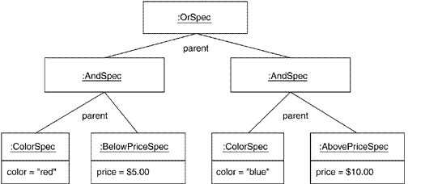

### 장점과 단점

```
+ 중복 코드 제거
+ 객체 하나를 처리하는 방법과 여러개를 처리하는 방법이 하나로 통일
+ 여러 개의 객체를 처리하기 위해 필요한 추가적인 기능 부여 가능 (ex - OR 조건 표현)
- 타입 안전성을 위해 런타임 타입 검사가 필요할 수 있다.
```

### 절차

* 용어 정의
	* 단수 객체 메서드 : 하나의 객체를 처리하는 메서드
	* 복수 객체 메서드 : 여러 개의 객체를 처리하는 메서드

1. 복수 객체 메서드는 컬렉션을 파라미터로 받음.
2. 복수 객체 메서드 내부에서 컬렉션을 다루는 코드에 Extract Method 리팩터링 적용.
3. 단수/복수 메서드 간의 차이가 존재한다면 리팩터링을 통해 제거.
4. 컴포짓 객체를 파라미터로 하여 단수 객체 메서드를 호출하는 한줄의 코드만을 포함하도록 복수 객체 메서드를 수정.
5. 복수 객체 메서드를 Inline Method 리펙터링을 통해 인라인화.
6. 컴포짓 클래스에 타입 안전성 체크를 위해 Encapsulate Collection 리팩터링을 적용.

### 예제

* 내용 요약 : ProductRepository 객체로부터 원하는 Product 객체의 목록을 얻기 위해 Spec 객체를 사용하는 코드.
	* ProductRepository : Product의 리스트를 가짐.
	* Product : 상품 객체
	* Spec : 상품 검색을 위한 조건을 명시.
* 예제는 TestCase를 사용하여 진행.

==원본 코드 테스트 및 리팩토링==

1. 먼저 테스트를 위한 임의의 상품 정보를 셋팅한다.
	* ProductRepository에 Product 추가
```java
public class ProductRepositoryTest extends TestCase ...
	private ProductRepository repository;
    
    private Product fireTruck = 
    	new Product("f1234", "Fire Truck", Color.red, 8.95f, ProductSize.MEDIUM);
        
    private Product barbieClassic = 
    	new Product("b7654", "Barbie Classic", Color.yellow, 15.95f, ProductSize.SMALL);
        
    private Product frisbee = 
    	new Product("f4321", "Frisbee", Color.pink, 9.99f, ProductSize.LARGE);
        
    private Product baseball = 
    	new Product("b2343", "Baseball", Color.white, 8.95f, ProductSize.NOT_APPLICABLE);
        
    private Product toyConvertible = 
    	new Product("p1112", "Toy Porsche Convertible", Color.red, 230.00f, ProductSize.NOT_APPLICABLE);
        
    protected void setUp() {
    	repository = new ProductRepository();
        repository.add(fireTruck);
        repository.add(barbieClassic);
        repository.add(frisbee);
        repository.add(baseball);
        repository.add(toyConvertible);
    }
```
2. 리팩터링 전 코드로 특정 색상의 Product를 찾는 테스트를 수행한다.
```java
public class ProductRepositoryTest extends TestCase ...
	public void testFindByColor() {
    	List foundProducts = repository.selectBy(new ColorSpec(Color.red));
        assertEquals("found 2 red products", 2, foundProducts.size());
        assertTrue("found fireTruck", foundProducts.contains(fireTruck));
        assertTrue("found Toy Porsche Convertible", foundProducts.contains(toyConvertible));
    }
```
3. selectBy의 구현 내용
```java
public class ProductRepository...
	private List products = new ArrayList();
    
    public Iterator iterator() {
    	return products.iterator();
    }
    
    public List selectBy(Spec spec) {
    	List foundProducts = new ArrayList();
        Iterator products = iterator();
        while(products.hasNext()) {
        	Product product = (Product)products.next();
            if(spec.isSatisfiedBy(product))
            	foundProducts.add(product);
        }
        return foundProducts;
    }
```
4. 색상 뿐만이 아닌 복수의 조건을 처리하는 경우 (List 객체 전달)
```java
public class ProductRepositoryTest extends TestCase ...
	public void testFindByColorSizeAndBelowPrice() {
    	List specs = new ArrayList();
        specs.add(new ColorSpec(Color.red));
        specs.add(new SizeSpec(ProductSize.SMALL));
        specs.add(new BelowPriceSpec(10.00));
    	List foundProducts = repository.selectBy(specs);
        assertEquals("small red products below $10.00", 0, foundProducts.size());
    }
```
5. List를 사용하는 selectBy의 구현 내용.
```java
public class ProductRepository...
	public List selectBy(List specs) {
    	List foundProducts = new ArrayList();
        Iterator products = iterator();
        while(products.hasNext()) {
        	Product product = (Product)products.next();
            Iterator specifications = specs.iterator();
            boolean satisfiesAllSpecs = true;
            while(specifications.hasNext()) {
            	Spec productSpec = ((Spec)specifications.next());
                satisfiesAllSpecs &= productSpec.isSatisfiedBy(product);
            }
            if(satisfiesAllSpecs)
            	foundProducts.add(product);
        }
        return foundProducts;
    }
```
* 코드를 보면 중복 코드가 다수 존재.
* Composite 패턴으로 중복을 제거할 수 있지만, 그렇지 않고도 중복은 제거 가능.
```java
public class productRepository ...
	public List selectBy(Spec spec) {
    	Spec[] specs = { specs };
        return selectBy(Arrays.asList(specs));
    }
    
    public List selectBy(List specs) ...
```
* 주어진 상황에 따라 Composite 패턴을 사용할지 말지 결정.
* 현재 selectBy 메서드로는 AND, OR, NOT의 혼합 사용이 불가능.
* 클라이언트 쪽에서는 조건의 종류에 관계없이 하나의 메서드만 사용하는 것이 좋음.
* 그러므로 예제에서는 Composite 패턴으로 리팩터링 하는 것이 더 좋은 경우에 해당.

==Composite 패턴 적용==

1. 복수 객체 메서드로 전달되는 List 객체 보관하는 별도의 클래스 생성.
```java
public class CompositeSpec {
	private List specs;
    
    public CompositeSpec {
    	this.specs = specs;
    }
    
    public List getSpecs() {
    	return specs;
    }
}
```
2. selectBy 메서드 내에 List 객체 사용부분을 새로 만든 클래스로 대체.
```java
public class ProductRepository...
	public List selectBy(List specs) {
    	CompositeSpec spec = new CompositeSpec(specs);
    	List foundProducts = new ArrayList();
        Iterator products = iterator();
        while(products.hasNext()) {
        	Product product = (Product)products.next();
            Iterator specifications = spec.getSpecs().iterator();
            boolean satisfiesAllSpecs = true;
            while(specifications.hasNext()) {
            	Spec productSpec = ((Spec)specifications.next());
                satisfiesAllSpecs &= productSpec.isSatisfiedBy(product);
            }
            if(satisfiesAllSpecs)
            	foundProducts.add(product);
        }
        return foundProducts;
    }
```
3. 정상 동작 테스트
4. selectBy 메서드 내의 Spec 객체 처리 부분 Extract Method 수행.
```java
public class ProductRepository...
	public List selectBy(List specs) {
    	CompositeSpec spec = new CompositeSpec(specs);
    	List foundProducts = new ArrayList();
        Iterator products = iterator();
        while(products.hasNext()) {
        	Product product = (Product)products.next();
            if(isSatisfiedBy(spec, product))
            	foundProducts.add(product);
        }
        return foundProducts;
    }
    
    public boolean isSatisfiedBy(CompositeSpec spec, Product product) {
    	Iterator specifications = spec.getSpecs().iterator();
        boolean satisfiesAllSpecs = true;
        while(specifications.hasNext()) {
            Spec productSpec = ((Spec)specifications.next());
            satisfiesAllSpecs &= productSpec.isSatisfiedBy(product);
        }
        return satisfiesAllSpecs;
    }
```
5. 정상 동작 테스트
6. isSatisfiedBy 메서드를 Move Method 리팩터링을 통해 CompositeSpec 내부로 이동.
```java
public class ProductRepository...
	public List selectBy(List specs) {
    	CompositeSpec spec = new CompositeSpec(specs);
    	List foundProducts = new ArrayList();
        Iterator products = iterator();
        while(products.hasNext()) {
        	Product product = (Product)products.next();
            if(spec.isSatisfiedBy(spec, product))
            	foundProducts.add(product);
        }
        return foundProducts;
    }
public class CompositeSpec...
    public boolean isSatisfiedBy(Product product) {
    	Iterator specifications = getSpecs().iterator();
        boolean satisfiesAllSpecs = true;
        while(specifications.hasNext()) {
            Spec productSpec = ((Spec)specifications.next());
            satisfiesAllSpecs &= productSpec.isSatisfiedBy(product);
        }
        return satisfiesAllSpecs;
    }
```
7. 정상 동작 테스트
8. 복수 객체 메서드에서 CompositeSpec 객체를 생성한다는 점을 제외하면 이제 단수, 복수 객체 메서드의 구현이 동일해졌다.
9. 단수, 복수 객체 메서드 간 중복 코드 제거
```java
public class ProductRepository ...
	public List selectBy(Spec spec)...
    
    public List selectBy(List specs) {
    	return selectBy(new CompositeSpec(specs));
    }
```
10. CompositeSpec이 현재 Spec을 상속받고 있지 않기 때문에 위 코드에서는 에러가 발생
11. CompositeSpec 클래스를 Spec의 서브 클래스로 만든다.
```java
public class CompositeSpec extends Spec...
```
12. 정상 동작 테스트
13. selectBy(List specs) 메서드의 코드가 한 줄이므로 Inline Method 리팩터링을 적용해 인라인화.
```java
public class ProductRepositoryTest ...
	public void testFindByColorSizeAndBelowPrice() {
    	List specs = new ArrayList();
        specs.add(new ColorSpec(Color.red));
        specs.add(new SizeSpec(ProductSize.SMALL));
        specs.add(new BelowPriceSpec(10.00));
        /*List foundProducts = repository.selectBy(specs);*/
        List foundProducts = repository.selectBy(new CompositeSpec(specs));
        ...
    }
```
* Or 또는 Not 조건에 대한 구현에 대한 설명은 Replace Implicit Language with Interpreter 리팩터링으로 미룬다.

==타입 안정성 확보==
1. CompositeSpec 클래스 내부의 컬렉션 필드에 Encapsulate Collection 리팩터링 적용.
```java
public class CompositeSpec extends Spec ...
	private List specs;
    
    public void add(Spec spec) {
    	specs.add(spec);
    }
```
2. specs 필드를 빈 List 객체로 초기화
```java
public class CompositeSpec extends Spec ...
	private List specs = new ArrayList();
```
3. 조건 추가 시 CompositeSpec의 add 메서드를 사용하도록 수정 (* Generics 사용으로 대체해도 될 듯)
```java
public class ProductRepositoryTest ...
	public void testFindByColorSizeAndBelowPrice() {
    	/*List specs = new ArrayList();*/
        CompositeSpec specs = new CompositeSpec();
        specs.add(new ColorSpec(Color.red));
        specs.add(new SizeSpec(ProductSize.SMALL));
        specs.add(new BelowPriceSpec(10.00));
        /*List foundProducts = repository.selectBy(new CompositeSpec(specs));*/
        List foundProducts = repository.selectBy(specs);
        
        ...
    }
```
4. 여기까지의 과정을 마친 후에는 CompositeSpec의 생성자를 호출하는 코드가 없으므로 제거.
```java
public class CompositeSpec extends Spec ...
	/*public CompositeSpec(List specs) {
    	this.specs = specs;
    }*/
```
5. CompositeSpec의 getSpecs(...)가 수정이 불가능한 컬렉션을 리턴하도록 수정.
```java
public class CompositeSpec extends Spec ...
	private List specs = new ArrayList();
    
    public List getSpecs() {
    	return Collections.unmodifiableList(specs);
    }
```
6. 정상 동작 테스트 후 리팩터링 완료.

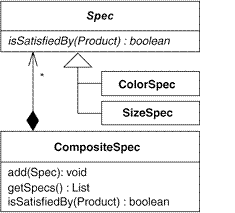


## Replace Hard-Coded Notifications with Observer

어떤 상속 구조 내의 서브클래스들이 자신과 관련된 클래스에 통보하는 기능을 하드코딩으로 각자 구현하고 있다면,
Observer 인터페이스를 통해 그 수퍼클래스가 임의의 다른 클래스에 통보할 수 있도록 일반적인 통보 기능을 만들고 서브클래스는 제거한다.


### 동기

* 통보 관계가 하나라면 상관이 없지만 시스템이 복잡해져서 여러 객체에 통보해야 한다면 설계를 바꿀 필요가 있다.
* 이 리펙터링의 동기를 이해하려면 먼저 필요하지 않은 상황을 알아야 한다.
	* 하드코딩으로 충분한 상황이라면 리팩토링 후 오히려 복잡한 구조가 될 수 있으니 불필요하다.
	* 통보 받은 객체가 또 다른 객체에 통보하고 또 통보하고 하는 식으로 전달하는 통보 체인이라면 설계가 복잡해지니 불필요하다.
* Observer 패턴은 구현하기 어렵지 않고 자주 사용되는 패턴이지만 적절하지 않은 경우를 잘 숙지해서 불필요한 사용을 하지 않도록 하자.

### 장점과 단점

```
+ 통보 주제 클래스와 관찰자 클래스 사이의 결합을 느슨하게 한다.
+ 관찰자가 여럿인 경우도 지원한다.
- 하드코딩으로 구현된 통보 기능으로도 충분한 상황에서 적용한다면 설계만 복잡해진다.
- 통보 체인이 불가피한 상황에서는 설계가 더 복잡해진다.
- 관찰자 객체에 대한 참조를 제때 삭제하지 않으면 메모리 누수가 발생한다.
```

### 절차

1. 통보자가 수령자를 대신해 어떤 기능을 수행하고 있다면, Move Method 리팩터링을 통해 그 기능을 해당 수령자로 옮긴다.
	* 작업이 끝나면 통보자에는 순수한 통보 메서드만 남는다.
	* 모든 통보자에 대해 이 과정을 반복한다.
	* 컴파일 후 테스트.
2. 수령자의 메서드 중 통보자가 호출하는 메서드에 Extract Interface 리펙터링을 적용해 관찰자 인터페이스를 만든다.
	* 다른 수령자에게 이 인터페이스에 없는 메서드가 있다면, 그 메서드도 인터페이스에 추가한다. 모든 수령자에 이 과정을 반복한다.
	* 컴파일 후 테스트.
3. 모든 수령자가 앞서 만든 관찰자 인터페이스를 구현하도록 수정한다. 그리고 모든 통보자가 관찰자 인터페이스를 통해서 수령자에게 통보하도록 수정한다.
	* 이제 모든 수령자가 관찰자로 변경되었다.
	* 컴파일 후 테스트.

4. 통보자 하나를 고른 후, 통보 메서드에 Pull Up Method 리펙터링을 적용한다.
	* 관찰자 인터페이스 타입의 필드를 선언하고 참조를 등록하는 코드도 함께 옮긴다. 이 통보자의 수퍼클래스는 이제 통보주체가 된다.
	* 모든 통보자에 대해 이 과정을 반복한다.
	* 컴파일
5. 이제 통보자 대신에 앞에서 만든 통보 주체에 모든 관찰자를 등록하고 그와 통신하도록 수정한다. 그리고 통보자들은 제거한다.
	* 컴파일 후 테스트.
6. 통보 주체가 한 개의 관찰자에 대한 참조 대신에 관찰자 객체의 컬렉션을 가지도록 리펙터링 한다.
	* 이렇게 하고 나면 관찰자가 통보 주체에 자신을 등록하는 방식도 바꿔야 하는데, 관찰자 객체 하나를 추가하는 메서드로 바꾸면 된다.
	* 마지막으로 컬렉션을 순회 하며 컬렉션 내에 있는 모든 관찰자에게 통보하도록 통보 메서드를 고친다.
	* 컴파일 후 테스트.

### 예제

* JUnit 의 2.x 버전에서는 하드코드로 각각 TestRunner와 TestResult가 통보자와 수신자로 하드코딩되어 있었다.

* 하지만 JUnit 사용자들이 여러 객체가 한 TestResult 객체를 동시에 관찰할 수 있게 해달라고 요구하면서 리펙토링을 하게 되었다.
	* ```java
    class UITestResult extends TestResult {
        private TestRunner fRunner;
        UITestResult(TestRunner runner) {
            fRunner= runner;
        }
        public synchronized void addFailure(Test test, Throwable t) {
            super.addFailure(test, t);
            fRunner.addFailure(this, test, t);  // notification to TestRunner
        }
        //...
    }
    ```
    * ```java
    package ui;
    public class TestRunner extends Frame {
        // TestRunner for AWT
        private TestResult fTestResult;
        // ...
        protected TestResult createTestResult() {
            return new UITestResult(this);   // hard-coded to UITestResult
        }

        synchronized public void runSuite() {
            // ...
            fTestResult = createTestResult();
            testSuite.run(fTestResult);
        }
        public void addFailure(TestResult result, Test test, Throwable t) {
            //...
            // display the failure in a graphical AWT window
        }
    }
    ```
* TextTestResult 는 테스트 결과를 TestRunner에 통보하는 대신 콘솔로 메세지를 직접 출력하도록 되어 있다.
	* ```java
    public class TextTestResult extends TestResult {
        public synchronized void addError(Test test, Throwable t) {
            super.addError(test, t);
            System.out.println("E");
        }
        public synchronized void addFailure(Test test, Throwable t) {
            super.addFailure(test, t);
            System.out.print("F");
        }
    }
	```
1. 모든 통보자에 순수한 통보 기능만을 남기고 다른 기능은 제거한다. TextTestResult 코드는 통보 기능외에 다른 기능이 있으니 제거하도록 한다.
	* Move Method 리펙터링 적용.
	* ```java
    package textui;
    public class TextTestResult extends TestResult{

       private TestRunner fRunner;
       TextTestResult(  TestRunner runner  ) {
          fRunner= runner;
       }

       public synchronized void addError(Test test, Throwable t) {
            super.addError(test, t);
            fRunner.addError(this, test, t);
       }
	}
	```
    * ```java
    package textui;
    public class TestRunner {
        protected TextTestResult createTestResult() {
        	return new TextTestResult(this);
        }

        // moved method
        public void addError(TestResult testResult, Test test, Throwable t) {
        	System.out.println("E");
        }
	}
    ```
	* 이렇게 TextTestResult 객체도 자신과 연관된 TestRunner 객체에 통보하는 방식으로 수정되었다.
2. 이제 관찰자 인터페이스를 만든다. Extract Interface 리펙터링 적용
	* TextTestResult에서 호출하는 메서드들을 뽑아서 인터페이스로 올린다.
	* ```java
    class TextTestResult extends TestResult{
        public synchronized void addError(Test test, Throwable t) {
            super.addError(test, t);
            fRunner.addError(this, test, t);
        }

        public synchronized void addFailure(Test test, Throwable t) {
            super.addFailure(test, t);
            fRunner.addFailure(this, test, t);
        }

        public synchronized void startTest(Test test) {
            super.startTest(test);
            fRunner.startTest(this, test);
        }
    }
	```
	* TestListener 인터페이스를 만든다.
	* ```java
	public interface TestListener {
        public void addError(TestResult testResult, Test test, Throwable t);
        public void addFailure(TestResult testResult, Test test, Throwable t);
        public void startTest(TestResult testResult, Test test);
	}
	public class TestRunner implements TestListener{}
    ```
    * 다른 통보자인 UITestResult가 앞에서 만든 TestListener 인터페이스에 없는 메서드를 호출하고있는지 확인
    * ```java
    class UITestResult extends TestResult {
        public synchronized void endTest(Test test) {
            super.endTest(test);
            fRunner.endTest(this, test);
        }
    }
	```
    * ```java
	public interface TestListener {
    	//...
        public void endTest(TestResult testResult, Test test);
	}
    ```
    * 컴파일을 해보면 실패한다.
    * ```java
    	public class TestRunner implements TestListener {
        	//...
            public void endTest(TestResult testResult, Test test){
            }
        }
    ```
3. 통보자쪽인 TestResult들이 TestListener 인터페이스를 구현하도록 수정한다.
	* ```java
    public class TestRunner extends Frame implements TestListener {
    	//...
    }

    class UITestResult extends TestResult {
    	//...
        protected TestListener fRunner;

        UITestResult(TestListener runner) {
        	fRunner= runner;
        }
    }

    public class TextTestResult extends TestResult {
    	//...
        protected  TestListener  fRunner;

        TextTestResult(TestListener runner) {
    		fRunner= runner;
        }
    }
    ```
    * 컴파일 후 테스트
4. TextTestResult와 UITestResult 의 모든 통보 메서드를 Pull Up Method 리펙터링을 적용한다.
	* 수퍼클래스인 TestResult에 메서드를 옮긴다.
	* ```java
    public class TestResult {
		//...
        protected TestListener fRunner;

        public TestResult(TestListener runner) {
            this();
            fRunner= runner;
        }

        // 이 기본 생성자 통해 생성하면 fRunner은 null이 된다..
        public TestResult() {
            fFailures= new Vector(10);
            fErrors= new Vector(10);
            fRunTests= 0;
            fStop= false;
        }

        public synchronized void addError(Test test, Throwable t) {
            fErrors.addElement(new TestFailure(test, t));
            fRunner.addError(this, test, t);
        }

        public synchronized void addFailure(Test test, Throwable t) {
            fFailures.addElement(new TestFailure(test, t));
            fRunner.addFailure(this, test, t);
        }

        public synchronized void endTest(Test test) {
            fRunner.endTest(this, test);
        }

        public synchronized void startTest(Test test) {
            fRunTests++;
            fRunner.startTest(this, test);
        }
    }
	```
    * ```java
    // 원래 있던 TestResult는 텅 비도록.
    package ui;
    class UITestResult extends TestResult {
    }
	```
    * ```java
    package textui;
    class TextTestResult extends TestResult {
    }
    ```
5. TestRunner가 TestResult와 직접적인 관계가 되도록 수정한다.
	* ```java
    package textui;
    public class TestRunner implements TestListener {
        protected  TestResult  createTestResult() {
        	return new TestResult(this);
        }

        protected void doRun(Test suite, boolean wait){
            TestResult result= createTestResult();
        }
    }
    ```
	* 컴파일은 통과하지만 테스트는 실패할 것이다.
		* TestResult 의 기본생성자를 통하는 경우는 fRunner 객체가 null이 되기 때문에 null검사를 추가해준다.
	* ```java
    public class TestResult {
        public synchronized void addError(Test test, Throwable t) {
            fErrors.addElement(new TestFailure(test, t));

            if (null != fRunner)
            	fRunner.addError(this, test, t);
            }

        public synchronized void addFailure(Test test, Throwable t) {
            fFailures.addElement(new TestFailure(test, t));

            if (null != fRunner)
        	    fRunner.addFailure(this, test, t);
            }
        }
    }
	```
	* TextTestResult와 UITestResult는 제거한다.
6. TestResult 객체 하나에 대한 관찰자가 동시에 여러개 존재할 수 있도록 수정한다.
	* ```java
    public class TestResult {

        private List observers = new ArrayList();

        public void addObserver(TestListener testListener) {
            observers.add(testListener);
        }

        public synchronized void addError(Test test, Throwable t) {
            fErrors.addElement(new TestFailure(test, t));

            for (Iterator i = observers.iterator();i.hasNext();) {
                TestListener observer = (TestListener)i.next();
                observer.addError(this, test, t);
            }
        }
    }
	```
	* 이제 TestRunner 클래스에서 TestResult 클래스의 생성자에 자신을 파라메터로 넘기는 대신 addObserver을 호출하도록 수정한다.
	* ```java
    package textui;
    public class TestRunner implements TestListener {

        protected TestResult createTestResult() {
            TestResult testResult = new TestResult();
            testResult.addObserver(this);
            return testResult;
        }
    }
    ```
	* TestResult에 만들어졌던 생성자를 제거하도록 한다.
	* ```java
    public class TestResult {
        //public TestResult(TestListener runner) {
            //      this();
            //      fRunner= runner;
        //}
    }
	```

## Unify Interface with Adapter
클라이언트가 두 개의 유사한 클래스를 사용하고 있는데 그중 한 인터페이스가 다른 하나보다 더 좋아 보이면,
어댑터(adapter)를 도입해 인터페이스를 통합한다.

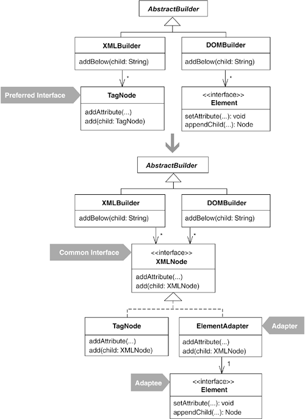

### 동기
- 비슷한 일을 하는 클래스지만 공통 인터페이스가 없어 각각을 별도의 방식으로 사용해야 하는 상황을 가리켜 '인터페이스가 서로 다른 대체 클래스의 냄새가 난다고 표현한다'
- 이 냄새를 제거하는 가장 간단한 방법은 메서드의 이름을 바꾸거나 메서드 자체를 옮겨서 인터페이스를 서로 동일하게 만드는 것이다.
- 두 클래스가 동일하거나 유사한 작업을 수행하지만 인터페이스가 서로 다른 경우.
- 두 클래스가 공통 인터페이스를 가지면, 클라이언트 코드가 더 간단하고 명료해질 수 있는 경우.
- 외부 라이브러리라서 인터페이스를 바꾸고 싶어도 쉽게 바꿀 수 없는 경우.
- 인터페이스가 프레임워크의 일부라서 이미 많은 클라이언트에서 사용되고 있는 경우.
- 소스 코드를 갖고 있지 않는 경우.

### 장점과 단점
```
+ 클라이언트가 대체 클래스들을 하나의 인터페이스를 통해서 사용하도록 통합함으로써, 코드 중복을 없애거나 줄인다.
+ 클라이언트 코드가 간단해진다.
+ 클라이언트가 대체 클래스들을 사용하는 방식이 통합된다.
- 해당 클래스의 인터페이스를 직접 바꾸는 것이 가능한 상황에서 Adapter 패턴을 구현하면, 쓸데없이 설계만 복잡해진다.
```

### 절차 및 예제
- XML 빌더


```java
/* DOMBuilder */
public class DOMBuilder extends AbstractBuilder {
        private static final String CANNOT_ADD_BESIDE_ROOT = null;
        private Document document;
        private Element root;
        private Element parent;
        private Element current;

        public void addAttribute(String name, String value) {
                current.setAttribute(name, value);
        }

        public void addBelow(String child) {
                Element childNode = document.createElement(child);
                current.appendChild(childNode);
                parent = current;
                current = childNode;
                history.push(current);
        }

        public void addBeside(String sibling) {
                if (current == root )
                        throw new RuntimeException(CANNOT_ADD_BESIDE_ROOT);
                Element siblingNode = document.createElement(sibling);
                parent.appendChild(siblingNode);
                current = siblingNode;
                history.pop();
                history.push(current);
        }

        public void addValue(String value) {
                current.appendChild(document.createTextNode(value));
        }
}

/* XMLBuilder */
public class XMLBuilder extends AbstractBuilder {
        private TagNode rootNode;
        private TagNode currentNode;

        public void addChild(String childTagName) {
                addTo(currentNode, childTagName);
        }

        public void addSibling(String siblingTagName) {
                addTo(currentNode.getParent(), siblingTagName);
        }

        private void addTo(TagNode parentNode, String tagName) {
                currentNode = new TagNode(tagName);
                parentNode.add(currentNode);

        }

        public void addAttribute(String name, String value) {
                currentNode.addAttribute(name, value);
        }

        public void addValue(String value) {
                currentNode.addValue(value);
        }
}
```
1. 공통 인터페이스를 만든다. TagNode에 public 메서드는 5개다. 공통 인터페이스에는 그중 3개만 포함시키면 된다. TagNode에 **Extract Interface** 리팩터링을 적용해 다음과 같이 만든다.
```java
    public interface XMLNode {
            public abstract void add(XMLNode childNoe);
            public abstract void addAttribute(String atribute, String value);
            public abstract void addValue(String value);
    }

    public class TagNode implements XMLNode...
            public void add(XMLNode childNode) {
                children().add(childNoe);
            }
            // 이하 생략
    }
```
1. DOMBuilder에 **Extract Class** 리팩터링을 적용해 Element를 위한 원시 어댑터 클래스를 만든다.
```java
    public class ElementAdapter {
            Element element;

            public ElementAdapter(Element element) {
                    this.element = element;
            }

            public Element getElement()
                    return element;
            }
    }
```
1. DOMBuilder에 있는 Element 타입의 필드를 모두 원시 어댑터인 **ElementAdapter** 타입으로 변경한다. 물론 해당 필드를 사용하는 코드도 함께 수정해야 한다.
```java
    public class DOMBuilder extends AbstractBuilder {
            private static final String CANNOT_ADD_BESIDE_ROOT = null;
            private Document document;
            private ElementAdapter rootNode;
            private ElementAdapter parentNode;
            private ElementAdapter currentNode;

            public void addAttribute(String name, String value) {
                    currentNode.getElement().setAttribute(name, value);
            }

            public void addBelow(String child) {
                    ElementAdapter childNode = new ElementAdapter(document.createElement(child));
                    currentNode.getElement().appendChild(childNode.getElement());
                    parentNode = currentNode;
                    currentNode = childNode;
                    history.push(currentNode);
            }

            public void addBeside(String sibling) {
                    if (currentNode == rootNode )
                            throw new RuntimeException(CANNOT_ADD_BESIDE_ROOT);
                    ElementAdapter siblingNode = new ElementAdapter(document.createElement(sibling));
                    parentNode.getElement().appendChild(siblingNode.getElement());
                    currentNode = siblingNode;
                    history.pop();
                    history.push(currentNode);
            }

            public void addValue(String value) {
                    currentNode.getElement().appendChild(document.createTextNode(value));
            }
    }
```
1. DOMBuilder에서 Element 인터페이스의 메서드를 호출하는 부분을 Extract Method 리팩터링을 통해 별도의 메서드로 뽑아낸다. 이 때 핵심은 메서드 호출의 대상이 되는 Element 객체에 대한 참조를 파라미터를 통해 얻도록 만드는 것이다.
```java
     public class DOMBuilder extends AbstractBuilder {
        private static final String CANNOT_ADD_BESIDE_ROOT = null;
        private Document document;
        private ElementAdapter rootNode;
        private ElementAdapter parentNode;
        private ElementAdapter currentNode;

        public void addAttribute(String name, String value) {
            addAttribute(currentNode, name, value);
        }

        private void addAttribute(ElementAdapter current, String name, String value) {
            currentNode.getElement().setAttribute(name, value);
        }

        public void addBelow(String child) {
            ElementAdapter childNode = new ElementAdapter(document.createElement(child));
            add(currentNode, childNode);
            parentNode = currentNode;
            currentNode = childNode;
            history.push(currentNode);
        }

        private void add(ElementAdapter parent, ElementAdapter child) {
            parent.getElement().appendChild(child.getElement());
        }

        public void addBeside(String sibling) {
            if (currentNode == rootNode )
                throw new RuntimeException(CANNOT_ADD_BESIDE_ROOT);
            ElementAdapter siblingNode = new ElementAdapter(document.createElement(sibling));
            add(parentNode, siblingNode);
            currentNode = siblingNode;
            history.pop();
            history.push(currentNode);
        }

        public void addValue(String value) {
            addValue(currentNode, value);

        }

        private void addValue(ElementAdapter current, String value) {
            current.getElement().appendChild(document.createTextNode(value));
        }
    }
```
1. 앞에서 뽑아낸 메서드를 **Move Method** 리팩터링을 통해 **ElementAdapter**로 옮기는데, 절차에서 설명했듯이 공통 인터페이스 XMLNode의 대응 메서드와 시그너처가 가능한 유사해야 한다. addValue(...)를 제외한 대부분의 메서드에 대해서는 이렇게 인터페이스를 통합하는 데 별 문제가 없다.
	1. addAttribute(...)와 add(...)를 옮긴다.
	```java
    public class ElementAdapter...
            public void addAttribute(String name, String value) {
                    getElement().setAttribute(name, value);
            }

            public void add(ElementAdapter child) {
                    getElement().appendChild(child.getElement());
            }
```
	1. addValue(...)를 옮긴다. 이 메서드는 document 필드를 참조하기 때문에 조금 까다롭다. **ElementAdapter**의 생성자를 통해 Document 객체를 전달한다.
	```java
    public class ElementAdapter...
            private Element element;
            private Document document;

            public ElementAdapter(Element element, Document document) {
                    this.element = element;
                    this.document = document;
            }
```
	1. 변경된 생성자에 맞추어 DOMBuilder의 코드를 수정한다. 그리고 addValue(...)를 옮긴다.
	```java
    public class DOMBuilder...
            public void addBelow...
                    ElementAdapter childNode = new ElementAdapter(document.createElement(child), document);
                    ...
            }

            public void addBeside...
                    ElementAdapter siblingNode = new ElementAdapter(document.createElement(sibling), document);
                    ...
            }
    }

    public class ElementAdapter...
            public void addValue(String value) {
                    getElement().appendChild(document.createTextNode(value));
            }
```
1. **ElementAdapter**가 XMLNode 인터페이스를 구현하도록 만든다. 이 과정은 별다른 설명이 필요 없을 정도로 단순하다. 다만, add(...)에서 XMLNode 인터페이스가 제공하지 않는 getElement()를 호출하므로 다음과 같이 수정해야 하는 것만 주의하면 된다.
```java
public class ElementAdapter implements XMLNode...
        public void add(XMLNode child) {
                ElementAdapter childElement = (ElementAdapter)child;
                getElement().appendChild(childElement.getElement());
        }
```
1. 마지막으로, DOMBuilder의 코드 중에서 ElementAdapter? 타입으로 되어있는 필드 또는 지역 변수, 메서드 파라미터를 모두 XMLNode 타입으로 바꾼다.
```java
public class DOMBuilder extends AbstractBuilder {
        private static final String CANNOT_ADD_BESIDE_ROOT = null;
        private Document document;
        private XMLNode rootNode;
        private XMLNode parentNode;
        private XMLNode currentNode;
        
        public void addChild(String childTagName) {
                XMLNode childNode = new ElementAdapter(document.createElement(childTagName), document);
                ...
        }
        
        protected void init(String rootName) {
                document = new DocumentImpl();
                rootNode = new ElementAdapter(document.createElement(rootName), document);
                document.appendChild(((ElementAdapter)rootNode).getElement());
        }
```

## Extract Adapter

하나의 클래스가 컴포넌트, 라이브러리, API등의 여러 버전을 동시에 지원하기 위한 어댑터 역할을 하고 있다면, 
각 버전을 위한 기능을 별도의 어댑터로 뽑아낸다.

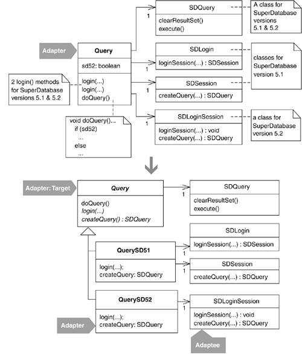

### 동기

*문제의 원인*

* 소프트웨어를 개발하다 보면 컴포넌트, 라이브러리 또는 API를 동시에 여러 버전으로 지원해야 할 때가 있다. 
* 특정 버전만을 위한 상태 변수, 생성자, 메서드 등을 한 클래스에 오버로딩해 구현하는 경우를 볼 수 있다.
  * 이러한 코드에는 "다음 버전으로 옮겨갈 경우 이 코드는 삭제 할 것"과 같은 내용의 주석이 달리는 경우가 많다.
  * 하지만 다른 부분에서 문제가 생길지도 모른다는 걱정에 코드는 삭제되지 않고 여러 버전을 지원하는 코드가 그대로 남게 된다.

*방안*

* 각 버전을 지원하는 별도의 클래스를 만든다. (이름에 지원하는 버전을 명시하는 것도 좋다.)
  * 이러한 클래스를 어댑터라 부른다.
  * 어댑터는 공통 인터페이스를 구현하고, 특정 버전의 코드에 대해 정확히 동작해야한다.
* 오픈 소스 라이브러리의 경우 API가 끊임없이 바뀌는 경우가 많은데, 어댑터로 감싸 API의 변경에 대응하는 것이 좋다.

### Adapter와 Facade

* Adapter 패턴은 객체 수준에서의 어댑팅.
* Facade(퍼사드) 패턴은 어떤 서브 시스템 전체를 어댑팅.
  * 새 시스템에 설계가 좋지 않고 복잡한 레거시 코드에 대한 좀 더 단순한 뷰를 제공.
  * 새 시스템은 Facade 객체와 통신하고, 이 Facade 객체가 레거시 코드와 관련된 복잡한 작업을 대신한다.

#### Facade 패턴 적용 과정

1. 주어진 레거시 시스템의 서브 시스템을 확인.
2. 그 서브시스템을 위한 퍼스드를 구현.
3. 앞서 만든 퍼사드를 사용하도록 클라이언트 코드를 수정.
4. 레거시 시스템의 기능을 신기술로 다시 구현하고 그를 어댑팅하는 새 퍼사드를 만든다.
5. 기존의 퍼사드와 새 퍼사드가 동일하게 동작하는지 테스트.
6. 새 퍼사드를 사용하도록 클라이언트 코드 수정.
7. 나머지 서브시스템에 대해서 위의 과정 반복.

### 장점과 단점

```
+ 컴포넌트,라이브러리 또는 API의 버전에 따른 차이점을 격리한다.
+ 클래스가 하나의 버전만 책임지도록 한다.
+ 자주 변하는 코드를 시스템과 분리할 수 있다.
- 원래 있던 중요 기능을 어댑터에서 제공하지 못하면, 클라이언트가 그런 중요 기능에 접근하는데 장벽이 될 수 있다.
```

### 절차

1. 여러 버전의 코드를 어댑팅하기 위해 과중한 책임을 떠맡고 있는 어댑터 클래스를 찾는다.
2. 과중한 책임을 맡고 있는 어댑터 클래스에 Extract Subclass/Class 리팩터링을 적용해 특정 버전에 종속적인 부분을 각각 별도의 클래스로 뽑아낸다.
3. 기존의 어댑터 클래스에 버전 종속적인 코드가 모두 사라질 때까지 2를 반복한다.
4. 새로 만든 어댑터 클래스들 사이에 존재하는 중복 코드는 Pull Up Method 또는 Form Template Method 리팩터링을 통해 제거한다.

### 예제

요약 : 써드파티 라이브러리(SuperDatabase)를 이용해 데이터베이스 쿼리를 처리하는 코드.

1. 여러 버전의 SuperDatabase를 지원하기 위해 과중한 책임을 떠맡고 있는 어댑터를 찾는다.
  * Query 클래스는 SuperDatabase의 버전 5.1과 5.2를 지원.
```java
public class Query...
    private SDLogin sdLogin;    // SD 5.1
    private SDSession sdSession;    // SD 5.1
    private SDLoginSession sdLoginSession;  // SD 5.2
    private boolean sd52;   // SD 5.2로 동작하고 있음을 나타내는 플래그
    private SDQuery sdQuery;    // SD 5.1, 5.2 모두
    
    // SD 5.1을 위한 로그인 메서드
    // 주의 : 모든 애플리케이션이 5.2로 전환하면, 이 코드를 삭제할 것.
    public void login(String server, String user, String password) throws QueryException {
        sd52 = false;
        try {
            sdSession = sdLogin.loginSession(server, user, password);
        } catch (SDLoginFailedException lfe) {
            throw new QueryException(QueryException.LOGIN_FAILED, "Login failure\n" + lfe, lfe);
        } catch (SDSocketInitFailedException ife) {
            throw new QueryException(QueryException.LOGIN_FAILED, "Socket fail\n" + ife, ife);
        }
    }

    // SD 5.2를 위한 로그인 메서드
    public void login(String server, String user, String password, String sdConfigFileName) throws QueryException {
        sd52 = true;
        sdLoginSession = new SDLoginSession(sdConfigFileName, false);
        try {
            sdLoginSession.loginSession(server, user, password);
        } catch (SDLoginFailedException lfe) {
            throw new QueryException(QueryException.LOGIN_FAILED, "Login failure\n" + lfe, lfe);
        } catch (SDSocketInitFailedException ife) {
            throw new QueryException(QueryException.LOGIN_FAILED, "Socket fail\n" + ife, ife);
        } catch (SDNotFoundException nfe) {
            throw new QueryException(QueryException.LOGIN_FAILED, "Not Found Exception\n" + nfe, nfe);
        }
    }

    public void doQuery() throws QueryException {
        if(sdQuery != null) {
            sdQuery.clearResultSet();
        }

        if(sd52) {
            sdQuery = sdLoginSession.createQuery(SDQuery.OPEN_FOR_QUERY);
        } else {
            sdQuery = sdSession.createQuery(SDQuery.OPEN_FOR_QUERY);
        }

        executeQuery();
    }
```

2. Query 클래스에서 Extract Subclass 리팩터링으로 SuperDatabase 5.1을 위한 코드를 분리하기 위해 서브 클래스 정의.
```java
class QuerySD51 extends Query {
    public QuerySD51() {
        super();
    }
}
```
3. 클라이언트 코드에서 Query의 생성자를 호출하는 부분을 모두 찾아 적절한 곳이라면(5.1버전 사용) QuerySD51 생성자를 호출.
  * 이 때 생성자를 무조건 바꾸면 안된다.
  ```java
  public void loginToDatabase(String db, String user, String password) {
      query = new Query
      try {
          if(usingSDVersion52()) {
              query.login(db, user, password, getSD52ConfigFileName()); // SD 5.2로 로그인
          } else {
              query.login(db, user, password);  // SD 5.1로 로그인
          }
          ...
      } catch(QueryException qe) ...
  }
  ```
  * 위의 경우 query 생성자를 무조건 바꾸면 SDVersion52를 사용하는 부분에서 오류가 난다.
  * 아래와 같이 수정.
  ```java
  public void loginToDatabase(String db, String user, String password) {
      //query = new Query
      try {
          if(usingSDVersion52()) {
              query = new Query();
              query.login(db, user, password, getSD52ConfigFileName()); // SD 5.2로 로그인
          } else {
              query = new QuerySD51;
              query.login(db, user, password);  // SD 5.1로 로그인
          }
          ...
      } catch(QueryException qe) ...
  }
  ```
4. QuerySD51이 필요한 메서드와 필드를 가질 수 있도록 Push Down Method와 Push Down Field 리팩터링을 적용.
  * public 메서드 리팩토링 시 주의. 
    * 메서드를 옮기면 기존에 Query를 통해 메서드를 호출하던 클라이언트는 QuerySD51로 형변환을 하지 않으면 해당 메서드를 사용할 수 없음.
    * 그래서 리팩토링 과정에서는 Query에서 완전히 제거하지 않고 중복이 생기더라도 복사와 수정을 병행.
    * 중복코드는 리팩토링의 마지막 단계에서 제거.
    ```java
    class Query...
        private SDLogin sdLogin;
        private SDSession sdSession;
        protected SDQuery sdQuery;

        // SD 5.1을 위한 로그인 메서드
        public void login(String server, String user, String password) throws QueryException {
            // 아무 작업도 하지 않음.
        }

        public void doQuery() throws QueryException {
            if(sdQuery != null) {
                sdQuery.clearResultSet();
            }

            //if(sd52)
                sdQuery = sdLoginSession.createQuery(SDQuery.OPEN_FOR_QUERY);
            //else
                //sdQuery = sdSession.createQuery(SDQuery.OPEN_FOR_QUERY);

            executeQuery();
        }
    ```
    ```java
    class QuerySD51 {
        private SDLogin sdLogin;
        private SDSession sdSession;

        public void login(String server, String user, String password) throws QueryException {
            sd52 = false;
            try {
                sdSession = sdLogin.loginSession(server, user, password);
            } catch (SDLoginFailedException lfe) {
                throw new QueryException(QueryException.LOGIN_FAILED, "Login failure\n" + lfe, lfe);
            } catch (SDSocketInitFailedException lfe) {
                throw new QueryException(QueryException.LOGIN_FAILED, "Socket fail\n" + ife, ife);
            }
        }

        public void doQuery() throws QueryException {
            if(sdQuery != null) {
                sdQuery.clearResultSet();
            }

            //if(sd52)
                //sdQuery = sdLoginSession.createQuery(SDQuery.OPEN_FOR_QUERY);
            //else
                sdQuery = sdSession.createQuery(SDQuery.OPEN_FOR_QUERY);

            executeQuery();
        }
    }
    ```
5. 테스트
6. 단계 3을 반복해 QuerySD52 클래스를 만들고 Query를 추상클래스로, doQuery()도 추상 메서드로 만든다.
  * 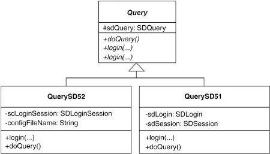
7. 중복코드 제거
  * doQuery()에 코드 중복이 존재.
    ```java
    abstract class Query...
        public abstract void doQuery() throws QueryException;

    class QuerySD51 ...
        public void doQuery() throws QueryException {
            if(sdQuery != null) {
                sdQuery.clearResultSet();
            }

            sdQuery = sdSession.createQuery(SDQuery.OPEN_FOR_QUERY);
            executeQuery();
        }
	class QuerySD52 ...
        public void doQuery() throws QueryException {
            if(sdQuery != null) {
                sdQuery.clearResultSet();
            }

            sdQuery = sdLoginSession.createQuery(SDQuery.OPEN_FOR_QUERY);
            executeQuery();
        }
  ``` 
  * sdQuery 객체를 얻는 방식만 다르므로 Introduce Polymorphic Creation with Factory Method, Form Template Method 리팩토링을 통해 doQuery() 메서드를 super 클래스로 옮긴다.
  ```java
  abstract class Query...
    public abstract SDQuery createQuery();

    public void doQuery() throws QueryException {
        if(sdQuery != null)
            sdQuery.clearResultSet();
        sdQuery = createQuery();
        executeQuery();
    }
	class QuerySD51 ...
        protected SDQuery createQuery() {
            return sdSession.createQuery(SDQuery.OPEN_FOR_QUERY);
        }

      class QuerySD52 ...
        protected SDQuery createQuery() {
            return sdLoginSession.createQuery(SDQuery.OPEN_FOR_QUERY);
        }
  ```
  * Query의 login() 메서드는 아무일도 하지 않고, 두 서브 클래스의 login() 메서드의 시그니처는 파라미터 하나만 빼고 동일하다.
  ```java
  // SD 5.1 로그인
  public void login(String server, String user, String password) throws QueryException ...
  // SD 5.2 로그인
  public void login(String server, String user, String password, String sdConfigFileName) throws QueryException ...
  ```
8. sdConfigFileName 정보를 QuerySD52 클래스의 생성자를 통해 넘기면 login() 메서드의 시그니처를 동일하게 만들 수 있다.
```java
class QuerySD52 ...
    private String sdConfigFileName;
    public QuerySD52(String sdConfigFileName) {
        super();
        this.sdConfigFileName = sdConfigFileName;
    }
```
```java
abstract class Query ...
    public abstract void login(String server, String user, String password) throws QueryException ...
```
```java
public void loginToDatabase(String db, String user, String password) ...
    if(usingSDVersion52())
        query = new QuerySD52(getSD52ConfigFileName());
    else
        query = new QuerySD51();
    
    try {
        query.login(db, user, password);
        ...
    } catch(QueryException qe) ...
```
9. Query는 이제 추상 클래스가 되었으므로 의도를 명확하게 하기 위해 AbstractQuery로 바꾸는 것이 좋지만, Query를 사용하는 클라이언트 코드를 모두 찾아 바꿔주어야 한다.
  * Extract Interface 리팩터링을 적용하면 클라이언트 코드를 수정하지 않아도 된다.
  ```java
  interface Query {
      public void login(String server, String user, String password) throws QueryException;
      public void doQuery() throws QueryException;
  }
  ``` 
  ```java
  abstract class AbstractQuery implements Query ...
    /*public abstract void login(String server, String user, String password) throws QueryException*/
  ```
10. 테스트 후 리팩토링 종료.

* 얻게된 이점.
  * 각 버전 간의 유사점과 차이점을 쉽게 알아볼 수 있게 되었다.
  * 오래되어 사용되지 않는 버전을 위한 코드를 쉽게 제거할 수 있게 되었다.
  * 새 버전을 지원하는 일이 쉬워졌다.

### 변형

#### 익명 내부 클래스를 사용해 어댑팅하기

* JDK 1.0에서는 Enumeration 인터페이스를 통해 컬렉션을 순회했었다.
* 점점 더 발전하여 Iterator 인터페이스가 그 역할을 대신하게 되었다.
* Enumeration 인터페이스를 사용해 작성된 코드와도 상호 동작이 가능해야 하므로 JDK에는 익명 내부 클래스 기능을 이용해 Iterator를 어댑팅하는 생성 메서드를 제공한다.

```java
public class Collections ...
    public static Enumeration enumeration(final Collection c) {
        return new Enumeration() {
            Iterator i = c.iterator();

            public boolean hasMoreElements() {
                return i.hasNext();
            }

            public Object next Element() {
                return i.next();
            }
        }
    }
```

## Replace Implicit Language with Interpret

한 클래스 내의 여러 메소드에서
일종의 묵시적 언어를 이루는 요소들을 조합하고 있다면,

그 묵시적 언어의 요소들을 각각의 클래스로 정의하고
그 객체의 조합을 통해 해석 가능한 수식을 만들어 낼 수 있도록 한다.

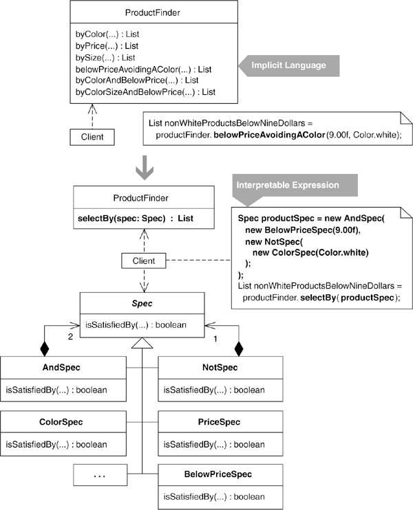

### 동기
- Interpreter 패턴은 단순한 언어를 해석할 때 유용한 패턴
    - 문법을 불과 클래스 몇 개로 모델화할 수 있을때, 그 언어는 단순하다고 말한다.
    - 단순한 언어의 문장(sentence)이나 수식(expression)은 그 문법을 정의하는 클래스들의 인스턴스 조합을 통해 표현 => **Composite** 패턴
    - 언어가 복잡하거나 단순한 경우에는 인터프리터가 필요없다. => 다른 전문 도구를 이용해라.
    - 어떤 언어의 문법을 10개 이하 클래스로 구현할수 있다면 **Interpreter** 패턴을 사용하는 것이 좋다.(검색 조건식을 통해 객체나 데이터 베이스를 검색하는것)
- ex)
    - 10달라 이하의 상품을 찾아라
    - 흰색이 아니고 10달라 이하인 상품을 찾아라.
    - 파란색이고 작으며 10달라 이하인 상품을 찾아라.
```java
ProductFinder...
          public List byColo(Color colorOfProductToFind)...
          public List byPrice(float priceLimit)...
          public List bySize(int sizeToFind)...
          public List belowPrice(float price)...
          public List belowPriceAvoidingAColor(float price)...
          public List byColorAndBelowPrice(Color color, float price)...
          public List byColorSizeAndBelowPrice(Color color, int size, float price)...
```
		- 상품 검색 언어가 묵시적(implicit)이다.
        	- 분명히 검색을 위한 언어가 존재하지만, 겉으로는 드러나지 않음
        - 묵시적 언어 사용의 문제점
            - 검색 조건의 새로운 조합이 필요할 떄마다 그에 대응하는 새로운 메소드를 추가해야 한다.
            - 검색 메소드 사이에 중복 코드가 많이 생긴다.
        - 인터프리터를 이용하면, 검색 조건의 다양한 조합을 단 몇개의 클래스로 모두 처리할 수 있고, 코드 중복도 제거할 수 있다.
- **Interpreter** 패턴으로 리팩터링할때에는 초기 비용이 만만치 않다.
    - 문법 표현 클래스를 정의해야하고, 클라이언트 코드에서도 그 문법 클래스의 조합을 통해 수식을 표현하도록 고쳐야한다.
    - 묵시적 언어에서 끝없이 증가하는 수식의 조합을 처리하기 위해 수많은 중복 코드가 양산된다면 분명 가치가 있다.
- Specification[EVANS]과 Query Object[PEAA] 패턴은 **Interpreter** 패턴을 매우 적극적으로 사용하는 예
    - 검색 조건식과 그 표현을 분리하는데 유용한 패턴
    - ex) QueryObject는 쿼리를 일반화해 모델로 만들기때문에 데이터베이스에 실제로 쿼리할때 사용되는 SQL로 쉽게 변환할수 있다.
- 인터프리터는 시스템 설정을 런타임에 변경하기 위해서 사용되는 경우도 많다.
	- 시스템에서 사용자 인터페이스를 통해 사용자가 원하는 설정을 쿼리 형태로 입력받은 다음, 그 쿼리를 나타내는 해석 가능한 객체 구조를 동적으로 생성할수 있다.

### 장점과 단점
```
 + 언어를 묵시적으로 처리할 때보다 언어 요소를 쉽게 조합할수 있다.
 + 언어 요소의 새 조합을 지원하기 위해 코드를 추가 작성할 필요가 없다.
 + 시스템의 동작 설정을 런타임에 변경할수 있게 된다.
 - 문법을 정의하고 이를 이용하도록 클라이언트 코드를 수정하는 초기 비용이 든다.
 - 언어가 복잡하면, 지나치게 많은 작업이 필요하다.
 - 언어가 단순하면, 설계만 복잡해지는 것이다.
```

### 절차
참고) Specification, QueryObject? 패턴

1. 한가지 조건을 입력 받아 그에 맞는 객체의 집합을 검색하는 객체 선택 메소드를 찾고, 그 조건 파라미터에 대한 명세(specification) 클래스를 만든다.
    - 이때 파라미터의 값은 생성자를 통해 받도록 하고 get 메소드도 제공한다.
    - 객체 선택 메소드 내에서는 명세 클래스 타입의 변수를 선언해 인스턴스를 만들고, 조건은 명세 객체로부터 get 메소드를 통해 얻도록 한다.
    - 명세 클래스의 이름은 그 역할이 잘 드러나도록 짓는다.
    - 객체 선택 메소드에 조건이 두개 이상 있다면, 각 조건에 대해 위의 과정과 단계 2의 과정을 반복한다. 나중에 단계 4에서 이 명세 클래스들에 Composite 패턴을 적용할 것이다.
    - 컴파일 후 객체 선택 메소드가 제대로 동작하는 테스트

1. 객체 선택 메소드 내의 조건문에 **Extract Method** 리팩터링을 적용해 isSatisfiedBy(...) 메소드로 뽑아내는데 이 메소드의 리턴값은 true 또는 false여야한다.(**Specification** 패턴)
    - 뽑아낸 메소드를 **Move Method** 리팩터링을 통해 명세 클래스로 옮긴다.
    - 명세 클래스에 아직 수퍼 클래스가 없다면 **Extract Superclass** 리팩터링을 통해 만든다.
    - 새로 만든 수퍼 클래스는 추상 클래스로 정의하고, isSatisfiedBy(...)를 추상 메소드로 선언한다.
    - 컴파일 후 객체 선택 메소드가 여전히 잘 동작하는지 테스트한다.

1. 다른 객체 선택 메소드에 대해서도 단계 1과 2를 반복한다.
	- 객체 선택 조건을 사용하는 다른 메소드에 대해서도 같은 작업을 한다.

1. 명세를 두개 이상 사용하는 객체 선택 메소드(즉, 객체 선택 로직에서 두개 이상의 명세 클래스 인스턴스 생성하는 메소드)가 있다면, 조합(composite) 명세 클래스를 만드는 식으로 단계 1을 약간 수정해 적용한다.
    - 조합 명세 클래스의 생성자에 명세 객체를 넘길수도 있고, 명세 클래스의 종류가 많은 경우에는 조합 명세 클래스에 add(...)메소드를 추가할수도 있다.
    - 객체 선택 메소드의 조건문에 단계2를 적용해 로직을 Composite 클래스의 isSatisfiedBy(...)로 옮긴다.
    - 조합 명세 클래스도 명세 클래스들의 수퍼 클래스를 상속하도록 수정한다.

1. 모든 객체 선택메소드가 한 명세 객체(하나의 명세 객체 또는 하나의 조합 명세 객체)를 사용한다.
    - 또한 모든 객체 선택 메소드가 명세 객체를 생성하는 코드만 제외하면 완전히 동일할 것이다.
    - 이 동일한 부분을 **Extract Method** 디랙토링을 통해 별도의 메소드로 뽑아낸다. 이 메소드는 selectBy(..)와 같은 식으로 짓는다.
    - 그리고 단계 2에서 만든 수퍼 클래스 타입의 파라미터 하나 받도록 하고 객체의 컬렉션을 리턴하도록 한다.
    - 컴파일후 테스트한다.

1. 모든 객체 선택 메소드에 **Inline Method** 리팩토링을 적용한다.
	- 컴파일후 테스트한다.

### 예제
```java
import java.util.ArrayList;
import java.util.Iterator;
import java.util.List;

public class ProductFinder {
        private ProductRepository repository;

        public ProductFinder(ProductRepository repository) {
                this.repository = repository;
        }

        public List<Product> byColor(Color colorOfProductToFind) {
                List<Product> foundProducts = new ArrayList<Product>();
                Iterator<Product> products = repository.iterator();
                while (products.hasNext()) {
                        Product product = (Product) products.next();
                        if (product.getColor().equals(colorOfProductToFind))
                                foundProducts.add(product);
                }
                return foundProducts;
        }

        public List<Product> byPrice(float priceLimit) {
                List<Product> foundProducts = new ArrayList<Product>();
                Iterator<Product> products = repository.iterator();
                while (products.hasNext()) {
                        Product product = (Product) products.next();
                        if (product.getPrice() == priceLimit)
                                foundProducts.add(product);
                }
                return foundProducts;
        }

        public List<Product> byColorSizeAndBelowPrice(Color color, int size, float price) {
                List<Product> foundProducts = new ArrayList<Product>();
                Iterator<Product> products = repository.iterator();
                while (products.hasNext()) {
                        Product product = (Product) products.next();
                        if (product.getColor() == color && product.getSize() == size
                                        && product.getPrice() < price)
                                foundProducts.add(product);
                }
                return foundProducts;
        }

        public List<Product> belowPriceAvoidingAColor(float price, Color color) {
                List<Product> foundProducts = new ArrayList<Product>();
                Iterator<Product> products = repository.iterator();
                while (products.hasNext()) {
                        Product product = (Product) products.next();
                        if (product.getPrice() < price && product.getColor() != color)
                                foundProducts.add(product);
                }
                return foundProducts;
        }

}
```
1. 조건 하나로 검색을 수행하는 객체 선택 메소드를 찾는다.
	- ProductFinder의 byColor(Color colorOfProductToFind)
	 ```java
     public List<Product> byColor(Color colorOfProductToFind) {
        List<Product> foundProducts = new ArrayList<Product>();
        Iterator<Product> products = repository.iterator();
        while (products.hasNext()) {
                Product product = (Product) products.next();
                if (product.getColor().equals(colorOfProductToFind))
                        foundProducts.add(product);
        }
        return foundProducts;
}
```
	- 조건 파라미터 Color colorOfProductToFind에 대한 명세 클래스를 만든다. ColorSpec
```java
 public class ColorSpec{
        private Color colorOfProductToFind;

        public ColorSpec(Color colorOfProductToFind){
                this.colorOfProuctToFind = colorOfProductToFind;
        }

        public Color getColorOfProductToFind() {
                return colorOfProductToFind;
        }
 }
```
	- byColor(...)에 ColorSpec타입의 변수를 추가하고 colorOfProductToFind 파라미터를 사용하던곳을 ColorSpec의 get 메소드 호출로 대체
```java
 public List byColor(Color colorOfProductToFind) {
        ColorSpec spec = new ColorSpec(colorOfProductToFind);
        List<Product> foundProducts = new ArrayList<Product>();
        Iterator<Product> products = repository.iterator();
        while (products.hasNext()) {
            Product product = (Product) products.next();
            if (product.getColor().equals(spec.getColorOfProductToFind()))
                    foundProducts.add(product);
        }
        return foundProducts;
 }
```
1. **Extract Method** 리팩토링을 적용해 while 루프내의 조건 로직을 isSatisfiedBy(...) 메소드로 뽑아낸다.
```java
public List byColor(Color colorOfProductToFind) {
        ColorSpec spec = new ColorSpec(colorOfProductToFind);
        List<Product> foundProducts = new ArrayList<Product>();
        Iterator<Product> products = repository.iterator();
        while (products.hasNext()) {
            Product product = (Product) products.next();
            if (isSatisfiedBy(spec, product))
                foundProducts.add(product);
        }
        return foundProducts;
 }

 private boolean isSatisfiedBy(ColorSpec spec, Prouct product) {
        product.getColor().equals(spec.getColorOfProductToFind());
 }
```
	- **Move Method** 리팩토링을 통해 isSatisfiedBy(...)를 ColorSpec 클래스로 옮길수 있다.
```java
public class ProductFinder...
        public List byColor(Color colorOfProductToFind) {
            ColorSpec spec = new ColorSpec(colorOfProductToFind);
            List<Product> foundProducts = new ArrayList<Product>();
            Iterator<Product> products = repository.iterator();
            while (products.hasNext()) {
                Product product = (Product) products.next();
                if (spec.isSatisfiedBy(product))
                    foundProducts.add(product);
            }
            return foundProducts;
        }
...
public class ColorSpec...
        boolean isSatisfiedBy(Product product) {
            return product.getColor().equals(getColorOfProductToFind());
        }
```
	- **ColorSpec** 클래스에 **Extract Superclass** 리팩토링을 적용해 명세 수퍼클래스를 만든다.
```java
public abstract class Spec{
		public abstract boolean isSatisfiedBy(Product product);
}
..
public class ColorSpec extends Spec...
```
1. 이제 다른 객체 선택 메소들에 대해서 단계 1, 2를 반복한다. 조건이 두개 이상인 메소드도 포함해서 작업한다.
```java
public List<Product> byColorAndBelowPrice(Color color, float price) {
        List<Product> foundProducts = new ArrayList<Product>();
        Iterator<Product> products = repository.iterator();
        while (products.hasNext()) {
            Product product = (Product) products.next();
            if (product.getPrice() < price && product.getColor() == color)
                foundProducts.add(product);
        }
        return foundProducts;
}
```
	- 단계 1, 2를 적용해 다음과 같이 BelowPriceSpec 클래스를 만든다.
```java
public class BelowPriceSpec extends Spec{
            private float priceThreshold;

            public BelowPriceSpec(float priceThreshold) {
                this.priceThreshold = priceThreshold;
            }

            public boolean isSatisfiedBy(Product product) {
                return product.getPrice() < getPriceThreshold();
            }

            public float getPriceThreshold() {
                return priceThreshold;
            }
 }
```
	- 이제 두개의 명세 클래스를 사용하는 새로운 버젼의 byColorSizeAndBelowPrice(...) 메소드를 만들수 있다.
```java
public List<Product> byColorAndBelowPrice(Color color, float price) {
        ColorSpec colorSpec = new ColorSpec(color);
        BelowPriceSpec priceSpec = new BelowPriceSpec(price);

        List<Product> foundProducts = new ArrayList<Product>();
        Iterator<Product> products = repository.iterator();
        while (products.hasNext()) {
            Product product = (Product) products.next();
            if (priceSpec.isSatisfiedBy(product) && colorSpec.isSatisfiedBy(product))
            	foundProducts.add(product);
        }
        return foundProducts;
}
```
1. byColorAndBelowPrice(...)는 객체 선택 로직에서 두개의 명세 클래스를 사용하는데 명세를 각각 따로 쓸 것이 아니라 하나의 조합 명세를 사용하게 하고 싶다.
```java
public List<Product> byColorAndBelowPrice(Color color, float price) {
        ColorSpec colorSpec = new ColorSpec(color);
        BelowPriceSpec priceSpec = new BelowPriceSpec(price);
        AndSpec spec = new AndSpec(colorSpec, priceSpec);

        List<Product> foundProducts = new ArrayList<Product>();
        Iterator<Product> products = repository.iterator();
        while (products.hasNext()) {
            Product product = (Product) products.next();
			if (spec.getAugend().isSatisfiedBy(product) &&
				spec.getAddend().isSatisfiedBy(product))
                foundProducts.add(product);
        	}
        return foundProducts;
}
...
public class AndSpec {
        private Spec augend, addend;

        public AndSpec(Spec augend, Spec addend) {
            this.augend = augend;
            this.addend = addend;
        }

        public Spec getAddend() {
            return addend;
        }

        public Spec getAddend() {
            return augend;
        }
}
```
	- 단계 2까지 적용하면 다음과 같이 된다.
```java
public List<Product> byColorAndBelowPrice(Color color, float price) {
            ColorSpec colorSpec = new ColorSpec(color);
            BelowPriceSpec priceSpec = new BelowPriceSpec(price);
			AndSpec spec = new AndSpec(colorSpec, priceSpec);

            List<Product> foundProducts = new ArrayList<Product>();
            Iterator<Product> products = repository.iterator();
            while (products.hasNext()) {
                Product product = (Product) products.next();
                if ( spec.isSatisfiedBy(product) )
                    foundProducts.add(product);
            }
            return foundProducts;
    }

    public class AndSpec extends Spec {
            private Spec augend, addend;

            public AndSpec(Spec augend, Spec addend) {
                this.augend = augend;
                this.addend = addend;
            }

            public Spec getAddend() {
                return addend;
            }

            public Spec getAddend() {
                return augend;
            }

            public boolean isSatisfiedBy(Product product) {
                return getAugend().isSatisfiedBy(product) && getAddend().isSatisfiedBy(product);
            }
    }
```
	- belowPriceAvidingAColor(...)의 경우에는 조건 로직이 더욱 복잡하다.
```java
public List<Product> belowPriceAvoidingAColor(float price, Color color) {
            List<Product> foundProducts = new ArrayList<Product>();
            Iterator<Product> products = repository.iterator();
            while (products.hasNext()) {
                Product product = (Product) products.next();
                if (product.getPrice() < price && product.getColor() != color)
                    foundProducts.add(product);
            }
            return foundProducts;
}
```
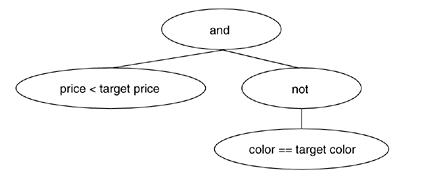
	- 다음과 같이 NotSpec 클래스를 만든다.
 ```java
public class NotSpec extends Spec {
            private Spec specToNegate;

            public NotSpec(Spec specToNegate) {
                this.specToNegate = specToNegate;
            }

            public boolean isSatisfiedBy(Product product)   {
                !specToNegate.isSatisfiedBy(product);
            }
}
```
	- AndSpec과 NotSpec을 사용해 조건 로직을 수정한다.
```java
 public List<Product> belowPriceAvoidingAColor(float price, Color color) {
        	AndSpec spec = new AndSpec(
                                    new BelowPriceSpec(price),
									new NotSpec(new ColorSpec(color))
									);
            List<Product> foundProducts = new ArrayList<Product>();
            Iterator<Product> products = repository.iterator();
            while (products.hasNext()) {
                Product product = (Product) products.next();
                if (spec.isSatisfiedBy(product))
                    foundProducts.add(product);
            }
            return foundProducts;
        }
```
1. 이제 모든 객체 선택 메소드의 코드가 명세 객체 생성 로직만 제외하면 동일하다.
```java
Spec spec = .. spec 객체 생성
List foundProducts = new ArrayList();
Iterator products = repository.iterator();
while (products.hasNext()) {
        Product product = (Product) products.next();
        if (spec.isSatisfiedBy(product))
            foundProducts.add(product);
}
return foundProducts;
```
	- 이젠 모든 객체 선택 메소드에 생성 로직을 제외한 부분에 **Extract Method**를 적용해 selectBy(...) 메소드를 만들수 있다.
```java
public List belowPrice(float price) {
            BelowPriceSpec spec = new BelowPriceSpec(price);
            return selectBy(spec);
}
..
private List selectBy(Spec spec) {
            List foundProducts = new ArrayList();
            Iterator products = repository.iterator();
            while (products.hasNext()) {
                Product product = (Product) products.next();
                if (spec.isSatisfiedBy(product))
                    foundProducts.add(product);
            }
            return foundProducts;
}
```
1. 마지막으로 모든 객체 선택메소드에 **Inline Method** 리팩토링을 적용해 인라인화 한다.
```java
public class ProductFinder...

    //public List<Product> byColor(Color colorOfProductToFind) {
            //ColorSpec spec = new ColorSpec(colorOfProductToFind));
            //return selectBy(spec);
    //}
...
public class ProductFinderTests extends TestCase..
        public void testFindByColor()...
            //List<Product> foundProducts = finder.byColor(Color.red);
            ColorSpec spec = new ColorSpec(colorOfProductToFind));
            List<Product> foundProducts = finder.selectBy(spec);
            assertEquals("found 2 red product", 2, foundProducts.size());
            assertTrue("found fireTruck", foundProducts.contains(fireTruck));
            assertTrue("found Toy Porsche Convertible", foundProducts.contains(toyConvertible));
```