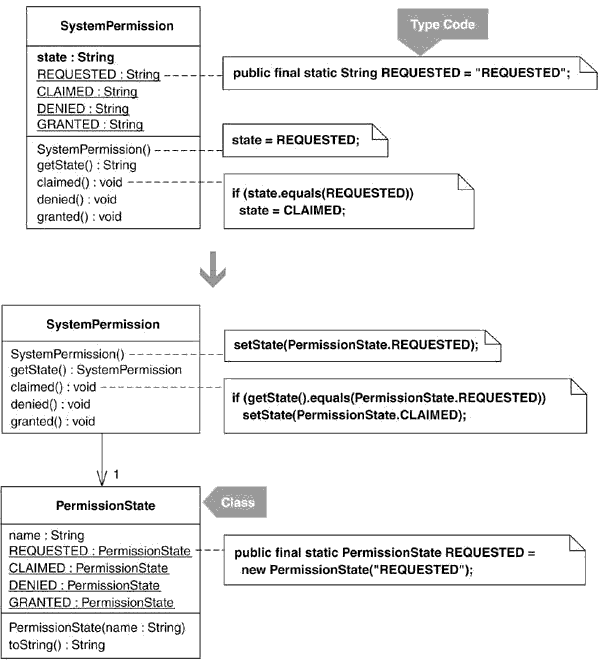
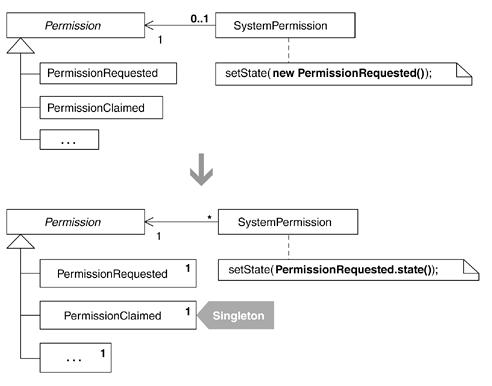
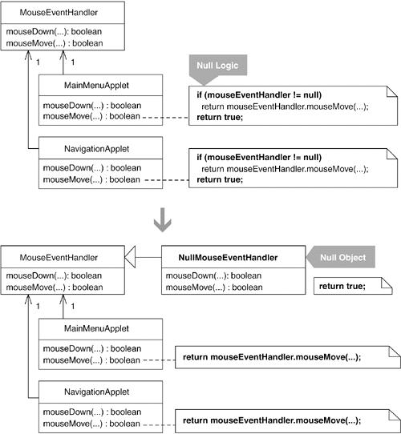
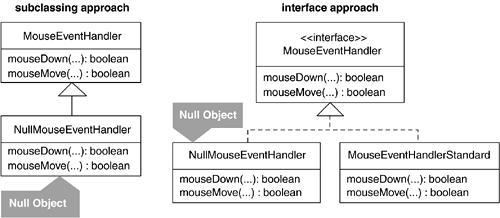
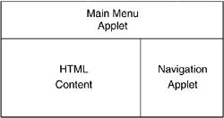

# 9장 Protection
[TOC]

## Replace Type Code with Class
어떤 필드 타입(예를 들어, String 또는 int 등)이 부적합한 값의 대입이나 유효하지 않은 동일성 검사(비교)를 방지하지 못한다면,
필드의 타입을 클래스로 바꿔 값의 대입과 동일성 검사에 제약 조건을 부여한다.


### 동기

* 타입 코드를 클래스로 리팩터링 하는 주된 이유는 코드의 타입 안전성을 보장하려는 것
* ```java
    public void testDefaultsToPermissionRequested() {
        SystemPermission permission = new SystemPermission();
        assertEquals(permission.REQUESTED, permission.state());
        assertEquals("REQUESTED", permission.state());
    }

    class SystemPermission {
        public final static String REQUESTED = "REQUESTED"
        //...

        public SystemPermission() {
        	state = REQUESTED;
        }
	}
```

* 다음의 코드는 타입 안전성이 보장되지 않는다.
* 스트링을 상수로 상태 상수를 정의했다면, 오타가 입력되어도 컴파일 오류가 발생하지 않는다.
    * ```java
    public class SystemPermission...
        public void setState(String newState){
            state = newState;
        }

    permission.setState("REQESTED"); // another misspelling of "REQUESTED"
    ```

* String 대신, SystemPermission 의 state 필드를 나타내는 특별한 클래스를 사용하여 오류를 줄일 수 있다.
    * ```java
    public class PermissionState {
       public final static PermissionState REQUESTED = new PermissionState();
    ```

* Joshua Bloch : Type-Safe Enum 패턴(일련의 상수에 대한 타입 안전성을 보장하기 위해 클래스를 이용하는 방법)
	* ```java
	public class EnumTest {

        public enum Week {
            SUN, MON, TUE, WED, THU, FRI, SAT
        }

        public static void main(String[] args) {
            // 열거형 만들기
            Week w = Week.SUN;
            System.out.println("요일 : " + w + ", 순서 : " + w.ordinal());

            if(w.equals(Week.SUN))
                    System.out.println("일요일");
            else if(w.equals(Week.MON))
                    System.out.println("월요일");
            else if(w.equals(Week.TUE))
                    System.out.println("화요일");
        }
    }
	```
* 리팩토링 수행한 후에 코드에 더 많은 기능을 추가하려는 경우 단순 열거자를 사용하는 경우애는 불가능하다.


### 장점과 단점

```
 + 부적절한 값의 대입이나 유효하지 않은 동일성 검사로부터 코드를 보호한다.
 - 타입 안전성이 결여된 경우보다 더 많은 코드가 필요하다.
```

### 절차

* 타입 안전성이 없는 상수 : int등의 기본 타입 또는 String으로 정의된 상수

1. 타입 안전성이 없는 필드를 확인한다. 찾은 필드에 Self Encapsulate Field 리팩터링을 적용하여 자체 캡슐화한다.
	* 컴파일 후 테스트한다.
2. 1단계에서 찾은 필드의 타입을 대체할 새로운 클래스를 만든다. 상수의 의미를 참고하여 이름을 짓는다.
3. 타입 안전성이 없는 필드에 대입되거나 이와 비교되는 상수를 하나 선택해, 이에 대응하는 새로운 상수를 앞에서 만든 새 클래스에 선언하는데, 새로운 상수는 이 클래스의 인스턴스가 되어야 한다. 모든 관련 상수에 대해 반복한다.
	* 컴파일한다.
	* 만약 새로운 상수를 임의로 추가하는 것을 막고 싶다면 생성자의 접근 지정자를 private으로 선언한다. 혹은 새 클래스를 final로 선언한다.
4. 타입 안전성이 없는 필드가 선언된 클래스에 앞에서 만든 새 클래스 타입의 필드를 선언한다. 이에 대한 set 메서드를 구현한다.
5. 타입 안전성이 없는 필드에 값을 대입하는 코드를 모두 찾아, 타입 안전성이 보장된 필드에 대한 적절한 대입문을 추가한다. 대입값은 새 클래스에 정의한 상수 중 하나다.
	* 컴파일한다.
6. 타입 안전성이 없는 필드에 대한 get 메서드를 수정해, 타입 안전성이 보장된 필드로부터 얻은 값을 리턴하도록 한다. 새 클래스도 올바른 상수를 리턴할 수 있도록 수정한다.
	* 컴파일 후 테스트한다.
7. 타입 안전성이 없는 필드와 그에 대한 set 메서드, 그리고 그 메서드를 호출하던 코드를 모두 제거한다.
	* 컴파일 후 테스트한다.
8. 타입 안전성이 없는 상수를 참조하던 코드를 모두 찾아서 새 클래스에 있는 상수 가운데 그에 대응하는 것으로 치환한다.
	* 결과적으로 기본 타입을 사용하던 동일성 검사 로직이 새 클래스의 인스턴스를 비교하는 방식으로 바뀐다.
	* 객체 동일성 검사 로직을 기본적으로 제공하지 않는다면, 새 클래스의 객체 동일성 검사가 제대로 이뤄질 수 있도록 코드를 추가해야 한다.
	* 컴파일 후 테스트한다.
	* 타입 안전성이 없는 상수는 더 이상 사용하지 않으므로 삭제한다.


### 예제

* 소프트웨어 시스템에 대한 접근 권한요청을 처리하는 프로그램
    * ```java
    public class SystemPermission {
        private String state;
        private boolean granted;

        public final static String REQUESTED = "REQUESTED";
        public final static String CLAIMED = "CLAIMED";
        public final static String DENIED = "DENIED";
        public final static String GRANTED = "GRANTED";

        public SystemPermission() {
            state = REQUESTED;
            granted = false;
        }

        public void claimed() {
            if (state.equals(REQUESTED))
               state = CLAIMED;
        }

        public void denied() {
            if (state.equals(CLAIMED))
                state = DENIED;
        }

        public void granted() {
            if (!state.equals(CLAIMED)) return;
                state = GRANTED;
                granted = true;
        }

        public boolean isGranted() {
            return granted;
        }

        public String getState() {
            return state;
        }
    }
    ```
1. 타입 안전성이 없는 state라는 필드 타입을 다른 클래스로 바꾸어 타입 안전성을 확보
	* state 필드를 자체 캡슐화한다.
    * ```java
    public class SystemPermission...
       public SystemPermission() {
          setState(REQUESTED);
          granted = false;
       }

       public void claimed() {
            if ( getState().equals(REQUESTED))
                setState(CLAIMED);
       }

       private void setState(String state) {
            this.state = state;
       }

       public String getState() {  // note: this method already existed
          return state;
       }

       // etc.
    ```
2. PermissionState라는 이름의 새 클래스를 만든다.
    * ```java
    public class PermissionState {
    }
    ```
3. state 필드에 대입되거나 또는 비교되는 상수를 골라 그에 대응하는 상수를 PermissionState에 정의한다. 이 때 새로 만드는 상수는 PermissionState 타입으로 한다.
	* ```java
    public final class PermissionState {
        public final static PermissionState REQUESTED = new PermissionState();
    }
    ```
	* 다른 상수에 대해서도 같은 작업을 반복한다.
	* ```java
    public class PermissionState {
        public final static PermissionState REQUESTED = new PermissionState();
        public final static PermissionState CLAIMED = new PermissionState();
        public final static PermissionState GRANTED = new PermissionState();
        public final static PermissionState DENIED = new PermissionState();
    }
    ```
	* 이 클래스의 인스턴스가 위의 상수 네 개 외에 존재할 수 없도록 제한할 것인지 결정한다.
	* 이 예제의 경우 엄격한 수준의 타입 안전성이 필요하지 않으므로, private 생성자를 만들거나 클래스에 final 키워드를 사용하지는 않는다.
4. SystemPermission 에 PermissionState 타입의 필드를 만든다. 이 필드는 타입 안전성이 보장된다. 그리고 그에 대한 set 메서드를 구현한다.
	* ```java
    public class SystemPermission {
        private String state;
        private PermissionState permission;

        private void setState(PermissionState permission) {
            this.permission = permission;
        }
    }
    ```
5. 타입 안전성이 없는 state 필드에 값을 대입하는 곳을 찾아, 그에 대응하여 permission 필드에 대한 대입문을 적절히 추가한다.
	* ```java
    public class SystemPermission {
        public SystemPermission() {
            setState(REQUESTED);
            setState(PermissionState.REQUESTED);
            granted = false;
        }

        public void claimed() {
            if (getState().equals(REQUESTED)) {
                setState(CLAIMED);
                setState(PermissionState.CLAIMED);
            }
        }

        public void denied() {
            if (getState().equals(CLAIMED)) {
                setState(DENIED);
                setState(PermissionState.DENIED);
            }
        }

        public void granted() {
            if (!getState().equals(CLAIMED))
                return;
            setState(GRANTED);
            setState(PermissionState.GRANTED);
            granted = true;
        }
    }
    ```
6. state 필드에 대한 get 메서드가 타입 안전성이 보장된 permission 필드 값을 리턴하도록 수정한다.
	* 각 상수의 이름을 리턴하는 toString() 메서드를 PermissionState에 추가
	* ```java
    public class PermissionState {
    	private final String name;

        private PermissionState(String name) {
            this.name = name;
        }

        public String toString() {
            return name;
        }

            public final static PermissionState REQUESTED = new PermissionState("REQUESTED");
            public final static PermissionState CLAIMED = new PermissionState("CLAIMED");
            public final static PermissionState GRANTED = new PermissionState("GRANTED");
            public final static PermissionState DENIED = new PermissionState("DENIED");
        }
    }
	```
	* state 필드에 대한 get 메서드를 수정한다.
	* ```java
    public class SystemPermission {
        public String getState() {
        /* return state; */
        	return permission.toString();
        }
    }
	```
7. SystemPermission 에서 타입 안전성이 없는 state 필드를 제거한다. 또한 그에 대한 set 메서드와 이 메서드를 호출하는 코드도 제거한다.
	* ```java
    public class SystemPermission {
        /* private String state; */
        private PermissionState permission;
        private boolean granted;

        public SystemPermission() {
            /* setState(REQUESTED); */
            setState(PermissionState.REQUESTED);
            granted = false;
        }

        public void claimed() {
            if (getState().equals(REQUESTED)) {
                 /* setState(CLAIMED); */
                 setState(PermissionState.CLAIMED);
            }
        }

        public void denied() {
            if (getState().equals(CLAIMED)) {
                 /* setState(DENIED); */
                 setState(PermissionState.DENIED);
            }
        }

        public void granted() {
            if (!getState().equals(CLAIMED))
             	return;
            /* setState(GRANTED); */
            setState(PermissionState.GRANTED);
            granted = true;
        }

        /* private void setState(String state) {
         	this.state = state;
        } */
    }
	```
8. SystemPermission이 정의된 타입 안전성이 없는 상수를 참조하는 모든 코드를 PermissionState에 정의된 상수를 참조하도록 고친다.
	* claimed() 에서 타입 안전성이 없는 'REQUESTED' 상수를 참조하는 부분을
	* ```java
    public class SystemPermission...
        public void claimed() {
	        if (getState().equals(REQUESTED))  // 타입 안전성이 없는 상수와의 동일성 검사.
    		    setState(PermissionState.CLAIMED);
        }
    ```
    * ```java
    public class SystemPermission {
        public PermissionState getState() {
            return permission/*.toString()*/;
        }

        public void claimed() {
            if (getState().equals(PermissionState.REQUESTED )) {
                setState(PermissionState.CLAIMED);
        }
    }
    ```
	* SystemPermission 코드 전체에 대해 위와 같은 작업을 수행한다. 또 getState() 메서드를 호출하는 곳에서도 PermissionState에 정의된 상수를 사용하도록 수정한다.
	* ```java
    public class TestStates...
       public void testClaimedBy() {
          SystemPermission permission = new SystemPermission();
          permission.claimed();
          assertEquals(SystemPermission.CLAIMED, permission.getState());
       }
	```
    * ```java
    public class TestStates...
       public void testClaimedBy() {
          SystemPermission permission = new SystemPermission();
          permission.claimed();
          assertEquals( PermissionState.CLAIMED, permission.getState());
       }
    ```
    * SystemPermission에 정의된 타입 안전성이 없는 상수를 삭제한다.
    * ```java
    public class SystemPermission {
       // public final static String REQUESTED = "REQUESTED";
       // public final static String CLAIMED = "CLAIMED";
       // public final static String DENIED = "DENIED";
       // public final static String GRANTED = "GRANTED";
   }
    ```

## Limit Instantiation with Singleton

어떤 클래스의 인스턴스를 여러 개 생성해 사용하고 있는데 그로 인해 메모리 사용량이 너무 커지거나 시스템 성능이 저하된다면, 여러개의 객체를 하나의 싱글턴 객체로 대체한다.



### 동기

* 코드를 조급하게 최적화하는 것을 피해야 한다.
	* 조급하게 최적화를 시도한 코드는 그렇지 않은 코드보다 리팩터링하기 어렵다.
	* 일반적으로, 코드가 최적화된 상태보다는 그 전의 상태에서 설계 개선을 위한 대안을 찾아내는 것이 더 쉽다.
* 코드를 더 효율적으로 만들어준다는 이유로 싱글턴 패턴을 습관적으로 사용하고 있다면 이는 조급하게 코드를 최적화하고 있는 것.
* 싱글턴 패턴이 적합한 상황
	* 시스템 성능에 대한 사용자의 불만이 높다.
	* 어떤 객체를 계속 반복해서 생성하는 것이 시스템 성능에 악영향을 미치고 있다.
	* 공유하려는 객체가 상태를 갖지 않거나 갖더라도 상태를 공유할 수 있다.
* 성능이 아닌 다른 이유로 싱글턴 패턴을 사용하는 상황.
	* 유일성. - Ward Cunningham.
		* 모든 데이터는 적당한 컨텍스트에서 사용되어야 한다. (필요한 동안만 존재하다가 우아하게 소멸)
    * 융통성. - Kent Beck.
    	* 객체의 노출 영역과 보호 영역에 대한 균형을 적절하게 맞추는 것은 융통성을 유지하기 위한 필수 요건.
    	* 싱글턴은 객체의 가시범위를 어떻게 정할지 크게 고민하지 않아도 되게 만든다.
    * 레지스트리 패턴. - Martin Fowler
    	* 필요한 데이터를 파라미터로 넘기는 경우 호출 트리 저 아래에 있는 메서드에서만 필요한 경우라면 문제가 된다.
    	* 데이터를 파라미터로 받는 메서드 중의 90%가 그 파라미터를 직접적으로 사용하지 않는 다면 레지스트리 도입.

### 장점과 단점

```
+ 성능을 향상시킨다.
- 어느 곳에서나 객체에 접근할 수 있게 된다.
- 객체에 공유하면 안 되는 상태가 존재할 때에는 적용할 수 없다.
```

### 절차

리팩터링 전, 대상이 되는 객체에 상태가 없거나 있더라도 공유가 가능한지 확인.

1. 인스턴스를 여러 개 가지는 클래스를 찾는다.
	* Replace Constructors with Creation Methods 리팩터링 적용.
2. 싱글턴 필드 생성.
	* private static 대상 클래스 타입으로 선언.
3. 생성 메서드가 싱글턴 필드의 값을 리턴하도록 수정.

### 예제

소프트웨어 시스템에 대한 접근 권한 요청. (앞 예제와 동일)

* 초기에는 싱글턴 패턴은 전혀 고려하지 않고 Permission의 서브클래스 인스턴스를 필요할 때마다 생성해서 사용.
* 스테이트 클래스의 인스턴스를 생성하는 부분의 최적화가 필요함을 인지.
* 성능 개선을 위해 Permission의 서브클래스 인스턴스를 반복적으로 생성하는 코드를 싱글턴 패턴으로 리팩터링.

1. 스테이크 클래스가 6개 있지만 예제에서는 그 중 PermissionRequested 클래스에 대해서만 설명.
```java
public class PermissionRequested extends Permission {
	public static final String NAME = "REQUESTED";
    
    public String name() {
    	return NAME;
    }
    
    public void claimedBy(SystemAdmin admin, SystemPermission permission) {
    	permission.willBeHandledBy(admin);
        permission.setState(new PermissionClaimed());
    }
}
```
생성자를 생성 메서드로 대체.
```java
public class PermissionRequested extends Permission ...
	public static Permission state() {
    	return new PermissionRequest();
    }
```
생성자를 호출하던 부분 생성 메서드를 호출하도록 수정.
```java
public class SystemPermission ...
	private Permission state;
    public SystemPermission(SystemUser requestor, SystemProfile profile) {
    	this.requestor = requestor;
        this.profile = profile;
        // state = new PermissionRequested();
        state = PermissionRequested.state();
    }
```
2. 싱글턴 필드 생성
```java
public class PermissionRequested extends Permission ...
	private static Permission state = new PermissionRequested();
```
3. 생성 메서드가 싱글턴 필드 값을 리턴하도록 수정.
```java
public class PermissionRequested extends Permission ...
	public static Permission state() {
    	return state;
    }
```

* 절차 마다 컴파일과 테스트는 필수.
* 리팩터링이 완료되었다면 프로파일러를 통해 메모리 사용량이나 성능 체크를 해야한다.
* 아무런 향상이 없다면 코드를 복구해야할 수도 있다.
	* 이 책의 저자나 마틴파울러는 싱글턴의 사용을 최대한 미루는 것을 추천.

## Introduce Null Object
어떤 필드나 변수의 값이 널인지를 검사하는 로직이 코드의 여기저기에 중복되어 있다면, 값이 널일 경우에 행할 작업을 대신하는 널 객체(**Null Object**)를 사용하도록 수정한다.



### 동기
- 클라이언트가 어떤 필드 또는 변수의 메서드를 호출시 NULL이라면, 예외가 발생해 시스템이 중단되거나 유사한 문제가 발생할 수 있다.
- NULL인지를 검사하기 위해 별도의 동작으로 분기하는 것이 보통이다.
```java
if( someObj != null )
    someObj.doSomething();
 else
    performAlternativeBehavior();
```
- 코드의 이해가 어렵고 확장하기 어렵다.
- 평소에는 필드나 변수에 적당한 객체를 대입하고 널일 경우에는 널 객체를 대입하는 것이다.
- Null Object 패턴은 항상 그런 것은 아니지만, 아래 그림과 같이 서브 클래스나 인터페이스를 통해 구현되기도 한다.


- 서브 클래싱을 이용해 Null Object 패턴을 구현할 경우, 널 값을 위한 적절한 동작을 부여하기 위해 상속된 모든 public 메서드를 오버라이드 해야 한다.
```
 + 수많은 널 검사 로직 없이도 널 값으로 인한 에러를 막을 수 있다.
 + 널 검사 로직이 최소화되어 코드가 간단해 진다.
 - 시스템에 널 검사로직이 별로 필요하지 않는 상황에서는 설계만 복잡하게 된다.
 - 프로그래머가 널 객체의 존재를 모르고 있다면, 동일한 널 검사를 쓸데없이 여러번 하게 될 수 있다.
 - 유지보수가 복잡해진다. 널 객체의 수퍼 클래스에 새 public 메서드를 추가 할 때마다 널 객체 클래스에서 이를 오버라이드 해야 한다.
```

### 절차
1. 원천 클래스에 **Extract Subclass** 리팩토링을 적용하거나 그 클래스가 구현하고 있는 인터페이스를 구현하여 널 객체 클래스를 만든다. 인터페이스를 이용하고 싶은데 원천 클래스가 구현하는 인터페이스가 없다면, **Extract Interface** 리팩토링을 통해 인터페이스를 직접 만들어도 좋다.
1. 원천 클래스를 사용하는 클라이언트 코드에서 널 검사 로직을 찾는다. 그리고 그때 호출되는 메서드를 널 객체 클래스가 오버라이드하도록 만들고, 값이 널일 경우의 동작을 수행하도록 구현한다.
1. 원천 클래스와 관련된 다른 모든 널 검사 로직에 대해서 단계 2의 작업을 반복 한다.
1. 널 검사 로직이 하나 이상 존재하는 클래스를 찾아, 널검사 로직에서 참조하는 필드나 변수를 앞서 만든 널 객체로 초기화 한다.
    - 단, 이 초기화 작업은 그 클래스 인스턴스의 생존 기간 중에서 되도록 이른 시기에 이뤼지도록 한다.
    - 초기화 코드로 인해 필드나 변수에 원천 클래스의 인스턴스를 대입하는 기존 코드가 영향을 받아서는 안된다.
    - 널 객체로 초기화하는 코드는 다른 모든 대입문보다 앞서 실행되어야 한다.
1. 단계 4에서 작업한 클래스에 있는 널 검사 로직을 모두 제거한다.
1. 단계 4와 5의 작업을 널 검사 로직이 있는 다른 모든 클래스에 대해 반복한다.

### 예제
제시한 절차는 어떤 필드나 변수 값이 널 일때 이를 참조하는 것을 막기 위해 코드 여기저기에 널 검사 로직이 존재하는 상황을 가정한다.

예문) 음악/TV 웹 사이트의 java버전을 개발하는 프로젝트가 있다.

- 그 사이트에는 많은 메뉴를 제공하는 애플릿과 각종 동영상 광고, 음악 뉴스, 멋진 이미지들 제공


- 애플릿의 기능을 바꿀 때마다 프로그래머를 부를 필요 없이 동작을 직접 조작할 수 있기를 바랬다.
- 이벤트에 의해 핸들러가 완전히 초기화되고 적절히 설정되기 전에 사용자가 애플릿 영역에서 마우스를 움직이거나 클릭하면, 브라우저 콘솔에 에러 메시지가 표시되고 애플릿이 불안정한 상태에 빠지는 문제가 있었다.

```java
import java.applet.Applet;
import java.awt.Event;

public class NavigationApplet extends Applet {

        private MouseEventHandler mouseEventHandler;
        private MetaGraphicsContext graphicsContext;

        public NavigationApplet() {
        }

        public boolean mouseMove(Event event, int x, int y) {
             if (mouseEventHandler != null)
                    return mouseEventHandler.mouseMove(graphicsContext, event, x, y);
             return true;
        }

        public boolean mouseDown(Event event, int x, int y) {
             if (mouseEventHandler != null)
                    return mouseEventHandler.mouseDown(graphicsContext, event, x, y);
             return true;
        }

        public boolean mouseUp(Event event, int x, int y) {
             if (mouseEventHandler != null)
                    return mouseEventHandler.mouseUp(graphicsContext, event, x, y);
             return true;
        }

        public boolean mouseExit(Event event, int x, int y) {
             if (mouseEventHandler != null)
                    return mouseEventHandler.mouseExit(graphicsContext, event, x, y);
             return true;
        }
}
```
1. MouseEventHandler 클래스에 **Extract Subclass** 리팩터링을 적용하여 NullMouseEventHandler라는 서브 클래스를 생성했다.
    ```java
    import java.awt.Event;

    public class NullMouseEventHandler extends MouseEventHandler {
        public NullMouseEventHandler( Context context ) {
            super( context );
        }
    }
    ```
1. 그리고 다음과 같은 널 검사 로직을 찾았다.
	```java
    public class NavigationApplet extends Applet...
        public boolean mouseMove(Event event, int x, int y) {
            if (mouseEventHandler != null)
                return mouseEventHandler.mouseMove(graphicsContext, event, x, y);
            return true;
    }
```
	- 위 널 검사 로직에서 호출되는 메서드를 오버라이딩 한다.
	```java
public class NullMouseEventHandler extends MouseEventHandler ......

        public boolean mouseMove(MetaGraphicsContext graphicsContext, Event event, int x, int y) {
            return true;
        }
```
1. 다른 모든 널 검사 로직에 대해 단계 2의 과정을 반복한다.
	```java
    public class NullMouseEventHandler...
        public boolean mouseMove(Event event, int x, int y) {
                 return true;
            }

            public boolean mouseDown(Event event, int x, int y) {
                 return true;
            }

            public boolean mouseUp(Event event, int x, int y) {
                 return true;
            }

            public boolean mouseEnter(Event event, int x, int y) {
                 return true;
            }

            public void doMouseClick(String imageMapName, String APID) {
            }
```
1. NavigationApplet 클래스 내의 널 검사 로직이 참조하는 필드인 mouseEventHandler를 NullMouseEventHandler객체로 초기화했다.
	```java
    public class NavigationApplet extends Applet ...
		    private MouseEventHandler mouseEventHandler = new NullMouseEventHandler(null);
```
	- NullMouseEventHandler의 생성자로 넘긴 널 값은 그 수퍼클래스인 MouseEventHandler의 생성자로 전달된다.
	- NullMouseEventHandler의 생성자를 다음과 같이 수정했다.
```java
public class NullMouseEventHandler extends MouseEventHandler ...
            public NullMouseEventHandler( /* Context context */ ) {
                super( null );
            }
....
public class NavigationApplet extends Applet ...
            private MouseEventHandler mouseEventHandler = new NullMouseEventHandler();
```
1. NavigationApplet 클래스에 포함되어 있는 모든 널 검사 로직을 제거한다.
	- NavigationApplet 클래스에 포함되어 있는 모든 널 검사 로직을 제거하는 것이다.
```java
    public boolean mouseMove(Event event, int x, int y) {
        //if (mouseEventHandler != null)
            return getMouseEventHandler().mouseMove(graphicsContext, event, x, y);
        //return true;
    }

    public boolean mouseDown(Event event, int x, int y) {
        //if (mouseEventHandler != null)
            return getMouseEventHandler().mouseDown(graphicsContext, event, x, y);
        //return true;
    }

    public boolean mouseUp(Event event, int x, int y) {
        //if (mouseEventHandler != null)
            return getMouseEventHandler().mouseUp(graphicsContext, event, x, y);
        //return true;
    }

    public boolean mouseExit(Event event, int x, int y) {
        //if (mouseEventHandler != null)
            return getMouseEventHandler().mouseExit(graphicsContext, event, x, y);
        //return true;
    }
```
1. 다른 클래스에 대해서도 단계 4와 5의 과정을 반복해 모든 널 검사 로직을 제거한다.
