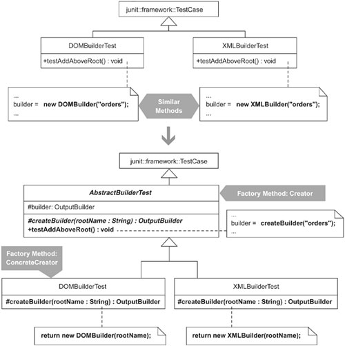

# 6장. 생성


[TOC]


## Replace Constructors with Creation Methods

어떤 클래스의 인스턴스를 생성할 때 그것이 제공하는 여러 생성자 중 어떤 것을 호출해야 할지 결정하기가 어렵다면, 인스턴스를 생성해 리턴하는 생성 메소드(creation method)로 각 생성자를 대체하여 그 용도가 명확히 드러나도록 한다.


### 동기

* JAVA와 C++의 생성자는 클래스의 이름과 같아야 한다.
* 생성자가 여러개라면
	* 프로그래머는 지정해야하는 파라미터를 조사하거나,
	* 생성자 코드를 직접 살펴 본후 어떤 생성자를 호출할지 선택해야한다.
* 생성자 자체만 보고 그 용도를 명확히 알기는 어렵다.
	* 생성자가 많을수록 프로그래머가 잘못 선택할 확률도 높아진다.
	* 프로그래머가 어떤 생성자를 호출해야 할지 몰라 고민하면 개발속도가 느려진다.
	* 여러 생성자 중 하나를 호출하는 코드는 생성되는 객체의 본질을 충분히 이해하지 못한 상태에서 작성되었을 가능성이 높다.
* 클래스에 이미 존재하는 생성자와 동일한 시그니처를 가지는 생성자를 추가해야한다면?
	* 새로 추가 할수 없다.
* 더 이상 사용되지 않는 생성자가 여전히 코드에 남아있을수 있다.
	* 대부분은 그 생성자가 더 이상 호출되지 않는 것을 프로그래머가 모른다.
	* 호출되지 않는 코드를 자동으로 선별해주는 개발 환경을 사용하지 않음
* 생성 메소드 사용
	* 생성 메소드
		* 클래스의 인스턴스를 생성해 리턴하는 메소드,
		* 정적 멤버일수도 아닐수도 있다.
	* 이름의 경우 생성자와 같은 제약이 없으므로, 그 용도가 명확히 드러나도록 이름을 지을수 있다.
	* 이름만 다르다면 동일한 수와 타입의 파라미터를 받는 생성 메소드가 두개 이상 존재할 수 있다.
	* 생성자보다는 호출되지 않는 생성 메소드를 찾는 것이 쉽다.
		* 특정 이름으로 주어진 메서드에 대한 검색 조건식을 만드는 것이 같은 이름의 생성자 중 하나를 찾는것보다 쉽다.
	* 단점은 표준이 아닌 방법을 통해 객체를 생성하게 된다.
        * 프로그래머는 각 클래스를 사용할 때마다 그 인스턴스를 생성하는 방법을 조사해야한다.
        * 그러나 지나치게 많은 생성자를 가진 클래스보다는 이런 비표준이 낫다.
    * 생성자가 너무 많은 클래스를 발견했다면 Extract Class 또는 Extract Subclass 리팩토링 고려
        * 문제의 클래스가 지나치게 많은 일을 하고 있다면 Extract Class
        * 클래스가 인스턴스 변수 일부만 사용하고 있다면 Extract Subclass

### 장점과 단점

```
 + 그 용도를 생성자보다 명확히 드러낼수 있다.
 + 동일한 수와 타입의 파라미터를 받는 생성자를 두 개 이상 만들수 없었던 제한이 사라진다.
 + 사용되지 않는 생성 코드를 찾기가 쉬워진다.
 - 객체를 생성할 때 표준이 아닌 방식을 사용하게 된다. 어떤 클래스에 대해서는 new 연산자를 사용하고, 또 어떤 클래스에 대해서는 생성 메소드를 통하게 된다.
```

### 절차

* 리팩터링을 시작하기 전에 실질 생성자(실질적인 생성 기능을 모두 구현하는 생성자로서, 다른 생성자들은 이 실질 생성자에게 작업을 위임하는 역할만 하는 경우), 실질 생성자가 없다면 Chain Constuctors 리팩터링을 적용해 하나 만든다.

1. 여러 생성자 중 하나를 선택하여 그것을 호출하는 클라이언트 코드를 찾는다.
1. extract Method 를 적용해 별도의 메소드(public static으로 지정) 뽑아낸다. => 생성 메소드
1. Move Method 를 적용해 이 생성 메소드를 해당 생성자를 포함하고 있는 클래스로 옮긴다.
1. 컴파일 후 테스트
1. 선택한 생성자를 사용하는 곳(즉 생성 메소드와 동일한 종류의 인스턴스를 사용하는 곳)을 모두 찾아서 앞에서 만든 생성 메소드를 호출하도록 한다.
1. 컴파일 후 테스트
1. 만약 선택한 생성자가 다른 생성자를 호출하고 있다면, 생성 메소드에서 선택한 생성자 대신 호출되는 생성자를 사용하도록 고친다. Inline Method 처럼 생성자를 인라인화
1. 컴파일 후 테스트
1. 생성 메소드로 바꾸고 싶은 다른 모든 생성자에 대해 단계 1~3을 반복
1. 클래스의 생성자가 해당 클래스 밖에서 더 이상 사용되지 않는다면, private 으로 만든다.
1. 컴파일 한다.

### 예제

* 많은 생성자가 있는 Loan
* ```java
public class Loan...
   public Loan(double commitment, int riskRating, Date maturity) {
      this(commitment, 0.00, riskRating, maturity, null);
   }

   public Loan(double commitment, int riskRating, Date maturity, Date expiry) {
      this(commitment, 0.00, riskRating, maturity, expiry);
   }

   public Loan(double commitment, double outstanding,
               int customerRating, Date maturity, Date expiry) {
      this(null, commitment, outstanding, customerRating, maturity, expiry);
   }

   public Loan(CapitalStrategy capitalStrategy, double commitment,
               int riskRating, Date maturity, Date expiry) {
      this(capitalStrategy, commitment, 0.00, riskRating, maturity, expiry);
   }

   public Loan(CapitalStrategy capitalStrategy, double commitment,
               double outstanding, int riskRating, Date maturity, Date expiry) {
      this.commitment = commitment;
      this.outstanding = outstanding;
      this.riskRating = riskRating;
      this.maturity = maturity;
      this.expiry = expiry;
      this.capitalStrategy = capitalStrategy;

      if (capitalStrategy == null) {
         if (expiry == null)
            this.capitalStrategy = new CapitalStrategyTermLoan();
         else if (maturity == null)
            this.capitalStrategy = new CapitalStrategyRevolver();
         else
            this.capitalStrategy = new CapitalStrategyRCTL();
      }
   }
```


* Loan Class
    * Term Loan : 만기일까지 완전히 상황해야 하는 대출
    * Revolver : 회전신용, 신용카드와 비슷하게 한도금액과 유효기일이 있다.
    * RCTL(revolving credit term loan) : 만기가 끝나면 컴론으로 전환되는 리볼버


* Load을 대출의 각 종류 하나씩을 표현하는 서브클래스의 추상 수퍼 클래스로 만들지 않은 이유
    * 대출의 종류를 구분하는 것은 객체에 포함된 필드가 아니라 원금, 수익, 기간등을 계산하는 방법
        * Term Loan 의 원금 계산 방법은 3가지가 있으므로 서브클래스를 3개 만들어야한다.
        * Loan 클래스 하나와 텀론을 위한 strategy 클래스 3개를 만드는 것이 더 낫다.
    * Loan 객체를 사용하는 어플리케이션에서는 어떤 대출을 다른 종류로 전환하는 기능이 필요.
        * Loan의 서브클래스 인스턴스를 완전히 다른 인스턴스로 바꾸는것보다 하나의 Loan 인스턴스에서 필드 몇개를 바꾸는 것이 더 쉽다.
    * 앞의 Loan 클래스는 생성자가 5개 있고, 마지막것이 실질 생성자다. 특별한 지식이 없으면 어떤 생성자가 Term 론을 생성하는지, 어떤 생성자가 Revolver를 생성하는지, 또 어떤 생성자가 RCTL을 생성하는지 알기 어렵다.
    * Loan 생성자에 암묵적으로 내재돼 있는 다른 지식을 모두 알수 있을까?

### Replce Constuctors with Creation Methods 적용

* Loan 의 생성자 중 하나를 골라 그것을 사용하는 클라이언트 코드를 찾는다.
* ```java
public class CapitalCalculationTests...
   public void testTermLoanNoPayments() {
      ...
      Loan termLoan = new Loan(commitment, riskRating, maturity);
      ...
   }
```

* Extract Method 리팩토링 적용해 createTermLoan 이라는 publich static 메소드를 만든다.
* ```java
 public class CapitalCalculationTests{
       public void testTermLoanNoPayments() {
          ...
          Loan termLoan = createTermLoan(commitment, riskRating, maturity);
          ...
       }
    }

 public static Loan createTermLoan(double commitment, int riskRating, Date maturity) {
        return new Loan(commitment, riskRating, maturity);
    }
```

* Move Method 적용해 생성 메소드를 Loan 클래스로 옮긴다. 후 테스트
* ```java
 public class Loan {
    public static Loan createTermLoan(double commitment, int riskRating, Date maturity) {
    	return new Loan(commitment, riskRating, maturity);
    }
}

 public class CapitalCalculationTest {
	public void testTermLoanNoPayments() {
      Loan termLoan =  Loan.createTermLoan(commitment, riskRating, maturity);
   }
}
```

* 앞에 선택한 생성자를 사용하는 모든 부분을 찾아 createTermLoan() 을 호출하도록 수정 후 테스트
* ```java
public class CapitalCalculationTest {
   public void testTermLoanOnePayment() {

	/* Loan termLoan = new Loan(commitment, riskRating, maturity); */
	Loan termLoan = Loan.createTermLoan(commitment, riskRating, maturity);
    
   }
}
```

* 생성자를 호출하는 곳은 createTermLoan() 뿐이므로, Inline Method를 적용해 제거. 후 테스트
* ```java
public class Loan {

	/* public Loan(double commitment, int riskRating, Date maturity) {
		this(commitment, 0.00, riskRating, maturity, null);
	} */

	public static Loan createTermLoan(double commitment, int riskRating, Date maturity) {
		return new Loan(commitment, 0.00, riskRating, maturity, null);
   }
```

* 다른 생성자에 대해 단계 반복
* ```java
public class CapitalCalculationTest...
   public void testTermLoanWithRiskAdjustedCapitalStrategy() {
      ...
      Loan termLoan = new Loan(riskAdjustedCapitalStrategy, commitment,
                               outstanding, riskRating, maturity, null);
      ...
   }
```


* 생성자에 널을 전달하는 것은 좋지 않은 관행.
* 가독성을 떨어뜨린다.
* 일반적으로 프로그래머가 자신의 필요에 정확히 부합하는 생성자를 찾을수 없는 상황에서 새로운 생성자를 추가하는 대신에 기존의 범용 생성자를 호출하기 때문
* ```java
 public class CapitalCalculationTest...
	public void testTermLoanWithRiskAdjustedCapitalStrategy() {
		...
		Loan termLoan =
			Loan.createTermLoan(riskAdjustedCapitalStrategy, commitment, outstanding, riskRating, maturity /*, null*/);
      ...
   }

 public class Loan...
   public static Loan createTermLoan(double commitment, int riskRating, Date maturity) {
      return new Loan(commitment, 0.00, riskRating, maturity, null);
   }

 public static Loan createTermLoan(CapitalStrategy riskAdjustedCapitalStrategy
	double commitment, double outstanding, int riskRating, Date maturity) {
	return new Loan(riskAdjustedCapitalStrategy, commitment,
    outstanding, riskRating, maturity, null);
}
```

* createTermLoanWithStrategy(..) 와 같은 또 다른 이름으로 메소드를 만드는 대신에 createTermLoan(..) 메소드를 오버로드한 이유
	* CapitalStrategy 타입의 파라미터가 오버로드된 두 createTermLoan(..) 메소드의 차이점을 충분히 나타낸다고 생각


* 마지막으로 Loan 의 유일한 생성자가 된 실질 생성자의 가시성을 변경해야 한다.
	* Loan은 서브클래스를 가지지 않고 생성자를 호출하는 외부 코드도 없으므로, private로 만든다.
	* 제대로 동작하는지 확인하기 위해 컴파일 후 테스트한다.
* ```java
public class Loan...
	private Loan(CapitalStrategy capitalStrategy, double commitment,
                double outstanding, int riskRating, Date maturity, Date expiry)...
```

* 생성 메소드에 많은 수의 파라미터를 전달해야 하므로 Introduce Parameter Object 적용 고려

### 변형

* 객체 구분 파라미터를 사용하는 생성 메소드(Parameterized Creation Method) : 생성 메서드에 파라미터를 추가해 그 값에 따라 생성할 객체의 종류를 정하도록 함
    * 클래스가 지원하는 객체 설정의 모든 경우를 따져보면 50여개의 생성 메소드 필요
    * 50개의 메소드 작성은 의미가 없어 보인다.
    * 생성 메소드를 모든 객체 설정에 대해 하나씩 만들 필요는 없다.
    * 빈빈하게 사용되는 설정에 대해서만 생성 메소드 작성, 몇몇 public 생성자를 남겨 다른 경우 처리
    * 생성 메소드의 개수를 줄이기 위해 파라미터 사용을 고려


* 팩토리 추출 (Extract Factory)

	* 생성 메소드가 많으면, 클래스의 주요 책임이 잘 들어나지 않을수 있지 않을까?
	* 리팩토링을 통해 생성 메소드를 하나의 팩토리로 모은다.
	* LoanFactory는 Abstract Factory 패턴에 해당하는 것이 아니다.
	* 팩토리는 어떤 상속 구조에 포함되지 않는 독립적인 클래스로 구현되는 경우가 많다.

### FAQ

* 생성메소드(Creation Method)와 팩토리메소드(Factory Method)
	* 1995년 Factory Method를 작성한 저자의 방식을 따르면, 객체를 생성하는 모든 메소드가 그 패턴의 장점인 느슨한 결합 같은 것을 제공하지 않는다
    * 클래스를 생성하는 일반 메소드를 "생성 메소드"라고 부른다.
    * 모든 팩토리 메소드가 생성메소드에 해당하지만 그 역은 성립하지 않는다
    * 팩터리 : 하나 이상의 생성 메서드를 구현하는 클래스
    * 팩터리 메서드 : 클래스나 인터페이스 타입을 리턴하는 인스턴스 메서드
    * 추상 팩너리 : 서로 관계된 또는 서로 의존적인 객체의 집합을 그들의 구체적인 크래스를 지정하지 않고 생성하는 인터페이스

## Move Creation Knowledge to Factory

어떤 클래스의 인스턴스를 생성하는 데 사용되는 데이터와 코드가 여러 클래스에 퍼져 있다면, 그 생성지식을 하나의 팩터리 클래스로 옮긴다.


### 동기

* 문어발 생성(creation sprawl) : 객체 생성을 위한 지식이 여러 클래스에 퍼져 있을 때
    * 객체 생성과 상관없는 클래스가 생성에 대한 책임의 일부를 맡고 있다는 뜻
    * 문어발 솔루션 냄새
* Factory 패턴
	* 객체 생성 로직과 외부 설정값에 대한 처리 로직을 캡슐화한다.
	* 예) NodeFactory는 StringNode 객체를 생성하고, 옵션에 따라 이 객체를 DecodingStringNode로 감싸 추가기능을 부여하기도 하는 일을 하는 팩터리.
	* 
* 팩터리 내의 생성 로직이 너무 복잡해졌다면, 추상 팩터리 패턴으로 발전시키는 것도 의미가 있다.
	* 
* 팩터리 패턴이 남용된 시스템
	* 모든 객체 생성에 직접 생성(new StingNode(...)의 형태로)이 없이 팩터리를 통해 생성하는 경우
	* 팩터리 패턴의 남용은 생성할 객체의 종류를 선택하는 코드 또는 그 생성로직을 클라이언트 코드와 분리햐려 할 때 많이 발생한다.
	* ```java
	public class Query...
		public void createQuery() throws QueryException {
			if (usingSDVersion52()) {
            	query = new QuerySD52();
                ...
			} else {
            	query = new QuerySD51();
                 ...
			}
        ```
	* ```java
	public class Query...
			public void createQuery() throws QueryException...
				query = queryFactory.createQuery();
      			...
	```
* 팩터리의 도입으로 인해 코드의 설계가 개선되거나, 직접 생성할 때는 불가능했던 방법으로 객체를 생성하거나 상태를 조정하는 것이 가능하게 되지 않는다면, 팩터리를 사용하지 않는 편이 낫다.

### 장점과 단점

```
+ 생성 로직과 외부 설정값 처리 로직을 한 곳으로 모은다.
+ 생성 로직으로부터 클라이언트를 분리한다.
- 직접 생성으로도 충분한 경우라면, 괜히 설계만 복잡하게 만들 뿐이다.
```

### 절차

1. 생성 클래스가 대상 클래스의 인스턴스를 만들 때 생성 메서드를 통하지 않는다면, 필요할 경우 생성 클래스나 대상 클래스를 수정해 생성 메서드를 사용하도록 한다. 컴파일 후 테스트
	* 생성 클래스 : 인스턴스를 만드는 클래스
	* 대상 클래스 : 인스턴스가 만들어지는 클래스
1. 팩터리로 사용할 클래스를 만든다.(이름은 대상 클래스의 이름을 고려한다) 컴파일한다.
1. Move Method 리팩터링을 적용해 생성 메서드를 팩터리 클래스로 옮긴다. 생성 메서드가 static 이라도 , 옮긴 후에는 인스턴스 메서드로 바꿀 수 있다. 컴파일한다.
1. 팩터리의 인스턴스를 만들고, 이를 통해 대상 클래스의 인스턴스를 얻도록 생성 클래스를 수정한다. 컴파일 후 테스트한다.
	* 단계 3에 의해 다른 생성 클래스들이 더 이상 컴파일 되지 않았을 것인데, 그들에 대해 이 단계를 반복한다.
1. 다른 클래스의 데이터와 메서드가 여전히 생성 작업에 사용되고 있을 수 있다. 무엇이든 팩터리에 있는 것이 더 나아 오니다면 팩터리로 옮겨서, 팩터리가 생성과 관련된 작업을 가능한 많이 담당할 수 있도록 한다. 컴파일 후 테스트한다.
	* 이 단계에서 팩터리 인스턴스를 생성하는 코드 또는 그 코드를 사용하는 부분을 다른 곳으로 옮기는 작업이 포함될 수도 있다.

### 예제

* 파서의 클라이언트는 문자열을 파싱할 때 옵션을 지정할 수 있다.
	* 이 옵션은 첫번째 그림과 같이 StringNode 인스턴스를 생성하는 부분까지 계속 전달이 된다.
	* 새로운 옵션이 추가될 때, Parser, StringParser, StringNode 에 코드를 추가해야 한다.
	 
* StringNode는 이미 팩터리이지만, StringNode가 인스턴스 생성에 관련된 모든 로직을 통합하는 데 도움이 안되며, 단순하게 유지하는 것이 더 낫다.
	* 따라서 새로운 팩터리를 도입한다.

1. StringParser는 StringNode 객체를 생성한다. StringParser가 StringNode 객체를 만들 때 생성 메서드를 사용하도록 고친다.
```java
    public class StringParser {
        public Node find(...) {
            ...
            return StringNode.createStringNode( textBuffer, textBegin,
            									textEnd, parser.shouldDecodeNodes() );
        }
    }

    public class StringNode {
        public static Node createStringNode ( StringBuffer textBuffer, int textBegin,
        														int textEnd, boolean shouldDecode ) {
            if (shouldDecode)
                return new DecodingStringNode( new StringNode(textBuffer, textBegin, textEnd ));
        	return new StringNode(textBuffer, textBegin, textEnd);
    }
```

1. StringNode 객체를 위한 팩터리 클래스를 만든다. StringNode는 Node 타입이므로, 클래스 이름을 NodeFactory로 한다.
```java
public class NodeFactory {
}
```

1. Move Method 리팩터링을 적용해서 StringNode의 생성 메서드를 NodeFactory로 옮긴다.
	* 클라이언트 코드가 특정 팩터리 구현과 컴파일 시에 엮이는 것은 좋지 않으므로,
	* 옮긴 메서드를 인스턴스 멤버로 만드는 것이 좋다.
	* 기존 생성 메서드는 제거한다.
	* ```java
    public class NodeFactory {
		public /*static*/ Node createStringNode(StringBuffer textBuffer, int textBegin,
        											int textEnd, boolean shouldDecode) {
			if (shouldDecode)
				return new DecodingStringNode(new StringNode(textBuffer, textBegin, textEnd));
            return new StringNode(textBuffer, textBegin, textEnd);
		}
	}

	public class StringNode{
		/* public static Node createStringNode (
        	...
        } */
    }
```
	* 이 작업 후에는, StringParser와 StringNode의 생성 메서드를 호출하는 클라이언트 코드가 컴파일되지 않을 것이다.
	* 이것은 다음 단계에서 해결한다.

1. StringParser가 NodeFactory 객체를 만들고, 이를 통해 StringNode 객체를 생성하도록 수정한다.
	* 단계 3의 작업으로 인해 컴파일되지 않는 다른 클라이언트 코드에도 비슷한 작업을 해준다.
```java
public class StringParser...
	public Node find(...) {
		...
		NodeFactory nodeFactory = new NodeFactory();
		return nodeFactory.createStringNode( textBuffer, textBegin, textEnd, parser.shouldDecodeNodes() );
	}
```

1. 생성관련코드 중 적절한 것을 NodeFactory로 최대한 옮겨 문어발 생성 냄새를 줄이거나 제거할 차례인데, 이 경우에는 Parser 클래스에 그런 코드가 있다. StringParser가 생성 메서드에 파라미터로 넘길 값을 얻기 위해 Parser의 메서드를 호출하고 있다.
```java
public class StringParser...
	public Node find(...) {
		...
		NodeFactory nodeFactory = new NodeFactory();
		return nodeFactory.createStringNode( textBuffer, textBegin, textEnd, parser.shouldDecodeNodes() );
  }
```
	* Parser에 있는 다음 코드를 NodeFactory로 옮긴다.
	* ```java
	public class Parser...
		private boolean shouldDecodeNodes = false;

		public void setNodeDecoding(boolean shouldDecodeNodes) {
			this.shouldDecodeNodes = shouldDecodeNodes;
		}

		public boolean shouldDecodeNodes() {
			return shouldDecodeNodes;
		}
	```
	* 여기서 setNodeDecoding(...)과 같은 메서드를 호출하는 클라이언트는 Parser의 클라이언트이다.
	* NodeFactory는 StringParser가 내부적으로 인스턴스로 만들어 사용하므로, Parser의 클라이언트에서는 볼 수 없다.
	* 따라서 NodeFactory는 Parser와 StringParser 에서 모두 접근가능해야 한다.

1. NodeFactory로 옮기려는 Parser 코드에 Extract Class 리팩터링을 적용하여 StringNodeParsingOption 클래스가 생긴다.
```java
public class StringNodeParsingOption {
	private boolean decodeStringNodes;

	public boolean shouldDecodeStringNodes() {
		return decodeStringNodes;
	}

	public void setDecodeStringNodes(boolean decodeStringNodes) {
		this.decodeStringNodes = decodeStringNodes;
	}
}
```

1. 이 새로운 클래스의 도입으로 !shouldDecodeNodes 필드와 그에 대한 get/set 메서드가 대체된다.
```java
public class Parser {
	private StringNodeParsingOption stringNodeParsingOption = new StringNodeParsingOption();

    /* private boolean shouldDecodeNodes = false;

    public void setNodeDecoding(boolean shouldDecodeNodes) {
		this.shouldDecodeNodes = shouldDecodeNodes;
    }

	public boolean shouldDecodeNodes() {
		return shouldDecodeNodes;
	} */

	public StringNodeParsingOption getStringNodeParsingOption() {
		return stringNodeParsingOption;
	}

	public void setStringNodeParsingOption(StringNodeParsingOption option) {
		stringNodeParsingOption = option;
	}
```

1. Parser의 클라이언트는 StringNodeParsingOption 인스턴스를 생성해 상태를 조정한 다음 Parser에 넘겨서 StringNode의 디코딩 옵션을 켠다.
```java
class DecodingNodeTest...
	public void testDecodeAmpersand() {

        StringNodeParsingOption decodeNodes = new StringNodeParsingOption();

        decodeNodes.setDecodeStringNodes(true);
        parser.setStringNodeParsingOption(decodeNodes);
        /* parser.setNodeDecoding(true); */
        ...
  }
```

1. StringParser는 새로운 클래스를 통해 StringNode의 디코딩 옵션값을 얻는다.
```java
public class StringParser...
  ...
	public Node find(...) {
		NodeFactory nodeFactory = new NodeFactory();
		return nodeFactory.createStringNode( textBuffer, textBegin, textEnd,
        						parser. getStringNodeParsingOption().shouldDecodeStringNodes());
	}
```

1. 이제 StringNodeParsingOption을 NodeFactory로 병합하기 위해 Inline Class 리팩터링을 적용한다.
```java
    public class StringParser{
        public Node find(...) {
            ...
            return parser.getStringNodeParsingOption().createStringNode( textBuffer, textBegin, textEnd
                                               /*,parser.getStringNodeParsingOption().shouldDecodeStringNodes() */ );
        }
    }

    public class StringNodeParsingOption{
        private boolean decodeStringNodes;

        public Node createStringNode( StringBuffer textBuffer, int textBegin, int textEnd, boolean shouldDecode) {
            if (decodeStringNodes)
                return new DecodingStringNode( new StringNode(textBuffer, textBegin, textEnd));
            return new StringNode(textBuffer, textBegin, textEnd);
        }
    }
```

1. StringNodeParsiongOption 클래스 이름을 NodeFactory로 바꾸고 Parser에 있는 NodeFactory 타입의 필드와 그에 대한 get/set 메서드의 이름을 바꾼다.
```java
	public class /*StringNodeParsingOption*/ NodeFactory {...}

    public class Parser {
        private NodeFactory nodeFactory = new NodeFactory();

        public NodeFactory getNodeFactory() {
            return nodeFactory;
        }

        public void setNodeFactory(NodeFactory nodeFactory) {
            this.nodeFactory = nodeFactory;
        }
	}
```

## Encapsulate Classes with Factory

클라이언트가 한 패키지 내의, 공통 인터페이스를 가지는 클래스들의 인스턴스를 직접 생성하고 있다면,
그 클래스의 생성자를 클라이언트가 직접 볼 수 없게 바꾸고 클라이언트는 팩터리를 통해 그 인스턴스를 얻도록 한다.


### 동기

* 클라이언트가 사용할 객체의 클래스를 직접적으로 알아야 한다면, 그 인스턴스를 직접 생성할 수 있어도 좋다.
* 아래와 같은 경우일 때 인스턴스 생성은 팩터리에게 맡기고, 그 클래스들 자체는 숨겨서 보이지 않게 할 수 있다.
	* 클라이언트가 사용할 객체의 클래스를 알 필요가 없다.
	* 같은 패키지에 속해 있고 공통 인터페이스를 구현하고 있는데 이런 조건이 변할 일도 없다.

### 장단점

```
 + 용도를 쉽게 알아볼 수 있는 생성 메서드를 제공하여, 클라이언트가 원하는 종류의 객체를 쉽게 생성할 수 있도록 한다.
 + 공개될 필요가 없는 클래스들을 숨겨 패키지의 '개념적 무게'를 줄인다.
 + 클라이언트가 '구현에 대해서가 아니라, 인터페이스에 대해 프로그래밍'하게 된다.
 - 새로운 종류의 객체가 필요할 경우에는 생성 메서드를 추가하거나 수정해야 한다.
 - 팩터리의 소스 코드가 아닌 바이너리만 배포할 경우에는 클라이언트가 쉽게 수정할 수 없게 된다.
 ```

### 절차

1. 대상 클래스 중 하나를 선택하고 그 생성자 중 하나를 골라 호출하는 클라이언트 코드를 찾는다.
	* Extract Method를 사용하여 그 코드를 public static 메서드로 만든다.(생성 메서드)
	* Move Method를 통해 이 생성 메서드를 대상 클래스의 수퍼클래스로 옮긴다.
	* 컴파일 후 테스트한다.
2. 앞에서 선택한 생성자를 호출하는 곳 중 단계 1에서 만든 생성 메서드와 같은 종류의 객체를 생성하는 코드를 모두 찾아 생성 메서드를 호출하도록 수정한다.
	* 컴파일 후 테스트한다.
3. 앞에서 선택한 생성자로 생성할 수 있는 다른 모든 종류의 객체에 대해서도 단계 1,2의 작업을 반복한다.
4. 앞에서 선택한 생성자의 접근 지정자를 public 이외의 것(private,protected 또는 디폴트)으로 바꿔 클라이언트로부터 숨긴다.
	* 컴파일 후 테스트한다.
5. 나머지 대상 클래스에 대해 단계 1~4를 반복한다.

### 예제

* 어떤 관계형 데이터베이스에서 객체를 읽어 들이거나 저장하는데 사용되던 객체-관계 매핑 코드.

```java
package descriptors;

public abstract class AttributeDescriptor...
   protected AttributeDescriptor(...)

public class BooleanDescriptor extends AttributeDescriptor...
   public BooleanDescriptor(...) {
      super(...);
   }

public class DefaultDescriptor extends AttributeDescriptor...
   public DefaultDescriptor(...) {
      super(...);
   }

public class ReferenceDescriptor extends AttributeDescriptor...
   public ReferenceDescriptor(...) {
      super(...);
   }
```

* 추상클래스 AttributeDescriptor의 생성자는 protected이고, 서브클래스들의 생성자는 모두 public 이다.
* 예제에는 서브클래스가 3개뿐이지만 실제 코드에는 10여개나 있었다.

```java
protected List createAttributeDescriptors() {
   List result = new ArrayList();
   result.add(new DefaultDescriptor("remoteId", getClass(), Integer.TYPE));
   result.add(new DefaultDescriptor("createdDate", getClass(), Date.class));
   result.add(new DefaultDescriptor("lastChangedDate", getClass(), Date.class));
   result.add(new ReferenceDescriptor("createdBy", getClass(), User.class,
      RemoteUser.class));
   result.add(new ReferenceDescriptor("lastChangedBy", getClass(), User.class,
      RemoteUser.class));
   result.add(new DefaultDescriptor("optimisticLockVersion", getClass(), Integer.TYPE));
   return result;
}
```

* DefaultDescriptor는 Integer 와 Date 타입의 매핑을 나타내는데 사용되고 있음을 알 수 있다.
* 먼저 Integer 타입의 매핑에 사용되는 서브 클래스를 위한 생성 메서드를 만든다.
	* Extract Method를 적용해 forInteger(...)라는 이름의 public static 생성 메서드를 만든다.

```java
protected List createAttributeDescriptors()...
   List result = new ArrayList();
   result.add(forInteger("remoteId", getClass(), Integer.TYPE));
   ...

 public static DefaultDescriptor forInteger(...) {
 return new DefaultDescriptor(...);
 }
 ```
 
* forInteger(...)는 항상 Integer 타입의 매핑을 위한 인스턴스를 생성하기 때문에 Integer.TYPE을 파라미터로 넘길 필요가 없다.

```java
protected List createAttributeDescriptors()...
   List result = new ArrayList();
   result.add(forInteger("remoteId", getClass() /*, Integer.TYPE*/));
   ...

public static DefaultDescriptor forInteger(...) {
   return new DefaultDescriptor(..., Integer.TYPE);
}
```

* 클라이언트가 AttributeDescriptor의 서브클래스를 사용할 때에 AttributeDescriptor가 제공하는 안터페이스를 통하는 것이 좋으므로, forInteger(...)의 리턴 타입도 DefaultDescriptor에서 AttributeDescriptor로 바꾼다.

```java
public static AttributeDescriptor /*DefaultDescriptor*/ forInteger(...)...
Move Method를 적용해 이 메서드를 AttributeDescriptor로 옮기고 클라이언트 코드도 수정한다.
public abstract class AttributeDescriptor {
public static AttributeDescriptor forInteger(...) {
   return new DefaultDescriptor(...);
}


protected List createAttributeDescriptors()...
   List result = new ArrayList();
   result.add(AttributeDescriptor.forInteger(...));
   ...
```

* 컴파일 후 테스트 한다.
* Integer 타입의 매핑을 위해 DefaultDescriptor의 생성자를 호출하는 곳을 모두 찾아 새로 만든 생성 메서드를 호출하도록 수정한다.

```java
protected List createAttributeDescriptors() {
   List result = new ArrayList();
   result.add(AttributeDescriptor.forInteger("remoteId", getClass()));
   ...
   result.add(AttributeDescriptor.forInteger("optimisticLockVersion", getClass()));
   return result;
}
```

* 위 단계를 반복해 DefaultDescriptor의 생성자가 생성할 수 있는 다른 종류의 객체에 대한 생성 메서드를 만든다.

```java
public abstract class AttributeDescriptor {
   public static AttributeDescriptor forInteger(...) {
      return new DefaultDescriptor(...);
   }
   
public static AttributeDescriptor forDate(...) {
	return new DefaultDescriptor(...);
}
   
public static AttributeDescriptor forString(...) {
	return new DefaultDescriptor(...);
}
```

* DefaultDescriptor의 생성자를 protected로 바꾼다.

```java
public class DefaultDescriptor extends AttributeDescriptor {
protected DefaultDescriptor(...) {
	super(...);
}
```

* 컴파일 후 확인한다.
* AttributeDescriptor의 다른 서브클래스들에 대해 위 단계를 반복한다.
* 작업이 완료되면 새로운 코드는 다음과 같은 특징을 가지게 된다.
	* AttributeDescriptor의 서브클래스들은 그 수퍼클래스를 통해 접근해야 한다.
	* 클라이언트는 AttributeDescriptor가 제공하는 인터페이스를 통해 서브클래스 인스턴스를 얻음을 보장한다.
	* 클라이언트가 AttributeDescriptor의 서브클래스 인스턴스를 직접 생성하지 못하게 한다.
	* 다른 프로그래머들은 AttributeDescriptor의 서브클래스가 public이 아니며 클라이언트가 서브클래스 인스턴스를 공통 인터페이스를 통해 사용할 수 있다는 사실을 이해하게 된다.

### 변형

내부 클래스의 캡슐화

* java의 java.util.Collections 클래스


* 컬렉션 객체를 수정 불가 또는 동기화 상태로 만들 수 있는 기능을 제공하기 위해 Proxy 패턴을 도입햇다.
* Collections 클래스의 내부 클래스로 정의한 후 Collections 클래스에 생성 메서드를 추가해 프로그래머가 필요로 하는 종류의 프락시를 얻을 수 있도록 했다.
* 각각의 내부 클래스에는 컬렉션을 받아, 수정할 수 없거나 동기화되도록 보호한 다음, 그 객체를 List나 Set 과 같은 일반적인 인터페이스 타입으로 리턴한다. 따라서 프로그래머가 알아야 할 클래스 개수는 늘리지 않으면서 필요한 기능을 제공한다.
* java.util.Collections 클래스는 팩터리의 예이기도 하다.

### 참고

* 구현에 대해서가 아니라, 인터페이스에 대해 프로그래밍 한다.
* 적용 전


* 적용 후


## Introduce Polymorphic Creation with Factory Method

한 상속 구조 내의 클래들이 어떤 메서드를 각자 구현하는데 객체 생성 단계만 제외하고 나머지가 서로 유사하다면,
그 메서드를 수퍼 클래스로 옮기고 객체 생성은 펙터리 메소드(factory method)에 맡기도록 한다.



### 동기

* Factory Method는 단순히 공통 인터페이스를 가지는 클래스들을 통해 구현되지만, 실제로 상속 구조내에 구현되는 것이 일반적이다.
* 프레임워크 설계에 Factory Method을 많이 사용한다.( 확장성 and 다형성 )
* Factory method 패턴은 Template Method 패턴과 함께 사용되는 경우가 많다.

### 장점과 단점

```
 + 객체를 생성하는 과정에서의 코드 중복을 제거.
 + 객체를 생성하는 곳이 실제로는 어디고, 또 어떻게 오버라이드하면 되는지 잘 드러난다.
 + Factory Method에서 인스턴스로 만들 클래스가 특정 타입을 구현하도록 강제할 수 있다.
 - 일부 서브클래스가 구현하는 Factory Method에는 불필요한 파라미터를 어쩔 수 없이 남겨둬야 할 수 있다.
```

### 절차 및 예제

#### 사용되는 상황

* 형제 서브클래스들이 어떤 메서드를 각각 구현하고 있는데, 객체를 생성하는 단계만 제외하고는 거의 유사한 경우
* 수퍼클래스와 서브클래스가 어떤 메서드를 각각 구현하고 있는데, 객체를 생성하는 단계만 제외하고는 거의 유사한 경우

### 예제

* XMLBuilder을 생성하여 사용하다, DOMBuilder가 만들 필요성이 생겼다, DOM(Document Object Model)구조를 통해 XML문서를 생성하고 그 DOM 구조에 클라이언트가 접근할 수 있도록 해주는 클래스이다.
* DOMBuilder 클래스를 구현하기 위해 나는 XMLBuilder 클래스를 위해 이미 작성해 놓은 테스트 코드를 사용하여 DOMBuiler 인스턴스를 만들어 사용하도록 고치기만 하면 된다.

```java
public class DOMBuilderTest extends TestCase...
    private OutputBuilder builder;

    public void testAddAboveRoot() {
    	String invalidResult =
            "<orders>" +
            "<order>" +
            "</order>" +
            "</orders>" +
            "<customer>" +
            "</customer>";
        builder = new DOMBuilder("orders");  // used to be new XMLBuilder("orders")
        builder.addBelow("order");
        try {
        builder.addAbove("customer");
        fail("expecting java.lang.RuntimeException");
        } catch (RuntimeException ignored) {}
    }
```

DOMBuilder 클래스와 XMLBuilder가 유사하며 이와동일한 메서드가 더 존재한다.


#### 1 단계

* 유사 메서드중 하나를 선택해, 객체 생성 단계가 별도의 객체 생성 메서드에서 수행되도록 수정한다. 객체를 생성하는 코드에 Extract Method 리팩토링을 적용해도 되고, 이미 객체 생성 메서드가 있었다면 그 메서드를 사용해도 된다.
* 객체 생성 메서드에서는 createBuilder 또는 newProduect와 같은 일반화된 이름을 붙이기 바란다.
* 컴파일 후 테스트

```java
public class DOMBuilderTest extends TestCase...
  
    protected OutputBuilder createBuilder(String rootName) {
	    return new DOMBuilder(rootName);
    }

    public void testAddAboveRoot() {
        String invalidResult =
            "<orders>" +
            "<order>" +
            "</order>" +
            "</orders>" +
            "<customer>" +
            "</customer>";
        builder = createBuilder("orders");
        builder.addBelow("order");
        try {
            builder.addAbove("customer");
            fail("expecting java.lang.RuntimeException");
        } catch (RuntimeException ignored) {}
	}
```

#### 2 단계

* 유사 메서드에 대해 1단계와 유사한 과정을 반복한다.
* 컴파일 후 테스트

```java
public class XMLBuilderTest extends TestCase...
    private OutputBuilder createBuilder(String rootName) {
	    return new XMLBuilder(rootName);
    }
    public void testAddAboveRoot() {
    	String invalidResult =
            "<orders>" +
            "<order>" +
            "</order>" +
            "</orders>" +
            "<customer>" +
            "</customer>";
        builder = createBuilder("orders");
        builder.addBelow("order");
        try {
        builder.addAbove("customer");
        fail("expecting java.lang.RuntimeException");
        } catch (RuntimeException ignored) {}
    }
```

#### 3 단계

* 수퍼 클래스를 수정할 차례이며, 수퍼클래스를 직접 수정을 할 수 없는 경우나 수정하지 않아되 판단되는 경우 Extract Superclass 리펙토링을 이용하여 작업을 한다.
* 컴파일 후 테스트

```java
public class AbstractBuilderTest extends TestCase{

}

public class XMLBuilderTest extends AbstractBuilderTest

public class DOMBuilderTest extends AbstractBuilderTest
```

#### 4 단계

* 유사 메서드에 Form Template Method 리팩터링을 적용한다. 이 과정에는 Pull Up Method Pull Up Field리팩터링이 포함되는데, 조언을 꼭 따라야 한다.

```
 * 조언
타입 검사를 엄격하게 하는 프로그래밍 언어를 사용하고, 옮기려는 메서드에서 두 서브 클래스에는 있지만, 
수퍼클래스에는 없는 메서드를 호출한다면, 해당 메서드를 수퍼클래스에 추상 메서드로 선언하라
```

* 객체 생성 메서드에 적용할 조언임.
* Pull Up Field 리펙토링을 통해 builder 필드를 슈퍼클래스로 옮긴다.

```java
public class AbstractBuilderTest extends TestCase {
  protected OutputBuilder builder;
}

public class XMLBuilderTest extends AbstractBuilderTest...
// private OutputBuilder builder;

public class DOMBuilderTest extends AbstractBuilderTest...
// private OutputBuilder builder;
```

* testAddAboveRoot()메서드를 수퍼클래스로 옮기려 하는데, 그 안에서 호출하는 메서드에 대응하는 추상 메서드를 수퍼클래스에서 선언.

```java
public abstract  class AbstractBuilderTest extends TestCase {
    protected OutputBuilder builder;

	protected abstract OutputBuilder createBuilder(String rootName);
}
```

* 이제 testAddAboveRoot() 메서드를 AbstractBuilderTest로 옮길 수 있다.

```java
public abstract class AbstractBuilderTest extends TestCase...
  public void testAddAboveRoot() {
    String invalidResult =
    "<orders>" +
      "<order>" +
      "</order>" +
    "</orders>" +
    "<customer>" +
    "</customer>";
    builder = createBuilder("orders");
    builder.addBelow("order");
    try {
      builder.addAbove("customer");
      fail("expecting java.lang.RuntimeException");
    } catch (RuntimeException ignored) {}
  }
```

* 컴파일 후 테스트

#### 5 단계

* 관련 형제 클래스에 또 다른 유사 메서드가 존재하고 그 메서드로 이미 만들어 놓은 팩터리 메서드를 사용하도록 수정하는 것이 좋다고 판된되면, 1-4 단계를 반복하라.

#### 6 단계

* ConcreteCreator 클래스들이 팩터리 메서드 가운데 다수가 동일한 객체 생성 코드를 포함하고 있다면, 수퍼클래스에 선언된 팩터리 메서드로 그 코드를 옮겨 객체 생성에 대한 디폴트 구현으로 삼는다.
* 컴파일 후 테스트


## Encapsulate Composite with Builder
컴포짓 구조를 생성하는 과정이 반복적으로 수행되고 복잡하며 에러 발생 가능성도 많은 상태라면,
그 세부 사항을 처리하는 별도의 빌더를 제공하여 컴포짓 구조를 쉽게 생성할 수 있도록 한다.


### 동기

* 컴포짓 구조를 빌더로 캡슐화 하는 이유
	* 반복적인 작업과 에러 발생 가능성을 줄이고, 객체 구조 생성 방법을 단순화 한다.
	* 클라이언트 코드와 컴포짓 구조를 다루는 코드의 결합 관계를 제거한다.


* 단단한 결합의 클라이언트와 컴포짓 구조


* 빌더로 캡슐화된 컴포짓 구조


* 빌더 패턴의 의도
	* 어떤 객체 구조를 생성하는 과정을 클라이언트 대신에 빌더 객체가 맡도록 하는 것
	* 에러 발생 가능성을 줄이고, 생성 과정을 단순화 한다.
	* 복잡한 과정으로부터 클라이언트 코드를 분리한다.
		* 명확한 인터페이스가 필요하다. -> 생성 과정을 단순하게 만들기 위해 내부에서 많은 일을 하기 때문


### 장점과 단점

```
 + 컴포짓 구조를 생성하는 클라이언트의 코드를 단순화한다.
 + 반복적이고 에러발생 가능성이 높은 컴포짓 구조 생성 작업의 단점을 개선한다.
 + 클라이언트 코드와 컴포짓 구조 사이의 결합을 느슨하게 한다.
 + 캡슐화된 컴포짓 구조 또는 복잡한 객체의 여러 다른 표현이 가능하게 한다.
 -  인터페이스의 의도가 덜 명확해질 수 있다.
```


### 절차

1. 빌더 클래스를 만든다.
	* 노드가 하나인 컴포짓 구조 생성, 결과 리턴 메서드 추가
	* 컴파일, 테스트
1. 빌더에 자식 노드를 생성하는 기능을 추가한다.
	* 자식을 생성하고 위치를 지정하는 메서드 구현
	* 컴파일, 테스트
1. 기존의 컴포짓 생성 코드에 속성, 값을 변경하는 부분이 있다면, 기능을 구현한다.
	* 컴파일, 테스트
1. 클라이언트에서 사용하기 편한지 생각해보고, 개선한다.
1. 기존의 컴포짓 생성 코드를 리팩터링하여 빌더를 사용하도록 한다.
	* 컴파일, 테스트


### 예제

* 빌더로 캡슐화하려는 대상 TagNode 컴포짓 구조 객체
	* XML의 생성을 쉽게 해주는 컴포짓 구조 객체, 자신이 포함하고 있는 모든 TagNode? 객체 구조에 대한 XML 문자열을 리턴한다.


* 한 개의 노드로 구성된 컴포짓 구조를 생성할 수 있는 빌더를 만든다.
	* ```java
    public class TagBuilderTest {

        @Test
        public void testBuildOneNode() throws Exception {
            String expectedXml = "<flavors/>";
            String actualXml = new TagBuilder("flavors").toXml();
            assertXMLEqual(expectedXml, actualXml);
        }
    }
    ```
	* ```java
    public class TagBuilder {

        private TagNode rootNode;

        public TagBuilder(String rootTagName) {
            this.rootNode = new TagNode(rootTagName);
        }

        public String toXml() {
            return rootNode.toString();
        }
    }
    ```

* 컴파일 후 테스트한다.

* TagBuilder가 자식 객체를 처리할 수 있도록 한다.
	* 루트 노드에 자식 하나를 추가하는 경우를 처리한다.
	* ```java
    public class TagBuilderTest {

        @Test
        public void testBuildOneChild() throws Exception {
            String expected = "<flavors>" +
            						"<flavor/>" +
                              "</flavors>";
            TagBuilder builder = new TagBuilder("flavors");
            builder.addChild("flavor");
            String actualXml = builder.toXml();

            assertXMLEqual(expected, actualXml);
        }
    }
    ```

* 테스트 통과를 위해 addChild() 메서드를 구현한다.
	* ```java
    public class TagBuilder {

        private TagNode rootNode;
        private TagNode currentNode;

        public TagBuilder(String rootTagName) {
            this.rootNode = new TagNode(rootTagName);
            this.currentNode = this.rootNode;
        }

        public void addChild(String childTagName) {
            TagNode parentNode = currentNode;
            currentNode = new TagNode2(childTagName);
            parentNode.add(currentNode);
        }

        public String toXml() {
            return rootNode.toString();
        }
    }
    ```

* addChild() 기능 테스트
	* ```java
    public class TagBuilderTest {

        @Test
        public void testChildrenOfChildren() throws Exception {
            String expectedXml =
                    "<flavors>" +
                            "<flavor>" +
                                "<requirements>" +
                               	 	"<requirement/>" +
                                "</requirements>" +
                            "</flavor>" +
                    "</flavors>";

            TagBuilder builder = new TagBuilder("flavors");
            builder.addChild("flavor");
            builder.addChild("requirements");
            builder.addChild("requirement");

            String actualXml = builder.toXml();

            assertXMLEqual(expectedXml, actualXml);
        }
    }
	```

* 형제 노드 추가 기능 테스트 코드 작성
	* ```java
    public class TagBuilderTest {

    	@Test
        public void testBuildSibling() throws Exception {
            String expectedXml =
                    "<flavors>" +
                            "<flavor1/>" +
                            "<flavor2/>" +
                    "</flavors>";

            TagBuilder builder = new TagBuilder("flavors");
            builder.addChild("flavor1");
            builder.addSibling("flavor2");

            String actualXml = builder.toXml();

            assertXMLEqual(expectedXml, actualXml);
        }
	}
    ```

* 공통의 부모 노드를 TagBuilder가 식별할 수 있어야 한다.
	* 그러나 TagNode 객체가 자신의 부모 노드에 대해 참조를 갖고 있지 않으므로, 현재로서는 그럴 방법이 없다

* 필요한 동작을 구현하기 전에 테스트 코드를 작성한다.
	* ```java
    public class TagBuilderTest {
        @Test
        public void testParent() throws Exception {
            TagNode root = new TagNode("root");
            assertNull(root.getParent());

            TagNode child = new TagNode("child");
            root.add(child);

            assertEquals(root, child.getParent());
            assertEquals("root", child.getParent().getName());
        }
	}
    ```

* 테스트를 통과하기 위해 TagNode에 코드 추가한다.
	* ```java
    public class TagNode {
		private TagNode parent;

        public void add(TagNode child) {
            child.setParent(this);
            children().add(child);
        }

        private void setParent(TagNode parent) {
            this.parent = parent;
        }

        public TagNode getParent() {
            return this.parent;
        }
    }
    ```

* 부모 노드를 위한 기능은 구현했으므로, 앞서 작성한 testBuildSibling() 테스트를 통과하도록 코드를 구현해야한다.
	* ```java
    public class TagNode {

        public void addChild(String childTagName) {
            addTo(currentNode, childTagName);
        }

        public void addSibling(String siblingTagName) {
        	addTo(currentNode.getParent(), siblingTagName);
    	}

    	public void addTo(TagNode parentNode, String tagName) {
            currentNode = new TagNode(tagName);
        	parentNode.add(currentNode);
    	}
    }
    ```

* 자식 노드, 형제 노드와 관련된 기능이 다양한 조건 하에서 제대로 동작하는지 확인하기 위해 테스트를 작성한다.

* 자식 노드를 특정 부모 노드에 추가해야하는 경우 addChild()와 addSibling()을 사용할 수 없다.
	* ```java
    public class TagBuilderTest {

        @Test
        public void testRepeatingChildrenAndGrandchildren() throws Exception {

            String expectedXml =
                    "<flavors>" +
                        "<flavor>" +
                            "<requirements>" +
                                "<requirement/>" +
                            "</requirements>" +
                        "</flavor>" +
                        "<flavor>" +
                            "<requirements>" +
                                "<requirement/>" +
                            "</requirements>" +
                        "</flavor>" +
                    "</flavors>";

            TagBuilder builder = new TagBuilder("flavors");

            for (int i = 0; i<2; ++i) {
                builder.addChild("flavor");
                builder.addChild("requirements");
                builder.addChild("requirement");
            }

            String actualXml = builder.toXml();
            assertXMLEqual(expectedXml, actualXml);
        }

    }
    ```
* 테스트가 실패한다.
	* addChild()가 마지막으로 추가된 노드에 자식을 추가하도록 구현되어 있기 때문에
    * ```
    <flavors>
        <flavor>
            <requirements>
            	<requirement/>
            		<flavor> --> 오류 : 잘못된 위치에 추가된 태그
                		<requirements>
                			<requirement/>
                    	</requirements>
        			</flavor>
        		</requirements>
        </flavor>
    </flavors>
    ```

* 특정 부모 노드를 지정해 자식을 추가할 수 있는 별도의 메서드가 필요
	* 메서드 이름을 addToParent()로 하기로 하고
	* 테스트 코드 수정
	* ```java
    public class TagBuilderTest {

        @Test
        public void testRepeatingChildrenAndGrandchildren() throws Exception {

            String expectedXml =
                    "<flavors>" +
                            "<flavor>" +
                                "<requirements>" +
                                    "<requirement/>" +
                                "</requirements>" +
                            "</flavor>" +
                            "<flavor>" +
                                "<requirements>" +
                                	"<requirement/>" +
                                "</requirements>" +
                            "</flavor>" +
                     "</flavors>";

            TagBuilder builder = new TagBuilder("flavors");

            for (int i = 0; i<2; ++i) {
                builder.addToParent("flavors", "flavor");
                builder.addChild("requirements");
                builder.addChild("requirement");
            }

            String actualXml = builder.toXml();
            assertXMLEqual(expectedXml, actualXml);

        }
    }
    ```

* addToParent() 메서드를 구현하기 않았기 때문에 컴파일 되지 않음
	* ```java
    public class TagBuilder {
        public void addToParent(String parentTagName, String childTagName) {
            addTo(findParentBy(parentTagName), childTagName);
        }

        public void addTo(TagNode parentNode, String tagName) {
            currentNode = new TagNode(tagName);
            parentNode.add(currentNode);
        }

        private TagNode findParentBy(String parentName) {
            TagNode parentNode = currentNode;
            while (parentNode != null) {
                if (parentName.equals(parentNode.getName())) {
                    return parentNode;
                }
                parentNode = parentNode.getParent();
            }
            return null;
        }
    }
    ```

* 테스트 통과

* addToParent()가 지정된 이름의 부모 노드를 찾지 못했을 경우를 적절히 처리할 수 있도록 수정
	* ```java
	public class TagBuilderTest {

        @Test
        public void testParentNameNotFound() {
            TagBuilder2 builder2 = new TagBuilder2("flavors");
            try {
                for (int i = 0; i < 2; i++) {
                    builder2.addToParent("favors", "flavor");
                    builder2.addChild("requirements");
                    builder2.addChild("requirement");
                }
                fail("should not allow adding to parent that doesn't exist");
                //어떠한 조건도 확인하지 않고 어설션을 실패로 처리합니다.
            } catch (RuntimeException runtimeException) {
                String expectedErrorMessage = "missing parent tag : favors";
                assertEquals(expectedErrorMessage, runtimeException.getMessage());
            }
        }
    }
	```

* addToParent()를 다음과 같이 수정하면, 이 테스트도 통과할 수 있다.
	* ```java
    public class TagBuilder {
        public void addToParent(String parentTagName, String childTagName) {
            TagNode2 parentNode = findParentBy(parentTagName);
            if(parentNode == null)
                throw new RuntimeException("missing parent tag : " + parentTagName);

            addTo(parentNode, childTagName);
        }
    }
    ```

* 노드에 속성이나 값을 추가하는 기능 TagBuilder에 구현
	* TagNode 객체가 이미 속성과 값을 처리하고 있으므로 쉽다
	* 속성과 값이 처리 되는지 확인하기 위한 테스트 코드를 작성한다.
	* ```java
	public class TagBuilder {

        @Test
        public void testAttribitesAndValues() throws IOException, SAXException {
            String expectedXml =
                    "<flavor name='Test-Driven Development'>" +
                            "<requirements>" +
                                "<requirement type='hardware'>" +
                                    "1 computer for every 2 participants" +
                                "</requirement>" +
                                "<requirement type='software'>" +
                                    "IDE" +
                                "</requirement>" +
                            "</requirements>" +
                    "</flavor>";

            TagBuilder2 builder2 = new TagBuilder2("flavor");
            builder2.addAttribute("name", "Test-Driven Development");
            builder2.addChild("requirements");
            builder2.addToParent("requirements", "requirement");
            builder2.addAttribute("type", "hardware");
            builder2.addValue("1 computer for every 2 participants");
            builder2.addToParent("requirements", "requirement");
            builder2.addAttribute("type", "software");
            builder2.addValue("IDE");

            assertXMLEqual(expectedXml, builder2.toXml());
        }
    }
    ```
	* ```java
	public class TagBuilder2 {
	    public void addAttribute(String name, String value) {
            currentNode.addAttribute(name, value);
        }

        public void addValue(String value) {
            currentNode.addValue(value);
        }
    }
	```

* TagBuilder가 얼마나 간단하고 클라이언트에서 사용하기 쉬울지 확인
	* TagBuilder를 구현하는데 더 간단한 방법은 뒤에 나오는 변형절에서 설명한다.

* 컴포짓 구조를 직접 생성하던 코드를 수정해 TagBuilder를 사용하도록 만든다.
	* 혹시라도 있을지 모르는 실수를 찾을 수 있는 테스트 코드가 필요할 것이다.
	* ```java
	public class CatalogWriter{
        public String catalogXmlFor(Activity activity) {
            TagNode activityTag = new TagNode("activity");
            //...
            TagNode flavorsTag = new TagNode("flavors");
                activityTag.add(flavorsTag);
            for (int i=0; i < activity.getFlavorCount(); i++) {
                TagNode flavorTag = new TagNode("flavor");
                flavorsTag.add(flavorTag);
                Flavor flavor = activity.getFlavor(i);
                //...
                int requirementsCount = flavor.getRequirements().length;
                if (requirementsCount > 0) {
                    TagNode requirementsTag = new TagNode("requirements");
                    flavorTag.add(requirementsTag);
                    for (int r=0; r < requirementsCount; r++) {
                        Requirement requirement = flavor.getRequirements()[r];
                        TagNode requirementTag = new TagNode("requirement");
                        //...
                        requirementsTag.add(requirementTag);
                    }
                }
            }
            return activityTag.toString();
        }
    }
	```


* catelogXmlFor 메서드가 TagBuilder를 사용하도록 수정
	* ```java
	public class CatalogWriter{
        public String catalogXmlFor(Activity activity) {
            TagBuilder builder = new Builder("activity");
            //...
            TagNode flavorsTag = new TagNode("flavors");
                activityTag.add(flavorsTag);
            for (int i=0; i < activity.getFlavorCount(); i++) {
                TagNode flavorTag = new TagNode("flavor");
                flavorsTag.add(flavorTag);
                Flavor flavor = activity.getFlavor(i);
                //...
                int requirementsCount = flavor.getRequirements().length;
                if (requirementsCount > 0) {
                    TagNode requirementsTag = new TagNode("requirements");
                    flavorTag.add(requirementsTag);
                    for (int r=0; r < requirementsCount; r++) {
                        Requirement requirement = flavor.getRequirements()[r];
                        TagNode requirementTag = new TagNode("requirement");
                        //...
                        requirementsTag.add(requirementTag);
                    }
                }
            }
            return activityTag.toString();
        }
    }
	```

### 빌더 개선하기

* 문제 : 축적된 데이터의 크기가 내부 버퍼의 크기를 넘어가면, 버퍼가 자동으로 늘어난다.
* 해결 : TagBuilder 객체에 어떤 노드나 속성, 값이 추가될 때, 요소가 가진 데이터의 크기를 합쳐서 필요한 버퍼의 크기를 계산한다.

* 빌더가 리턴한 XML의 크기와 계산된 버퍼의 크기를 비교하는 테스트 코드를 작성한다.
	* ```java
    public class TagBuilderTest...
        public void testToStringBufferSize() {
            String expected =
                            "<requirements>" +
                                "<requirement type='software'>" +
                                	"IDE" +
                                "</requirement>" +
                            "</requirements>";

            TagBuilder builder = new TagBuilder("requirements");
            builder.addChild("requirement");
            builder.addAttribute("type", "software");
            builder.addValue("IDE");

            int stringSize = builder.toXml().length();
            int computedSize = builder.bufferSize();
            assertEquals("buffer size", stringSize, computedSize);
        }
    }
    ```

* 테스트 통과를 위해, TagBuilder 클래스를 고친다.
	* ```java
    public class TagBuilder{
        private int outputBufferSize;
        private static int TAG_CHARS_SIZE = 5;
        private static int ATTRIBUTE_CHARS_SIZE = 4;

        public TagBuilder(String rootTagName) {
            //...
            incrementBufferSizeByTagLength(rootTagName);
        }

        private void addTo(TagNode parentNode, String tagName) {
            //...
            incrementBufferSizeByTagLength(tagName);
        }

        public void addAttribute(String name, String value) {
            //...
            incrementBufferSizeByAttributeLength(name, value);
        }

        public void addValue(String value) {
            //...
            incrementBufferSizeByValueLength(value);
        }

        public int bufferSize() {
        	return outputBufferSize;
        }
    }
	```


* TagBuilder의 toXml() 메서드에서 StringBuffer 객체를 계산된 크기로 생성한 후, 그것을 루트 노드로 전달하여 XML이 그 안에 쌓이도록 수정하는 것
	* ```java
    public class TagBuidle{
        public String toXml() {
            return rootNode.toString();
        }
    }
	```
    * ```java
    public class TagBuidle{
        	public String toXml() {
            	StringBuffer xmlResult = new StringBuffer(outputBufferSize);
                rootNode.appendContentsTo(xmlResult);
                return xmlResult.toString();
            }
        }
    ```

### 변형 : 스키마 기반의 빌더

* TagBuilder 클래스는 컴포짓 구조에 노드 추가를 위해 세 개의 메서드를 제공한다.
	* addChild(String childTagName)
	* addSibling(String siblingTagName)
	* addToParent(String siblingTagName, String childTagName)


* 이 메서드들은 모두 새 태그 노드 객체 생성하여 컴포짓 구조의 적당한 위치에 추가하는 과정을 포함한다.
	* add(String tagName)이라는 하나의 메서드만으로도 컴포짓 구조를 만들 수 있도록 빌더를 구현 작업
	* 빌더가 주어진 태그의 위치를 알 수 있다면 구현 가능
	* SchemaBasedTagBuilder 클래스 생성 후 테스트 코드 작성
	* ```java
    public class SchemaBasedTagBuilderTest...
        public void testTwoSetsOfGreatGrandchildren() {
            TreeSchema schema = new TreeSchema(
                                         "orders" +
                                         "  order" +
                                         "    item" +
                                         "      apple" +
                                         "      orange"
                                        );

            String expected =
                             "<orders>" +
                               "<order>" +
                                 "<item>" +
                                   "<apple/>" +
                                   "<orange/>" +
                                 "</item>" +
                                 "<item>" +
                                   "<apple/>" +
                                   "<orange/>" +
                                 "</item>" +
                               "</order>" +
                             "</orders>";

            SchemaBasedTagBuilder builder = new SchemaBasedTagBuilder(schema);
            builder.add("orders");
			builder.add("order");
            for (int i=0; i<2; i++) {
            	builder.add("item");
                builder.add("apple");
                builder.add("orange");
            }
            assertXmlEquals(expected, builder.toString());
    	}
    }
	```

* SchemaBasedtagBuilder는 주어진 태그를 추가할 위치를 TreeSchema 객체로 부터 알아낸다.
	* TreeSchema는 태그 이름의 트리 구조를 정의하는, 탭으로 구별되는 문자열을 생성자의 파라미터로 받는다.
	* ```
        "orders" +
        "  order" +
        "    item" +
        "      apple" +
        "      orange"
    ```
	* TreeSchema는 위와 같은 문자열을 다음과 같은 맵으로 변환한다.
	* | 자식 | 부모 |
      |--------|--------|
      | orders | null |
      | order | order |
      | item | order |
      | apple | item |
      | orange | item |
	* TreeSchema 객체를 통해 어떤 태그를 어느 위치에 추가할지 알 수 있다.
	* builder.add( "orange" ) : TreeSchema 객체를 통해 "orange" 객체의 부모는 "item" 임을 알게 되고, 가장 가까운 "item"태그에 추가한다.


* 이름은 같지만 위치가 다를 수 있는 태그가 두 개 이상 생긴다면 오류가 난다.
	* ```
        "organiztion" +
        "  name" +
        "    departments" +
        "      department" +
        "        name"
    ```

* 위와 같은 경우, TreeSchema의 맵에는 "name" 태그의 부모가 두 가지로 명시되어야 한다.
	* | 자식 | 부모 |
      |--------|--------|
      | ... | ... |
      | name | organization, department |
      | ... | ... |

* SchemaBasedTagBuilder는 추가할 새 태그를 위한 부모 태그의 이름 목록을 얻고, 가장 가까운 부모 태그에 새 태그 객체를 추가한다.
	* ```java
		builder.add("department", "name") //추가될 위치를 정확히 지정하고 싶다면 "name" 태그를 추가할 부모 태그를 명시적으로 지정
	```

## Inline Singleton

코드의 여러 곳에서 접근할 수 있어야 하지만 전역적일 필요까지는 없는 객체가
싱글턴으로 구현되어 있다면, 싱글턴 객체를 저장하고 그에 대한 접근 경로를 제공하는 클래스로 싱글턴의 기능을 옮긴다.
그리고 싱글턴은 제거한다.


### 동기

* 싱글턴singleton 패턴의 의도
	* 어떤 클래스의 인스턴스를 단 하나만 허용하고, 그에 대한 전역적인 접근을 가능하게 하는것
* 싱글턴 중독자
* 싱글턴 중독에서 벗어나기 위한 방법
	* Inline Singleton 리팩터링
* 싱글턴이 불필요한 상황은 언제인가?
	* 대부분의 상황
		* 어떤 객체에 전역적인 접근이 가능하도록 만드는 것보다 필요한 곳에 그 참조를 넘겨주는 것이 더 간단한 상황
		* 얼마 안되는 메모리 사용량이나 성능을 개선하기 위한 상황
	* 싱글턴에 대한 대안이 있는 상황이라면 언제나 싱글턴 사용을 피해야 한다
* 레지스트리 registry 패턴
	* 다른 객체들이 공통의 객체 또는 서비스를 찾을 때 사용하는 잘 알려진 객체
	* 레지스트리 패턴의 대안
		* 필요한 데이터를 파라메터로 전달
		* 파라메터 전달 Depth가 깊다면 레지스트리 패턴이 더 효율적.
* 전역 데이터에 대해서는 유죄 추정의 원칙이 항상 적용된다.
	* 전역 데이터는 반드시 필요하다는 것이 증명되기 전까지는 그 필요성을 의심해야 된다.
* 다른 디자인 패턴들과 같이 쓰는 경우 정말 필요해서 사용하는 것인가?
	* 책에서 언급된 패턴들에서 관련된 패턴들에 대해 Singleton 패턴을 언급하는 경우가 많다.
	* 하지만 반드시 그래야만 한다는 얘기는 없고, 꼭 필요한 경우에만 사용해야 한다.

### 장점

* 객체 간의 협력 관계를 좀 더 명확하게 만든다.
* 싱글턴 객체를 보호하기 위한 특수 코드가 필요 없어진다.

### 단점

* 객체의 참조를 호출 트리의 여러 계층에 넘겨야 해서 불편하고 힘들어졌다면, 설계를 더 복잡하게 만든것이다.

### 싱글턴 패턴에 대한 저명 인사들의 견해

#### Ward Cunningham
```
  싱글턴은 언어가 제공하는 여러 보호 기능을 '유일성' 이라는 하나의 측면으로 몰아가는 것이다.
   ...
  모든 데이터는 적당한 컨텍스트에서 사용되어야 한다.
  많은 객체지향 프로그래밍 기법이 컨텍스트를 설정하고 그에 따라 변수의 생존 기간을 적절하게 조절해 필요한 동안 존재하다가
  우아하게 소멸될 수 있도록 하는 것이다.
  시스템의 모든 곳에서 이해할 수 있는 컨텍스트에서 사용되는 전역 데이터가 몇개 정도 존재하는 것은 문제가 되지 않는다. 
  과도한 전역 데이터는... 난 도망가겠다.
```

#### Kent Beck
```
  싱글턴이 야기하는 진짜 문제는 어떤 객체의 가시 범위를 어떻게 정할지를 크게 고민하지 않아도 되게 만든다는 점이다.
  객체의 노출 영역과 보호 영역에 대한 균형을 적절하게 맞추는 것은 융통성을 유지하기 위한 필수 요건이다.
```

### 절차 및 예제

* 흡수 클래스 -> 싱글턴이 맡고 있던 역할을 대신할 클래스
* 블랙잭 게임
	* 콘솔에 게이머의 패를 보여주고 히트hit할 것인지 또는 스테이stay할 것인지를 반복적으로 입력받아 승부를 가르는 게임
	* 싱글턴 클래스
    ```java
    public class Console {
      static private HitStayResponse hitStayResponse = new HitStayResponse();

      private Console() {
        super();
      }

      public static HitStayResponse obtainHitStayResponse(BufferedReader input) {
        hitStayResponse.readFrom(input);
        return hitStayResponse;
      }

      public static void setPlayerResponse(HitStayResponse newHitStayResponse) {
        hitStayResponse = newHitStayResponse;
      }
    }
    ```
    * 싱글턴 설정 테스트 코드
    ```java
    public class ScenarioTest extends TestCase...
      public void testDealerStandsWhenPlayerBusts() {
        Console.setPlayerResponse(new TestAlwaysHitResponse());
        int[] deck = { 10, 9, 7, 2, 6 };
        Blackjack blackjack = new Blackjack(deck);
        blackjack.play();
        assertTrue("dealer wins", blackjack.didDealerWin());
        assertTrue("player loses", !blackjack.didPlayerWin());
        assertEquals("dealer total", 11, blackjack.getDealerTotal());
        assertEquals("player total", 23, blackjack.getPlayerTotal());
      }
    ```
    * 싱글턴 사용 코드
    ```java
    public class Blackjack...
      public void play() {
        deal();
        writeln(player.getHandAsString());
        writeln(dealer.getHandAsStringWithFirstCardDown());
        HitStayResponse hitStayResponse;
        do {
          write("H)it or S)tay: ");
          hitStayResponse = Console.obtainHitStayResponse(input);
          write(hitStayResponse.toString());
          if (hitStayResponse.shouldHit()) {
            dealCardTo(player);
            writeln(player.getHandAsString());
         }
        }
        while (canPlayerHit(hitStayResponse));
        // ...
      }
    ```
    * HitStayResponce 객체에 접근하는 모든 코드는 BlackJack 클래스에만 존재. <- 싱글턴일 필요가 없음

* 리팩토링
	1. 싱글턴이 구현하고 있는 public 메서드를 흡수 클래스에 선언한다. 이 새 메서드의 구현은 싱글턴에 위임하도록 한다. 이떄 그 메서드 중에 static 메서드가 있다면, 흡수 클래스에 그에 대응하는 메서드를 선언할때 static 키워드를 제거한다.
    ```java
    public class Blackjack... 
    public /*static*/ HitStayResponse obtainHitStayResponse(BufferedReader input) {
    return Console.obtainHitStayResponse(input);
    }

    public /*static*/void setPlayerResponse(HitStayResponse newHitStayResponse) {
        Console.setPlayerResponse(newHitStayResponse);
    }
    ```
	2. 싱글턴을 참조하는 부분을 모두 흡수 클래스를 참조하도록 수정한다. 컴파일 후 테스트
    ```java
    public class ScenarioTest extends TestCase...
      public void testDealerStandsWhenPlayerBusts() {

        /* Console.setPlayerResponse(new TestAlwaysHitResponse()); */
        int[] deck = { 10, 9, 7, 2, 6 };
        Blackjack blackjack = new Blackjack(deck);

        blackjack.setPlayerResponse(new TestAlwaysHitResponse());
        blackjack.play();
        assertTrue("dealer wins", blackjack.didDealerWin());
        assertTrue("player loses", !blackjack.didPlayerWin());
        assertEquals("dealer total", 11, blackjack.getDealerTotal());
        assertEquals("player total", 23, blackjack.getPlayerTotal());
      }
    public class Blackjack...
      public void play() {
        deal();
        writeln(player.getHandAsString());
        writeln(dealer.getHandAsStringWithFirstCardDown());
        HitStayResponse hitStayResponse;
        do {
          write("H)it or S)tay: ");
          hitStayResponse = /*Console.*/ obtainHitStayResponse(input);
          write(hitStayResponse.toString());
          if (hitStayResponse.shouldHit()) {
            dealCardTo(player);
            writeln(player.getHandAsString());
          }
        }
        while (canPlayerHit(hitStayResponse));
        // ...
      }
    ```
    3. 싱글턴에 아무 기능도 남아있지 않도록, Move Method 와 Move Field 리팩터링을 통해 싱글턴의 모든 기능을 흡수 클래스로 옮긴다. 컴파일 후 테스트
    4. Console을 제거한다.