# 7장 단순화
[TOC]

## Compose Method
어떤 메서드의 내부 로직이 한 눈에 이해하기 어렵다면, 그 로직을 의도가 잘 드러나며 동등한 수준의 작업을 하는 여러단계로 나눈다.


### 동기
- 단순해서 몇 초만에 이해할 수 있는 메서드를 말한다.
- 읽기 쉽고 사용하기 쉽고 확장하기 쉽다.
- 호출하는 각 메서드가 동등한 수준으로 작업할 때 더 좋은 **Compose Method**가 된다
```java
private void paintCard(Graphics g) {
     Image image = null;

    // 비동등한 수준의 코드
     if (card.getType().equals("Problem")) {
        image = explanations.getGameUI().problem;
     } else if (card.getType().equals("Solution")) {
         image = explanations.getGameUI().solution;
     } else if (card.getType().equals("Value")) {
        image = explanations.getGameUI().value;
     }
     g.drawImage(image,0,0,explanations.getGameUI());

    if (shouldHighlight())
		paintCardHighlight(g);
    paintCardText(g);

 =>
	// 동등한 수준의 코드
    private void paintCard(Graphics g) {
        paintCardImage(g);
        if (shouldHighlight())
			paintCardHighlight(g);
        paintCardText(g);
    }
}
```
- **Composed Method** 패턴 리팩토링 과정과 연관된 리팩토링
 - **Extract Method**
 - **Inline Method**
 - **Extract Class**

### 장점과 단점
```
+ 어떤 메서드가 무슨일을 하고, 또 그일을 어떻게 수행하는지 효과적으로 표현한다.
+ 동등한 수준의 작업을 하며 이름이 적절하게 붙은 몇 단계로 내부를 나눔으로써, 메서드를 단순하게 만든다.

- 작은 메서드가 지나치게 많이 생길 수 있다.
- 로직이 여러곳에 흩어지기 때문에 디버깅하기 어려울 수 있다.
```

### 절차
간단하게 반복해서 적용할 수 있는 표준절차는 없고 지침 몇가지를 제시하도록 한다.

- **작게 만든다.**
 - Composed Method는 10줄을 잘 넘어가지 않고 보통은 5줄 정도로 정리된다.
- **사용되지 않거나 중복된 코드는 제거한다.**
 - 이렇게 메서드 내부의 코드를 줄일 수 있다.
- **코드의 의도가 잘 드러나도록 한다.**
 - 변수와 메서드, 파라미터의 이름이 그 목적이 잘 드러나도록 짓는다.
- **단순화 한다.**
 - 코드를 가능한 단순하게 변경한다.
- **동등한 수준으로 단계를 나눈다.**
 - 세부조건을 검사하는 로직과 몇 개의 고수준 메서드를 호출하는 코드가 섞여 있다면, 동등하지 않은 수준의 단계들이 있는 것으로 세부 조건 로직을 이름이 잘 지어진 별도의 메서드로 뽑아내도록 한다.

### 예제
- List 클래스엔 add메서드가 있고 이 메서드를 통해 List에 임의의 객체를 추가할 수 있다.
```java
public class List...
   public void add(Object element) {
      if (!readOnly) {
         int newSize = size + 1;
         if (newSize > elements.length) {
            Object[] newElements =
               new Object[elements.length + 10];
            for (int i = 0; i < size; i++)
               newElements[i] = elements[i];
            elements = newElements;
         }
         elements[size++] = element;
      }
   }
```
- 조건문을 전체 코드를 감싸기보단 초반에 빠져나가도록 해서 실행요건을 명시하도록 하자.
```java
public class List...
	public void add(Object element) {
        if (readOnly)
            return;

        int newSize = size + 1;
        if (newSize > elements.length) {
             Object[] newElements =
                new Object[elements.length + 10];
             for (int i = 0; i < size; i++)
                newElements[i] = elements[i];
             elements = newElements;
        }
        elements[size++] = element;
    }
```
- 매직넘버 제거.
```java
public class List...

	private final static int GROWTH_INCREMENT = 10;

	public void add(Object element)...
      ...
      Object[] newElements =
         new Object[elements.length + GROWTH_INCREMENT];
      ...
```
- 배열 크기를 늘릴 필요가 있는지 검사하는 코드에 **Extract Method** 리팩터링을 적용한다.
```java
public class List...
    public void add(Object element) {
	    if (readOnly)
		    return;

        if (atCapacity()) {
        	Object[] newElements =
        		new Object[elements.length + GROWTH_INCREMENT];
        	for (int i = 0; i < size; i++)
        		newElements[i] = elements[i];
        	elements = newElements;
        }
        elements[size++] = element;
	}

    private boolean atCapacity() {
	    return (size + 1) > elements.length;
    }
```
- elements 배열 크기 늘리는 코드도 **Extract Method** 리팩터링 적용한다
```java
public class List...
    public void add(Object element) {
    	if (readOnly)
    		return;
    	if (atCapacity())
    		grow();
    	elements[size++] = element;
    }

    private void grow() {
        Object[] newElements =
            new Object[elements.length + GROWTH_INCREMENT];
        for (int i = 0; i < size; i++)
            newElements[i] = elements[i];
	    elements = newElements;
    }
```
- 마지막으로 elements[size++] = element; 부분은 한줄뿐이지만 다른 부분들과 동등한 수준이 아니기 때문에 별도의 메서드로 뽑아낸다.
```java
public class List...
    public void add(Object element) {
    	if (readOnly)
    		return;
    	if (atCapacity())
    		grow();

    	addElement(element);
    }

    private void addElement(Object element) {
    	elements[size++] = element;
    }
```

## Replace Conditional Logic with Strategy
메서드 내의 조건문을 통해 여러 개의 서로 다른 로직(계산법) 가운데 어떤 것을 실행할지 선택하고 있다면
각 계산법에 대응하는 스트레티지(Strategy) 클래스를 만들고 해당 스트레티지 인스턴스에 계산을 위임하도록 메서드를 수정한다.

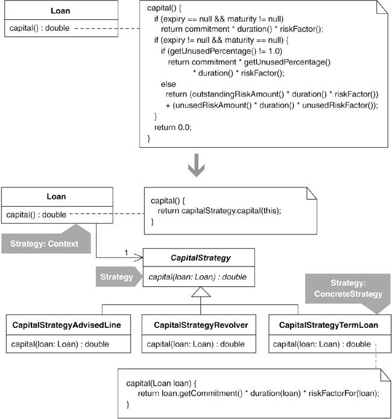

### 동기

* 알고리즘 내에서 여러 로직 가운데 어떤 것을 사용할지 결정하는 데는 흔히 조건 로직이 사용된다.
	* 시간이 지나면서 알고리즘이 점점 커지고 복잡해지는 경우가 많다.
	* Martin Fowler 왈 '일반적으로 프로그램에서 가장 복잡한 부분 가운데 하나가 복잡한 조건 로직이다.'
* Decompose Conditional이나 Compose Method 같은 리팩터링을 사용하면 그런 코드를 단순화할 수 있다.
	* 특정 알고리즘의 실행에만 사용되는 작은 메서드가 너무 많이 생겨 호스트 클래스가 복잡해질 수 있다.
* 객체 조합(object composition)을 이용하여 새로운 클래스로 옮기는 방법.
	* Replace Conditional Logic with Strategy 리팩터링은 객체 조합을 이용한다.
	* 서브클래스가 이미 존재하여 알고리즘들을 각각 하나의 서브클래스에 대응시키기 쉽다면 상속을 이용하는 방법이 좋다.
* 상속(inheritance)을 이용하여 서브클래스로 옮기는 방법.
	* Replace Conditional with Polymorphism 리팩터링은 상속을 이용한다.
	* 클라이언트에서 런타임에 한 알고리즘을 다른 알고리즘으로 교체할 필요가 있다면, 상속을 이용한 방법은 피하는 것이 좋다.
* 각 스트레티지 내의 로직에서 실행에 필요한 데이터에 어떻게 접근하도록 할지를 고려해야 한다.
	* Strategy 패턴을 '목표로to' 리팩터링을 할 것인지, Strategy 패턴을 '향해서toward' 리팩터링을 할 것인지 결정해야 한다.
		1. 호스트 클래스(컨텍스트Context)의 인스턴스를 스트레티지에 직접 넘겨서 호스트 클래스의 메서드 호출을 통해 필요한 데이터를 얻게 한다.
		1. 필요한 데이터를 하나하나 파라미터로서 스트레티지에 넘긴다.
		* 두 가지 방법의 장단점은 절차 절에서 계속.
* 스트레티지와 컨텍스트 클래스의 조합이 많지 않다면, 스트레티지 객체를 생성하고 이를 컨텍스트에 넘겨주는 과정을 클라이언트 코드에서 신경 쓰지 않도록 하는 것이 좋다.
	* Encapsulate Classses with Factory 리팩토링이 도움이 된다.

### 장점과 단점
```
+조건 로직을 줄이거나 제거해 알고리즘을 명확하게 한다.
+알고리즘 내의 여러 로직을 상속 구조로 옮겨 클래스를 단순화한다.
+런타임에 어떤 알고리즘을 다른 알고리름으로 변경하기가 쉬워진다.
-상속을 이용하거나 Simplifying Conditional Expressions 리팩터링을 적용
 하는 것이 더 쉬울 만한 상황에서는 설계를 복잡하게 만들 뿐이다.
-알고리즘이 컨텍스트 클래스와 데이터를 주고받는 방식이 복잡해진다.
```

### 절차

* 스트레티지로 쓸 클래스를 하나 만든다.
* Move Method 리팩터링을 적용해 계산 메서드를 스트레티지 클래스로 옮긴다.
	1. 컨텍스트 객체를 스트레티지의 생성자 또는 계산 메서드에 파라미터로 넘기는 방법.
		* 단점: 정보 은폐infomation hiding의 원칙을 위배할 수 있다.
		* 장점: 다른 코드를 거의 바꾸지 않아도 스트레티지에서 바로 접근할 수 있다.
	1. 계산 메서드의 파라미터로 필요한 데이터를 넘기는 방법.
		* 단점: 특정 스트레티지가 그 데이터를 사용하는지 여부와 상관없이 모든 스트레티지에 데이터를 넘겨야 한다.
		* 장점: 컨테스트와 스트레티지 사이의 종속성이 줄어든다.
	* 컴파일 후 테스트한다.
* 컨텍스트 클래스의 코드 중 스트레티지 객체를 생성하고 필드에 대입하는 부분에 Extract Parameter를 적용한다.
	* 컴파일 후 테스트한다.
* 스트레티지의 계산 메서드에 Replace Conditional with Polymorphism 리팩터링을 적용한다.
	* 컴파일 후 컨텍스트와 스트레티지의 여러 조합에 대해 테스트 한다.

### 예제

* 은행 대출의 3가지 종류에 대해 capital을 계산하는 예제
	* Loan 클래스의 capital 계산 메서드를 Strategy 패턴으로 바꾸어 구현

* capital을 다양한 방법으로 계산해야 한다.
	* 계산 방법마다 Loan의 서브클래스가 하나씩 있다면 Loan의 상속 구조에 서브클래스가 지나치게 많아진다.
	* 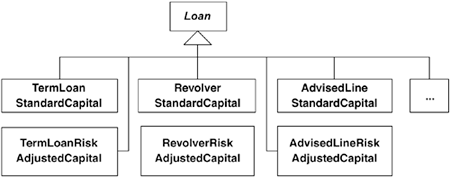

* capital의 계산 방법이 Loan 객체의 클래스 타입을 바꾸지 않고도 런타임에 변경될 수 있어야 한다.
* Loan 객체의 스트레티지 객체를 다른 타입의 스트레티지 객체로 바꾸는 것이 쉽다.
* ```java
public class Loan...
   public double capital() {
      if (expiry == null && maturity != null)
         return commitment * duration() * riskFactor();
      if (expiry != null && maturity == null) {
         if (getUnusedPercentage() != 1.0)
            return commitment * getUnusedPercentage() * duration() * riskFactor();
         else
            return (outstandingRiskAmount() * duration() * riskFactor())
                + (unusedRiskAmount() * duration() * unusedRiskFactor());
      }
      return 0.0;
   }
   ```

* 조건 로직은 대출의 종류를 정하기 위한 것이다.
	* 각 대출 종류마다 계산 로직이 한 개씩 있다.
* ```java
public class Loan...
   private double outstandingRiskAmount() {
      return outstanding;
   }

   private double unusedRiskAmount() {
      return (commitment - outstanding);
   }

   public double duration() {
      if (expiry == null && maturity != null)
         return weightedAverageDuration();
      else if (expiry != null && maturity == null)
         return yearsTo(expiry);
      return 0.0;
   }

   private double weightedAverageDuration() {
      double duration = 0.0;
      double weightedAverage = 0.0;
      double sumOfPayments = 0.0;
      Iterator loanPayments = payments.iterator();
      while (loanPayments.hasNext()) {
         Payment payment = (Payment)loanPayments.next();
         sumOfPayments += payment.amount();
         weightedAverage += yearsTo(payment.date()) * payment.amount();
      }
      if (commitment != 0.0)
         duration = weightedAverage / sumOfPayments;
      return duration;
   }

   private double yearsTo(Date endDate) {
      Date beginDate = (today == null ? start : today);
      return ((endDate.getTime() - beginDate.getTime()) / MILLIS_PER_DAY) / DAYS_PER_YEAR;
   }

   private double riskFactor() {
      return RiskFactor.getFactors().forRating(riskRating);
   }

   private double unusedRiskFactor() {
      return UnusedRiskFactors.getFactors().forRating(riskRating);
   }
```

1. 스트레티지를 만드는데, 대출에 대한 capital을 계산하는 것이 목적이므로 클래스의 이름을 CapitalStrategy라 짓는다.
```java
public class CapitalStrategy {
}
```
2. Move Method 리팩터링을 통해 capital을 CapitalStrategy로 옮긴다.
* CapitalStrategy에 capital() 메서드를 선언한다.
* ```java
public class CapitalStrategy {
    public double capital() {
        return 0.0;
    }
}
```
* Loan의 코드를 CapitalStrategy로 복사한다.
* ```java
public class CapitalStrategy {
    public double capital() {
        if (expiry == null && maturity != null)
            return commitment * duration() * riskFactor();
        if (expiry != null && maturity == null) {
            if (getUnusedPercentage() != 1.0)
                return commitment * getUnusedPercentage() * duration() * riskFactor();
            else
                return (outstandingRiskAmount() * duration() * riskFactor())
                        + (unusedRiskAmount() * duration() * unusedRiskFactor());
        }
        return 0.0;
    }

    private double riskFactor() {
        return RiskFactor.getFactors().forRating(riskRating);
    }

    private double unusedRiskFactor() {
        return UnusedRiskFactors.getFactors().forRating(riskRating);
    }
}
```
* Loan의 객체의 참조를 넘긴다.
* ```java
public class CapitalStrategy {
    public double capital(Loan loan) {
        if (loan.getExpiry() == null && loan.getMaturity() != null)
            return loan.getCommitment() * loan.duration() * riskFactor(loan);
        if (loan.getExpiry() != null && loan.getMaturity() == null) {
            if (loan.getUnusedPercentage() != 1.0)
                return loan.getCommitment * loan.getUnusedPercentage() * loan.duration() * riskFactorFor(loan);
            else
                return (loan.outstandingRiskAmount() * loan.duration() * riskFactorFor(loan))
                        + (loan.unusedRiskAmount() * loan.duration() * unusedRiskFactorFor(loan));
        }
        return 0.0;
    }

    private double riskFactorFor(Loan loan) {
        return RiskFactor.getFactors().forRating(loan.getRiskRating());
    }

    private double unusedRiskFactorFor(Loan loan) {
        return UnusedRiskFactors.getFactors().forRating(loan.getRiskRating());
    }
}
```
* 접근 지정자를 디폴트로 만든다.
* ```java
public class Loan {

    Date getExpiry(){
        return expiry;
    }

    Date getMaturity() {
        return maturity;
    }

    double getCommitment() {
        return commitment;
    }

    double getUnusedPercentage() {
        return unusedPercentage;
    }

    /* private */ double outstandingRiskAmount() {
        return outstanding;
    }

    /* private */ double unusedRiskAmount() {
        return (commitment - outstanding);
    }
}
```
* Loan이 capital 계산을 CapitalStrategy에 위임하도록 만든다.
* ```java
public class Loan...
	public double capital() {
		return new CapitalStrategy().capital(this);
    }
}
```
* 테스트를 실행한다.
* ```java
public class CapitalCalculationTests extends TestCase {
    public void testTermLoanSamePayments() {
        Date start = november(20, 2003);
        Date maturity = november(20, 2006);
        Loan termLoan = Loan.newTermLoan(LOAN_AMOUNT, start, maturity, HIGH_RISK_RATING);
        termLoan.payment(1000.00, november(20, 2004));
        termLoan.payment(1000.00, november(20, 2005));
        termLoan.payment(1000.00, november(20, 2006));
        assertEquals("duration", 2.0, termLoan.duration(), TWO_DIGIT_PRECISION);
        assertEquals("capital", 210.00, termLoan.capital(), TWO_DIGIT_PRECISION);
    }
}
```
* Loan에 아직 남아 있는 Capital 계산 관련 코드를 마저 CapitalStrategy로 옮긴다.
* ```java
public class CapitalStrategy {
    private static final int MILLIS_PER_DAY = 86400000;
    private static final int DAYS_PER_YEAR = 365;

    public double capital(Loan loan) {
        if (loan.getExpiry() == null && loan.getMaturity() != null)
        	return loan.getCommitment() * loan.duration() * riskFactorFor(loan);
        if (loan.getExpiry() != null && loan.getMaturity() == null) {
            if (loan.getUnusedPercentage() != 1.0)
                return loan.getCommitment() * loan.getUnusedPercentage()
                * loan.duration() * riskFactorFor(loan);
            else
                return
                (loan.outstandingRiskAmount() * loan.duration() * riskFactorFor(loan))
                + (loan.unusedRiskAmount() * loan.duration() * unusedRiskFactorFor(loan));
        }
        return 0.0;
    }

    private double riskFactorFor(Loan loan) {
        return RiskFactor.getFactors().forRating(loan.getRiskRating());
    }

    private double unusedRiskFactorFor(Loan loan) {
    	return UnusedRiskFactors.getFactors().forRating(loan.getRiskRating());
    }

    public double duration(Loan loan) {
        if (loan.getExpiry() == null && loan.getMaturity() != null)
        	return weightedAverageDuration(loan);
        else if (loan.getExpiry() != null && loan.getMaturity() == null)
        	return yearsTo(loan.getExpiry(), loan);
        return 0.0;
    }

    private double weightedAverageDuration(Loan loan) {
        double duration = 0.0;
        double weightedAverage = 0.0;
        double sumOfPayments = 0.0;
        Iterator loanPayments = loan.getPayments().iterator();
        while (loanPayments.hasNext()) {
            Payment payment = (Payment)loanPayments.next();
            sumOfPayments += payment.amount();
            weightedAverage += yearsTo(payment.date(), loan) * payment.amount();
        }
        if (loan.getCommitment() != 0.0)
        	duration = weightedAverage / sumOfPayments;
        return duration;
    }

    private double yearsTo(Date endDate, Loan loan) {
        Date beginDate = (loan.getToday() == null ? loan.getStart() : loan.getToday());
        return ((endDate.getTime() - beginDate.getTime()) / MILLIS_PER_DAY) / DAYS_PER_YEAR;
    }
}
```
* 작업 결과, Loan의 Capital()과 duration()은 다음과 같이 된다.
```java
public class Loan...
   public double capital() {
      return new CapitalStrategy().capital(this);
   }

   public double duration() {
      return new CapitalStrategy().duration(this);
   }
}
```
* Loan에서 두 번 등장하는 new CapitalStrategy() 코드를 한 번으로 줄인다.
* ```java
public class Loan {
    private CapitalStrategy capitalStrategy;

    private Loan(double commitment, double outstanding,
    				Date start, Date expiry, Date maturity, int riskRating) {
	    capitalStrategy = new CapitalStrategy();
    ...
    }

    public double capital() {
    	return capitalStrategy.capital(this);
    }

    public double duration() {
    	return capitalStrategy.duration(this);
    }
}
```

3.Extract Parameter 리팩터링을 적용해 현재 하드 코딩되어 있는 대리 객체(delegate)를 밖에서 설정할 수 있도록 한다.
* ```java
public class Loan {
   private Loan(..., CapitalStrategy capitalStrategy) {
      //...
      this.capitalStrategy = capitalStrategy;
   }

   public static Loan newTermLoan(
      double commitment, Date start, Date maturity, int riskRating) {

      return new Loan(
         commitment, commitment, start, null,
         maturity, riskRating, new CapitalStrategy()
      );
   }

   public static Loan newRevolver(
      double commitment, Date start, Date expiry, int riskRating) {

      return new Loan(commitment, 0, start, expiry,
         null, riskRating, new CapitalStrategy()
      );
   }

   public static Loan newAdvisedLine(
      double commitment, Date start, Date expiry, int riskRating) {
      if (riskRating > 3) return null;
      Loan advisedLine =
         new Loan(commitment, 0, start, expiry, null, riskRating, new CapitalStrategy());
      advisedLine.setUnusedPercentage(0.1);
      return advisedLine;
   }
}
```

4.CapitalStrategy의 capital() 메서드에 Replace Conditional with Polymorphism 리팩터링을 적용한다.
* Term Loan의 capital을 계산하는 서브클래스를 만든다.
* ```java
public class CapitalStrategyTermLoan extends CapitalStrategy {
    public double capital(Loan loan) {
    	return loan.getCommitment() * duration(loan) * riskFactorFor(loan);
    }

    public double duration(Loan loan) {
    	return weightedAverageDuration(loan);
    }

    private double weightedAverageDuration(Loan loan) {
        double duration = 0.0;
        double weightedAverage = 0.0;
        double sumOfPayments = 0.0;
        Iterator loanPayments = loan.getPayments().iterator();

        while (loanPayments.hasNext()) {
            Payment payment = (Payment)loanPayments.next();
            sumOfPayments += payment.amount();
            weightedAverage += yearsTo(payment.date(), loan) * payment.amount();
        }
        if (loan.getCommitment() != 0.0)
        	duration = weightedAverage / sumOfPayments;
        return duration;
    }
}
```
* Loan 클래스를 수정하고 테스트한다.
* ```java
public class Loan {
   public static Loan newTermLoan(
      double commitment, Date start, Date maturity, int riskRating) {
      return new Loan(
         commitment, commitment, start, null, maturity, riskRating,
         new CapitalStrategyTermLoan()
      );
   }
}
```
* 나머지 두 개의 대출 종류(revolver와 advised line)에 대해서도 Replace Conditional with Polymorphism 리팩터링을 적용해 서브클래스를 만든다.
* ```java
public class Loan...
   public static Loan newRevolver(
      			double commitment, Date start, Date expiry, int riskRating) {
      return new Loan(
         commitment, 0, start, expiry, null, riskRating,
         	new CapitalStrategyRevolver()
      );
   }

   public static Loan newAdvisedLine(
      			double commitment, Date start, Date expiry, int riskRating) {
      if (riskRating > 3) return null;
      Loan advisedLine = new Loan(
         commitment, 0, start, expiry, null, riskRating,
         	new CapitalStrategyAdvisedLine()
      );
      advisedLine.setUnusedPercentage(0.1);
      return advisedLine;
   }
}
```
* 스트레티지 클래스의 상속 구조 다이어그램
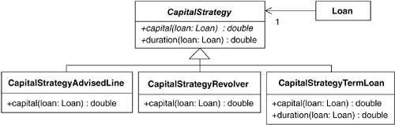

* CapitalStrategy 클래스를 수정한다.
* ```java
public abstract class CapitalStrategy {
    private static final int MILLIS_PER_DAY = 86400000;
    private static final int DAYS_PER_YEAR = 365;

    public abstract double capital(Loan loan);

    protected double riskFactorFor(Loan loan) {
	    return RiskFactor.getFactors().forRating(loan.getRiskRating());
    }

    public double duration(Loan loan) {
    	return yearsTo(loan.getExpiry(), loan);
    }

    protected double yearsTo(Date endDate, Loan loan) {
        Date beginDate = (loan.getToday() == null ? loan.getStart() : loan.getToday());
        return ((endDate.getTime() - beginDate.getTime()) / MILLIS_PER_DAY) / DAYS_PER_YEAR;
    }
}
```

## Move Embellishment to Decorator

어떤 클래스에 핵심 기능을 위한 코드와 꾸밈 코드가 뒤섞여 있으면, 꾸밈 코드를 데코레이터로 옮긴다.

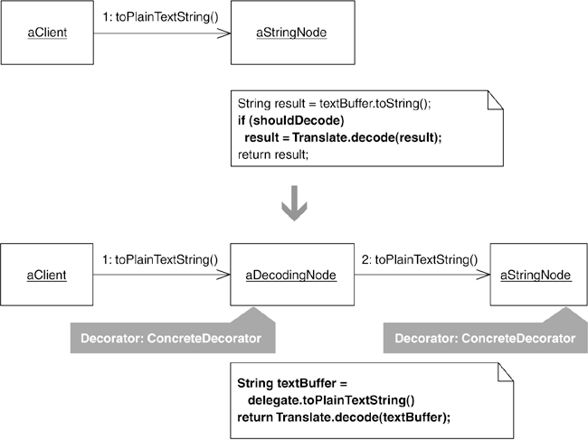

### 동기

* 시스템에 새 기능(특정 조건에서만 쓰임)을 추가할 때, 보통 기존 클래스에 코드를 추가.
* 새로이 추가 된 필드 또는 메서드, 로직으로 인해 호스트 클래스가 복잡해짐.
* 꾸밈 코드를 각자의 클래스로 옮기고, 특별한 처리가 필요할 때 호스트 클래스를 꾸밈 객체로 감싸 사용.
* Move Embellishment to Decorator 리팩터링의 예시 - JUnit 테스트 프레임워크

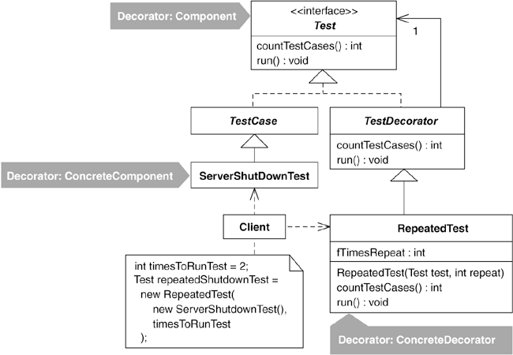

### 주의사항

* 호스트 클래스에 public 메서드가 많은 경우에는 바람직하지 않다. 데코레이터는 '투명한 외투'로서 존재해야 하기 때문.
* 투명한 외투란, 클라이언트 입장에서는 호스트와 데코레이터를 구별하지 않고 사용한다는 것과 호스트 입장에서도 데코레이터의 존재를 알거나 알 필요없이 꾸밈 기능이 수행되어야 한다는 것을 말한다.
* 호스트 클래스를 둘 이상의 데코레이터가 감싸는 경우 순서에 의해 결과가 바뀔 수 있으므로 Encapsulate Classes with Factory를 함께 사용하면 좋다.

### 참고 - Decorator와 Strategy의 차이

* 둘의 공통점은 특수의 경우나 동작을 처리하기 위한 조건 로직을 새 클래스로 옮겨 호스트 클래스에서 제거한다는 것이다.
* 데코레이터는 호스트 객체를 감싸서 동작, 스트레티지는 호스트 객체의 내부에서 사용된다.

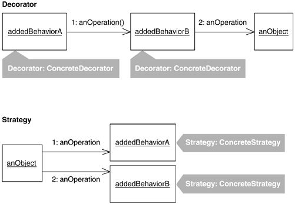

* 적절한 리팩터링을 선택하기에 있어서 검토해야 할 문제
  * 데코레이터는 공유할 수 없는 반면, 스트레티지는 Singleton이나 Flyweight패턴을 통해서 쉽게 공유할 수 있다.
  * 클래스의 인터페이스 구성에 있어 데코레이터는 호스트 클래스의 인터페이스에 맞춰야 하고, 스트레티지는 자유롭다.
  * 데코레이터는 호스트 클래스에 영향을 끼치지 않고, 스트레티지는 존재와 사용법을 알아야 한다.
  * 호스트 클래스에 데이터나 public 메서드가 많은 경우, 데코레이터는 클래스가 무거워지나 스트레티지는 장애가 되지 않는다.

### 장점과 단점

```
 + 꾸밈 코드를 제거해 호스트 클래스를 단순하게 만든다.
 + 어떤 클래스의 핵심 기능과 부가 기능을 손쉽게 구별할 수 있다.
 + 서로 관련된 클래스에서 중복된 꾸밈 코드를 줄일 수 있다.
 - 클라이언트의 입장에서는 대상 객체의 타입이 바뀐다.
 - 코드를 이해하고 디버깅하기 더 어려워질 수도 있다.
 - 데코레이터 객체의 조합 방식이 서로에게 영향을 끼친다면, 설계를 더 복잡하게 만들어야 한다.
```

### 절차

* 꾸밈 코드를 가지고 있는 클래스를 찾는 것으로 시작.
* 데코레이터가 구현해야 할 public 메서드가 지나치게 많다면, 그 수를 줄이거나 Replace Conditional Logic with Strategy 리팩터링을 고려.

1. 인클로저 타입(enclosure type)을 찾아내거나 새로 만든다.
2. 호스트 클래스에서 꾸밈 코드에 해당하는 조건 로직을 찾아서 Replace Conditional with Polymorphism 리팩터링을 통해 제거한다.
3. 단계 2에서 만든 서브클래스를 Replace Inheritance with Delegation 리팩터링을 이용해 위임 클래스로 변환한다.
  * 위임 클래스는 모두 인클로저 타입을 구현하도록 한다.
  * 위임 클래스의 대리 객체 필드도 인클로저 타입으로 한다.
  * 꾸밈 코드를 위임 클래스가 위임 메서드를 호출하기 전에 실행할 것인지 그 후에 실행할 것인지를 결정한다.
4. 위임 클래스의 생성자를 통해 대리 객체 필드에 호스트 클래스의 새 인스턴스를 만들어 대입한다.
  * 호스트 클래스의 인스턴스를 생성하는 코드에 Extract Parameter 리팩터링을 적용해 파리미터로 뽑는다.
  * 생성자의 파라미터 중 불필요한 것이 있다면 Parameter 리팩터링을 이용하여 제거한다.

### 예제

HTML을 파싱한 후 Node 객체의 컬렉션을 순회하면서 StringNode 객체에 디코딩을 하고 있다.
```java
public void testDecodingAmpersand() throws Exception {
   String ENCODED_WORKSHOP_TITLE =
      "The Testing &amp; Refactoring Workshop";

   String DECODED_WORKSHOP_TITLE =
      "The Testing & Refactoring Workshop";

   assertEquals(
      "ampersand in string",
      DECODED_WORKSHOP_TITLE,
      parseToObtainDecodedResult(ENCODED_WORKSHOP_TITLE));
}

private String parseToObtainDecodedResult(String STRING_TO_DECODE)
   throws ParserException {

   StringBuffer decodedContent = new StringBuffer();
   createParser(STRING_TO_DECODE);

   NodeIterator nodes = parser.elements();
   while (nodes.hasMoreNodes()) {
      Node node = nodes.nextNode();
      if (node instanceof StringNode) {
         StringNode stringNode = (StringNode) node;
         decodedContent.append(Translate.decode(stringNode.toPlainTextString())); // decoding step
      }
      if (node instanceof Tag)
         decodedContent.append(node.toHtml());
   }
   return decodedContent.toString();
}
```
먼저, StringNode에 디코딩을 수행하는 코드를 직접 삽입하기 위해 테스트 코드를 다음과 같이 수정.
```java
public void testDecodingAmpersand() throws Exception {
   String ENCODED_WORKSHOP_TITLE =
   "The Testing &amp; Refactoring Workshop";

   String DECODED_WORKSHOP_TITLE =
   "The Testing & Refactoring Workshop";

   StringBuffer decodedContent = new StringBuffer();
   Parser parser = Parser.createParser(ENCODED_WORKSHOP_TITLE);
   
   parser.setNodeDecoding(true);  // tell parser to decode StringNodes
   NodeIterator nodes = parser.elements();

   while (nodes.hasMoreNodes())
      decodedContent.append(nodes.nextNode().toPlainTextString());

   assertEquals("decoded content",
      DECODED_WORKSHOP_TITLE,
      decodedContent.toString()
   );
}
```
Parser 수정.
```java
public class Parser...
private boolean shouldDecodeNodes = false;

public void setNodeDecoding(boolean shouldDecodeNodes) {
	this.shouldDecodeNodes = shouldDecodeNodes;
}
```
디코딩 플래그를 사용하도록 StringParser 수정.
```java
public class StringParser...
   public Node find(NodeReader reader, String input, int position, boolean balance_quotes) {

     ...
     return new StringNode(textBuffer, textBegin, textEnd);
   }
```
```java
public class StringParser...
   public Node find(NodeReader reader, String input, int position, boolean balance_quotes) {
                        ...
      return new StringNode(
         textBuffer, textBegin, textEnd, 
		 reader.getParser().shouldDecodeNodes());
   }
```
Parser클래스에 메서드 추가, StringNode 생성자에 boolean 타입 파라미터 추가.
```java
public class Parser...
    public boolean shouldDecodeNodes() {
        return shouldDecodeNodes;
    }

public class StringNode extends Node...
    private boolean shouldDecode = false;
    public StringNode(StringBuffer textBuffer, int textBegin, int textEnd, boolean shouldDecode) {
        this(textBuffer, textBegin, textEnd);
        this.shouldDecode = shouldDecode;
    }
```
StringNode에 디코딩을 실행하는 코드를 추가.
```java
public class StringNode...
    public String toPlainTextString() {
        String result = textBuffer.toString();

        if (shouldDecode)
	        result = Translate.decode(result);

        return result;
    }
```
개행문자나 탭과 같은 꾸밈 기능이 추가되어 StringNode에 다음과 같이 코드를 추가하였다.
```java
public class StringNode...
    private boolean shouldRemoveEscapeCharacters = false;

    public StringNode(StringBuffer textBuffer, int textBegin, 
    		int textEnd, boolean shouldDecode, boolean shouldRemoveEscapeCharacters) {
        this(textBuffer, textBegin, textEnd);
        this.shouldDecode = shouldDecode;
        this.shouldRemoveEscapeCharacters = shouldRemoveEscapeCharacters;
    }

    public String toPlainTextString() {
        String result = textBuffer.toString();
        if (shouldDecode)
        	result = Translate.decode(result);

        if (shouldRemoveEscapeCharacters)
	        result = ParserUtils.removeEscapeCharacters(result);
        return result;
    }
```
클라이언트 코드는 간단해졌으나, 새로운 꾸밈 기능을 추가할 때마다 여러 클래스를 동시에 수정해야 하는 문제가 생겼다.

* 초기화 로직이 지나치게 많다. 꾸밈 기능 하나를 위해 Parser와 StringParse를 거쳐 StringNode에 파라미터로 넘기고...
* 꾸밈 로직이 지나치게 많다. 즉, StringNode에 각 꾸밈 기능이 지원해야 하는 특수 경우를 처리하는 로직이 너무 많다.

해결책으로,

* 지나치게 많은 초기화 로직 문제를 해결하기 위해 파서에 팩터리 객체(StringNode)를 넘겨주도록 수정.
* StringNode의 형제 클래스들도 디코딩 등의 꾸밈 기능이 필요하므로, Strategy패턴보다는 Decorator패턴을 이용.

본격적인 리팩터링을 하기 위해
1. 인클로저 타입을 찾거나 새로 만든다.
StringNode의 상위 클래스인 AbstractNode는 필드가 중복될 수 있으므로 인클로저 타입 후보에서 제외.
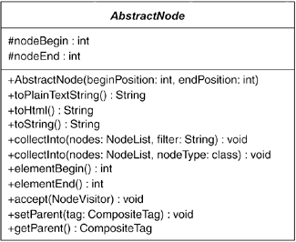
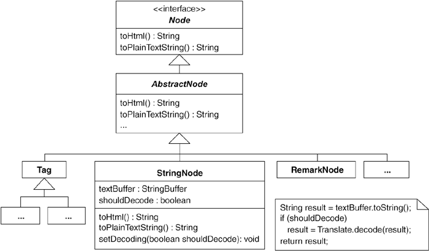
AbstractNode의 상위 클래스인 Node클래스를 인클로저 타입으로 사용하기 위해,
Unify Interfaces 리팩터링을 적용, 두 클래스에 getText(), setText() 메서드 추가.
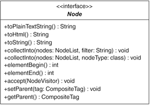
```java
public abstract class AbstractNode...
    public String getText() {
        return null;
    }
        
    public void setText(String text) {
    }
```
2. StringNode 클래스의 내부에 있는 디코딩 꾸밈 로직을 대체하기 위해 Replace Conditional with Polymorphism 리팩터링을 적용.
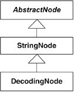
위와 같은 구조를 만들기 위해, Replace Type Code with Subclasses 리팩터링을 사용. 그 첫 단계로 Self-Encapsulate Field 리팩터링을 적용하여,
StringNode내의 shouldDecode 필드 참조를 수정.
```java
public class StringNode extends AbstractNode...
   public StringNode(
        StringBuffer textBuffer, int textBegin, int textEnd, boolean shouldDecode) {
        this(textBuffer, textBegin, textEnd);
        setShouldDecode(shouldDecode);
   }

    public String toPlainTextString() {
        String result = textBuffer.toString();
        if (shouldDecode())
        	result = Translate.decode(result);
        return result;
    }
    
    private void setShouldDecode(boolean shouldDecode) {
        this.shouldDecode = shouldDecode;
    }
    
    private boolean shouldDecode() {
        return shouldDecode;
    }
```
다음, shouldeDecode 파라미터를 생성 메서드로 대체. 리턴 타입이 Node(인클로저 타입)인 생성 메소드 추가.
```java
public class StringNode extends AbstractNode...
	private StringNode(
        StringBuffer textBuffer, int textBegin, int textEnd, boolean shouldDecode) {
        this(textBuffer, textBegin, textEnd);
        setShouldDecode(shouldDecode);
   	}
   	
    public static Node createStringNode(
        StringBuffer textBuffer, int textBegin, int textEnd, boolean shouldDecode) {
        return new StringNode(textBuffer, textBegin, textEnd, shouldDecode);
	}
    
	public class StringParser...
   	public Node find(
        NodeReader reader,String input,int position, boolean balance_quotes) {
            ...
            return;
      	}

    StringNode.createStringNode(
    textBuffer, textBegin, textEnd, reader.getParser().shouldDecodeNodes());
```
생성메서드를 호출하도록 클라이언트를 수정. 컴파일하여 테스트.
```java
public class StringParser...
    public Node find(
    NodeReader reader,String input,int position, boolean balance_quotes) {
    ...
    return;
    }

	StringNode.createStringNode(textBuffer, textBegin, textEnd, reader.getParser().shouldDecodeNodes());
```
타입 코드 shouldDecode는 boolean. StringNode클래스에서는 false, true인 경우에는 DecodingNode라는 클래스를 만들고, shouldDecode() 메서드를 오버라이드하는 것으로 작업. 이 과정에서 메서드를 protected로 변경.
```java
public class StringNode extends AbstractNode...
    protected boolean shouldDecode()...
    public class DecodingNode extends StringNode {
    public DecodingNode(StringBuffer textBuffer, int textBegin, int textEnd) {
    	super(textBuffer, textBegin, textEnd);
    }
    
    protected boolean shouldDecode() {
    	return true;
    }
}
```
생성 메서드에서 shouldDecode의 값에 따라 적절한 객체를 만들어 리턴하도록 수정.
```java
public class StringNode extends AbstractNode...
    private boolean shouldDecode = false;

    public static Node createStringNode(
    		StringBuffer textBuffer, int textBegin, int textEnd, boolean shouldDecode) {
        if (shouldDecode)
        return new DecodingNode(textBuffer, textBegin, textEnd);
        /*return new StringNode(textBuffer, textBegin, textEnd
        , shouldDecode);*/
    }
```
shouldDecode 필드와 그 set 메서드, 그 값을 파라미터로 받는 생성자를 제거해 StringNode를 단순화함.
```java
public class StringNode extends AbstractNode...
    private boolean shouldDecode = false;
    public StringNode(StringBuffer textBuffer,int textBegin,int textEnd) {
        super(textBegin,textEnd);
        this.textBuffer = textBuffer;
    }
    private StringNode(
    StringBuffer textBuffer, int textBegin, int textEnd, boolean shouldDecode) {
        this(textBuffer, textBegin, textEnd);
        setShouldDecode(shouldDecode);
    }

    public static Node createStringNode(
    StringBuffer textBuffer, int textBegin, int textEnd, boolean shouldDecode) {
        if (shouldDecode)
        	return new DecodingNode(textBuffer, textBegin, textEnd);
        return new StringNode(textBuffer, textBegin, textEnd);
    }

    private void setShouldDecode(boolean shouldDecode) {
	    this.shouldDecode = shouldDecode;
    }

    protected boolean shouldDecode() {
    	return false;
	}
```
이제 StringNode의 toPlainTextString()에 있는 조건 로직을 제거할 차례.
먼저, DecodingNode의 toPlainTextString()을 오버라이드하고, StringNode의 해당메서드에서 로직을 제거.
```java
public class DecodingNode extends StringNode...
    public String toPlainTextString() {
    	return Translate.decode(textBuffer.toString());
    }
public class StringNode extends AbstractNode...
    public String toPlainTextString() {
    	return textBuffer.toString();
/*
    String result = textBuffer.toString();

    if (shouldDecode())
	    result = Translate.decode(result);

    return result;*/
    }
```
다음 StringNode와 DecodingNode 양쪽 모두에서 shouldDecode()를 제거한다.
```java
public class StringNode extends AbstractNode...
    /*protected boolean shouldDecode() {
	    return false;
    }*/
public class DecodingNode extends StringNode...
    /*protected boolean shouldDecode() {
	    return true;
    }*/
```
DecodingNode의 toPlaintTextString() 메서드의 중복 코드를 제거하기 위해,
수퍼클래스 메서드를 호출하도록 수정.
```java
public class DecodingNode extends StringNode...
   public String toPlainTextString() {
      return Translate.decode(super.toPlainTextString());
   }
```
3. 다음은 Replace Inheritance with Delegation 리팩터링을 적용할 차례.
서브클래스인 DecodingNode에 자기 자신을 참조하는 대리 객체 필드를 만든다.
```java
public class DecodingNode extends StringNode...3.
private Node delegate = this;
```
StringNode로부터 상속받은 메서드를 직접 호출하는 부분을 대리 객체에게 위임한다.
```java
public class DecodingNode extends StringNode...
    public String toPlainTextString() {
	    return Translate.decode(super.toPlainTextString());
    }
public class DecodingNode extends StringNode...
    public String toPlainTextString() {
	    return Translate.decode(delegate.toPlainTextString());
}
```
DecodingNode는 더 이상 StringNode의 서브클래스가 아니므로 상속관계를 제거하고,
대리 객체인 delegate 필드에 StringNode의 실제 인스턴스를 생성해서 대입한다.
```java
public class DecodingNode /*extends StringNode*/ ...
	private Node delegate = this;

	public DecodingNode(StringBuffer textBuffer, int textBegin, int textEnd) {
		delegate = new StringNode(textBuffer, textBegin, textEnd);
	}
```
DecodingNode는 Node객체를 implements로 상속받아 Node 인터페이스를 직접 구현한다.
```java
public class DecodingNode implements Node...
    private Node delegate;

    public DecodingNode(StringBuffer textBuffer, int textBegin, int textEnd) {
    	delegate = new StringNode(textBuffer, textBegin, textEnd);
    }

    public String toPlainTextString() {
    	return Translate.decode(delegate.toPlainTextString());
    }

    public void accept(NodeVisitor visitor) {
    }
    public void collectInto(NodeList collectionList, Class nodeType) {
    }
	// 기타 등등.
```
Node인터페이스에 맞추기 위해 DecodingNode에 추가했던 메서드를 delegate에 위임.
```java
public class DecodingNode implements Node...
    public void accept(NodeVisitor visitor) {
	    delegate.accept(visitor);
    }
    public void collectInto(NodeList collectionList, Class nodeType) {
    	delegate.collectInto(collectionList, nodeType);
    }
// 기타 등등.
```
4. 마지막으로, 대리 객체가 DecodingNode내에서 생성되고 있으므로
Extract Parameter 리팩터링과 Remove Parameter 리팩터링을 적용하여
생성자의 파라미터를 통하도록 수정.
```java
public class StringNode extends AbstractNode...
    public static Node createStringNode(
    StringBuffer textBuffer, int textBegin, int textEnd, boolean shouldDecode) {
        if (shouldDecode)
        	return new DecodingNode(new StringNode(textBuffer, textBegin, textEnd));
        return new StringNode(textBuffer, textBegin, textEnd);
    }
public class DecodingNode implements Node...
    private Node delegate;

    public DecodingNode(Node newDelegate) {
    	delegate = newDelegate;
	}
```
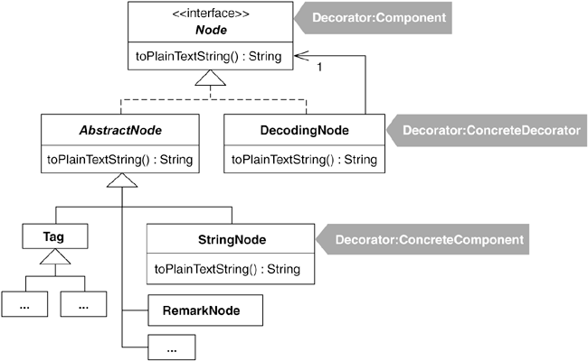

## Replace State-Altering Conditionals with State
어떤 객체의 상태 전이를 제어하는 조건 로직이 복잡하다면,
각 상태에 해당하는 스테이트(state) 클래스를 하나씩 만들고  그들이 스스로 다른 상태로 전이하는 것을 책임지도록 하여 복잡한 조건 로직을 제거한다.


### 동기


- State 패턴
 - 주된 목적은 상태 전이를 위한 조건 로직이 지나지게 복잡한 경우 이를 해소하는 것
 - 상태전이 로직이란 객체의 상태와 이들 간의 전이 방법을 제어한는 것. 클래스 내부 여기저기에 흩어져 존재하는 경향
- 클래스 하나에 모여 있던 상태 전이 로직을 꺼내어 각 상태를 나타내는 클래스로 분산시키면
 - 설계가 단순해져서 상태가 전이되는 방식을 좀더 쉽게 알아볼수 있음
 - 원래 설계에서 상태 전이 로직을 쉽게 이해할수 있었다면, 굳이 State 패턴으로 리팩터링을 할 필요없다.
- State 패턴으로 리팩터링 시작하기 전에
 - **Extract Method** 와 같은 리팩터링이 도움되는지 살펴본다.
- **Replace State-Altering Conditionals with State** 리팩터링과 **Replace Type Code with State/Strategy** 리팩터링의 차이점
 - State패턴과 Strategy 패턴과의 차이를 무시하지 않는다.
   - State 패턴은 어떤 객체가 여러 상태간이 전이를 쉽게하는데 유용
   - Strategy 패턴은 대리 객체를 런타임에 바꿀수 있게 하여 상황에 맞는 로직(또는 계산법)선택을 쉽게 하는데 유용
 - 처음부터 끝까지 절차를 제시했다
   - **Replace Type Code with State/Strategy** 과 **Replace Conditional with Polymorphism** 리팩터링과 밀접한 관련되어 절차가 완벽하지않다.
- State 객체에 필드가 없다면, context 객체가 스테이트 객체를 공유하게 만들어 메모리를 절약할 수 있다.(**Flyweight**패턴과, **Singleton**(**Limit Instantiation with Singleton**)
너무 앞서지 말고 성능상 문제가 발생했을 때 스테이트 객체의 생성 코드가 병목 지점임을 확인한 후에 하는 것이 좋다.

### 장점과 단점
```
+ 상태 전이를 위한 조건 로직을 줄이거나 제거할 수 있다.
+ 복잡한 상태 전이 로직이 단순해진다.
+ 상태 전이 로직을 더 쉽게 알아볼수 있게 된다.
- 원래 상태 전이 로직이 별로 복잡하지 않았다면, 괜히 설계만 복잡하게 만드는 것이다.
```

### 절차
1. Context Class는 원래의 상태 필드를 가지고 있는 클래스. 상태필드에는 상태 전이가 일어나는 동안에 상태내는 상수 가운데 하나가 대입, 비교
 - **Replace Type Code with Class** 리팩터링을 적용해 상태 필드의 타입이 새 클래스가 되도록 만든다. => 스테이트 수퍼 클래스
 - Context Class => State:Context, State Superclass => State:Sate
1. 이제 스테이트 수퍼클래에 정의된 각 상수는 스테이트 수퍼클래스의 인스턴스를 하나씩 참조하고 있다.
 - **Extract Subclass** 리팩터링을 통해 각 상수에 대해 서브클래스(State:ConcreateState)를 하나씩 만든후, 스테이트 수퍼 클래스의 상수를 그에 대응하는 서브클래스 인스턴스를 참조하도록 수정한다.
 - 스테이트 수퍼클래스를 추상 클래스로 만든다.
1. 컨텍스트 클래스에서 상태 전이 로직에 따라 원래의 상태 필드의 값을 변경하는 작업을 수행하는 메소드를 찾는다.
 - 이 메소드를 스테이트 수퍼 클래스로 복사한다.
 - 단순히 복사했을때 코드가 동작하지 않을수 있다. 이때 컨텍스트 객체를 새 메소드에 파라미터로 넘겨서 해결한다.
 - 컨텐스트 클래스의 원본 메소드는 작업을 새로 만든 메소드에게 위임하도록 수정한다.
 - 상태 전이 로직에 따라 원래의 상태 필드의 값을 변경하는 코드가 있는 다른 모든 메소드에 대해서 이 단계의 작업을 반복한다.
1. 컨텐스트 클래스가 가질수 있는 특정 상태 하나를 선택한 다음, 스테이트 수퍼 클래스의 메소드 중 선택한 상태에서 다른 상태로 상태 전이하는 코드가 있는지 확인한다.
 - 해당 메소드를 그 상태에 대응하는 서브 클래스로 복사한 다음 상태 전이와 관련없는 코드는 제거한다.
 - 컨텐스트 클래스가 가질수 있는 다른 모든 상태에 대해 이 작업을 반복
1. 앞의 단계 3에서 스테이트 수퍼클래스로 복사한 메소드의 내부 코드를 제거해 빈 메소드로 만든다.

### 예제
- State 패턴이 필요할 만큼 복잡하지 않은 상태 관리 로직을 가진 클래스(SystemPermission?)
- 상태는 REQUESTED, CLAIMED, DENIED, GRANTED => state란 필드에 저장.
- 여러 메소드를 호출할 때 state 필드의 값이 바뀜
- 아직은 복잡한 로직은 아니다.


```java
public class SystemPermission...
  private SystemProfile profile;
  private SystemUser requestor;
  private SystemAdmin admin;
  private boolean isGranted;
  private String state;

  public final static String REQUESTED = "REQUESTED";
  public final static String CLAIMED = "CLAIMED";
  public final static String GRANTED = "GRANTED";
  public final static String DENIED = "DENIED";

  public SystemPermission(SystemUser requestor, SystemProfile profile) {
    this.requestor = requestor;
    this.profile = profile;
    state = REQUESTED;
    isGranted = false;
    notifyAdminOfPermissionRequest();
  }

  public void claimedBy(SystemAdmin admin) {
    if (!state.equals(REQUESTED))
      return;
    willBeHandledBy(admin);
    state = CLAIMED;
  }

  public void deniedBy(SystemAdmin admin) {
    if (!state.equals(CLAIMED))
      return;
    if (!this.admin.equals(admin))
      return;
    isGranted = false;
    state = DENIED;
    notifyUserOfPermissionRequestResult();
  }

  public void grantedBy(SystemAdmin admin) {
    if (!state.equals(CLAIMED))
      return;
    if (!this.admin.equals(admin))
      return;
    state = GRANTED;
    isGranted = true;
    notifyUserOfPermissionRequestResult();
  }

...

public class TestStates extends TestCase...
  private SystemPermission permission;

  public void setUp() {
    permission = new SystemPermission(user, profile);
  }

  public void testGrantedBy() {
    permission.grantedBy(admin);
    assertEquals("requested", permission.REQUESTED, permission.state());
    assertEquals("not granted", false, permission.isGranted());
    permission.claimedBy(admin);
    permission.grantedBy(admin);
    assertEquals("granted", permission.GRANTED, permission.state());
    assertEquals("granted", true, permission.isGranted());
  }
```

- 소프트웨어 시스템에 대한 접근 권한을 얻기 전에 UNIX에 대한 권한을 먼저 획득해야 한다면?


```java
public class SystemPermission...
  public void claimedBy(SystemAdmin admin) {
    if (!state.equals(REQUESTED) && !state.equals(UNIX_REQUESTED))
      return;
    willBeHandledBy(admin);
    if (state.equals(REQUESTED))
      state = CLAIMED;
    else if (state.equals(UNIX_REQUESTED))
      state = UNIX_CLAIMED;
  }

  public void deniedBy(SystemAdmin admin) {
    if (!state.equals(CLAIMED) && !state.equals(UNIX_CLAIMED))
      return;
    if (!this.admin.equals(admin))
      return;
    isGranted = false;
    isUnixPermissionGranted = false;
    state = DENIED;
    notifyUserOfPermissionRequestResult();
  }

  public void grantedBy(SystemAdmin admin) {
    if (!state.equals(CLAIMED) && !state.equals(UNIX_CLAIMED))
      return;
    if (!this.admin.equals(admin))
      return;

    if (profile.isUnixPermissionRequired() && state.equals(UNIX_CLAIMED))
      isUnixPermissionGranted = true;
    else if (profile.isUnixPermissionRequired() &&
      !isUnixPermissionGranted()) {
      state = UNIX_REQUESTED;
      notifyUnixAdminsOfPermissionRequest();
      return;
    }
    state = GRANTED;
    isGranted = true;
    notifyUserOfPermissionRequestResult();
  }
```
- **Extract Method** 리팩터링을 이용하여 코드를 조금은 단순화 할수 있다.
```java
public void grantedBy(SystemAdmin admin) {
	if (!isInClaimedState())
		return;
	if (!this.admin.equals(admin))
        return;
	if (isUnixPermissionRequestedAndClaimed())
		isUnixPermissionGranted = true;
	else if (isUnixPermisionDesiredButNotRequested()) {
		state = UNIX_REQUESTED;
		notifyUnixAdminsOfPermissionRequest();
    	return;
	}
}
```
1. **Replace Type Code with Class** 를 이용해 state 필드의 타입을 별도의 클래스로 만든다.
```java
public class PermissionState {
	private String name;

	private PermissionState(String name) {
		this.name = name;
	}

    public final static PermissionState REQUESTED = new PermissionState("REQUESTED");
    public final static PermissionState CLAIMED = new PermissionState("CLAIMED");
    public final static PermissionState GRANTED = new PermissionState("GRANTED");
    public final static PermissionState DENIED = new PermissionState("DENIED");
    public final static PermissionState UNIX_REQUESTED = new PermissionState("UNIX_REQUESTED");
	public final static PermissionState UNIX_CLAIMED = new PermissionState("UNIX_CLAIMED");

    public String toString() {
        return name;
    }
}
```

 - state 필드의 이름을 permissionState로 바꾸고 타입도 PermissionState가 되게 만든다.
    ```java
    public class SystemPermission...
        private PermissionState permissionState;
        public SystemPermission(SystemUser requestor, SystemProfile profile) {
            ...
            setPermission(PermissionState.REQUESTED);
            ...
        }

        public PermissionState getState() {
            return permissionState;
        }

        private void setState(PermissionState state) {
            permissionState = state;
        }

        public void claimedBy(SystemAdmin admin) {
            if (!getState().equals(PermissionState.REQUESTED) &&
                !getState().equals(PermissionState.UNIX_REQUESTED))
                return;
        ...
        }

      etc...
    ```
1. 상태를 나타내는 6개의 상수, PermissionState를 **Extract Subclass** 리팩터링을 여섯번 적용
 - 이 상수들이 각각 PermissionState의 서브클래스 인스턴스로 만듬

	

 - 클라이언트에서 PermissionState의 인스턴스는 만들 필요가 없으므로, PermissionState를 추상 클래스로 선언한다.
 ```java
 public abstarct class PermissionState...
```
1. SystemPermission에서 상태 전이 로직에 따라 permissionState 필드의 값을 바꾸는 메소드를 찾는다.
 - claimedBy(), deniedBy(), grantedBy()
 - 우선 claimedBy 먼저
 ```java
public class SystemPermission...
        /*private*/
        void setState(PermissionState state) { // now has package-level visibility
            permissionState = state;
        }
        public void claimedBy(SystemAdmin admin) {
            state.claimedBy(admin, this);
        }
        void willBeHandledBy(SystemAdmin admin) {
            this.admin = admin;
        }
 ```
 ```java
abstract class PermissionState...
        public void claimedBy(SystemAdmin admin, SystemPermission permission) {
            if (!permission.getState().equals(REQUESTED) &&
                !permission.getState().equals(UNIX_REQUESTED))
                return;

            permission.willBeHandledBy(admin);

            if (permission.getState().equals(REQUESTED))
                permission.setState(CLAIMED);
            else if (permission.getState().equals(UNIX_REQUESTED)) {
                permission.setState(UNIX_CLAIMED);
            }
        }
```
1. SystemPermission이 가질수 있는 상태를 하나 고르고 PermissionState에서 그 상태를 다른 상태로 바꾸는 일을 하는 메소드를 찾는다.
 - REQUESTED 상태 부터 시작
 ```java
class PermissionRequested extends PermissionState...
        public void claimedBy(SystemAdmin admin, SystemPermission permission) {
            if (!permission.getState().equals(REQUESTED) &&
                    !permission.getState().equals(UNIX_REQUESTED))
                return;

            permission.willBeHandledBy(admin);
            if (permission.getState().equals(REQUESTED))
                permission.setState(CLAIMED);
            else if (permission.getState().equals(UNIX_REQUESTED)) {
                permission.setState(UNIX_CLAIMED);
            }
        }
}
```
 - PermissionRequested는 REQUESTED 상태하고만 관련되므로, UNIX_REQUESTED상태와 관련된 코드는 전혀 필요없다
 - PermissionRequested? 자체가 REQUESTED 상태를 의미하기때문에, 현재 상태가 REQUESTED인지 확인할 필요가 없다. 따라서
 ```java
class PermissionRequested extends Permission...
        public void claimedBy(SystemAdmin admin, SystemPermission permission) {
            permission.willBeHandledBy(admin);
            permission.setState(CLAIMED);
        }
}
```
 - CLAIMED 상태에서는 DENIED, GRANTED, UNIX_REQUESTED 상태로 전이할수 있고, deniedBy()와 grantedBy()에 상태 전이 코드가 있다.
 ```java
class PermissionClaimed extends PermissionState...
        public void deniedBy(SystemAdmin admin, SystemPermission permission) {
            /*
            if (!permission.getState().equals(CLAIMED) &&
                	!permission.getState().equals(UNIX_CLAIMED))
                return;
            */
            if (!permission.getAdmin().equals(admin))
				return;

            permission.setIsGranted(false);
            permission.setIsUnixPermissionGranted(false);
            permission.setState(DENIED);
            permission.notifyUserOfPermissionRequestResult();
        }

		public void grantedBy(SystemAdmin admin, SystemPermission permission) {
            /*
            if (!permission.getState().equals(CLAIMED) &&
                    !permission.getState().equals(UNIX_CLAIMED))
                return;
			*/
            if (!permission.getAdmin().equals(admin))
				return;

            /*if (permission.getProfile().isUnixPermissionRequired()
                    && permission.getState().equals(UNIX_CLAIMED))
                    permission.setIsUnixPermissionGranted(true);
            else*/
			if (permission.getProfile().isUnixPermissionRequired()
				&& !permission.isUnixPermissionGranted()) {
                permission.setState(UNIX_REQUESTED);
                permission.notifyUnixAdminsOfPermissionRequest();
                return;
    		}

            permission.setState(GRANTED);
            permission.setIsGranted(true);
            permission.notifyUserOfPermissionRequestResult();
  }
```
 - GRANTED상태의 경우에는 SystemPermission이 GRANTED 상태가 되면 상태 전이가 더는 일어나지 않는다. 그리고 메소드를 구현할 필요가 없다.

1. PermissionState의 claimedBy(), deniedBy(), grantedBy() 메소드 내부의 코드를 모두 삭제할수 있다.
```java
abstract class PermissionState {
        public String toString();
        public void claimedBy(SystemAdmin admin, SystemPermission permission) {}
        public void deniedBy(SystemAdmin admin, SystemPermission permission) {}
        public void grantedBy(SystemAdmin admin, SystemPermission permission) {}
}
```

## Replace Implicit Tree with Composite

 실질적으로 트리 구조인 데이터를 String과 같은 기본 타입으로 표현하고 있다면, 그 기본 타입의 표현을 컴포짓 구조로 바꾼다.


### 동기

* 묵시적 트리^implicit^ ^tree^를 형성하고 있다 : 명시적으로 트리 구조를 가지는 것은 아니지만, 트리 형태로 표현되는 경우
* 예1 : XML 코드
```java
String expectedResult =
                  "<orders>" +
                    "<order id='321'>" +
                      "<product id='f1234' color='red' size='medium'>" +
                        "<price currency='USD'>" +
                          "8.95" +
                        "</price>" +
                        "Fire Truck" +
                      "</product>" +
                      "<product id='p1112' color='red'>" +
                        "<price currency='USD'>" +
                          "230.0" +
                        "</price>" +
                        "Toy Porshe Convertible" +
                      "</product>" +
                    "</order>" +
                  "</orders>";
```
* 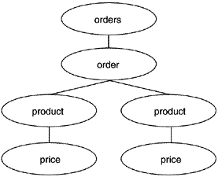

* 예2 : 조건 로직
```java
public class ProductFinder...
  public List belowPriceAvoidingAColor(float price, Color color) {
    List foundProducts = new ArrayList();
    Iterator products = repository.iterator();
    while (products.hasNext()) {
      Product product = (Product) products.next();
      if (product.getPrice() < price && product.getColor() != color)
        foundProducts.add(product);
    }
    return foundProducts;
  }
```
* 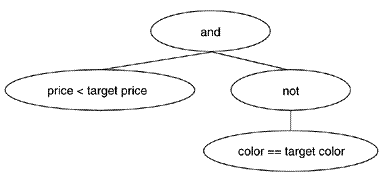

* Composite 패턴을 사용해서 모델화 -> 코드를 더 단순하게 만든다.
* ```java
public class ProductFinder...
  public List byColor(Color color)...
     if (product.getColor() == color)...

  public List byColorAndBelowPrice(Color color, float price)...
    if (product.getPrice() < price && product.getColor() == color)...

  public List byColorAndAbovePrice(Color color, float price) {
    if (product.getColor() == color && product.getPrice() > price)...

  public List byColorSizeAndBelowPrice(Color color, int size, float price)...
     if (product.getColor() == color &&
        product.getSize() == size &&
       product.getPrice() < price)...
```
* 이 메서드는 각 상품 질의를 하나의 컴포짓 객체로 표현하는 메서드 하나로 일반화 할 수 있다.
	* Replace Implicit Language with Interpreter 리팩터링에서 다룬다.
* 묵시적인 트리를 형성하는 데이터를 사용하면, 그 묵시적 트리를 생성하는 코드와 그 트리의 표현 방법이 단단하게 결합되는 문제가 생긴다.
	* 이 경우 Composite 패턴으로 리팩터링하면, 결합도는 줄어들지만 클라이언트 코드가 컴포짓과 꼬이게 된다.
	* 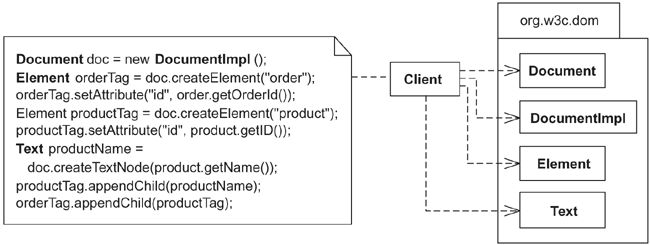
	* 
	* 결합도를 줄이기 위해 완전히 다른 수준의 인디렉션이 필요한 경우가 있다.
		* XML을 생성하기 위해 한 프로젝트 내에서 어떤 경우에는 컴포짓을 사용하고 어떤 경우에는 DOM을 사용할 수도 있다.
		* Encapsulate Composite with Builder 리팩터링
* 트리가 작고 관리하기 쉬운 상태라면, 묵시적인 트리로도 충분하다. 그러나 묵시적 트리를 다루기가 점점 힘들어지거나 복잡한 트리 구조로 인해 코드가 비대해진다면, Composite 패턴으로 리팩터링을 고려할 수 있다.

### 장점과 단점
```
  + 노드를 추가/삭제/포매팅하는 등의 반복적인 코드를 캡슐화한다.
  + 빈번하게 사용하는 유사한 로직을 다루기 위한 일반화된 방법을 제공한다.
  + 클라이언트가 데이터를 생성하는 방법이 단순해진다.
  - 묵시적인 트리로도 충분한 경우에는 괜히 설계만 복잡하게 만드는 것이다.
```

### 절차

* 두가지 경로
	* 묵시적 트리를 조금씩 리팩터링해 컴포짓으로 바꾸기
	* 테스트 주도 개발을 포함하여 리팩터링하기
		* Extract Class 와 같은 리팩터링을 적용하는 것이 여의치 않을 때는 테스트 주도 개발을 사용한다.
1. 묵시적 트리 중, 새로운 클래스로 모델화 할 수 있는 부분인, 묵시적 종단implicit leaf를 찾는다.
	* 새로운 클래스는 종단 노드leaf node를 나타내며 Composite 패턴의 Leaf에 해당한다.
	* 종단 노드 클래스는 Extract Class 리팩터링 또는 테스트 주도 개발을 통해 생성할 수 있다.
	* 묵시적인 종단에 속성이 있다면, 각 속성에 해당하는 필드를 종단 노드 클래스에 만든다.
	* 컴파일 후 테스트
1. 묵시적 종단이 쓰인 곳은 모두 종단 노드 클래스의 인스턴스로 치환하여, 묵시적 트리가 묵시적인 종단 대신 종단 노드로 구성되도록 한다.
	* 컴파일 후 묵시적인 트리가 여전히 정상정으로 동작하는지 테스트한다.
1. 묵시적인 종단을 나타내는 다른 부분에도 단계 1, 2를 반복한다.
	* 주의 : 모든 종단 노드 클래스가 동일 인터페이스를 공유해야 한다.(Extract Superclass, Extract Interface 이용)
1. 묵시적 트리 중에서 묵시적 부모implicit parent를 찾는다.
	* 클라이언트 코드에서는 생성자나 add(...) 메서드를 통해 부모 노드에 종단 노드를 추가할 수 있어야 한다.
	* 부모 노드는 모든 자식 노드를 동일한 방법으로 다룰 수 있어야 한다.(동일한 인터페이스)
	* 부모 노드도 또 다른 부모 노드의 자식이 될 수 있어야 하거나 클라이언트 코드에서 종단 노드와 부모 노드를 구별하지 않아도 되도록 하려면(Replace One-Many Distinctions with Composite) 부모 노드도 같은 인터페이스를 구현하게 해야 한다.
1. 묵시적인 부모가 쓰인 곳은 모두 부모 노드 클래스의 인스턴스로 치환한다.
	* 부모 노드에 적절한 종단 노드 인스턴스가 들어가도록 주의
	* 컴파일 후 묵시적인 트리가 여전히 정상정으로 동작하는지 테스트한다.
1. 다른 묵시적 부모에 대해서도 단계 3, 4를 반복한다.
	* 묵시적인 부모가 다른 묵시적인 부모의 자식이 될 수 있을 때만, 부모 노드 클래스에서도 그런 동작이 가능하도록 만든다.


### 예제

```java
public class OrdersWriter {
  private Orders orders;

  public OrdersWriter(Orders orders) {
    this.orders = orders;
  }

  public String getContents() {
    StringBuffer xml = new StringBuffer();
    writeOrderTo(xml);
    return xml.toString();
  }

  private void writeOrderTo(StringBuffer xml) {
    xml.append("<orders>");
    for (int i = 0; i < orders.getOrderCount(); i++) {
      Order order = orders.getOrder(i);
      xml.append("<order");
      xml.append(" id='");
      xml.append(order.getOrderId());
      xml.append("'>");
      writeProductsTo(xml, order);
      xml.append("</order>");
    }
    xml.append("</orders>");
  }

  private void writeProductsTo(StringBuffer xml, Order order) {
    for (int j=0; j < order.getProductCount(); j++) {
      Product product = order.getProduct(j);
      xml.append("<product");
      xml.append(" id='");
      xml.append(product.getID());
      xml.append("'");
      xml.append(" color='");
      xml.append(colorFor(product));
      xml.append("'");
      if (product.getSize() != ProductSize.NOT_APPLICABLE) {
        xml.append(" size='");
        xml.append(sizeFor(product));
        xml.append("'");
      }
       xml.append(">");
      writePriceTo(xml, product);
      xml.append(product.getName());
      xml.append("</product>");
     }
  }

  private void writePriceTo(StringBuffer xml, Product product) {
    xml.append("<price");
    xml.append(" currency='");
    xml.append(currencyFor(product));
    xml.append("'>");
    xml.append(product.getPrice());
    xml.append("</price>");
  }
```

* writeOrderTo(...), writeProductsTo(...), wirtePriceTo(...) 가 모두 XML 생성에 사용될 데이터를 얻기 위해 도메인 객체인 Order, Product, Price에 대해 루프를 돌고 있다.
	* Order 객체가 toXML()을 호출하고, 차례대로 그에 포함된 Product객체의 XML, Product 내의 Price 객체에 대한 XML을 얻는 방법을 고려해 볼 수 있다.
		* 위의 함수에서 도메인 객체 간에 존재하는 포함 관계를 재구성 하지 않아도 되는 장점.
		* 이 경우, 한 종류의 도메인 객체에 대해 여러가지 XML을 만들어야 하는 시스템에서는 좋은 설계가 아니다.
		* ```
        <order id='987' totalPrice='14.00'>
            <product id='f1234' price='9.00' quantity='1'>
                Fire Truck
            </product>
            <product id='f4321' price='5.00' quantity='1'>
                Rubber Ball
            </product>
        </order>

        <orderHistory>
            <order date='20041120' totalPrice='14.00'>
                <product id='f1234'>
                <product id='f4321'>
            </order>
        </orderHistory>

        <order id='321'>
            <product id='f1234' color='red' size='medium'>
                <price currency='USD'>
                    8.95
                </price>
                Fire Truck
            </product>
        </order>
   		```
* 각 경우에 따라 XML이 매우 다르므로 writeOrderTo(...), writeProductsTo(...), wirtePriceTo(...)를 이용하여 XML 생성을 외부에서 처리하거나 Visitor 패턴을 고려할 수 있다.
	* Move Accumulation to Visitor 참조
* 우선 이 XML 생성 로직을 단순하게 하기 위해 Composite 패턴을 사용한다.

1. 묵시적 종단을 찾는다.
	* ```java
String expectedResult =
                "<orders>" +
                  "<order id='321'>" +
                    "<product id='f1234' color='red' size='medium'>" +
                      "<price currency='USD'>" +
                        "8.95" +
                      "</price>" +
                      "Fire Truck" +
                    "</product>" +
                  "</order>" +
                "</orders>";
	```
	* 종단 노드 클래스에서 태그 값이 8.95를 쉽게 표현할 수 있으므로 < price >...< /price >를 묵시적 종단으로 선택한다.
	* 테스트 주도 개발을 통해 TagNode라는 이름의 클래스를 만든다.
	* ```java
	public class TagTests extends TestCase...
  		private static final String SAMPLE_PRICE = "8.95";
  		public void testSimpleTagWithOneAttributeAndValue() {
    		TagNode priceTag = new TagNode("price");
    		priceTag.addAttribute("currency", "USD");
    		priceTag.addValue(SAMPLE_PRICE);
    		String expected =
      				"<price currency=" +
      				"'" +
      				"USD" +
      				"'>" +
      				SAMPLE_PRICE +
      				"</price>";
    		assertEquals("price XML", expected, priceTag.toString());
  		}
	```
	* 다음은 테스트를 통과하기 위해 필요한 코드
	* ```java
    public class TagNode {
        private String name = "";
        private String value = "";
        private StringBuffer attributes;

        public TagNode(String name) {
            this.name = name;
            attributes = new StringBuffer("");
        }

        public void addAttribute(String attribute, String value) {
            attributes.append(" ");
            attributes.append(attribute);
            attributes.append("='");
            attributes.append(value);
            attributes.append("'");
        }

        public void addValue(String value) {
            this.value = value;
        }

        public String toString() {
            String result;
            result =
                    "<" + name + attributes + ">" +
                    value +
                    "</" + name + ">";
                    return result;
        }
	```
	* getContents() 메서드 내의 묵시적인 종단을 TagNode 인스턴스로 치환한다.
	* ```java
    public class OrdersWriter...
        private void writePriceTo(StringBuffer xml, Product product) {
            TagNode priceNode = new TagNode("price");
            priceNode.addAttribute("currency", currencyFor(product));
            priceNode.addValue(priceFor(product));
            xml.append(priceNode.toString());

            /* xml.append("<price");
            xml.append(" currency='");
            xml.append(currencyFor(product));
            xml.append("'>");
            xml.append(product.getPrice());
            xml.append("</price>"); */
    }
  ```
	* 컴파일 후 테스트 실행하여, 묵시적 트리가 여전히 제대로 생성되는 지 확인한다.
1. TagNode 클래스는 XML 내의 모든 묵시적 종단을 대표하므로, 다른 묵시적 종단에 대해 단계 1, 2를 반복할 필요가 없다.
    * 새로운 종단 노드 클래스가 기존의 종단 노드 클래스와 공통 인터페이스를 갖게 만드는 작업도 필요없다.
1. 묵시적 부모를 찾는다.
    * < price > -> < product > -> < order > -> < orders >
    * 앞에서의 묵시적 종단과 매우 비슷한 성질을 갖고 있으므로 TagNode에 자식 처리 기능을 추가한다.
    * 테스트 주도 개발을 위한 테스트 코드
    ```java
    public void testCompositeTagOneChild() {
        TagNode productTag = new TagNode("product");
        productTag.add(new TagNode("price"));
        String expected =
                            "<product>" +
                            "<price>" +
                            "</price>" +
                            "</product>";
        assertEquals("price XML", expected, productTag.toString());
    }
    ```
    * 테스트를 통화하기 위해 필요한 코드
    * ```java
    public class TagNode...
      private List children;

      public String toString() {
        String result;
        result = "<" + name + attributes + ">";
        Iterator it = children().iterator();
        while (it.hasNext()) {
          TagNode node = (TagNode)it.next();
          result += node.toString();
        }
        result += value;
        result += "</" + name + ">";
        return result;
      }

      private List children() {
        if (children == null)
          children = new ArrayList();
        return children;
      }

      public void add(TagNode child) {
        children().add(child);
      }
      ```
    * 좀 더 견고한 테스트
    ```java
        public void testAddingChildrenAndGrandchildren() {
           String expected =
                           "<orders>" +
                             "<order>" +
                                "<product>" +
                                "</product>" +
                             "</order>" +
                           "</orders>";
                           
           TagNode ordersTag = new TagNode("orders");
           TagNode orderTag = new TagNode("order");
           TagNode productTag = new TagNode("product");
           ordersTag.add(orderTag);
           orderTag.add(productTag);
           assertEquals("price XML", expected, ordersTag.toString());
        }
    ```
1. TagNode가 부모 노드로서 적절히 동작할 수 있을 때까지 코드 작성과 테스트 실행을 계속한다.
	* 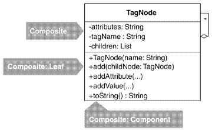
1. 묵시적 부모가 쓰인 곳을 찾아 모두 부모 노드 인스턴스를 사용하도록 바꾼다.
	* 부모 노드에는 적절한 종단 노드가 추가되도록 한다.
	* ```java
    public class OrdersWriter...
        private void writeProductsTo(StringBuffer xml, Order order) {
            for (int j=0; j < order.getProductCount(); j++) {
                Product product = order.getProduct(j);
                TagNode productTag = new TagNode("product");
                productTag.addAttribute("id", product.getID());
                productTag.addAttribute("color", colorFor(product));
                if (product.getSize() != ProductSize.NOT_APPLICABLE)
               		productTag.addAttribute("size", sizeFor(product));
                writePriceTo(productTag, product);
                productTag.addValue(product.getName());
                xml.append(productTag.toString());
            }
        }

        private void writePriceTo(TagNode productTag, Product product) {
            TagNode priceTag = new TagNode("price");
            priceTag.addAttribute("currency", currencyFor(product));
            priceTag.addValue(priceFor(product));
            productTag.add(priceTag);
        }
	```
	* 컴파일 후 테스트 실행하여, 묵시적 트리가 여전히 제대로 생성되는 지 확인한다.
1. 나머지 묵시적 부모에 대해 단계 4, 5를 반복한다.
* ```java
public class OrdersWriter...
    public String getContents() {
        StringBuffer xml = new StringBuffer();
        writeOrderTo(xml);
        return xml.toString();
    }

    private void writeOrderTo(StringBuffer xml) {
        TagNode ordersTag = new TagNode("orders");
        for (int i = 0; i < orders.getOrderCount(); i++) {
            Order order = orders.getOrder(i);
            TagNode orderTag = new TagNode("order");
            orderTag.addAttribute("id", order.getOrderId());
            writeProductsTo(orderTag, order);
            ordersTag.add(orderTag);
        }
        xml.append(ordersTag.toString());
    }

    private void writeProductsTo(TagNode orderTag, Order order) {
        for (int j=0; j < order.getProductCount(); j++) {
            Product product = order.getProduct(j);
            TagNode productTag = new TagNode("product");
            productTag.addAttribute("id", product.getID());
            productTag.addAttribute("color", colorFor(product));
            if (product.getSize() != ProductSize.NOT_APPLICABLE)
                productTag.addAttribute("size", sizeFor(product));
            writePriceTo(productTag, product);
            productTag.addValue(product.getName());
            orderTag.add(productTag);
        }
    }

    private void writePriceTo(TagNode productTag, Product product) {
        TagNode priceNode = new TagNode("price");
        priceNode.addAttribute("currency", currencyFor(product));
        priceNode.addValue(priceFor(product));
        productTag.add(priceNode);
    }
```

## Replace Conditional Dispatcher with Command

요청에 대한 Dispatcher가 조건 로직으로 구현되어 있다면, 각 액션에 대한 커맨드 객체를 만들어 컬렉션에 저장해 두고, 조건 로직은 컬렉션에서 원하는 커맨드 객체를 찾아 실행하는 코드로 대체한다.


### Command Pattern


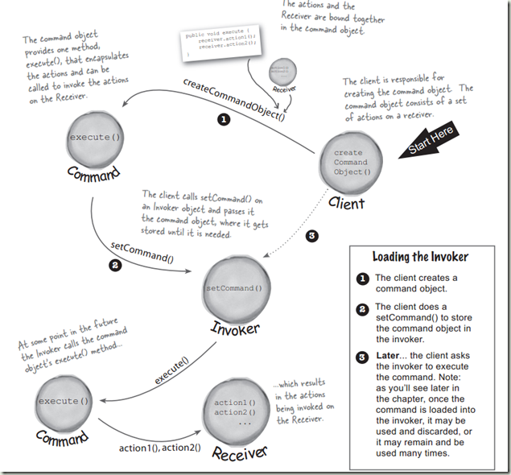

* 클라이언트 객체 : 손님
* 커맨드 객체 : 주문서
* 인보커 객체 : 웨이트리스
* setCommand() : takeOrder()
* execute() : orderUp()
* 리시버 객체 : 주방장

### Conditional Dispatcher

: 외부 요청을 받아 분배하고 실행하는 동작이 일어날 때 요청을 분배하고 실행하는 조건문.

#### 동기

* 처리해야 할 요청의 종류가 적고 이것을 처리하는 로직도 얼마 되지 않는다면 디스패처를 조건 로직으로 구현해도 무방하다.
* 조건적 디스패처를 Command 패턴으로 리팩터링하는 대표적 이유.
	* 런타임에 충분히 유동적이지 못하다.
		* 조건문 디스패처는 처리 로직이 조건문으로 하드 코딩되기 때문에 요청이나 처리 로직이 동적으로 구성될 필요가 있는 경우는 적절하지 않다.
	* 코드가 비대해진다.
		* 새로운 종류의 요청을 처리하기 위한 로직이 추가되거나 새로운 요건에 의해 처리 로직이 복잡해지면 코드는 무지막지하게 커질수 밖에 없다.
* Command 패턴을 사용하여 커맨드 집합을 만들고 나면, 컬렉션을 이용해 그 인스턴스를 저장하고 조작할 수 있고, 요청이 들어왔을 때 그에 해당하는 커맨드 인스턴스를 찾아 실행 메서드를 호출하면 된다.
``` 
 장점과 단점
 + 다양한 액션을 단일한 방식으로 실행하는 단순한 구조를 제공한다.
 + 요청을 처리하는 로직의 구성을 런타임에 변경할 수 있다.
 + 간단한 코드로 구현할 수 있다.
 - 조건적 디스패처로도 충분한 상황에서는 괜히 설계만 복잡하게 만드는 것이다.
```

#### 절차 및 예제

* 회사의 워크샵 카탈로그를 HTML로 생성하는 시스템 중 일부(억지로 만든 예제).

```java
public class CatalogApp...
  private HandlerResponse executeActionAndGetResponse(String actionName, Map parameters)...
    if (actionName.equals(NEW_WORKSHOP)) {
      String nextWorkshopID = workshopManager.getNextWorkshopID();
      StringBuffer newWorkshopContents =
        workshopManager.createNewFileFromTemplate(
          nextWorkshopID,
          workshopManager.getWorkshopDir(),
          workshopManager.getWorkshopTemplate()
        );
      workshopManager.addWorkshop(newWorkshopContents);
      parameters.put("id",nextWorkshopID);
      executeActionAndGetResponse(ALL_WORKSHOPS, parameters);
    } else if (actionName.equals(ALL_WORKSHOPS)) {
      XMLBuilder allWorkshopsXml = new XMLBuilder("workshops");
      WorkshopRepository repository =
        workshopManager.getWorkshopRepository();
      Iterator ids = repository.keyIterator();
      while (ids.hasNext()) {
        String id = (String)ids.next();
        Workshop workshop = repository.getWorkshop(id);
        allWorkshopsXml.addBelowParent("workshop");
        allWorkshopsXml.addAttribute("id", workshop.getID());
        allWorkshopsXml.addAttribute("name", workshop.getName());
        allWorkshopsXml.addAttribute("status", workshop.getStatus());
        allWorkshopsXml.addAttribute("duration",
          workshop.getDurationAsString());
      }
      String formattedXml = getFormattedData(allWorkshopsXml.toString());
      return new HandlerResponse(
        new StringBuffer(formattedXml),
        ALL_WORKSHOPS_STYLESHEET
      );
    } //...many more "else if" statements
```

* 조건 로직에서 첫번째 분기는 새 워크샵을 생성하는 것이고, 두번째 분기는 워크샵 전체에 대한 요약 정보를 XML로 만드는 것이다.

1. 첫번째 분기문에서 Extract Method 리팩터링을 적용해 getNewWorkshopResponse() 라는 실행 메서드를 만든다.
```java
public class CatalogApp...
  private HandlerResponse executeActionAndGetResponse(String actionName, Map parameters)...
    if (actionName.equals(NEW_WORKSHOP)) {
    getNewWorkshopResponse(parameters); 
    } else if (actionName.equals(ALL_WORKSHOPS)) {
      ...
    } ...many more "else if" statements
  
 private void getNewWorkshopResponse(Map parameters) throws Exception { 
    String nextWorkshopID = workshopManager.getNextWorkshopID(); 
    StringBuffer newWorkshopContents = 
       workshopManager.createNewFileFromTemplate( 
           nextWorkshopID, 
           workshopManager.getWorkshopDir(), 
           workshopManager.getWorkshopTemplate() 
           ); 
    workshopManager.addWorkshop(newWorkshopContents); 
    parameters.put("id",nextWorkshopID); 
    executeActionAndGetResponse(ALL_WORKSHOPS, parameters); 
 } 
```
2. 카탈로그의 모든 워크샵 목록을 처리하는 두번째 분기문에 대해서도 단계 1을 반복한다.
```java
public class CatalogApp...
  private HandlerResponse executeActionAndGetResponse(String actionName, Map parameters)...
    if (actionName.equals(NEW_WORKSHOP)) {
      getNewWorkshopResponse(parameters);
    } else if (actionName.equals(ALL_WORKSHOPS)) {
   getAllWorkshopsResponse(); 
    } //...many more "else if" statements
 
 public HandlerResponse getAllWorkshopsResponse() { 
   XMLBuilder allWorkshopsXml = new XMLBuilder("workshops"); 
   WorkshopRepository repository = 
      workshopManager.getWorkshopRepository(); 
   Iterator ids = repository.keyIterator(); 
   while (ids.hasNext()) { 
      String id = (String)ids.next(); 
      Workshop workshop = repository.getWorkshop(id); 
      allWorkshopsXml.addBelowParent("workshop"); 
      allWorkshopsXml.addAttribute("id", workshop.getID()); 
      allWorkshopsXml.addAttribute("name", workshop.getName()); 
      allWorkshopsXml.addAttribute("status", workshop.getStatus()); 
      allWorkshopsXml.addAttribute("duraction", 
      workshop.getDurationAsString()); 
   } 
   String formattedXml = getFormattedData(allWorkshopsXml.toString()); 
   return new HandlerResponse( 
      new StringBuffer(formattedXml), 
      ALL_WORKSHOPS_STYLESHEET 
   ); 
 } 
```
컴파일 후 테스트한다. 다른 요청 처리 코드에 대해서도 이 단계를 반복한다.
3. 구체 커맨드 클래스를 만들기 시작한다. 먼저 getNewWorkshopResponse() 메서드에 Extract Class 리팩터링을 적용해 NewWorkshopHandler 라는 구체 커맨드 클래스를 만든다.
```java
 public class NewWorkshopHandler { 
   private CatalogApp catalogApp; 
   public NewWorkshopHandler(CatalogApp catalogApp) { 
      this.catalogApp = catalogApp; 
   } 
  
   public HandlerResponse getNewWorkshopResponse(Map parameters) throws Exception { 
    String nextWorkshopID = workshopManager().getNextWorkshopID(); 
    StringBuffer newWorkshopContents = 
       WorkshopManager().createNewFileFromTemplate( 
          nextWorkshopID, 
          workshopManager().getWorkshopDir(), 
          workshopManager().getWorkshopTemplate() 
       ); 
    workshopManager().addWorkshop(newWorkshopContents); 
    parameters.put("id", nextWorkshopID); 
    catalogApp.executeActionAndGetResponse(ALL_WORKSHOPS, parameters); 
 } 
  
 private WorkshopManager workshopManager() { 
    return catalogApp.getWorkshopManager(); 
  } 
 } 
```
CatalogApp 에서는 다음과 같이 NewWorkshopHandler 객체를 만들고 그 실행 메서드를 호출한다.
```java
 public class CatalogApp...
     public  HandlerResponse executeActionAndGetResponse(
         String actionName, Map parameters) throws Exception {
         if (actionName.equals(NEW_WORKSHOP)) {
            return new NewWorkshopHandler(this).getNewWorkshopResponse(parameters); 
         } else if (actionName.equals(ALL_WORKSHOPS)) {
      ...
    } ...
```
컴파일 후 테스트를 하여 정상 동작하는지 확인한다. NewWorkshopHandler가 이 메서드를 호출하기 때문에 executeActionAndGetRespose() 를 public으로 만든 것에 주의하기 바란다. 더 진행하기 전에 NewWorkshopHandler의 실행 메서드에Compose Method 리팩터링을 적용한다.
```java
 public class NewWorkshopHandler... 
   public HandlerResponse getNewWorkshopResponse(Map parameters) throws Exception { 
      createNewWorkshop(parameters); 
      return catalogApp.executeActionAndGetResponse( 
         CatalogApp.ALL_WORKSHOPS, parameters); 
   }  

   private void createNewWorkshop(Map parameters) throws Exception { 
      String nextWorkshopID = workshopManager().getNextWorkshopID(); 
      workshopManager().addWorkshop(newWorkshopContents(nextWorkshopID)); 
      parameters.put("id",nextWorkshopID); 
   } 

   private StringBuffer newWorkshopContents(String nextWorkshopID) throws Exception { 
      StringBuffer newWorkshopContents = workshopManager().createNewFileFromTemplate( 
         nextWorkshopID, 
         workshopManager().getWorkshopDir(), 
         workshopManager().getWorkshopTemplate() 
      ); 
      return newWorkshopContents; 
   }
```
나머지 실행 메서드도 별도의 구체 커맨드 클래스로 분리하고 Compose Method로 만든다. 다음은 AllWorkshopsHandler를 구체 커맨드로 뽑아낼 차례다.
```java
 public class AllWorkshopsHandler... 
    private CatalogApp catalogApp; 
    private static String ALL_WORKSHOPS_STYLESHEET="allWorkshops.xsl"; 
    private PrettyPrinter prettyPrinter = new PrettyPrinter(); 

    public AllWorkshopsHandler(CatalogApp catalogApp) { 
    this.catalogApp = catalogApp; 
    } 

 public HandlerResponse getAllWorkshopsResponse() throws Exception { 
    return new HandlerResponse( 
      new StringBuffer(prettyPrint(allWorkshopsData())), 
      ALL_WORKSHOPS_STYLESHEET 
    ); 
 } 

 private String allWorkshopsData() ... 

 private String prettyPrint(String buffer) { 
   return prettyPrinter.format(buffer); 
 }
```
모든 구체 커맨드에대하여 이 단계를 마친후 커맨드 클래스 사이에 중복된 코드가 없는지 확인한다. 중복이 별로 없으므로 Form Template Method 리팩터링을 적용할 필요가 없다.
4. 다음은 커맨드 수퍼타입을 정의할 차례다. 커맨드 수퍼타입이란 모든 구체 커맨드 클래스가 구현해야 할 공통의 실행 메서드를 선언하는 인터페이스 또는 추상 클래스다. 그러나 현재 상태를 보면, 구체 커맨드 클래스의 실행 메서드는 각각 이름도 다르고 파라민터의 개수와 타임도 다르다.
```java
 if (actionName.equals(NEW_WORKSHOP)) {
    return new NewWorkshopHandler(this).getNewWorkshopResponse(parameters); 
 } else if (actionName.equals(ALL_WORKSHOPS)) {
    return new AllWorkshopsHandler(this).getAllWorkshopsResponse(); 
   } ...
```
    커맨드 수퍼타입을 만들려면 다음 사항을 결정해야 한다.
    * 공통 실행 메서드의 이름.
    * 실행 메서드로 넘겨야 할 정보와 실행 메서드로부터 받을 정보
        * 공통 실행 메서드의이름은 execute 를 쓰기로 했다. 이제 execute()에 넘겨야 할 정보와 execute()로부터 받을 정보를 결정할 차례다. 앞에서 생성한 구체 커맨드 클래스들을 살펴보니, 많은 실행 메서드가 다음과 같음을 알 수 있다.
    * parameters라는 이름의 Map에 포함된 정보를 필요로 한다.
    * HandlerResponse 타입의 객체를 리턴한다.
    * Exception 을 발생한다.
    이로부터 execute() 메서드의 시그너처는 다음과 같이 정할 수 잇다.
    ```java
     public HandlerResponse execute(Map parameters) throws Exception
    ```
    이제 커맨드 수퍼타입을 실제로 만들 수 있다. 먼저, getNewWorkshopResponse() 메서드의 이름을 execute로 바꾼다.
    ```java
     public class NewWorkshopHandler...
       public HandlerResponse execute(Map parameters) throws Exception 
    ```
    그 다음 Extract Superclass 리팩터링을 이용하여 Handler 라는 추상 클래스를 만든다.
    ```java
     public abstract class Handler { 
        protected CatalogApp catalogApp; 

        public Handler(CatalogApp catalogApp) { 
           this.catalogApp = catalogApp; 
        } 
     } 

     public class NewWorkshopHandler  extends Handler... 
        public NewWorkshopHandler(CatalogApp catalogApp) {
        super(catalogApp); 
        }
    ```
    컴파일 후 테스트해 보고, 문제가 없으면 다음 단계로 넘어간다.
5. 커맨드 수퍼타입을 만들었으므로 기존의 구체 커맨드 클래스가 이 커맨드 수퍼타입을 상속하도록 수정한다. Handler 클래스를 상속해, execute() 메서드를 구현하면 된다. 이 과정까지 마치면 모든 커맨드 객체의 실행 메서드를 다음과 같이 단일한 방식으로 호출할 수 있게 될 것이다.
```java
if (actionName.equals(NEW_WORKSHOP)) {
     return new NewWorkshopHandler(this).
execute(parameters);
   } else if (actionName.  equals(ALL_WORKSHOPS)) { 
     return new AllWorkshopsHandler(this).  execute(parameters); 
   } ...
```
6. CatalogApp 클래스의 조건 로직은 단지 매핑의 역할만 하고 있으므로, 커맨드 인스턴스를 저장하는 진짜 맵으로 대체하는 것이 더 좋겠다. handlers라는 이름의 Map 객체를 만들고, 액션 이름을 키로 해서 커맨드 객체를 Map에 넣는다.
```java
 public class CatalogApp...
   private Map handlers; 
  public CatalogApp(...) {
    ...
   createHandlers(); 
    ...
  }
  
 public void createHandlers() { 
     handlers = new HashMap(); 
     handlers.put(NEW_WORKSHOP, new NewWorkshopHandler(this)); 
     handlers.put(ALL_WORKSHOPS, new AllWorkshopsHandler(this)); 
     ... 
 } 
```
커맨드 클래스의 개수가 많다면, 맵에 커맨드 객체를 만들어 넣는 코드가 매우 길어질 것이다. 그럴 경우에는 Plugin 패턴을 도입하면 도움이 된다. 이 패턴을 이용하면 적절한 설정 데이터(커맨드 클래스의 이름 목록 또는 클래스 파일이 있는 디렉터리의 위치와 같은)를 통해 커맨드 맵이 반자동적으로 생성되도록 할 수 있다. 당장은 커맨드 클래스가 많지 않기 때문에, Plugin 패턴을 도입할 필요까지는 없다.
7. 마지막으로 CatalogApp 클래스의 조건 로직을 제거하고, Map 객체에서 원하는 커맨드 객체를 찾아 실행하는 코드로 대체한다.
```java
 public class CatalogApp...
    public HandlerResponse executeActionAndGetResponse(
    String handlerName, Map parameters) throws Exception {
   Handler handler = lookupHandlerBy(handlerName); 
   return handler.execute(parameters); 
    }

   private Handler lookupHandlerBy(String handlerName) { 
      return (Handler)handlers.get(handlerName); 
   } 
```