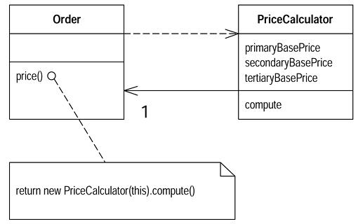

# 6장. Composing Method

[TOC]

## Extract Method

**그룹으로 함께 묶을 수 있는 코드 조각이 있으면** 코드의 목적이 잘 드러나도록 메소드의 이름을 지어 별도의 메소드로 뽑아낸다.

```java
void printOwing(double amount) {
	printBanner();
    
    //print details
    System.out.println("name:" + _name);
    System.out.println("amount: " + amount);
}
```
```java
void printOwing(double amout) {
	printBanner();
    printDetails(amount);
}

void printDetails(double amount) {
	System.out.println("name: " + _name);
    System.out.println("amount: " + amount);
}
```

### 동기

* 지나치게 긴 메소드
* 목적을 이해하기 위해서 주석이 필요한 코드
* 짧고 이해하기 쉬운 메소드
	* 메소드가 잘게 쪼개져 있을 떄 다른 메소드에서 사용될 확률이 높아진다.
	* 상위 레벨(high-level)의 메소드를 볼 때 일련의 주석을 읽는 것 같은 느낌이 든다.
	* 오버라이드 하는 것도 쉽다.
* 이름을 지을 때 주의하라.
* 한 메소드의 길이는 중요하지 않다.
	* 메소드의 이름과 메소드 몸체의 의미적 차이
	* 뽑아내는 것이 코드를 더욱 명확하게 하면, 새로 만든 메소드의 이름이 원래 코드의 길이보다 길어져도 뽑아낸다.

### 절차

* 메소드를 새로 만들고, 의도를 잘 나타낼 수 있도록 이름을 정한다.
	* 어떻게 하는지를 나타내는 방식으로 이름을 정하지 말고, 무엇을 하는지를 나타내게 이름을 정한다.
	* **더 이해하기 쉬운 이름을 지을 수 없다면 뽑아내지 않는 것이 낫다.**
* 원래 메소드에서 뽑아내고자 하는 부분의 코드를 복사하여 새로운 메소드로 옮긴다.
* 원래 메소드에서 사용되고 있는 지역 변수가 뽑아낸 코드에 있는지 확인한다.
	* 이런 지역 변수는 새로운 메소드의 지역변수나 파라미터가 된다.
* 뽑아낸 코드 내에서만 사용되는 임시 변수가 있는지 본다.
	* 있다면 새로 만든 메소드의 임시 변수로 선언한다.
* 뽑아낸 코드 내에서 지역 변수의 값이 수정되는지 본다.
	* 하나의 지역변수만 수정된다면, 뽑아낸 코드를 질의로 보고, 수정된 결과를 관련된 변수에 대입할 수 있는지 본다.
	* 이렇게 하는 것이 이상하거나, 값이 수정되는 지역변수가 두 개 이상 있다면 쉽게 메소드로 추출할 수 없는 경우이다.
		* Split Temporary Variable을 사용한 뒤에 재시도.
		* 임시 변수는 Replace Temp with Query로 제거
* 뽑아낸 코드에서 읽기만 하는 변수는 새 메소드의 파라미터로 넘긴다.
* 지역 변수와 관련된 사항을 다룬 후에는 컴파일 한다.
* 원래 메소드에서 뽑아낸 코드 부분은 새로 만든 메소드를 호출하도록 바꾼다.
	* 새로 만든 메소드로 옮긴 임시 변수가 있는 경우, 그 임시 변수가 원래 메소드의 밖에서 선언 되었는지를 확인한다.
	* 새로 만든 메소드에서는 선언을 해줄 필요가 없다.
* 컴파일과 테스트를 한다.

#### 지역 변수가 없는 경우

```java
void printOwing() {
	Enumeration e = _orders.elements();
    double outstanding = 0.0;
    
    // print banner
    System.out.println("************************");
    System.out.println("**** Customer  Owes ****");
    System.out.println("************************");
    
    // calculate outstanding
    while(e.hasMoreElements()) {
    	Order each = (Order) e.nextElement();
        outstanding += each.getAmount();
    }
    
    // print details
    System.out.println("name: " + _name);
    System.out.println("amount: " + outstanding);
}
```
**배너를 인쇄하는 부분을 뽑아내는 것은 쉽다.** ==> Cut and Pasted 후 원래 코드는 새 메소드를 호출한다.

```java
public static void printOwing_Step1() {
    Enumeration e = _orders.elements();
    double outstanding = 0.0;

    printBanner();

    // calculate outstanding
    while (e.hasMoreElements()) {
        Order each = (Order) e.nextElement();
        outstanding += each.getAmount();
    }

    //print details
    System.out.println ("name:" + _name);
    System.out.println("amount: " + outstanding);
}

private static void printBanner() {
    // print banner
    System.out.println ("**************************");
    System.out.println ("***** Customer Owes ******");
    System.out.println ("**************************");
}
```

**지역 변수가 포함되어 있는 경우**
* 가장 쉬운 것은 변수가 읽히기만 하고 값이 변하지 않는 경우 ==> 그냥 파라미터만 넘긴다.

```java
public static void printOwing_Step2() {
    Enumeration e = _orders.elements();
    double outstanding = 0.0;

    printBanner();

    // calculate outstanding
    while (e.hasMoreElements()) {
        Order each = (Order) e.nextElement();
        outstanding += each.getAmount();
    }

    printDetails(outstanding);
}

private static void printDetails(double outstanding) {
    System.out.println ("name:" + _name);
    System.out.println ("amount: " + outstanding);
}
```
* 실제로 지역 변수에 다른 값을 대입하는 경우에만 부가적인 작업이 필요하다.

**지역 변수에 다른 값을 여러번 대입하는 경우**
* 지역 변수에 다른 값을 대입하는 코드가 있는 경우에는 문제가 복잡
* 우선 임시변수에 대해서만 생각
	* 파라미터에 다른 값을 대입하는 코드가 있다면 Remove Assignments to Parameters를 적용한다.
* 임시 코드에 값을 대입하는 경우
	* 임시 변수가 뽑아낸 코드 안에서만 사용 될 때
		* 뽑아낸 코드로 임시 변수를 옮긴다.
    * 임시 변수가 뽑아낸 코드 외부에도 사용되는 경우
    	* 뽑아낸 코드 이후의 부분에서 사용되지 않는다면, **앞의 경우처럼 바꿀 수 있다.**
    	* 이 후에서도 사용된다면, 뽑아낸 코드에서 **임시변수의 바뀐 값을 리턴하도록 수정**

**계산 부분의 코드만 뽑는다.**
**변수 e는 뽑아낸 코드안에서만 사용되기 때문에 새 메소드로 옮길 수 있다. 변수 outstanding은 양쪽에서 모두 사용되므로 뽑아낸 메소드에서 그 값을 리턴하게 한다. 테스트 후에 변수 이름을 변경한다.**

```java
public static void printOwing_Step3() {
    printBanner();
    double outstanding = getOutstanding();
    printDetails(outstanding);
}

private static double getOutstanding() {
    Enumeration e = _orders.elements();
    double result = 0.0;
    while (e.hasMoreElements()) {
        Order each = (Order) e.nextElement();
        result += each.getAmount();
    }
    return result;
}
```

**만약 변수와 관련된 다른 코드가 있다면 이전의 값을 파라미터로 넘겨야 한다.**

```java
public static void printOwing_Step4(double previousAmount) {
    printBanner();
    double outstanding = previousAmount * 1.2;
    outstanding = getOutstanding(outstanding);
    printDetails(outstanding);
}

private static double getOutstanding(double initialValue) {
    Enumeration e = _orders.elements();
    double result = initialValue;
    while (e.hasMoreElements()) {
        Order each = (Order) e.nextElement();
        result += each.getAmount();
    }
    return result;
}
```

**컴파일과 테스트를 한 후에 outstanding 변수를 초기화하는 방법을 바꾼다.**

```java
public static void printOwing_Step5(double previousAmount) {
        printBanner();
        double outstanding = getOutstanding(previousAmount * 1.2);
        printDetails(outstanding);
    }
```

* 만약 두개 이상의 값이 리턴되어야 한다면
	* 가장 좋은 선택은 뽑아낼 코드를 다르게 선택하라.
		* 각각의 다른 값에 대한 메소드를 따로 만든다.
    * 사용중인 언어가 출력 파라미터를 지원한다면 이것을 이용한다.
* 임시 변수가 너무 많아 코드를 뽑기 힘든 경우
	* Replace Temp with Query (임시 변수를 줄인다.)
	* Replace Method with Method Object


## Inline Method

**메소드 몸체가 메소드의 이름만큼이나 명확할 때**는 호출하는 곳에 메소드의 몸체를 넣고, 메소드를 삭제하라

```java
int getRating() {
	return (moreThanFiveLateDeliveries()) ? 2 : 1;
}

boolean moreThanFiveLateDeliveries() {
	return _numberOfLateDeliveries > 5;
}
```

```java
int getRating() {
	return (_numberOfLateDeliveries > 5) ? 2: 1;
}
```

### 동기

* 이럴 때는 메소드를 제거한다.
	* 때로는 메소드의 몸체가 메소드의 이름만큼이나 명확할 때가 있다.
	* 메소드의 몸체를 메소드의 이름만큼이나 명확하게 리팩토링할 수도 있다.
	* 필요없는 인디렉션은 짜증나게 한다.
* 메소드가 잘못 나뉘어졌을 때
	* 메소드를 다시 합쳐 하나의 큰 메소드로 만든 다음 다시 메소드 추출
		* Replace Method with Method Object를 사용하기 전에 이 방법을 쓰면 좋다(Kent Beck)
    * 메소드 객체가 포함하고 있어야 할 동작을 가진 메소드에 의해 호출되는 여러 메소드를 인라인화 한다.
    * 메소드와 그 메소드가 호출하는 다른 여러 메소드를 옮기는 것보다는 메소드 하나만 옮기는 것이 더 쉽다.
* 너무 많은 인디렉션이 사용되어 모든 메소드가 단순히 다른 메소드에 위임을 하고 있어 그 인디렉션 속에서 길을 잃을 염려가 있을 때

### 절차

* 메소드가 다형성을 가지고 있지 않은지 확인한다.
	* 서브 클래스에서 오버라이드 하고 있는 메소드에는 적용하지 않는다.
	* 수퍼 클래스에 없는 메소드를 서브 클래스에서 오버라이드 할 수는 없다.
* 메소드를 호출하고 있는 부분을 모두 찾는다.
* 각각의 메소드 호출을 메소드 몸체로 바꾼다.
* 컴파일과 테스트를 한다.# 6장. Composing Method

## Extract Method

**그룹으로 함께 묶을 수 있는 코드 조각이 있으면** 코드의 목적이 잘 드러나도록 메소드의 이름을 지어 별도의 메소드로 뽑아낸다.

```java
void printOwing(double amount) {
	printBanner();
    
    //print details
    System.out.println("name:" + _name);
    System.out.println("amount: " + amount);
}
```
```java
void printOwing(double amout) {
	printBanner();
    printDetails(amount);
}

void printDetails(double amount) {
	System.out.println("name: " + _name);
    System.out.println("amount: " + amount);
}
```

### 동기

* 지나치게 긴 메소드
* 목적을 이해하기 위해서 주석이 필요한 코드
* 짧고 이해하기 쉬운 메소드
	* 메소드가 잘게 쪼개져 있을 떄 다른 메소드에서 사용될 확률이 높아진다.
	* 상위 레벨(high-level)의 메소드를 볼 때 일련의 주석을 읽는 것 같은 느낌이 든다.
	* 오버라이드 하는 것도 쉽다.
* 이름을 지을 때 주의하라.
* 한 메소드의 길이는 중요하지 않다.
	* 메소드의 이름과 메소드 몸체의 의미적 차이
	* 뽑아내는 것이 코드를 더욱 명확하게 하면, 새로 만든 메소드의 이름이 원래 코드의 길이보다 길어져도 뽑아낸다.

### 절차

* 메소드를 새로 만들고, 의도를 잘 나타낼 수 있도록 이름을 정한다.
	* 어떻게 하는지를 나타내는 방식으로 이름을 정하지 말고, 무엇을 하는지를 나타내게 이름을 정한다.
	* **더 이해하기 쉬운 이름을 지을 수 없다면 뽑아내지 않는 것이 낫다.**
* 원래 메소드에서 뽑아내고자 하는 부분의 코드를 복사하여 새로운 메소드로 옮긴다.
* 원래 메소드에서 사용되고 있는 지역 변수가 뽑아낸 코드에 있는지 확인한다.
	* 이런 지역 변수는 새로운 메소드의 지역변수나 파라미터가 된다.
* 뽑아낸 코드 내에서만 사용되는 임시 변수가 있는지 본다.
	* 있다면 새로 만든 메소드의 임시 변수로 선언한다.
* 뽑아낸 코드 내에서 지역 변수의 값이 수정되는지 본다.
	* 하나의 지역변수만 수정된다면, 뽑아낸 코드를 질의로 보고, 수정된 결과를 관련된 변수에 대입할 수 있는지 본다.
	* 이렇게 하는 것이 이상하거나, 값이 수정되는 지역변수가 두 개 이상 있다면 쉽게 메소드로 추출할 수 없는 경우이다.
		* Split Temporary Variable을 사용한 뒤에 재시도.
		* 임시 변수는 Replace Temp with Query로 제거
* 뽑아낸 코드에서 읽기만 하는 변수는 새 메소드의 파라미터로 넘긴다.
* 지역 변수와 관련된 사항을 다룬 후에는 컴파일 한다.
* 원래 메소드에서 뽑아낸 코드 부분은 새로 만든 메소드를 호출하도록 바꾼다.
	* 새로 만든 메소드로 옮긴 임시 변수가 있는 경우, 그 임시 변수가 원래 메소드의 밖에서 선언 되었는지를 확인한다.
	* 새로 만든 메소드에서는 선언을 해줄 필요가 없다.
* 컴파일과 테스트를 한다.

#### 지역 변수가 없는 경우

```java
void printOwing() {
	Enumeration e = _orders.elements();
    double outstanding = 0.0;
    
    // print banner
    System.out.println("************************");
    System.out.println("**** Customer  Owes ****");
    System.out.println("************************");
    
    // calculate outstanding
    while(e.hasMoreElements()) {
    	Order each = (Order) e.nextElement();
        outstanding += each.getAmount();
    }
    
    // print details
    System.out.println("name: " + _name);
    System.out.println("amount: " + outstanding);
}
```
**배너를 인쇄하는 부분을 뽑아내는 것은 쉽다.** ==> Cut and Pasted 후 원래 코드는 새 메소드를 호출한다.

```java
public static void printOwing_Step1() {
    Enumeration e = _orders.elements();
    double outstanding = 0.0;

    printBanner();

    // calculate outstanding
    while (e.hasMoreElements()) {
        Order each = (Order) e.nextElement();
        outstanding += each.getAmount();
    }

    //print details
    System.out.println ("name:" + _name);
    System.out.println("amount: " + outstanding);
}

private static void printBanner() {
    // print banner
    System.out.println ("**************************");
    System.out.println ("***** Customer Owes ******");
    System.out.println ("**************************");
}
```

**지역 변수가 포함되어 있는 경우**
* 가장 쉬운 것은 변수가 읽히기만 하고 값이 변하지 않는 경우 ==> 그냥 파라미터만 넘긴다.

```java
public static void printOwing_Step2() {
    Enumeration e = _orders.elements();
    double outstanding = 0.0;

    printBanner();

    // calculate outstanding
    while (e.hasMoreElements()) {
        Order each = (Order) e.nextElement();
        outstanding += each.getAmount();
    }

    printDetails(outstanding);
}

private static void printDetails(double outstanding) {
    System.out.println ("name:" + _name);
    System.out.println ("amount: " + outstanding);
}
```
* 실제로 지역 변수에 다른 값을 대입하는 경우에만 부가적인 작업이 필요하다.

**지역 변수에 다른 값을 여러번 대입하는 경우**
* 지역 변수에 다른 값을 대입하는 코드가 있는 경우에는 문제가 복잡
* 우선 임시변수에 대해서만 생각
	* 파라미터에 다른 값을 대입하는 코드가 있다면 Remove Assignments to Parameters를 적용한다.
* 임시 코드에 값을 대입하는 경우
	* 임시 변수가 뽑아낸 코드 안에서만 사용 될 때
		* 뽑아낸 코드로 임시 변수를 옮긴다.
    * 임시 변수가 뽑아낸 코드 외부에도 사용되는 경우
    	* 뽑아낸 코드 이후의 부분에서 사용되지 않는다면, **앞의 경우처럼 바꿀 수 있다.**
    	* 이 후에서도 사용된다면, 뽑아낸 코드에서 **임시변수의 바뀐 값을 리턴하도록 수정**

**계산 부분의 코드만 뽑는다.**
**변수 e는 뽑아낸 코드안에서만 사용되기 때문에 새 메소드로 옮길 수 있다. 변수 outstanding은 양쪽에서 모두 사용되므로 뽑아낸 메소드에서 그 값을 리턴하게 한다. 테스트 후에 변수 이름을 변경한다.**

```java
public static void printOwing_Step3() {
    printBanner();
    double outstanding = getOutstanding();
    printDetails(outstanding);
}

private static double getOutstanding() {
    Enumeration e = _orders.elements();
    double result = 0.0;
    while (e.hasMoreElements()) {
        Order each = (Order) e.nextElement();
        result += each.getAmount();
    }
    return result;
}
```

**만약 변수와 관련된 다른 코드가 있다면 이전의 값을 파라미터로 넘겨야 한다.**

```java
public static void printOwing_Step4(double previousAmount) {
    printBanner();
    double outstanding = previousAmount * 1.2;
    outstanding = getOutstanding(outstanding);
    printDetails(outstanding);
}

private static double getOutstanding(double initialValue) {
    Enumeration e = _orders.elements();
    double result = initialValue;
    while (e.hasMoreElements()) {
        Order each = (Order) e.nextElement();
        result += each.getAmount();
    }
    return result;
}
```

**컴파일과 테스트를 한 후에 outstanding 변수를 초기화하는 방법을 바꾼다.**

```java
public static void printOwing_Step5(double previousAmount) {
        printBanner();
        double outstanding = getOutstanding(previousAmount * 1.2);
        printDetails(outstanding);
    }
```

* 만약 두개 이상의 값이 리턴되어야 한다면
	* 가장 좋은 선택은 뽑아낼 코드를 다르게 선택하라.
		* 각각의 다른 값에 대한 메소드를 따로 만든다.
    * 사용중인 언어가 출력 파라미터를 지원한다면 이것을 이용한다.
* 임시 변수가 너무 많아 코드를 뽑기 힘든 경우
	* Replace Temp with Query (임시 변수를 줄인다.)
	* Replace Method with Method Object


## Inline Method

**메소드 몸체가 메소드의 이름만큼이나 명확할 때**는 호출하는 곳에 메소드의 몸체를 넣고, 메소드를 삭제하라

```java
int getRating() {
	return (moreThanFiveLateDeliveries()) ? 2 : 1;
}

boolean moreThanFiveLateDeliveries() {
	return _numberOfLateDeliveries > 5;
}
```

```java
int getRating() {
	return (_numberOfLateDeliveries > 5) ? 2: 1;
}
```

### 동기

* 이럴 때는 메소드를 제거한다.
	* 때로는 메소드의 몸체가 메소드의 이름만큼이나 명확할 때가 있다.
	* 메소드의 몸체를 메소드의 이름만큼이나 명확하게 리팩토링할 수도 있다.
	* 필요없는 인디렉션은 짜증나게 한다.
* 메소드가 잘못 나뉘어졌을 때
	* 메소드를 다시 합쳐 하나의 큰 메소드로 만든 다음 다시 메소드 추출
		* Replace Method with Method Object를 사용하기 전에 이 방법을 쓰면 좋다(Kent Beck)
    * 메소드 객체가 포함하고 있어야 할 동작을 가진 메소드에 의해 호출되는 여러 메소드를 인라인화 한다.
    * 메소드와 그 메소드가 호출하는 다른 여러 메소드를 옮기는 것보다는 메소드 하나만 옮기는 것이 더 쉽다.
* 너무 많은 인디렉션이 사용되어 모든 메소드가 단순히 다른 메소드에 위임을 하고 있어 그 인디렉션 속에서 길을 잃을 염려가 있을 때

### 절차

* 메소드가 다형성을 가지고 있지 않은지 확인한다.
	* 서브 클래스에서 오버라이드 하고 있는 메소드에는 적용하지 않는다.
	* 수퍼 클래스에 없는 메소드를 서브 클래스에서 오버라이드 할 수는 없다.
* 메소드를 호출하고 있는 부분을 모두 찾는다.
* 각각의 메소드 호출을 메소드 몸체로 바꾼다.
* 컴파일과 테스트를 한다.
* 메소드 정의를 제거한다.

* inline Method가 간단한가?
	* 일반적으로 그리 간단하지 않다.
	* 재귀가 사용되는 경우, 리턴 포인트가 여러곳인 경우, 접근자가 없는 경우 다른 객체로 인라인화 하기 힘들다.
		* 이러면 하지 마라!

## Inline Temp

**간단한 수식의 결과값을 가지는 임시 변수가 있고, 그 임시 변수가 다른 리팩토링을 하는데 방해가 된다면 이 임시변수를 참조하는 부분을 모두 원래의 수식으로 바꿔라.**
```java
double basePrice = anOrder.basePrice();
return basePrice > 1000;
```

```java
return (anOrder.basePrice() > 1000)
```

### 동기

* 대부분의 경우 inline Temp는 Replace Temp with Query의 한 부분으로 사용된다.
* 진짜 동기는 그 쪽에 있다.
* Inline Temp가 자신의 목적으로 사용되는 유일한 경우
	* 메소드 호출의 결과값이 임시 변수에 대입되는 경우 인라인화 하라.
	* 임시 변수가 Extract Method와 같은 리팩토링에 방해가 된다면 인라인화 하라.

### 절차

* 임시 변수를 final로 선언한 다음 컴파일 하라.
	* 이것은 임시 변수에 값이 단 한번만 대입이 되고 있는지를 확인하기 위한 것이다.
* 임시 변수를 참조하고 있는 곳을 모두 찾아 대입문의 우변에 있는 수식으로 바꾼다.
* 각각의 변경에 대해 컴파일과 테스트를 한다.
* 임시 변수의 선언문과 대입문을 제거한다.
* 컴파일과 테스트를 한다.

## Replace Temp with Query Method
**어떤 수식의 결과값을 저장하기 위해서 임시변수를 사용하고 있다면,** 수식을 뽑아내서 메소드로 만들고, 임시변수를 참조하는 곳을 찾아 모두 메소드 호출로 바꾼다. 새로 만든 메소드는 다른 메소드에서도 사용될 수 있다.
```java
double basePrice = _quantity * _itemPrice;
     if (basePrice > 1000)
         return basePrice * 0.95;
     else
         return basePrice * 0.98;
```
```java
  if (basePrice() > 1000)
         return basePrice() * 0.95;
     else
         return basePrice() * 0.98;
...
   double basePrice() {
       return _quantity * _itemPrice;
   }
```

### 동기

* 임시변수는 그것이 사용되는 메소드의 컨텍스트 안에서만 볼 수 있으므로, 임시변수가 사용되는 메소드는 보통 길이가 길어지는 경향이 있다.
* 임시변수를 query method 로 바꿈으로써 클래스 내의 어떤 메소드도 임시변수에 사용될 정보를 얻을 수 있다. 클래스 코드가 더 깔끔해진다.
* Extract Method 적용하기 전의 필수 단계.
* 지역변수는 메소드의 추출을 어렵게 하기 때문에 가능한 많은 지역변수를 query method 로 바꾸는것이 좋다.

### 절차

* 간단한 경우(임시변수에 값이 한번만 대입되고, 대입문(assignment)을 만드는 수식이 부작용을 초래하지 않는 경우)에 대한 절차는 다음과 같다.
    * 임시 변수에 값이 한번만 대입되는지를 확인한다.
    * 임시변수를 final 로 선언한다.
    * 컴파일 한다.
    * 대입분의 우변을 메소드로 추출한다.
    * 컴파일과 테스트를 한다.
    * Inline Temp를 적용한다.

### 예제

*  ```java
double getPrice() {
        int basePrice = _quantity * _itemPrice;
        double discountFactor;
        if (basePrice > 1000) discountFactor = 0.95;
        else discountFactor = 0.98;
        return basePrice * discountFactor;
    }
```

**두개의 임시변수(basePrice,discountFactor)를 모두 제거하고 싶다.**

**임시변수에 값이 한번만 대입되는 것을 확인하기 위해(문제가 있으면 이 리팩토링을 하면 안된다) final 로 선언하여 테스트한다.**
* ```java
double getPrice() {
       final int basePrice = _quantity * _itemPrice;
       final double discountFactor;
        if (basePrice > 1000) discountFactor = 0.95;
        else discountFactor = 0.98;
        return basePrice * discountFactor;
    }
```

**대입문의 우변을 메소드로 뽑아낸다.**
* ```java
double getPrice() {
    	final int basePrice = basePrice();
        final double discountFactor;
        if (basePrice > 1000) discountFactor = 0.95;
        else discountFactor = 0.98;
        return basePrice * discountFactor;
    }
private int basePrice() {
    	return _quantity * _itemPrice;
    }
```

**컴파일,테스트후 Inline Temp 를 사용한다.**
* ```java
 double getPrice() {
        final int basePrice = basePrice();
        final double discountFactor;
    	if (basePrice() > 1000) discountFactor = 0.95;
        else discountFactor = 0.98;
        return basePrice * discountFactor;
    }
```

**컴파일, 테스트후 두번째 참조하는 곳도 바꾸고 basePrice 변수도 삭제한다.(더이상 참조하는 곳이 없으므로)**
* ```java
double getPrice() {
        final double discountFactor;
        if (basePrice() > 1000) discountFactor = 0.95;
        else discountFactor = 0.98;
    	return basePrice() * discountFactor;
	}
```

**discountFactor에 대해서도 위와같이 작업한다.**
* ```java
double getPrice() {
    	final double discountFactor = discountFactor();
        return basePrice() * discountFactor;
	}
private double discountFactor() {
        if (basePrice() > 1000) return 0.95;
        else return 0.98;
	}
```

**최종 결과**
* ```java
double getPrice() {
        return basePrice() * discountFactor();
    }
```

* basePrice() 가 총 두번 호출되므로 이전보다 한번의 계산이 더 늘었다.
	* 퍼포먼스에 대해서 걱정이 될 수 있다.
	* 당장은 약간 느려질지도 모르나 십중팔구는 문제가 되지 않을것이다.
	* 만약 문제가 된다면 최적화 단계에서 수정하면 된다.
	* 코드가 잘 분해되어 잇으면 보통 리팩토링을 하지 않았을 때에는 보지 못했을 더 강력한 최적화 방법을 찾을 수 있다.
	* 최악의 경우라도, 임시변수를 다시 집어넣는 것은 쉽다.

## Introduce Explaing Variable
**복잡한 수식이 있는 경우에는,** 수식의 결과나 또는 수식의 일부에 자신의 목적을 잘 설명하는 이름으로 된 임시변수를 사용하라.

```java
if ( (platform.toUpperCase().indexOf("MAC") > -1) &&
      (browser.toUpperCase().indexOf("IE") > -1) &&
       wasInitialized() && resize > 0 )
{
      // do something
}
```
```java
final boolean isMacOs     = platform.toUpperCase().indexOf("MAC") > -1;
final boolean isIEBrowser = browser.toUpperCase().indexOf("IE")  > -1;
final boolean wasResized  = resize > 0;

if (isMacOs && isIEBrowser && wasInitialized() && wasResized) {
    // do something
}
```

### 동기

* 수식은 매우 복잡해져 알아보기 어려워질수가 있으므로 임시변수를 사용하여 수식을 좀 더 다루기 쉽게 한다.
* 조건문에서 각각의 조건의 뜻을 잘 설명하는 이름의 변수로 만들어 사용할 때 유용하다.
* 긴 알고리즘에서 각 단계의 계산 결과를 잘 지어진 이름의 임시변수로 설명할 수 잇다.
* 저자는 잘 사용하지 않는다고 한다.
	* 항상 Extract Method 를 사용한다.
	* 이유: 임시변수는 한 메소드의 컨텍스트 내에서만 유용하지만 메소드는 객체의 모든 부분에서 뿐만 아니라 다른 객체에서도 유용하다.
	* 지역변수 때문에 Extract Method 를 사용하기 어려운 경우에만 사용한다.

### 절차

* final 변수를 선언하고, 복잡한 수식의 일부를 이 변수에 대입한다.
* 원래의 복잡한 수식에서, 임시변수에 대입한 수식을 임시변수로 바꾼다.
* 컴파일과 테스트를 한다.
* 수식의 다른 부분에 대해서도 위의 작업을 반복한다.

### 예제

* ```java
double price() {
    // price is base price - quantity discount + shipping
    return _quantity * _itemPrice -
        Math.max(0, _quantity - 500) * _itemPrice * 0.05 +
        Math.min(_quantity * _itemPrice * 0.1, 100.0);
    }
```

**quantity와 itemPrice의 곱이 basePrice라는 것을 알아낸 후 임시변수를 넣는다.**
* ```java
double price() {
        // price is base price - quantity discount + shipping
            final double basePrice = _quantity * _itemPrice;
            return basePrice -
            Math.max(0, _quantity - 500) * _itemPrice * 0.05 +
            Math.min(_quantity * _itemPrice * 0.1, 100.0);
    }
```

**quantity와 itemPrice 의 곱은 코드의 뒷부분에서도 사용되므로 아래와 같이 바꾼다.**
* ```java
double price() {
        // price is base price - quantity discount + shipping
		final double basePrice = _quantity * _itemPrice;
		return basePrice -
            Math.max(0, _quantity - 500) * _itemPrice * 0.05 +
        	Math.min(basePrice * 0.1, 100.0);
	}
```

**quantityDiscount 를 만든다.**
* ```java
double price() {
      // price is base price - quantity discount + shipping
		final double basePrice = _quantity * _itemPrice;
		final double quantityDiscount = Math.max(0, _quantity - 500) * _itemPrice * 0.05;
		return basePrice - quantityDiscount +
			Math.min(basePrice * 0.1, 100.0);
   }
```

**shipping에 대해서도 같은 작업을 한다.**
* 코드 자체가 주석의 설명과 같아지므로 주석을 제거한다.
* ```java
double price() {
      final double basePrice = _quantity * _itemPrice;
      final double quantityDiscount = Math.max(0, _quantity - 500) * _itemPrice * 0.05;
      final double shipping = Math.min(basePrice * 0.1, 100.0);
      return basePrice - quantityDiscount + shipping;
   }
```

### 예제(Extract Method를 사용한 경우)

**원본 코드**
* ```java
double price() {
      // price is base price - quantity discount + shipping
      return _quantity * _itemPrice -
         Math.max(0, _quantity - 500) * _itemPrice * 0.05 +
         Math.min(_quantity * _itemPrice * 0.1, 100.0);
   }
```

**basePrice를 메소드로 뽑아낸다.**
* ```java
double price() {
       // price is base price - quantity discount + shipping
   	   return basePrice() -
       Math.max(0, _quantity - 500) * _itemPrice * 0.05 +
	   Math.min(basePrice() * 0.1, 100.0);
    }
private double basePrice() {
      return _quantity * _itemPrice;
   }
```

**다른 부분도 계속 작업을 진행한다**
* ```java
double price() {
        return basePrice() - quantityDiscount() + shipping();
    }
private double quantityDiscount() {
        return Math.max(0, _quantity - 500) * _itemPrice * 0.05;
    }
private double shipping() {
        return Math.min(basePrice() * 0.1, 100.0);
    }
private double basePrice() {
        return _quantity * _itemPrice;
    }
```

* Introduce Explaining Variable 은 언제 사용하는가? => Extract Method를 사용하기 어려울 때 이다.
	* 수많은 지역변수를 사용하는 알고리즘.
	* 꼬였던 로직이 좀 풀리면 Replace Temp with Query 를 적용한다.
	* Replace Method with Method Object 를 사용하게 된다면 임시변수 또한 유용하다.

## Split Temporary Variable
** 루프 안에 있는 변수나 collecting temporary variable도 아닌 임시 변수에 값을 여러 번 대입하는 경우에는,** 각각의 대입에 대해서 따로따로 임시변수를 만들어라.

```java
double temp = 2 * (_height + _width);
System.out.println (temp);
temp = _height * _width;
System.out.println (temp);
```

```java
final double perimeter = 2 * (_height + _width);
System.out.println (perimeter);
final double area = _height * _width;
System.out.println (area);
```

* collecting temporary variable => (for(int i=0; i<10; i++))

### 동기

* 임시변수가 여러 번 설정된다면 그 변수는 메소드 안에서 여러가지 용도로 사용되고 있다는 뜻이다.
* 어떤 변수든 여러 가지 용도로 사용되는 경우에는 각각의 용도에 대해 따로 변수를 사용하도록 바꾸어야 한다. => 가독성 X


### 절차

* 임시변수가 처음 선언된 곳과 임시변수에 값이 처음 대입된 곳에서 변수의 이름을 바꾼다. => collecting temporary variable 은 분리하면 안된다.
* 새로 만든 임시변수를 final 로 선언한다.
* 임시변수에 두 번째로 대입하는 곳의 직전까지 원래 임시변수를 참조하는 곳을 모두 바꾼다.
* 임시변수에 두 번째로 대입하는 곳에서 변수를 선언한다.
* 컴파일과 테스트를 한다.
* 각 단계(임시변수가 선언되는 곳에서부터 시작하여)를 반복한다. 그리고 임시변수에 다음으로 대입하는 곳까지 참조를 바꾼다.

### 예제

* 해기스(haggis:스코틀랜드 요리)가 이동한 거리를 계산하는 코드.
```java
double getDistanceTravelled (int time) {
      double result;
      double acc = _primaryForce / _mass; 
      int primaryTime = Math.min(time, _delay);
      result = 0.5 * acc * primaryTime * primaryTime;
      int secondaryTime = time - _delay;
      if (secondaryTime > 0) {
          double primaryVel = acc * _delay;
          acc = (_primaryForce + _secondaryForce) / _mass;
          result +=  primaryVel * secondaryTime + 0.5 * acc * secondaryTime * secondaryTime;
      }
      return result;
  }
```
* acc 값이 두번 설정된다. 즉 두가지 용도로 사용된다는 뜻.

**임시변수를 수식의 용도에 맞는 이름으로 바꾸고, 바꾼 변수를 final 로 선언한다.(값이 한번만 설정되는지 확인하기 위해) 해당 임시변수를 참조하는 곳은 모두 수정한다. 두 번째로 값을 대입하는 부분에는 다시 선언한다.**
* ```java
double getDistanceTravelled (int time) {
        double result;
           final   double primaryAcc  = _primaryForce / _mass;
           int primaryTime = Math.min(time, _delay);
           result = 0.5 * primaryAcc * primaryTime * primaryTime;
           int secondaryTime = time - _delay;
        if (secondaryTime > 0) {
           double primaryVel = primaryAcc * _delay;
           double acc = (_primaryForce + _secondaryForce) / _mass;
           result +=  primaryVel * secondaryTime + 0.5 * acc * secondaryTime * secondaryTime;
        }
        return result;
    }
```

**두 번째 대입에 임시변수의 새로운 이름을 지정하고 원래의 임시변수 이름을 완전히 제거한다.**
* ```java
double getDistanceTravelled (int time) {
       double result;
       final double primaryAcc = _primaryForce / _mass;
       int primaryTime = Math.min(time, _delay);
       result = 0.5 * primaryAcc * primaryTime * primaryTime;
       int secondaryTime = time - _delay;
       if (secondaryTime > 0) {
           double primaryVel = primaryAcc * _delay;
           final double secondaryAcc = (_primaryForce + _secondaryForce) / _mass;
           result +=  primaryVel * secondaryTime + 0.5 * secondaryAcc * secondaryTime * secondaryTime;
       }
       return result;
   }
```

## Remove Assignments to Parameters

**파라미터에 값을 대입하는 코드가 있으면,** 대신 임시변수를 사용하도록 하라.
```java
int discount (int inputVal, int quantity, int yearToDate) {
        if (inputVal > 50) inputVal -= 2;
```
```java
int discount (int inputVal, int quantity, int yearToDate) {
        int result = inputVal;
        if (inputVal > 50) result -= 2;
```

### 동기

* 파라미터로 객체를 넘긴 다음 파라미터에 다른 값을 대입하는 것은 파라미터가 다른 객체에 참조하게 하는 것을 뜻한다.
* 명확하지가 않고, pass by value 와 pass by reference 를 혼동하기 쉬우므로 저자는 반대한다.
* 메소드 몸체 안의 코드 자체에서도 혼동되므로 파라미터는 전달된 그대로 쓰는것이 일반적인 사용법이고 훨씬 명확하다.
* output parameter 를 사용하는 언어에서 사용한다 하더라도 가능한 적게 사용하는 것이 좋다.

### 절차

* 파라미터를 위한 임시변수를 만든다.
* 파라미터에 값을 대입한 코드 이후에서 파라미터에 대한 참조를 임시변수로 바꾼다.
* 파라미터에 대입하는 값을 임시변수에 대입하도록 바꾼다.
* 컴파일과 테스트를 한다.
	* call by reference 인 경우에는 메소드를 호출하는 부분에서 파라미터가 계속해서 사용되는지를 살펴보라.
	* 호출하는 부분에서 얼마나 많은 call by reference 파라미터에 값이 대입되고 사용되는지 보라.
	* 리턴값이 하나 이상이 있다면, 데이터 덩어리를 객체로 만들 수 있는지, 또는 별도의 메소드로 만들 수 있는지 보라.

### 예제

* ```java
int discount (int inputVal, int quantity, int yearToDate) {
        if (inputVal > 50) inputVal -= 2;
        if (quantity > 100) inputVal -= 1;
        if (yearToDate > 10000) inputVal -= 4;
        return inputVal;
    }
```

**파라미터를 임시변수로 바꾼다.**
* ```java
int discount (int inputVal, int quantity, int yearToDate) {
    	int result = inputVal;
        if (inputVal > 50) result -= 2;
        if (quantity > 100) result -= 1;
        if (yearToDate > 10000) result -= 4;
        return result;
    }
```

**파라미터를 final로 선언하여 이 관례를 따르도록 강제할 수 있다.**
* ```java
    int discount (final int inputVal, final int quantity, final int yearToDate) {
        int result = inputVal;
        if (inputVal > 50) result -= 2;
        if (quantity > 100) result -= 1;
        if (yearToDate > 10000) result -= 4;
        return result;
    }
```

### 자바에서 값에 의한 전달.

```java
class Param {
	public static void main(String[] args) {
    	int x = 5;
        triple(x);
        System.out.println("triple 메서드 실행후 x의 값 : " + x);
    }
    private static void triple(int arg) {
    	arg = arg * 3;
        System.out.println("triple 메서드 안의 arg 값 : " + arg);
    }
}
```
* 결과 화면
	* triple 메서드 안의 arg 값 : 15
	  triple 메서드 실행 후 x 값 : 5

```java
class Param {
	public static void main(String[] args) {
    	Date d1 = new Date("1 Apr 98");
        nextDateUpdate(d1);
        System.out.println("nextDay 메서드 실행 후 d1 값 : " + d1);

        Date d2 = new Date("1 Apr 98");
        nextDateUpdate(d2);
        System.out.println("nextDay 메서드 실행 후 d2 값 : " + d2);
    }

    private static void nextDateUpdate (Date arg) {
        arg.setDate(arg.getDate() + 1);
        System.out.println("nextDay 메서드 안의 arg 값: " + arg);
    }

    private static void nextDateReplace (Date arg) {
        arg = new Date(arg.getYear(), arg.getMonth(), arf.getDate() + 1);
        System.out.println("nextDay 메서드 안의 arg 값: " + arg);
    }
}
```
* 결과 화면
	* nextDay 메서드 안의 arg 값 : Thu Apr 02 00:00:00 EST 1998
	nextDay 메서드 실행 후 d1 값 : Thu Apr 02 00:00:00 EST 1998
    nextDay 메서드 안의 arg 값 : Thu Apr 02 00:00:00 EST 1998
    nextDay 메서드 실행 후 d2 값 : Thu Apr 02 00:00:00 EST 1998

## Replace Method with Method Object

**긴 메소드가 있는데, 지역변수 때문에 Extract Method를 적용할 수 없는 경우에는,** 메소드를 그 자신을 위한 객체로 바꿔서 모든 지역변수가 그 객체의 필드가 되도록 한다. 이렇게 하면 메소드를 같은 객체 안의 여러 메소드로 분해할 수 있다.

```java
class Order...
    double price() {
    double primaryBasePrice;
        double secondaryBasePrice;
        double tertiaryBasePrice;
        // long computation;
        ...
    }
```


### 동기

* 지역변수는 메소드를 분해할 때 어려움을 준다.
* Replace Temp with Query는 이런 짐을 덜도록 도와주지만, 때로는 쪼개야 하는 메소드를 쪼갤 수 없는 경우가 생길 수도 있다.
* Replace Method with Method Object를 사용하는 것은 이런 모든 지역변수를 메소드 객체의 필드로 바꿔버린다. 그 후에 Extract Method를 사용하여 원래의 메소드를 분해할 수 있다.

### 절차

* 메소드의 이름을 따서 새로운 클래스를 만든다.
* 새로운 클래스에 원래 메소드가 있던 객체(소스 객체)를 보관하기 위한 final 필드를 하나 만들고, 메소드에서 사용되는 임시 변수와 파라미터를 위한 필드를 만들어준다.
* 새로운 클래스에 소스 객체와 파라미터를 취하는 생성자를 만들어준다.
* 새로운 클래스에 compute라는 이름의 메소드를 만들어준다.
* 원래의 메소드를 compute 메소드로 복사한다. 원래의 객체에 있는 메소드를 사용하는 경우에는 소스 객체 필드를 사용하도록 바꾼다.
* 컴파일한다.
* 새로운 클래스의 객체를 만들고 원래의 메소드를 새로 만든 객체의 compute 메소드를 호출하도록 바꾼다.

### 예제

* 설명을 위해서는 긴 예제가 필요하기 때문에, 간단한 메소드로 설명하고자 하므로 이 메소드가 뭘 하는지 묻지 말라.
```java
Class Account
    int gamma (int inputVal, int quantity, int yearToDate) {
        int importantValue1 = (inputVal * quantity) + delta();
        int importantValue2 = (inputVal * yearToDate) + 100;
        if ((yearToDate - importantValue1) > 100)
            importantValue2 -= 20;
        int importantValue3 = importantValue2 * 7;
        // and so on.
        return importantValue3 - 2 * importantValue1;
    }
```

**이 메소드를 메소드 객체로 바꾸기 위해서 새로운 클래스를 만든다.**
* ```java
class Gamma...
    private final Account _account;
    private int inputVal;
    private int quantity;
    private int yearToDate;
    private int importantValue1;
    private int importantValue2;
    private int importantValue3;
```

**생성자를 추가한다.**
* ```java
Gamma (Account source, int inputValArg, int quantityArg, int yearToDateArg) {
        _account = source;
        inputVal = inputValArg;
        quantity = quantityArg;
        yearToDate = yearToDateArg;
    }
```

**Account에 있는 메소드를 호출하는 경우에는 _account 필드를 사용하도록 수정해야 한다.**
* ```java
int compute () {
           importantValue1 = (inputVal * quantity) + _account.delta();
           importantValue2 = (inputVal * yearToDate) + 100;
        if ((yearToDate - importantValue1) > 100)
            importantValue2 -= 20;
        int importantValue3 = importantValue2 * 7;
        // and so on.
        return importantValue3 - 2 * importantValue1;
    }
```

**예전의 메소드(Account 클래스)가 메소드 객체로 위임하도록 수정한다.**
* ```java
int gamma (int inputVal, int quantity, int yearToDate) {
        return new Gamma(this, inputVal, quantity, yearToDate).compute();
    }
```

**이제 파라미터를 넘겨주는 것에 걱정없이 쉽게 Extract Method를 사용할 수 있다. 이것이 이 리팩토링의 이점이다.**
* ```java
int compute () {
       importantValue1 = (inputVal * quantity) + _account.delta();
       importantValue2 = (inputVal * yearToDate) + 100;
       importantThing();
       int importantValue3 = importantValue2 * 7;
       // and so on.
       return importantValue3 - 2 * importantValue1;
   }

   void importantThing() {
       if ((yearToDate - importantValue1) > 100)
            importantValue2 -= 20;
   }
```


## Substitute Algorithm

==알고리즘을 더 분명한 것으로 교체해야 할땐 해당 메서드의 내용을 새 알고리즘으로 바꾸자.==

```java
String foundPerson(String[] people)
{
	for (int i=0; i<people.length; i++) {
    	if (people[i].equals("Don")) {
        	return "Don";
        }
    	if (people[i].equals("John")) {
        	return "John";
        }
    	if (people[i].equals("Kent")) {
        	return "Kent";
        }
    }
    return "";
}
```

```java
String foundPerson(String[] people)
{
	List candidates = Arrays.asList(new String[] {"Don", "John", "Kent"});

    for (int i=0; i<people.length; i++)
    	if (candidates.contains(people[i]))
        	return people[i];
    return "";
}
```
### 동기
* 더 명확한 방법을 찾게 되면, 복잡한 것을 명확한 것으로 바꾼다.
* 기능 추가 및 변경에 따라 알고리즘을 변경해야 될 수도 있다.

### 방법
* 교체할 간결한 알고리즘을 준비하자. 컴파일을 실시한다.
* 새 알고리즘을 실행하면서 여러번의 테스트를 실시하자. 모든 테스트 결과가 같으면 성공한 것이다.
* 결과가 다르게 나온다면, 기존 알고리즘으로 테스트와 디버깅을 실시해 비교하자.


